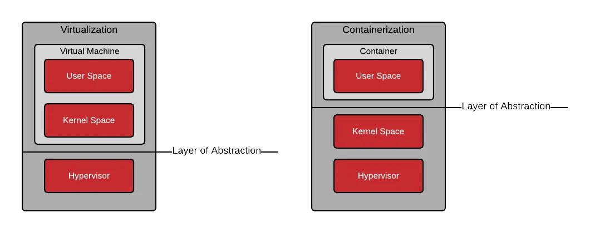

#### 인덱스
- [도커](#도커)
- [이미지와 컨테이너](#이미지와-컨테이너)
- [이미지 레이어 및 유니온 파일 시스템](#이미지-레이어-및-유니온-파일-시스템)
- [Buildx와 BuildKit](#buildx와-buildkit)
- [도커 파일과 빌드 명령어](#도커-파일과-빌드-명령어)
- [빌드 컨텍스트와 `.dockerignore`](#빌드-컨텍스트와-dockerignore)
- [멀티 스테이지 빌드](#멀티-스테이지-빌드)
- [빌드 인자와 환경 변수](#빌드-인자와-환경-변수)
- [비밀 변수](#비밀-변수)
- [참고 문서 및 이미지 출처](#참고-문서-및-이미지-출처)


## 도커

도커: 컨테이너 안에 소프트웨어를 패키징하고 특정 머신에서 실행할 수 있는 컨테이너화 플랫폼

도커 컨테이너는 호스트 머신의 의존성없이 애플리케이션 코드를 실행하는데 필요한 코드, 의존성, 라이브러리 등을 모두 포함한 런타임 환경이다

이 컨테이너 런타임은 특정 서버, 로컬 호스트, 클라우드 인스턴스 등 위에서 실행된다

도커 엔진이 깔려있는 곳이라면 기반 시스템 아키텍처가 무엇인지 알지 않아도 호스트 또는 게스트 OS에서 실행될 수 있다
- 호스트 OS: 컴퓨터 하드웨어에서 직접 실행되어 CPU 등의 리소스를 관리하는 OS
- 게스트 OS: 호스트 OS를 기반으로 가상 머신 내부에 설치되어 실행되는 OS

도커 엔진은 리눅스만 지원하며 실제 시스템의 이용 가능한 리소스에 따라 여러 컨테이너를 실행한다

리눅스를 사용하지 않는 시스템, 즉 리눅스가 아닌 OS는 도커 데스크탑에 내장된 경량 리눅스 VM 또는 LinuxKit 기반 경량 커널을 통해 도커 엔진을 실행한다 (그래서 맥이나 윈도우의 경우 도커 테스크탑이 필수임)

도커가 실행하는 **컨테이너 자체**는 **호스트의 리눅스 커널을 공유**하고 **유저랜드만 최종 이미지를 기준으로 구성**한다 -> **OS를 자체적으로 갖지 않고 유저 공간만 제공하는 최소 실행 환경**

**유저랜드(Userland)**: 파일 시스템, 쉘, 패키지, 리눅스 기본 바이너리(유틸리티 등)

서로 다른 시스템/가상 머신 환경에서 다중 컨테이너 배포/스케일링하기 위해 쿠버네티스같은 컨테이너 오케스트레이션을 사용한다


## 도커가 컨테이너를 격리하는 방법

메모리 공간은 크게 **유저 공간**과 **커널 공간**으로 나뉜다

**커널 공간**: CPU, 컴퓨터 리소스를 제어하는 커널을 실행하는 메모리 공간

**유저 공간**: 애플리케이션, 운영체제에서 제공하는 유틸리티, 그래픽 툴 등 커널을 제외한 모든 프로세스가 위치한 메모리 공간

**시스템 콜**: 유저 공간의 프로그램과 커널이 소통할 수 있는 인터페이스

로컬 호스트로부터 데이터를 읽고 쓰는 애플리케이션의 모든 비즈니스 로직은 각 언어에서 제공하는 도구(파이썬 인터프리터, JVM 등)를 통해 시스템 콜 요청을 커널에게 전달한다

자바나 루비, 파이썬 등의 언어로 빌드(컴파일)된 아티팩트에 애플리케이션이 사용하는 시스템 콜들이 내장된다


가상 머신과 컨테이너의 가장 큰 차이점은 커널 공간 패키징 여부이다

가상 머신은 가상 하드웨어, 커널, 유저 공간을 패키징하지만, **컨테이너는 오직 유저 공간만 패키징한다** (애플리케이션과 유저 공간 의존성을 모두 포함한 이미지로 패키징)



가상 머신의 특징 중 하나는 동일한 호스트에서 다른 가상 머신 또는 호스트로부터 격리되어 실행될 수 있다는 것이다

이와 달리 컨테이너는 유저 공간만 관여하므로 가볍지만 기본적으로 가상 머신처럼 분리되지 않고 다른 컨테이너와 호스트의 자원을 공유할 수 밖에 없다

도커는 리눅스에서 제공하는 **cgroup**과 **커널 네임스페이스** 기술을 이용하여 가상 머신처럼 무겁게 커널 공간을 패키징하지 않으면서 환경을 분리할 수 있다

cgroup과 커널 네임스페이스 설정은 **컨테이너 최초 실행 시점**에 `runc/containerd`가 컨테이너 호스트(컨테이너를 실행시키는 로컬 호스트)에게 커널에 `clone()` 시스템 콜을 호출하면서 수행된다

`clone()` 시스템 콜은 새로운 프로세스를 만들면서 **cgroup**, **커널 네임스페이스**를 설정할 수 있게 해준다 (이와 달리 `fork()`는 새로운 프로세스만 생성함)

**커널 네임스페이스**는 하나의 커널 안에서 리소스의 **"보이는 범위"**를 격리하는 메커니즘이다 (호스트의 물리적 자원을 분배하는 것이 아님)

각 프로세스는 네임스페이스 객체를 가리키는 포인터를 통해 호스트의 리소스를 볼 수 있다

리눅스 시스템이 부팅될 때 하나의 **"initial namespace"** 세트가 만들어지며 모든 프로세스는 이 단일 네임스페이스 세트를 이용한다

컨테이너 프로세스에 새로운 네임스페이스를 할당하여 커널 자원을 다르게 보이게 만들면 컨테이너 간/호스트-컨테이너 간 환경을 격리할 수 있다

커널 네임스페이스는 커널 객체로 자원 별로 고유한 리소스 뷰를 가진다
- **PID 네임스페이스**: 프로세스 ID 공간 분리 (PID 1부터 자기만의 프로세스 트리가 시작됨 - 호스트에서는 컨테이너 프로세스를 다른 PID로 바라봄)
- **File Mount 네임스페이스**: 파일 시스템 마운트 테이블 분리 (루트 디렉토리 구조를 변경하거나 특정 디렉토리를 파일 시스템에 마운트해도 호스트에 영향을 주지 않음)
- **Network 네임스페이스**: 네트워크 인터페이스/라우팅/NAT/iptables 등 네트워크 구성 분리 (컨테이너만의 ip 주소, 라우팅 테이블, eth0이 있게 됨)
- **UTS 네임스페이스**: hostname, domain name 분리
- **IPC 네임스페이스**: SystemV IPC, POSIX 메시지 큐 공유 영역을 분리 (컨테이너간 IPC 충돌 방지)
- **USER 네임스페이스**: UID/GID 매핑 분리 (컨테이너에서 root(UID 0)이더라도 호스트에서는 일반 사용자 UID로 매핑할 수 있음)

```c
// 프로세스를 나타내는 구조체
struct task_struct {
    struct nsproxy *nsproxy;
    ...
}
```

```c
// 프로세스가 가지고 있는 네임스페이스 포인터
// PID, 마운트, 네트워크 등 자원 별로 네임스페이스를 가진다
struct nsproxy {
    struct uts_namespace *uts_ns;
    struct ipc_namespace *ipc_ns;
    struct mnt_namespace *mnt_ns;
    struct pid_namespace *pid_ns;
    struct net *net_ns;
    struct user_namespace *user_ns;
}
```

네임스페이스는 "보이는 리소스"를 분리할 뿐 리소스 사용량 제한은 하지 못한다

논리적으로 분리되어 보여도 실제로는 하나의 커널 리소스를 공유하므로 특정 컨테이너가 자원을 독식하지 못하게 이를 제어해야 한다

그래서 도커는 커널이 관리하는 리소스 제한/할당/추적 시스템인 **cgroup(Control Groups)**을 이용한다

cgroup은 리눅스의 기능으로 CPU, 메모리, I/O, PID 제한 및 리소스 사용량 통계를 보여준다

최종적으로 **네임 스페이스를 통해 호스트와 컨테이너들은 서로 다른 PID, 네트워크, 파일 시스템을 가진 것처럼 보이게 하여 VM 없이 격리된 환경을 제공**하고

**cgroup을 이용하여 각 컨테이너의 리소스 사용량을 강제하여 멀티 테넌트 환경에서 안전성을 보장**한다

도커를 사용하다보면 `node:alpine`, `openjdk:17-alpine`, `nginx:alpine` 등 이미지에 "alpine" 이라는 단어가 포함된 것을 많이 볼 수 있다

Alpine은 리눅스 배포판으로 타 배포판에 비해 훨씬 가볍고 깔끔하여 많이들 이를 기반으로 컨테이너 이미지를 빌드한다


## 이미지와 컨테이너

도커 이미지는 런타임 환경인 컨테이너를 만들 수 있는 파일이다

컨테이너를 실행하기 위해 컨테이너에 로드되는 템플릿, 명령어의 구성으로 볼 수 있다

OOP의 클래스-인스턴스 관계처럼 단일 이미지를 여러 곳에 배포하여 컨테이너를 실행시킬 수 있다

이미지에는 컨테이너를 실행하기 위한 모든 라이브러리, 의존성, 파일 등이 포함된다

**컨테이너 명령어**

```
docker ps -a: 모든 컨테이너 리스팅

docker rename [container] [new_name]: 이름 변경

docker start [container]: 컨테이너 시작

docker stop [container]: 컨테이너 중지

docker wait [container]: 컨테이너 대기 (다른 컨테이너들이 중지할 때까지 대기)
```

**이미지 명령어**

```
docker search <image>: 이미지 검색

docker pull <image>: 이미지 다운로드

docker images: 다운로드한 이미지 리스팅

docker history <image>: 이미지의 모든 레이어 출력(각 레이어 사이즈 및 명령어)

docker inspect <image>: 이미지 상세 정보 JSON 출력

docker build -t <image_name>: 현재 디렉토리에서 주어진 이미지 이름으로 이미지 빌드

docker create [image]: 주어진 이미지를 기반으로 컨테이너 생성(실행 X)

docker run [image]: 주어진 이미지를 기반으로 컨테이너 생성 및 실행
```

### 이미지와 컨테이너 차이

#### 1. 소스

이미지는 **Dockerfile** 이라고 하는 **이미지 빌드 명령어가 포함된 구성 파일**로부터 만들어진다

도커 파일은 이미지를 빌드하기 위해 관련된 의존성과 라이브러리들이 있는 디렉토리에 위치한다

반면 컨테이너는 도커 이미지 파일로부터 직접적으로 만들어진다

#### 2. 레이어

도커 파일은 사이즈를 최적화하기 위해 **여러 이미지 레이어가 쌓인 형태**를 띈다

각 레이어는 파일 시스템 변경 사항을 나타낸다 -> 각 이미지 레이어가 특정 기능을 제공한다


이미지는 다른 이미지를 자신의 이미지 안에 하나의 레이어로 포함시킬 수 있다

즉, 이미지를 재사용하여 설정 파일을 간소화하고 스토리지 공간을 효율적으로 사용할 수 있다

이와 달리 컨테이너는 이미지 레이어 위에 **쓰기 가능한 레이어**라는 추가적인 레이어(컨테이너 레이어)를 가진다

이 레이어는 동일한 이미지를 기반으로 만들어진 컨테이너 간 변경사항을 격리하여 저장할 수 있게 한다

### 3. 변경 가능성

**이미지는 불변이므로 한 번 만들어지면 절대 수정할 수 없다** -> 변경사항이 발생하면 새로운 이미지를 만들어야 한다

컨테이너는 변경 가능하여 런타임에 수정사항을 반영할 수 있다 -> 다른 컨테이너로부터 격리된 변경사항 반영 및 이미지에 영향 전파 X


## 이미지 레이어 및 유니온 파일 시스템

도커의 이미지는 여러 개의 이미지로 구성된다

각 레이어는 도커 파일 내의 **빌드 명령어를 수행한 결과**이자 **이전 레이어의 변경 사항을 나타내는 델타**로 순차적으로 쌓이게 된다

스택처럼 쌓이므로 가장 맨 위의 빌드 명령어가 이미지 레이어 중 맨 아래의 레이어가 되며, 마지막 명령어가 맨 위의 레이어가 된다

여러 레이어를 하나의 이미지처럼 보이게 해주는 것은 **Content-addressable storage(내용 기반 주소체계)**, **Union filesystem(여러 디렉토리를 하나로 합쳐 보이는 기술)** 덕분이다

도커가 이미지를 pull할 때 **이미지 레이어들은 tar 형태로 내려받은 뒤 레이어별로 별도의 디렉토리에 저장**되는 것을 볼 수 있다

OverlayFS를 사용하는 리눅스에는 아래와 같이 저장된다

**리눅스가 아닌 운영체제는 호스트 파일 시스템에 직접 레이어를 저장하는 대신 도커 데스크탑이 내부적으로 실행하는 리눅스 VM 안에 저장된다** (도커 데스크탑은 경량 리눅스 VM을 띄우고 그 안에 리눅스용 도커 엔진을 실행한다)

```text
/var/lib/docker/overlay2/<layer ID>/diff/
/var/lib/docker/overlay2/<layer ID>/link
/var/lib/docker/overlay2/<layer ID>/lower
```

각 레이어는 **내용 기반 주소(sha256 해시)**로 식별되기 때문에 같은 레이어를 재사용할 수 있다

레이어마다 별도의 디렉토리에 저장되며 sha256 해시값을 통해 고유의 레이어를 식별할 수 있다 -> 동일한 레이어가 로컬에 저장되어 있으면 pull할 목록에서 생략된다 (빌드 속도 증가)

유니온 파일 시스템은 여러 디렉토리를 위아래로 덧붙여 사용자가 볼 때 하나의 디렉토리처럼 보이게 하는 기술이다

도커는 **컨테이너를 실행할 때 유니온 파일 시스템을 이용하여 이미지의 레이어들을 위에서 아래로 합쳐서 하나처럼 보이게 한다**

그리고 도커가 `chroot`를 사용하여 **유니온 파일시스템 디렉토리를 컨테이너의 루트로 등록**한다

이후 사용자가 컨테이너 안에서 `ls`하면 이 디렉토리가 루트로 보이게 된다

최종적으로 **레이어가 10개면 호스트의 파일 시스템에선 10개의 디렉토리로 분리되어 저장되지만, 컨테이너의 파일 시스템에선 "/" 루트 하나만 존재하는 것처럼 보인다**

```text
[ Layer 1: base OS       ] (read-only)
[ Layer 2: runtime       ] (read-only)
[ Layer 3: app files      ] (read-only)
[ Container writable     ] (read-write)
----------------------------------------
=> UnionFS로 합쳐서 하나의 루트("/")로 제공
```

**이미지 레이어를 모두 합친 뒤 그 위에 쓰기 가능한 레이어(컨테이너 레이어)를 덧붙여 원래 이미지 레이어는 유지하면서 변경된 파일만 컨테이너 레이어에 저장한다**

-> 같은 이미지로부터 여러 컨테이너를 실행해도 서로 영향을 주지 않고 독립적으로 동작할 수 있다

```text
/
├─ bin/
├─ lib/
├─ app/
└─ 사용자가 만든 파일들 (컨테이너 레이어)
```

## Buildx와 BuildKit

도커를 통해 컨테이너 이미지를 만들려면 애플리케이션 컨텍스트(소스 코드, 의존성, 리소스 등)를 빌드 엔진에게 전달해야 한다

이 때 도커는 클라이언트-서버 아키텍처를 이용한다
- 클라이언트: 사용자의 빌드 실행 및 관리에 대한 인터페이스를 제공하는 **Buildx**
- 서버: 실제로 이미지 빌드를 수행하는 빌더 데몬 프로세스 **BuildKit**

Buildx는 빌드 실행뿐만 아니라 아니라 BuildKit 백엔드를 생성/관리, 레지스트리의 이미지 관리, 동시 빌드 수행 기능도 지원한다 (**BuildKit**을 **빌더**라고도 함)

Buildx와 BuildKit은 기본적으로 도커 데스크탑 및 도커 엔진과 함께 설치된다

**빌드 과정**
- 1. 사용자 `docker build` 명령어 사용 (`docker build`, `docker buildx build`, `docker builder build`, `docker image build` 모두 동일)
- 2. Buildx -> 사용자 빌드 명령어 해석 후 BuildKit에게 빌드 요청 전송
- 3. BuildKit: 빌드 명령어 해석, 빌드 스테이지 처리
- 4. 빌드 출력값를 클라이언트에게 전달하거나 도커 허브같은 레지스트리에 업로드

**Buildx -> BuildKit의 빌드 요청 정보**
- 도커 파일
- 빌드 명령어 인자(옵션)
- 출력 옵션
- 캐싱 옵션

BuildKit이 이미지를 빌드하는 동안 Buildx는 빌드 상태를 모니터링하고 터미널에 진행 상황을 출력한다

빌드를 수행하다가 로컬 파일 시스템, 비밀, SSH 소켓, 레지스트리 인증 토큰 등의 리소스를 필요로 하면 BuildKit은 Buildx에게 리소스 요청을 보낸다 (이전의 레거시 빌더는 모든 로컬 파일 시스템을 복사하여 비효율적이었음)


## 도커 파일과 빌드 명령어

도커 이미지 빌드는 도커 파일로부터 시작된다

도커 파일은 `Dockerfile`이라는 이름을 가진 사용자의 소스 코드를 빌드하기 위한 빌드 명령어가 담겨있는 텍스트 파일이고, 도커 빌드(BuildKit)가 이 파일을 읽으면서 빌드를 수행한다

도커 파일을 시나리오에 따라 여러 개 사용해야 되는 경우 주로 `<something>.Dockerfile` 컨벤션으로 네이밍을 한다

```text
.
├── index.ts
├── src/
├── docker
    ├── build.Dockerfile
    ├── test.Dockerfile
    └── deploy.Dockerfile
```

그리고 `docker build --file <something>.Dockerfile` 명령어로 빌드할 도커 파일 이름을 명시한다

`docker build --file docker/build.Dockerfile .`: `docker/build.Dockerfile` 도커 파일 명시 및 현재 디렉토리를 빌드 컨텍스트로 지정

**도커 파일에서 주로 사용하는 빌드 명령어**

```dockerfile
FROM <image>        # 이미지 베이스 정의

RUN <command>       # 현재 이미지의 새로운 상위 레이어에서 쉘 명령 수행 후 결과 커밋

WORKDIR <directory> # 컨테이너 파일 시스템에 새로운 디렉토리를 만들고 그 곳으로 이동
                    # 이 명령어 아래에 있는 RUN, CMD, ENTRYPOINT, COPY, ADD 명령어들의 워킹 디렉토리 설정

COPY <src> <dest>   # 새 파일/디렉토리를 복사하여 컨테이너 파일시스템의 dest 경로에 추가 (src에 로컬 빌드 컨텍스트의 파일 시스템 지정 가능)

CMD <command>       # 컨테이너가 시작될 때 단 한번 실행될 프로그램 지정 
                    # 도커 파일에 CMD를 한 번만 사용할 수 있으며 여러 개가 있는 경우 맨 마지막이 사용됨
```

**명령어 형식**
- 쉘 형식: `CMD flask run --host 0.0.0.0 --port 8000`
- EXEC 형식: `CMD ["flask", "run", "--host", "0.0.0.0", "--port", "8000"]`

[도커 파일 작성 예제](https://docs.docker.com/build/concepts/dockerfile/#example)

[도커 파일 명령어 레퍼런스](https://docs.docker.com/reference/dockerfile/)


## 빌드 컨텍스트와 `.dockerignore`

`docker build`, `docker buildx build` 명령은 도커 파일과 빌드 컨텍스트로부터 컨테이너 이미지를 빌드한다

빌드 컨텍스트는 도커 빌드가 이미지를 빌드하는 동안 접근할 수 있는 파일/디렉토리 목록이다

사용자가 빌드 명령을 입력할 때 이를 지정할 수 있는데, 잘못된 지정으로 인해 빌드 컨텍스트 내에 접근해야 되는 파일이나 디렉토리가 없다면 빌드에 실패한다

```
docker build [OPTIONS] PATH | URL | -  (-는 stdin을 의미함)
                       └──────└─────└─── build context
```

빌드 컨텍스트가 될 수 있는 것들
- **로컬 파일시스템 (절대/상대 경로)**
- **원격 URL**: Git 리포지토리 등
- **tar 아카이브 파일**, **plain 텍스트 파일** (파이핑을 통해 표준 입력으로 전달)

로컬 디렉토리 또는 tar 아카이브 파일 지정 시: **지정한 디렉토리와 서브 디렉토리 모두 포함**

Git 리포지토리 지정 시: **리포지토리와 서브 모듈 모두 포함** (default 브랜치의 HEAD 커밋 클론)

텍스트 파일 지정 시: **빌드 컨텍스트 사용 X** (도커 파일에서 로컬 파일을 사용하지 않는 경우)

Git 리포지토리의 특정 브랜치/커밋/태그/디렉토리를 지정하려면 [URL Fragments](https://docs.docker.com/build/concepts/context/#url-fragments) 또는 [URL queries](https://docs.docker.com/build/concepts/context/#url-queries)를 사용해야 한다

```dockerfile
# 명령을 입력한 현재 디렉토리(.)를 빌드 컨텍스트로 지정한다
docker build -t test-app:latest .

# ./infra/test.Dockerfile 파일을 도커 파일로 지정하고 현재 디렉토리를 빌드 컨텍스트로 지정한다
docker build --file ./infra/test.Dockerfile -t test-app:latest .

# Git 리포지토리 주소를 빌드 컨텍스트로 지정한다
docker build -t test-app:latest https://github.com/hansanhha/test.git

# Git 리포지토리의 container 브랜치의 docker 서브 디렉토리를 빌드 컨텍스트로 지정한다
docker build -t test-app:latest https://github.com/hansanhha/test.git#container:docker

# 빌드 컨텍스트 없이 빌드한다
docker build - < Dockerfile
```

### 네임드 빌드 컨텍스트

일반적으로 `docker build .`를 수행하면 현재 워킹 디렉토리가 기본 컨텍스트로 지정된다

도커는 기본 컨텍스트외에 **추가적인 컨텍스트를 지정할 수 있도록 하여 빌드 수행 중 다양한 소스(로컬 파일 시스템, URL 등)로부터 파일과 디렉토리를 접근하면서 이들을 논리적으로 분리시킨다**

이 기능을 네임드 컨텍스트라고 한다

네임드 컨텍스트는`--build-context` 플래그 뒤에 이름-값 쌍의 형태로 지정된다

```shell
# docs 컨텍스트: 현재 워킹 디렉토리의 docs 서브 디렉토리
# 기본 컨텍스트: 현재 워킹 디렉토리
docker build --build-context docs=./docs .
```

#### 유즈케이스 1. 네임드 컨텍스트의 파일을 빌드에 포함시켜 특정 작업을 수행한다

네임드 컨텍스트는 도커 파일 내에서 마치 멀티 스테이지 빌드의 단계인 것처럼 참조될 수 있다

```dockerfile
# syntax=docker/dockerfile:1
FROM buildbase
WORKDIR /app

# 기본 컨텍스트의 모든 파일을 컨테이너 파일 시스템의 /app/src/ 경로에 복사한다
COPY . /app/src
RUN make bin

# 문서를 생성하기 위해 docs 네임드 컨텍스트의 파일들을 /app/docs 경로에 마운트한다
# --mount=from 옵션은 특정 스테이지나 이미지의 파일 시스템을 읽기 전용으로 가져올 때 사용한다
# 특정 네임드 컨텍스트의 파일들을 컨테이너의 파일 시스템에 마운트할 때도 사용한다
RUN --mount=from=docs,target=/app/docs \
    make manpages
```

#### 유즈케이스 2. 로컬과 원격 리포지토리의 파일을 컨텍스트에 포함시킨다

소스 코드는 로컬 파일 시스템에 있고 특정 스크립트가 원격 리포지토리에 있는 경우 아래와 같이 네임드 컨텍스트를 사용하여 이미지를 빌드할 수 있다

```shell
# scripts 컨텍스트: 깃허브 리포지토리
# 기본 컨텍스트: 현재 워킹 디렉토리
docker build --build-context scripts=https://github.com/hansanhha/deploy.git .
```

```dockerfile
# syntax=docker/dockerfile:1
FROM alpine:latest

# 기본 컨텍스트의 모든 파일을 컨테이너 파일 시스템의 /opt/app 경로에 복사한다
COPY . /opt/app

# scritps 네임드 컨텍스트(깃허브 리포지토리)의 파일들을 /scripts 경로에 마운트하고 쉘 스크립트를 실행한다
# --mount=from 옵션은 특정 스테이지나 이미지의 파일 시스템을 읽기 전용으로 가져올 때 사용한다
# 특정 네임드 컨텍스트의 파일들을 컨테이너의 파일 시스템에 마운트할 때도 사용한다
RUN --mount=from=scripts,target=/scripts /scripts/main.sh
```

#### 유즈케이스 3. 네임드 컨텍스트의 값을 변경하여 동적으로 빌드한다

컨텍스트 이름은 고정한 채로 값을 변경하여 동적으로 도커 이미지를 빌드할 수 있다

```shell
# config 컨텍스트: 현재 워킹 디렉토리의 configs/prod 디렉토리
# configs/staging, configs/test 등 동적으로 네임드 컨텍스트 값을 변경할 수 있다
docker build --build-context config=./configs/prod .
```

```dockerfile
# syntax=docker/dockerfile:1
FROM nginx:alpine

# 프로파일 별 config 컨텍스트 사용
COPY --from=config nginx.conf /etc/nginx/nginx.conf
```

#### 유즈케이스 4. 이미지 고정 또는 오버라이드

도커 파일의 내용을 수정하지 않고 이미지를 고정하거나 오버라이드할 수 있다

```shell
# alpine:3.21 컨텍스트: 이미지 지정
# docker-image:// 는 이미지 참조를 의미한다 (로컬 또는 레지스트리 이미지 참조)
docker buildx build --build-context alpine:3.21=docker-image://alpine:edge .
```

```dockerfile
# alpine:3.21 컨텍스트에 지정된 이미지를 베이스로 설정한다
FROM alpine:3.21
```

#### Bake를 이용한 네임드 컨텍스트

[공식 문서 참고](https://docs.docker.com/build/concepts/context/#named-contexts-with-bake)

### `.dockerignore`

[`.dockerignore` 문법](https://docs.docker.com/build/concepts/context/#syntax)

`.dockerignore` 파일은 파일과 디렉토리를 빌드 컨텍스트에서 제외시키기 위해 사용된다

지정된 컨텍스트의 루트에서 위치해야 하며 **빌드 클라이언트(Buildx)가 도커 빌더(BuildKit)에게 빌드 요청을 보내기 전 지정된 패턴에 매치되는 파일과 디렉토리를 빌드 컨텍스트에서 제거**한다

주로 원격 URL 빌드 컨텍스트 사용할 때 빌드 속도를 향상시킬 수 있다

```
# .dockerignore
node_modules
bar
```

여러 개의 도커 파일을 사용하는 경우 `.dockerignore` 파일은 아래와 같이 해당 도커 파일과 같은 디렉토리에 위치하고 동일한 접두사를 사용해야 한다

특정 도커 파일을 사용할 때 빌드 컨텍스트의 루트에 `.dockerignore` 파일이 있는 경우 이보다 더 높은 우선순위가 적용된다

```text
.
├── index.ts
├── src/
├── docker
│   ├── build.Dockerfile
│   ├── build.Dockerfile.dockerignore
│   ├── lint.Dockerfile
│   ├── lint.Dockerfile.dockerignore
│   ├── test.Dockerfile
│   └── test.Dockerfile.dockerignore
├── package.json
└── package-lock.json
```


## 멀티 스테이지 빌드

`FROM` 빌드 명령어는 빌드 스테이지의 베이스를 정의하는데, 이를 여러 번 사용하면 각각 새로운 빌드 스테이지를 시작한다

이전 빌드 스테이지에서 특정 아티팩트를 복사해오거나 최종 이미지에 원치 않는 것들을 포함시키지 않을 수 있다

```dockerfile
# 빌드 스테이지 네이밍 "build"
FROM golang:1.24 AS build 
WORKDIR /src
COPY <<EOF ./main.go
package main

import "fmt"

func main() {
    fmt.Println("Hello World")
}
EOF

RUN go build -o /bin/hello ./main.go

# 빌드 스테이지 정의
FROM scratch

# "build" 스테이지의 아티팩트를 현재 빌드 스테이지("scratch")에 복사한다
COPY --from=build /bin/hello /bin/hello 
CMD ["/bin/hello"]

# 최종 이미지에는 바이너리 파일만 포함되며 "build" 스테이지의 Go SDK는 제외된다
```

```dockerfile
# 로컬 이미지, 도커 레지스트리의 이미지를 복사할 수도 있다 (필요한 경우 도커가 pull함)
COPY --from=nginx:latest /etc/nginx/nginx.conf /nginx.conf
```

```dockerfile
# builder 스테이지 정의
FROM alpine:latest AS builder
RUN apk --no-cache add build-base

# 이전 builder 스테이지를 새로운 스테이지로 사용
FROM builder AS build1
COPY source1.cpp source.cpp
RUN g++ -o /binary source.cpp

# 이전 builder 스테이지를 새로운 스테이지로 사용
FROM builder AS build2
COPY source2.cpp source.cpp
RUN g++ -o /binary source.cpp
```

### 특정 빌드 스테이지만 빌드하기

```shell
# 도커 파일 전체를 빌드하는 대신 build 스테이지까지만 빌드한다
docker build --target build -t hello .
```

아래의 도커 파일은 `base` 스테이지를 정의하고 `stage1`과 `stage2` 스테이지가 각각 `base`를 의존한다

```dockerfile
FROM ubuntu AS base
RUN echo "base"

FROM base AS stage1
RUN echo "stage1"

FROM base AS stage2
RUN echo "stage2"
```

이 때 도커 레거시 빌드를 사용하여 `stage2`까지 빌드하면 모든 스테이지가 처리된다

```shell
DOCKER_BUILDKIT=0 docker build --target stage2 .
```

이와 달리 BuildKit을 사용하여 `stage2`까지 빌드하면 의존하고 있는 `base`만 빌드 처리 대상에 포함되고 `stage1`은 스킵된다

```shell
DOCKER_BUILDKIT=1 docker build --target stage2 .
```


## 빌드 인자와 환경 변수

주의

**빌드 인자와 환경 변수는 최종 이미지에 노출되기 때문에 비밀 값을 전달하기에 부적합하다**

대신 **비밀 마운트**나 **SSH 마운트**를 통해 빌드 시 안전하게 비밀 값을 전달할 수 있다

빌드 인자와 환경 변수는 도커 파일에 명시하고 `docker build` 명령의 플래그로 값을 전달함으로써 빌드를 파라미터화할 수 있다

[미리 정의된 빌드 인자](https://docs.docker.com/build/building/variables/#pre-defined-build-arguments)

[빌드 도구(BuildKit 등) 설정 변수](https://docs.docker.com/build/building/variables/#build-tool-configuration-variables)

**빌드 인자**: 도커 파일 자체에서 사용되며 기본적으로 컨테이너에서 접근할 수 없다. 이미지 메타데이터에 표시된다

```dockerfile
# 빌드 인자 정의, ARG 명령어
ARG NODE_VERSION="20"     # 빌드 인자 및 기본 값 설정
ARG ALPINE_VERSION="3.21"

# 빌드 인자 사용 ${build argument name}
FROM node:${NODE_VERSION}-alpine${ALPINE_VERSION} AS base
```

```dockerfile
# --build-arg 플래그에 "키=값" 형태로 빌드 인자를 전달할 수 있다
docker build --build-arg NODE_VERSION=current .
```

**환경 변수**: 빌드 실행 환경에서 사용되며 컨테이너의 환경 변수로 설정된다 - 보통 빌드 실행이나 컨테이너(애플리케이션)의 동작을 조정하기 위해 사용됨

```dockerfile
FROM node:20
COPY package.json ./
ENV NODE_ENV=production  # 환경 변수 정의
```

기본적으로 환경 변수는 빌드 인자와 다르게 빌드 시 값을 설정할 수 없다

대신 빌드 인자를 환경 변수 값으로 설정할 수 있는데, 이를 이용하면 빌드 시점에 환경 변수 값을 바꿀 수 있다

```dockerfile
FROM node:20
COPY package.json ./

ARG NODE_ENV=production  # 빌드 인자 NODE_ENV 및 기본 값 정의
ENV NODE_ENV=$NODE_ENV   # 환경 변수 NODE_ENV 정의
```

```shell
# 빌드 인자를 통해 환경 변수를 빌드 시점에 변경한다
docker build --build-arg NODE_ENV=development .
```

### 빌드 인자와 환경 변수 상속

글로벌 스코프에 선언된 빌드 인자와 환경 변수는 오직 글로벌 스코프에서만 접근할 수 있다

만약 빌드 스테이지를 상속한 경우라면 자식 스테이지는 부모 스테이지에서 선언한 빌드 인자와 환경 변수를 그대로 상속받는다


## 비밀 변수

비밀 변수는 데이터베이스 연결 정보, API 토큰 등 애플리케이션에서 다루는 민감한 정보를 전달하기 위해 사용한다

빌드 인자와 환경 변수는 레이어 캐시, 이미지 히스토리, 최종 이미지에 포함되기 떄문에 이들을 사용하는 건 부적절하다

비밀 변수를 이용하는 방법으로 Secret 마운트, SSH 마운트, Git authentication for remote contexts가 있다
- **Secret 마운트**: 빌드 명령어를 처리하는 동안에만 임시로 파일 형태로 마운트되어 비밀 변수를 사용하는 방법 (프라이빗 아티팩트 서버나 API와 통신하는 경우 사용)
- **SSH 마운트**: 빌드 안에서 SSH 소켓 또는 키를 만드는 방법 (프라이빗 Git 리포지토리를 페치하는 경우 사용)
- **Git authentication for remote contexts**: 원격 컨텍스트를 가져오기 위한 자격증명을 제공하는 경우 사용

### Secret 마운트

Secret 마운트를 통해 비밀 변수를 전달하면 이미지 레이어, 도커파일 내부, 최종 이미지에 저장되지 않으며 빌드 완료 후 완전히 사라진다

파일 전달: `docker build --secret id=<ID>,src=<FILE PATH>`

환경 변수 전달: `docker build --secret id=<ID>,env=<ENV>`

파일 또는 환경변수를 Secret으로 전달하면 도커 파일 빌드 명령어에서 `/run/secrets/<id>` 경로로 임시적으로 접근할 수 있다

`docker build --secret id=<ID>`를 입력하는 경우 해당 `id`값을 환경변수로 취급하며 `/run/secrets/<id>` 경로를 통해 곧바로 환경변수에 접근한다

```shell
docker build --secret id=aws,src=$HOME/.aws/credentials .

# 다중 Secret 전달
docker build \
  --secret id=token,src=./token.txt \
  --secret id=npmrc,src=./.npmrc \
  --secret id=db_pw,env=DB_PASSWORD \
  .
```

```dockerfile
# --mount=type=secret 플래그로 Secret에 접근할 수 있다
# 접근할 Secret id와 경로(/run/secrets/<id>)를 명시한다
RUN --mount=type=secret,id=aws \
    AWS_SHARED_CREDENTIALS_FILE=/run/secrets/aws \
    aws s3 cp ...
```

**동작 과정**
- 1. BuildKit(빌드 클라이언트)이 `$HOME/.aws/credentials` 내용을 메모리 기반 임시 파일로 준비한다
- 2. secret은 `/run/secrets/<id>` 경로에 마운트된다 (`/run/secrets/aws`)
- 실제 파일 시스템이 아니며, 호스트/컨테이너 어느 쪽에도 영구 저장되지 않는다
- 3. `RUN --mount=type=secret` 명령이 실행되는 동안 일시적으로만 접근할 수 있다
- 4. `RUN` 명령이 끝나면 마운트도 사라져 더이상 접근할 수 없게 된다
- 이미지 레이어와 히스토리에 secret이 남지 않는다


비밀 변수로 파일이나 환경 변수를 사용할 수 있는데

이 때 `id` 값은 도커 파일 내에서 `/run/secrets/<id>`로 접근할 수 있으며, 값으로 파일이나 환경 변수를 지정할 수 있다 (CLI나 Bake를 사용하면 타입을 자동으로 감지함)

### SSH 마운트

SSH 마운트는 빌드 내에서 SSH 소켓이나 키를 필요로 하는 경우에 유용하다

일반적으로 프라이빗 Git 리포지토리를 클론하는데 사용된다

```dockerfile
# syntax=docker/dockerfile:1
FROM alpine
ADD git@github.com:hansanhha/test-app.git /src/
```

```shell
# --ssh 플래그를 통해 SSH 소켓을 빌드로 전달한다
docker buildx build --ssh default .
```


## 빌드 캐시

도커 파일의 각 명령어는 하나의 레이어를 나타낸다 (마지막 빌드 스테이지를 기반으로 만들어진 최종 이미지 기준)

각 레이어는 이전 레이어를 기반으로 컨텐츠(파일 시스템 변경 등)를 추가한다


**처음 빌드가 완료된 후 다시 빌드하면 도커는 각 명령에 대해 이전과 동일한 입력값일 경우 해당 명령이 생성한 레이어를 그대로 사용한다**

입력값: 도커 파일 명령 문자열, 이전 레이어의 digest, 캐시 키, 빌드 컨텍스트(`COPY`, `ADD` 관련)

주요 빌드 명령에 대한 동일 입력 값 판단 기준
- `FROM`: 기반 이미지의 digest를 캐시 키로 사용
- `RUN`: `RUN` 명령 문자열 전체, 이전 레이어 ID, 환경 변수/WORKDIR 등
- `COPY`, `ADD`: 대상 파일들의 파일 내용 해시, 대상 경로, 이전 레이어 해시
- `ENV`, `WORKIDR`, `CMD`, `ENTRYPOINT` 등: 명령 문자열, 이전 레이어 해시

**만약 특정 명령에서 변경사항이 발생하면 도커는 이전 레이어를 재사용하지 않고 이 명령부터 그 이후에 따라나오는 모든 명령을 무조건 재빌드한다**

이를 **캐시 무효화(cache invalidation)**라고 한다


[캐시 무효화 규칙](https://docs.docker.com/build/cache/invalidation/)

[캐시 최적화](https://docs.docker.com/build/cache/optimize/)

BuildKit은 기본적으로 내부 캐시에 빌드 결과를 저장하는데 CI/CD 환경에서 빌드 캐시를 이용할 수 있도록 외부에 빌드 캐시를 내보내고 불러올 수 있는 **캐시 백엔드** 기능을 지원한다

[캐시 백엔드](https://docs.docker.com/build/cache/backends/)

### `--no-cache` 플래그

```shell
# --no-cache 플래그를 통해 빌드 캐시를 사용하지 않고 모든 명령을 재빌드한다
# 보통 의존성의 패치 버전을 업데이트하기 위해 사용한다
docker build --no-cache -t test-app:latest .
```


## 자바 관련 이미지


## 참고 문서 및 이미지 출처

https://aws.amazon.com/compare/the-difference-between-docker-images-and-containers/

https://docs.docker.com/get-started/docker-concepts/the-basics/what-is-an-image/

https://docs.docker.com/get-started/docker-concepts/building-images/understanding-image-layers/

https://docs.docker.com/build/concepts/overview/

https://docs.docker.com/build/concepts/dockerfile/

https://docs.docker.com/build/cache/

https://www.redhat.com/en/blog/architecting-containers-part-1-why-understanding-user-space-vs-kernel-space-matters

https://www.redhat.com/en/blog/architecting-containers-part-2-why-user-space-matters

https://www.redhat.com/en/blog/architecting-containers-part-3-how-user-space-affects-your-application

https://www.linfo.org/user_space.html