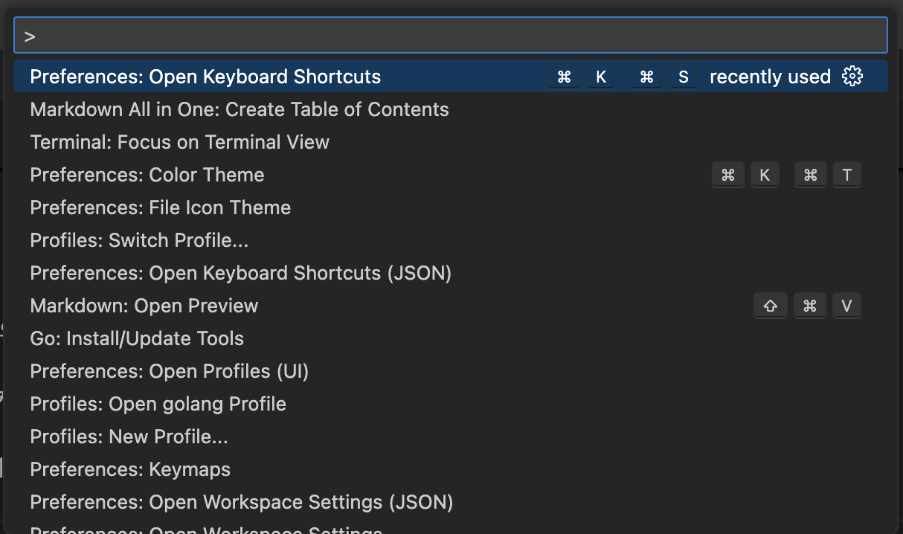

#### 목차
- [공식 문서](#공식-문서)
- [커맨드 팔레트](#커맨드-팔레트)
- [인터페이스](#인터페이스)
- [커스터마이징](#커스터마이징)
- [디버깅](#디버깅)
- [테스트](#테스트)
- [태스크](#태스크)
- [전체 단축키](#전체-단축키)
- [사이드바 단축키](#사이드바-단축키)
- [에디터 단축키](#에디터-단축키)
- [패널 단축키 (터미널, 디버그 콘솔 등)](#패널-단축키-터미널-디버그-콘솔-등)


## 공식 문서

[기본 에디터 편집](https://code.visualstudio.com/docs/editing/codebasics)

[인텔리젠스](https://code.visualstudio.com/docs/editing/intellisense)

[코드 내비게이션](https://code.visualstudio.com/docs/editing/editingevolved)

[워크스페이스](https://code.visualstudio.com/docs/editing/workspaces/workspaces)


## 커맨드 팔레트

커맨드 팔레트는 키보드를 통해 모든 vscode의 기능에 접근하고 실행할 수 있게 해주는 인터페이스이다

vscode의 익스텐션(확장 기능)을 설치하면 커맨드 팔레트에 익스텐션에서 제공하는 명령이 추가되어 이를 통해 사용할 수 있다

### 명령, 파일 검색

vscode는 파일이나 명령을 찾는데 fuzzy matching을 사용하여 `odks`를 입력하면 `Open Default Keyboard Shortcuts` 명령을 찾을 수 있다

`cmd + shift + p`를 누르면 커맨드 팔레트가 뜨는데 `>` 기호가 입력 값을 기반으로 명령 리스트를 필터링해준다




`>` 기호가 없으면 현재 워크스페이스에 있는 파일을 찾는 기능으로 바뀌며 `cmd + p`로 바로 찾을 수도 있다


### 접두사

`>` 처럼 커맨드 팔레트에 특정 기호가 접두사로 붙여지면 특정 목적에 따라 커맨드 팔레트를 이용할 수 있다

`>` (`cmd + shift + p`): vscode에서 제공하는 모든 명령을 검색하거나 실행할 수 있다

`@` (`cmd + shift + o`): 현재 파일 내의 함수, 변수 등 기호들을 검색하고 해당 위치로 바로 이동할 수 있다 (`Ctrl + f`로 번거롭게 일일이 찾을 필요가 없다)

`#`: 워크스페이스 내의 파일 내용 중 주어진 기호가 포함된 파일을 검색한다

`:` (`ctrl + g`): 현재 파일의 특정 라인으로 이동한다

`?`: 커맨드 팔레트로부터 실행할 수 있는 명령어를 표시한다


## 인터페이스


### 사이드바

왼쪽의 사이드바를 Primary Sidebar, 오른쪽의 사이드바를 Secondary Sidebar이라고 부른다

기본 제공 사이드바(뷰) 종류
- 익스플로러(`cmd + shift + e`): 워크스페이스 디렉토리/파일 목록 표시
- 검색(`cmd + shift + f`): 워크스페이스 파일 전역 검색 또는 대체(replace)
- 소스 관리(`ctrl + shift + g`): git 기능 (vscode는 git을 내장하고 있다)
- 실행/디버그(`cmd + shift + d`): 실행/디버그 변수, 호출 스택, 브레이크 포인트 등 표시
- 익스텐션(`cmd + shift + x`): 확장 기능 관리

세컨더리 사이드바: `cmd + option + b`

패널: `cmd + j`

`> View: Open View`로 vs code가 제공하는 뷰 뿐만 아니라 확장 기능을 통해 추가한 뷰 등을 열 수 있다

#### 익스플로러 뷰 상세


**COMPUTER-NINJA**: 현재 워크스페이스에서 열린 폴더

**OUTLINE**: 현재 활성화된 에디터의 심볼 트리 표시 (소스 파일이라면 함수/메서드, 마크다운 파일은 헤더 계층 표시)

**TIMELINE**: 파일 변경사항 표시 (로컬 파일 히스토리, `workbench.localHistory`로 설정 가능)

참고로 vscode는 `.git`, `.DS_Store` 같은 특정 파일들을 자동으로 익스플로러 뷰 g 목록에서 제외한다

`files.exclude` 설정 값을 통해 표시 목록에 제외할 파일 (glob 패턴)을 지정할 수 있다


## 커스터마이징

사용자는 vscode의 설정 에디터(`cmd + ,`)에서 설정 값을 바꾸거나 `settings.json` 파일을 수정하여 vscode의 모든 부분을 커스터마이징할 수 있다

유저 설정은 모든 워크스페이스에서 적용되는 전역 설정 값이고, 워크스페이스 설정은 특정 프로젝트나 폴더에만 적용된다

유저 `.settings.json` 파일은 `~/Library/Application Support/Code/User/settings.json` 에 위치한다

워크스페이스 `.settings.json` 파일은 현재 디렉토리의 `.vscode/settings.json`에 위치하며 유저 파일의 설정값을 오버라이딩 한다 (설정 공유하기 좋음)

단축키 설정은 `keybindings.json` 파일을 통해 할 수 있으며, 이 파일도 유저/워크스페이스 범위로 나눌 수 있다

```json
{
    // 공통 설정
    "files.autoSave": "afterDelay",
    "diffEditor.renderSideBySide": false,

    // 언어 별 설정
    "[typescript]": {
        "editor.formatOnSave": true,
        "editor.formatOnPaste": true
    },

    "[javascript][typescript]": {
      "editor.maxTokenizationLineLength": 2500
    },

    "[markdown]": {
        "editor.formatOnSave": true,
        "editor.wordWrap": "on",
        "editor.renderWhitespace": "all",
        "editor.acceptSuggestionOnEnter": "off"
    }

}
```


### 레아아웃 커스터마이징

타이틀바 쪽에 위치한 커스터마이즈 레이아웃 버튼을 통해 사이드바, 커맨드 팔레트 등의 위치를 변경할 수 있다


### 프로파일

프로파일은 커스터마이징 셋으로 여러 워크스페이스와 폴더를 포함할 수 있다

특정 프로그래밍 언어 별로 프로파일을 만들어서 커스터마이징을 해두고 필요에 따라 바꿔가면서 사용할 수 있다 (유저 세팅은 전역이므로 물려받음)

`~/Library/Application\ Support/Code/User/profiles`


## 디버깅

[공식문서](https://code.visualstudio.com/docs/debugtest/debugging)

## 테스트

[공식문서](https://code.visualstudio.com/docs/debugtest/testing)


## 태스크

[공식문서](https://code.visualstudio.com/docs/debugtest/tasks)


## 전체 단축키


## 사이드바 단축키

익스플로러 포커싱: `cmd + shift + e`

사이드바 포커싱: `cmd + 0`

사이브바 감추기: `cmd + b`

익스플로러 내에서 파일 검색: `cmd + option + f` (익스플로러에 포커싱된 상태여야 한다, 방향키로 이동 가능)

## 에디터 단축키

### 에디터 편집

심볼(타입/메서드 등)
- `cmd + shift + o`: 현재 파일 내 심볼 이동
- `cmd + t`: 워크스페이스 심볼 검색 이동
- `option + f12`: 현재 선택한 심볼(타입/메서드 등)을 정의한 코드 표시
- `cmd + click`:  현재 선택한 심볼(타입/메서드 등)을 정의한 코드로 이동
- `cmd + f12`: 구현체 표시
- `shift + f12`: 현재 선택한 심볼(타입/메서드 등)을 사용하는 코드 표시
- `shift + option + f12`: 현재 선택한 심볼(타입/메서드 등)을 정의한 사용하는 코드 표시 (모든 파일에서)
- `f2`: 이름 변경

라인
- `cmd + shift + k`: 커서가 위치한 라인 삭제
- `shift + option + 상하 방향키`: 라인 복사 (인텔리제이 `cmd + d`)
- `option + 상하 방향키`: 라인 이동 (인텔리제이 `option + cmd + 상하 방향키`)
- `ctrl + shift + cmd + 좌우 방향키`: 코드 선택 범위 확대/축소 (인텔리제이 `option + 상하 방향키`)    

커서/단어
- `cmd + option + 상하 방향키`: 커서 여러개 생성
- `cmd + shift + L`: 현재 파일에서 동일한 단어 전체 선택
- `cmd + d`: 현재 파일에서 동일한 단어 순차 선택
- `shift + option + 드래그`: 드래그한 부분만 선택 (여러줄)
- `cmd + k + m`: 현재 에디터에 설정된 언어 변경 (기본값: 자동 감지)

단어 검색/대체
- `ctrl + f`: 검색
- `ctrl + option + f`: 검색 + 대체

코드 조작
- `cmd + k + cmd + x`: 선택한 코드 범위 트림
- `cmd + k + cmd + f`: 선택한 코드 범위 포매팅
- `cmd + option + [`: 코드 접기
- `cmd + option + ]`: 코드 열기

마크다운
- `cmd + shift + v`: 현재 파일 마크다운 프리뷰 (새 탭)
- `cmd + k + v`: 현재 파일 마크다운 프리뷰 (사이드 에디터)

### 실행/디버깅

`cmd + shift + d`: Run and Debug 뷰 포커싱

`f9`: 현재 라인 마킹

### 에디터 포커싱/이동

에디터 포커싱: 사이드바 포커싱 단축키를 한 번 더 누르면 에디터로 포커싱된다 (현재 포커싱이 익스플로러라면 `cmd + shift + e`를 눌러 에디터로 포커싱할 수 있다)

`cmd + option + 좌우 방향키`: 에디터 좌우 이동

`ctrl + -`: 이전으로 이동

`ctrl + shift + -`: 앞으로 이동

`cmd + 1, 2, 3...`: 에디터 그룹 포커싱 옮기기

`ctrl + tab`: 현재 에디터 그룹에서 사용한 파일 리스트 출력 및 이동

`cmd + k + w`: 현재 에디터 그룹의 모든 탭 닫기

`cmd + k + cmd + w`: 모든 에디터 그룹 닫기

`cmd + k + cmd + s`: 키보드 단축키 설정 에디터 열기

### 사이드 에디터 그룹

#### 사이드 에디터 그룹 분리

`cmd + 1,2,3...`: 사이드 에디터 그룹 띄우기

`option + 파일 클릭`: 해당 파일 사이드 에디터 그룹에서 열기

`cmd + \`: 현재 포커싱된 파일 사이드 에디터 그룹에서 열기

`ctrl + enter`: 파일 열기(`ctrl + p`)에서 선택한 파일을 사이드 에디터 그룹에서 열기

#### 사이드 에디터 관리

`cmd + 1, 2, 3...`: 에디터 그룹 포커싱 옮기기

`cmd + w`: 현재 포커싱된 에디터 그룹의 탭 닫기


## 패널 단축키 (터미널, 디버그 콘솔 등)

`cmd + j`: 패널 표시 토글

`cmd + shift + m`: problem 패널 표시

`cmd + shift + u`: 출력창 표시

`cmd + shift + y`: 디버그 콘솔 표시

`ctrl + 백틱`: 터미널 표시