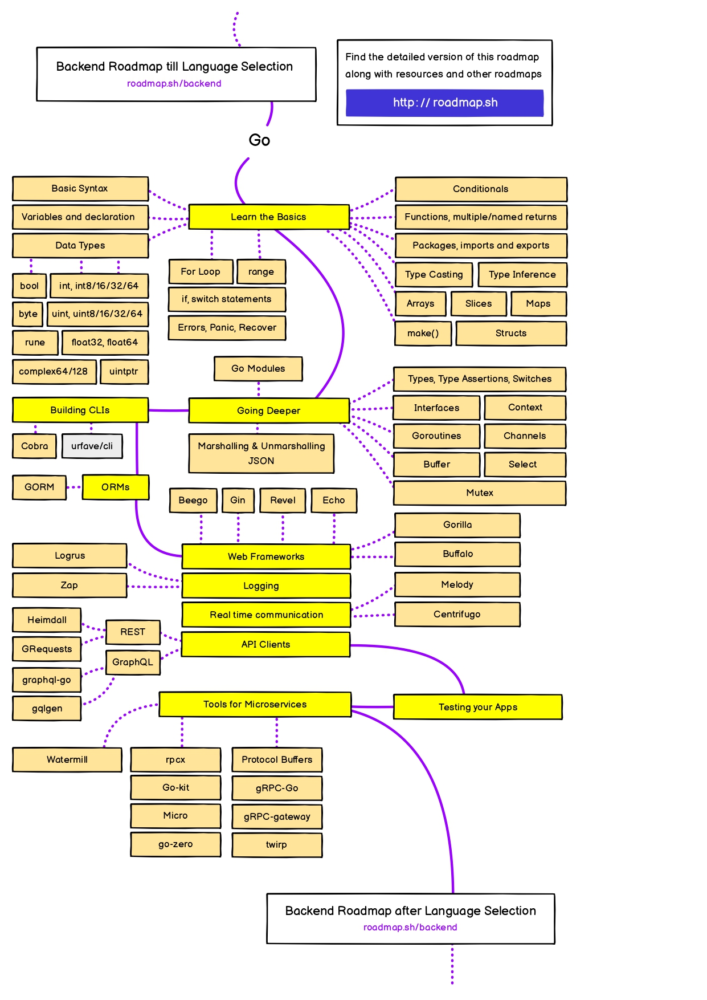

# Go

```shell
$ go version
go version go1.24.4 darwin/arm64
```


## 개념

[기본개념](./docs/기본개념.md)

[Go Toolchain](./docs/Go-Toolchain.md)

[문법](./docs/문법.md)

[타입](./docs/타입.md)

[제네릭](./docs/제네릭.md)

[동시성](./docs/동시성.md)

[입출력](./docs/입출력.md)

[패키지 및 모듈](./docs/패키지%20및%20모듈.md)

[에러 처리](./docs/에러%20처리.md)

[직렬화](./docs/직렬화.md)

[테스트](./docs/테스트.md)

## 예시 코드

[examples](./examples/)

## 레퍼런스

[개념쌓기: Go (Fundamentials) 101](https://go101.org/article/101.html)

[코드 예시: Go by Example](https://gobyexample.com)

[Advanced: Effective Go](https://go.dev/doc/effective_go)

[로드맵](https://roadmap.sh/golang?fl=0)


