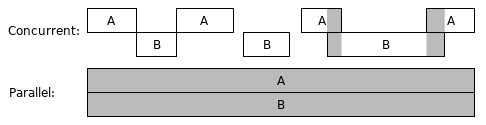
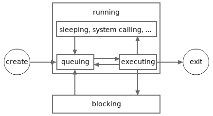

#### 목차

- [고루틴](#고루틴)
- [채널](#채널)

## 고루틴

### 동시성 프로그래밍

현대 CPU의 대부분은 다중 코어로 이루어져 있으며 어떤 CPU 코어는 하이퍼 스레딩도 지원한다

이를 통해 현대 CPU는 동시에 여러 개의 명령(instruction)을 처리할 수 있다

일반적인 프로그램은 단일 코어에서만 실행되는데, 동시성 프로그래밍을 활용하면 프로그램을 다중 코어에서 실행하도록 할 수 있다

동시성 컴퓨팅은 시간의 흐름에 따라 순차적으로 계산하는 것이 아니라 시간이 겹치는 동안 여러 계산을 실행하는 것을 말한다

아래의 그림은 동시성 계산의 종류를 보여준다

첫 번째 경우는 별개의 계산인 A와 B가 짧은 시간 동안만 병렬로 실행되고, 두 번째 경우는 완전히 병렬적으로 계산을 수행한다 (병렬(parallel) 계산이라고 함)



이러한 동시성 컴퓨팅은 프로그램, 컴퓨터, 네트워크에서 일어날 수 있다

고루틴은 Go 언어에서 프로그램 단위의 동시성 컴퓨팅을 수행할 수 있는 방식이다

### 고루틴 사용방법

`func main` 함수로 Go 프로그램을 시작하면 메인 고루틴이라고 하는 하나의 고루틴이 생성되면서 프로그램이 진행된다

함수 호출 시 `go` 키워드를 붙이면 새로운 고루틴을 만들고 해당 고루틴에서 함수를 실행한다

새롭게 만들어진 고루틴은 호출된 함수의 종료와 나란히 종료된다

그리고 고루틴 함수가 반환하는 모든 값은 함수 호출 문에서 완전히 무시되어야 한다 (해당 함수가 값을 반환하는 경우)

```go
func greetings(greeting string, times int) {
 for i := 0; i < times; i++ {
  log.Println(greeting)
  d := time.Second * time.Duration(rand.Intn(3)) / 2
  time.Sleep(d) // 0 ~ 1.5초 동안 유저 스레드 슬립
 }
}


// 메인 고루틴
func main() {

 log.SetFlags(0)

 // 고루틴 2개 생성
 go greetings("hi", 10)   
 go greetings("hello", 10) 

 // 메인 고루틴이 종료되면 전체 프로그램이 종료되어 실행 중인 다른 고루틴도 함께 종료된다
 time.Sleep(2 * time.Second) 
}
```

### Green Thread, MPG 모델

Go에서 모든 동시성 프로그래밍은 고루틴을 통해서만 할 수 있다

고루틴은 Go 런타임에서 유지하고 관리하는 경량 스레드인 Green Thread이다

Green Thread는 운영체제에 의해 유지되거나 관리되지 않아 메모리를 적게 차지하고 컨텍스트 스위칭 비용이 OS 스레드보다 훨씬 낮다

덕분에 Go 프로그램은 수천, 수만 개의 고루틴을 동시에 유지할 수 있다

Go는 자바와 달리 유저 모드에서 OS 스레드(플랫폼 스레드)를 생성하는 것을 지원하지 않는다

대신 **MPG 스케줄링 모델** 을 채택하여 고루틴이 운영체제에서 효율적으로 실행될 수 있도록 한다 (M:N 스레드 매핑 모델)

**M (Machine or OS Thread)**: CPU 코어 위에서 실제로 코드를 실행하는 물리적인 스케줄링 단위인 운영체제 스레드를 나타낸다. OS 스케줄러가 M들을 CPU에 할당한다. Go 런타임은 기본적으로 시스템의 논리 코어 수만큼 M을 생성한다. **각 OS 스레드는 한 번에 하나의 고루틴에만 연결될 수 있다**

**P (Logical Processor)**: Go 런타임이 관리하는 논리적 프로세서 또는 컨텍스트로, M과 G 사이의 중간 계층 역할을 한다. 각 P는 고루틴(G)을 실행할 수 있는 로컬 실행 큐와 스케줄러를 가지고 있다

P는 M에 고루틴을 할당하고 고루틴의 스케줄링 컨텍스트를 제공한다 (M이 유휴 상태이거나 작업이 필요할 때 새로운 G 제공)

`GOMAXPROCS`의 값에 따라 P의 수가 결정되며, **P의 수는 보통 CPU 코어 수**와 같다

동시에 실행될 수 있는 고루틴의 수는 P의 개수만큼 제한된다 (I/O 블로킹 시 P가 다른 G로 전환됨)

**G (Goroutine)**: Go 런타임이 관리하는 경량 실행 단위이다. `go` 키워드를 사용하여 생성하는 것이 바로 G다

G는 실제 실행될 코드(함수)와 스택, 고루틴 상태 정보를 포함한다

OS 스레드 수나 CPU 코어 수와 무관하게 몇 천개 이상을 생성할 수 있다 (Green Thread)

G는 P의 로컬 큐에 추가되거나 전역 큐에 추가되어 M에 의해 실행될 차례를 기다린다

이 세 가지 구성 요소의 상호 작용을 자세히 살펴보자

1. G 생성: 새로운 고루틴(G)이 생성되면 P의 로컬 실행 큐(local run queue)에 추가된다. 만약 로컬 큐가 가득차면 G는 전역 실행 큐(global run queue)에 옮겨진다

2. M의 P 획득: 운영체제 스레드(M)는 CPU 코어 위에서 코드를 실행하기 위해 P를 필요로 한다. M은 유휴 스레드를 찾거나 현재 연결된 P로부터 작업(M)을 가져온다. 하나의 M은 특정 시점에 하나의 P에만 연결될 수 있다

3. G 실행: P에 연결된 M은 P의 로컬 실행 큐에서 G를 하나 가져와 실행한다

4. G 스위칭
    - Go 1.14 버전 이후 Go 런타임은 **선점형 스케줄링** 을 사용한다. 고루틴이 자발적으로 양보하기를 기다리지 않고 장시간 실행되는 고루틴을 강제로 중단시키고 다른 고루틴에게 CPu 시간을 할당한다 (공정한 스케줄링과 반응성 보장)
    - 만약 실행 중인 G가 I/O 작업으로 인해 블록되면 해당 G는 현재 M에서 분리되고 P의 로컬 큐에서 다른 G를 가져와 실행하거나, M은 P와 연결을 끊는다(I/O가 시스템 콜을 유발하는 경우) I/O 작업이 완료되면 블록되었던 G는 다시 실행 가능한 상태가 되어 전역 큐나 P의 로컬 큐에 추가된다
    - G가 채널 송/수신으로 블록되면 해당 G는 채널의 `sendq` 또는 `recvq`에 등록되고 P는 로컬 큐에서 다른 G를 가져와 실행한다

5. 작업 훔침 (Work Stealing): 특정 P의 로컬 실행 큐가 비어 있다면 해당 P에 연결된 M은 다음의 순서대로 동작한다
    - 전역 실행 큐에서 G를 가져온다
    - 없으면 다른 P의 로컬 실행 큐에서 절반 정도의 G를 훔쳐와 자신의 큐에 추가하고 실행한다 -> 노는 P들이 없도록 만들어 CPU 활용률을 높이고 고루틴의 스케줄링 균형을 맞춘다

### 고루틴 상태



고루틴은 크게 **실행** 과 **블로킹** 이라는 두 가지 상태를 가진다

고루틴이 생성되면 자동으로 실행 상태가 되며 `WaitGroup.Wait` 메서드 같은 메서드를 통해 블로킹 상태로 전환될 수 있다

필요에 따라 고루틴의 상태를 실행과 블로킹으로 변경할 수 있는데, 고루틴은 실행 상태에서만 종료될 수 있다 (블로킹된 상태의 고루틴은 종료될 수 없다)

블로킹된 고루틴은 다른 고루틴에 의해 깨어날 수 있는데 어떤 이유에서 블로킹 상태의 고루틴이 깨워지지 않는다면 해당 고루틴은 절대 종료될 수 없다

프로그램의 모든 고루틴이 블록되는 데드락이 발생하면 Go 런타임은 이를 감지하여 프로그램을 강제 종료한다

실행 상태는 **대기(queuing)** 와 **실행 중(executing)** 이라는 서브 상태로 나뉜다

대기 상태는 M(OS 스레드)에서 실행되기 위해 P(고루틴 프로세서)의 로컬 실행 큐 또는 전역 큐에서 대기하는 상태를 말한다

실행 중 상태는 실제로 고루틴(G)이 M에 연결되어 CPU 코어에서 실행되는 상태를 말하며, 실행되는 도중 잠깐 queuing 상태로 전환될 수도 있다

### 고루틴 동시성 동기화

동시 컴퓨팅 도중 리소스(메모리 등)를 공유할 때 다음과 같은 문제가 발생할 수 있다

- 특정 계산에서 메모리에 데이터를 삽입했을 때 다른 계산에서 동일한 메모리의 데이터에 접근하는 경우 읽은 데이터의 무결성을 완전히 보장할 수 없다 (더티 리드)
- 특정 계산에서 메모리에 데이터를 삽입했을 때 다른 계산에서도 마찬가지로 동일한 메모리에 데이터를 삽입하면 메모리에 저장된 데이터의 무결성을 완전히 보장할 수 없다

이러한 상황을 **데이터 경쟁(data race)** 라고 하며 동시성 프로그래밍에서 공유되는 자원을 제어하여 이를 방지해야 한다

이를 **동시성 동기화(concurrency synchronization)** 또는 **데이터 동기화(data synchronization)** 이라고 한다

Go는 [채널](#채널), `sync` 패키지 같이 동시성 동기화를 할 수 있는 여러가지 기술을 제공한다

## 채널

### 채널 타입

**채널** CSP 모델의 통신 개념을 구현한 것으로 고루틴(순차적인 프로세스) 간에 데이터를 안전하게 주고받으며 **동기화** 하는 데 사용되는 파이프(pipe) 또는 통로와 같다

슬라이스와 맵, 배열과 같이 채널 타입은 요소 타입을 가지며 각 채널은 타입화된(typed) 값만 주고받을 수 있다

채널 타입은 다음과 같이 양방향이거나 단방향이 될 수 있다

```go
// T: 채널 타입의 요소 타입
// <-: 채널 타입 리터럴에서 제어자가 된다

chan T   // 양방향 채널 타입을 나타낸다 (값을 보내거나 받을 수 있다)

chan<- T // 송신만 되는 단방향 채널 타입을 나타낸다

<-chan T // 수신만 되는 단방향 채널 타입을 나타낸다

// 양방향 채널 타입에서 송/수신 단방향 채널 타입으로 암묵적 형변환을 할 수 있다
// 그 반대로는 어떤 종류의 형변환도 할 수 없다
```

채널 타입의 제로 값은 `nil`이다

`non-nil` 채널은 반드시 `make` 함수를 사용해서 만들어야 한다

### 기본 연산

채널의 기본 연산은 크게 생성, 송신, 수신, 닫기로 이루어진다

#### 채널 생성

make 함수의 두 번째 파라미터(capacity) 값을 지정하지 않거나 0으로 지정하면 비버퍼 채널이 생성된다

값 버퍼 크기는 런타임에도 고정되며 버퍼 채널 <-> 비버퍼 채널 간 형변환이 되지 않는다

```go
// make(chan ElementType, [capacity]): 채널 요소 타입과 용량을 설정한다

ch := make(chan string)      // 비버퍼(unbuffered) 채널을 생성한다
ch2 := make(chan string, 10) // 버퍼(buffered) 채널을 생성한다
```

#### 데이터 송신

`<-` 연산을 사용하여 채널로 데이터를 보낸다

구문: `channel <- value`: 채널의 요소 타입과 일치하는 값을 채널에 전송한다

동작

- 비버퍼 채널: 송신 고루틴은 수신 고루틴이 해당 값을 받아갈 때까지 블로킹된다
- 버퍼 채널: 버퍼에 공간이 있다면 송신 고루틴은 값을 버퍼에 넣고 실행 흐름을 이어간다 (논블로킹), 만약 버퍼가 가득 찼다면 블로킹된다
- 닫힌 채널에 송신: 이미 `close()` 된 채널에 송신하려고 하면 런타임 [`panic`](./에러%20처리.md#패닉panic과-복구recover)이 발생한다

```go
ch := make(chan int)

go func() {
    ch <- 10 // ch 채널로 값 10 송신
}()
```

#### 데이터 수신

`<-` 연산자를 사용하여 채널에서 데이터를 받는다

구문

- 단일 값 수신: `value := <-channel`
- 값과 채널 닫힘 여부 수신: `value, ok := <-channel`

동작

- 비버퍼 채널: 수신 고루틴은 송신 고루틴이 값을 보낼 때까지 블로킹된다
- 버퍼 채널: 버퍼에 읽을 데이터가 있다면 수신 고루틴은 버퍼에서 데이터를 읽고 실행 흐름을 이어간다 (논블로킹), 만약 버퍼가 비어 있다면 블로킹된다
- 닫힌 채널에서 수신: 닫힌 채널의 버퍼에 데이터가 남아있다면 해당 데이터를 수신할 수 있다. 만약 버퍼가 비었거나 비버퍼 채널인 경우 해당 채널 타입의 제로 값을 반환한다 (이 때 두 번째 반환 값을 `false`로 반환한다)

```go
ch := make(chan int)

go func() {
    ch <- 10    // 값 송신
}()

val := <- ch     // ch 채널에서 값을 수신
fmt.Println(val) // 10

close(ch)

val2, ok := <-ch // ch가 비어있으므로 0, false이 반환된다
if !ok {
    fmt.Println("채널이 닫혔다")
}
```

아래와 같이 `for range` 반복문을 통해 연속적으로 데이터를 수신할 수 있다

```go
const bufSize = 5

ch := make(chan int, bufSize)

go func() {
    for i := range bufSize {
        ch <- i
    }
    close(ch) // 채널 닫기, 버퍼에 값이 있는 상태
}()

for val := range ch {
    fmt.Println("값 수신:", val)
}

// 위의 채널 for range 제어문은 아래와 같다

/*
for {
    val, ok = <-ch

    if !ok {
        break
    }
}
*/
```

#### 채널 닫기

`close` 함수를 사용하여 채널을 닫으면 채널에 더 이상 데이터를 송신하지 않겠다는 신호를 보낸다

구문: `close(channel)`

동작

- 채널을 닫은 후에는 해당 채널에 더이상 송신할 수 없다 (`panic` 발생)
- 수신은 계속할 수 있다 (값 버퍼에 있는 값을 수신하거나, 버퍼가 비어있거나 비버퍼 채널이면 제로 값과 `false`를 반환한다)
- `for range` 루프의 종료 조건으로 사용된다
- 채널은 단 한 번만 닫을 수 있으며, 일반적으로 송신하는 고루틴에서 닫는다

```go
go func() {
    for i := range 5 {
        ch <- i
    }
    close(ch) // 송신이 끝나면 채널 닫기
}()
```

### `select-case` 문

[`select-case` 문 참고](./문법.md#select-case-문)

### CSP 모델

Go의 고루틴은 메모리를 공유하여 통신하며, 데이터 경쟁을 방지하기 위해 뮤텍스 같은 전통적 동기화 기법을 사용한다

Go 언어의 동시성 설계에서 가장 중요한 철학은 **메모리를 공유하여 통신하지 말고, 통신하여 메모리를 공유하라** 이다

이는 **CSP (Communicating Sequential Processes) 모델** 에 기반을 둔다

CSP 모델은 독립적으로 실행되는 **순차적인 프로세스(Sequential Processes)** 들이 **채널(Channels)** 을 통해 **메시지를 교환(Communicating)** 함으로써 상호작용하는 방식을 제안한다

여기서 프로세스는 운영체제의 프로세스뿐만 아니라 Go 언어의 고루틴처럼 독립적인 실행 흐름을 가진 경량 실행 단위도 포함된다

CSP의 핵심 요소는 다음과 같다

1. **순차적인 프로세스**
    - 각 프로세스는 독립적인 실행 흐름을 가지며 내부적으로는 순차적인 코드의 집합이다 -> 하나의 프로세스 내에서는 코드가 한 줄씩 순서대로 실행된다
    - Go 언어에서는 순차적인 프로세스의 개념이 고루틴에 해당한다 (각 고루틴은 독립적으로 실행되는 경량 스레드이다)
2. **통신**
    - 프로세스들은 공유 메모리에 직접 접근하여 데이터를 조작하는 방식을 지양하고 메시지를 교환하여 상호작용한다
    - Go 언어에서는 이 통신의 개념이 채널을 통해 구현된다. 채널은 고루틴 간에 데이터를 안전하게 주고받는 통로 역할을 한다
3. **동기화**
    - 채널을 통한 메시지 교환은 기본적으로 동기적(synchronous)이다
    - 메시지를 보내는 송신자(프로세스)는 메시지를 받는 수신자(프로세스)가 메시지를 받을 준비가 될 때까지 기다린다 (블로킹)
    - 반대로 수신자는 송신자가 메시지를 보낼 준비가 될 떄까지 기다린다 (블로킹)
    - 동기적인 통신은 프로세스 간의 실행 흐름을 명시적으로 제어하고 조정한다 (Go의 unbuffered channel이 여기에 해당한다)
    - 버퍼 채널은 비동기적 통신도 가능하게 하여 유연성을 가진다

### 채널의 구조와 동작원리

채널의 주요 동작은 송신(`channel <- value`), 수신(`value := <-channel`), 닫기(`close(channel)`)로 이루어진다

채널은 내부적으로 다음과 같은 구성 요소를 사용하여 고루틴 간에 데이터를 동기화하고 송신 및 수신 작업을 조율한다

**송신 고루틴 큐(sending goroutine queue, FIFO)** - `sendq`

- 버퍼가 가득 찼거나(버퍼 채널인 경우), 버퍼가 없는데(비버퍼 채널인 경우) 수신할 준비가 된 고루틴이 없는 상황에 데이터를 송신하려는 고루틴들이 대기하는 큐이다
- 송신 작업을 수행하려는 고루틴은 이 큐에 등록되어 **블로킹(정지)** 된다. 이후 적절한 수신자가 나타나거나 버퍼에 공간이 생기면 런타임은 이 큐에서 대기 중인 **고루틴을 깨우고(running)** 데이터 전송을 완료한다
- 큐는 이중 연결 리스트 형태로 구현되며 각 노드에는 대기 중인 고루틴의 상태와 보내려는 데이터가 저장된다

**수신 고루틴 큐(receiving goroutine queue, FIFO)** - `recvq`

- 버퍼가 비어 있거나(버퍼 채널인 경우), 버퍼가 없는데(비버퍼 채널인 경우) 송신할 준비가 된 고루틴이 없는 상황에 데이터를 수신하려는 고루틴들이 대기하는 큐이다
- 수신 작업을 수행하려는 고루틴은 이 큐에 등록되어 **블로킹(정지)** 된다. 이후 적절한 송신자가 나타나거나 버퍼에 읽을 데이터가 생기면 런타임은 이 큐에서 대기 중인 **고루틴을 깨우고(running)** 데이터 수신을 완료한다
- `sendq`와 마찬가지로 이중 연결 리스트 형태로 구현된다

**값 버퍼 큐(value buffer queue, FIFO)** - `buf` (optional)

- `make(chan Type, capacity)` 와 같이 용량을 지정하여 생성된 버퍼 채널에만 존재하는 큐로 데이터를 임시로 저장하는 공간 역할을 한다
- `make(chan Type)`과 같이 채널을 생성하면 버퍼가 생기지 않으며, 이런 채널을 비버퍼(unbuffered) 채널이라고 한다
- 값 버퍼 크기는 동적으로 늘어나지 않고 채널을 생성할 때 지정된 크기로 고정된다
- 동작
  - 송신 시: 버퍼가 가득 차지 않았다면 송신자는 데이터를 버퍼에 직접 쓰고 블록되지 않는다 **(논블로킹)**
  - 수신 시: 버퍼가 비어 있지 않다면 수신자는 데이터를 버퍼에 직접 읽고 블록되지 않는다 **(논블로킹)**
  - 비버퍼 채널(용량 0): 버퍼가 없기 때문에 송신자와 수신자가 동시에 준비되어야만 데이터 전송이 이루어진다 -> 동기적 통신으로 한쪽이 준비되지 않으면 다른 한쪽은 무한정 블록된다
- 효율적인 FIFO 데이터 관리를 위해 순환 리스트 형태로 구현된다

**내부 뮤텍스(internal mutex)** - `lock`

- 채널의 모든 상태(큐, 버퍼, 카운터 등)에 대한 동시 접근을 제어하여 데이터 경쟁을 방지한다
- **채널을 통한 모든 송신, 수신 작업은 뮤텍스를 획득(acquire)한 후에야 시작될 수 있다**
- 작업이 완료되거나 고루틴이 블록되기 전에 뮤텍스를 해제한다

채널의 종류는 다음과 같이 나눠진다

- `nil` 채널
- 닫힌 채널
- `non-nil` 닫히지 않은 채널 (버퍼/비버퍼)

각 채널에 따른 연산을 수행하면 아래와 같이 동작한다

|연산|`nil` 채널|닫힌 채널|`non-nil` 닫히지 않은 채널|
|---|---|---|---|
|닫기|패닉|패닉|닫힘(패닉 발생 가능)|
|송신|무한 블로킹|패닉|블로킹 or 송신 성공|
|수신|무한 블로킹|절대 블로킹되지 않음|블로킹 or 수신 성공|

`non-nil` 닫히지 않은 채널에 대한 송/수신 연산은 위의 채널 구성 요소 설명을 참고하면 된다

여기서 주목할만한 것은 `non-nil` 닫히지 않은 채널의 닫기와 닫힌 채널의 수신 연산이다

#### `non-nil` 닫히지 않은 채널의 닫기 연산

락을 획득한 고루틴은 채널을 닫기 위해 아래와 같은 순서로 동작한다

1. 수신 고루틴 큐(`recvq`)가 비어있지 않은 경우 해당 고루틴마다 채널 요소의 제로 값을 전달하고, 다시 실행 상태로 재개한다 (채널 수신 연산 결과의 두 번째 optional 결과 값은 `false` 가 됨)
2. 송신 고루틴 큐(`sendq`)가 비어있지 않으면 패닉을 발생시킨다

채널이 닫히기 전 값 버퍼에 푸시된 값은 채널이 닫혀도 유지된다

이를 통해 채널을 닫기 전 송수신 고루틴 큐는 비어있어야 하고, 값 버퍼는 비어있지 않아도 된다는 것을 알 수 있다

#### 닫힌 채널의 수신 연산

채널이 닫힌 이후 채널 수신 연산은 절대로 블로킹되지 않는다

값 버퍼에 값이 있는 경우 수신받을 수 있다 (채널 수신 연산 결과의 두 번째 optional 결과 값은 `true` 가 됨)

만약 값 버퍼에 모든 값을 수신한 경우, 이후 발생하는 수신 연산은 채널 요소의 제로 값을 전달받는다 (채널 수신 연산 결과의 두 번째 optional 결과 값은 `false` 가 됨)

### 채널 송수신 연산은 단순문이다

[단순문(Simple Statements)](./문법.md#단순-문-목록)으로 취급되는 것들은 표현식처럼 기본 제어문(`if-else`, `for`, `switch-case`)의 특정 부분으로 사용될 수 있다

```go
func main() {

	fibonacci := func() chan uint64 {
		c := make(chan uint64)

		go func() {
			var x, y uint64 = 0, 1

			// 송수신 연산은 단순 문장으로 취급되어 기본 제어문 블록에서 사용할 수 있다
			for ; y < (1 << 63); c <- y { 
				x, y = y, x+y
			}
			close(c)
		}()

		return c
	}

	c := fibonacci()

	// 수신 연산은 항상 단일 값 표현식으로써 사용할 수 있다
	// 송수신 연산은 단순 문장으로 취급되어 기본 제어문 블록에서 사용할 수 있다
	for x, ok := <-c; ok; x, ok = <- c {
		fmt.Println(x)
	}
}
```