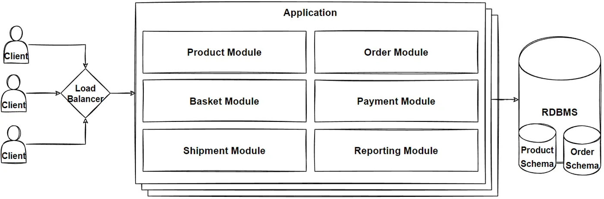
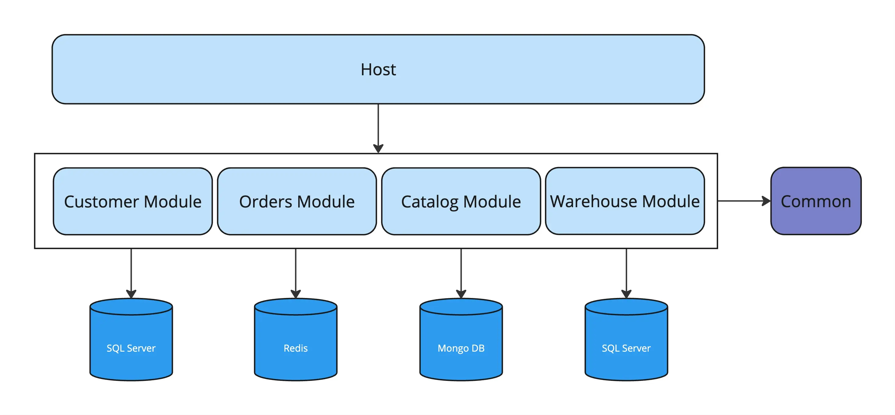

#### 인덱스
- [모듈라 모놀리스](#모듈라-모놀리스)
- [그레이들 멀티 모듈 (그레이들 멀티 프로젝트)](#그레이들-멀티-모듈-그레이들-멀티-프로젝트)
- [스프링 부트 애플리케이션 실행 및 빌드 과정](#스프링-부트-애플리케이션-실행-및-빌드-과정)
- [멀티 모듈에 대한 컴포넌트 스캔과 스프링 컨텍스트](#멀티-모듈에-대한-컴포넌트-스캔과-스프링-컨텍스트)
- [모듈별 다중 스키마](#모듈별-다중-스키마)
- [모듈별 다중 데이터베이스](#모듈별-다중-데이터베이스)
- [스프링 단에서 다중 DB 트랜잭션 일관성을 보장할 수 있는 옵션](#스프링-단에서-다중-db-트랜잭션-일관성을-보장할-수-있는-옵션)


## 모듈라 **모놀리스**


**모놀리스 아키텍처**는 하나의 애플리케이션 단위로 구성된 통합형 아키텍처이다

시스템의 모든 기능이 **단일 프로세스** 안에서 동작하며 단일 코드베이스와 단일 빌드 아티팩트(WAR/JAR)로 관리된다

즉, API, 서비스 로직, 리포지토리, 배치, 이벤트, 캐시 등이 하나의 JVM 프로세스에서 동작하는 것이다

주로 하나의 RDB 스키마, 단일 DB를 사용하며 동일 애플리케이션에서 트랜잭션이 실행된다



**모듈라 모놀리스 아키텍처**는 모놀리스 아키텍처이지만 기능별로 독립된 도메인 모듈로 코드를 구분한다

모듈 간 경계를 논리적으로 엄격히 구분하고 의존성을 최소화하며 모듈 내부는 캡슐화, 모듈 외부는 공개 API(메서드 호출)를 사용하여 통신한다

모놀리스와 마찬가지로 여전히 하나의 배포 단위이며, 단일 JVM 프로세스에서 동작한다

단지 하나일 뿐이지만 내부는 기능별로 마이크로서비스처럼 깔끔하게 분리되어 있는 구조이다

일반적으로 MSA로 확장하기 전에 모듈라 모놀리스 아키텍처를 사용하여 미리 도메인 간 경계를 구분해놓고 필요 시 효율적으로 아키텍처를 전환할 수 있도록 한다

MSA와 달리 네트워크 대신 메서드 호출로 모듈과 모듈의 통신을 대신하여 복잡함이 덜하고 단일 애플리케이션만 바로 실행할 수 있다

다만 특정 모듈만 스케일링할 수 없으며 대규모 트래픽을 감당하기에 어렵고 특정 모듈에서 실패가 발생하면 해당 애플리케이션 전체가 동작하지 않을 가능성이 크다

자바/스프링 진영에서 모듈라 모놀리스 아키텍처를 구축할 수 있는 도구는 크게 **그레이들 멀티 모듈**과 **스프링 모듈리스**가 있다 (코드 레벨 아키텍처 제외)


## 그레이들 멀티 모듈 (그레이들 멀티 프로젝트)


그레이들 멀티 모듈은 하나의 루트 프로젝트 아래에 여러 개의 하위 프로젝트를 구성하여 프로젝트를 논리적으로 분리하고 의존성을 체계적으로 관리할 수 있는 빌드 구조이다

거대 코드베이스를 논리적으로 정리하면서(도메인 분리), MSA로의 확장을 준비할 수 있다

그레이들의 `settings.gradle.kts` 파일에 어떤 모듈(프로젝트)을 포함할지 선언한다 (디렉토리 이름)

```kotlin
// settings.gradle.kts
plugins {
    id("org.gradle.toolchains.foojay-resolver-convention") version "1.0.0"
}

rootProject.name = "gradle-multi-module"

// app, common, order, payment, product, user 모듈을 포함한다
include(
    "app",
    "common",
    "order",
    "payment",
    "product",
    "user",
)
```

그리고 **각 독립된 모듈(빌드에 참여하는 디렉토리)**은 자체적인 빌드 파일(`build.gradle.kts`)을 가진다

**루트 프로젝트(프로젝트의 최상단 디렉토리)**도 빌드 파일을 가질 수 있으며 주로 하위 모듈에 대한 공통 설정, 플러그인, 의존성 버전을 관리한다

```kotlin
// 각 모듈에 대한 공통 설정
subprojects {
    repositories { 
        mavenCentral() 
    }

    apply(plugin = "java")
}    
```

**논리적으로 여러 개의 모듈로 나누었을 뿐 최종적으로는 단일 빌드 사이클에서 모든 하위 모듈이 관리된다**

다만 필요한 경우 특정 모듈만 빌드, 테스트, 실행 등을 수행할 수 있다

각 모듈마다 빌드 파일을 가지므로 **컴파일, 의존성, 배포 단위를 논리적으로 분리**하여 다음과 같은 요소를 독립적으로 구성할 수 있다
- 소스 디렉토리 구조(SourceSet)
- 의존성
- 플러그인
- 태스크
- 테스트 환경
- 패키징

또한 각 모듈은 아래와 같은 방법으로 다른 모듈에 의존할 수 있다 

**그레이들은 빌드 레벨에서 의존성 제어를 수행하여 모듈이 의존하는 다른 모듈의 클래스패스를 연결해준다**

```gradle
dependencies {
    // common 모듈 의존성 선언
    implementation(project(":common"))
}
```

## 스프링 부트 애플리케이션 실행 및 빌드 과정

그레이들 멀티 모듈을 이해하려면 사전에 스프링 부트의 빌드 원리를 숙지해놓는 게 좋다

스프링 부트에서 제공하는 그레이들 플러그인 `org.springframework.boot`는 크게 `bootRun`과 `bootJar` 태스크를 지원한다

`bootRun`은 스프링 부트 애플리케이션을 빌드하지 않고 자동으로 `@SpringBootApplication` 메인 메서드를 찾아가서 실행한다 (메인 클래스 자동 탐지 기능 사용)
- `build.gradle.kts` 또는 프로퍼티 파일에서 mainClass가 지정되어 있으면 해당 경로의 클래스를 사용한다
- 클래스패스 전체에서 `main()` + `@SpringBootApplication`을 탐색한다

개발 중인 애플리케이션을 실행하기 위한 목적으로 프로젝트를 빌드하지 않고(jar 파일을 만들지 않고) 그레이들이 각 모듈의 클래스패스를 그대로 사용하여 애플리케이션을 JVM을 직접 실행한다 (IDE 실행과 거의 동일함)

`bootJar`는 스프링 부트 애플리케이션을 배포하기 위해 사용되는 태스크로 독립 실행 가능한 fat jar(스프링 부트의 독자적 jar 구조) 파일로 패키징한다

모든 의존 라이브러리를 `/BOOT-INF/lib`에 내장하고 애플리케이션의 클래스는 `/BOOT-INF/classes`에 배치한다

`bootRun`: 그레이들 클래스패스 기반

`bootJar`: 스프링 부트 로더 기반

**참고로 스프링 부트 그레이들 플러그인은 자동으로 그레이들의 `build` 태스크에 `bootJar` 태스크를 포함시키기 때문에 `./gradlew build`로 빌드를 수행해도 독립 실행 가능한 jar를 생성한다**

따라서 `build`, `bootJar` 어느 걸로 빌드하더라도 스프링 부트의 빌드 로직(`bootJar`)을 사용하게 된다

```text
// 그레이들 build 태스크 기본 진행 순서 (build는 항상 assemble + check를 수행함)
compileJava -> processResources -> classes -> assemble(jar) -> check(test) -> build

// 스프링 부트 플러그인 포함 시
compileJava -> processResources -> classes -> assemble("bootJar") -> check(test) -> build
```

참고로 스프링 부트 그레이들 플러그인을 포함한 모든 하위 모듈마다 fat jar이 만들어진다

`@SpringBootApplication`을 포함한 스프링 부트 애플리케이션의 진입점 모듈만 fat jar로 만들고 나머지 하위 모듈은 모두 순수 jar로 만들어야 안전하게 부트스트랩할 수 있다

```kotiln
// 각 모듈에 대한 공통 설정
subprojects {

    if (name != "app") {
        // app이 아닌 모든 하위 모듈은 명시적으로 bootJar, bootRun을 비활성화하고 jar 태스크만 활성화한다
        // app의 bootRun과 bootJar는 스프링 부트 그레이들 플러그인에 의해 자동적으로 활성화된다
        tasks.named<org.springframework.boot.gradle.tasks.bundling.BootJar>("bootJar") {
            enabled = false
        }
        tasks.named< org.springframework.boot.gradle.tasks.run.BootRun>("bootRun") {
            enabled = false
        }
        tasks.named<Jar>("jar") {
            enabled = true
        }
    }
}
```

스프링 부트 그레이들 플러그인을 포함하지 않은 모듈이 `build` 태스크를 실행하게 되면 일반적인 자바 애플리케이션 형태의 `.jar` 파일(표준 jar)이 생성된다

이 파일은 라이브러리가 jar 내부에 포함되지 않아서 의존 라이브러리를 외부 클래스패스를 통해 불러와야 하기 때문에 `java -jar`로 단독 실행할 수 있는 fat jar과 다르다

```text
// 일반 jar 구조
myapp.jar
  ├ META-INF/
  ├ com/example/**.class
  └ application.properties
```

### plain jar과 fat jar (스프링 부트 로더, Launcher)

스프링 부트없이 순수 그레이들만 사용하여 빌드한 표준 jar 파일(plain jar)의 실행 원리는 다음과 같다

[plain jar 예시](./plain-jar-files/)

```text
plain-jar
- META-INF
```

`java -jar app-plain.jar`을 실행하면 JVM은 JAR 내부의 `META-INF/MANIFEST.MF`를 읽고 여기서 `Main-Class` 또는 `Start-Class` (fully-qualified-class)를 찾는다

JVM은 Main-Class의 클래스를 로드하고 리플렉션으로 메인 메서드를 호출한다

이 단계에서 클래스 로딩은 기본 Application ClassLoader(URLClassLoader)가 담당하며 JAR 내부와 외부 클래스패스에 있는 `.class`와 리소스들을 URL로 해석해 로드한다

JAR 내부에 필요한 모든 라이브러리를 모두 포함하지 않는 plain jar은 외부 클래스패스에 의존하게 되면 단독 실행이 불가능하다

```text
java -jar app-plain.jar
        ↓
       JVM
        ↓
META-INF/MENIFEST.MF
        ↓
Main-Class
        ↓
Main 메서드 시작
```

일반적인 jar이 의존하는 jar을 클래스패스에 포함시키려면 CLI 경로나 jar Manifest 파일에 클래스패스를 지정해야 한다

즉, 의존하는 jar들의 경로를 직접 지정해서 클래스패스로 연결해줘야 하며 fat jar처럼 하나에 모두 묶어놓으면 JVM은 이를 읽을 수 없다

```shell
# CLI 클래스패스 지정
java -cp app.jar:lib/user.jar:lib/order.jar app.GradleMultiModuleApplication
```

```
// MANIFEST.MF
// JVM은 Manifest의 Class-Path를 읽고 해당 JAR들을 ApplicationClassLoader의 클래스패스에 포함시킨다
Main-Class: app.GradleMultiModuleApplication
Class-Path: lib/user.jar lib/order.jar
```

#### 클래스패스와 클래스로더

클래스패스는 **JVM이 클래스 파일(`.class)를 찾는 검색 경로 목록**이다

디렉토리, JAR 파일, MENIFEST의 Class-Path 등의 경로가 클래스패스가 될 수 있으며 JVM은 이를 통해 클래스 파일을 검색하고 로딩을 수행한다

클래스로더는 **클래스패스에서 실제 클래스를 찾고, 읽고, 메모리에 로드하는 객체**이다

기본적인 클래스로더 계층은 아래와 같으며 스프링 부트가 개입하기 전 일반적인 자바 애플리케이션은 모두 ApplicationClassLoader에서 실행된다

```text
BootstrapClassLoader             최상위 (native), java.* 제공
 └── PlatformClassLoader         JDK 모듈 API
      └── ApplicationClassLoader (SystemClassLoader), 개발자가 작성한 클래스 로딩
```

**스프링 부트 그레이들 플러그인을 통해 빌드한 jar 파일(fat jar)은 표준 JAR과 구조와 다른 스프링 부트의 자체적인 구조를 가진다**

[fat jar 예시](./fat-jar-files/)

```text
fat-jar
- BOOT-INF (애플리케이션 소스코드, JAR 관련)
    - classes (개발자가 작성한 컴파일된 클래스와 리소스)
    - lib (의존성 jar 파일들)
- META-INF (스프링 부트와 표준 JAR 연결)
- org/springframework/boot/loader (스프링 부트 로더)
```

fat jar 파일의 내부는 크게 3가지 디렉토리로 구성된다 (`jar -xf <jar path>` 명령으로 jar 파일 분석 가능)

BOOT-INF는 스프링 부트 애플리케이션 실행에 필요한 클래스(`.class`), 리소스(`.yml` 등), 의존하는 모든 라이브러리 jar 파일(실행 파일) 및 의존성 인덱스(텍스트 파일)을 포함한다

META-INF는 표준 JAR 실행 방식에 따라 스프링 부트 애플리케이션을 실행할 수 있도록 `MANIFEST.MF`와 기타 서비스를 명시한 파일을 포함한다

org/springframework/boot/loader는 스프링 부트 로더의 패키지로 중첩된 JAR을 읽고 클래스패스를 처리하는 기능을 가진다 (단독 실행 가능한 JAR 엔진)

스프링 부트 애플리케이션의 진입점 역할을 하는 app 모듈의 jar 파일의 "META-INF/lib" 디렉토리에 다른 하위 모듈 및 관련 의존성(전이적) jar 파일들이 있다

```text
fat-jar-files (app.jar)
- BOOT-INF
    - lib
        - common.jar
        - order-plain.jar
        - payment-plain.jar
        - product-plain.jar
        - user-plain.jar
        - amqp-client-5.25.0.jar (user 모듈의 전이적 의존성)
```

app 모듈은 아래와 같이 하위 모듈들을 의존성으로 선언함으로써 그레이들이 빌드레벨에서 다른 모듈을 app 모듈의 컴파일 클래스패스에 추가하게 해주고

스프링 부트 그레이들 플러그인을 통한 빌드 과정에서 하위 모듈의 jar 파일 및 각 하위 모듈에서 의존하는 전이적 의존성 jar 파일까지 위와 같이 app 모듈의 fat jar에 포함되는 것이다

```kotiln
plugins {
    application
}

dependencies {
    implementation(project(":common"))
    implementation(project(":order"))
    implementation(project(":payment"))
    implementation(project(":product"))
    implementation(project(":user"))
}

application {
    mainClass = "app.GradleMultiModuleApplication"
}
```

### 스프링 부트의 fat jar 실행 과정

**표준 `URLClassLoader`는 디스크에 있는 jar 파일이나 파일 시스템 경로를 URL로 받아 로딩할 뿐 jar 내부의 또 다른 jar(nested jar)을 직접 클래스패스로 처리하지 못한다**

중첩 JAR은 곧바로 클래스패스 URL을 사용할 수 없기 때문이다

**일반 JAR은 의존하는 jar 파일을 CLI 경로나 MENIFEST Class-Path에 지정해야 하지만, 스프링 부트는 부트 로더가 런타임 클래스패스를 구성한다**

JVM이 인식할 수 없는 중첩된 jar 파일들을 읽기 위해 스프링 부트 로더는 클래스패스 역할을 대신 수행하는 자체적인 클래스로더를 이용한다

```text
java -jar app.jar (fat jar)
        ↓
       JVM
        ↓
META-INF/MENIFEST.MF
        ↓
Main-Class: org.springframework.boot.loader.launch.JarLauncher
        ↓
스프링 부트 클래스 로더(Launcher) 가동
        ↓
BOOT-INF/classes와 BOOT-INF/lib 내부의 jar 파일 클래스 패스 항목 설정
        ↓
Start-Class: 스프링 부트 @SpringBootApplication public static void main(String[]) 메서드 시작
```

fat jar의 `META-INF/MENIFEST.MF` 파일에 명시되어 있는 Main-Class는 app 모듈의 메인 클래스가 아니라 스프링 부트의 런처(`JarLauncher`)이다

이 런처는 리플렉션과 URL 핸들러를 사용하여 fat jar 구조를 분석한 뒤 `BOOT-INF/lib`의 jar들을 일반 파일처럼 접근할 수 있는 추상 계층을 만든다

그 다음 `LaunchedURLClassLoader`(`URLClassLoader` 확장)를 생성하여 중첩 jar을 직접 메모리상에서 URL 리소스로 등록하여 클래스패스처럼 사용 가능하도록 만든다

`LaunchedURLClassLoader`는 Manifest에 기록된 Start-Class(`@SpringBootApplication`)를 찾고 리플렉션을 통해 메인 메서드를 실행하여 IoC 컨테이너 초기화, 빈 생성, 웹 서버 구동 등의 스프링 부트 애플리케이션 부트스트랩을 수행한다

요약: `JVM -> JarLauncher(Boot Loader) -> LaunchedURLClassLoader(Nested JAR ClassLoader) 생성 -> Start-Class main() 호출`

클래스패스/리소스 로딩 우선순위
- `BOOT-INF/classes/` (애플리케이션 클래스와 리소스)
- `BOOT-INF/lib/` (의존 라이브러리 jar 파일들)
- `JDK/` (외부 시스템 클래스 로더 영역)

결과적으로 순수 자바 애플리케이션과 달리 아래와 같이 스프링 부트 클래스로더를 사용하여 중첩 jar을 일반 jar처럼 다룰 수 있게 된다

따라서 스프링 부트 애플리케이션의 모든 클래스는 JVM 기본 클래스로더가 아니라 부트 로더가 만든 LaunchedURLClassLoader에서 동작한다

```text
BootstrapClassLoader                   최상위 (native), java.* 제공
 └── PlatformClassLoader               JDK 모듈 API
      └── ApplicationClassLoader       (SystemClassLoader), 개발자가 작성한 클래스 로딩
           └── LaunchedURLClassLoader  스프링 부트 클래스로더
```


## 멀티 모듈에 대한 컴포넌트 스캔과 스프링 컨텍스트

보통 스프링 부트 애플리케이션을 그레이들 멀티 모듈로 구축하면 app(api) 모듈에서 `@SpringBootApplication`을 실행하는 진입점 역할을 하므로 app 모듈의 빌드 아티팩트를 사용한다

그리고 다른 하위 모듈은 모두 app 모듈에서 의존하게 되므로 `BOOT-INF/lib`에 포함된다

이 때 스캔 루트 경로는 app 모듈의 `@SpringBootApplication` 패키지 경로가 된다

```java
// 스캔 루트 경로
package multi_module;

@SpringBootApplication
public class GradleMultiModuleApplication {
    
    public static void main() {
        SpringApplication.run(GradleMultiModuleApplication.class);
    }
}
```

스프링 부트는 @SpringBootApplication이 선언된 클래스의 패키지 하위 패키지만 자동 스캔한다

**즉, 스프링 부트는 jar 파일이 어디에 있든지 스캔 루트 경로에 포함되지 않는 다른 패키지 경로는 컴포넌트 스캐닝에서 제외된다**

멀티 모듈로 인해 하위 모듈마다 물리적으로 jar 파일로 분리되더라도 스캔 루트 경로의 하위 계층에 속하면 자동적으로 컴포넌트 스캐닝된다

만약 하위 모듈 별로 스캔 루트를 벗어난 별도의 패키지 경로를 유지해야 한다면 해당 경로를 명시적으로 지정해야 한다

```java
package multi_module;

// user, order, payment, product가 multi_module 경로가 아닌 독립적인 패키지 경로를 가지는 경우
// 명시적으로 컴포넌트 스캐닝 패키지에 포함시켜야 한다
@SpringBootApplication의 scanBasePackages = {"user", "order", "payment", "product"}
public class GradleMultiModuleApplication {
    
    public static void main() {
        SpringApplication.run(GradleMultiModuleApplication.class);
    }
}
```

이를 통해 알 수 있는 것은 그레이들 멀티 모듈을 이용하더라도, 도메인/기능 별 논리적, 빌드적 구분일 뿐 스프링 컨텍스트는 하나만 사용하게 되는 것이다

**즉, 각 모듈 별로 스프링 컨텍스트가 띄워지지 않으며 최종적으로 하나의 클래스패스로 통합된다**

그레이들 멀티 모듈은 단지 컴파일 단위 나누기, 코드 재사용 분리, 테스트 분리, 빌드 아티팩트 분리 등을 위해 사용하는 것이다

따라서 스프링 컨텍스트가 아래와 같이 구성된다

```text
app 모듈 (@SpringBootApplication)
 ├── product 모듈의 빈
 ├── user 모듈의 빈
 ├── payment 모듈 bean
 ├── order 모듈 bean
 └── common 모듈 bean
```

→ 모두 하나의 IoC 컨테이너(ApplicationContext)에 등록

→ 하나의 라이프사이클

→ 하나의 웹 서버

→ 하나의 트랜잭션 매니저


## 모듈별 다중 스키마

모놀리스 아키텍처에서 각 모듈별로 데이터를 독립적으로 유지시키기 위해 다중 스키마 또는 다중 데이터베이스를 이용할 수 있다

다중 스키마는 동일한 데이터베이스에서 여러 개의 스키마를 두고 논리적으로 각 모듈의 데이터를 베타적으로 관리하는 방법이다


스키마란 데이터베이스 내부를 논리적으로 구획하는 네임스페이스이다

동일한 데이터베이스 인스턴스에 속하지만 서로 다른 스키마는 각자의 객체(테이블, 뷰, 시퀀스 등) 그룹을 형성한다

각 모듈에 대한 스키마를 만들면 하나의 데이터베이스 서버에서 권한, 테이블, 인덱스, 마이그레이션 등을 논리적으로 구분할 수 있다 

다중 스키마는 다중 DB와 달리 **단일 DB에 대한 커넥션 위에서 동작**하므로 **단일 트랜잭션으로 모든 스키마를 한 번에 처리할 수 있다**

즉, 데이터소스, 트랜잭션 매니저, 엔티티 매니저가 각각 하나씩만 필요하며 다중 DB와 달리 별도의 패턴을 도입하지 않고도 트랜잭션 일관성을 간단하게 해결한다

```java
// 엔티티의 schema 속성을 지정하면 동일 데이터소스에서도 스키마별로 테이블을 구분시킬 수 있다
@Entity
@Table(name = "orders", schema = "order")
public class Order {}

@Entity
@Table(name = "payments", schema = "payment")
public class Payment { ... }
```

다중 스키마는 분산 시스템이 아직 필요하지 않으면서, 도메인 간 데이터를 독립적으로 운영하고 하나의 글로벌 트랜잭션으로 묶을 수 있는 최적의 방법이다

서비스 규모가 매우 크고 모듈별 확장이 필요하여 독립 스케일링을 해야되는 경우, 모듈마다 다른 스토리지 엔진을 써야할 때는 다중 데이터베이스로 아키텍처를 변경해야 한다


## 모듈별 다중 데이터베이스

그레이들 멀티 모듈은 비록 모듈라 모놀리스 아키텍처이지만 추후 MSA 전환을 쉽게 하기 위해, 장애 전파 최소화 등의 목적으로 모듈별로 DB를 분리해놓을 수도 있다

스프링 부트는 자동 구성을 통해 단일 엔티티 매니저 팩토리(PersistenceUnit), 단일 트랜잭션 매니저, 단일 데이터소스를 컨텍스트에 등록한다

아래와 같이 모듈별로 독립적인 데이터베이스를 사용할거라면 각 모듈마다 별도로 이들을 구성해야 하며, 이 부분에 대한 스프링 부트 자동 구성은 비활성화된다



```java
// order, product, payment, user마다 별도로 데이터베이스를 구성한다
@Configuration

// JPA의 경우 @EnableJpaRepositories를 통해 스캔된 리포지토리가 어떤 DB를 사용할지 스프링에게 알린다
@EnableJpaRepositories(
    basePackages = "user.repository",
    entityManagerFactoryRef = "userEmf",
    transactionManagerRef = "userTx"
)
public class UserDbConfig {

    @Bean
    DataSource userDataSource() {
        return DataSourceBuilder.create()
        .url("jdbc:h2:mem:userdb")
        .driverClassName("org.h2.Driver")
        .username("sa")
        .build();
    }

    @Bean
    LocalContainerEntityManagerFactoryBean userEmf() {
        HibernateJpaVendorAdapter vendorAdapter = new HibernateJpaVendorAdapter();
        vendorAdapter.setGenerateDdl(true);

        LocalContainerEntityManagerFactoryBean emf = new LocalContainerEntityManagerFactoryBean();
        emf.setDataSource(userDataSource());
        emf.setJpaVendorAdapter(vendorAdapter);
        emf.setPackagesToScan("user.domain");
        emf.setPersistenceUnitName("userPU");
        return emf;
    }

    @Bean
    PlatformTransactionManager userTx(@Qualifier("userEmf") EntityManagerFactory emf) {
        return new JpaTransactionManager(emf);
    }

}
```

스프링 컨텍스트에는 다음처럼 다중 Persistence 구성이 올라가게 된다

**단일 컨텍스트 - 다중 Persistence 단위**

```text
┌──────────────────────────────────────────┐
│            Spring ApplicationContext     │
│──────────────────────────────────────────│
│ DataSource(product)                      │
│ EntityManagerFactory(product)            │
│ TransactionManager(product)              │
│------------------------------------------│
│ DataSource(user)                         │
│ EntityManagerFactory(user)               │
│ TransactionManager(user)                 │
│------------------------------------------│
│ DataSource(order) …                      │
│ EntityManagerFactory(order) …            │
│ TransactionManager(order) …              │
└──────────────────────────────────────────┘
```

**각 모듈이 자신의 DB를 전적으로 소유하며 다른 모듈의 DB(리포지토리)나 엔티티에 직접 접근하지 않는다**

필요한 데이터는 **도메인 서비스**나 **Anti-Corruption Layer(ACL)**을 통해 조회한다

### 다중 Persistence의 클라이언트 요청 처리 과정

#### 단일 모듈이 요청을 처리하는 경우

사용자 조회 API가 user 모듈만 사용한다고 가정해보자

UserRepository를 호출하면 스프링은 basePackages 속성(`@EnableJpaRepositories`)을 기준으로 이 리포지토리가 속한 패키지에 연결된 빈을 찾는다

엔티티 매니저 팩토리: `userEmf`

트랜잭션 매니저: `userTx`

데이터소스: `userDataSource`

이후 트랜잭션 시작 -> DB 접근 -> DB 커밋하여 요청을 처리한다

#### 여러 모듈이 협력하여 요청을 처리하는 경우

Order 엔티티 생성 시 user 모듈의 계정을 체크하고 product 모듈을 통해 재고를 확인하는 경우

**모듈마다 독립된 DB, 트랜잭션 매니저를 사용하므로 독립 트랜잭션을 사용하게 되므로 단일 ACID 트랜잭션이 불가능해진다**

모듈마다 별도의 데이터베이스를 사용하기 때문에 서로 다른 DB 커넥션을 필요하게 되므로, 각 모듈에서 설정한 트랜잭션 매니저가 개입한다

따라서 하나의 요청이더라도 내부에서는 다음과 같이 처리된다

```text
요청 진입
   ↓
@Service OrderService
 @Transactional(orderTxManager)   ← order DB 트랜잭션
    ├── userRepository.find()     → userTxManager.begin() / commit
    ├── productRepository.find()  → productTxManager.begin() / commit
    └── orderRepository.save()    → orderTxManager 내에서 실행
```

스프링은 트랜잭션 매니저를 리포지토리 별로 자동 연결하므로 각 모듈에서 호출되는 리포지토리가 다르면 트랜잭션도 따로 열린다

즉, order와 user, product는 각각 독립된 트랜잭션이 생성된다

참고로 모듈 간 데이터를 조회할 때는 다른 모듈의 리포지토리를 직접 건들지 않고 **도메인 서비스**나 **Anti-Corruption Layer(ACL)**를 사용해야 한다

## 스프링 단에서 다중 DB 트랜잭션 일관성을 보장할 수 있는 옵션

**모듈 별 DB를 사용하면 서로 다른 DB에 걸친 단일 트랜잭션 ACID 보장을 할 수 없다**

스프링 단에서 모듈 간 DB 트랜잭션 일관성을 보장할 수 있는 옵션은 다음과 같다

### 1. Saga 패턴 (보상 트랜잭션)

Saga 패턴은 여러 로컬 트랜잭션을 가진 서비스들이 단일 ACID 트랜잭션처럼 보이도록 순차적으로 작업을 처리하고 보상 트랜잭션으로 구성하는 패턴이다

주로 마이크로서비스 아키텍처에서 분산 트랜잭션의 일관성을 유지하기 위해 사용한다

각 서비스가 로컬 트랜잭션을 수행하고 이벤트를 발행하며, 실패 시에는 이전 단계의 작업을 되돌리는 보상 트랜잭션을 실행하여 전체 프로세스를 롤백한다

로컬 DB, 로컬 트랜잭션이란 각 서비스에서 단독으로 소유하고 관리하는 DB와 그 DB에만 적용되는 트랜잭션을 의미한다

그리고 해당 서비스의 로컬 트랜잭션이 완료되면 이벤트를 발행하여 다음 서비스의 로컬 트랜잭션을 시작하게 하는 것이다

**순방향 과정 중 어느 단계에서든 서비스 실패가 발생하면 이미 완료된 단계들을 취소하기 위해 "보상 트랜잭션"을 실행하여 데이터 일관성을 유지**하는 것이다

모듈라 모놀리스에서도 모듈별 독립 DB를 사용할 때 Saga 패턴을 사용하여 모듈 간 트랜잭션의 일관성을 유지할 수 있다

Saga 패턴은 크게 두 가지 방식으로 구현할 수 있다

#### 오케스트레이션

오케스트레이션은 중앙 오케스트레이터(코디네이터)가 전체 Saga 흐름을 제어하는 방식이다

각 모듈이 명령을 받아 실행한 뒤 결과를 반환하면, 중앙 오케스트레이터가 다음 단계로 넘어갈지, 보상 작업을 호출할지 결정한다

결합도가 증가하고 오케스트레이터가 단일 실패 지점이 될 수 있지만 비즈니스 로직의 흐름이 명확하여 전체 프로세스를 이해하기 쉽다

```text
오케스트레이터
   ↓   Order 생성 요청
order 모듈
   ↓   성공 이벤트
오케스트레이터
   ↓   결제 요청
payment 모듈
   ↓   성공 이벤트
오케스트레이터
   ↓   재고 감소 요청
inventory 모듈
```

#### 코레오그래피

오케스트레이션 방식과 달리 중앙 제어자가 없고 이벤트 자체가 흐름을 결정한다

각 모듈이 특정 이벤트를 듣고 다음 이벤트를 발행하기 때문에 모듈 간 결합도가 매우 낮다

다만 흐름 추적이 어렵고 장애 상황이 복잡해질 수 있어 단순한 프로세스에만 사용하기에 적합하다

```text
OrderCreatedEvent
        ↓
PaymentRequestedEvent
        ↓
StockReservedEvent
        ↓
OrderCompletedEvent
```

#### Outbox 패턴

Saga 패턴의 핵심은 여러 서비스에 걸친 작업을 순차적으로 처리하고 문제가 발생하면 보상 트랜잭션으로 롤백하여 데이터의 일관성을 유지하는 것이다

이 때 순차적으로 작업을 처리할 수 있게 하는 매개체는 이벤트이며, 이벤트는 해당 서비스가 작업을 수행하면서 발생시키는 데이터베이스 상태 변경에 맞춰 하나의 원자적 트랜잭션으로 처리되어야 한다

즉, 서비스에서 서비스 로직을 실행하며 데이터베이스에 데이터를 업데이트함과 동시에 이벤트 정보를 특정 테이블에 함께 저장한다

그리고 작업이 성공적으로 처리되어 데이터베이스 트랜잭션이 커밋되면 이벤트가 유실되지 않도록 `outbox` 테이블의 이벤트도 함께 커밋한다

이렇게 **DB 상태변경과 해당 도메인의 이벤트 저장(메시지 발행)을 하나의 트랜잭션으로 묶어 처리하는 것**을 **Outbox 패턴**(Transactional Outbox Pattern)이라고 한다

`outbox` 테이블에 커밋된 이벤트는 별도의 프로세스(비동기 이벤트 처리기)가 주기적으로 확인한 뒤 메시지 브로커로 이벤트를 전송한다

다른 서비스는 발행된 이벤트를 기반으로 작업을 처리하고 마찬가지로 `outbox` 테이블에 이벤트 정보를 기록하며 모든 서비스의 작업을 순차적으로 처리한다

이 과정에서 특정 서비스에서 실패가 발생하면 실패 이벤트를 발행하여 보상 트랜잭션 로직을 실행할 수 있게 한다

```text
1. 각 모듈별 로컬 DB + 로컬 트랜잭션 (@Transaction("orderTx"))
2. 도메인 이벤트 (이벤트 객체)
3. Outbox 패턴 (이벤트를 DB에 저장)
4. 비동기 이벤트 처리기 (내부 메시지 버스)
5. 보상 트랜잭션(compensation) 로직
```

### 2. Distributed XA 2PC 트랜잭션

각 용어별 의미
- Distributed: 분산 트랜잭션(여러 개의 DB, 메시지브로커 등)
- XA: eXtended Architecture
- 2PC: 2Phase-Commit

각각의 리소스 매니저와 XA 프로토콜을 통해 연결하는 방식이다

동기적으로 동작하여 일관성이 높지만 상당히 느리고 설정이 복잡하다는 단점으로 거의 사장된 기술이다


**참고 문서, 이미지 출처, 읽기 좋은 글**
- (추천) https://www.kamilgrzybek.com/blog/posts/modular-monolith-architectural-drivers
- https://blog.bytebytego.com/p/monolith-vs-microservices-vs-modular
- https://www.geeksforgeeks.org/system-design/monolithic-architecture-system-design/
- https://docs.gradle.org/current/userguide/multi_project_builds.html
- https://www.dandoescode.com/blog/modular-monolith/a-gentle-introduction