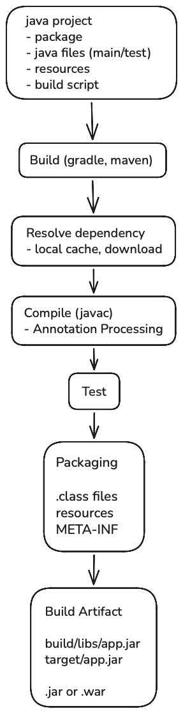
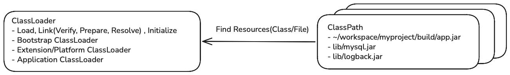
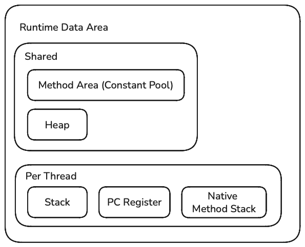
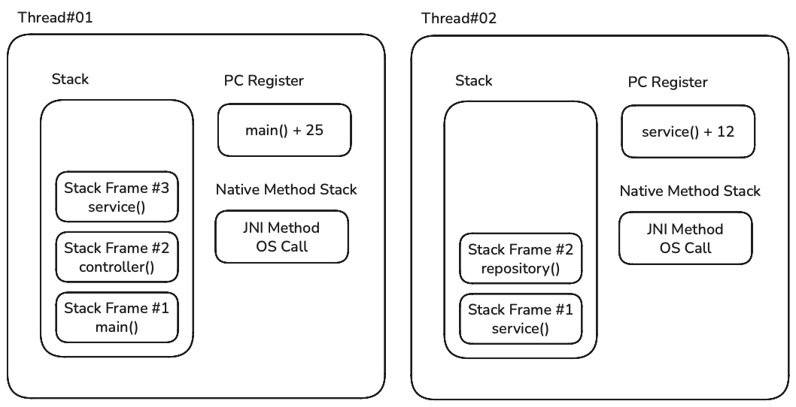
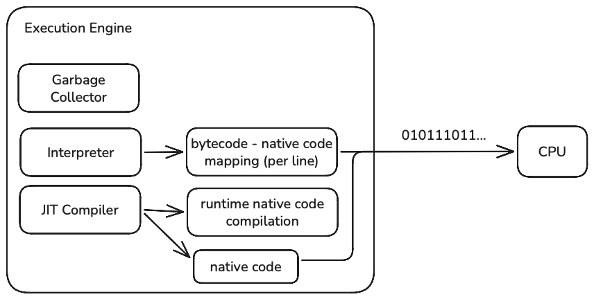
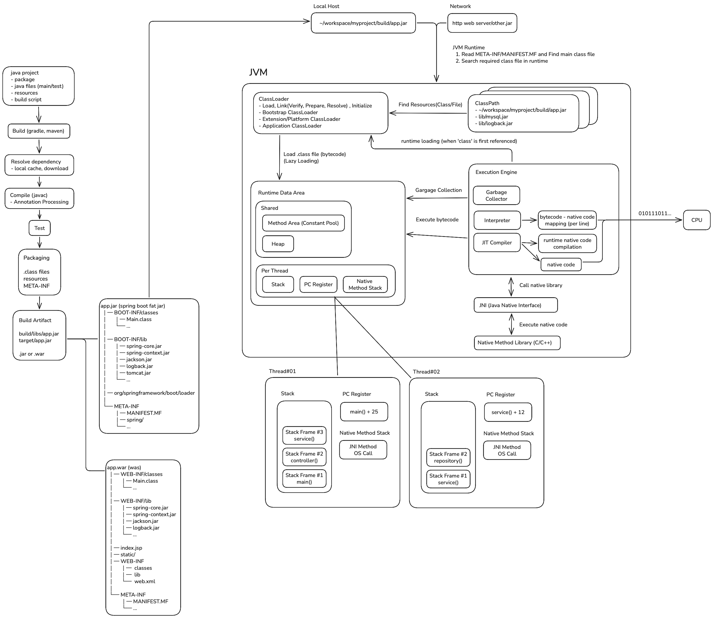

## JVM
- [JVM](#jvm)
- [JVM 실행 과정](#jvm-실행-과정)
- [자바 빌드](#자바-빌드)
  - [META-INF와 MANIFEST.MF](#meta-inf와-manifestmf)
  - [Fat JAR (JAR Inside JAR)](#fat-jar-jar-inside-jar)
- [JVM 부팅 - 클래스로더와 클래스패스](#jvm-부팅---클래스로더와-클래스패스)
    - [클래스로더의 로딩 과정](#클래스로더의-로딩-과정)
- [JVM 메모리 - 런타임 데이터 영역](#jvm-메모리---런타임-데이터-영역)
- [JVM 실행엔진 - JIT Compiler, Interpreter](#jvm-실행엔진---jit-compiler-interpreter)
- [Stop-The-World](#stop-the-world)


## JVM 실행 과정

JVM (Java Virtual Machine)은 자바 바이트코드를 실행하는 가상 머신으로 JRE에 포함되어 있다.

JRE (Java Runtime Environment)는 JVM과 자바 표준 라이브러리를 포함한 자바의 실행 환경이다.

C/C++은 컴파일러가 기계어로 번역하여 **특정 운영체제와 CPU 아키텍처를 대상**으로 실행 가능한 바이너리 파일(기계어)을 빌드한다.

이 방식은 런타임에 실행을 빠르게 할 수 있지만 플랫폼마다 빌드를 해야하거나 플랫폼 종속적인 코드를 작성해야 하는 단점이 있다.

자바는 **플랫폼으로부터 독립되어** 빌드를 한 번만 하면 여러 플랫폼에서 실행될 수 있도록 소스 코드와 기계어 사이의 중간 계층을 두었는데, 그게 바로 JVM이다.

자바 및 JVM 언어(코틀린, 스칼라 등)를 컴파일하면 기계어 대신 JVM이 읽고 해석할 수 있는 바이트코드를 생성한다.

JVM은 런타임에 바이트코드를 기계어로 번역하여 실행하는 역할을 한다.

`.java`, `kt`, `.scala`... <-> `JVM(.class)` <-> `machine code`

이 글은 자바 소스 코드가 컴파일되어 기계어로 실행되는 과정을 살펴본다.

먼저 개발자가 작성한 소스 코드를 바이트코드로 변환하는 과정부터 보자.

## 자바 빌드



자바 애플리케이션은 소스코드(`.java`) 이외에도 빌드 설정 파일, 리소스 파일, 테스트 코드 등을 포함한다.

개발자가 IDE 또는 CLI 명령어(`./gradlew build`, `mvn package`)를 입력하면 빌드 도구는 빌드 스크립트를 실행한다.

빌드 스크립트를 통해 의존성 정보를 분석한 뒤 로컬 캐시를 확인하고 필요한 라이브러리가 없다면 Maven Repository와 같은 원격 저장소에서 아티팩트를 다운로드하여 캐시에 저장한다. (그레이들 로컬 캐시: `~/.gradle/caches/modules-2/files-2.1/`)

그리고 자바의 컴파일러 `javac`를 통해 소스코드(`.java`)를 바이트코드(`.class`)로 변환한다.

소스 코드에 `@Getter`(Lombok), `@Mapper`(MapStruct)과 같이 컴파일 시점에 처리되어야 하는 어노테이션이 있으면 해당 어노테이션을 지원하는 라이브러리의 어노테이션 프로세서를 통해 추가 코드를 생성하거나 컴파일 대상 코드를 보완한 뒤 컴파일을 진행한다. (`.java` 파일 자체를 수정하지 않음)

소스 코드가 컴파일되면 테스트 코드도 별도로 컴파일한 후 테스트를 실행한다. 일반적으로 테스트를 실패하면 빌드에 실패하게 된다.

모든 테스트를 통과하면 컴파일된 클래스 파일(`.class`), 리소스 파일, 메타데이터(`META-INF`) 등을 하나의 아티팩트(`app.jar`)로 패키징한다.

일반적인 자바 애플리케이션은 JAR 파일을 생성한다.

웹 애플리케이션은 배포 환경에 따라 WAR을 생성할 수도 있으며, 스프링 부트 애플리케이션은 의존 라이브러리까지 포함한 실행 가능한 Fat JAR을 생성한다.

### META-INF와 MANIFEST.MF

**`META-INF` (META Information)** 디렉토리는 아티팩트(JAR/WAR)에 대한 메타데이터를 저장한다.

아티팩트에 대한 설명, 실행 방법, 실행에 필요한 요소 위치 등의 정보를 담는다.

```text
app.jar
├── META-INF
│   ├── MANIFEST.MF
│   ├── NOTICE.txt
│   ├── LICENSE.txt
│   └── ...
│
├── com/example/Main.class
├── com/example/UserService.class
└── ...
```

**MENIFEST.MF**는 프로그램이 실행될 때 JVM에게 꼭 필요한 중요한 정보를 알려주기 위해 사용된다.

`Main-Class`: 프로그램의 시작점이 되는 `main` 메서드를 가진 클래스 이름을 지정한다.

`Implementation-Title`, `Implementation-Version`: 프로그램의 이름과 버전을 명시한다.

`Class-Path`: 프로그램이 실행될 때 필요한 다른 외부 JAR 파일들의 위치를 가리킨다.

원래 자바 애플리케이션에서 다른 아티팩트를 의존할 때 프로그램을 실행하려면 `java cp app.jar:lib/*`처럼 의존성을 명시해야 한다.

의존성 정보를 미리 MANIFEST에 적어두면 매번 명령어로 의존성 경로를 포함하지 않고 프로그램을 실행할 수 있다.

```text
Manifest-Version: 1.0
Main-Class: com.example.MyApp
Class-Path: lib/dependency1.jar lib/dependency2.jar
```

스프링 부트 애플리케이션을 빌드하면 아래와 같은 MANIFEST.MF 파일이 자동으로 생성된다.

```text
Manifest-Version: 1.0
Main-Class: org.springframework.boot.loader.launch.JarLauncher
Start-Class: com.example.SpringBootExampleApplication
Spring-Boot-Version: 4.0.6
Spring-Boot-Classes: BOOT-INF/classes/
Spring-Boot-Lib: BOOT-INF/lib/
Spring-Boot-Classpath-Index: BOOT-INF/classpath.idx
Spring-Boot-Layers-Index: BOOT-INF/layers.idx
Build-Jdk-Spec: 25
Implementation-Title: demo
Implementation-Version: 0.0.1-SNAPSHOT
```

프로그램의 시작점인 `Main-Class`에 스프링 부트의 런처가 지정된다.

스프링 부트 런처는 Fat JAR에 포함된 다른 JAR 파일, 클래스들을 클래스패스에 추가하고 `Start-Class`에 지정된 클래스를 실행한다.

`Start-Class`에 지정된 클래스는 `@SpringBootApplication` 어노테이션이 선언되어 있으며 `SpringApplication.run()`을 호출하는 `main` 메서드를 가진다.

### Fat JAR (JAR Inside JAR)

Fat JAR은 다른 JAR을 포함한 JAR 파일이다. (중첩 JAR)

일반적인 JAR 파일은 JAR 파일을 포함하고 있지 않다.

다양한 라이브러리를 의존하는 스프링 프로젝트가 있다고 해보자.

```text
My Application
 ├── Spring Framework
 ├── Jackson
 ├── Logback
 └── MySQL Driver
```

이 프로젝트를 빌드하면 `app.jar`이 생성되는데, 애플리케이션을 실행하기 위해서는 의존 라이브러리의 경로를 명시하여 클래스패스에 등록해야 한다.

```text
app.jar
mysql.jar
spring-core.jar
spring-context.jar
jackson.jar
logback.jar
...
```

```shell
# 의존성 경로 명시
java -cp "app.jar:lib/*" com.example.Main
```

스프링 부트의 Fat JAR은 애플리케이션과 의존 라이브러리를 하나의 JAR 파일에 모두 포함하여 그 자체로 프로그램을 실행할 수 있다.

JAR 파일 내부에 어떻게 포함되어 있는지 직접 확인해보자.

```shell
# Spring Boot CLI 설치
# https://start.spring.io에 접속하여 파일을 다운로드받을 수도 있다
$ mise use -g spring-boot@4.0.6
```

```shell
# 스프링 부트 애플리케이션 생성
$ spring init --build=gradle --type=gradle-project-kotlin --dependencies=web,data-jpa,h2,mysql --java-version=25 --package-name=com.example spring-boot-example

Using service at https://start.spring.io
Project extracted to '/Users/hansanhha/Workspace/Playground/spring-boot-example'
```

```shell
# 빌드 및 스프링 부트 Fat JAR 압축 해제
$ cd spring-boot-example && ./gradlew build
$ mkdir fat_jar && jar xvf ./build/libs/spring-boot-example-0.0.1-SNAPSHOT.jar && cd fat_jar
```

압축 해제된 Fat JAR 파일의 내부는 아래와 같다.

```text
fat_jar
├── BOOT-INF
│   ├── classes
│   │   ├── application.properties
│   │   ├── com
│   │   │   └── example
│   │   │       └── SpringBootExampleApplication.class
│   │   ├── static
│   │   └── templates
│   ├── classpath.idx
│   ├── layers.idx
│   └── lib
│       ├── jackson-core-3.1.2.jar
│       ├── h2-2.4.240.jar
│       ├── hibernate-core-7.2.12.Final.jar
│       ├── HikariCP-7.0.2.jar
│       ├── spring-boot-4.0.6.jar
│       └── ...
├── META-INF
│   ├── MANIFEST.MF
│   └── services
│       └── java.nio.file.spi.FileSystemProvider
└── org
    └── springframework
        └── boot
            └── loader
                └── launch
                    └── JarLauncher.class
```

크게 `BOOT-INF`와 `META-INF`, `org/springframework/boot/loader` 디렉토리가 있다.

`BOOT-INF/classes`: 컴파일된 애플리케이션 코드와 리소스 파일들을 보관한다.

`BOOT-INF/lib`: 스프링 부트 애플리케이션에서 의존하는 다른 JAR 파일들을 보관한다.

`BOOT-INF/clsspath.idx`: 스프링 부트 애플리케이션 실행을 최적화하기 위해 `BOOT-INF/lib` 안에 있는 JAR들을 어떤 순서로 클래스패스에 추가할지 미리 정의한 인덱스 파일이다.

`BOOT-INF/layers.idx`: Fat JAR 내부를 도커/OCI 레이어 단위로 분리하는데 사용된다.

`META-INF`: JVM이 스프링 부트 애플리케이션을 실행할 수 있도록 자동 생성된 `MANIFEST.MF` 파일을 보관하고, `FileSystemProvider`을 통해 내장된 JAR 파일을 로드하는데 사용된다.

`org/springframework/loader/`: 스프링 부트를 실행하고 내장된 JAR 파일을 JVM에 클래스패스에 추가하는 스프링 부트 런처/로더 디렉토리이다.

자동 생성된 `MANIFEST.MF` 파일의 내용은 아래와 같다.

JVM이 스프링 부트 애플리케이션을 실행하면 `Main-Class`에 적힌 `JarLauncher`를 실행한다.

`JarLauncher`는 `BOOT-INF/classes`와 `BOOT-INF/lib`를 탐색하여 클래스로더를 생성한 뒤 `Start-Class`를 실행하여 스프링 부트 애플리케이션을 시작한다.

```text
Manifest-Version: 1.0
Main-Class: org.springframework.boot.loader.launch.JarLauncher
Start-Class: com.example.SpringBootExampleApplication
Spring-Boot-Version: 4.0.6
Spring-Boot-Classes: BOOT-INF/classes/
Spring-Boot-Lib: BOOT-INF/lib/
Spring-Boot-Classpath-Index: BOOT-INF/classpath.idx
Spring-Boot-Layers-Index: BOOT-INF/layers.idx
Build-Jdk-Spec: 25
Implementation-Title: spring-boot-example
Implementation-Version: 0.0.1-SNAPSHOT
```


## JVM 부팅 - 클래스로더와 클래스패스

[자바 빌드](#자바-빌드) 과정을 통해 자바 애플리케이션을 JAR로 빌드하는데 성공했다면 이제 실행할 차례이다.

JVM 프로세스가 시작되면 JVM은 클래스로더와 클래스패스를 구성한 뒤 전달받은 jar 파일 내에 있는 `META-INF/MANIFEST.MF` 파일을 읽어서 프로그램의 진입점인 `Main-Class`에 지정된 클래스를 로드하여 실행한다.

JVM은 애플리케이션 내의 클래스와 의존 라이브러리를 모두 메모리에 로드하지 않고 실행에 필요한 클래스만 클래스로더와 클래스패스를 이용하여 JVM 메모리 영역에 로드한다.

스프링 부트 애플리케이션은 `Main-Class`인 `JarLauncher` 클래스가 별도의 클래스로더를 구축한 후 `@SpringBootApplication`의 `main()`을 호출한다.

이전에 빌드해놓은 스프링 부트 애플리케이션을 실행해보자.

```shell
# 방법 1. java CLI 사용
# 실행 흐름: OS -> java -> JVM -> 스프링 부트 애플리케이션 jar 로드
$ java -jar ./build/libs/spring-boot-example-0.0.1-SNAPSHOT.jar

# 방법 2. 빌드 도구 사용
# 실행 흐름: OS -> java -> gradle wrapper -> JVM -> 스프링 부트 애플리케이션 jar 로드
$ ./gradlew bootRun

# 방법 3. IDE 내에서 실행
# 실행 흐름: IDE 런처 -> gradle daemon -> JVM -> 스프링 부트 애플리케이션 jar 로드
```

아래의 명령어를 통해 시스템 내에서 실행 중인 JVM 프로세스들을 확인할 수 있다.

```shell
# 방법 1
$ jps -lv
94897 ./build/libs/spring-boot-example-0.0.1-SNAPSHOT.jar
78626 org.gradle.launcher.daemon.bootstrap.GradleDaemon
98340 jdk.jcmd/sun.tools.jps.Jps
...

# 방법 2
$ jcmd
94897 ./build/libs/spring-boot-example-0.0.1-SNAPSHOT.jar
78626 org.gradle.launcher.daemon.bootstrap.GradleDaemon 9.5.1
...

# 방법 3
$ ps -ef | grep 'spring-boot-example-0.0.1-SNAPSHOT.jar'
501 94897 80458   0  3:03PM ttys000    0:09.23 java -jar ./build/libs/spring-boot-example-0.0.1-SNAPSHOT.jar
```



JVM은 패키지 구조(디렉토리 구조)를 기반으로 로드할 클래스를 찾는데, **클래스패스**가 패키지 디렉토리의 시작점(루트)이 어디인지 JVM에게 알려주는 역할을 한다.

클래스패스를 기반으로 JVM 내(런타임 데이터 영역)에 `.class` 바이트코드를 동적으로 로드하는 역할을 **클래스로더**가 수행한다.

클래스 로더는 자신만의 독립적인 클래스패스 리스트를 관리하는데, 클래스패스에 있는 경로를 순회하여 탐색한 뒤 클래스를 찾았다면 클래스를 검증하고 초기화하여 런타임 데이터 영역에 로드한다.

JDK는 세 가지의 클래스 로더를 제공한다.

Bootstrap ClassLoader
- 최상위 로더로 `java.lang`, `java.util` 등의 JDK 핵심 클래스들을 로드한다.
- 클래스패스: `$JAVA_HOME/lib/modules/`

Platform ClassLoader
- `java.sql`, `java.xml` 등 JDK 확장 모듈을 로드한다.
- 클래스패스: `$JAVA_HOME/lib/jmod/`

Application ClassLoader
- 개발자가 작성한 클래스, 애플리케이션(`app.jar`), 외부 라이브러리(`mysql.jar` 등)을 로드한다.
- `-cp` 또는 애플리케이션의 `java.class.path` 환경변수, `MANIFEST.MF`의 `Class-Path`

클래스 로딩은 상위 -> 하위 클래스 로더 순으로 시도한다.

부트스트랩 클래스로더의 캐시와 클래스패스에 없다면 하위로 내려가서 클래스패스에 있는지 확인한다.

모든 클래스로더에서 찾지 못하면 `ClassNotFoundException` 예외가 발생한다.

```text
Bootstrap ClassLoader (JDK core module)
        ↓
Platform ClassLoader (JDK platform module)
        ↓
Application ClassLoader (Java application classpath)
        ↓
LaunchedClassLoader (Spring Boot application classpath)
```

자바는 JAR 파일에 JAR 파일을 중첩해서 넣는 구조를 자바 표준에서 지원하지 않는다.

스프링 부트 애플리케이션은 중첩된 JAR을 JVM이 인식할 수 있도록 커스텀 클래스 로더를 구현한다.

LaunchedClassLoader: 스프링 부트 Fat JAR의 `BOOT-INF/classes`, `BOOT-INF/lib/` 디렉토리를 기반으로 새로운 클래스 패스를 구성하고 필요한 것들을 로드한다.

#### 클래스로더의 로딩 과정

클래스로더는 `.class` 파일을 JVM 내의 메모리에 로드하기 위해 로딩, 링크, 초기화라는 3단계 과정을 거친다.

로딩
- 클래스로더가 지정된 클래스패스에서 파일을 찾아 바이트코드를 읽는다.
- 읽어온 이진 데이터를 분석하여 클래스의 메서드, 변수, 상위 클래스 정보 등을 런타임 데이터 영역의 메서드 영역(Method Area)에 저장한다.
- 로딩이 끝나면 해당 클래스 타입의 `java.lang.Class` 객체를 생성하여 힙 영역에 등록한다. (이 객체를 통해 리플렉션을 사용함) 

링크
- 가져온 클래스 파일이 안전한지 검사하고, JVM이 실행할 수 있도록 준비한다.
- 링크는 다시 3단계 세부 과정으로 나뉜다.
  - 검증
    - 읽어온 바이트코드가 자바 언어 명세와 JVM 명세를 정확히 따르는지 확인한다.
    - 파일이 손상되었거나 변조되었는지 검사한다. (실패 시 `VerifyError` 발생)
  - 준비
    - 클래스나 인터페이스의 정적 변수(`static` 변수)를 위한 메모리 공간을 할당한다.
    - 정적 변수의 값을 기본값으로 채워넣는다. (`int`-> `0`, `boolean` -> `false`, 참조형 -> `null`)
  - 분석 (선택적으로 실행)
    - 클래스 파일 내의 기호 참조(Symbolic Reference)를 실제 메모리 주소를 가리키는 직접 참조(Direct Referene)로 변경한다.
    - 코드에 쓰인 다른 클래스의 이름(텍스트)을 실제 메모리 상의 주소 값으로 연결해주는 작업이다. (런타임에 동적으로 일어나기도 함)

초기화
- 링크의 '준비' 단계에서 기본값으로 채워졌던 정적 변수들의 값을 소스 코드에 작성되어 있는 값으로 대입한다.
- `static` 초기화 블록을 실행한다.
- JVM은 해당 클래스가 실제로 사용이 되어야 초기화 단계를 실행한다. (`User.class`처럼 클래스 정보만 읽는 경우엔 클래스를 사용하는 코드가 아니므로 초기화가 수행되지 않음)

JVM은 코드를 실행하는 데 필요한 클래스만 JVM 내의 메모리 영역에 로드한다.

의존하거나 사용 중인 모든 jar 파일과 `.class` 파일들을 로드하지 않기 때문에 메모리를 효율적으로 사용할 수 있다.

아래의 명령을 실행하여 스프링 부트 애플리케이션이 시작될 때 로딩되는 클래스들을 확인할 수 있다.

```shell
# 1만줄이 넘는 로그가 쌓이므로 터미널 대신 텍스트 에디터로 확인해야 한다
$ java -verbose:class -jar build/libs/spring-boot-example-0.0.1-SNAPSHOT.jar > c
lass_load_log.txt
```

`JarLauncher` 클래스부터 `SpringApplication` 클래스가 순차적으로 로딩되는 것을 확인할 수 있다.

```text
// JarLauncher.class 로딩
[0.041s][info][class,load] org.springframework.boot.loader.launch.Launcher source: file:/Users/hansanhha/Workspace/Playground/spring-boot-example/build/libs/spring-boot-example-0.0.1-SNAPSHOT.jar
[0.041s][info][class,load] org.springframework.boot.loader.launch.ExecutableArchiveLauncher source: file:/Users/hansanhha/Workspace/Playground/spring-boot-example/build/libs/spring-boot-example-0.0.1-SNAPSHOT.jar
[0.041s][info][class,load] org.springframework.boot.loader.launch.JarLauncher source: file:/Users/hansanhha/Workspace/Playground/spring-boot-example/build/libs/spring-boot-example-0.0.1-SNAPSHOT.jar

// LaunchedClassLoader.class 로딩
[0.042s][info][class,load] org.springframework.boot.loader.net.protocol.jar.JarUrlClassLoader source: file:/Users/hansanhha/Workspace/Playground/spring-boot-example/build/libs/spring-boot-example-0.0.1-SNAPSHOT.jar
[0.042s][info][class,load] org.springframework.boot.loader.launch.LaunchedClassLoader source: file:/Users/hansanhha/Workspace/Playground/spring-boot-example/build/libs/spring-boot-example-0.0.1-SNAPSHOT.jar

// SpringBootExampleApplication.class 로딩
[0.095s][info][class,load] com.example.SpringBootExampleApplication source: jar:nested:/Users/hansanhha/Workspace/Playground/spring-boot-example/build/libs/spring-boot-example-0.0.1-SNAPSHOT.jar/!BOOT-INF/classes/!/

// SpringApplication.class 로딩
[0.120s][info][class,load] org.springframework.boot.SpringApplication source: jar:nested:/Users/hansanhha/Workspace/Playground/spring-boot-example/build/libs/spring-boot-example-0.0.1-SNAPSHOT.jar/!BOOT-INF/lib/spring-boot-4.0.6.jar!/
```

스프링 부트 클래스 로더 `LaunchedClassLoader`의 조상인 자바의 `URLClassLoader`에 대해 알아보자.

`URLClassLoader`는 URL 목록(URL Search Path)으로부터 클래스와 리소스를 JVM 메모리 영역에 로드하는 클래스 로더이다.

`URLClassPath`를 통해 클래스패스를 관리하고 있으며 `addURL()`을 호출하여 런타임에 클래스패스를 확장할 수 있다.

```java
// 로컬 호스트뿐만 아니라 네트워크를 통해 클래스를 로딩할 수도 있다
URL[] urls = {
    new URL("file:/app/lib/mysql.jar"),
    new URL("jar:file:/app/app.jar!/BOOT-INF/classes/"),
    new URL("http://example.com/plugin.jar")
};

URLClassLoader loader = new URLClassLoader(urls);
```

클래스 로더에 등록된 클래스패스(`URLClassPath`)의 `getResource()`를 호출하여 리소스 파일을 가져온 뒤 해당 파일 내에 있는 클래스를 찾아서 `byte[]`를 읽는다.

그리고 `URLClassLoader`의 부모인 `ClassLoader`의 `defineClass()` 네이티브 로직을 호출하여 바이트코드를 분석한 뒤 클래스의 데이터를 JVM 내에 로딩한다.

스프링 부트의 `LaunchedClassLoader`는 중첩된 JAR 파일들(`BOOT-INF/lib/*.jar`)을 평탄화하여 `URLClassLoader`가 리소스 경로를 따라 파일을 로드할 수 있도록 한다.


## JVM 메모리 - 런타임 데이터 영역



런타임 데이터 영역(Runtime Data Area)은 JVM의 메모리 영역이다.

클래스로더가 `.class` 파일의 바이트코드를 해석해서 생성한 JVM의 내부 클래스 메타데이터가 이 영역에 로드된다.

`.class` 파일 자체가 런타임 데이터 영역에 로드되는 것이 아님을 유의하자.

개발자가 아래와 같은 코드를 작성한 뒤 컴파일하여 `UserService.class` 파일을 생성했다고 가정해보자.

```java
public class UserService {
    private String name;
}

// javac UserService.java -> UserService.class
```

`UserService.class` 파일 안에는 바이트코드가 저장되어 있다.

```text
CA FE BA BE
...
```

이 바이트코드는 여러 요소가 나열된 스트림 형태로 다음과 같은 정보로 이루어져 있다.

- `Magic Number`: JVM이 해당 파일을 자바 클래스 파일로 인식하게 하는 식별자 (모든 클래스 파일의 매직넘버는 `0xCAFEBABE`임)
- `Version`: 클래스 파일의 메이저/마이너 정보
- `ConstantPool`: 클래스 내에서 사용되는 상수, 메서드 이름, 변수 이름, 클래스 이름 등의 정보(심볼릭 레퍼런스)를 모아둔 테이블
- `Access Flags`: 클래스의 속성을 나타내는 정보 (`public`, `abstract` 등)
- `This Class/Super Class`: 현재 클래스와 부모 클래스를 가리키는 정보
- `Interfaces`: 구현하고 있는 인터페이스 정보
- `Fields`: 클래스 내에 선언된 필드들의 정보
- `Methods`: 메서드 이름, 시그니처, 접근제어자, 메서드의 실제 실행 코드(바이트코드)
- `Attributes`: 클래스에 대한 부가 정보 (소스 파일명, 디버깅 정보 등)

앞서 설명한대로 `URLClassLoader`가 리소스 파일을 `byte[]`로 읽고 네이티브 로직을 호출하면 스트림을 분석하여 메타데이터로 변환한 뒤 런타임 데이터 영역에 로드하는 것이다.

구체적으로 런타임 데이터 영역 중 **메서드 영역(Method Area)**에 채워진다.

메서드 영역은 자바 프로그램 실행에 필요한 메타데이터 정보와 공유 데이터를 보관하며 프로그램이 끝날 때까지 유지된다.

모든 스레드들은 이 영역을 함께 사용한다.

메서드 영역은 주로 3가지 상황에서 활용된다.
- 클래스가 처음 사용될 때: 소스 코드에서 클래스를 처음 언급하거나 사용할 때 클래스 로더가 `.class` 파일을 읽어 분석한 데이터를 메서드 영역에 저장한다. 이후에 동일한 클래스가 사용되면 메서드 영역의 데이터를 재사용한다.
- 객체를 생성할 때 (`new` 키워드): 객체를 새로 생성할 때 Heap 영역에 인스턴스가 생성되는데, 이 때 생성된 인스턴스는 메서드 영역에 있는 클래스를 참조한다.
- 메서드를 실행할 때: `user.sayHello()`와 같이 메서드를 호출하면 JVM의 실행 엔진이 메서드 영역으로 찾아가서 바이트코드 명령어와 스레드의 스택 영역을 활용하여 연산하고 실행한다.

클래스로더가 메서드 영역에 클래스의 메타데이터를 로드하면 이를 참조할 수 있는 `Class` 객체를 힙 영역에 생성한다.

이 객체가 자바 코드에서 `String.class`, `obj.getClass()`를 호출할 때 얻는 객체로 메서드 영역에 로드된 클래스의 메타데이터를 가리킨다.

**힙 영역**은 객체와 배열이 저장되는 JVM의 동적 메모리 영역이다.

자바 코드에서 `new` 연산자를 사용하면 메서드 영역을 참고하여 해당 클래스의 인스턴스를 힙 영역에 생성한다.

```java
// name, user, arr 인스턴스는 모두 힙 영역에 생성된다.
String name = new String("hansanhha");
User user = new User();
int[] arr = new int[100];
```

이 공간에 생성된 객체는 특정 스레드의 스택 프레임에서 참조된다.

위의 `name`, `user`, `arr` 변수는 힙 영역에 생성된 `String`, `User`, `int[]` 인스턴스를 가리킨다.

객체를 스택에 저장하지 않고 힙 영역에 두는 이유는 뭘까?

아래와 같이 힙 영역없이 객체를 스택에 저장하면 메서드가 끝나는 순간 객체도 함께 제거된다.

```java
public User createUser() {
    User user = new User();
    return user;
}
```

객체의 생명주기가 메서드 호출의 생명주기보다 훨씬 길 수 있기 때문에 힙에 객체를 두고 스택 프레임에서 이를 참조하는 것이다.

메서드 종료가 종료되어 스택 프레임이 제거되어도 객체는 유지되어 재사용할 수 있게 된다.

힙 영역은 동적 메모리 영역이지만 무한히 커지지 않는다.

JVM은 필요에 따라 힙을 확장하거나 축소할 수 있지만 최대 크기는 정해져 있다.

JVM 시작 시 일정 크기로 할당되며 옵션으로 힙의 크기를 지정할 수 있다.

```shell
# -Xms: 초기 힙 크기 (512MB)
# -Xmx: 최대 힙 크기 (2GB)
java -Xms512m -Xmx2g app.jar
```

실제 메모리 상태를 한 번 살펴보자.

```shell
# 스프링 부트 애플리케이션 실행
$ ./gradlew bootRun

# 실행된 스프링 부트 애플리케이션 PID 확인
$ jps
60611 Jps
60597 SpringBootExampleApplication
...

# 힙 메모리 상태 확인
$ jcmd 60597 GC.heap_info
60597:
garbage-first heap   total reserved 4194304K, committed 69632K, used 50229K [0x00000003c0000000, 0x00000004c0000000)
 region size 2048K, 13 young (26624K), 1 survivors (2048K)
```

메서드 영역과 마찬가지로 모든 스레드에서 공통적으로 사용되는 공간이다.

만약 힙의 최대 크기를 넘어서서 메모리를 사용하려고 하면 `OutOfMemoryError`가 발생하게 된다.

이를 방지하고자 JVM은 **가비지 컬렉터**로 사용되지 않는 인스턴스를 정리한다.



스택과 PC 레지스터, 네이티브 스택은 각 스레드별마다 독립적으로 사용하며 스레드가 시작될 때 생성된다.

스레드에서 메서드를 호출할 때마다 해당 메서드의 상태 정보(매개변수, 지역변수, 반환 값 등)를 보관하는 스택 프레임이 생성되어 스택에 쌓인다.

```java
User user = new User();
```

위와 같이 객체를 생성하면 `User` 인스턴스는 힙 영역에 만들어지고 `user` 변수는 해당 스레드의 스택 프레임에 저장되어 생성된 인스턴스를 참조한다.

메서드 호출이 종료되면 스택 프레임은 스택에서 제거된다.

스택의 크기는 크기를 조절할 수 있는 힙과 달리 고정되어 있다.

스레드의 스택 크기를 넘어서게 되면 `StackOverFlowError`가 발생한다.

**PC 레지스터**는 메서드 영역에 저장된 바이트코드를 가리킨다.

JVM 실행 엔진은 스레드의 PC 레지스터가 가리키는 바이트코드와 스택 프레임에 저장된 상태 정보를 참고하여 코드를 실행한다.

**네이티브 메서드 스택**은 네이티브 코드를 실행할 때 사용하는 스택이다.

네이티브 코드는 JVM의 실행 엔진을 거치지 않고 OS와 CPU가 직접 실행하는 코드를 말한다. (C/C++, Rust, 어셈블리어 등으로 작성된 코드)

```text
// 자바 코드
.java
 ↓
.class (Bytecode)
 ↓
JVM
 ↓
Machine Code (JIT)

// 네이티브 코드 (C)
.c
 ↓
Machine Code
 ↓
CPU 직접 실행
```

JVM은 플랫폼 독립적이지만 운영체제 기능을 사용하려면 OS API를 호출해야 한다.

자바만으로는 현재 CPU 시간 읽기, 파일 열기, 소켓 생성 등의 작업을 직접 할 수 없기 때문에 네이티브 코드를 사용한다.

```java
public class System {

    // native 키워드를 붙여 네이티브 코드를 호출한다
    // 이런 메서드를 네이티브 메서드라고 한다
    @IntrinsicCandidate
    public static native long currentTimeMillis();
}
```

자바 메서드의 바이트코드를 실행하기 위해 스택이 있는 것처럼 네이티브 코드도 함수 호출 스택이 필요하다.

이 때 사용되는 것이 네이티브 메서드 스택이다.

자바는 바이트코드가 네이티브 코드를 호출하거나 변환될 수 있도록 **JNI(Java Native Interface)**라는 계층을 이용한다.


## JVM 실행엔진 - JIT Compiler, Interpreter



클래스로더가 런타임 데이터 영역에 클래스의 메타데이터를 적재하면 실행 엔진은 바이트코드를 읽어서 실행하는 역할을 한다.

자바가 플랫폼 독립적인 특징을 가질 수 있는 건 소스 코드를 곧바로 기계어로 번역하지 않고 중간 언어를 둔 다음, 이를 런타임에 코드를 실행할 OS와 CPU 아키텍처에 맞게 변환해주는 계층이 있기 때문이다.

이 계층이 JVM의 실행 엔진이며 JIT 컴파일러와 인터프리터를 이용하여 바이트코드를 기계어로 바꾼 뒤 실행한다.

JVM 내에는 각각의 바이트코드 opcode에 대응하는 네이티브 코드 조각이 미리 준비되어 있다.

**인터프리터**는 바이트코드를 한 줄씩 읽은 다음 JVM 내부에 미리 준비된 네이티브 코드를 찾아서 실행한다.

전체 코드를 한 번에 기계어로 컴파일하지 않고 하나씩 매핑하며 기계어 코드를 CPU에게 실행시킨다.

**JIT 컴파일러**는 자주 실행되는 바이트코드 덩어리(메서드, 반복문)를 발견하면 그 부분을 한 번에 네이티브 기계어로 컴파일한다.

컴파일된 기계어는 메모리에 저장되고, 이후 인터프리터를 거치지 않고 곧바로 CPU가 직접 실행한다.

기계어로 바꿀 뿐만 아니라 코드를 더 빠르게 실행할 수 있는 최적화 방법을 찾아서 적용한다.

**인라이닝 최적화**

JIT 컴파일러는 단순한 메서드의 호출문이 자주 반복되면 메서드 호출을 없애고 호출되는 메서드의 코드를 직접 복사해서 넣는다.

메서드 호출 오버헤드를 완전히 제거한다.

```java
long sum = 0;
for (int i = 0; i < 10_000; i++) {  // 동일한 메서드 반복
    sum += calculate(i);
}

// 인라이닝이 잘 일어나는 작은 메서드
private static int calculate(int x) {
    return x * 2;
}
```

## 전체 흐름

지금까지 살펴본 자바 소스 코드의 빌드부터 실행 과정을 담은 다이어그램이다.




## Stop-The-World

Stop-The-World는 JVM이 모든 애플리케이션 스레드(유저 스레드)를 일시 정지시키고 JVM 내부 작업만 수행하는 상태를 말하며 주로 가비지 컬렉션(GC)을 할 때 발생한다.

JVM은 GC를 할 때 다음과 같은 작업을 한다.

- 어느 객체가 살아있고 죽었는지 정확히 판단한다
- 살아있는 객체를 안전하게 이동 및 압축한다
- 참조 관계를 업데이트한다

이 작업을 하는 동안 애플리케이션 스레드가 객체를 계속 생성하거나 참조를 바꾸면 잘못된 판단을 할 수 있기 때문에 안전하게 GC를 하기 위해 모든 애플리케이션 스레드의 실행을 멈춘다.

모든 GC에서 발생하지만 GC의 종류에 따라 멈추는 시간이 크게 다르다.

아래의 자바 코드를 `javac GCExample.java`로 컴파일한 후 `java -verbose:gc GCExample` 명령으로 GC 로그를 확인해보자.

```java
public class GCExample {
    public static void main(String[] args) {
        System.out.println("GC 관찰 예제 시작... (Ctrl + C 로 종료)");

        long count = 0;
        while (true) {
            // Young Generation을 빠르게 채우기 위해 많은 객체 생성
            for (int i = 0; i < 100_000; i++) {
                byte[] bytes = new byte[10 * 1024];  // 10KB 크기의 객체
                count++;
            }

            if (count % 1_000_000 == 0) {
                System.out.println("생성된 객체 수: " + count);
                System.gc();  // GC 힌트 (강제는 아님)
            }

            try {
                Thread.sleep(50);  // 약간의 딜레이
            } catch (InterruptedException e) {
                break;
            }
        }
    }
}
```