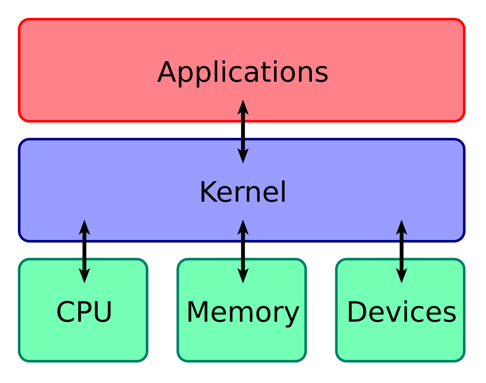

기본
- [커널과 유저](#커널과-유저)
- [프로세스와 스레드 (스레드 매핑 모델)](#프로세스와-스레드-스레드-매핑-모델)
- [프로세스/스레드 스케줄링](#프로세스스레드-스케줄링)
- [멀티 스레딩과 동시성 문제](#멀티-스레딩과-동시성-문제)
- [메인 루틴, 서브 루틴, 코루틴](#메인-루틴-서브-루틴-코루틴)

스레드
- [자바의 스레드 모델](#자바의-스레드-모델)
- [Thread](#thread)
- [`ThreadLocal<T>`](#threadlocalt)
- [VirtualThread](#virtualthread)
- [`ScopedValue<T>`](#scopedvaluet)
- [`StructuredTaskScope<T>`](#structuredtaskscopet)

비동기/병렬
- [자바의 비동기/병렬 실행 모델](#자바의-비동기병렬-실행-모델)
- [스레드 관리 추상화: Executor, ExecutorService, Executors](#스레드-관리-추상화-executor-executorservice-executors)
- [스레드 관리 구현체: ThreadPoolExecutor, ForkJoinPool](#스레드-관리-구현체-threadpoolexecutor-forkjoinpool)
- [비동기 처리: `Future<T>`, `CompletableFuture<T>`, `CompletionStage<T>`](#비동기-처리-futuret-completablefuturet-completionstaget)

동기화/락/기타
- [synchronized](#synchronized)
- [volatile](#volatile)
- [CyclicBarrier](#cyclicbarrier)
- [CountDownLatch](#countdownlatch)
- [ReentrantLock, ReadWriteLock](#reentrantlock-readwritelock)
- [Semaphore](#semaphore) 


## 커널과 유저



[이미지 출처 및 참고 내용](https://en.wikipedia.org/wiki/Kernel_(operating_system))

컴퓨터의 프로세스는 크게 **커널**과 **유저(런타임)** 라고 하는 영역에서 실행된다

커널은 하드웨어에 직접 접근할 수 있는 권한(privilege) 모드에서 실행되는 시스템 소프트웨어로 자원 관리, 프로세스 스케줄링, 메모리 관리 등 운영체제의 핵심 역할을 수행한다 (하드웨어와 소프트웨어 사이의 중재)

즉, 유저 영역의 소프트웨어에서 직접 하드웨어를 제어하는 것이 아니라 커널을 통해서만 하드웨어에 접근할 수 있다

```text
[ 유저 애플리케이션 ]
    ↓
[ 시스템 콜, 인터럽트 ]
    ↓
[ 커널 ]
    ↓ 
[ 하드웨어 ]         
```

커널은 컴퓨터가 켜지는 순간(BIOS/UEFI -> 부트로더 -> 커널 -> OS -> 유저 프로그램)부터 꺼질 때까지 작동한다 

일반 프로그램은 절대 커널을 직접 건드릴 수 없으며 시스템 콜을 통해서 상호작용만 할 수 있다

운영체제는 커널 외에도 시스템 데몬, 윈도우 시스템, 시스템 라이브러리/유틸리티 등으로 구성되어 있는데 이러한 프로그램은 커널 모드가 아닌 유저 모드에서 실행된다

또한 커널 모드와 유저 모드는 컴퓨터 시스템의 안정성과 보안을 지키기 위해 CPU가 실행되는 권한 수준을 다르게 부여받는다

커널 모드는 프로세스 스케줄링 시스템, IPC 시스템 등 커널의 구성 요소들이 동작하며 시스템 전체에 접근할 수 있는 최고 권한을 가진다

유저 모드는 사용자 애플리케이션, 쉘 등이 동작하며 자신에게 할당된 자원만 접근할 수 있는 제한된 권한을 가진다. 하드웨어 접근은 시스템 콜을 통해서만 가능하다


## 프로세스와 스레드 (스레드 매핑 모델)


[이미지 출처 및 참고 내용](https://en.wikipedia.org/wiki/Thread_(computing))

프로세스는 **컴퓨팅 자원의 단위**이자 운영체제로부터 실행된 프로그램의 인스턴스로 독립적인 메모리 공간을 가진다

커널 레벨에서 하나의 프로세스는 자원(메모리, 파일 핸들링 등)을 소유하며 이러한 자원을 공유하는 한 개 이상의 커널 스레드를 포함한다

기본적으로 각 프로세스는 격리되어 서로 메모리 등의 자원을 공유하지 않기 때문에 공유가 필요하면 명시적으로 공유 메모리, 소켓 등 IPC를 사용해야 한다

스레드는 **프로세스 내의 경량 실행 단위**로 여러 개의 스레드가 하나의 프로세스 내에 존재하여 동시에 실행될 수 있다

프로세스와 달리 각 스레드는 메모리를 공유할 수 있기 때문에 효율적으로 자원을 사용할 수 있지만 경쟁 조건, 교착 상태 등의 동시성 문제가 발생될 수 있다

여러 개의 스레드를 실행하는 멀티스레딩 프로세스일 때 스레드를 관리하는 주체를 기준으로 스레드 매핑 모델을 구분한다 

커널이 직접 스케줄링하고 관리하는 실행 단위(스레드)는 **커널 스레드**라고 하고, 운영체제가 아닌 런타임이나 라이브러리에서 관리하는 실행 단위는 **유저 스레드**라고 한다

기본적으로 운영체제는 프로세스 생성 시 최소 1개의 커널 스레드를 함께 생성하며 이러한 스레드를 **Native Thread** 또는 **Non-Green Thread** 라고 한다

커널 스레드는 커널이 직접 스케줄링하고 관리하기 때문에 커널의 스케줄링 정책을 따르며 멀티 코어 CPU에서 병렬로 실행될 수 있다

또한 각 커널 스레드는 자신만의 스택 메모리 공간을 가지는데 스택의 크기는 일반적으로 수백 KB에서 수 MB에 달한다

커널 스레드가 과하게 많아지면 커널이 생성, 스케줄링, 스위칭 등을 관리하는 작업의 부담이 커져 전체 시스템 성능이 저하되거나 커널 스레드의 스택 메모리가 시스템 전체 메모리를 고갈시킬 수 있다

유저 스레드는 **Green Thread**라고 하며 유저 공간에서만 생성되고 관리되는 논리적인 스레드로 커널 스레드 위에서 작동한다

커널은 유저 스레드를 인식하지 못하기 때문에 커널의 스케줄링을 직접 받지 않고 자체적인 커널 스택을 가지지 않는다

또한 일반적으로 수십 바이트에서 수백 바이트 정도의 매우 가벼운 데이터 구조로 표현된다

유저 스레드가 이렇게 작은 메모리 공간을 가질 수 있는 이유는 다음과 같다
- 커널 스택 부재: 커널 스레드는 최소 수십 KB에서 1~2MB에 달하는 고정된 커널 스택 메모리를 할당받는데, 유저 스레드는 이러한 스택이 필요없거나 애플리케이션의 힙 메모리에 작은 스택을 할당받아 사용한다
- 경량 데이터 구조: 유저 스레드는 주로 스레드 상태, PC, 레지스터 값 등만을 저장한다
- 단일 커널 스레드 위에서의 멀티 플렉싱: 여러 유저 스레드가 소수의 커널 스레드 위에서 작동하기 때문에 많은 수의 유저 스레드가 동시에 존재하더라도 실제 커널 스레드가 많아져 발생하는 메모리 부담이 거의 없다

스레드 매핑 모델은 총 1:1, M:1, M:N 으로 구성된다

**1:1 모델**은 런타임에서 생성된 스레드마다 운영체제가 커널 스레드를 매핑해주는 모델로, 각 유저 스레드는 커널에서 독립적으로 스케줄링된다

커널이 스케줄링하므로 I/O 작업이 발생해도 다른 스레드가 실행될 수 있어 유저 스레드가 블로킹되지 않고 멀티 코어에서 병렬 실행이 가능하다

다만 스레드 생성/전환에 커널 리소스가 필요하므로 오버헤드가 크다는 단점이 있다

기존 자바의 스레드(Thread 클래스)가 이 모델을 따른다

**M:1 모델**은 런타임에서 생성된 여러 개의 스레드가 1개의 커널 스레드에 매핑된다

커널이 관여하지 않아 컨텍스트 스위칭이 매우 빠르다는 장점이 있지만 하나의 스레드가 시스템 호출(블로킹 I/O 등)을 하면 전체 스레드가 블로킹될 수 있다 -> 멀티 코어 활용 불가

내부적으로 비동기 I/O를 사용하여 블로킹 문제를 해결할 수 있으며 일반 시스템 콜을 호출하는 것처럼 보이지만 실제론 비동기 I/O로 대체되며, 그 사이에 다른 유저 스레드로 스케줄을 전환하여 CPU 낭비를 최소화한다

**M:N 모델**은 여러개의 유저 스레드가 몇 개의 커널 스레드에 매핑된다


## 프로세스/스레드 스케줄링

**스케줄링**이란 프로세스나 스레드의 실행 순서를 결정하는 작업으로 운영체제가 어떤 프로세스/스레드를 CPU에 언제 할당하여 실행할지 결정한다

커널의 스케줄링은 보통 실행 중인 프로세스/스레드를 강제로 중단시키고 다른 프로세스/스레드를 실행하는 **선점형(Preemptive) 스케줄링**을 사용한다

스레드 간 데이터를 공유하고 선점형으로 동작한다면 일반적으로 (유저) 스레드라고 부른다 (Erlang처럼 스레드끼리 데이터를 공유하지 않는 경우도 있는데 이 경우엔 그냥 프로세스라고 부른다)

반대로 커널이 프로세스/스레드가 스스로 자원을 반납할 때까지 기다리는 **협력형(Cooperative, 비선점형) 스케줄링**으로 동작하는 유저 스레드는 Fiber라고 부른다 (Win32 Fiber API)

CPU가 어떤 작업(프로세스/스레드)을 수행할 때 필요한 모든 상태 정보를 **컨텍스트**라고 하는데 다음과 같은 요소들이 포함된다
- 프로그램 카운터(PC): 다음에 실행할 명령어 주소를 보관하는 레지스터
- 레지스터 값들: 작업 중인 계산, 변수 등을 저장하는 CPU 레지스터들
- 스택 포인터(SP): 함수 호출/리턴 위치를 추적하는데 사용되는 레지스터
- 상태 레지스터(Flags): CPU 내부 상태를 나타내는 플래그들 (carry, interrupt 등)
- 메모리 맵 정보: 가상 주소 매핑, 페이지 테이블 등 (프로세스 전환 시 필요)

스케줄링에 의해 특정 프로세스나 스레드를 실행하기 전에 기존 프로세스나 스레드의 **실행 컨텍스트(Execution Context)** 를 메모리에 저장하고 새로운 프로세스/스레드의 실행 컨텍스트를 로드한다

이 작업을 **컨텍스트 스위칭(Context Switching)** 이라고 하며 보통 타임 슬라이스(OS가 할당한 시간) 종료, 블로킹 I/O, 높은 우선순위의 작업, 자발적 yield 등으로 인해 발생한다

컨텍스트 스위칭이 되는 대상에 따라 컨텍스트의 크기와 비용이 달라진다

**프로세스 컨텍스트**는 **PCB (Process Control Block)** 라고 하며 각 프로세스는 하나의 PCB를 가진다 

PC, SP, 레지스터 값 정보, 페이지 테이블 정보, 파일 디스크립터, 프로세스 상태(실행 중, 대기 중 등) 등을 포함한다 (PCB는 커널의 메모리 영역에 존재하며 사용자 영역에서 이를 접근할 수 없다)

프로세스 컨텍스트 스위칭이 발생하면 이러한 정보들을 모두 운영체제 메모리 공간에 위치한 PCB에 저장하고 기존 저장되어 있던 PCB를 로딩하거나 새로 생성된 PCB를 로딩한다 

또한 프로세스 컨텍스트는 가상 주소 공간과 TLB (Transalation Lookaside Buffer, 가상 주소를 물리 주소로 변환하는 캐시)라는 캐시도 포함하고 있는데 프로세스 컨텍스트 스위칭 시, 새 프로세스는 다른 가상 주소 공간을 사용하므로 이전 TLB 엔트리가 더 이상 유효하지 않게 되어 비워야 하는데 이를 캐시 무효화(TLB 캐시)라고 한다 

캐시 무효화가 발생하면 캐시 미스로 인해 다시 페이지 테이블부터 참조해야 하므로 다음 메모리 접근이 느려지게 되는 성능 저하가 발생한다 (시간이 지나면 TLB가 다시 채워지지만, 프로세스 전환이 잦으면 TLB가 자주 비워져 성능 저하가 심해진다)

**커널 스레드 컨텍스트**는 **TCB (Thread Control Block)** 에 SP, PC, 레지스터 세트, 상태 레지스터(플래그), TLS(Thread Local Storage) 정도를 보관한다

페이지 테이블이나 TLB를 관리하지 않기 때문에 프로세스 컨텍스트 스위칭보다 빠르게 전환되며 캐시 무효화가 발생하지 않게 된다

**사용자 스레드 컨텍스트**는 PC, SP, 레지스터 세트 정도만 가지며 커널 스레드와 달리 커널이 이 존재를 모른다

또한 TCB도 아닌 유저 공간의 메모리(Heap 등)에 직접 저장되고 커널 호출(시스템 콜)없이 전환될 수 있기 때문에 컨텍스트 스위칭 속도가 가장 빠르다


### 프로그램을 실행하면 프로세스와 스레드가 어떻게 생성되는걸까?

컴퓨터 사용자가 `./myapp` 명령어로 특정 프로그램을 실행한다

OS가 해당 프로그램을 실행하기 위한 프로세스를 생성하는데, 이 때 프로세스의 고유한 주소 공간(가상 메모리)을 확보하고 PCB를 생성한다

그 다음 메인 함수가 실행될 스레드를 커널 스레드로 생성하고 이 스레드의 TCB도 생성한다

CPU의 스케줄링에 따라 스레드가 CPU를 할당받아 프로그램의 메인 함수가 실행된다

프로세스에서 내부적으로 스레드를 더 만들면 일반적인 경우 OS가 커널 스레드를 추가적으로 생성한다 (1:1 모델)

또는 유저 스레드를 만들어 런타임에서 자체적으로 관리할 수도 있다 (M:1 모델)


## 멀티 스레딩과 동시성 문제

하나의 프로세스 안에서 여러 실행 흐름(스레드)이 동시에 실행되는 것을 멀티 스레딩이라고 한다 (서로 다른 메모리 공간을 가진 여러 개의 스레드가 하나의 프로세스 내에서 동작함을 의미한다)

멀티 스레딩을 이용하면 응답성을 향상시키거나 자원 효율성과 성능을 높일 수 있다

운영체제의 스케줄러는 사람이 인지할 수 없을 정도의 짧은 시간을 각 스레드에게 CPU를 할당하고 컨텍스트 스위칭하여 멀티스레딩을 구현한다 (세부 구현은 커널의 스케줄링 정책에 따라 다를 수 있다)

싱글코어 CPU에서는 **동시성(Concurrency)** 을, 멀티코어 CPU에서는 **병렬성(Parallelism)** 을 구현한다

스레드는 프로세스의 자원을 공유하면서 자신만 접근할 수 있는 자원을 가진다

**공유 자원**: 코드, 데이터(Static/Global Variables), 힙 메모리, 파일 디스크립터, 프로세스 환경 등

**고유 자원**: PC, 레지스터, 스택(함수 호출 스택 등), 스레드 ID (TID), 스레드 지역 저장소(TLS, Thread Local Storage), 시그널 마스크, 우선순위/상태

```java
public class ThreadExample {

    // 전역 변수(메서드 영역): 공유 대상
    private static int staticVar;

    // 인스턴스 변수(힙): 공유 대상
    private int instanceVar;

    // 스레드 로컬: 스레드 고유
    private ThreadLocal<Integer> threadLocalVar = ThreadLocal.withInitial(() -> 0);

    public void main() {
        Runnable run = () -> {
            // 메서드 지역 변수(스택): 스레드 고유
            int methodLocalVar = 0;
            staticVar++;
            instanceVar++;
            threadLocalVar.set(threadLocalVar.get() + 1);
        };

        try (var executor = Executors.newFixedThreadPool(2)) {
            executor.submit(run);
            executor.submit(run);
        } catch (Exception e) {
        }
    }
}
```

멀티스레드 환경에서 스레드들이 공유하는 자원을 두고 접근할 때 발생하는 문제를 동시성 문제라고 한다

대표적으로 **경쟁 상태(Race Condition)**, **교착 상태(Deadlock)**, **기아(Starvation)**, **라이브락(Livelock)**이 있다

### 경쟁 상태 (Race Condition)

경쟁 상태란 두 개 이상의 스레드가 공유된 자원에 동시에 접근하여 값을 변경하려고 할 때 실행 순서에 따라 결과가 달라지는 문제를 말한다

이 문제는 근본적으로 **원자적 연산(Atomic Operation)** 의 부재로 인해 발생한다

`count++`와 같은 코드 한 줄짜리 연산은 컴퓨터 내부적으로는 여러 단계의 기계어 명령으로 나뉘어 실행된다

```text
1. 읽기(Read): 메모리에서 count의 현재 값을 CPU 레지스터로 가져온다 (현재값: 100)
2. 증가(Increment): CPU 레지스터의 값을 1 증가시킨다 (수정값: 101)
3. 쓰기(Write): CPU 레지스터의 새로운 값을 다시 메모리의 count에 덮어쓴다 (현재값: 101)
```

**이러한 수행하는 과정에 다른 누군가의 개입에 의해 방해받지 않아야 하나의 연산이 완벽히 완료될 수 있다**

물리적으로는 여러 단계로 나뉘지만 논리적으로 한 번에 실행되어야 하는 연산을 원자적 연산이라고 한다

만약 연산을 진행하는 도중에 다른 스레드가 끼어들어 자체적인 연산을 진행한다면 결과적으로 메모리의 count 값이 예상치 못한 값으로 변경될 수 있다

```text
1. A 스레드의 읽기: 메모리에서 count의 현재 값을 CPU 레지스터로 가져온다 (현재값: 100)
2. A 스레드의 증가: CPU 레지스터의 값을 1 증가시킨다 (수정값: 101)
3. B 스레드의 읽기: 메모리에서 count의 현재 값을 CPU 레지스터로 가져온다 (현재값: 100)
4. B 스레드의 증가: CPU 레지스터의 값을 1 증가시킨다 (수정값: 101)
5. A 스레드의 쓰기: CPU 레지스터의 새로운 값을 다시 메모리의 count에 덮어쓴다 (수정값: 101)
5. B 스레드의 쓰기: CPU 레지스터의 새로운 값을 다시 메모리의 count에 덮어쓴다 (수정값: 101)

두 개의 스레드에서 count 변수를 1씩 더하는 연산을 진행했지만 최종적으로 값은 1만 증가했다
```

이처럼 멀티 스레딩 환경에서 원자적 연산이 보장되지 않으면 경쟁 상태가 발생하여 예상치 못한 결과가 발생한다

원자적 연산은 **상호 배제(Mutual Exclusion)**를 통해 보장할 수 있다

상호 배제란 여러 스레드가 공유 자원에 동시에 접근하지 못하도록 하는 것을 막아 데이터의 일관성을 유지하는 것을 말한다

공유 자원에 대한 접근 순서를 제어하고 통제하는 **동기화(Synchronization)** 메커니즘을 이용하여 상호 배제를 구현할 수 있다

동기화는 크게 **임계 구역(Critical Section)** 과 **잠금(Lock)** 이라는 개념을 사용한다

임계 구역은 상호 배제가 필요한 코드 영역을, 잠금은 임계 구역에 접근할 수 있는 권한을 의미한다

둘 이상의 스레드가 동시에 접근하면 문제가 발생할 수 있는 코드 블록이 임계 구역이 되며 잠금을 획득한 스레드만이 해당 코드 블록에 접근할 수 있다

**단 하나의 스레드만이 임계 구역의 코드를 실행하게 함으로써 원자적 연산을 보장하는 것이 동기화의 주요 목적이다**

```java
// increment 메서드 전체가 임계 구역이 된다
public void increment(int value) {
    // 임계 구역 시작
    int currentValue = getValue();        // 1. 읽기
    int newValue = currentValue + value;  // 2. 계산
    setValue(newValue);                   // 3. 쓰기
    // 임계 구역 종료
}
```

잠금을 이용한 동기화의 동작은 다음과 같다

```text
1. 잠금 획득(Acquire Lock): 스레드가 임계 구역에 진입하기 전에 잠금을 획득하려고 시도한다
2. 진입 및 실행: 잠금이 있으면 잠금을 획득하고 임계 구역의 코드를 실행한다
3. 대기: 잠금을 다른 스레드가 가지고 있다면 실행 중인 스레드가 잠금을 반납할 때까지 기다린다
4. 잠금 해제(Release Lock): 임계 구역에서의 모든 작업을 마친 스레드는 잠금을 반납한다
5. 대기 스레드 실행: 반납한 잠금은 대기하던 다른 스레드 중 하나에게 주어지고 해당 스레드가 임계 구역에 진입한다
```

이러한 동기화의 대표적인 메커니즘으로 **뮤텍스**와 **세마포어**가 있다

#### 뮤텍스 (Mutex, Mutual Exclusion)

[테스트 코드](../src/test/java/threads//MutexTest.java)

뮤텍스는 가장 기본적인 동기화 구현체로 오직 하나의 스레드만이 잠금을 획득하여 임계 구역에 진입하고, 나머지 스레드들은 대기하다가 순차적으로 잠금을 획득하는 방식이다

자바의 `synchronized` 키워드나 `ReentrantLock` 클래스가 뮤텍스의 대표적인 구현체이다

```java
// synchronized 키워드를 사용해 increment 메서드 전체를 잠근다
public synchronized void increment(int value) {
    // 이 영역은 한 번에 하나의 스레드만 접근할 수 있다
    int currentValue = getValue();        
    int newValue = currentValue + value;  
    setValue(newValue);                   
}
```

#### 세마포어 (Semaphore)

[테스트 코드](../thread/src/test/java/concurrent/SemaphoreTest.java)

세마포어는 여러 개의 스레드가 동시에 임계 구역에 진입할 수 있도록 허용한다

내부에 수용 가능한 스레드 개수를 관리하는 카운터(상태)를 유지하고 스레드가 임계 구역에 진입할 때 카운터를 감소시키고, 임계 구역을 벗어날 때 카운터를 증가시킨다

카운터는 음수가 될 수 없으며 0이 되면 카운터가 1 이상이 될 때까지 다른 모든 스레드는 대기해야 한다

카운터의 최대 값이 1인 세마포어는 뮤텍스와 동일하게 동작하여 바이너리 세마포어라고 한다

`java.util.concurrent.Semaphore` 클래스가 세마포어를 구현한다

### 교착 상태 (Deadlock)

[테스트 코드](../src/test/java/threads/DeadlockTest.java)

교착 상태란 특정 자원을 가진 둘 이상의 스레드들이 서로가 가진 자원에 대한 점유가 풀리길 무한히 기다리는 상태에 빠지는 상황을 말한다

```text
- 스레드 A가 자원 X를 점유하고 자원 Y에 대한 점유가 해제될 때까지 기다린다
- 스레드 B는 자원 Y를 점유하고 자원 X에 대한 점유가 해제될 때까지 기다린다
- 두 스레드는 서로가 가진 자원이 해제되길 무한히 기다린다
```

이러한 데드락이 발생하려면 다음의 네 가지 조건이 모두 충족해야 한다
- 상호 배제가 지켜지지 않아야 한다
- 점유와 대기(Hold and Wait): 스레드가 자원을 가진 상태에서 다른 자원을 기다린다 -> 그동안 다른 스레드가 해당 자원을 쓸 수 없게 된다
- 비선점(Non-preemption): 스레드가 자원을 스스로 해제하기 전까지 자원에 접근할 수 없다 -> 데드락에 빠진 스레드가 점유한 자원에 무한히 접근할 수 없게 된다
- 순환 대기(Circular Wait): 스레드들이 서로의 자원을 기다린다 -> A는 B의 자원을, B는 A의 자원을 기다린다

운영체제 또는 런타임에서 대기 그래프(WAIT-FOR 그래프) 등을 통해 데드락 여부를 감지할 수 있으나 언어 차원에서 이러한 감지가 어렵기 때문에 네 가지 조건이 충족되지 않게 하여 데드락을 방지하는 것이 중요하다

데드락을 방지하기 위한 방법은 다음과 같다

- 일정 시간 후 락 획득을 포기하게 만든다 (무한 대기 방지)
- 락 획득 순서를 고정하여 자원을 항상 동일한 순서로 획득하게 한다 (순환 대기 차단)
- 여러 자원을 하나의 큰 자원처럼 관리하여 락을 단순화한다 (성능 저하 발생 가능)
- 데드락 발생을 감지하여 해당 스레드를 강제로 종료한 뒤 복구한다

자바의 `ReentrantLock` 클래스는 락 획득을 시도할 때 타임아웃을 발생시켜 데드락을 방지한다


### 기아 (Starvation)

기아는 특정 스레드가 필요한 자원을 지속적으로 할당받지 못하는 상황을 말한다

이 현상은 주로 우선순위 스케줄링 정책의 허점에 의해 발생한다

우선순위가 높은 스레드에게만 자원을 할당시켜 우선순위가 낮은 스레드가 실행 기회를 얻지 못해 기아 상태에 빠지는 것이다

또는 락 점유 경쟁에 실패하여 특정 스레드가 계속 대기 상태에 빠지거나 리소스가 한쪽으로 편중되어 특정 스레드가 실행할 기회를 잃는 경우도 있다

특정 스레드가 반복적으로 락 획득에 실패하여 기아 상태가 되는 경우 이러한 락을 **불공장 락(Fairness Lock)**이라고 한다

**데드락과 기아 상태의 차이점**

| 구분    | 데드락             | 기아                  |
|-------|-----------------|---------------------|
| 스레드 상태 | 모두 멈춘다          | 일부만 멈춘다             |
| 원인    | 상호 배제, 비선점, 점유와 대기, 순환 대기 | 우선순위 편중(스케줄링), 불공정 락 |
| 특징    | 서로의 자원 해제를 기다린다 | 특정 스레드의 실행이 무시된다    |

### 라이브락 (Livelock)

라이브락은 스레드가 서로를 피하려고 계속 상태를 바꾸지만 결과적으로 아무 일도 하지 못하고 계속 반복만 하는 상황을 말한다

실행은 되고 있지만 아무런 진전을 이루지 못하는 상태로, 데드락과 비슷하지만 스레드가 계속 실행 중인 상태라는 점에서 차이가 있다

아래와 같이 락을 양보하는 구조에서 라이브락이 발생할 수 있다

```java
if (lock.tryLock()) {
    // 작업
} else {
    // 바로 양보
}

while (lock.tryLock()) {
    // 작업
} else {
    // 바로 양보
}
```


## 메인 루틴, 서브 루틴, 코루틴

프로그램은 논리적인 코드 블록 단위인 함수를 기반으로 실행된다

함수는 루틴이라고도 하며 입력을 받아 연산을 수행한 후 결과를 반환한다

그리고 함수를 호출하는 코드 또는 함수를 호출자(Caller)라고 하고 호출된 함수 자체를 호출 대상 함수 또는 피호출자(Callee)라고 한다

```java
public static void main(String[] args) {
    sqaure(5); // 호출자: main, 피호출자: sqaure
}

public static int square(int x) {
    validate(x); // 호출자 : square, 피호출자: validate
    return x * x;
}

public static void validate(int x) {
    if (x < 0) {
        throw new IllegalArgumentException("X는 0 이상이어야 한다");
    }
}
```

함수를 실행하려면 실행 컨텍스트와 콜 스택이 필요하다

**실행 컨텍스트**는 코드를 실행하기 위해 유지되어야 하는 상태 정보의 집합으로 현재 실행 중인 코드의 위치(프로그램 카운터), 지역 변수, 매개 변수 등을 포함한다

**루틴이 실행된다는 것은 자신만의 실행 컨텍스트를 가진다는 의미이다**

**콜 스택**이란 함수 호출과 복구를 위한 LIFO(Last-In First-Out) 자료구조로, **함수가 호출되면 해당 함수의 실행 컨텍스트가 담긴 스택 프레임(Stack Frame)이 콜 스택에 쌓인다(push)**

그리고 **함수가 종료(return)되면 해당 스택 프레임이 콜 스택에서 제거(pop)되고 제어권이 이전 스택 프레임에게 돌아간다**

일반적으로 호출자가 피호출자를 호출하면 콜 스택이 새로 하나 쌓이며 제어권은 피호출자로 넘겨지고, 피호출자의 실행 흐름이 종료되면 피호출자의 스택 프레임이 제거되고 제어권이 호출자에게 부여된다 

**메인 루틴**은 프로그램의 시작점(main 함수)으로 콜 스택의 맨 아래에 위치하며 다른 모든 루틴의 최상위 호출자이다

**서브 루틴**은 메인 루틴이나 다른 서브 루틴에 의해 호출되는 일반적인 함수/메서드로, 호출자에 의해 호출되어 제어권을 받고 콜 스택에 쌓인 뒤 작업을 수행하고 결과를 반환한 후 스택 프레임을 정리하고 다시 호출자에게 제어권을 넘긴다

콜 스택 관점에서 메인 루틴과 서브 루틴 간의 구조를 살펴보자
- **진입과 반환**: 서브 루틴은 **단일 진입점(호출)** 과 **단일 반환점(return)** 을 가진다. 호출되면 처음부터 끝까지 코드를 실행한 후 자신을 호출한 곳으로 실행 흐름이 돌아간다
- **제어 흐름**: 제어권은 호출자에서 피호출자로 **완전히 종속**된다. 따라서 **서브 루틴이 실행되는 동안 호출자는 무조건 대기 상태(블로킹)**가 된다
- **실행 컨텍스트와 상태**: 서브 루틴이 호출될 때 실행 컨텍스트가 콜 스택에 생성되고 서브 루틴이 종료되는 순간 **콜 스택에서 해당 서브 루틴의 스택 프레임이 제거되면서 실행 컨텍스트가 완전히 소멸**된다. 다음에 동일한 서브 루틴이 호출되면 모든 것이 초기화된 상태로 새로 시작한다 (이전 상태를 유지하지 못한다)

서브 루틴은 **상태를 저장하지 못하는 일회성 단위 작업**이며 콜 스택에 의해 엄격하게 통제되는 계층적(LIFO), **동기적 모델**이다

```text
// 호출
메인 루틴 -> 서브 루틴 A -> 서브 루틴 B

// 복귀
메인 루틴 <- 서브 루틴 A <- 서브 루틴 B
```

**코루틴**은 'Cooperative Routine'의 약자로 서브루틴의 종속적/동기적인 특징을 제거하고 유연한 실행 흐름을 가진다

코루틴은 단일 진입점과 반환점을 갖는 서브루틴과 달리 **여러 개의 진입점과 반환점**을 가질 수 있다

`return`(반환) 대신 `yield`(양보)라는 개념을 사용하는데 실행을 일시 중단하고 제어권을 호출자의 호출 지점으로 넘기는 것이다

이 때 **현재 실행 컨텍스트(지역 변수, 코드 실행 위치 등)를 제거하지 않고 그대로 보존(주로 힙 영역에 상태 저장)** 하고 상태를 전달한다 (return과 유사해보이지만 제어권을 넘기면서 실행 컨텍스트를 유지한다)

호출자는 yield를 통해 제어권을 돌려받은 후 자신의 코드를 계속 실행하다가 원하는 시점에 다시 코루틴을 호출(`resume` 또는 `next`)하여 **제어권을 코루틴으로 넘기고 보존된 실행 컨텍스트를 기반으로 중단된 지점부터 실행을 재개**할 수 있다

제어 흐름이 종속적이지 않고 **대등한 관계에서 서로 주고받는다** 

A가 B를 재개시키면 B가 실행되다가 B가 양보하면 다시 A가 실행되는 구조로 **협력형 멀티태스킹(Cooperative Multitasking)**이라고 한다

코루틴은 언어 런타임이나 라이브러리 수준에서 관리되는 매우 가벼운 단위로 유저 스레드에서 동작한다

따라서 커널에 의해 강제적으로 제어권이 전환되지 않고 코드 스스로가 자발적으로 제어권을 양보할 수 있으며, 커널 스레드처럼 커널 스택을 가지거나 컨텍스트 스위칭 비용이 높지 않기 때문에 수십만개의 코루틴을 동시에 생성해도 시스템 자원에 큰 부담을 주지 않는다


## 자바의 스레드 모델

기존 자바의 스레드 모델은 플랫폼 스레드를 운영체제의 네이티브 스레드와 1:1로 매핑하는 방식이었다

`java.lang.Thread` 클래스가 플랫폼 스레드를 감싼 래퍼 클래스이다

**JVM은 스레드 생성을 요청받으면 시스템 콜을 통해 커널에게 네이티브 스레드 생성을 요청한다**

따라서 **스레드의 실행 순서나 CPU 할당 등 모든 스케줄링을 OS의 스케줄러가 전적으로 담당**하여 **자바 스레드의 생명주기가 OS 스레드의 생명주기와 거의 동일하게 움직인다**

이 방식은 멀티 코어 CPU 환경에서 각 스레드가 서로 다른 코어에 할당되어 물리적으로 동시에 실행될 수 있어(병렬성) CPU를 많이 사용하는 작업(CPU-bound)에서 높은 성능을 보인다

대신 커널 수준에서 스레드가 관리되므로 **생성과 컨텍스트 스위칭에 많은 비용이 든다** (보통 커널 스레드 하나당 1~2MB 크기의 커널 스택이 필요하다)

물리적인 메모리의 한계로 인해 생성할 수 있는 **스레드의 개수가 수천 개 수준으로 제한**된다

1GB의 메모리가 커널 스레드 스택에만 할당된다고 해도 1MB 크기의 스택을 가진 커널 스레드를 1000개밖에 생성하지 못한다

이는 동시 접속 요청이 많은 서버 애플리케이션에서 Thread-per-Request 모델(요청 당 스레드)을 적용할 때 병목 현상의 주요 원인이 된다

외부 API나 데이터베이스 상호작용과 같은 I/O 작업이 발생하면 스레드가 블로킹 상태가 되는데, 1:1 모델에서는 자바 스레드가 대기 상태에 빠지면 OS 스레드 역시 아무 일도 하지 못하고 멈추게 된다

비싼 비용의 커널 스레드가 I/O 응답이 올 때까지 자원을 낭비하게 된다

자바는 전통적 스레드 모델의 한계를 극복하기 위해 21 버전에 **가상 스레드**를 도입했다

가상 스레드는 JVM에서 직접 관리하는 경량 스레드로 OS 스레드와 1:1로 매핑되는 대신 다수의 가상 스레드(M)가 소수의 플랫폼 스레드(N) 위에서 실행되는 M:N 모델로 동작한다

플랫폼 스레드는 OS 커널에 작업을 요청해야 하는 무거운 자원이고 가상 스레드는 OS와 무관하게 JVM이 관리하는 가벼운 단순 자바 객체이다

스택 메모리도 힙 영역에 작은 크기(수십에서 수백 바이트)로 할당받고 필요에 따라 조절할 수 있다

이 때 가상 스레드를 실제로 실행하는 플랫폼 스레드를 **캐리어 스레드(Carrier Thread)**라고 한다

```text
[ 가상 스레드 M개 ]
        ⭥
[ 플랫폼 스레드(캐리어 스레드) N개 ]
        ⭥
[ 커널 스레드 N개]
```

**JVM 스케줄러는 다수의 가상 스레드를 소수의 캐리어 스레드에 번갈아 가며 탑재(mount)하여 실행시킨다**

가상 스레드가 블로킹(I/O 등) 작업을 수행하면 해당 가상 스레드는 캐리어 스레드에서 분리(unmount)되고 대기 중인 다른 가상 스레드를 즉시 실행(mount)한다

그동안 블로킹된 가상 스레드의 I/O 작업은 JVM 내부의 메커니즘에 의해 처리되고 I/O 작업이 끝나면 해당 가상 스레드는 다시 실행 가능한 상태가 되어 비어있는 캐리어 스레드에 할당되기를 기다린다

더이상 I/O 작업 대기 시간동안 플랫폼 스레드가 낭비되는 일 없이 하나의 플랫폼 스레드가 수많은 가상 스레드의 작업을 번갈아가면서 효율적으로 처리하게 된다

이 과정을 OS 개입 없이 JVM의 스케줄러(ForkJoinPool)에 의해 처리된다

가상 스레드는 수백만 개를 생성해도 될만큼 비용이 저렴하여 적은 수의 OS 스레드로도 요청 당 스레드(Thread-per-Request) 모델을 처리할 수 있어 동시 처리량을 극대화한다 (I/O 작업이 많은 환경에서 두각을 나타낸다)


## Thread

`Thread`는 플랫폼 스레드(OS 스레드)를 자바에서 객체로 다룰 수 있도록 감싼 래퍼 클래스이다

모든 스레드는 자신만의 실행 스택을 가지므로 메서드 호출, 지역 변수 등을 다른 스레드와 격리하여 독립적으로 코드를 실행할 수 있다

스레드들은 프로세스 내의 힙 메모리 영역을 공유하기 때문에 객체나 정적(static) 변수 등은 여러 스레드에서 함께 데이터 접근하다가 동기화 문제가 발생할 수 있다

일반적으로 `Runnable` 타입의 람다식을 `Thread` 생성자에 전달하여 생성한다

```java
Runnable task = () -> System.out.println("hello thread");
Thread thread = new Thread(task);
thread.start();
```

```java
@FunctionalInterface
public interface Runnable {
    void run();
}

@FunctionalInterface
public interface Callable<V> {
    V call() throws Exception;
}
```

`Callable` 인터페이스는 제네릭(`Callable<V>`)으로 정의되어 있어 특정 타입의 값(`V`)을 반환할 수 있다

또한 작업 중 발생한 체크 예외를 호출자에게 던질 수 있다

`Callable`은 별도의 스레드에서 어떤 작업을 수행한 뒤 그 결과를 받아와서 후속 처리를 해야할 때 사용한다

`Thread` 클래스에 직접 전달해서 사용할 수 없고 일반적으로 `ExecutorService`와 `Future`에서 사용된다

### 스레드 생성 및 실행 메서드

`void start()`
- 스레드를 실행 가능한 상태(Runnable)로 만든다
- 이 메서드를 호출하면 OS가 스레드를 스케줄러에 등록하고 그 후 스케줄러의 결정에 따라 `run` 메서드가 실행된다
- `run` 메서드를 직접 호출하면 일반 메서드처럼 동작한다

`void run()`
- 스레드가 실제로 수행할 코드를 담은 메서드
- `start` 메서드에 의해 간접적으로 호출된다

### 스레드 상태 제어

`static void sleep(long millis)`
- 현재 실행 중인 스레드를 지정된 시간(밀리초) 동안 일시 정지시킨다
- 다른 스레드에게 실행 기회를 넘길 때 유용하다

`void join()`
- 특정 스레드의 작업이 끝날 때까지 현재 스레드가 기다리도록 만든다
- 메인 스레드에서 `t1.start()` -> `t1.join()`을 호출하면 메인 스레드에서 `t1` 스레드가 종료될 때까지 대기한다

`void interrupt()`
- 대기(`sleep`, `wait`, `join`) 상태에 있는 스레드를 깨우는 역할을 한다
- 스레드가 깨어나면 `InterruptedException`이 발생하며 이를 통해 스레드를 안전하게 종료시키는 로직을 구현할 수 있다

### 스레드 정보 및 우선순위

`Thread currentThread()`
- 현재 스레드에 대한 스레드 객체를 반환한다
- `static native`

`String getName()` `void setName(String name)`
- 스레드 이름을 조회하거나 설정한다

`long getId()`
- 스레드의 고유 ID를 반환한다

`Thread.State getState()`
- 스레드 현재 상태(`NEW`, `RUNNABLE`, `BLOCKED`, `WAITING`, `TERMINATED`)를 반환한다

`int getPriority()` `void setPriority(int newPrioirty)`
- 스레드 우선순위를 가져오거나 설정한다
- 1~10까지 설정할 수 있으나 OS 스케줄러의 동작 방식에 따라 항상 우선순위가 보장되지 않는다


## `ThreadLocal<T>`

`ThreadLocal<T>`는 스레드 전용 저장소로 스레드마다 독립적으로 하나의 `T` 값을 저장할 수 있는 변수를 제공한다

Thread 내부에 `ThreadLocal.ThreadLocalMap` 필드를 가지고 있는데, 각 스레드는 이 맵을 통해 자신만의 스레드 로컬 값을 관리한다

각 스레드가 독립적으로 값을 갖기 때문에 동기화 비용이 줄어드며 메서드 파라미터로 전달하지 않고 전역 변수처럼 사용할 수 있다

`InheritableThreadLocal`은 자식 스레드 생성 시 부모의 값을 복사하여 자식 스레드에 전달한다

자식 스레드에 한 번 복사될 뿐이고 그 이후 부모-자식 간 양방향 동기화가 되지 않기 때문에 스레드 풀에서 사용하지 않는 것이 좋다

```java
public class Thread implements Runnable {
    ThreadLocal.ThreadLocalMap threadLocals;
    ThreadLocal.ThreadLocalMap inheritableThreadLocals;
}
```

```java
public class ThreadLocal<T> {

    // 스레드의 threadLocals와 inheritableThreadLocals는 선형 프로빙 해시 테이블을 의존한다
    // 이 때 ThreadLocal 객체가 해시 테이블의 키 역할을 하며 threadLocalHashCode를 통해 검색된다
    // 즉, 이 값으로 ThreadLocal 객체를 찾을 수 있다
    // 동일한 스레드에서 연속적으로 생성된 ThreadLocal를 사용하는 경우 충돌을 제거한다
    private final int threadLocalHashCode = nextHashCode();

    private static final AtomicInteger nextHashCode = new AtomicInteger();

    private static int nextHashCode() {
        return nextHashCode.getAndAdd(HASH_INCREMENT);
    }

    // 스레드 로컬에 바인딩된 데이터 조회
    public T get() {
        return get(Thread.currentThread());
    }

    private T get(Thread t) {
        ThreadLocalMap map = getMap(t); // 스레드에 매핑된 해시 테이블 조회
        if (map != null) {
            ThreadLocalMap.Entry e = map.getEntry(this); // 현재 스레드 로컬을 통해 엔트리 조회
            if (e != null) {
                @SuppressWarnings("unchecked")
                T result = (T) e.value;
                return result; // 엔트리에 저장된 <T> 타입의 값 반환
            }
        }
        return setInitialValue(t); // 스레드에 매핑된 해시 테이블이 없는 경우 새로 설정한다
    }

    // 스레드 로컬에 데이터 바인딩
    public void set(T value) {
        set(Thread.currentThread(), value);
    }

    private void set(Thread t, T value) {
        ThreadLocalMap map = getMap(t);
        if (map != null) {
            map.set(this, value);
        } else {
            createMap(t, value);
        }
    }

    ThreadLocalMap getMap(Thread t) {
        return t.threadLocals;
    }

    // 현재 스레드에 새로운 해시 테이블 매핑
    void createMap(Thread t, T firstValue) {
        t.threadLocals = new ThreadLocalMap(this, firstValue);
    }

    // 스레드 로컬의 값을 실질적으로 관리하는 선형 프로빙 해시 테이블
    // Map<ThreadLocal<?>, Object> 구조
    // 스레드마다 독립적으로 ThreadLocal 인스턴스 -> 값 매핑을 가지고 있다
    static class ThreadLocalMap {
        private Entry[] table;

        static class Entry extends WeakReference<ThreadLocal<?>> {
            Object value;

            Entry(ThreadLocal<?> k, Object v) {
                super(k);
                value = v;
            }
        }

        // getter, setter, resize ...
    }
}
```

`ThreadLocalMap` 엔트리의 키는 `ThreadLocal` 인스턴스를 약한 참조(Weak Reference)로, 값은 `<T>` 타입의 값을 강한 참조로 저장한다

`ThreadLocal` 인스턴스에 더 이상 강한 참조가 없으면 키는 GC 대상이 되고 엔트리의 키는 null이 된다

키가 가비지되더라도 해당 엔트리는 즉시 제거되지 않고 `set`, `get`, `remove` 수행 중에 제거된다

이로 인해 값이 ThreadLocalMap에 남아 메모리 누수가 발생하거나 스레드풀이 스레드를 재사용할 때 이전 값이 다음 작업에 노출될 수 있다 (명시적인 `remove` 호출 필요)

또한 어떤 코드가 언제 값을 설정/삭제하는지 추적하기 어렵고 전파가 명확하지 않다

스레드 로컬은 그 스레드에서만 유효하며 CompletableFuture나 ExecutorService의 다른 스레드에서는 기본적으로 전파되지 않는다

또한 **하나의 스레드 로컬 인스턴스는 하나의 `<T>` 값만 저장할 수 있기 때문에 여러 값을 담으려면 DTO, Holder 같은 복합 객체를 사용해야 한다**

```java
// 예시
// 스레드 로컬 API를 사용하여 현재 스레드에 대한 스레드 로컬 연산을 수행할 수 있다
ThreadLocal<String> username = new ThreadLocal<>();

Runnable task = () -> {
    String name = Thread.currentThread().getName();
    username.set(name);
    try {
        System.out.println("current thread name: " + username.get());
    } finally {
        username.remove();
    }
};

Thread t1 = new Thread(task);
Thread t2 = new Thread(task);
t1.start();
t2.start();
```

각 인스턴스가 `ThreadLocalMap`의 키로 이용되므로 하나의 스레드 안에서도 여러 인스턴스를 가질 수 있고 각각 다른 값을 저장할 수 있다

```text
Thread A
 └─ ThreadLocalMap
     ├─ [ThreadLocal1] → value1
     ├─ [ThreadLocal2] → value2
     └─ [ThreadLocal3] → value3
```


## VirtualThread


## `ScopedValue<T>`

[테스트 코드](../src/test/java/threads/ScopedValueTest.java)

Scoped Value는 스레드 내부에서 불변 데이터를 저장하고 공유할 수 있는 기능을 제공한다

기존의 스레드 로컬이 가진 단점들을 해결하고 가상 스레드 환경에서 최적화된 데이터 공유 방식을 제공하는 것이 주 목적이다

주요 특징
- 한 번 바인딩된 값은 스코프 내에서 변경할 수 없기 때문에 여러 메서드 호출 간에 예기치 않은 데이터 변경을 방지한다
- `ScopedValue.where().run()` 등과 같이 명시적인 바인딩을 통해 데이터가 언제 어떤 범위에서 사용되는지 명확하게 확인할 수 있다
- ScopedValue는 스코프 값이 끝나면 값이 자동으로 해제된다
- Structured Concurrency와 함께 동작하도록 설계되어 가상 스레드에서 데이터를 효율적으로 공유할 수 있도록 최적화되어 있다

### ScopedValue 생성/값 바인딩

```java
// 새로운 스코프값 `ScopedValue<T>` 생성, 마치 스레드 로컬처럼 값을 전달할 통로(키)를 생성한다
static final ScopedValue<User> USER_SCOPED_VALUE = ScopedValue.newInstance();
```

**값 바인딩과 사용**

```java
/*
    ScopedValue.where(key, value).run(Runnable): 지정한 값으로 컨텍스트를 바인딩하고 실행한다
    
    key.isBound(): 현재 스코프에서 값이 바인딩되어 있는지 확인한다
    key.get(): 현재 바인딩된 값을 반환한다 (스코프 밖에서 접근하면 예외 발생)
    key.orElse(<T>): 값이 바인딩되어 있지 않으면 주어진 값을 반환한다 
    key.orElseThrow(Supplier<Exception>): 값이 바인딩되어 있지 않으면 주어진 예외를 발생시킨다
     
    ScopeValue는 값을 설정하는 메서드가 없다
    대신, 스코프 블록 안에 값을 바인딩하고 실행하는 방식으로 사용한다
*/
ScopedValue.where(USER_SCOPED_VALUE, new User("hansanhha")).run(() -> {
    System.out.println("스코프 바운드: " + USER_SCOPED_VALUE.isBound());
    greet();
});

void greet() {
    User bound = USER_SCOPED_VALUE.orElseThrow(IllegalStateException::new);
    System.out.println("이름: " + bound.name);
}
```

**중첩 사용**

```java
// 가장 가까운 바인딩이 우선 적용된다
ScopedValue.where(USER_SCOPED_VALUE, new User("hansanhha")).run(() -> {

    System.out.println("외부 스코프 접근");
    greet();

    ScopedValue.where(USER_SCOPED_VALUE, new User("new user")).run(() -> {
        System.out.println("내부 스코프 접근");
        greet();
    });

    greet();
});
```

**가상 스레드에서 사용**

```java
try (var executorService = Executors.newVirtualThreadPerTaskExecutor()) {

    System.out.println("스레드: " + Thread.currentThread().threadId());

    // 가상 스레드에서 실행할 스코프와 Runnable 설정
    executorService.submit(() ->
            ScopedValue.where(USER_SCOPED_VALUE, new User("hansanhha")).run(() -> {
                System.out.println("가상 스레드에서 스코프 바운드 접근, 스레드: " + Thread.currentThread().threadId());
                greet();
            })
    );
}
```

ScopedValue는 스코프가 끝나면 자동으로 값이 제거되므로 리소스 누수를 방지할 수 있다

```java
ScopedValue<String> CONTEXT = ScopedValue.newInstance();

// 이 스코프가 끝나면 더 이상 CONTEXT.get()을 호출할 수 없다
ScopedValue.where(CONTEXT, "userA").run(() ->{
    System.out.println(CONTEXT.get());
});
```

### 안전한 동시성 (Concurrency safety)

스레드 로컬은 스레드 단위라서 동시 처리와 예측 가능한 동작 보장이 어렵다

반면 ScopedValue는 immutable value를 스코프 단위로 고정해서 병렬 처리나 작업 분할에서도 값 전파와 격리가 명확하다

```java
// ScopedValue는 병렬 작업에서도 격리를 보장한다
ScopedValue.where(CONTEXT, "abc").run(() -> {
    CompletableFuture.runAsync(() -> {
        // 여기서 값에 접근하면 스코프 외부이므로 값이 없거나 예외 발생한다
    });
});
```

### ThreadLocal 대신 ScopedValue를 사용하는 이유

자바는 1.2 버전부터 스레드 내에서 값을 공유할 수 있는 ThreadLocal을 제공하고 있었는데 자바에서 ScopedValue를 새롭게 도입한 이유가 뭘까?

기존 ThreadLocal의 단점에 대해 알아보자

#### 1. 불편한 스레드 로컬 값 관리

ThreadLocal의 값은 스레드가 살아있거나 개발자가 별도로 제거하지 않는 이상 접근할 수 있다

일반적으로 웹 애플리케이션 서버나 스레드 풀 환경에서는 스레드를 재사용하기 때문에 GC되지 않는다

이 때 개발자가 ThreadLocal에 있는 값을 의도적으로 정리하지 않으면 다음 작업에 의도치 않게 유출되거나 영향을 끼칠 수 있다

#### 2. 자유로운 접근 가능

ThreadLocal의 값은 일반적으로 public static으로 선언되어 여러 컴포넌트에서 자유롭게 접근할 수 있다

이는 서로 다른 스코프에서 값 설정과 참조를 가능하게 하여 의도치 않은 공유나 부작용이 일어날 수 있다

또한 테스트나 비동기 실행 환경에서 누가 값을 설정했고 언제 사라지는지 명확하지 않아 디버깅을 어렵게 만든다

스코프란 변수나 상태가 유효한 코드 영역을 의미한다

값을 설정한 곳과 값을 사용하는 곳이 명확히 같은 코드 범위 내에 있어야 부작용이 없지만, ThreadLocal은 값 설정과 참조가 여러 컴포넌트에 의해 분리될 수 있으므로 누가 값을 설정했는지 불명확할 뿐더러 참조 타이밍도 예측하기 어렵다

```java
public class ThreadLocalLeakExample {
    
    private static final ThreadLocal<Map<String, Integer>> CONTEXT =  new ThreadLocal<>();
    
    public static void main(String[] args) {
        runMainLogic();
        runSubLogic();
    }
    
    static void runMainLogic() {
        // 값 설정 (스코프 A)
        // CONTEXT.remove(); 생략으로 인해 스코프 A에서 설정한 값이 유출된다
        CONTEXT.set("user", 100);
        
        // 값은 다른 메서드에서 참조한다 (스코프 B)
        addUserData();
    }
    
    static void addUserData() {
        // 어디서 설정됐는지 모르고 참조한다
        Map<String, Integer> userMap = CONTEXT.get(); 
        CONTEXT.set("user", userMap.get("user") + 1);
    }
    
    static void runSubLogic() {
        // 이전에 설정한 값이 아직 살아있다
        addUserData();
    }
}
```

#### 3. 가상 스레드에 적합하지 않는 모델

가상 스레드는 JVM에 의해 관리되는 경량 스레드로, 여러 개의 가상 스레드가 하나의 OS 스레드를 공유할 수 있다

스레드 로컬을 사용하게 되면 수많은 가상 스레드가 가변적인 값에 접근하게 되어 혼란을 야기한다

#### 4. 외부 상태 참조로 인한 부작용 발생

함수형 프로그래밍은 **순수 함수**를 추구하여 명시적 입/출력에 의존한다

순수 함수란 **동일한 입력에는 항상 동일한 출력을 보장하는 함수**를 말한다

```java
/*
   순수 함수 예시, add(10, 10)은 항상 20을 반환한다
   오직 매개변수만 이용하며 외부 상태를 수정하거나 변경하지 않는다     
*/
var add = (a, b) -> a + b;
```

이를 위해 두 가지 조건을 만족해야 한다

**1. 참조 투명성(Reference Transparency)**: 함수 내부, 외부의 상태에 의존하지 않고 동일한 입력 값에 대해 동일한 출력 값을 반환해야 한다

**2. 부작용 방지(No Side Effects)**: 함수가 외부의 상태를 변경하지 않아야 한다 (전역 변수 수정, 파일 쓰기, 네트워크 요청 등)

순수 함수가 부작용 방지 조건을 만족하려면 불변성이 필수적이다

불변성은 한 번 생성된 객체나 데이터의 상태를 변경할 수 없음을 의미한다

만약 함수가 변경 가능한 데이터를 입력받아 그 값을 변경하게 되면, 함수 외부의 상태를 바꾸는 부작용이 된다

객체 상태/데이터를 변경하려면 오직 새로운 값을 만드는 수밖에 없다

```java
record Book(String name, int price) {}

Book book = new Book("java", 10000);

// 가격을 변경하려면 새로운 객체를 만들어야 한다
Book updated = new Book("java", 9000);
```

스레드 로컬의 값은 스레드 전역이므로 함수가 외부의 상태를 바꿀 수 있게 되어 순수 함수가 될 수 없다

```java
ThreadLocal<String> CONTEXT = new ThreadLocal<>();

void run() {
    // 외부 상태에 의존한다 (사이드 이펙트 발생 가능)
    CONTEXT.set("hello"); 
    
    // 함수가 상태를 참조한다
    System.out.println(get());
}

String get() {
    // 외부 상태를 참조한다 (비순수 함수)
    return CONTEXT.get();
}
```

따라서 스레드 로컬은 함수형 프로그래밍에서 추구하는 불변성, 명시적, 순수성과는 맞지 않으며 컨텍스트 전파, 병렬 실행, 디버깅 측면에서 부작용을 낳을 수 있다

#### ScopedValue vs ThreadLocal

| 항목          | ThreadLocal | ScopedValue     |
|-------------|-------------|-----------------|
| 값 수정 여부     | 가능 (가변)     | 불가능 (불변)        |
| GC 처리       | 누수 가능성 존재   | 안전              |
| 호출 스택 전달    | 암시적         | 명시적 Scope안에서만 유효 |
| API 스타일     | 객체 기반 상태 저장 | 함수형, 컨텍스트 기반 전달 |


## `StructuredTaskScope<T>`


## 자바의 비동기/병렬 실행 모델

**동기(synchronous)**는 작업이 완료될 때까지 **기다렸다가** 그 결과를 받아서 다음 작업을 수행하는 제어 흐름을 말한다

흐름이 직선적이고 단순하지만 I/O 작업이나 시간이 오래걸리는 연산으로 인해 대기 시간이 길어져 자원을 낭비할 수 있다

**비동기(asynchrounous)**는 작업을 요청해놓고 **기다리지 않고** 다음 작업을 수행한다

대신 작업이 끝나면 콜백, Future, 이벤트 루프 등의 수단을 통해 제어 흐름을 이어간다

다른 작업을 동시에 진행할 수 있어 효율적으로 자원을 활용할 수 있다

**병렬(parallelism)**은 실제로 물리적인 CPU 다중 코어를 이용하여 동시에 연산하는 것을 말한다 (e.g. 4개의 코어에서 4개의 행렬 곱셈을 동시에 처리)

**동시성(concurrency)**은 하나의 CPU 코어에서 작업을 빠르게 교대로 수행하여 동시에 실행되는 것처럼 보이는 모델로 스케줄링과 컨텍스트 스위칭이 중요하다

**비동기는 제어 흐름에 관한 모델**이고 **병렬/동시성은 실행 방식 모델**에 관련한다

자바는 비동기/병렬 실행 모두 지원하며 이와 관련한 클래스의 개요는 다음과 같다

**스레드 관리 추상화**
- `Executor`, `ExecutorService`, `ThreadPoolExecutor`(구현체), `Executors`(팩토리)
- `ForkJoinPool` (작업을 작은 단위로 재귀적 분할 후 결과를 합치는 작업 풀)
- 스레드를 직접 만들지 않고 **작업 단위(Callable/Runnable)**만 제출하면 내부적으로 스레드풀에서 실행된다
- 스레드 생성, 재사용, 종료를 프레임워크가 대신 관리한다

**결과/비동기 처리 모델**
- `Future<T>`, `CompletableFuture<T>`, `CompletionStage<T>`
- 비동기 작업의 완료 여부, 결과, 예외를 표현하고 후속 연산을 체인으로 연결할 수 있다

**동기화/조율 메커니즘**
- `CyclicBarrier`, `CountDownLatch`, `Semaphore`, `Phaser` `Exchanger` 등
- 여러 스레드가 협력할 때 동작을 동기화(조율)한다

```text
요청 ---> [ ExecutorService / ForkJoinPool ] ---> 실제 스레드 실행
                |             |
                |             └-- 병렬 데이터 처리 (Fork-Join, parallelStream)
                |
                └-- Future<T> ----> get() (블로킹)
                       └-- CompletableFuture<T> (논블로킹, 체인, 조합 가능)

CountDownLatch / CyclicBarrier / Phaser / Semaphore → 여러 스레드 협력 제어
```

### 자바 실행 모델 발전 흐름

```text
1. Thread API (JDK 1.0):                직접 스레드 생성
2. Executor Framework (JDK 5):          스레드풀 기반 모델(ExecutorService, Future, Callable)
3. ForkJoinPool (JDK 7):                분할 정복 + work-stealing
4. CompletableFuture & Streams (JDK 8): 선언적 비동기/병렬 프로그래밍
5. Reactive Streams/Flow API (JDK 9):   Publisher-Susbcriber 모델
6. Virtual Threads (JDK 21):            경량 스레드
```


## 스레드 관리 추상화: Executor, ExecutorService, Executors

자바 1.5 이전에는 병렬 실행을 위해 직접 Thread 클래스를 생성하고 `start` 메서드를 호출했다

이 방법은 스레드 개수를 관리하기 어렵고 작업 큐잉, 재사용, 종료 관리를 할 수 없다

```java
new Thread(() -> doWork()).start();
```

그래서 스레드 생성, 스케줄링을 추상화한 것이 `Executor` 프레임워크이다

Executor는 `Runnable` 매개변수를 받아서 이를 실행하는 메서드를 정의한다

작업은 새로운 스레드를 생성하거나 스레드풀, 큐 등에 넣어서 실행될 수 있다

```java
@FunctionalInterface
public interface Executor {
    void execute(Runnable command);
}
```

`ExecutorService`는 `Executor`를 확장한 하위 인터페이스로 비동기 실행, 결과 관리, 종료 제어 등의 추가 기능을 정의한다

```java
public interface ExecutorService extends Executor, AutoCloseable {
    /*
    수명 관리(Lifecycle Management)
    */

    // 새로운 작업을 받지 않고 큐에 남은 작업만 실행
    void shutdown(); 

    // 실행 중인 작업까지 인터럽트 시도
    List<Runnable> shotdownNow(); 

    // 종료 대기
    boolean awaitTermination(long timeout, TimeUnit unit); 

    /*
        작업 제출(Submission)
    */

    // 작업 실행 결과를 Future<T>로 반환
    <T> Future<T> submit(Callable<T>/Runnable<T> task); 

    // 여러 작업을 동시에 제출 (모든 작업이 종료될 때까지 대기)
    <T> List<Future<T>> invokeAll(Collection<? extends Callable<T>> tasks); 

    // 여러 작업 중 가장 빨리 끝난 것의 결과만 받음
    <T> T invokeAny(Collection<? extends Callable<T>> tasks);
}
```

`Executors`는 자주 쓰는 `ExecutorService` 구현체를 제공하는 팩토리 클래스이다

팩토리 메서드
- `newFixedThreadPool(n)`: 고정 크기 스레드 풀(`ThreadPoolExecutor` 생성)
- `newCachedThreadPool()`: 필요 시 스레드 생성, 유휴 스레드 재사용(`ThreadPoolExecutor` 생성)
- `newSingleThreadExecutor()`: 단일 스레드에서 순차 실행 (`ThreadPoolExecutor`)
- `newScheduledThreadPool(n)`: 스케줄링 실행 지원(지연 실행, 주기적 실행, `ScheduledThreadPoolExecutor` 생성)
- `newWorkStealingPool(parallelism)`: 병렬 실행 지원(`ForkJoinPool` 생성)

기본적으로 제공되는 `ExecutorService` 구현체
- `ForkJoinPool`
- `ThreadPoolExecutor`
- `ScheduledThreadPoolExecutor` (`ThreadPoolExecutor` 상속)


## 스레드 관리 구현체: ThreadPoolExecutor, ForkJoinPool

자바에서 스레드 풀 계열의 대표적인 구현체로 `ThreadPoolExecutor`와 `ForkJoinPool`로 나뉘어진다

`ThreadPoolExecutor`는 전통적인 스레드 풀 구현체로 **작업 큐(Blocking Queue)**에 작업을 넣고 풀에 있는 워커 스레드가 하나씩 가져와서 실행하는 방식으로 **병렬화보다는 작업량 분산에 중점을 둔다**

작업 단위: `Runnable<T>` 또는 `Callable<T>`

실행 모델: 큐에 쌓고 워커 스레드가 하나씩 처리

웹 요청, 백그라운드 작업, 데이터베이스 쿼리 등 독립적인 태스크들을 실행할 때 사용하기 적합하다

`ForkJoinPool`은 자바 7에서 도입된 **병렬 처리용 스레드 풀**로 큰 작업을 작은 단위로 쪼개서 여러 스레드가 처리하고 실행 결과를 합치는 방식으로 **단순 큐잉보다 병렬 연산 효율화에 초점을 둔다**

작업 단위: ForkJoinTask (`RecursiveTask<T>`, `RecursiveAction`)

실행 모델: **작업 분할(Fork)** -> **병렬 실행** -> **결과 합산(Join)**

내부적으로 **워크-스틸링(Work-Stealing) 알고리즘**을 사용하여 각 스레드가 자신의 deque에서 작업을 처리하고 일이 부족하면 다른 스레드의 큐에서 훔쳐온다

CPU 바운드, 대규모 배열 처리, 재귀적 알고리즘, 스트림 병렬 연산과 같은 데이터 병렬화 작업에 적합하다

`Stream.parallel()` 메서드는 내부적으로 `ForkJoinPool.commonPool()`을 사용한다


## 비동기 처리: `Future<T>`, `CompletableFuture<T>`, `CompletionStage<T>`

기존에는 메서드를 호출하면 스레드가 결과를 반환할 때까지 블로킹되어 동시에 여러 요청을 처리하기 힘들었다

I/O 바운드가 많은 서버 환경에서 블로킹된 스레드가 많아질수록 서버의 성능이 크게 저하된다

```java
int result = longRunningTask(); // Blocking
System.out.println(result);
```

자바는 리소스를 효율적으로 사용하기 위해 비동기 결과 모델(`Future<T>`, `CompletableFuture<T>`, `CompletionStage<T>`)을 도입했다

비동기 결과 모델의 주요 목적
- 메서드의 실행 결과를 즉시 받지 않고(블로킹 주요 원인) 나중에 준비되면 사용할 수 있게 한다 
- 결과를 기다리는 동안 다른 작업을 병행 처리할 수 있게 하여 스레드 활용을 극대화한다
- 작업 완료 후 동작(콜백), 비동기 작업 조합, 예외 처리까지 표현할 수 있게 하여 선언적으로 비동기 파이프라인을 구성할 수 있다

### `Future<T>`

```java
Future<Integer> f = executor.submit(() -> longRunningTask());

// 다른 작업 진행

Integer result = f.get(); // 결과 회수
```

`Future<T>`는 호출자가 실행 결과를 반환할 때까지 기다리는 대신 다음 작업을 이어나갈 수 있게 해준다

다른 작업을 진행하다가 결과값이 필요할 때 `get` 메서드를 호출하면 결과를 얻을 수 있다 (작업을 백그라운드에서 진행하고 필요할 때 결과 수신 -> CPU 효율 상승)

하지만 `get` 메서드으로 결과를 받을 때까지 블로킹되므로 완전한 논블로킹이라고 볼 수 없다

### `CompletionStage<T>`

```java
CompletionStage<Integer> stage = 
        CompletableFuture.supplyAsync(() -> 21)
                         .thenCompose(x -> CompletableFuture.supplyAsync(() -> x * 2));

stage.thenAccept(System.out::println);
```

`CompletionStage<T>`는 `Future<T>`가 결과를 받기 위해 블로킹되는 단점을 해결하기 위해 비동기 연산을 단계(stage)로 추상화한 인터페이스이다

실행 결과가 나오면 이후에 실행되어야 할 체이닝 메서드를 정의하여 비동기 파이프라인을 표현할 수 있다

### `CompletableFuture<T>`

```java
CompletableFuture.supplyAsync(() -> longRunningTask())
    .thenApply(x -> x * 2)
    .thenApply(System.out::println);
```

`CompletableFuture<T>`는 `Future<T>`와 `CompletionStage<T>`의 구현체로 실행 결과가 나왔을 때 자동으로 다음 단계를 실행하는 콜백을 여러 개 조합할 수 있다 (논블로킹 체이닝)

`CompletionStage<T>`에서 정의한 메서드 체이닝을 모두 구현하여 비동기 파이프라인을 동기 코드처럼 깔끔하게 표현할 수 있으며 예외도 체인에서 처리할 수 있다

### 동기 코드 vs 비동기 코드

[테스트 코드](../src/test/java/threads/ThreadTest.java)

아래와 같이 100 밀리초 이후 특정 값을 반환하는 작업이 있다고 가정해보자

```java
int longTask(int id) {
    try {
        Thread.sleep(100);
    } catch (InterruptedException e) {
        throw new RuntimeException();
    }
    System.out.println("task completed: " + id + " on " + Thread.currentThread().getName() + " thread");
    return id * 10;
}
```

위의 `longRunningTask` 메서드를 5번 호출하는 동기 코드와 비동기 코드의 속도를 비교해보자

```java
// 하나의 스레드에서 동기적으로 실행하는 코드
IntStream.rangeClosed(1, 5)
         .map(this::longTask)
         .forEach(result -> System.out.println("result: " + result));
```

```java
// ForkJoinPool에서 비동기적으로 실행하는 코드
List<CompletableFuture<Integer>> futures = 
            IntStream.rangeClosed(1, 5)
                     .mapToObj(i -> CompletableFuture.supplyAsync(() -> longTask(i)))
                     .toList();

CompletableFuture.allOf(futures.toArray(new CompletableFuture[0])).join();
```

실행 결과 및 각 코드의 실행 시간은 다음과 같다
- 동기적으로 실행된 코드 실행 시간: 521
- 비동기적으로 실행된 코드 실행 시간: 108

```text
========== synchronization task ==========
task completed: 1 on main thread
result: 10
task completed: 2 on main thread
result: 20
task completed: 3 on main thread
result: 30
task completed: 4 on main thread
result: 40
task completed: 5 on main thread
result: 50

========== asynchronization task ==========
task completed: 3 on ForkJoinPool.commonPool-worker-3 thread
task completed: 1 on ForkJoinPool.commonPool-worker-1 thread
task completed: 2 on ForkJoinPool.commonPool-worker-2 thread
task completed: 5 on ForkJoinPool.commonPool-worker-5 thread
task completed: 4 on ForkJoinPool.commonPool-worker-4 thread
result: 10
result: 20
result: 30
result: 40
result: 50

syncElapsedTime: 521
asyncElapsedTime: 108
```

## synchronized

## volatile

## CyclicBarrier

`CyclicBarrier`는 여러 스레드가 특정 지점에 도착할 때까지 대기하도록 하는 동기화 도구로 정해진 개수의 스레드가 `await()` 호출을 완료해야 다음 단계를 실행한다

```java
CyclicBarrier barrier = new CyclicBarrier(3);

// 1. CyclicBarrier를 생성할 때 대기시킬 스레드의 개수를 설정한다
// 2. 설정 개수만큼 도착할 때까지 스레드는 배리어에 대기한다
// 3. 모든 스레드가 동시에 다음 코드를 실행한다
// 4. 배리어는 초기화되어 다시 재사용할 수 있다 (cyclic)
```

```java
CyclicBarrier barrier = new CyclicBarrier(3, () -> {
    // 지정된 스레드가 모두 도착하면 실행될 코드
    System.out.println("arrived all threads, execute next step");
});

Runnable task = () -> {
    System.out.println("ready " + Thread.currentThread().getName());
    try {
        barrier.await();
        System.out.println("execute " + Thread.currentThread().getName());
    } catch (Exception e) {
        e.printStackTrace();
    }
};

try (ExecutorService executor = Executors.newFixedThreadPool(3)) {
    for (int i = 0; i < 3; i++) {
        executor.submit(task);
    }
}
```

## CountDownLatch

`CountDownLatch`는 특정 이벤트가 모두 끝날 때까지 다른 스레드가 대기(await)하도록 하는 일회용 장치이다

`N` 카운트 지정 -> 어떤 이벤트가 끝날 때마다 `countDown()` 호출 -> 카운트가 0이 되면 대기 중이던 스레드들을 모두 실행 재개

|구분|`CountDownLatch`|`CyclicBarrier`|
|---|----|----|
|목적|N개의 이벤트가 끝날 때까지 대기|N개의 스레드가 모두 모이면 동시 실행 재개|
|사용 횟수|일회용|재사용 가능|
|동작 방식|카운트가 0이 되면 latch 해제|지정된 스레드 수 도달 시 배리어 해제|
|추가 기능|없음|배리어 해제 시 실행할 Runnable 등록 가능|


```java
int workers = 5;
CountDownLatch latch = new CountDownLatch(workers);
ExecutorService executor = Executors.newFixedThreadPool(workers);

for (int i = 0; i < workers; i++) {
    final int taskId = i;
    executor.submit(() -> {
        try {
            System.out.println("start task: " + Thread.currentThread().getName());
            Thread.sleep(taskId * 100);
            System.out.println("completed task: " + Thread.currentThread().getName());
        } catch (Exception e) {
            e.printStackTrace();
        } finally {
            latch.countDown();
        }
    });
}

System.out.println("waiting for all threads task...");
latch.await();
System.out.println("all tasks completed. next code executing");
```

## ReentrantLock, ReadWriteLock

`ReentrantLock`은 `synchronized`의 대체용으로 스레드가 명시적으로 `lcok` `unlock`을 호출하여 제어할 수 있다 (명시적 락 구현체)

**`AbstractQueuedSynchronizer`** (AQS) 기반으로 동작하며 스핀락 + FIFO 큐를 사용하여 락 획득을 대기하도록 한다

또한 lock 상태와 큐 상태를 원자적으로 처리하여 데이터 경쟁을 방지한다

**재진입(Reentrancy)**
- 이미 락을 획득한 스레드가 다시 락을 획득할 수 있는 재진입 특징을 가진다 (중첩 락 가능)
- 내부적으로 holdCount를 유지하는데 락을 획득할 때마다 이 값이 증가하고 해제할 때마다 감소한다
- holdCount의 값이 0이 되어야 실제 락이 해제된다 -> 재진입한 락을 모두 해제해야 락이 완전히 해제된다

```java
ReentrantLock lock = new ReentrantLock();

try {
    lock.lock();
    try {
        lock.lock(); // 재진입
    } finally {
        lock.unlock(); // 모든 락을 해제해야 완전히 락이 해제된다
    }
} finally {
    lock.unlock();
}
```

**공정성(fairness)**
- 비공정 락(non-fair lock): 락이 풀리면 즉시 시도한 스레드에게 락 할당 (처리량 증가, 기아 상태 발생 가능)
- 공정 락(fair lock): 요청 순서대로 스레드에게 락 할당 (처리량 감소, 기아 상태 방지)
- 기본적으로 비공정 락으로 동작하지만 공정 락으로 설정할 수 있다

```java
int threads = 10;
ReentrantLock unfairLock = new ReentrantLock();
ReentrantLock fairLock = new ReentrantLock(true);
CountDownLatch latch = new CountDownLatch(threads);

System.out.println("=============== unfair lock ===============");
try (ExecutorService executor = Executors.newFixedThreadPool(threads)) {
    for (int i = 0; i < threads; i++) {
        executor.submit(() -> {
            unfairLock.lock();
            System.out.println("acquired lock: " + Thread.currentThread().getName());
            unfairLock.unlock();
            latch.countDown();
        });
    }
}

latch.await();

System.out.println("=============== fair lock ===============");
try (ExecutorService executor = Executors.newFixedThreadPool(threads)) {
    for (int i = 0; i < threads; i++) {
        executor.submit(() -> {
            fairLock.lock();
            System.out.println("acquired lock: " + Thread.currentThread().getName());
            fairLock.unlock();
        });
    }
}
```

```text
=============== unfair lock ===============
acquired lock: pool-1-thread-1
acquired lock: pool-1-thread-4
acquired lock: pool-1-thread-2
acquired lock: pool-1-thread-3
acquired lock: pool-1-thread-5
acquired lock: pool-1-thread-6
acquired lock: pool-1-thread-7
acquired lock: pool-1-thread-8
acquired lock: pool-1-thread-9
acquired lock: pool-1-thread-10
=============== fair lock ===============
acquired lock: pool-2-thread-1
acquired lock: pool-2-thread-2
acquired lock: pool-2-thread-3
acquired lock: pool-2-thread-4
acquired lock: pool-2-thread-5
acquired lock: pool-2-thread-6
acquired lock: pool-2-thread-7
acquired lock: pool-2-thread-8
acquired lock: pool-2-thread-9
acquired lock: pool-2-thread-10
```

**락 획득 방식**
- `lock()`: 일반 락 획득(블로킹, 인터럽트 불가)
- `lockInterruptibly()`: 인터럽트 가능 락(락 대기 중 인터럽트 발생 시 `InterruptedException` 발생, 데드락 상황에서 유용하다)
- `tryLock()`: 논블로킹 락(즉시 락 획득 시도, 실패하면 다른 경로 처리 가능)

```java

```

**Condition 지원**
- `synchronized` + `wait`/`notify`보다 정교한 조건 대기 설정 가능
- 여러 `Condition` 객체를 생성하여 다양한 조건별 대기를 설정할 수 있다
- 스레드별 signaling 제어 가능


## Semaphore


