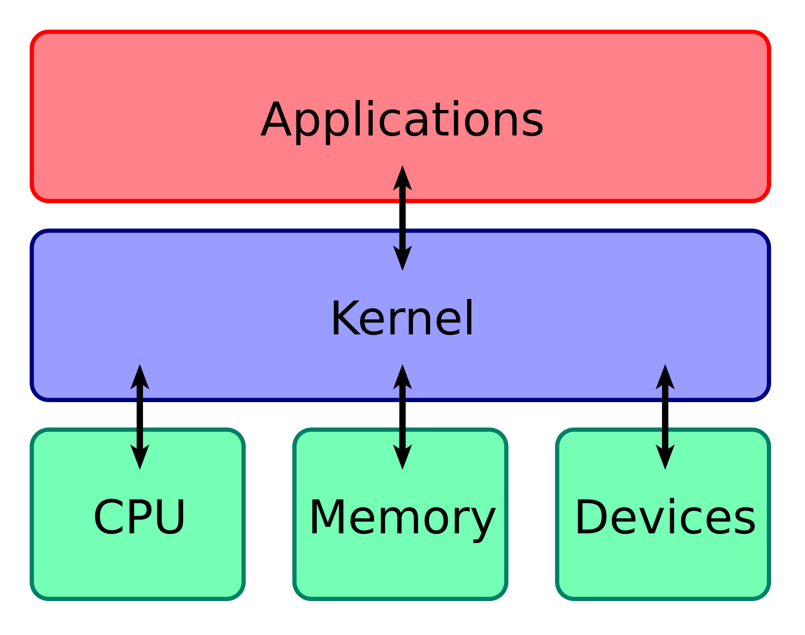
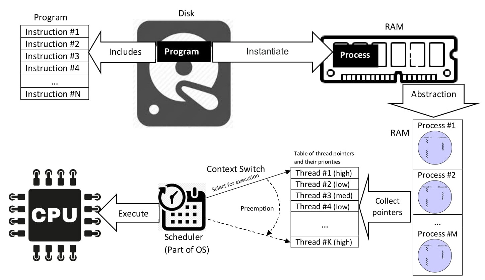

알아놓으면 좋은 것들
- [커널과 유저](#커널과-유저)
- [프로세스와 스레드](#프로세스와-스레드)
- [멀티 스레딩과 동시성 문제](#멀티-스레딩과-동시성-문제)
- [메인 루틴, 서브 루틴, 코루틴](#메인-루틴-서브-루틴-코루틴)
- [JVM의 스레드 모델](#jvm의-스레드-모델)

스레드
- [Thread](#thread)
- [함수형 인터페이스: Runnable, `Callable<T>`](#함수형-인터페이스-runnable-callablet)
- [`ThreadLocal<T>`](#threadlocalt)
- [`InheritThreadLocal<T>`](#inheritthreadlocalt)

비동기
- [ExecutorService](#executorservice)
- [Executors](#executors)
- [ForkJoinPool](#forkjoinpool)
- [`Future<T>`](#futuret)
- [`CompletableFuture<T>`](#completablefuturet)
- [`CompletionStage<T>`](#compltionstaget)
- [CyclicBarrier](#cyclicbarrier)

가상 스레드
- [VirtualThread](#virtualthread)
- [`ScopedValue<T>`](#scopedvaluet)
- [`StructuredTaskScope<T>`](#structuredtaskscopet)

동기화/락/기타
- [synchronized](#synchronized)
- [volatile](#volatile)
- [CountDownLatch](#countdownlatch)
- [ReentrantLock, ReadWriteLock](#reentrantlock-readwritelock)
- [Semaphore](#semaphore) 


## 커널과 유저



[이미지 출처 및 참고 내용](https://en.wikipedia.org/wiki/Kernel_(operating_system))

컴퓨터의 프로세스는 크게 **커널**과 **유저(런타임)** 라고 하는 영역에서 실행된다

커널은 하드웨어에 직접 접근할 수 있는 권한(privilege, 특권) 모드에서 실행되는 시스템 소프트웨어로 하드웨어와 소프트웨어 사이의 중재 역할을 한다

소프트웨어에서 직접 하드웨어를 제어하는 것이 아니라 커널을 통해서만 하드웨어에 접근할 수 있다

아래와 같은 운영체제의 핵심 기능을 커널이 제공한다
- **자원 관리**: CPU, 메모리, 디스크, 네트워크 등의 자원을 효율적으로 분배하는 기능
- **프로세스 스케줄링**: 프로세스와 스레드를 생성하고 종료, 스케줄링하는 기능
- **메모리 관리**: 물리 메모리와 가상 메모리를 추상화하고 할당하는 기능
- **디바이스 제어 기능**: 디스크, 키보드, 모니터 등과 같은 입출력 처리 기능
- **보안 및 보호 기능**: 사용자 간, 프로세스 간의 접근 제어 및 권한 관리 기능
- **시스템 콜 처리**: 사용자 공간에서의 요청을 커널이 처리하는 시스템 콜 인터페이스 제공

```text
[ 자바 프로그램 ]
    ↓
[ 시스템 콜 ]
    ↓
[ 커널 ]
    ↓ 
[ 하드웨어 ]         
```

커널은 컴퓨터가 켜지는 순간(BIOS/UEFI -> 부트로더 -> 커널 -> OS -> 유저 프로그램)부터 꺼질 때까지 작동한다 

일반 프로그램은 절대 커널을 직접 건드릴 수 없으며 시스템 콜을 통해서만 커널과 상호작용할 수 있다

참고로 운영체제는 커널 외에도 시스템 데몬, 윈도우 시스템, 시스템 라이브러리/유틸리티 등으로 구성되어 있는데 이러한 프로그램은 커널 모드가 아닌 유저 모드에서 실행된다

커널 모드와 유저 모드란 컴퓨터 시스템의 안정성과 보안을 지키기 위해 CPU가 실행되는 권한 수준을 두 개로 나눈 것이다

커널 모드는 최고 권한을 가져서 시스템 전체에 접근할 수 있다. 커널의 구성 요소 (프로세스 스케줄링 시스템, IPC 시스템 등)가 커널 모드에서 동작한다

유저 모드는 제한된 권한을 가지기 때문에 자신에게 할당된 자원만 접근할 수 있으며 하드웨어 접근은 커널 시스템 콜을 통해서만 가능하다. 사용자 애플리케이션, 쉘 등이 유저 모드에서 동작한다 

```text
[ 유저 모드 ]
     ↓
[ 시스템 콜, 인터럽트 ]
     ↓
[ 커널 모드 ]
```


## 프로세스와 스레드



[이미지 출처 및 참고 내용](https://en.wikipedia.org/wiki/Thread_(computing))

프로세스는 **자원의 단위**이자 운영체제로부터 실행된 프로그램의 인스턴스로 독립적인 메모리 공간을 가지며 다른 프로세스와 메모리를 공유하지 않는다

커널 레벨에서 하나의 프로세스는 자원을 소유하며 이러한 자원(메모리, 파일 핸들링)을 공유하는 한 개 이상의 커널 스레드를 포함한다

기본적으로 각 프로세스는 격리되어 서로 메모리 등의 자원을 공유하지 않기 때문에 공유가 필요하면 명시적으로 공유 메모리, 소켓 등 IPC를 사용해야 한다

스레드는 **스케줄링과 실행의 단위**이자 프로세스 내에서 실행되는 경량 작업 단위로 프로세스 내에서 여러 개의 스레드가 메모리를 공유하며 동시에 실행될 수 있다 -> 효율적으로 자원을 사용할 수 있지만 경쟁 조건, 교착 상태 등의 동시성 문제가 발생될 수 있다

이러한 프로세스와 스레드는 컴퓨터의 멀티태스킹 기능이나 성능 활용 등을 위해 여러 프로세스가 동시에 실행되거나 프로세스 내에서 멀티 스레드가 동시에 실행될 수 있다

이 때 스레드가 커널에 의해 스케줄링되는 것과 유저 공간에서만 관리되느냐에 따라 스레드 매핑 모델이 달라진다

**커널 스레드**는 커널이 직접 스케줄링하고 관리하는 실행 단위이고, **유저 스레드**는 운영체제가 아닌 런타임이나 라이브러리에서 관리하는 실행 단위이다

운영체제는 프로세스 생성 시 최소 1개의 커널 스레드를 함께 생성하며 이러한 스레드를 **Native Thread** 또는 **Non-Green Thread** 라고 한다

커널 스레드는 커널이 직접 스케줄링하고 관리하기 때문에 커널의 스케줄링 정책을 따르며, 멀티 코어 CPU에서 병렬로 실행될 수 있다

유저 스레드는 유저 공간에서 생성되고 관리되며 커널은 이를 인식하지 못하는데, 이처럼 커널에 알려지지 않은 경량 유저 스레드를 **Green Thread** 라고 한다

스레드 매핑 모델은 총 1:1, M:1, M:N 으로 구성된다

**1:1 모델**은 유저 프로그램이 만든 스레드마다 운영체제가 커널 스레드를 생성해주는 모델로, 각 유저 스레드(유저 프로그램에서 만든 스레드)는 커널에서 독립적으로 스케줄링된다

커널이 스케줄링하므로 I/O 작업이 발생해도 다른 스레드가 실행될 수 있어 유저 스레드가 블로킹되지 않고, 멀티 코어에서 병렬 실행이 가능하다

다만 스레드 생성/전환에 커널 리소스가 필요하므로 오버헤드가 크다는 단점이 있다

자바의 스레드(Thread 클래스)가 이 모델을 따른다

**M:1 모델**은 유저 공간 라이브러리에서 스레드를 관리하여 커널은 전체 하나의 스레드만 인식한다

커널이 관여하지 않아 컨텍스트 스위칭이 매우 빠르다는 장점이 있지만, 하나의 스레드가 시스템 호출(블로킹 I/O 등)을 하면 전체 스레드가 전체 멈출 수 있다 -> 멀티 코어 활용 불가

내부적으로 비동기 I/O를 사용하여 이 문제를 해결할 수 있으며 일반 시스템 콜을 호출하는 것처럼 보이지만 실제론 비동기 I/O로 대체되며, 그 사이에 다른 유저 스레드로 스케줄을 전환하여 CPU 낭비를 최소화한다

**M:N 모델**은 여러 유저 스레드가 몇 개의 커널 스레드에 매핑된다

**스케줄링**이란 프로세스나 스레드의 실행 순서를 결정하는 작업으로 CPU가 어떤 프로세스나 스레드를 언제 실행할지를 결정한다

커널의 스케줄링은 보통 OS가 실행 중인 스레드를 강제로 중단시키고 다른 스레드를 실행하는 **선점형(Preemptive) 스케줄링**을 사용한다

스레드 간 데이터를 공유하고 선점형으로 동작한다면 일반적으로 (유저) 스레드라고 부른다 (Erlang처럼 스레드끼리 데이터를 공유하지 않는 경우도 있으며, 이 경우엔 그냥 프로세스라고 부름)

반대로 스레드가 스스로 자원을 반납하는 형태인 **협력형(Cooperative) 스케줄링**을 사용하는 유저 스레드는 Fiber라고 부른다 (Win32 Fiber API)

CPU가 어떤 작업(프로세스/스레드)을 수행할 때 필요한 모든 상태 정보를 컨텍스트라고 하는데 이 컨텍스트에는 다음과 같은 요소들이 포함된다
- 프로그램 카운터(PC): 다음에 실행할 명령어 주소를 보관하는 레지스터
- 레지스터 값들: 작업 중인 계산, 변수 등을 저장하는 CPU 레지스터들
- 스택 포인터(SP): 함수 호출/리턴 위치를 추적하는데 사용되는 레지스터
- 상태 레지스터(Flags): CPU 내부 상태를 나타내는 플래그들 (carry, interrupt 등)
- 메모리 맵 정보: 가상 주소 매핑, 페이지 테이블 등 (프로세스 전환 시 필요)

스케줄링에 의해 CPU가 특정 프로세스나 스레드를 실행하기 전에 커널은 기존 프로세스나 스레드의 **실행 컨텍스트(Execution Context)** 를 PCB (Process Control Block)에 저장하고 새로운 프로세스나 스레드의 실행 컨텍스트로 전환한다 (해당 PCB에 저장된 레지스터 값, 스택 포인터, 프로그램 카운터 등을 CPU가 로딩함)

이 작업을 **컨텍스트 스위칭(Context Switching)** 이라고 하며 보통 타임 슬라이스(OS가 할당한 시간) 종료, 블로킹 I/O, 높은 우선순위의 작업, 자발적 yield 등으로 인해 발생한다

컨텍스트 스위칭이 되는 대상에 따라 컨텍스트의 크기와 비용이 달라진다 

**프로세스 컨텍스트**는 운영체제가 각 프로세스마다 하나의 **PCB (Process Control Block)**를 유지하며 PC, CPU 레지스터들, SP, 페이지 테이블 정보, 파일 디스크립터, 프로세스 상태(실행 중, 대기 중 등) 등을 포함한다 (PCB는 운영체제 커널의 메모리 영역에 존재하며 사용자 영역에서 이를 접근할 수 없음)

프로세스 컨텍스트 스위칭이 발생하면 이러한 정보들을 모두 운영체제 메모리 공간에 위치한 PCB에 저장하고 기존 저장되어 있던 PCB를 로딩하거나 새로 생성된 PCB를 로딩한다 

또한 프로세스 컨텍스트는 가상 주소 공간과 TLB (Transalation Lookaside Buffer, 가상 주소를 물리 주소로 변환하는 캐시)라는 캐시도 포함하고 있는데 컨텍스트 스위칭 시, 새 프로세스는 다른 가상 주소 공간을 사용하므로 이전 TLB 엔트리가 더 이상 유효하지 않게 되어 비워야 하는데 이를 캐시 무효화(TLB 캐시)라고 한다 

캐시 무효화가 발생하면 캐시 미스로 인해 다시 페이지 테이블부터 참조해야 하므로 다음번 메모리 접근이 느려지게 되는 성능 저하가 발생한다 (시간이 지나면 TLB가 다시 채워지지만, 프로세스 전환이 잦으면 TLB가 자주 비워져 성능 저하가 심해짐)

**커널 스레드 컨텍스트**는 PCB 대신 **TCB (Thread Control Block)**에 SP, PC, 레지스터 세트, 상태 레지스터(플래그), TLS (Thread Local Storage) 정도를 보관한다

프로세스 전환이 아니고 커널 스레드 전환만 일어난다면 페이지 테이블을 수정해야 되거나 TLB가 바뀌지 않기 때문에 캐시 무효화가 발생하지 않게 되어 컨텍스트 스위칭 속도가 프로세스 전환보다 빠르다

**사용자 스레드 컨텍스트**는 PC, SP, 레지스터 세트 정도만 가지며 커널 스레드와 달리 커널이 이 존재를 모른다

또한 TCB도 아닌 유저 공간의 메모리(Heap 등)에 직접 저장되고 커널 호출(시스템 콜)없이 전환될 수 있기 때문에 컨텍스트 스위칭 속도가 가장 빠르다

### 프로그램을 실행하면 프로세스와 스레드가 어떻게 생성되는걸까?

컴퓨터 사용자가 `./myapp` 명령어로 특정 프로그램을 실행한다

OS가 해당 프로그램을 실행하기 위한 프로세스를 생성하는데, 이 때 프로세스의 고유한 주소 공간(가상 메모리)을 확보하고 PCB를  생성한다

그 다음 메인 함수(스레드)가 실행될 스레드를 커널 스레드로 생성하고 이 스레드의 TCB도 생성한다

CPU의 스케줄링에 따라 이 스레드가 CPU를 할당받아 프로그램의 메인 함수가 실행된다

프로세스에서 내부적으로 스레드를 더 만들면 일반적인 경우 OS가 커널 스레드를 추가적으로 생성한다 (1:1 모델)

또는 유저 스레드를 만들어 런타임에서 자체적으로 관리할 수도 있다 (M:1 모델)


## 멀티 스레딩과 동시성 문제

하나의 프로세스 안에서 여러 실행 흐름(스레드)이 동시에 실행되는 것을 멀티 스레딩이라고 한다

멀티 스레딩을 이용하면 응답성을 향상시키거나 자원 효율성과 성능을 높일 수 있다

운영체제의 스케줄러는 아주 짧은 시간 단위로 각 스레드에 CPU 사용 시간을 할당하고 전환하는 방식으로 멀티스레딩을 관리한다

이를 컨텍스트 스위칭(문맥 교환)이라고 하는데, 한 스레드의 실행 컨텍스트(TCB)를 저장하고 다른 스레드의 상태를 불러와 실행을 이어나가는 방식이다

이 전환이 매우 빠르게 일어나기 때문에 사용자 입장에서는 모든 스레드가 동시에 실행되는 것처럼 보인다

실제로 멀티 코어 CPU에서는 여러 스레드가 동시에 실행될 수 있다

싱글코어 CPU에서는 **동시성(Concurrency)**을, 멀티코어 CPU에서는 **병렬성(Parallelism)**을 구현한다

스레드는 프로세스 내에서 프로세스의 자원을 공유하고 자신만 접근할 수 있는 자원을 가질 수 있다

**공유 자원**: 코드, 데이터(Static/Global Variables), 힙 메모리, 파일 디스크립터, 프로세스 환경 등

**고유 자원**: PC, 레지스터, 스택(함수 호출 스택 등), 스레드 ID (TID), 스레드 지역 저장소(TLS, Thread Local Storage), 시그널 마스크, 우선순위/상태 (Runnable, Blocked 등)

```java
public class ThreadExample {

    // 전역 변수(메서드 영역): 공유 대상
    private static int staticVar;

    // 인스턴스 변수(힙): 공유 대상
    // 각 인스턴스마다 별도로 가지지만, 인스턴스를 공유할 수 있기 때문에 공유 대상이 된다
    private int instanceVar;

    // 스레드 로컬: 각 스레드마다 별도로 가진다
    private ThreadLocal<Integer> threadLocalVar = ThreadLocal.withInitial(() -> 0);

    public void main() {
        Runnable run = () -> {
            // 메서드 지역 변수(스택): 각 스레드마다 별도로 가진다
            int methodLocalVar = 0;
            staticVar++;
            instanceVar++;
            threadLocalVar.set(threadLocalVar.get() + 1);
        };

        try (var executor = Executors.newFixedThreadPool(2)) {
            executor.submit(run);
            executor.submit(run);
        } catch (Exception e) {
        }
    }
}
```

멀티스레드 환경에서 각 스레드는 각자의 자원과 실행 흐름을 가지면서 동일한 자원을 공유하기 때문에 여러 가지 문제가 발생할 수 있는데, 이를 동시성 문제라고 한다

대표적인 동시성 문제로 **경쟁 상태(Race Condition)**, **교착 상태(Deadlock)**, **기아(Starvation)**, **라이브락(Livelock)** 이 있다

### 경쟁 상태 (Race Condition)

경쟁 상태란 두 개 이상의 스레드가 공유된 자원(데이터)에 동시에 접근하여 값을 변경하려고 할 때, 실행 순서가 결과에 영향을 미쳐 예상치 못한 결과나 오류가 발생하는 상황을 말한다

이 문제는 근본적으로 **원자적 연산 (Atomic Operation)** 의 부재로 인해 발생한다  

`count++` 같은 코드 한 줄짜리 연산은 컴퓨터 내부에서 여러 단계의 기계어 명령으로 나뉘어 실행된다

1. 읽기(Read): 메모리에서 count의 현재 값을 CPU 레지스터로 가져온다
2. 증가(Increment): CPU 레지스터의 값을 1 증가시킨다
3. 쓰기(Write): CPU 레지스터의 새로운 값을 다시 메모리의 count에 덮어쓴다

이 세 단계가 모두 합쳐져야 하나의 연산이 완료되는 것이다

이처럼 중간에 방해받을 가능성 없이 한 번에 실행되어야 하는 연산을 **원자적 연산(Atomic Operation)** 이라고 한다

하지만 멀티스레딩 환경에서 원자적 연산이 보장되지 않으면 다른 스레드가 중간에 끼어들어 작업을 이어나갈 수 있기 때문에 결과적으로 메모리의 count 값이 예상치 못한 값으로 변경될 수 있다

경쟁 상태가 발생할 수 있는 상황, 즉 원자적 연산이 보장받지 않는 상황은 주로 상호 배제가 지켜지지 않아 발생한다 

상호 배제란 여러 스레드가 동시에 공유 자원에 접근하지 못하도록 하는 것을 말하는데 이것이 지켜지지 않으면 여러 스레드가 동시에 공유 자원에 접근하여 값을 변경할 수 있다

상호 배제를 지키려면 **동기화 (Synchronization)** 메커니즘을 이용해야 한다

동기화는 여러 스레드가 공유 자원을 안전하게 사용하도록 접근 순서를 제어하고 통제하는 기법으로 이를 이용하여 경쟁 상태와 같은 동시성 문제를 해결할 수 있다

동기화에서 사용되는 개념은 크게 **임계 구역(Critical Section)** 과 **잠금(Lock)** 으로 나눌 수 있다

임계 구역은 상호 배제 보호가 필요한 코드 영역을 가리킨다

즉, 둘 이상의 스레드가 동시에 접근하면 문제가 발생할 수 있는 공유 자원 접근 코드 블록이 임계 구역이 된다

**이 구역은 어떤 순간에도 단 하나의 스레드만이 코드를 실행하는 것을 보장하여 원자적 연산이 가능토록 하는 것이 동기화의 주요 목적이다**

```java
// increment 메서드 전체가 임계 구역이 된다
public void increment(int value) {
    // 임계 구역 시작
    int currentValue = getValue();        // 1. 읽기
    int newValue = currentValue + value;  // 2. 계산
    setValue(newValue);                   // 3. 쓰기
    // 임계 구역 종료
}
```

잠금은 임계 구역을 보호하기 위한 동기화 도구로 잠금을 가지고 있어야만 임계 구역에 진입할 수 있도록 제어한다

마치 화장실(임계 구역)을 이용하는 사람(스레드)은 열쇠(잠금)를 가지고 있어야만 들어갈 수 있는 것과 같다

잠금을 이용한 동기화의 동작 방식의 큰 틀은 다음과 같다
1. 잠금 획득(Acquire Lock): 스레드가 임계 구역에 진입하기 전에 잠금을 획득하려고 시도한다
2. 진입 및 실행: 잠금이 있으면 잠금을 획득하고 임계 구역의 코드를 실행한다
3. 대기: 잠금을 다른 스레드가 가지고 있다면 그 스레드가 반납할 때 까지 대기한다
4. 잠금 해제(Release Lock): 임계 구역에서의 모든 작업을 마친 스레드는 반드시 잠금을 반납해야 한다
5. 대기 스레드 실행: 반납한 잠금은 대기하던 다른 스레드 중 하나에게 주어지고, 그 스레드가 임계 구역에 진입한다

이러한 잠금 메커니즘을 대표적인 구현체로 **뮤텍스**와 **세마포어**가 있다

#### 뮤텍스 (Mutex, Mutual Exclusion)

[테스트 코드](../thread/src/test/java/concurrent/MutexTest.java)

뮤텍스는 이름 그대로 상호 배제에 초점을 맞춘 잠금 방식으로 가장 기본적인 동기화 도구이다

오직 하나의 스레드만이 잠금을 획득할 수 있고, 나머지 스레드들은 대기하다가 순차적으로 잠금을 획득하여 임계 구역에 진입한다

자바의 `synchronized` 키워드나 `ReentrantLock` 클래스가 뮤텍스의 대표적인 구현체이다

```java
// synchronized 키워드를 사용해 increment 메서드 전체를 잠근다
public synchronized void increment(int value) {
    // 이 영역은 한 번에 하나의 스레드만 접근할 수 있다
    int currentValue = getValue();        
    int newValue = currentValue + value;  
    setValue(newValue);                   
}
```

#### 세마포어 (Semaphore)

[테스트 코드](../thread/src/test/java/concurrent/SemaphoreTest.java)

세마포어는 여러 개의 스레드가 동시에 임계 구역에 진입할 수 있도록 허용하는 잠금 방식이다

내부에 허용 가능한 스레드 개수를 나타내는 카운터를 가진 뒤 스레드가 임계 구역에 진입할 때 카운터를 감소시키고, 임계 구역을 벗어날 때 카운터를 증가시킨다

카운터가 0이 되면 다른 스레드가 자원을 해제하여 카운터가 1 이상이 될 때까지 모든 스레드는 대기해야 한다

카운터의 최대 값이 1인 세마포어는 뮤텍스와 동일하게 동작하여 바이너리 세마포어라고 한다

자바에서는 java.util.concurrent.Semaphore 클래스가 세마포어의 구현체이다

### 교착 상태 (Deadlock)

[테스트 코드](../thread/src/test/java/concurrent/DeadlockTest.java)

교착 상태란 둘 이상의 스레드가 서로가 가진 자원을 필요로 하여 자원이 풀리길 무한히 기다리는 상태에 빠지는 상황을 말한다

- 스레드 A가 자원 X를 점유하고 자원 Y를 기다린다
- 스레드 B는 자원 Y를 점유하고 자원 X를 기다린다
- 두 스레드는 서로가 가진 자원을 기다리며 영원히 멈춘다

이러한 데드락이 발생하려면 다음의 네 가지 조건이 모두 충족해야 한다
- 상호 배제가 지켜지지 않아야 한다
- 점유와 대기(Hold and Wait): 스레드가 자원을 가진 상태에서 다른 자원을 기다린다 -> 다른 스레드가 해당 자원을 쓸 수 없게 된다 (교착 상태와도 연관있음)
- 비선점(Non-preemption): 한 스레드가 사용 중인 자원을 다른 스레드가 강제로 빼앗을 수 없다
- 순환 대기(Circular Wait): 스레드들이 서로의 자원을 기다린다

운영체제 또는 런타임에서 대기 그래프(WAIT-FOR 그래프)를 통해 데드락 여부를 감지할 수 있으나 언어 차원에서 이러한 명시적 감지가 어렵기 때문에 이러한 상황이 발생하지 않도록 방지하는 것이 중요하다

데드락을 방지하기 위한 방법은 다음과 같다

1. 락 획득 순서를 고정하여 자원을 항상 동일한 순서로 획득하게 하면 순환 대기를 차단할 수 있다
2. 일정 시간 후 락 획득을 포기하여 무한 대기에 빠지는 것을 방지할 수 있다 (tryLock 메서드 사용)
3. 여러 자원을 하나의 큰 자원처럼 관리하여 락을 단순화할 수 있다 (성능 저하가 발생할 수 있음)
4. 데드락 발생을 감지하여 해당 스레드를 강제로 종료한 뒤 복구하는 방법도 있다

자바의 ReentrantLock 클래스는 락 획득을 시도할 때 타임아웃을 발생시켜 데드락을 방지할 수 있는 기능을 제공한다

```java
Lock lock1 = new ReentrantLock();
Lock lock2 = new ReentrantLock();

if (lock1.tryLock()) {
    try {
        if (lock2.tryLock()) {
            try {
                // 작업 수행
            } finally {
                lock2.unlock();
            }
        }
    } finally {
        lock1.unlock();
    }
}
```

### 기아 (Starvation)

기아는 어떤 스레드가 필요한 자원을 지속적으로 할당받지 못해 실행되지 못하는 상태를 말한다

이런 현상은 여러 가지 원인에 의해 발생하지만 그 중 가장 흔한 원인은 우선순위 스케줄링 정책에 있다

우선순위가 높은 스레드가 자원을 계속 점유하여 낮은 우선순위 스레드가 실행 기회를 얻지 못해 기아 상태에 빠지는 것이다

또 다른 원인으로는 락 점유 경쟁에 실패하여 특정 스레드가 계속 대기 상태에 빠지거나 리소스가 한쪽으로 편중되어 특정 스레드가 실행할 기회를 잃는 경우도 있다

특정 스레드가 반복적으로 락 획득에 실패하여 기아 상태가 되는 경우, 이런 현상을 발생시키는 락을 **불공장 락(Fairness Lock)**이라고 한다

**데드락과 기아 상태의 차이점**

| 구분    | 데드락             | 기아                  |
|-------|-----------------|---------------------|
| 스레드 상태 | 모두 멈춘다          | 일부만 멈춘다             |
| 원인    | 순환 대기           | 우선순위 편중(스케줄링), 불공정 락 |
| 특징    | 서로의 자원 해제를 기다린다 | 특정 스레드의 실행이 무시된다    |

### 라이브락 (Livelock)

라이브락은 스레드가 서로를 피하려고 계속 상태를 바꾸지만 결과적으로 아무 일도 하지 못하고 계속 반복만 하는 상황을 말한다

실행은 되고 있지만 아무런 진전을 이루지 못하는 상태로, 데드락과 비슷하지만 스레드가 계속 실행 중인 상태라는 점에서 다르다

아래와 같이 락을 양보하는 구조에서 라이브락이 발생할 수 있다

```java
if (lock.tryLock()) {
    // 작업
} else {
    // 바로 양보
}

while (lock.tryLock()) {
    // 작업
} else {
    // 바로 양보
}
```


## 메인 루틴, 서브 루틴, 코루틴

함수란 하나의 입력을 받아 특정 연산을 수행한 후 결과를 반환하는 독립된 코드 단위를 말한다

그리고 함수를 호출하는 코드 또는 함수를 호출자(Caller)라고 하고 호출된 함수 자체를 호출 대상 함수/피호출자(Callee)라고 한다

```java
public static void main(String[] args) {
    sqaure(5); // 호출자: main, 피호출자: sqaure
}

public static int sqaure(int x) {
    return x * x;
}
```

실질적인 실행 흐름인 스레드는 실행 컨텍스트에 스택을 가지는데, 


## JVM의 스레드 모델


## Thread

## 함수형 인터페이스: Runnable, `Callable<T>`

## `ThreadLocal<T>`

## `InheritThreadLocal<T>`

## ExecutorService

## Executors

## ForkJoinPool

## `Future<T>`

## `CompletableFuture<T>`

## `CompltionStage<T>`

## CyclicBarrier

## VirtualThread

## `ScopedValue<T>`

## `StructuredTaskScope<T>`

## synchronized

## volatile

## CountDownLatch

## ReentrantLock, ReadWriteLock

## Semaphore


