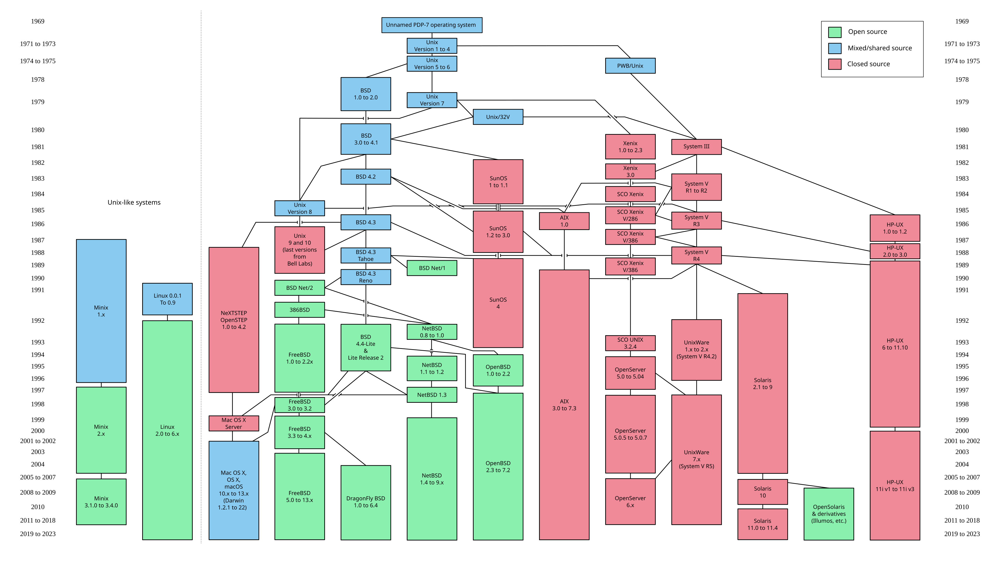

## Unix
- [Unix](#unix)
- [POSIX](#posix)
- [파일 디스크립터 (모든 것은 파일이다)](#파일-디스크립터-모든-것은-파일이다)
- [바이트 스트림](#바이트-스트림)
- [하드웨어 추상화](#하드웨어-추상화)

## Unix

Unix는 1969년 Bell 연구소에서 제작된 운영체제로 Linux, macOS 등의 현대 운영체제에 많은 영향을 끼쳤다.

Unix가 정립한 운영체제의 주요 개념은 다음과 같다
- 파일 시스템 계층 구조
- 프로세스와 프로세스 분리
- 파이프 (`|`)
- 셸
- 파일 디스크립터
- '모든 것은 파일이다'
- 멀티태스킹
- 멀티유저 시스템
- 작은 프로그램들을 조합하는 방식

유닉스 이전 시대의 컴퓨터 가격은 한 대당 상당히 고가였기 때문에 여러 사용자가 하나의 컴퓨터를 공유해야 했다.

'개인용 컴퓨터'라는 개념이 없었고 터미널 여러 개가 중앙 메인프레임에 연결되는 구조였다

당시에는 메모리나 저장공간의 크기가 작았고 CPU 성능이 매우 낮은 환경이었기 때문에 복잡한 거대한 프로그램은 유지하기가 어려웠다.

그래서 Unix는 멀티유저, 멀티태스킹, 자원 공유 등을 핵심 설계 목표로 가졌다.

가장 유명한 원칙인 **'Do One Thing Well'**은 프로그램 하나는 한 가지 일을 명확하게 잘 해내야 한다는 의미를 가진다.

`grep` -> 문자열 검색

`sort` -> 정렬

`wc` -> 줄 수 계산

`cat` -> 파일 출력

각 프로그램은 무겁고 복잡하게 여러 개로 구성되어 있지 않고 하나의 기능을 수행하여 작고 단순하다.

```shell
cat log.txt | grep ERROR | sort | wc -l
```

거대한 프로그램 하나를 만들면 수정이 어려워지고 메모리 사용량이 커진다.

Unix 개발자들은 작은 도구들을 연결하여 유연하게 프로그램을 구성하고자 했다.

그래서 나온 것이 파이프(`|`)이다.

파이프를 통해 작은 프로그램들을 여러 개 조합하여 사용자가 원하는 형태의 결과물을 만들어낼 수 있다


## POSIX

POSIX(Portable Operating System Interface Unix)는 유닉스 계열 시스템에서 소프트웨어와 스크립트가 특정 플랫폼에 구애받지 않고 이식될 수 있도록 공통된 명령어, 쉘, 시스템 콜을 정의한 규격을 말한다.

POSIX: **유닉스 공통 규격**



AT&T, BSD 등 여러 제조사에서 각자의 유닉스를 발전시키면서 시스템 간 호환성 문제가 발생하였고, 이를 해결하기 위해 POSIX가 등장했다.

POSIX 표준을 준수하는 환경(리눅스, 맥, BSD 등)에서 개발된 프로그램과 쉘 스크립트는 다른 POSIX 호환 시스템에서도 수정없이 실행될 수 있다.

터미널에서 `getconf` 명령어로 POSIX 지원 여부와 버전을 확인할 수 있다.

```shell
$ getconf _POSIX_VERSION
200112
```

리눅스는 POSIX 공식 인증을 받지 않았지만 POSIX 표준을 대부분 준수하기 때문에 유닉스 호환(Unix-like) 운영체제라고 한다.


## 파일 디스크립터 (모든 것은 파일이다)

Unix는 모든 컴퓨팅 자원을 파일처럼 다룬다.

디스크와 같은 물리적 장치 뿐만 아니라 프로세스, 커널 객체 등을 모두 파일로 표현한다.

자원마다 읽고 쓰는 API가 다르면 프로그래머는 매번 새로운 인터페이스를 배워야 하므로 운영체제가 복잡해지는 걸 막고 단순함을 유지하기 위해 파일 시스템 API로 통일했다.

따라서 디스크, 키보드, 터미널, 네트워크 소켓은 모두 파일 인터페이스로 접근할 수 있다. (내부 구현은 다름)

```shell
/dev/sda # 디스크
/dev/tty # 터미널
```

'모든 것은 파일이다'라는 문구의 본질적인 의미는 파일 인터페이스를 통해 일관적으로 컴퓨팅 자원을 다루겠다는 의미일 뿐이다.

즉, 모든 컴퓨팅 자원이 디스크 파일 형태로 저장되지 않는다.

(최대한 파일 인터페이스로 통일하려고 했으나 실제로는 socket, icotl 등 예외 인터페이스도 있다)

이 철학의 중심에는 **File Descriptor(FD)**가 있다.

Unix의 프로세스는 디스크 파일, 소켓, 파이프 등 컴퓨팅 자원을 사용할 때 아래와 같이 커널이 integer 값으로 관리하는 파일 디스크립터를 이용한다.

**파일 디스크립터는 커널이 관리하는 열린 자원에 대한 참조이다.**

**그리고 FD는 컴퓨팅 자원인 디스크 파일, 소켓, 파이프 등 커널 객체를 가리킨다.**

```c
int fd = open("test.txt");
read(fd, ...);
write(fd, ...);

// open() 시 커널은 내부 구조를 만든다
// 1. 파일 객체 생성 (또는 FD 참조 증가)
// 2. inode 연결
// 3. offset 저장

// 그 다음 해당 프로세스의 FD 테이블에 등록한다.
// 0 -> stdin
// 1 -> stdout
// 2 -> stderr
// 3 -> test.txt

// open() 함수는 커널 객체를 가리키는 프로세스 번호인 FD 정수값을 반환한다
```

```text
프로세스
  ↓
프로세스 FD 테이블 (정수 인덱스 참조)
  ↓
커널 객체(디스크 파일/네트워크 소켓/파이프 등)
```

프로세스가 파일 디스크립터 통해 커널 객체를 열고, 읽고, 쓸 수 있다.

Unix가 이렇게 파일 디스크립터를 통해 데이터를 읽고 쓰기 때문에 '모든 것은 파일이다'라고 표현하게 된 것이다.

모든 프로세스에는 기본적으로 세 개의 FD가 자동 생성된다.

```text
FD 0 - stdin  (keyboard input)
FD 1 - stdout (terminal output)
FD 2 - stderr (terminal error output)
```

프로세스는 stdin, stdout, stderr 파일 디스크립터를 통해 목적에 맞게 데이터를 읽고 쓴다.

stdin, stdout, stderr는 각각 하나의 프로그램이 아니라 터미널 장치이다.

따라서 `/dev/tty`나 파이프, 파일 등에 연결될 수 있다.

```shell
# /dev/stdin, /dev/stdout, /dev/stderr은 디스크에 실제로 저장된 파일이 아니다
# 커널이 제공하는 가상의 파일이다 (커널 장치 인터페이스)
ls -l /dev/stdin
lr-xr-xr-x  1 root  wheel  0 May 23 10:24 /dev/stdin -> fd/0

ls -l /dev/stdout
lr-xr-xr-x  1 root  wheel  0 May 23 10:24 /dev/stdout -> fd/1

ls -l /dev/stderr
lr-xr-xr-x  1 root  wheel  0 May 23 10:24 /dev/stderr -> fd/2
```

프로세스에서 추가적인 목적에 따라 디스크 파일, 소켓, 파이프를 이용하려면 각각 파일 디스크립터가 생성되어야 하며, 각 FD는 3번부터 순차적으로 값이 지정된다.

```shell
ps aux                 # 실행 중인 프로세스 확인
ls -la /proc/<PID>/fd  # 프로세스 정보 확인
```

맥에서는 `lsof` 명령을 통해 프로세스의 FD를 확인할 수 있다.

```shell
ps aux         # 실행 중인 프로세스 확인
lsof -p <PID>  # 프로세스 정보 확인 (macOS)
COMMAND   PID      USER   FD   TYPE             DEVICE SIZE/OFF NODE NAME
ruby    98269 hansanhha    0u     CHR               16,2   0t2489                 801 /dev/ttys002
ruby    98269 hansanhha    1u     CHR               16,2   0t2489                 801 /dev/ttys002
ruby    98269 hansanhha    2u     CHR               16,2   0t2489                 801 /dev/ttys002
ruby    98269 hansanhha    6u  IPv4 0xc74788e638ad528f      0t0  TCP localhost:terabase (LISTEN)
```

```text
COMMAND     PID      USER   FD   TYPE DEVICE SIZE/OFF                NODE NAME
businesss 77298 hansanhha    0r   CHR    3,2      0t0                 339 /dev/null
businesss 77298 hansanhha    1u   CHR    3,2      0t0                 339 /dev/null
businesss 77298 hansanhha    2u   CHR    3,2      0t0                 339 /dev/null
```

FD 컬럼에서 0r, 1u, 2u 파일 디스크립터를 확인할 수 있다. 

숫자 뒤의 문자의 의미
- `u` -> `read/write` 모드
- `r` -> `read only` 모드
- `w` -> `write only` 모드


## 바이트 스트림

Unix 관점에서 파일은 바이트의 흐름으로 본다.

파일은 아래와 같이 바이트들의 연속일 뿐이다.

```text
0101000110 101110111 ...
```

이렇게 순서대로 흘러가는 바이트들을 **바이트 스트림**이라고 한다.

경계나 구조, 의미가 없으며 그저 바이트의 흐름일 뿐이다.

운영체제는 바이트 스트림이 텍스트인지, 이미지인지, JSON인지, 영상인지 알 필요가 없다.

**파일 디스크립터를 통해 바이트를 읽고 쓰기만 하면 된다.**

아래의 파일 읽기 코드는 `100 바이트를 가져와라`라는 의미밖에 되지 않으며 운영체제는 문자열인지, mp4인지 알 수 없다.

```c
read(fd, buf, 100);
```

바이트 스트림 모델은 읽고 쓰기만 하는 단순한 모델이기 때문에 **구조**를 가질 수 없다.

그래서 애플리케이션에서 파싱, 프레이밍, 직렬화를 수행해야 한다. (JSON, Protobuf 등)


## 하드웨어 추상화

초기 운영체제는 어셈블리어로 작성되었다.

어셈블리어는 CPU 설계와 강하게 결합되어 있다.

```
// x86 어셈블리어
MOV AX, 5
ADD AX, 3
```

```
// ARM 어셈블리어
MOV R0, #5
ADD R0, R0, #3
```

따라서 CPU마다 기계어(명령어 체계)가 완전히 다르기 때문에 CPU가 바뀌면 운영체제를 매번 새로 작성해야 했다.

Unix는 데니스 리치와 켄 톰슨에 의해 C 언어로 재작성되어 운영체제가 하드웨어로부터 추상화되기 시작했다.

C는 어셈블리어와 달리 CPU 명령을 직접 쓰지 않는다. (**추상화**)

```c
// x86, ARM 명령이 아니다
a = b + c;
```

실제 CPU 명령 생성은 컴파일러가 담당한다.

x86 컴파일러는 x86 기계어로 변환하고, ARM 컴파일러는 ARM 기계어로 변환한다.

```text
C 코드
  ↓
컴파일러
  ↓
각 CPU용 기계여
```

Unix 이전의 운영체제는 특정 CPU 전용 코드였다면 C로 작성된 Unix는 대부분 공통 코드를 가진 운영체제가 된 것이다.

그래서 새로운 CPU가 나와도 컴파일러만 만들면 Unix를 해당 CPU가 탑재된 컴퓨터에서도 구동할 수 있었다. (**이식성**)

**운영체제가 하드웨어 종속 코드에서 이식 가능한 소프트웨어로 바뀌게 된 것이다.**

다만 C로 작성해도 CPU마다 다른 부분이 있기 때문에 CPU 의존 코드가 남아있다.

인터럽트 처리, 부트코드, 컨텍스트 스위치, syscall 진입 등

현대 OS도 CPU 독립적인 코드와, CPU 의존적인 코드로 나뉜다.

[Linux](https://github.com/torvalds/linux) 소스코드의 `arch` 디렉토리를 보면 `arch/x86/`, `arch/arm`, `arch/riscv`와 같이 CPU별 디렉토리가 따로 있다.
