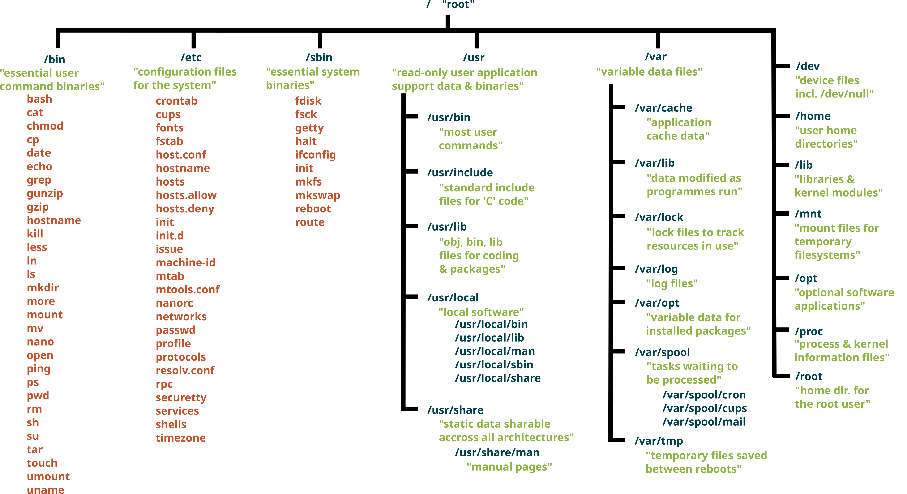

## 파일시스템과 권한
- [파일 시스템](#파일-시스템)
  - [VFS (Virtual file System)](#vfs-virtual-file-system)
- [단일 계층 구조](#단일-계층-구조)
- [마운트](#마운트)
- [VFS 객체](#vfs-객체)
  - [superblock](#superblock)
  - [inode](#inode)
  - [dentry](#dentry)
  - [file](#file)
    - [`file_operations`](#file_operations)
    - [FD, FD Table](#fd-fd-table)
- [하드 링크와 심볼릭 링크](#하드-링크와-심볼릭-링크)
  - [주의사항](#주의사항)
- [파일 정보 (권한과 타입)](#파일-정보-권한과-타입)
- [저널링](#저널링)
- [스냅샷](#스냅샷)
- [압축](#압축)
- [암호화](#암호화)
- [Copy-on-Write](#copy-on-write)


## 파일 시스템

파일 시스템이란 디스크에 저장된 바이트 블록을 사람이 사용할 수 있도록 파일, 디렉토리 구조로 추상화한 계층이다.

컴퓨터 디스크에는 실제로 아래와 같은 바이트들만 저장된다.

```text
00010101
10101010
11000110
...
```

디스크는 어떤 바이트가 사진인지, PDF인지, 소스 코드인지 알 수 없고 바이트 덩어리만 저장할 뿐이다.

운영체제가 파일 이름, 디렉토리 구조, 권한, 생성 시간, 파일 크기 등을 관리하는 계층을 두는데 이것이 파일 시스템이다.

파일 시스템 역할
- 파일 저장
- 디렉토리 관리
- 권한 관리
- 메타데이터 관리 (생성 시간, 소유자 등)

파일 시스템은 저장장치의 특정 영역(파티션, 볼륨 등)에 생성된다.

```text
// 파일 시스템이 없는 상태
SSD
┌───────────────────┐
│                   │
│     1TB SSD       │
│                   │
└───────────────────┘
```

```text
// 1TB SSD에 파일 시스템을 생성한 상태
SSD
┌───────────────────┐
│      ext4         │
└───────────────────┘
```

```text
// 하나의 디스크에 여러 파일 시스템을 생성한 상태
SSD
┌─────────┬─────────┬─────────┐
│ ext4    │ ext4    │ XFS     │
└─────────┴─────────┴─────────┘
```

### VFS (Virtual file System)

파일 시스템은 그 기능과 목적에 따른 구현체가 있으며 운영체제별로 다르게 지원된다.

맥: APFS

윈도우: NTFS

리눅스: ext4, XFS, NTFS 등

유닉스/리눅스는 파일 시스템과 애플리케이션 사이에 공통 인터페이스를 제공하는 계층을 두어 일관되게 파일을 관리할 수 있게 하였다.

이 공통 인터페이스가 VFS이다.

**VFS는 커널이 다양한 파일 시스템을 동일한 파일 인터페이스로 다루기 위한 추상화 계층이다.**

사용자가 `open()`을 호출하면 VFS가 이를 실제 파일 시스템 구현에 맞게 변환하는 작업을 수행한다.

```text
Application
     │
open/read/write
     │
     ▼
    VFS
     │
 ┌───┼────┬─────┐
 ▼   ▼    ▼     ▼
ext4 XFS Btrfs NFS
```

이 덕분에 사용자는 파일이 디스크에 있는지, 네트워크에 있는지, 커널이 즉석에서 생성한 정보인지 상관하지 않고 동일한 파일 API를 사용할 수 있다.

파일 시스템에 나타나는 `/dev/null`은 실제 디스크 파일이 아니다.

애플리케이션에서 `/dev/null`을 사용하면 VFS가 요청을 받고 커널을 통해 생성하는 것 뿐이다.

## 단일 계층 구조

유닉스/리눅스는 윈도우처럼 C, D, E 드라이브 개념 대신 모든 저장장치를 하나의 트리로 구성한다.

그 중 최상위 디렉토리를 **루트(`/`)**라고 하며 시스템의 모든 파일과 디렉토리는 루트로부터 시작된다.

리눅스

```text
/
├── bin
├── home
├── dev
├── tmp
├── usr
└── ...
```

맥OS

```text
/
 ├─ Users
 ├─ Applications
 ├─ System
 ├─ dev
 └─ ...
```

유닉스/리눅스의 경우 파일 시스템 계층 표준(filesystem Hierarhcy Standard)을 두어 서로 다른 배포판이더라도 시스템 디렉토리를 일관적으로 구조화한다.




## 마운트

마운트는 디스크 파티션, USB 드라이브, 네트워크 폴더 등 파일 시스템을 현재 디렉토리 트리에 연결하는 작업을 말한다.

이 때 연결되는 디렉토리를 마운트 포인트라고 한다.

유닉스/리눅스의 디렉토리는 [단일 계층 구조](#단일-계층-구조)이므로 최상위 디렉토리가 하나 뿐이다.

윈도우처럼 `C:`, `D:`, `E:` 디스크가 있지 않다.

만약 SSD가 여러 개 있다면 유닉스/리눅스는 아래와 같이 파일 시스템을 컴퓨터에 연결한다.

```text
SSD1 -> /
SSD2 -> /data
SSD3 -> /backup
```

SSD2 파일 시스템 안에 아래와 같이 파일이 있다고 해보자

```text
SSD2
┌─────────────┐
│ ext4 FS     │
└─────────────┘
     ├── a.txt
     ├── b.txt
     └── images
```

SSD2를 `/data` 디렉토리에 마운트하면 아래와 같이 파일 시스템에 연결되어 접근할 수 있게 된다.

그리고 `/data`는 파일 시스템이 연결되는 위치인 마운트 포인트가 된다.

마운트하기 전에 동일한 디렉토리가 있었다면 디렉토리의 기존 파일들은 잠시 가려지며 언마운트를 하면 이전 파일들에 다시 접근할 수 있다.

```text
/
├── home
├── usr
└── data
     ├── a.txt
     ├── b.txt
     └── images
```

```shell
# 사용자가 /data 디렉토리를 사용하면 VFS는 /data에 마운트된 SSD2의 ext4 파일 시스템을 이용한다
cd /data
ls

/data
  ↓
SSD2의 ext4 파일 시스템
```

하나의 디스크에 파티션을 나눠 파일 시스템을 사용할 때도 마찬가지로 현재 디렉토리 트리에 마운트시킨다.

논리적인 마운트와 물리적인 저장 장치의 연결은 VFS가 담당한다.


## VFS 객체

유닉스/리눅스는 VFS를 통해 유연하고 일관적으로 파일과 디렉토리를 관리하고 있는데, 이 시스템의 핵심적인 객체에 대해 알아보자.

사용자가 파일을 열면 내부적으로 아래와 같은 순서로 처리된다.

```c
fd = open("/home/userA/hello.txt");
```

```text
Task(Process)
 ↓
FD Table
 ↓
file
 ↓
dentry
 ↓
inode
 ↓
superblock
 ↓
filesystem Driver (ext4, NTFS 등)
 ↓
Disk (/dev/sdb1 등)
```

### superblock

슈퍼블록은 마운트된 파일시스템 인스턴스를 나타낸다.

마운트된 `mount /dev/sdb1 /`, `mount /dev/sdb1 /data` 모두 ext4 파일시스템을 사용하는 경우

`superblock #1`, `superblock #2`이 존재하게 된다.

각 슈퍼블록은 파일시스템 종류, 루트 디렉토리, 블록 크기 등의 정보를 담고 **`s_op`라는 함수 포인터 구조체를 가지고 있는데 이를 통해 해당 파일 시스템 구현체의 기능에 접근할 수 있다.**

### inode

inode는 디스크에 저장된 개별 파일이나 개별 디렉토리를 나타낸다.

유닉스/리눅스 시스템에서는 파일명이 실제 파일/디렉토리 위치를 가리키고 있지 않다.

대신 inode 객체가 가리키며, 모든 파일과 디렉토리는 고유한 inode를 가진다. (유닉스/리눅스는 디렉토리도 하나의 파일로 취급함)

inode는 파일의 권한, 소유자, 파일 크기, 생성/수정 시간, 파일의 내용이 저장되는 디스크 블록 위치 정보를 가지고 있다.

**단, 파일 경로와 파일 이름은 가지고 있지 않다.**

하드 링크로 여러 개의 파일명이 동일한 파일을 가리키게 하기 위함이다.

```text
ln a.txt b.txt

a.txt ----┐
          ▼
       inode 100
          ▲
b.txt ----┘
```

### dentry

dentry는 파일 경로에 있는 파일명을 inode와 연결하는 역할을 한다.

`/home/userA/hello.txt` 라는 파일 경로에서 home, userA, hello.txt가 각각 하나의 dentry가 된다.

home dentry는 home의 inode를, userA dentry는 userA의 inode를, hello.txt dentry는 hello.txt inode를 연결한다.

dentry는 파일 경로를 찾는 과정에서 동적으로 생성되며 dentry Cache(dcache)에 저장되어 재사용된다.

### file

file은 특정 프로세스에서 열린 파일을 나타낸다.

서로 다른 프로세스에서 동일한 파일을 열면 각각 고유한 file 객체를 반환받는다.

동일한 프로세스에서 같은 파일을 여러 번 열어도 고유한 file 객체를 반환받는다.

```c
fd1 = open("a.txt");
fd2 = open("a.txt");
```

```text
// 커널 내부
   inode 100
   ▲       ▲
   │       │
file A   file B
```

이는 파일을 읽는 위치(offset)이 다르기 때문이다.

file은 파일을 현재 어느 부분까지 읽거나 썼는지를 나타내는 정보(cursor, offset, `f_pos`), 접근 모드(읽기 전용, 쓰기 전용, 붙여쓰기 등), dentry 객체 포인터 등을 가진다.

실제 파일과 관련된 정보(inode)와 파일 접근(file)을 분리함으로써 하나의 inode는 여러 개의 file 객체에 의해 참조될 수 있다.

그리고 각 file 객체는 자신만의 파일 접근 위치를 가지고 있으므로 다른 프로세스로부터 영향을 받지 않게 된다.

#### `file_operations`

**유닉스/리눅스 커널은 file 객체의 `file_operations` 구조체를 통해 파일 시스템 다형성을 구현한다.**

디스크 파일, 파이프, 리다이렉션, `/dev/null`과 같은 커널 객체, 소켓 등을 파일 API를 통해 접근할 수 있는 것은 `file_operations` 덕분이다.

파일 API를 호출하면 내부적으로 `file_operations`를 호출하여 실질적으로 파일 API를 구현한 함수가 이를 처리한다.

#### FD, FD Table

FD(file Descriptor)는 프로세스에서 열린 파일에 접근할 수 있는 정수 값이다.

open() 함수를 호출하면 커널이 경로를 탐색하여 file 객체를 생성하고 이를 참조할 수 있는 정수 값을 반환한다.

FD Table은 프로세스에서 file 객체에 접근할 수 있게 하는 인덱스 테이블로, 모든 프로세스는 고유한 FD Table을 가지게 된다.

프로세스가 생성되면 FD Table에는 기본적으로 stdin(FD 0), stdout(FD 1), stderr(FD 2)가 부여된다.

그리고 프로세스에서 파일을 열 때마다 FD 값이 증가되고 FD Table에 엔트리가 저장된다.

프로세스를 fork하면 자식 프로세스는 부모 프로세스의 FD Table을 상속받고, 부모에서 파일을 읽어서 offset이 증가하면 자식도 증가된 offset을 보게 된다.


## 하드 링크와 심볼릭 링크

유닉스/리눅스에서 파일의 위치 정보는 [inode](#inode) 객체가 보관하고 있다.

inode는 파일명을 가지고 있지 않고 파일명이 inode를 가리키고 있다.

이는 여러 개의 파일명이 동일한 inode를 가리키게 하기 위함이다.

**하드 링크는 같은 inode를 가리키는 새로운 파일 이름을 말한다.**

아래의 `a.txt`와 `b.txt`는 사실상 같은 파일이라고 볼 수 있다.

```shell
ln a.txt b.txt

a.txt ─┐
       │
       ▼
     inode 100
       ▲
       │
b.txt ─┘
```

두 파일의 inode 번호를 확인하면 동일한 것을 볼 수 있다.

```shell
ls -li a.txt b.txt

100 a.txt
100 b.txt
```

그래서 `a.txt` 파일에서 파일 내용을 수정한 뒤 `b.txt`로 파일 내용을 출력하면 수정된 내용까지 표시된다.

만약 `rm a.txt`로 파일을 삭제한다면 실제로 해당 파일은 삭제되지 않는다.

아직 inode를 참조하는 파일 이름이 남아있기 때문이다.

inode는 링크 카운트를 가지는데 카운트 값이 0이 될 때 실제로 inode를 제거하고 데이터 블록을 회수한다.

**심볼릭 링크는 파일명을 저장한 inode를 가리키는 파일명을 말한다**

`b.txt`가 `a.txt` 심볼릭 링크하면 하드 링크때처럼 두 개의 파일명이 동일한 inode를 가리키는 대신 `b.txt`는 'a.txt' 경로 문자열이 저장된 inode를 가리킨다.

```shell
ln -s a.txt b.txt
```

```text
b.txt
  ↓
inode 200
  ↓
"a.txt"

a.txt
  ↓
inode 100
  ↓
데이터
```

`cat b.txt` 명령을 수행하면 `b.txt`의 inode를 읽은 후 'a.txt' 문자열을 발견한다.

`a.txt`를 다시 탐색하여 `inode 100`에 접근하여 데이터를 읽는다.

두 파일의 inode 번호를 확인하면 서로 다르며 `b.txt`가 `a.txt`를 가리키고 있다.

```shell
ls -il a.txt b.txt

100 a.txt
200 b.txt -> a.txt
```

이 때 `rm a.txt`로 원본 파일을 삭제하면 `b.txt -> a.txt`는 남지만 `cat b.txt`로 접근할 때 `No such file or directory`라며 원본 파일에 접근할 수 없게 된다.

이런 링크를 깨진 심볼릭 링크(Dangling Symlink)라고 한다.

### 주의사항

**서로 다른 파일 시스템에는 하드 링크를 만들 수 없고 심볼릭 링크만 가능하다.**

inode 번호는 각 파일 시스템 내부에서만 의미가 있기 때문에 하드 링크를 만들 수 없다.

반면 심볼릭 링크는 경로 문자열만 저장하므로 파일 시스템을 넘나들 수 있다.

**디렉토리 하드링크를 만들 수 없다.**

하위 디렉토리가 상위 디렉토리를 하드 링크하면 순환 참조가 만들어지기 때문에 일반 사용자는 디렉토리에 대한 하드 링크를 만들 수 없다.


## 파일 정보 (권한과 타입)

`ls -l` 명령을 사용하면 파일과 디렉토리에 대한 정보를 확인할 수 있다. 

```shell
ls -l hello.txt

-rw-r--r-- 1 hansanhha staff 1234 Jun 2 10:00 hello.txt

# -rw-r--r--: 파일 타입(-), 권한(rw-r--r--)
# 1: 하드링크 수
# hansanhha: 소유자
# staff: 그룹
# 1234: 파일 크기(바이트)
# Jun 2 10:00: 수정 시간
# hello.txt: 파일 이름
```

**파일 타입**
- 일반 파일: `-` 
- 디렉토리: `d` 
- 심볼릭 링크: `l`
- 소켓: `s`
- FIFO/Named Pipe: `p` (프로세스간 데이터 스트림 전달용)
- Character Device: `c` (`/dev/null`, `/dev/tty` 등 바이트 단위 장치)
- Block Device: `b` (`/dev/sda` 등 디스크 블록 단위 장치)

**파일 권한**

```text
rwx r-x r--
│   │   │
│   │   └ others
│   └ group
└ owner

r(read): 파일 읽기 가능
w(write): 파일 수정 가능
x(execute): 파일 실행 가능

디렉토리의 rwx
- r: 목록 조회 가능 (ls)
- w: 파일 생성/삭제 가능 (touch, rm 등)
- x: 진입 가능 (cd, cat 등)
```

rwx 권한은 소유자, 그룹, 기타별로 비트로 표현할 수 있다.

```text
rwx: 7
rw-: 6
r--: 4

rwx r-x r--: 754
```

## 저널링

## 스냅샷

## 압축

## 암호화

## Copy-on-Write


