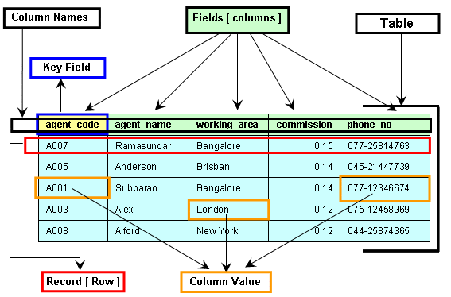
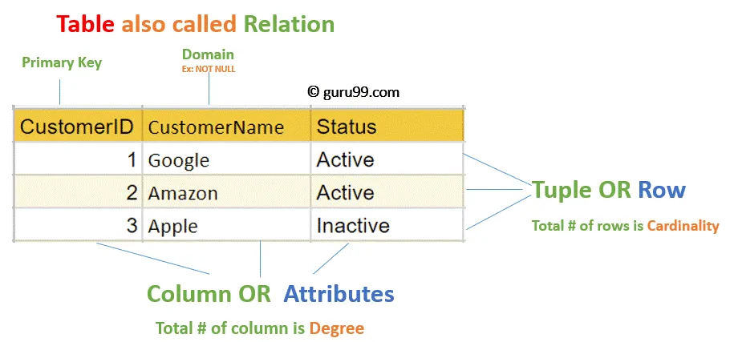
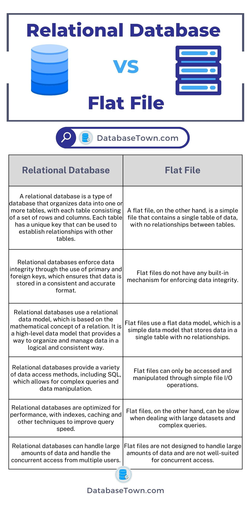
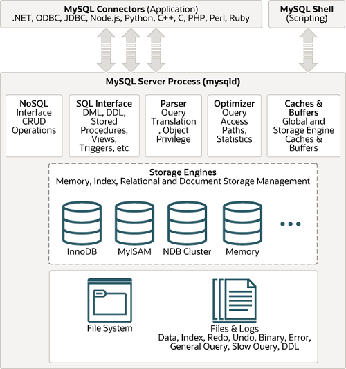
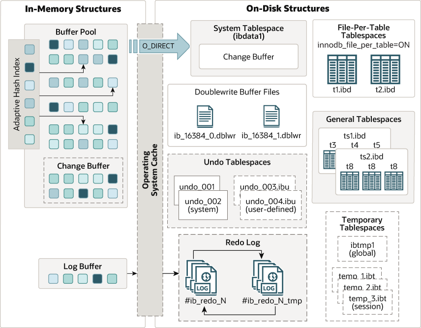

[RDBMS](#rdbms)

[MySQL의 아키텍처](#mysql의-아키텍처)

[MySQL 동작 흐름](#mysql-동작-흐름)

[핵심 포인트](#핵심-포인트)

[MySQL에서 제공하는 프로그램들](#mysql에서-제공하는-프로그램들)


## RDBMS

[참고글](https://www.astera.com/type/blog/relational-database-management-system/)

DBMS(Database Management System)는 데이터베이스로부터 데이터를 저장, 조회, 관리하도록 설계된 소프트웨어를 의미한다

엔터프라이즈 데이터베이스 중 가장 널리 사용되는 시스템이 RDBMS이다

RDBMS(Relational Database Management System)는 데이터를 로우와 컬럼으로 구성된 **테이블**에 구조화하여 관리하는 데이터베이스 시스템이다

아래의 이미지에서 볼 수 있듯이 각 로우(한 줄)는 테이터의 레코드(튜플)을 나타내고, 각 컬럼(한 칸)은 속성(필드)을 나타낸다 (로우=레코드=튜플, 컬럼=속성=필드)

관계형 데이터베이스는 Structured Query Language(SQL)을 이용하여 데이터를 저장하고 조회한다



[이미지 출처](https://www.w3resource.com/sql/sql-basic/the-components-of-a-table.php)

RDBMS의 주요 특징은 다음과 같다

**1. 스키마 기반 테이블**

RDBMS는 테이블의 데이터 구조화를 보장하기 위해 컬럼과 데이터 타입을 미리 정의한 스키마를 사용한다

**2. 기본 키와 외래 키**

테이블 간의 관계를 각 레코드를 식별할 수 있는 기본키와 다른 테이블의 데이터를 링크할 수 있는 외래 키를 통해 정의한다

각 테이블은 고유한 기본 키를 가지며 외래 키를 통해 다른 테이블과의 관계를 설정할 수 있다

**3. ACID 준수**

RDBMS는 트랜잭션 ACID (Atomicity, Consistency, Isolation, Durability) 원칙을 준수한다

이 원칙을 준수함으로써 부분 업데이트 방지, 데이터 무결성 유지, 동시성 제어를 보장하고 신뢰성있는 트랜잭션 시스템을 제공한다  

**4. 정규화 (Normalization)**

데이터 중복을 줄이고 여러 테이블로 데이터를 분리하여 데이터의 효율성을 향상시킨다

**5. 확장성 (Scalability)**

전통적인 관계형 데이터베이스는 더 강력한 하드웨어로 업그레이드하는 수직적인 확장성만 가능했다

하지만 최근 RDBMS는 대용량 데이터를 효율적으로 다룰 수 있도록 수평적 스케일링을 지원하기 위해 분산 시스템 구조를 채택하고 있다 

이외에도 다양한 관계형 데이터베이스의 특징은 다음과 같다
- RDBMS는 여러 유저들이 동시에 연산(CRUD)을 수행하면서도 데이터의 무결성을 보장하고 응답 시간을 줄이는 등의 기능을 지원하기 위한 여러가지 알고리즘을 사용한다
- 키와 인덱스를 통해 데이터 요소간의 관계를 지정한다

**RDBMS가 위의 설명처럼 다양한 특징을 갖는 가장 큰 목적은 대용량 데이터를 효율적으로 다루고, 데이터의 무결성을 보장하며 빠른 CRUD 연산을 지원하기 위함이다** 

### 테이블 간의 관계

테이블, 컬럼, 로우가 관계형 데이터베이스의 주요 구성 요소이다

아래의 이미지는 고객의 주문을 처리하기 위한 데이터베이스의 구조를 보여준다

첫 컬럼은 고객의 기본 키인 ID를 나타내는데, 기본 키는 테이블의 각 레코드를 고유하게 식별하는 역할을 한다

그 이외의 컬럼들은 비즈니스와 관련된 정보를 저장하며 데이터베이스는 각 로우마다 고유한 고객 ID를 할당한다



각 테이블은 관계를 통해 서로 다른 테이블과 연결될 수 있다

**1:1 관계**: 테이블의 한 레코드가 다른 테이블의 한 레코드와 연결되는 관계

**1:N 관계**: 테이블의 한 레코드가 다른 테이블의 여러 레코드와 연결되는 관계

**N:M 관계**: 테이블의 여러 레코드가 다른 테이블의 여러 레코드와 연결되는 관계

관계형 데이터베이스는 테이블을 생성하기 전에 테이블 간 관계에 대해 다음와 같이 보장한다
- 각 테이블은 NULL이 아닌 고유한 기본 키를 가져야 한다
- 두 테이블을 연결시키는데 사용되는 외래 키는 한 테이블에 존재해야 하며 다른 한 테이블의 기본 키를 참조해야 한다

또한 일반적으로 RDBMS에는 데이터 딕셔너리와 메타데이터 컬렉션이 함께 제공된다

이들은 데이터베이스 내 모든 유저의 데이터 객체를 정의하여 유저가 데이터베이스에 존재하는 모든 객체를 식별하고 누가 접근할 수 있는지 확인할 수 있도록 한다

### Relational Database vs Non-Relational Database

관계형 데이터베이스와 비관계형 데이터베이스의 주요 차이점은 데이터를 구조화하고 저장하는 방식에 있다

관계형 데이터베이스는 구조화기반(관계), 미리 정의된 스키마를 통한 테이블 포맷을 사용하는 반면, 비관계형 데이터베이스(NoSQL)는 비구조화 또는 세미 구조화 기반으로 확장성과 고성능을 목적에 둔 유연한 데이터 모델(key-value, documents, graphs, wide-column stores)을 사용한다

관계형
- 스키마 베이스
- Strong Consistency (트랜잭션 ACID 준수)
- 데이터 무결성/일관성/신뢰성 보장
- 정규화
- 수직적 확장성

비관계형
- Schema-less 또는 유연한 스키마
- Eventual Consistency
- 높은 확장성 (수평적 확장성)
- 대용량 데이터 고속 처리

RDBMS: MySQL, PostgreSQL, Oracle, SQL Server, SQLite, Db2

NoSQL: Documents(MongoDB, CouchDB), Key-Value(Redis, DynamoDB), Wide-Column Stores(Cassandra, HBase), Graph Databases(Neo4j, Neptune)

##### relational vs flat file



[이미지 출처](https://databasetown.com/relational-database-vs-flat-file-differences-similarities/)


## MySQL의 아키텍처





[이미지 출처](https://dev.mysql.com/doc/refman/9.3/en/pluggable-storage-overview.html#mysql-architecture-diagram)

[이미지 출처](https://dev.mysql.com/doc/refman/8.4/en/innodb-architecture.html)

[참고글](https://www.geeksforgeeks.org/architecture-of-mysql/)

MySQL은 **클라이언트 - 서버 구조**를 채택하며 주요 레이어로 클라이언트, 서버, 스토리지 엔진, 물리(파일 시스템) 레이어가 있다

클라이언트는 MySQL 서버(mysqld)로부터 리소스를 가져오고, 서버는 네트워크 서비스를 통해 여러 클라이언트 요청을 처리하고 결과를 반환하는 역할을 한다

MySQL은 여러 클라이언트 요청을 처리하기 위해 멀티 스레드을 사용하며 이는 확장할 수 있는 구조로 설계되어 있다

### 클라이언트 레이어

클라이언트 레이어는 MySQL 서버와 연결되어 커맨드 프롬프트, GUI 툴, 프로그래밍 언어(커넥터)의 SQL 쿼리 등을 통해 서버에게 특정 명령을 전송한다

클라이언트 레이어의 주요 서비스로는 커넥션 핸들링, 인증, 보안 등이 있다

**커넥션 핸들링**은 클라이언트가 서버에게 요청을 전송하고, 서버는 요청을 수신할 수 있도록 연결을 관리한다

하나의 클라이언트가 서버와 연결되면 해당 커넥션에 대한 서버의 스레드를 점유하게 되는데 이 스레드가 클라이언트의 쿼리를 실행하는데 활용된다

**인증**은 클라이언트가 MySQL 서버와 연결되기 위해 사용자 이름과 비밀번호를 통해 인증을 수행한다

**보안**은 클라이언트가 MySQL 서버와 성공적으로 연결된 후 해당 클라이언트가 쿼리를 실행할 수 있는 권한이 있는지 확인한다

### 서버 레이어

서버 레이어는 MySQL의 모든 관계형 데이터베이스 시스템 기능을 제공하는 핵심 레이어로 클라이언트가 보낸 요청을 처리하고 결과를 반환하는 역할을 한다

이 과정에 참여하는 주요 컴포넌트로 스레드 핸들링, 파서, 옵티마이저, 쿼리 캐시, 버퍼 등이 있다

**스레드 핸들링**은 클라이언트와 서버가 연결될 때 해당 커넥션에 대한 스레드가 할당된다

이 때 스레드는 서버 레이어의 스레드 핸들링에 의해 제공되며 클라이언트의 쿼리를 실행하는 스레드 역시 이 레이어에서 관리된다

**파서**는 클라이언트가 보낸 쿼리(입력)에 대한 파스 트리(Parse Tree)를 생성하는 역할을 한다

어휘 분석(Lexical Analysis)을 통해 여러 토큰으로 분할하고 구문 분석(Syntax Analysis)과 의미 분석(Semantic Analysis)을 통해 파스 트리를 생성한다

**옵티마이저**는 파싱이 완료되면 실행 계획(인덱스, 조인 선택) 수립, 테이블 스캔 순서, 비용 계산 등의 쿼리 최적화 작업을 수행한다

**버퍼/캐시**는 입력으로 주어진 쿼리문에 대한 완료된 결과/에러, 테이블 메타데이터(인덱스, 객체 등), 인덱스 엔트리 등을 저장하는 역할을 한다

MySQL 서버는 SELECT 쿼리를 파싱하기 전에 쿼리 캐시를 확인하는데, 캐시 안에 동일한 클라이언트가 작성한 쿼리가 있다면 파싱, 최적화, 실행 단계를 건너뛰고 캐시에 저장된 결과를 반환한다

참고로 **쿼리 캐시는 MySQL 8.0부터 제거**되었으며 대신 애플리케이션 레벨 캐싱(하이버네이트, 액티브 레코드 패턴), Materialized Views, 레디스 같은 캐싱 시스템을 활용할 수 있다

### 스토리지 엔진 레이어

MySQL의 스토리지 엔진 레이어는 다양한 상황과 요구사항에 맞춰 선택할 수 있는 스토리지 엔진을 제공한다 

InnoDB, MyISAM, NDB Cluster, Memory 등

이러한 스토리지 엔진은 사용자가 만든 테이블에 갈아끼울 수 있는 플러그인 형태로 동작한다 (Pluggable Storage Engine Architecture)

InnoDB 엔진은 기본 스토리지 엔진으로 트랜잭션 지원 및 ACID를 준수하며, MVCC 기반 동시성 제어, 외래 키 제약조건, 행 수준 잠금(Row-level Locking), 자동 복구 기능(Crash Recovery) 등을 지원한다. 일반적인 웹 서버 애플리케이션, 금융 등의 트랜잭션 중심 서비스에서 많이 사용된다

MyISAM 엔진은 과거에 MySQL의 기본 스토리지 엔진으로 트랜잭션을 지원하지 않지만 빠른 읽기 성능과 간단한 구조를 제공한다 (테이블 수준 잠금, 외래 키 및 자동 복구 미지원). 단순한 로그 분석, 읽기 위주 통계 처리, 임시 데이터 저장소용으로 사용된다

NDB Cluster 엔진은 분산형 스토리지 엔진으로 데이터 분산 저장(High Availability), 자동 샤딩, 트랜잭션, 스케일 아웃 등을 지원한다. 게임 서버, 실시간 고가용성 분산 시스템과 같이 분산 클러스터 환경이 필요한 경우에 사용된다

Memory 엔진은 데이터를 메모리에 저장하여 읽기/쓰기에 빠른 성능을 제공하지만 데이터가 휘발성이며 서버가 종료되면 데이터가 사라진다. 임시 데이터 저장, 캐시 용도로 사용된다

### 물리(파일 시스템) 레이어

물리 레이어는 데이터를 실제로 시스템의 디스크에 저장하고 관리하는 역할을 한다

단순히 데이터를 저장하는 것 뿐만 아니라 성능, 안정성, 복구, 동시성 제어 등의 요소를 고려하여 설계되어 있다

주요 구성 요소로는 데이터 파일, 리두 로그, 언두 로그, 이중 쓰기 버퍼, 버퍼풀, 바이너리 로그 등이 있다 (InnoDB 스토리지 엔진 기준)

**데이터 파일**은 실제 테이블과 인덱스가 저장되는 테이블 스페이스 파일로 `*.ibd` (개별 테이블 스페이스) 또는 `ibdata1` (공유 테이블 스페이스) 형태로 저장된다

페이지 저장 단위의 기본 크기는 16KB이고 페이지 -> 익스텐트 -> 세그먼트 구조로 되어 있다

**리두 로그**는 트랜잭션 **ACID 중 영속성(Durability)**을 보장하기 위해 사용되는 로그로 변경사항을 기록한다 (가장 먼저 기록됨)

MySQL은 데이터 변경 사항을 데이터 파일에 기록하기 전에 로그 파일에 먼저 기록하는 Write-Ahead Logging(WAL) 방식을 사용한다

`ib_logfile*` 형태의 파일 이름을 가지며 만약 시스템이 충돌하면 이 로그를 기반으로 데이터를 복구할 수 있다 -> 영속성 보장

**언두 로그**는 이전 값을 저장하는 로그로 **트랜잭션 롤백, MVCC** 구현에 사용된다 

일반적으로 InnoDB 시스템 테이블 스페이스 내부에 존재하고 필요에 따라 Undo 테이블 스페이스로 분리할 수 있다

**이중 쓰기 버퍼**는 디스크 쓰기 과정 중 발생하는 오류를 대비하기 위한 중간 보호 장치로 InnoDB는 데이터를 실제 페이지에 쓰기 전에 이중쓰기 버퍼에 먼저 기록한다

이후 데이터는 데이터 파일(ibd)로 복사되며, 이 과정에서 디스크 오류가 발생하더라도 이중 쓰기 버퍼를 통해 데이터 손실을 방지할 수 있다

**버퍼 풀**은 디스크 I/O 성능을 개선하기 위한 메모리 캐시로 데이터 페이지, 인덱스, 언두 로그는 여기에 먼저 로드된다 (읽기/쓰기 모두 해당)

쓰기 지연 전략(dirty page flush)을 사용하여 메모리에서 변경된 페이지를 주기적으로 디스크에 플러시한다

또한 `innodb_buffer_pool_size` 설정을 통해 버퍼풀의 크기를 조정할 수 있다 (성능 튜닝)

**바이너리 로그**는 SQL 이벤트를 기록하는 로그로 복제(Replication) 및 시점 복구(Point-in-Time Recovery) 시 사용된다


## MySQL 동작 흐름

1. 클라이언트 요청: 클라이언트가 MySQL에 쿼리/명령 요청 -> MySQL 커넥션 스레드에서 요청 수신 (로그인 시 인증 수행)
2. SQL 파싱 및 분석: 쿼리 문법 검사(파서), parse tree 생성, 권한 체크
3. 쿼리 최적화: 옵티마이저의 실행 계획 수립, 비용 계산 수행
4. 실행: 스토리지 엔진에 실행 요청을 전달 -> 읽기 작업은 버퍼풀 또는 디스크에서 데이터를 로드한다. 쓰기 작업은 리두/언두 로그에 먼저 기록(WAL, Write-Ahead Logging), 변경 사항은 버퍼풀에 반영(dirty page)
5. 물리 레이어 처리: dirty page는 나중에 디스크로 플러시(checkpoint, flush thread)되며 리두 로그 기록, 데이터는 이중 쓰기 버퍼를 거쳐 데이터 파일로 반영된다 (쓰기 기록인 경우 바이너리 로그에도 기록함)
6. 결과 반환: 쿼리 실행 결과를 클라이언트로 전송한다

```text
       [ Client ]
           ↓
[ Client Layer (SQL Layer) ]
- Authentication
- Parsing
- Optimization
            ↓
[ Storage Engine Layer (InnoDB) ]
- MVCC
- Locking
- Transaction
            ↓
[ Physical Layer ]
- Buffer Pool
- Redo/Undo Log
- Doublewrite
- File I/O
```

읽기/쓰기 작업 별 InnoDB 스토리지 엔진과 물리 레이어 동작 흐름 상세 (MVCC 포함)

읽기 작업 시 
- `SELECT * FROM user WHERE id = 1` 쿼리 요청
- InnoDB가 인덱스를 기반으로 레코드 위치를 확인하여 **버퍼 풀**에서 찾고, 없으면 **디스크(테이블)**을 읽어서 로드한다
- 언두 로그를 활용해 MVCC를 통해 트랜잭션 격리를 보장한다 (현재 트랜잭션 타임스탬프보다 이후에 생성되었거나 아직 커밋되지 않은 데이터는 숨김 처리)
- 읽기 작업 시 리두 로그/이중 쓰기 버퍼는 관여하지 않고 언두 로그/버퍼 풀만으로 읽기를 처리한다

**쓰기 작업 시**
- `UPDATE user SET name = 'hansanhha' WHERE id = 1` 쿼리 요청
- 버퍼 풀에 해당 페이지를 로딩하고, 없으면 디스크에서 읽어온다
- 언두 로그를 생성하여 이전 값을 저장한다 (MVCC)
- 언두 로그는 시스템 테이블 스페이스 또는 별도 언두 테이블 스페이스에 존재한다
- 변경 내용에 대한 기록을 WAL 형식으로 리두 로그에 순차적으로 기록한다 (디스크 반영 전 리두 로그에 먼저 기록)
- 실제 메모리 상의 데이터 페이지를 변경한다 (즉시 디스크에 반영되지 않고, 해당 데이터 페이지는 dirty page 상태가 됨)
- 바이너리 로그를 작성한다
- 트랜잭션 커밋 -> 리두 로그 디스크 플러시 (Durability 보장), 바이너리 로그와 리두 로그 동기화 필요
- 백그라운드 플러시 -> 일정 시간이 지나거나 버퍼가 가득차면 dirty page는 이중 쓰기 버퍼에 기록되고, 이중 쓰기 버퍼에서 데이터 파일(ibd)로 복사된다
- 중간에 디스크에 문제가 생기더라도 이중 쓰기 버퍼를 통해 복구할 수 있다


## 핵심 포인트

### 1. 스키마 설계/데이터 모델링

3NF까지 정규화 진행, 필요 시 비정규화 고려

타입 설계: VARCHAR vs TEXT vs CHAR, DECIMAL(정밀도), 시간(DATETIME, TIMESTAMP)

제약 조건: 명확한 PK, FK (JPA 사용 시 제약사항 주의), UNIQUE

### 2. 인덱스 설계

WHERE, JOIN, ORDER BY, GROUP BY 컬럼에 적절한 인덱스 활용

복합 인덱스 순서 설계 (A, B vs B, A)

커버링 인덱스 적극 활용

인덱스 힌트 최소화

`EXPLAIN`, `SHOW INDEX` 이용

### 3. 트랜잭션, 동시성 제어

지나치게 긴 트랜잭션은 락 경합/데드락 유발

데드락 예외에 대한 재시도 로직

격리 레벨 이해: REPEATABLE_READ(InnoDB), 팬텀 리드와 더티 리드 차이 이해

낙관적/비관적 락 제어: Version 컬럼, SELECT FOR UPDATE

### 4. 쿼리 성능 최적화

N+1 쿼리

슬로우 쿼리 로그 활성화 및 분석

페이징 처리: LIMIT, OFFSET -> 성능 저하 유발 가능, 커서 기반 페이징 사용 `WHERE id > ?`

Batch Insert/Update로 트래픽 최적화

`EXPLAIN ANALYZE`, `SHOW PROFILE` 이용

### 5. ORM 주의사항

DDL 자동 생성 비활성화

지연 로딩과 N+1 쿼리 주의

JPA 네이티브 쿼리 시 인덱스 활용 여부 검토

### 6. 커넥션 풀 관리

HikariCP 커넥션 풀 설정: 최소/최대 커넥션 수, 타임아웃, Idle 유지 시간

DB 커넥션 유실 대응(연결 시간 초과 등)

커넥션 누수 주의: 트랜잭션이 종료되지 않으면 커넥션 반환 안됨

### 7. 데이터 무결성과 마이그레이션

Flyway, Liquibase 등 데이터베이스 마이그레이션 자동화

DDL 변경 시 운영 중단 최소화 전략: 인덱스 추가는 병행 생성 사용 `CREATE INDEX ... ALGORITHM=INPLACE`

데이터 마이그레이션 전후 검증 쿼리 작성

### 8. 장애 복구 및 환경 설정

mysqldump

바이너리 로그 PITR(Point-in-Time Recovery)

replication, failover 설정

읽기 전용 슬레이브를 활용한 부하 분산

### 9. 운영 환경 튜닝

버퍼 풀 크기: `innodb_buffer_pool_size` (MySQL만 실행 중인 경우 전체 메모리의 70 ~ 80% 권장)

리두 로그 크기: `innodb_log_file_size`

커넥션: `max_connections`, `wait_timeout` 

`SHOW PROCESSLIST`, `SHOW ENGINE INNODB STATUS` 이용

OS 레벨에서 I/O 대기, 락 경합 지표 확인

### 10. 보안 및 권한 관리

최소 권한 원칙 적용

root 계정 접근 제한

비밀번호 정책 강화 (validate_password 플러그인)

SSL 연결 (필요 시): `require_secure_transport`


## MySQL에서 제공하는 프로그램들

[참고글](https://dev.mysql.com/doc/refman/9.3/en/programs-overview.html)

**mysqld**: MySQL 서버 프로세스(SQL 데몬)이다. 클라이언트 프로그램을 사용해서 데이터베이스에 접근하려면 mysqld가 실행되어 있어야 클라이언트가 서버와 연결될 수 있다  

mysqld와 관련된 스크립트: mysqld_safe(mysqld 실행 관련), mysql.server(mysqld 실행 관련), mysqld_multi(mysqld 여러 개 실행/중지 관련)

**MySQL Workbench** (클라이언트): MySQL 서버와 상호작용할 수 있는 관리자용 GUI 툴로 데이터베이스 설계, 쿼리 실행, 데이터베이스 관리 등의 작업을 수행할 수 있다

**mysql** (클라이언트): SQL문을 실행할 수 있는 커맨드라인 도구

**mysqladmin** (클라이언트): 관리자 작업 도구로 데이터베이스 생성/드랍 등의 작업을 수행할 수 있다

**mysqlcheck** (클라이언트): 테이블 검사, 수리, 분석, 최적화 등의 작업을 수행할 수 있는 도구

**mysqldump** (클라이언트): 데이터베이스를 SQL, XML, 텍스트 등의 형태로 덤프할 수 있는 도구

**mysqlimport** (클라이언트): 텍스트 파일로부터 데이터를 MySQL 테이블에 가져올 수 있는 도구

**mysqlsh** (클라이언트): MySQL shell, 고급 클라이언트이자 코드 에디터로 JavaScript, Python 등의 언어로 MySQL 서버와 상호작용할 수 있다

**mysqlshow** (클라이언트): 데이터베이스, 테이블, 컬럼, 인덱스 등의 정보를 보여주는 도구

**mysqlslap** (클라이언트): MySQL 서버의 성능을 테스트하고 벤치마킹할 수 있는 도구

MySQL 클라이언트 프로그램들은 다음의 환경 변수를 통해 서버와 통신한다
- MYSQL_UNIX_PORT: 기본 유닉스 소켓 파일 (localhost 접속 시 사용)
- MYSQL_TCP_PORT: 기본 포트 번호 (TCP/IP 접속 시 사용, 기본값 3306)
- MYSQL_DEBUG: 디버그 모드 활성화 (1로 설정 시)
- TMPDIR: 임시 파일을 저장할 디렉토리