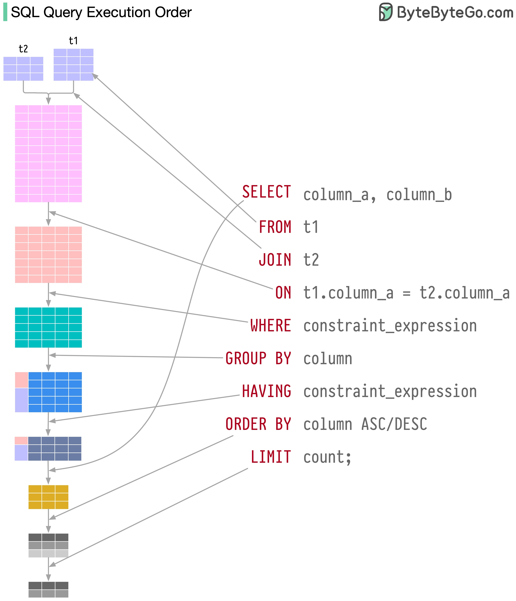

[자료형](#자료형)

[UUID](#uuid)

[SQL: Structured Query Langauge](#sql-structured-query-language)

[DDL](#ddl)

[DCL](#dcl)

[TCL](#tcl)

[DML](#dml)

[서브쿼리](#서브쿼리)

[제약조건](#제약조건)


## 자료형

### 숫자형 (Numeric Types)

정수형
- TINYINT (1 byte): -128 ~ 127 
- SMALLINT (2 bytes): -32,768 ~ 32,767
- MEDIUMINT (3 bytes): -8백만 ~ 8백만
- INT / INTEGER (4 bytes): ~21억 ~ 21억
- BIGINT (8 bytes): -900경 ~ 900경

실수형
- FLOAT (4 bytes): 부동소수점, 빠르지만 부정확함 (소수점 7자리까지)
- DOUBLE (8 bytes): 부동소수점, 더 정확함 (소수점 15자리까지)
- DECIMAL (가변): 가장 정학환 소수 계산용 (문자열로 표현됨)

### 날짜/시간형 (Date and Time Types)

DATE (3 bytes): `YYYY-MM-DD` (1000-01-01 ~ 9999-12-31)

DATETIME (8 bytes): `YYYY-MM-DD HH:MM:SS` (마이크로초 미지원)

TIMESTAMP (4 bytes): UTC 기반(타임존 정보 포함, 1970-01-01 이후)

TIME (3 bytes): `HH:MM:SS` (시간만 저장)

### 문자열형 (String Types)

CHAR(n) (최대 길이 255): 고정 길이, 빠름, 공백 패딩

VARCHAR(n) (조건부 최대 길이 65,535): 가변 길이, 행 내부 저장, 인덱스 젠체 가능, 문자열 함수 대부분 지원

TEXT (최대 길이 64KB): 대용량 문자열, 외부 저장(포인터 참조), 일부 길이만 인덱싱 가능, 제한적인 문자열 함수 지원

TINYTEXT (255 bytes), MEDIUMTEXT (16MB), LONGTEXT (4GB): TEXT 하위 타입

BINARY(n), VARBINARY(n): 고정/가변 이진 문자열 (n은 바이트 수)

TINYBLOB, BLOB, MEDIUMBLOB, LONGBLOB: 이진 데이터 저장용

### 공간형 (Spatial Types)

InnoDB에서 지원하는 GIS(지리 정보 시스템) 전용 자료형으로 위치 기반 서비스에서 주로 사용한다 

GEOMETRY: 기본 공간 객체

POINT: 위도/경도 표현 (위치 좌표)

LINESTRING: 선형 객체 (직선, 곡선 등)

POLYGON: 다각형 (면적 표현)

MULTIPOLYGON, MULTIPOINT, MULTILINESTRING: 복합 공간 객체

### JSON형

MySQL 5.7부터 JSON 자료형을 지원한다

내부적으로 바이너리 포맷으로 저장하여 TEXT보다 공간 효율적이며, `{"key": "value"}` 형식만 저장할 수 있도록 유효성 검사를 한다

또한 JSON Path(`->`, `->>`, `JSON_EXTRACT()`)를 사용할 수 있고 인덱스를 지원한다 (`GENERATED COLUMN + INDEX`)

### 열거형

ENUM: 정해진 문자열(최대 65,535개) 중 하나만 선택할 수 있는 자료형, 내부적으로는 1부터 시작하는 정수로 저장된다

JPA의 **@Enumerated(EnumType.STRING)**을 사용하면 ENUM 대신 VARCHAR를 이용하여 DB 차원의 무결성 제약이 없지만 DB에는 문자열로 저장되며 가독성이 좋고 추가/삭제가 간단하다

반면 MySQL의 ENUM 자료형을 사용하면 DB에서 직접 값을 제한하여 비정상 값을 삽입할 수 없게 방지하고 저장 효율성이 높지만 값 추가 시 마이그레이션이 필수이고 자바 코드와 Enum 값 불일치하게 되면 실행 오류가 발생한다

또한 MySQL에 종속하게 되어 다른 데이터베이스에서는 사용할 수 없게 되는 단점이 있다

SET: 여러 문자열(최대 64개) 중 복수 선택 가능, 내부적으로는 비트 플래그로 저장된다

```mysql
-- ENUM
CREATE TABLE users (
   id INT PRIMARY KEY,
   role ENUM('USER', 'ADMIN', 'MANAGER') NOT NULL
);

-- SET
CREATE TABLE users (
    id INT PRIMARY KEY,
    interests SET('MUSIC', 'SPORTS', 'BOOKS', 'TRAVEL')
);
```


### 자주 사용하는 자료형
- 정수형: INT, BIGINT
- 실수형: DECIMAL
- 날짜형: DATETIME, TIMESTAMP
- 문자열: VARCHAR(n), TEXT
- JSON: JSON

자주 사용하는 자료형 설계
- 기본 키: `BIGINT UNSIGNED AUTO_INCREMENT` 또는 `UUID` UUID(): UUIDv1 생성
- 사용자 이름: `VARCHAR(50) NOT NULL`
- 가격: `DECIMAL(10, 2) NOT NULL`
- 시간 필드: `DATETIME NOT NULL DEFAULT CURRENT_TIMESTAMP`
- 긴 본문이나 리뷰: `TEXT`
- 위치 좌표: `POINT` + Spartial Index
- 설정값 등 복잡한 구조: `JSON` + 가상 컬럼 인덱스화


## UUID

MySQL은 UUID 자체를 위한 전용 자료형을 지원하지 않고, 대신 함수와 자료형 조합을 통해 UUID 사용을 간접적으로 지원한다

`UUID()`: 무작위 UUID 생성

`UUID_SHORT()`: 서버 내 고유 64bit 숫자 생성 (전역 고유 아님)

`UUID_TO_BIN(uuid_string, swap_flag)`: UUID 문자열을 바이너리로 압축 (인코딩, 16 바이트), 두 번째 파라미터를 활성화하면 UUID 내부 시간 필드를 앞 쪽으로 재배치한다 (정렬 성능 최적화)

`BIN_TO_UUID(binary_uuid, swap_flag)`: 바이너리 UUID를 문자열로 디코딩, UUID 압축 시 플래그를 1로 설정했으면 되돌릴 때도 플래그를 1로 설정해야 한다

`IS_UUID(string)`: 문자열이 유효한 UUID인지 검사 (1 또는 0 반환)

MySQL이 UUID를 직접적으로 최적화해주지 않기 때문에 개발자는 요구사항에 따라 UUID에 대한 자료형을 직접 결정해야 한다

문자열 저장: `CHAR(36)` -> 가독성이 좋지만 공간 낭비 및 성능 저하

압축 문자열: `CHAR(32)` (하이픈 제거) -> 조금의 공간 절약을 하지만 여전히 문자열 기반이므로 성능 저하

바이너리 저장: `BINARY(16)` -> 공간 및 인덱스 효율이 좋지만 가독성이 떨어지고 변환이 필요하다

정렬 최적화 UUID: `BINARY(16)` -> 순차적 삽입이 가능하다 (생성 알고리즘 필요)

JSON 안에 저장: `JSON` -> 유연성이 가장 좋지만 쿼리/인덱스 효율이 떨어진다

실용적인 저장을 목적으로 하면 **BINARY(16) 압축 UUID**이 가장 좋다 (MySQL에서 생성 시 UUID_TO_BIN, BIN_TO_UUID 사용)

### UUID 인덱스 전략

UUID v4는 완전 랜덤(128 비트) 구조로 내부적으로 전혀 순서를 보장하지 않는 무작위 값이다

이런 **UUID v4를 기본 키로 사용하면 성능이 저하될 수 있다**

```text
4f8f0b15-21f8-4d3b-9aef-3f74bb334a01
```

InnoDB는 모든 데이터를 PK 기준으로 정렬하여 저장하는 **클러스터 인덱스**를 기반으로 동작한다 (PK가 곧 저장 순서를 결정함)

AUTO_INCREMENT나 정렬된 UUID 같은 좋은 PK는 삽입 시 항상 마지막에 추가된다

이는 디스크에 연속적인 위치에 기록하기 때문에 디스크 캐시와 버퍼 효율을 높이며 page split을 최소화한다

반면 UUID v4 같이 랜덤한 값은 삽입할 때마다 데이터가 랜덤 위치에 삽입되는데 이로 인해 다음과 같은 문제가 발생한다

**디스크 조각화(fragmentation)**: 디스크의 중간 위치에 데이터를 넣게 되어 page split 발생, I/O가 흩어지면서 디스크 탐색 비용이 상승한다 

**버퍼 풀 효율 저하**: InnoDB의 버퍼 풀은 자주 쓰는 페이지를 메모리에 올려두는데, 랜덤 UUID는 매번 새로운 위치의 페이지를 만들기 때문에 버퍼 풀의 캐시 히트율을 저하시킨다 (메모리 낭비 + 디스크 I/O 증가)  

UUID를 기본 키로 사용해야 한다면 **UUID v4 대신 정렬 가능한 UUID**를 사용하는 것이 성능 저하를 방지할 수 있다

일반적으로 정렬 가능한 UUID는 **시간 기반 UUID(v1, v6, v7)** 또는 **ULID**를 사용한다

UUIDv1은 시간과 MAC 주소를 기반으로 생성되므로 시간 순서대로 정렬될 수 있다

UUIDv6는 v1의 시간 정렬을 최적화한 개선 버전이며 UUIDv7은 ISO 8601 시간을 기반으로 하여 생성된다

ULID는 Base32, ISO 시간을 기반으로 하며 가독성이 우수하다는 장점이 있고, COMB UUID는 랜덤 UUID에 timestamp를 일부 결합한 형태로 시간 순서를 보장한다

그럼 이런 UUID들은 어떻게 정렬될 수 있는걸까?

일단 UUID는 본질적으로 문자열이 아닌 128비트(16바이트)의 이진 데이터이다 (가독성을 위해 하이픈을 포함하여 36자리 문자열로 표현할 뿐임)

시간 기반 UUID는 가장 앞부분이 시간 정보를 기반으로 하기 때문에 바이너리 (`BINARY(16)`)로 저장할 경우 시간 순서대로 정렬될 수 있다

```text
A: 01F4-AAA0-BBB1-...  → 2024년
B: 01F5-BBBB-CCC2-...  → 2025년
```

따라서 InnoDB에서 UUID를 PK로 이용할 때는 **시간 기반 UUID(v1, v6, v7) 또는 ULID**를 사용하고 **BINARY(16)**로 저장하면 시간 순 정렬이 가능해져서 클러스터링 인덱스를 효율적으로 사용할 수 있다

### UUID MySQL에서 생성하기 vs 앱/서버에서 생성하기

MySQL은 UUIDv1에 대한 시간 기반 정렬만 가능하다 `UUID_TO_BIN(uuid, 1)`

그에 반해 스프링 부트를 활용하면 ULID, UUIDv7 등 다양한 UUID 생성 전략과 시간 기반 정렬을 사용할 수 있다

또한 `UUID_TO_BIN(uuid, 1)`과 같은 함수 호출없이 시간 기반 UUID를 사용하면 삽입 시 순서를 보장하므로 클러스터 인덱스 효율을 높일 수 있다

이외에도 스프링 부트에서 UUID를 생성하면 다음과 같은 이점을 누릴 수 있다

UUID 생성 추적 가능, 생성 시점 제어(PrePersist 등), 트랜잭션 바깥 생성(UUID를 미리 생성하고 연동 가능), 테스트 및 로깅 가능, 외부 서비스(카프카)/API와 공유 가능, SRP 원칙 부합(DB는 저장만) 등

결과적으로 성능, 정렬성, 추적성 등 대부분의 측면에서 바라봤을 때 애플리케이션에서 UUID를 생성하는 것이 더 유리하다

## SQL: Structured Query Language

SQL은 관계형 데이터베이스에게 구조화된 데이터를 정의하고, 조작하고, 제어하고, 조회하기 위해 전달하는 질의문(Query Statement)이다

크게 네 가지 하위 언어로 나뉜다

**DDL (Data Definition Language)**: 데이터 정의 (구조 설계) `CREATE`, `ALTER`, `DROP`, `TRUNCATE`

**DML (Data Manipulation Language)**: 데이터 조작 (조회, 삽입, 수정, 삭제) `SELECT`, `INSERT`, `UPDATE`, `DELETE`

**DCL (Data Control Language)**: 데이터베이스 권한 관리 `GRANT`, `REVOKE`

**TCL (Transaction Control Language)**: 트랜잭션 제어 `COMMIT`, `ROLLBACK`, `SAVEPOINT`


## DDL

DDL은 데이터베이스 객체의 구조를 정의하거나 변경, 삭제하는 언어로 주로 테이블, 인덱스, 뷰, 스키마 등의 설계와 구조 자체를 다룬다

보통 스키마 설계 또는 배포 단계에서 사용되는데 DDL은 트랜잭션에 포함되지 않아 **자동으로 커밋된다**

즉, **명령어를 실행하면 롤백할 수가 없기 때문에**  DROP, TRUNCATE는 실제로 실행하기 전에 테스트를 진행하는 것이 좋다 (운영 DB에서는 권한 분리 필요)

또한 ALTER TABLE은 테이블 구조를 변경하는 명령어로 잠금 또는 전체 재작성을 유발할 수 있다 (대규모 테이블은 Online DDL 사용 고려)

DLL 버전 관리가 필요하거나 데이터베이스 마이그레이션이 필요한 경우 Flyway, Liquibase와 같은 도구를 사용하는 것이 좋다

명령어 종류
- CREATE: 테이블, 뷰, 인덱스 등 객체 생성
- ALTER: 기존 객체의 구조 수정 (컬럼 추가/삭제 등)
- DROP: 객체 완전 삭제 (복구 불가)
- TRUNCATE: 테이블 데이터 전체 삭제, FK 제약 있을 경우 사용 불가
- RENAME: 객체 이름 변경
- COMMENT: 객체나 컬럼에 주석 추가

```sql
-- 테이블 구조 정의
-- 데이터 타입, 제약조건(PK, UNIQUE, DEFAULT, NOT NULL 등) 설정
CREATE TABLE users (
    id BIGINT UNSIGNED AUTO_INCREMENT,
    username VARCHAR(50) NOT NULL UNIQUE,
    email VARCHAR(100) NOT NULL UNIQUE,
    password VARCHAR(255) NOT NULL,
    status ENUM('ACTIVE', 'INACTIVE', 'BANNED', 'DELETED') DEFAULT 'active',
    created_at DATETIME DEFAULT CURRENT_TIMESTAMP,
    updated_at DATETIME DEFAULT CURRENT_TIMESTAMP ON UPDATE CURRENT_TIMESTAMP,
    
    PRIMARY KEY (id)
);

-- 인덱스 생성
CREATE INDEX idx_users_email ON users (email);

-- 뷰 생성
CREATE VIEW active_users AS SELECT * FROM users WHERE status = 'ACTIVE';
```

```sql
-- 컬럼 추가
ALTER TABLE users ADD COLUMN age INT;

-- 컬럼 이름 변경
ALTER TABLE users RENAME COLUMN age TO user_age;

-- 컬럼 삭제
ALTER TABLE users DROP COULMN user_age;

-- 데이터 타입 변경
ALTER TABLE users MODIFY username VARCHAR(100) NOT NULL UNIQUE;
```

```sql
-- 테이블 삭제
DROP TABLE users;

-- 인덱스 삭제
DROP INDEX idx_users_email ON users;

-- 뷰 삭제
DROP VIEW active_users;
```

```sql
-- 테이블 전체 데이터 삭제 (구조는 유지)
-- DELETE와 달리 롤백 불가능, AUTO_INCREMENT 초기화
TRUNCATE TABLE users; 

-- 테이블 이름 변경
RENAME TABLE users TO app_users;
       
-- 주석 추가
ALTER TABLE users MODIFY name VARCHAR (100) COMMENT '사용자 이름';
```


## DCL

특정 사용자에게 데이터베이스와 테이블 단위로 권한을 부여하거나 회수할 수 있다

MySQL은 `username@host` 형식으로 사용자를 식별하는데 localhost(소켓), 127.0.0.1(TCP/IP), % (모든 호스트)를 모두 다른 사용자라고 취급한다

```mysql
# 권한 부여 (WITH GRANT OPTION은 해당 사용자에게 권한 부여 권한도 부여)
GRANT <privileges> PRIVILEGES ON <databaes>.<table> TO '<username>'@'<host>' [WITH GRANT OPTION];
GRANT ALL PRIVILEGES ON *.* TO 'hansanhha'@'localhost';
GRANT INSERT, UPDATE, SELECT, DELETE ON testdb.* TO 'hansanhha'@'localhost';

# 권한 회수
REVOKE <privileges> ON <database>.<table> FROM '<username>'@'<host>';

# 권한 변경 사항 반영 (자동 적용됨)
FLUSH PRIVILEGES;

# 사용자 권한 조회
SHOW GRANTS FOR '<username>'@'<host>';
```

권한 목록
- SELECT: 조회 권한
- INSERT: 데이터 삽입
- UPDATE: 데이터 수정
- DELETE: 데이터 삭제
- CREATE: 테이블, DB 생성
- DROP: 테이블, DB 삭제
- REFERENCE: 외래 키 참조 권한
- INDEX: 인덱스 생성/제거
- ALTER: 테이블 구조 변경
- EXECUTE: 저장 프로시저 실행
- ALL PRIVILEGES: 모든 권한
- GRANT OPTION: 다른 사용자에게 권한 위임 가능

### 최소 권한 원칙

보안상 일반 유저에게는 최소한의 권한만 부여하는 것이 좋다

애플리케이션 사용 계정: SELECT, INSERT, UPDATE, DELETE (특정 db)

마이그레이션, 수동 조작 계정: ALL PRIVILEGES (특정 db)

외부 분석, BI 도구용 계정: SELECT

모니터링, 성능 조회용 계정: SHOW PROCESS, SHOW STATUS 등 시스템 권한


## TCL

```mysql
START TRANSACTION;
COMMIT;
ROLLBACK;
```


## DML

DML은 데이터베이스에 저장된 데이터 자체를 조회, 삽입, 수정, 삭제하는 SQL 명령어이다

다중 DML을 사용할 때는 반드시 트랜잭션으로 묶어서 작업의 원자성을 보장해야 한다 (@Transactional 어노테이션 사용)

명령어 종류
- SELECT: 기존 데이터 조회
- INSERT: 새로운 데이터 행 삽입
- UPDATE: 기존 데이터 수정
- DELETE: 기존 데이터 삭제

```sql
-- 단일 행 삽입
-- PK는 보통 서버 측 UUID 또는 AUTO_INCREMENT로 생성한다
INSERT INTO users (id, username, email, password)
VALUES (UUID_TO_BIN(UUID(), 1), 'hansanhha', 'hansanhha@mail.com', 'password123');

-- 다중 행 삽입
INSERT INTO users (id, username, email, password)
VALUES
    (UUID_TO_BIN(UUID(), 1), 'hansanhha', 'hansanhha@mail.com', 'password123'),
    (UUID_TO_BIN(UUID(), 1), 'hansanhha2', 'hansanhha2@mail.com', '123password');

-- 데이터 복사
INSERT INTO archived_users (id, username, email, archived_at)
SELECT id, username, email, NOW() FROM users WHERE status = 'DELETED';

-- 중복 삽입 방지 업서트 (Upsert), MySQL에서만 지원하는 구문
-- id가 기존에 존재하지 않으면 삽입한다
-- 존재하면 해당 레코드의 username, email, password를 업데이트한다
INSERT INTO users (id, username, email, password)
VALUES (UUID_TO_BIN(UUID(), 1), 'hansanhha', 'hansanhha@mail.com', 'password123')
ON DUPLICATE KEY UPDATE
    username = VALUES(username),
    email = VALUES(email),
    password = VALUES(password);
```

```sql
-- 단 건 레코드 수정
UPDATE users
SET name = 'hansanhha_updated', email = 'hansanhha_updated@mail.com'
WHERE id = UUID_TO_BIN('4f8f0b15-21f8-4d3b-9aef-3f74bb334a01', 1);

-- 다중 레코드 수정 (특정 조건에 맞는 모든 레코드 수정)
UPDATE users
SET username = 'old_' + username
WHERE created_at < NOW() - INTERVAL 1 YEAR;

-- 전체 레코드 수정
UPDATE users
SET username = 'hello_' + username;
```

```sql
-- 단건 레코드 삭제
DELETE FROM users
WHERE id = 1;

-- 다중 레코드 삭제 (특정 조건에 맞는 모든 레코드 삭제)
DELETE FROM users
WHERE created_at < NOW() - INTERVAL 1 YEAR;

-- 전체 레코드 삭제 (TRUNCATE와 달리 롤백을 할 수 있고 AUTO_INCREMENT 초기화되지 않음)
DELETE FROM users;

-- 대량 삭제 시 작은 배치로 나눠서 처리하면 락 경쟁을 줄일 수 있다
DELETE FROM logs
ORDER BY created_at AS
LIMIT 1000;
```

```sql
-- DML은 일반적으로 트랜잭션 내부에서 수행되어야 한다 (원자성, 일관성, 격리성 보장)
-- MySQL에서는 InnoDB 스토리지 엔진을 사용해야 트랜잭션을 지원한다
-- 문제가 발생하면 롤백하여 이전 상태로 되돌릴 수 있다
-- 보통 애플리케이션 단(@Transactional)에서 트랜잭션을 제어한다
START TRANSACTION;

UPDATE accounts SET balance = balance - 100 WHERE id = 1;
UPDATE accounts SET balance = balance + 100 WHERE id = 2;

COMMIT;
```

### SELECT 쿼리 실행 순서



[이미지 출처](https://x.com/bytebytego/status/1713058339666772225/photo/1)


## 서브쿼리

서브쿼리는 다른 쿼리 내부에 포함되어 실행되는 SELECT 쿼리로 다른 쿼리의 입력으로 사용된다

복잡한 조건이나 집계 결과, 존재 여부 판단을 간결하게 표현할 수 있지만 실행 계획과 성능에 직접적인 영향을 끼치므로 전략적으로 사용해야 한다

서브쿼리는 다음과 같은 위치에서 사용될 수 있다

**SELECT 절 (스칼라 서브쿼리)**: 단일 값을 반환하는 서브쿼리

**FROM 절 (인라인 뷰/파생 테이블)**: 서브쿼리의 결과를 테이블처럼 사용

**WHERE, HAVING 절 (조건 서브쿼리)**: 서브쿼리의 결과를 조건으로 사용

**INSERT, UPDATE, DELETE의 VALUES, SET, WHERE 등**

### 스칼라 서브쿼리

```mysql
-- 각 사용자별 주문 조회수를 조회하는 서브쿼리
-- 많은 행에서 실행되면 성능 저하를 일으킬 수 있다 -> JOIN으로 변경
SELECT u.id u.name,
    (SELECT COUNT(*) FROM orders o WHERE o.user_id = u.id) AS order_count
FROM users u;
```

### 인라인 뷰/파생 테이블

```mysql
-- GROUP BY, 집계 등 복잡한 로직을 별도로 뽑아내어 구조화한다 
-- 파생 테이블에 인덱스를 사용할 수 없어 최적화하기 어렵다
SELECT u.name, total
FROM (
    SELECT user_id, SUM(amount) AS total
    FROM orders
    GROUP BY user_id
) AS order_totals
JOIN users u ON u.id = order_totals.user_id;
```

### 조건 필터링

```mysql
-- 서브쿼리의 결과를 IN, EXISTS, ANY, ALL 등의 조건으로 사용한다
-- 주문 기록이 있는 사용자만 조회
SELECT name
FROM users
WHERE id IN (SELECT DISTINCT user_id FROM orders);

-- 주문 금액이 100,000원 이상인 사용자 조회
SELECT name
FROM users u
WHERE EXISTS (
    SELECT 1 
    FROM orders o
    WHERE o.user_id = u.id AND o.amount > 100000        
)
```

### INSERT, UPDATE, DELETE에서 서브쿼리 사용

```mysql
-- 아카이브 상태인 사용자를 별도의 테이블로 이동
INSERT INTO archived_users (id, name)
SELECT id, name FROM users
WHERE status = 'ARCHIVED';

-- 총 주문 금액 기준으로 사용자 등급 업데이트
UPDATE users u
SET grade = (
    SELECT CASE
        WHEN sum(o.amount) > 100000 THEN 'GOLD'
        WHEN sum(o.amount) > 50000 THEN 'SILVER'
        ELSE 'BRONZE'
    END
    FROM orders o
    WHERE o.user_id = u.id
)
WHERE EXISTS (
    SELECT 1 FROM orders o WHERE o.user_id = u.id 
)
```

### 상관 서브쿼리 vs 비상관 서브쿼리

상관 서브쿼리(Correlated Subquery)는 서브 쿼리 내에서 외부 쿼리의 컬럼을 참조하는 서브쿼리를 말한다

외부 쿼리의 각 행마다 서브쿼리를 실행하여 이중 반복문 구조(루프 안에서 루프)로 동작한다 

즉, 외부 쿼리의 수만큼 서브쿼리가 반복 실행되므로 성능에 영향을 줄 수 있다

특정 조건 판단 (EXISTS, NOT EXISTS) 시 유용하게 사용할 수 있다

실행 방식: 외부 쿼리의 각 users 행을 하나씩 반복 -> 서브쿼리 실행(n번) -> 조건 충족 여부 판단 

```mysql
-- 주문 금액이 10,000원 이상인 사용자 조회
-- 조건 필터링 서브쿼리 사용 (상관 서브쿼리)
-- 각 users 행마다 서브쿼리가 실행된다
SELECT name
FROM users u
WHERE EXISTS (
    SELECT 1
    FROM orders o
    WHERE o.user_id = u.id AND o.amount > 10000
)
```

비상관 서브쿼리(Non-Correlated Subquery)는 서브쿼리 내부에서 외부 쿼리의 컬럼을 참조하지 않는 서브쿼리를 말한다

독립적으로 실행할 수 있으며 한 번만 실행되고, 결과는 외부 쿼리에서 사용될 수 있다

집합 기반 비교(IN, <=, < 등)에 적합하다

실행 방식: 서브쿼리 실행 -> 결과 집합 저장 -> 조건 충족 여부 판단

```mysql
-- 위의 쿼리와 동일한 결과를 반환한다
-- 비상관 서브쿼리를 사용하여 한 번만 실행된다
SELECT name
FROM users
WHERE id IN (
    SELECT user_id
    FROM orders
    WHERE amount > 10000
);
```

### IN vs EXISTS

| 항목           | IN                | EXISTS                       |
|--------------|-------------------|------------------------------|
| 동작           | 값이 포함되어 있는지 확인    | 행이 존재하는지 확인                  |
| 서브쿼리 결과      | 값의 집합(리스트)        | 존재 여부(TRUE/FALSE)            |
| 대상 컬럼 수      | 단일 컬럼만 가능         | 다중 컬럼 조건 가능                  |
| 서브쿼리 사용      | 외부 쿼리값과 서브쿼리 결과 비교 | 외부 쿼리 행마다 서브쿼리 실행 (조건 탈출 가능) |

```mysql
-- orders.user_id를 한 번 추출해서 users.id와 비교한다
SELECT name
FROM users
WHERE id IN (
    SELECT user_id
    FROM orders
    WHERE status = 'PAID'
);

-- users 테이블의 각 행에 대해 orders에 관련 행이 존재하면 즉시 포함한다
SELECT name
FROM users u
WHERE EXISTS (
    SELECT 1
    FROM orders o
    WHERE o.user_id = u.id AND o.status = 'PAID'
)
```


## 제약조건

### 기본 키

기본키는 테이블의 각 행을 고유하게 식별할 수 있는 컬럼 또는 컬럼 조합을 의미한다

즉, 테이블의 각 행은 기본 키를 통해 유일하게 식별될 수 있다

기본키로 지정된 컬럼은 다음과 같은 특성과 제약 조건을 가진다
- 고유성: 기본키로 지정된 컬럼은 모든 행마다 값이 달라야 한다
- NOT NULL: 기본키 컬럼은 NULL 값을 가질 수 없다
- 자동 인덱스 생성: InnoDB는 기본키를 기준으로 클러스터링 인덱스를 생성한다 (데이터가 기본키 순서대로 저장됨)
- 1개만 존재 가능: 테이블당 기본 키는 단 하나만 존재할 수 있다 (컬럼은 여러 개 지정 가능)
- 외래키 참조 대상: 다른 테이블의 외래키가 참조할 대상이 된다

```mysql
-- 단일 기본키 지정
-- UNIQUE + NOT NULL + 인덱스
CREATE TABLE users (
    id INT PRIMARY KEY
);

-- 복합 기본키 지정
-- 두 개 컬럼의 조합이 유일함을 보장한다
CREATE TABLE enrollments (
    student_id INT,
    course_id INT,
    PRIMARY KEY (student_id, course_id)
);
```

InnoDB는 기본 키를 클러스터드 인덱스(Clustered Index)로 구현한다

클러스터드 인덱스는 테이블의 실제 데이터가 기본 키를 기준으로 정렬되어 저장되는 것을 의미한다

만약 기본 키가 지정되지 않은 경우 내부적으로 ROWID를 자동 생성해서 클러스터드 인덱스로 사용한다

보조 인덱스(Secondary Index)는 기본 키를 항상 포함하여 기본 키가 길어지면 보조 인덱스의 크기도 함께 커진다

#### 기본 키 설계 시 주의사항

고유하고 불변값 사용: AUTO_INCREMENT(단순 고속 INSERT 유리), UUID(분산 환경, 보안, 병렬성 유리) 

변경될 수 있는 자연키나 의미있는 컬럼 사용 자제: 이메일, 전화번호, 주민등록번호

복합키 최소화: JOIN, 인덱싱 복잡도 낮추기 위함

### 외래 키

외래키는 두 테이블 사이의 관계를 연결하고 데이터 무결성을 보장하는 제약조건이다

즉, **한 테이블의 컬럼이 다른 테이블의 기본 키 또는 고유키를 참조**하여 테이블 간의 참조 무결성(Referential Integrity)을 보장하도록 한다

또한 연관된 데이터의 신뢰성과 삭제, 갱신 전파 전략을 포함한다

외래 키가 참조하는 테이블을 **부모 테이블** 또는 **참조 테이블**이라고 하고, 참조 테이블의 기본 키 또는 유니크 키를 **기준 키**라고 한다

그리고 참조 테이블의 기준 키를 참조하는 자식 테이블의 컬럼을 **외래 키 컬럼**이라고 한다

외래 키를 사용하면 부모 테이블과 자식 테이블은 참조 무결성 제약조건을 가지게 된다

참조 무결성 제약조건이란 관계형 데이터베이스의 데이터 무결성 제약조건 중 하나로, 한 테이블의 컬럼이 다른 테이블의 행을 참조할 때 그 참조가 항상 유효해야 함을 보장하는 규칙이다

이 제약조건에 따르면 외래 키가 참조하는 값이 반드시 부모 테이블에 존재해야 한다

다음과 같은 상황에서 참조 무결성을 위반할 수 있다
- 자식 테이블이 존재하지 않는 부모 키 참조하는 경우
- 부모 키를 삭제했는데 자식이 남은 경우 (적절한 전파 옵션 설정 필요)
- 부모 키를 갱신하여 자식 테이블의 참조가 불일치되는 경우 (적절한 전파 옵션 설정 필요)

```mysql
CREATE TABLE users (
    id INT PRIMARY KEY
);

-- orders.user_id는 users 테이블의 id를 참조하는 외래키이다
-- 외래 키는 기본 키와 기본적으로 달리 NULL 값을 가질 수 있으므로 NOT NULL 제약조건을 추가하지 않는 한 NULL 값을 허용한다
CREATE TABLE orders (
    id INT PRIMARY KEY,
    user_id INT,
    FOREIGN KEY (user_id) REFERENCES users(id)
)

-- users에 id=1000 행이 없다
-- 참조 무결성 제약조건 위반 -> 에러 발생
INSERT INTO orders (id, user_id) VALUES (1, 1000);
```

외래 키의 조건
- 참조 대상은 PK 또는 UNIQUE 제약조건이 있는 컬럼이어야 한다
- 참조 컬럼과 타입이 일치해야 한다
- 외래 키 컬럼은 인덱스를 가져야 한다 (자동 생성됨)

외래 키의 참조 무결성 동작 방식
- INSERT: 참조 테이블에 존재하지 않는 키를 참조하려 시도하면 에러가 발생한다
- UPDATE: 참조 대상 변경 시 전파 여부에 따라 다르게 처리된다
- DELETE: 참조되는 부모 행이 삭제될 떄 전파 여부에 따라 다르게 처리된다

ON DELETE / ON UPDATE 옵션
- CASCADE: 부모가 삭제/변경되면 자식도 자동으로 삭제/갱신된다
- SET NULL: 부모가 삭제/변경되면 자식의 외래 키를 NULL로 설정한다
- RESTRICT (기본값): 부모가 참조 중이면 삭제/변경할 수 없다
- NO ACTION: RESTRICT와 동일하게 동작한다

```mysql
-- 참조 중인 부모 행이 삭제되면 그 자식 행도 같이 삭제된다 
CREATE TABLE orders (
    id INT PRIMARY KEY,
    user_id INT,
    FOREIGN KEY (user_id) REFERENCES users(id)
    ON DELETE CASCADE
    ON UPDATE CASCADE
)
```

```mysql
-- 외래 키 제약 이름 조회
SELECT CONSTRAINT_NAME FROM information_schema.REFERENTIAL_CONSTRAINTS WHERE TABLE_NAME = 'orders';

-- 외래 키 제약 이름을 기준으로 외래 키 제약 해제
ALTER TABLE order DROP FOREIGN KEY fk_orders_user_id;
```

### 외래 키의 단점과 해결 방법

외래 키를 사용하면 참조 무결성을 보장할 수 있지만 다음과 같은 단점이 따라온다
- **DELETE 성능 저하**: 부모 테이블에서 DELETE 시 자식 테이블의 참조 여부를 확인하는 작업을 거쳐야 한다. 특히 삭제할 부모 행이 많거나 자식 테이블이 클수록 DELETE 속도가 급격히 떨어진다 (디스크 I/O, 락 충돌 등)
- **ON DELETE CASCADE**: 연쇄 삭제가 자식 -> 손자 -> 증손자까지 이어져서 폭발적인 삭제 비용을 유발과 함께 예상 외 데이터 손실을 초래할 수 있다
- **순환 참조 발생 가능**: 투 테이블이 서로를 참조하면 DDL 오류 또는 트랜잭션에서 데드락이 발생할 수 있다
- **스키마 변경 유연성 저하**: 컬럼이나 테이블 변경 시 FK 제약으로 인해 선행 작업이 필요하다 (DROP FK -> 변경 -> ADD FK)
- **마이그레이션 복잡도**: 대용량 데이터 초기 로딩 시 자식 테이블이 부모 테이블보다 먼저 로딩되어 FK 무결성 검사가 번번히 실패할 수 있다

참조 무결성 제약조건으로 인해 DELETE, UPDATE 성능이 저하되거나 복잡한 상황이 발생할 수 있다

관계형 데이터베이스의 핵심인 테이블 간의 연결을 강제하는 외래 키를 이용하지 않으면 아래와 같은 장점을 누릴 수 있다
- **대량 데이터 삽입 성능 향상**: 외래 키 제약이 없으므로 대량 삽입 시 FK 검사를 하지 않아 성능이 향상된다
- **삭제 성능 향상**: 자식 테이블의 참조 무결성 검사를 하지 않으므로 DELETE 성능이 향상된다
- **조인 최적화**: 외래 키가 없으면 조인 시 인덱스 사용이 더 유연해진다 (조인 순서 최적화)
- **유연한 스키마 변경**: FK 제약이 없으므로 컬럼이나 테이블 변경이 훨씬 유연해진다
- **분산 시스템/캐시/샤딩 구현**: 외래 키 제약이 없으므로 분산 시스템이나 캐시, 샤딩 환경에서 유연하게 데이터를 처리할 수 있다

대신 아래와 같은 방법으로 외래 키의 역할을 대신하며 성능을 챙긴다

#### 1. 소프트 참조

서로 연결이 필요한 테이블 간 아이디를 참조하되 외래 키로 지정하지만 않는다

DB 차원에서 참조 무결성을 강제하지 않는다

```mysql
CREATE TABLE user (
    id INT PRIMARY KEY
);

CREATE TABLE orders (
    id INT PRIMARY KEY,
    user_id INT   -- 외래 키로 지정하지 않는다
);
```

#### 2. 소프트 삭제

외래 키를 걸면 참조된 자식이 있을 때 삭제가 막힌다 (RESTRICT)

대신 논리적 삭제 컬럼을 두고 삭제 시 해당 컬럼을 업데이트하여 삭제된 것으로 표시한다

```mysql
CREATE TABLE (
    id INT PRIMARY KEY,
    is_deleted BOOLEAN DEFAULT FALSE
)

-- 실제 삭제가 아닌 논리적 삭제
UPDATE users SET is_deleted = TRUE WHERE id = 1;  
```

#### 3. 애플리케이션 레벨 무결성 보장

DB 차원이 아닌 애플리케이션 레벨에서 데이터 무결성을 보장한다

삭제/변경 이벤트 발생 시 연관 데이터를 이벤트 기반으로 처리하여 데이터 정합성을 유지한다

```java
@PostMapping("/orders")
public ResponseEntity<Void> createOrder(@RequestBody CreateOrderRequest req) {
    if (!userRepository.existsById(req.getUserId())) {
        throw new NotFoundException("User not found");
    }

    orderRepository.save(new Order(req.getUserId(), req.getAmount()));
}
```

#### 4. 제약조건을 테스트용으로만 한정 적용

개발 환경에서 FK를 설정하여 데이터 정합성을 테스트하고 운영 환경에서는 FK를 제거하거나 제약조건 없는 뷰/레플리카를 사용하여 성능을 최적화한다

FK는 데이터베이스 내 테이블 간에만 적용할 수 있으므로 마이크로서비스, 분산 시스템, 기타 서비스(카프카 등)에서는 ID만 주고 이벤트를 기반으로 동기화하여 데이터 정합성을 보장한다

### CHECK

CHECK 제약조건은 테이블 컬럼에 저장되는 값이 특정 조건을 만족해야 한다는 규칙을 정의한다

도메인 무결성(Domain Integrity)을 보장하기 위해 사용되며 값의 범위나 형식에 제한을 두어 비정상 데이터가 저장되지 않도록 방지한다

```mysql
-- price와 stock 컬럼에 대한 CHECK 제약조건 설정
CREATE TABLE products (
    id INT AUTO_INCREMENT PRIMARY KEY,
    price DECIMAL(10, 2) NOT NULL CHECK (price > 0),
    stock INT NOT NULL CHECK (stock >= 0)
);

-- CHECK 제약조건 위반
-- Check constraint 'products_chk_2' is violated.
INSERT INTO products (price, stock) VALUES (1, -10);
```

```mysql
-- CHECK 제약조건 추가
ALTER TABLE users ADD CONSTRAINT chk_age CHECK (age >= 0 AND age <= 130);

-- CHECK 제약조건 삭제
-- 이름을 명시하지 않으면 자동 생성되며 information_schema.check_constraints에서 확인할 수 있다
ALTER TABLE users DROP CONSTRAINT chk_age;
```