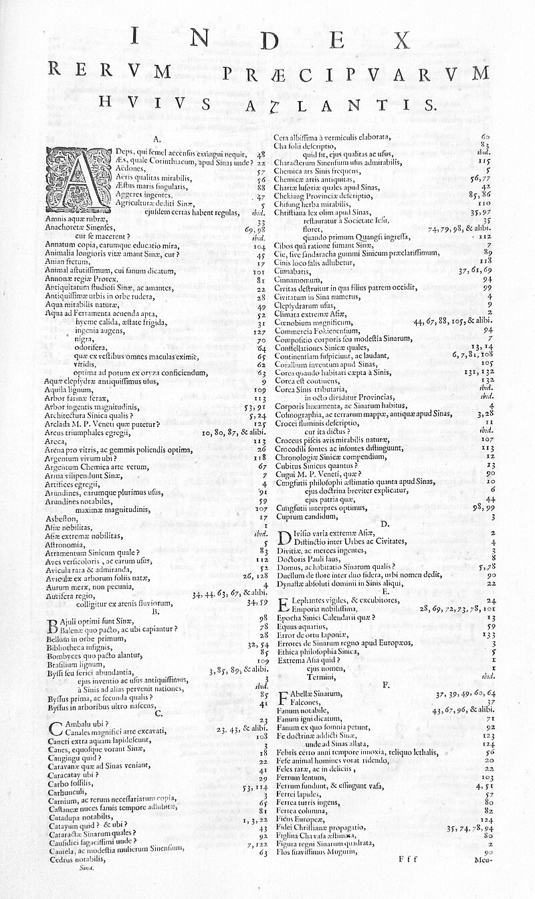
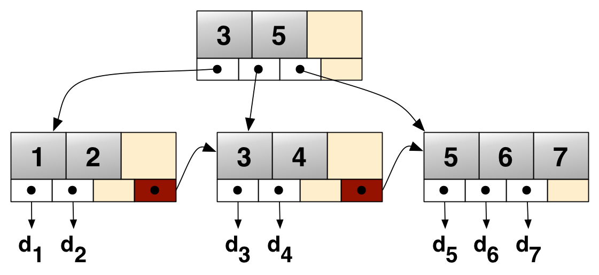

**목차**

인덱스 종류
- [인덱스](#인덱스)
- [B-Tree](#b-tree)
- [기본 키 인덱스 (Clustered Index)](#기본-키-인덱스-clustered-index)
- [보조 인덱스 (Secondary Index, Non-Clustered Index)](#보조-인덱스-secondary-index-non-clustered-index)
- [유니크 인덱스](#유니크-인덱스)
- [복합 인덱스 (Composite Index, Multi-Column Index)](#복합-인덱스-composite-index-multi-column-index)
- [커버링 인덱스](#커버링-인덱스)
- [내림차순 인덱스 (Descending Index)](#내림차순-인덱스-descending-index)
- [숨김 인덱스 (Invisible Index)](#숨김-인덱스-invisible-index)
- [풀 텍스트 인덱스](#풀-텍스트-인덱스)

스캔 방식
- [테이블 풀 스캔](#테이블-풀-스캔)
- [인덱스 풀 스캔](#인덱스-풀-스캔)
- [인덱스 레인지 스캔](#인덱스-레인지-스캔)
- [인덱스 유니크 스캔](#인덱스-유니크-스캔)
- [루즈 인덱스 스캔](#루즈-인덱스-스캔)
- [인덱스 스킵 스캔](#인덱스-스킵-스캔)

기타
- [인덱스 성능에 영향을 주는 요소](#인덱스-키-타입에-따른-성능-차이)
- [인덱스를 조회하는 방법](#인덱스를-조회하는-방법)
- [인덱스 사용 시 고려해야 할 옵티마이저 힌트](#인덱스-사용-시-고려해야-할-옵티마이저-힌트)


## 인덱스



[이미지 출처](https://en.wikipedia.org/wiki/Index_(publishing))

인덱스는 책이나 문서의 끝에 나오는 특정 항목의 목록과 해당 위치를 안내하는 표이다

어떤 정보를 빠르게 찾기 위한 색인표이다 (여기서 색인이란 책 속의 낱말이나 구절, 또 이에 관련한 지시자를 찾아보기 쉽도록 일정한 순서로 나열한 목록을 말함)

책에서 '데이터베이스'라는 주제에 대한 정보를 찾고 싶다면 처음부터 끝까지 모든 페이지를 넘겨서 찾는 대신, 인덱스 페이지에서 해당하는 페이지 번호를 찾아 바로 이동할 수 있다

데이터베이스도 이러한 특성을 이용하여 **특정 키 값을 기준으로 해당 레코드의 위치를 알려주어 조회 속도를 향상시킬 수 있는 자료구조**를 사용하는데 이를 데이터베이스 인덱스라고 한다

**특정 컬럼 값을 기준으로 정렬되거나 탐색 가능한 구조를 만들어두고 이 구조를 통해 실제 테이블의 데이터 주소를 빠르게 찾아가는 방식**이다

-> 보통 WHERE, JOIN, ORDER BY, GROUP BY 절에 사용되는 컬럼에 인덱스를 생성한다

MySQL에서 지원하는 인덱스 종류는 다음과 같다

PRIMARY KEY: 테이블의 기본 키 인덱스(UNIQUE + NOT NULL)로 InnoDB에서 클러스터형 인덱스(Clustered Index)로 구현된다. 데이터가 기본 키 순서대로 저장되며 기본 키가 없는 경우 내부적으로 생성된다

SECONDARY INDEX: 일반 보조 인덱스로 중복을 허용하며 주로 검색 성능 향상을 위해 사용된다

UNIQUE INDEX: 중복을 허용하지 않는 인덱스로 이메일 같은 컬럼의 유일 값 보장이 필요할 때 사용한다 (유니크 제약조건을 걸면 유니크 인덱스가 자동 생성된다)

COMPOSITE INDEX: 여러 컬럼을 조합한 인덱스로 복합 조건 검색 최적화에 사용된다 (컬럼의 순서에 따라 성능이 달라짐)

COVERING INDEX: 쿼리에서 필요한 모든 컬럼을 포함하는 인덱스로, 인덱스만으로 쿼리를 처리할 수 있어 성능이 향상된다

FULLTEXT INDEX: 전문 검색 인덱스로 자연어 텍스트 검색용(`MATCH ... AGAINST`)으로 사용된다

SPATIAL INDEX: 공간 데이터(GIS) 전용 인덱스로 [공간 타입](./2.%20자료형,%20쿼리,%20키,%20제약조건.md#공간형-spatial-types)에 R-tree 구조를 사용한 인덱스이다

HASH INDEX: 메모리 스토리지 엔진에서 사용하는 인덱스로 동일성 비교(=)에 최적화되어 있다


## B-Tree



B-Tree(B+Tree)는 **균형 잡힙 다진 트리**의 일종으로 정렬된 데이터에 대한 빠른 탐색, 삽입, 삭제, 범위 검색을 지원하기 위한 자료구조이다

B+Tree는 DB 인덱스, 파일시스템 등에 더 적합하도록 개선된 B-Tree의 변형 버전으로 InnoDB 엔진의 대부분 인덱스(기본 키, 보조, 복합 등)에서 사용된다

B+Tree 구조
- 노드: B+Tree는 여러 개의 노드로 구성되며 각 노드는 여러 개의 키와 포인터를 가진다
- 루트 노드: 트리의 최상위 노드
- 내부 노드: 루트 노드와 리프 노드에 사이에 위치한 모든 노드들을 내부 노드라고 한다. 내부 노드는 오직 키와 자식 노드를 가리키는 포인터만 가진다
- 리프 노드: 트리의 최하위 노드로 모든 키와 해당 키에 해당하는 실제 데이터 또는 포인터를 저장한다. 리프 노드들끼리는 양방향 연결 리스트 형태로 저장되어 있어 범위 검색에 효율적이다
- 균형 트리: B+Tree는 모든 리프 노드가 동일한 깊이에 위치하도록 균형을 유지한다. 이는 어떤 데이터를 검색하더라도 거의 일정한 시간에 찾을 수 있도록 보장한다

**내부 노드에는 키만 저장하고 리프 노드에 실제 데이터 위치(레코드 포인터, d1, d2 등)를 저장한 뒤 리프 노드끼리는 연결 리스트처럼 왼쪽에서 오른쪽으로 연결한다**

이 때 한 노드에 여러 키와 여러 자식을 저장할 수 있어 디스크 I/O를 최소화하여 검색 성능을 향상시킨다

또한 모든 리프 노드의 깊이가 같은 균형을 유지하여 일정한 탐색 시간을 보장한다

리프 노드 간에 연결되어 있으면 범위 쿼리(BETWEEN, ORDER BY 등) 시 인접 노드를 빠르게 탐색할 수 있어 성능이 향상된다


## 기본 키 인덱스 (Clustered Index)

MySQL의 InnoDB 스토리지 엔진에서 테이블의 실제 데이터는 클러스터형 인덱스(B+Tree)의 리프 노드에 저장된다

클러스터형 인덱스는 테이블의 기본 키를 기반으로 하는데, 이는 데이터 레코드 자체가 기본 키의 논리적인 순서에 따라 물리적으로 정렬되어 저장된다는 것을 의미한다

테이블 = 클러스터형 인덱스 = 데이터 파일(`.ibd`) -> InnoDB를 사용하면 테이블에 해당하는 데이터 파일을 클러스터형 인덱스(B+Tree)로 저장한다

클러스터형 인덱스의 B+Tree에서 내부 노드는 인덱스 키로 정렬되고, 리프 노드는 인덱스 키와 해당 레코드의 모든 컬럼 데이터를 직접 포함한다

테이블 생성 시 PRIMARY KEY를 지정하면 해당 키가 자도응로 클러스터형 인덱스로 사용된다

만약 PRIMARY KEY가 지정되지 않으면 NOT NULL과 UNIQUE 제약 조건이 있는 첫 번째 유니크 키가 클러스터형 인덱스로 사용되며, 이것도 없으면 InnoDB가 내부적으로 ROW_ID를 생성하여 클러스터형 인덱스로 사용한다

### 데이터 검색

1. 검색하려는 기본 키 값을 이용하여 B+Tree의 루트 노드부터 탐색을 시작한다

2. 내부 노드를 거쳐 해당 키 값이 있는 리프 노드를 찾는다

3 .리프 노드에 도달하면 해당 리프 노드에 인덱스 키와 함께 전체 레코드 데이터가 저장되어 있으므로 바로 필요한 데이터를 가져올 수 있다 -> 추가적인 디스크 I/O가 필요하지 않다

### 데이터 삽입

#### 1. 새로운 레코드 위치 탐색
- 새로운 데이터 레코드 자체를 삽입할 때 기본 키 순서에 따라 정렬 순서를 유지해야 한다
- 삽입하려는 레코드의 기본 키 값을 사용하여 루트 노드부터 탐색을 시작한다
- 새로운 레코드가 삽입되어야 할 리프 노드 페이지를 찾는다 (기본 키의 정렬 순서를 유지하는 곳)

#### 2. 페이지 공간 확인 및 삽입 (페이지 분할 발생 가능)
- 해당 리프 노드 페이지에 새로운 레코드를 위한 공간이 있는지 확인한다
- 공간이 충분한 경우 레코드를 페이지 내의 적절한 위치에 삽입한다 (페이지 내의 레코드들은 기본 키 순서로 정렬됨)
- 공간이 부족한 경우 InnoDB는 해당 페이지를 두 개의 페이지로 분할하는 **페이지 분할(page split)**을 수행한다
- 기본 페이지의 레코드 절반과 새로운 레코드를 한 페이지에, 나머지 절반을 다른 페이지에 분산하여 저장한다
- 새로운 페이지가 생성되었으므로 상위 내부 노드에도 새로운 페이지를 가리키는 포인터와 해당 페이지의 시작 키 값을 추가한다
- 만약 상위 내부 노드에도 공간이 부족하면 해당 내부 노드 또한 분할될 수 있으며 이 과정은 루트 노드까지 올라가면서 반복될 수 있다 (트리 높이 증가)
- 페이지 분할은 디스크 I/O를 증가시키고 잠금 경합을 유발하여 동시성 성능에 영향을 줄 수 있다

#### 3. 보조 인덱스 업데이트
- 클러스터형 인덱스에 레코드가 성공적으로 삽입되면 해당 레코드를 참조하는 모든 보조 인덱스에도 새로운 엔트리를 추가해야 한다
- 보조 인덱스의 리프 노드에는 보조 인덱스 키와 해당 레코드의 기본 키 값이 저장되므로 이 정보를 바탕으로 각 보조 인덱스 B+Tree에도 새로운 엔트리를 삽입한다
- 보조 인덱스 삽입 과정에서도 페이지 분할이 발생할 수 있으며, 이 경우에도 상위 내부 노드에 새로운 페이지 포인터와 키 값을 추가해야 한다

### 데이터 삭제

#### 1. 삭제할 레코드 위치 탐색
- 삭제하려는 레코드의 기본 키 값을 사용하여 루트 노드부터 탐색을 시작하여 삭제할 레코드가 있는 리프 노드 페이지를 찾는다

#### 2. 레코드 삭제 및 공간 관리
- 해당 리프 노드 페이지에서 레코드를 논리적으로 삭제 표시(Mark for Deletion)한다
- InnoDB는 즉시 물리적으로 공간을 회수하지 않고 해당 공간을 재사용 가능한 상태로 표시한다
- 레코드 삭제로 인해 페이지 점유율이 낮아지면 페이지 병합(merge)를 시도한다
- 페이지 병합은 디스크 공간을 효율적으로 사용하고 B+Tree의 높이를 줄여 검색 성능을 향상시킨다 (페이지 분할보다는 덜 발생함)
- 병합이 발생하면 상위 내부 노드에서 해당 페이지를 가리키는 포인터와 키 값을 제거해야 한다

#### 3. 보조 인덱스 업데이트
- 클러스터형 인덱스에서 레코드가 삭제되면 해당 레코드를 참조하는 모든 보조 인덱스에서도 해당 엔트리를 삭제해야 한다
- 보조 인덱스 B+Tree에서 해당 기본 키 값을 가진 엔트리를 찾아 삭제한다

#### InnoDB의 페이지 분할 및 병합 최소화 전략

AUTO_INCREMENT나 시간 순으로 정렬되는 UUID 등 순차적으로 증가하는 기본 키를 사용하면 새로운 레코드가 항상 테이블의 끝에 추가된다

이는 기존 페이지의 중간에 삽입되어 발생하는 페이지 분할을 최소화하고 대부분의 삽입은 마지막 리프 노드 페이지에 집중되므로 페이지 분할이 발생하더라도 국소적으로 일어난다

다만 완전 랜덤값(UUIDv4 등)을 기본 키로 사용하면 새로운 레코드가 테이블의 임의의 위치에 삽입되어 기존 페이지의 중간에 삽입되는 경우가 많아 페이지 분할을 자주 유발한다

또한 디스크 조각화(Fragmentation)를 유발하기 때문에 완전 랜덤 값을 사용하는 것은 삽입 성능을 저하시킨다

InnoDB는 페이지를 완전히 채우지 않고 약간의 여유 공간을 남겨두어 향후 삽입될 레코드를 위한 공간을 확보하여 작은 삽입으로 인한 즉각적인 페이지 분할을 방지한다

`OPMIMIZE TABLE <table_name>` 명령어를 사용하면 테이블과 인덱스를 재구성(rebuild)하여 단편화를 줄이고 공간을 효율적으로 재배치할 수 있다

다만 이 작업은 테이블에 대한 잠금을 유발하므로 운영 중인 서비스에서는 신중하게 사용해야 한다

### 장단점

장점
- 데이터 자체가 정렬되어 있고 인접한 데이터가 연결된 구조로 인해 기본 키 기반의 검색(equality search)과 범위 검색(range search)에 매우 효율적이다
- 데이터 검색 시 별도의 테이블 접근이 필요 없어 빠르다

단점
- 테이블당 단 하나만 존재할 수 있다 (테이블의 물리적 정렬은 하나만 가능하기 때문)
- 인덱스 키가 아닌 컬럼으로 검색할 때는 클러스터형 인덱스의 직접적인 이점을 활용할 수 없다


## 보조 인덱스 (Secondary Index, Non-Clustered Index)

보조 인덱스는 클러스터형 인덱스와 별개로 생성되는 독립적인 B+Tree 구조이며, 클러스터형 인덱스처럼 데이터 레코드의 물리적 정렬에 영향을 주지 않는다
 
보조 인덱스의 B+Tree에서 리프 노드는 인덱스 키(보조 인덱스를 생성한 컬럼 값)와 해당 레코드의 기본 키(PRIMARY KEY) 값을 포함한다 (클러스터형 인덱스처럼 전체 레코드 데이터를 포함하지 않음)

PRIMARY KEY가 아닌 다른 컬럼에 UNIQUE 또는 INDEX를 지정하면 보조 인덱스가 생성된다

### 데이터 검색
- 검색하려는 보조 인덱스 키 값을 이용하여 루트 노드부터 탐색을 시작한다
- 내부 노드를 거쳐 해당 보조 인덱스 키 값이 있는 리프 노드를 찾는다
- 리프 노드에 도달하면 해당 리프 노드에는 보조 인덱스 키와 기본 키 값이 저장되어 있다
- 이 기본 키 값을 이용하여 다시 클러스터형 인덱스를 통해 실제 데이터 레코드를 찾아간다 (이 과정을 룩업 또는 북마크 룩업이라고 함)

### 장단점

장점
- 테이블당 여러 개의 보조 인덱스를 생성할 수 있다
- 클러스터형 인덱스 외의 다양한 검색 조건에 대한 성능을 향상시킬 수 있다

단점
- 항상 두 번의 탐색 과정이 거치므로 클러스터형 인덱스에 비해 디스크 I/O가 추가된다 (보조 인덱스 탐색 -> 클러스터형 인덱스 탐색)
- 커버링 인덱스가 아닌 경우(보조 인덱스만으로는 필요한 모든 컬럼 데이터를 얻을 수 없는 경우) 룩업(클러스터형 인덱스 탐색)이 발생한다
- 인덱스 크기가 커질수록 검색 성능 저하가 발생할 수 있다

users 테이블이 다음과 같다고 가정해보자

```mysql
CREATE TABLE users (
    id INT PRIMARY KEY,        -- 클러스터형 인덱스 (기본 키)
    name VARCHAR(100),
    email VARCHAR(100) UNIQUE, -- 보조 인덱스 (유니크 제약조건으로 자동 생성)
    age INT,
    gender CHAR(1),
    INDEX idx_age (age)        -- 보조 인덱스 (age 컬럼에 대한 인덱스)
);
```

users 테이블에는 id (클러스터형 인덱스), email (보조 인덱스), age (보조 인덱스) 세 가지 인덱스가 있다

사용자가 email로 사용자를 찾고 name과 gender 정보를 가져오고 싶은 경우 보조 인덱스가 커버링 인덱스가 아니므로 룩업이 발생하게 된다

```mysql
SELECT name, gender
FROM users
WHERE email = 'hansanhha@mail.com';
```

위 쿼리의 동작 과정은 다음과 같다
- 옵티마이저: email 컬럼에 인덱스가 있는 것을 확인하고 email 보조 인덱스를 사용하기로 결정한다
- email 보조 인덱스 탐색: 보조 인덱스(유니크) 루트 노드부터 탐색하여 해당 이메일 값을 가진 리프 노드를 찾는다
- 룩업: 보조 인덱스만으로 name과 gender 정보를 알 수 없으므로 찾은 리프 노드에 저장된 기본 키 값을 통해 클러스터형 인덱스에서 해당 레코드를 찾는다 (룩업 과정)
- 데이터 반환: 룩업을 통해 users 테이블의 해당 레코드에 접근하여 name과 gender 컬럼을 가져와 결과를 반환한다


## 유니크 인덱스

유니크 인덱스는 중복 값을 허용하지 않는 보조 인덱스의 일종으로, 특정 컬럼 값이 테이블 내에서 유일함을 보장해야 할 때 사용한다

다만 NULL은 "알 수 없음"을 의미하므로 서로 같은 값으로 간주되지 않기 때문에 허용하므로 유니크 인덱스에 여러 NULL 값이 들어갈 수 있다

테이블의 컬럼에 유니크 제약조건을 걸거나 기본키로 지정하면 유니크 인덱스가 생성된다

일반적인 보조 인덱스와 달리 삽입/업데이트 시 해당 컬럼에 중복된 값이 있는지 인덱스를 통해 확인하는 중복 값 검사를 진행한다

만약 중복된 값이 발견되면 데이터베이스는 `Duplicate entry 'value' for key '...'` 와 같은 오류를 반환하고 작업을 실패시킨다

데이터 검색 시 (`where indexed_col = value`) 유니크 인덱스를 지정하면 원하는 값을 찾았을 때 인덱스 스캔을 더이상 하지 않는다 (검색 효율성 향상)

반면 일반 보조 인덱스는 원하는 값을 찾더라도 동일한 값을 가진 다른 레코드가 존재할 수 있기 때문에 인덱스 리프 노드의 다음 레코드를 계속 스캔하여 일치하는 모든 레코드를 찾으려고 한다

**복합 유니크 인덱스**는 여러 컬럼의 조합이 유일해야 할 때 사용한다


## 복합 인덱스 (Composite Index, Multi-Column Index)

복합 인덱스는 두 개 이상의 컬럼을 함께 묶어서 생성하는 인덱스이다

단일 컬럼 인덱스와 달리 복합 인덱스는 묶인 컬럼들의 조합 순서와 해당 컬럼들이 쿼리에서 어떻게 사용되는지에 따라 그 효과가 크게 달라질 수 있다

다른 인덱스들과 마찬가지로 B+Tree 구조를 가지는데, 이 때 각 노드에 저장되는 키는 단일 컬럼 값이 아니라 묶여진 컬럼들의 값을 순서대로 조합한 형태가 된다

`INDEX (col_A, col_B)` 순서로 생성된 복합 인덱스는 노드의 키 값이 `col_A의 값, col_B의 값` 형태로 저장된다

이 인덱스의 B+Tree 정렬 순서는 다음과 같다
- col_A 기준으로 먼저 정렬된다
- col_A 값이 같은 경우 col_B 기준으로 정렬된다

```text
// 예시 데이터
rust python
rust zig
go kotlin
go odin

// 인덱스 내에서 정렬된 형태
go kotlin
go odin
rust python
rust zig
```

**복합 인덱스의 규칙: 좌측 컬럼 우선 규칙 (Leftmost Prefix Rule)**

복합 인덱스는 좌측 컬럼부터 우선적으로 적용되므로 가장 왼쪽 컬럼부터 순서대로 사용될 때만 인덱스를 효율적으로 활용할 수 있다

`INDEX (col_A, col_B, col_C)` 인덱스에 대한 쿼리에서 인덱스를 사용할 수 있는 경우는 다음과 같다
- `col_A` 조건으로만 검색: 인덱스 사용 가능 (`WHERE col_A = 'value'`)
- `col_A`와 `col_B` 조건으로 검색: 인덱스 사용 가능 (`WHERE col_A = 'value' AND col_B = 'value'`)
- `col_B` 조건으로만 검색: 인덱스 사용 불가능 (옵티마이저가 풀 스캔을 선택할 가능성이 높아짐)
- `col_A`와 `col_C` 조건으로 검색: `col_A`는 사용 가능하지만 `col_C`는 `col_B`를 건너뛰고 사용 불가능 (`col_A` 필터링 후 `col_C`는 풀 스캔 또는 다른 인덱스 고려)

복합 인덱스의 장점
- 쿼리 범위 최적화: 여러 컬럼을 한 번에 필터링하여 검색 범위를 크게 줄일 수 있다
- 정렬(ORDER BY) 최적화: WHERE 절에서 인덱스의 좌측 컬럼이 사용되고 ORDER BY 절에서 그 다음 컬럼들이 인덱스 순서대로 사용된다면 별도의 정렬 작업을 생략하고 인덱스에서 이미 정렬된 데이터를 가져올 수 있다 (`WHERE col_A = ? ORDER BY col_B col_C`)
- 커버링 인덱스 역할 수행: SELECT 절에서 필요한 모든 컬럼이 복합 인덱스에 포함되어 있다면 룩업 없이 인덱스만으로 쿼리를 처리할 수 있다
- 불필요한 인덱스 감소: 여러 단일 컬럼 인덱스를 만드는 대신 하나의 복합 인덱스로 여러 쿼리를 커버하여 인덱스 개수를 줄이고 유지보수 비용을 절감할 수 있다

복합 인덱스 설계 시 고려사항
- 쿼리 패턴 분석: 어떤 컬럼들이 WHERE, ORDER BY, GROUP BY 절에서 함께 사용되는지 분석해야 한다
- 컬럼 순서 지정
  - WHERE 절에서 주로 사용되는 컬럼을 인덱스의 선두(가장 왼쪽)에 배치한다 (특히 동등 비교(=)나 범위 비교(>, <, BETWEEN)에서 자주 사용되는 컬럼 우선)
  - 그 다음 선택도(Cardinality)가 높은 컬럼을 배치한다 (이메일이나 주민등록번호와 같이 중복 값이 적어 데이터 필터링 효과가 큰 컬럼)
  - ORDER BY 또는 GROUP BY에 사용되는 컬럼: WHERE 절 다음 순서로 배치하여 정렬/그룹화 작업을 최적화한다
  - 커버링을 위한 컬럼: SELECT 절에만 필요한 컬럼들은 인덱스의 가장 마지막에 추가하여 커버링 인덱스를 만든다
- WHERE 절의 범위 검색 컬럼 순서 고려: WHERE 절에 범위 조건이 포함되면 해당 컬럼 이후의 인덱스 컬럼들은 WHERE 절에서 인덱스 탐색(Range Scan)에 사용될 수 없으므로 등호 조건이 먼저 오는게 더 효율적이다

```mysql
CREATE TABLE orders (
    id INT PRIMARY KEY,
    customer_id INT,
    order_date DATETIME,
    status VARCHAR(20),
    total_amount DECIMAL(10, 2)
);
```

```mysql
-- 동등 비교 및 범위 검색
SELECT *
FROM orders
WHERE customer_id = 123 AND order_date >= '2025-07-01';

-- 인덱스: IDDEX (customer_id, order_date)
-- customer_id로 먼저 필터링하고 그 안에서 order_date로 범위를 좁힌다
```

```mysql
-- 동등 비교 및 정렬
SELECT customer_id, order_date, total_amount
FROM orders
WHERE status = 'COMPLETED'
ORDER BY order_date DESC;

-- 인덱스: INDEX (status, order_date, customer_id, total_amount)
-- status로 먼저 필터링하고 order_date로 정렬하며 customer_id와 total_amount는 커버링을 위해 추가한다
```

```mysql
-- 범위 검색 및 동등 비교
SELECT COUNT(*)
FROM orders
WHERE order_date BETWEEN '2025-07-01' AND '2025-07-31' AND customer_id = 123;

-- 인덱스: INDEX (order_date, customer_id) 또는 INDEX (customer_id, order_date)
-- 두 순서 모두 가능하지만 customer_id의 선택도가 더 높다면 INDEX (customer_id, order_date)가 더 효율적일 수 있다
-- 또한 WHERE 절에 범위 조건이 포함되면 해당 컬럼 이후의 인덱스 컬럼들은 WHERE 절에서 인덱스 탐색(Range Scan)에 사용될 수 없으므로 등호 조건이 먼저 오는게 더 효율적이다
-- (customer_id, order_date): customer_id로 먼저 탐색 후 order_date로 범위 필터링
-- (order_date, customer_id): order_date로 먼저 범위 탐색 후 customer_id로 동등 비교 필터링
```


## 커버링 인덱스

커버링 인덱스는 쿼리 성능을 극대화하기 위한 인덱스 최적화 기법이다

커버링이라는 이름에서 알 수 있듯이 쿼리가 필요로 하는 모든 컬럼(SELECT, WHERE, ORDER BY 절 등에서 사용되는 컬럼)을 인덱스 자체가 커버(cover)하여 테이블의 실제 데이터(클러스터형 인덱스)에 접근할 필요없이 인덱스만으로 쿼리를 완벽하게 처리할 수 있는 인덱스를 말한다

복합 인덱스는 두 개 이상의 인덱스를 구성하는 컬럼의 개수에 초점을 맞춘 개념이고, 커버링 인덱스는 쿼리 처리 방식에 초점을 맞춘 개념으로 단일 컬럼 인덱스가 커버링 인덱스가 되거나 복합 인덱스가 커버링 인덱스가 되지 못할 수 있다

InnoDB의 보조 인덱스의 리프 노드는 인덱스 키와 기본 키 값을 저장한다

커버링 인덱스는 보조 인덱스의 리프 노드에 쿼리가 필요로 하는 모든 정보가 포함되어 있어 클러스터형 인덱스를 다시 찾아가는 룩업 과정을 생략할 수 있도록 한다

```mysql
CREATE TABLE users (
    id INT PRIMARY KEY,               -- 클러스터형 인덱스 (PK)
   name VARCHAR(100),
   email VARCHAR(100) UNIQUE,         -- 별도의 보조 인덱스 (UNIQUE 제약조건으로 자동 생성)
   age INT,
   INDEX idx_email_name (email, name) -- email과 name을 포함하는 복합 보조 인덱스 
)
```

위의 users 테이블의 **idx_email_name 인덱스의 리프 노드**에 저장되는 데이터는 `email 값, name 값, id 값` 이다

이 때 아래의 쿼리를 통해 커버링 인덱스로 사용하는 경우 다음과 같은 실행 과정을 거친다 
- 옵티마이저: `WHERE email = 'hansanhha@mail.com'` 조건을 보고 idx_email_name 인덱스를 사용하기로 결정한다
- idx_email_name 인덱스 탐색: 루트 노드부터 시작하여 해당 이메일 값을 가진 리프 노드를 탐색한다
- 데이터 획득 및 반환 (룩업 X): 리프 노드에 쿼리가 필요로 하는 모든 컬럼이 포함되어 있으므로 클러스터형 인덱스를 다시 찾아가지 않고 바로 결과를 반환한다

```mysql
SELECT id, email, name
FROM users
WHERE email = 'hansanhha@mail.com';
```

커버링 인덱스를 잘 사용하면 여러 가지 장점을 누릴 수 있다
- 시스템 리소스 사용량 감소: 룩업 과정 생략 -> 디스크 I/O 횟수 감소, CPU 사용량 감소
- 캐시 효율성 향상: 버퍼 풀에 커버링 인덱스의 데이터가 유지되어 캐시 히트율이 높아질 수 있다
- 페이지 잠금 경합 감소: 데이터 페이지에 대한 잠금을 획득할 필요가 없거나 최소화되어 동시성이 향상된다

다만 커버링 인덱스가 효과적이라고 해서 모든 컬럼을 인덱스에 포함시키면 다음과 같은 문제가 발생할 수 있다
- 더 많은 디스크 공간 사용: 인덱스 크기가 커져서 디스크 공간을 더 많이 차지하게 된다
- 인덱스 생성 및 유지 관리(삽입, 삭제, 업데이트) 비용 증가: 데이터 변경 시 모든 인덱스를 업데이트해야 한다
- 버퍼 풀 효율성 저하: 큰 인덱스 페이지가 버퍼 풀을 더 많이 차지하여 다른 데이터의 캐싱 공간을 줄일 수 있다
- 트리 기핑 증가: 너무 많은 컬럼을 포함하면 인덱스의 B+Tree 깊이가 깊어져서 검색 성능이 저하될 수 있다


## 내림차순 인덱스 (Descending Index)

내림차순 인덱스는 MySQL 8.0 부터 정식으로 도입된 기능으로 인덱스를 구성하는 특정 컬럼의 값을 **내림차순** 으로 정렬하여 저장하는 인덱스이다

주로 쿼리의 ORDER BY 절이 내림차순 정렬을 요구할 때 사용된다

기존에는 `INDEX (col DESC)` 와 같이 생성하더라도 MySQL은 내부적으로 실제 디스크에 오름차순으로 정렬해서 저장했었다

이렇게 저장된 인덱스로 `ORDER BY col DESC` 쿼리를 실행하면 MySQL은 보통 두 가지 방법을 사용했다

**역방향 인덱스 스캔(Backward Index Scan)**: 인덱스를 오름차순으로 끝까지 스캔한 후 마지막부터 역방향으로 데이터를 읽어나가는 방법

**파일 정렬**: 인덱스를 사용하더라도 ORDER BY 절의 정렬 순서가 인덱스와 일치하지 않으면 데이터를 메모리나 디스크에서 다시 정렬하는 작업 (CPU와 I/O 리소스를 많이 소모함)

이 방식은 대용량 데이터를 내림차순으로 정렬할 때 성능이 저하되는 문제를 일으켜 실제로 인덱스 키를 내림차순으로 저장하는 내림차순 인덱스가 도입되었다

내림차순 인덱스를 사용하면 `ORDER BY col DESC` 쿼리를 실행했을 때 옵티마이저가 이를 확인하고 인덱스의 시작(가장 큰 값)부터 정방향으로 스캔하여 데이터를 읽는다

파일 정렬 없이 인덱스 스캔으로만 정렬된 결과를 얻을 수 있어 리소스를 덜 모소하고 쿼리 응답 시간을 단축한다

또한 `INDEX (col_A ASC, col_B DESC`)와 같이 복합 인덱스 내에서 컬럼 별로 정렬 순서를 다르게 지정할 수 있다  


## 숨김 인덱스 (Invisible Index)

숨김 인덱스는 MySQL 8.0 부터 도입된 기능으로 인덱스를 데이터베이스에서 물리적으로 삭제하지 않으면서도 쿼리 옵티마이저가 해당 인덱스를 쿼리 실행 계획 수립에 사용하지 못하도록 숨기는 기능이다

인덱스는 여전히 존재하기에 데이터 변경 시 업데이트되지만 옵티마이저에게 존재하지 않는 것처럼 보인다

-> 읽기 작업에서 배제시킬 수 있으나 쓰기 작업은 여전히 오버헤드를 발생시킨다 (숨김 인덱스는 쿼리 실행 계획에 미치는 영향을 제어하는 것이 주 목적임) 

```mysql
-- 생성 시 INVISIBLE 옵션을 사용하여 숨김 인덱스 생성
CREATE INDEX idx_user_name ON users (name) INVISIBLE;

-- 기존 인덱스를 숨김 인덱스로 설정/해제
ALTER TABLE users ALTER IDNEX idx_user_name INVISIBLE; -- 숨김 인덱스로 설정
ALTER TABLE users ALTER INDEX idx_user_name VISIBLE; -- 다시 보이는 인덱스로 설정
```

**기본 키는 테이블의 클러스터형 인덱스이므로 숨김 인덱스로 만들 수 없다**


## 풀 텍스트 인덱스

풀 텍스트 인덱스는 일반적인 `WHERE col = value`, `WHERE col LIKE '%value%'` 형태의 쿼리로는 효율적으로 처리하기 어려운 대용량 텍스트 데이터를 검색하기 위해 설계된 특수한 인덱스이다

주로 문서 내용, 게시글 본문 같이 긴 문자열 컬럼에서 특정 단어나 구문 등을 고려하여 검색할 때 사용된다

일반적인 B+Tree 인덱스는 `WHERE col = value%`와 같이 와일드카드(`%`)가 뒤에 오는 경우 효율적으로 사용할 수 있다

B+Tree가 정렬된 구조이기 때문에 `va`로 시작하는 모든 값을 빠르게 찾을 수 있다

반면 `%value%`나 `%value`와 같은 쿼리에서는 B+Tree의 정렬 특성을 활용할 수 없고, 데이터베이스가 모든 레코드의 컬럼을 스캔하여 문자열 일치 여부를 확인하는 **풀 테이블 스캔**을 수행해야 한다

이는 데이터 양이 많아질수록 엄청난 성능 저하를 야기할 수 있다

풀 텍스트 인덱스는 이러한 문제를 해결하기 위해 MySQL 차원에서 제공하는 기능으로 B+Tree가 아닌 역인덱스(Inverted Index) 구조를 기반으로 한다

역인덱스는 다음과 같은 방식으로 만들어진다
- 단어 분리 (Tokenization): 인덱싱하려는 텍스트를 공백이나 구두점 등을 기준으로 개별 단어(Term)로 분리한다 (이 과정에서 불용어(Stopwords, the, is 등)를 제거할 수 있음)
- 정규화 (Normalization): 단어를 소문자로 변환하거나 어간 추출(Stemming, 'running', 'ran' 'runs'를 모두 run으로 통일)을 통해 단어의 기본형을 만든다
- 역인덱스 생성: 각 고유한 단어와 해당 단어가 나타나는 문서(레코드)의 ID를 매핑하는 구조를 만든다

MySQL에 내장된 불용어 리스트가 있으며 이 단어들은 자동으로 제외된다 (커스텀 가능)

또한 인덱싱할 최소/최대 길이를 설정할 수 있는데 너무 짧은 단어는 검색에 의미가 없거나 인덱스 크기만 불필요하게 키우므로 제외하는 것이 좋다

```text
// 일반 레코드
문서 ID 텍스트 내용

1 "MySQL is a powerful database."
2 "Database performance is crucial."
3 "Learn MySQL for better performance."

// 역인덱스
단어 문서 ID 목록 (등장 위치 정보 포함 가능)

a 1
better 3
crucial 2
database 1, 2
```

풀 텍스트 인덱스는 아래와 같이 생성할 수 있으며 CHAR, VARCHAR, TEXT 타입의 컬럼만 허용한다

```mysql
CREATE TABLE articles (
    id INT PRIMARY KEY,
    title VARCHAR(255),
    content TEXT,
    FULLTEXT INDEX idx_content (content) -- content 컬럼에 풀 텍스트 인덱스 생성
);
```

`MATCH ... AGAINST` 구문을 사용하여 풀 텍스트 인덱스를 활용한 검색을 수행할 수 있다

`MATCH (text_column) AGAINST ('search term')`
- 쿼리의 단어를 분리하고 정규화한다
- 역인덱스에서 단어를 찾아 해당 단어들이 포함된 문서 ID를 찾는다
- 단어가 포함된 레코드를 반환한다

검색 모드를 설정할 수도 있다
- 자연어 모드(기본 값): 쿼리 문자열을 자연어 텍스트로 해석하고 단어의 중요도(빈도수 등)를 기반으로 관련성을 점수화한다
- 불리언 모드: SQL의 AND, OR, NOT과 같은 연산자를 검색어에 사용할 수 있다 `+` (포함) `-` (제외) `*` (와일드카드) `< >` (우선순위 변경)
- 쿼리 확장 모드: 주어진 검색어와 유사한 의미를 가지는 단어(연관 검색어)를 자동으로 추가하여 검색 범위를 확장한다

```mysql
-- 자연어 모드
WHERE MATCH (content) AGAINST ('database');

-- 불리언 모드
WHERE MATCH (content) AGAINST ('+performance -crucial' IN BOOLEAN MODE);

-- 쿼리 확장 모드
WHERE MATCH (content) AGAINST ('database' WITH QUERY EXPANSION);
```

MySQL에서 제공하는 풀 텍스트 인덱스의 한계는 다음과 같다
- 서구권 언어에만 최적화: 한국어, 중국어, 일본어 같이 단어 구분이 어려운 언어(형태소 분석 필요)에서는 기본 풀 텍스트 인덱스로만 원하는 결과를 얻기 어려울 수 있다
- 실시간성: 데이터가 변경될 때마다 인덱스가 업데이트되지만 복잡한 인덱싱 과정 때문에 트랜잭션 빈도가 높은 환경에서는 성능 문제가 발생할 수 있다
- 정확도와 유연성: 단순 키워드 매칭은 효율적이지만 의미 기반 검색, 퍼지 검색(오탈자 허용 검색), 사용자 정의 랭킹 검색 등의 고급 기능은 제공하지 않는다

이러한 한계점으로 인해 복잡한 요구사항이나 특정 언어를 지원해야 하는 경우 엘라스틱 서치, 아차피 솔라(Solr) 등을 사용하는 것이 더 나은 선택일 수 있다


## Spatial Index


## 테이블 풀 스캔

테이블 풀 스캔이란 테이블의 모든 행을 처음부터 끝까지 순차적으로 검사하는 방식으로 인덱스를 사용할 수 없거나 사용하지 않을 때 발생한다

클러스터형 인덱스의 모든 리프 노드를 순차적으로 읽어야 하므로 디스크 I/O가 많이 발생하고, 데이터가 많을수록 성능 저하가 심각해진다

아래와 같이 인덱스가 없는 컬럼을 WHERE 절에 사용하면서 LIMIT 절도 없는 경우 테이블 풀 스캔이 발생한다

```mysql
CREATE TABLE users (
    id INT PRIMARY KEY,
    name VARCHAR(100)
);

SELECT * FROM users WHERE name = 'hansanhha';
```

`LIKE %value`, `LIKE %value%` 와 같이 와일드카드가 앞에 오면 모든 문자열을 검색해야 하므로 테이블 풀 스캔이 발생할 수 있다

테이블 풀 스캔을 피하려면 WHERE 절에 인덱스가 있는 컬럼을 사용하거나 다중 조건 쿼리에서 복합 인덱스의 선두 컬럼(좌측 컬럼 우선 규칙)을 사용해야 한다

또는 LIMIT 절이나 SELECT 절에서 적절한  필요한 데이터만 가져오도록 쿼리를 수정하여 테이블 풀 스캔을 최소화할 수 있다


## 인덱스 풀 스캔

인덱스 풀 스캔은 테이블에 생성된 특정 인덱스의 모든 엔트리(리프 노드)를 처음부터 끝까지 모두 읽는 방식을 말한다

주로 SELECT 절에 요구하는 모든 컬럼이 해당 인덱스 내에 존재할 때(커버링 인덱스) 발생한다

테이플 풀 스캔보다는 페이지 크기가 작으므로 효율적이지만 인덱스의 모든 페이지를 디스크에서 읽어 메모리로 가져오기 때문에 여전히 성능 저하를 일으킬 수 있다

다만 B+Tree 구조 특성 상 이미 인덱스 키 순서대로 정렬되어 있으므로 파일 정렬을 처리하지 않는다

**다량의 데이터를 조회할 때 커버링 인덱스를 사용하여 인덱스 풀 스캔을 수행하면 테이블 풀 스캔보다 훨씬 빠르게 데이터를 가져올 수 있다 (인덱스 설계와 쿼리 작성이 중요함)**

인덱스 풀 스캔이 발생하는 경우는 다음과 같다

WHERE 절이 없지만 SELECT 절의 모든 컬럼이 인덱스에 포함되는 경우

```mysql
-- 인덱스: INDEX idx_users_email (email)

-- 인덱스로 지정된 email 컬럼을 필요로 한다
-- 전체 테이블을 스캔하는 대신 idx_users_email 인덱스의 모든 리프를 스캔하여 값을 가져온다
SELECT email FROM users;
```

WHERE 절이 없지만 ORDER BY 절에 인덱스 컬럼이 포함되는 경우

```mysql
-- 인덱스: INDEX idx_users_name (name)

-- name 컬럼으로 정렬해야 하는데 WHERE 절이 없어 특정 범위로 인덱스 스캔을 줄일 수 없다
-- name 인덱스가 이미 정렬되어 있으므로 인덱스 풀 스캔을 통해 정렬된 결과를 가져온다 (파일 정렬은 피함)
SELECT id, name FROM users ORDER BY name;
```

인덱스를 효율적으로 사용하지 못한 경우

```mysql
-- 인덱스: INDEX idx_users_email_name (email, name)

-- 인덱스의 두 번째 컬럼만 사용하고 WHERE 절이 없어 인덱스 풀 스캔이 발생한다
-- 또한 인덱스 전체를 읽어서 name 컬럼을 기준으로 정렬된 데이터를 얻으려고 하기에 파일 정렬이 발생할 수 있다
SELECT email, name FROM users ORDER BY name;
```

인덱스 풀 스캔이 항상 나쁜 것은 아니지만 불필요한 인덱스 풀 스캔은 피해야 한다

인덱스 풀 스캔 최적화 방법
- WHERE 절 활용: 인덱스 레인지 스캔 유도
- 커버링 인덱스 설계: SELECT 절에 필요한 컬럼을 인덱스에 모두 포함시켜 인덱스 풀 스캔이 발생하더라도 룩업을 피한다
- LIMIT 절 활용: ORDER BY와 함께 LIMIT 절을 사용하면 인덱스 풀 스캔이 발생하더라도 필요한 만큼의 데이터만 읽고 스캔을 중단할 수 있다


## 인덱스 레인지 스캔

인덱스 레인지 스캔은 MySQL에서 가장 일반적이고 효율적인 인덱스 스캔 방식 중 하나로 타이트 인덱스 스캔(Tight Index Scan)이라고도 불린다

보통 WHERE 절에 인덱스 컬럼에 대한 범위 조건(Range Condition)이 포함될 때 사용되며, **인덱스의 특정 시작 지점부터 끝 지점까지의 범위 내에 인덱스 엔트리(리프 노드)만을 스캔하는 방식**이다 

작동 방식
- 시작 지점 찾기: WHERE 절의 조건에 맞는 가장 첫 번째 인덱스를 탐색한다
- 리프 노드 레인지 스캔: 리프 노드는 양방향 연결 리스트이므로 시작 지점부터 WHERE 절의 조건을 만족하지 않거나 마지막 엔트리까지 순차적으로 스캔한다
- 룩업 또는 커버링: SELECT 쿼리에 필요한 컬럼이 해당 인덱스에 모두 포함되어 있으면 그대로 결과를 반환하고 없다면 클러스터형 인덱스 룩업을 수행한 뒤 결과를 반환한다

발생 조건
- 동등 비교: `col=value` (유니크 인덱스더라도 IN 절 등 여러 값을 찾는 경우 레인지 스캔으로 처리됨)
- 범위 비교: `col >= value`, `col <= value`, `col BETWEEN value1 AND value2`
- IN 연산자: `col IN (value1, value2, value3)`
- LIKE 연산자: `col LIKE 'value%'` (와일드카드가 뒤에 오는 경우)


## 인덱스 유니크 스캔

유니크 스캔은 MySQL에서 사용하는 인덱스 스캔 방식 중 가장 빠르고 효율적이다

유니크 인덱스 (기본 키 인덱스 포함)를 사용하여 쿼리가 정확히 하나의 레코드만 찾아야 할 때 발생한다

인덱스의 유일성이라는 특성을 최대한 활용하여 불필요한 스캔을 하지 않고 빠르게 결과를 반환한다

작동 방식
- 탐색: WHERE 절의 조건에 맞는 유니크 인덱스에 대한 탐색을 시작한다
- 단일 레코드 찾기: 원하는 키 값을 찾으면 스캔을 중단한다
- 룩업 또는 커버링: SELECT 쿼리에 필요한 컬럼이 해당 인덱스에 모두 포함되어 있으면 그대로 결과를 반환하고, 그렇지 않으면 클러스터형 인덱스 룩업을 수행하여 결과를 반환한다

주로 WHERE 절에 유니크 인덱스나 기본 키에 대한 동등 비교(=) 조건이 사용될 때 발생한다

NULL이 허용되지 않는 유니크 인덱스가 가장 최적화되어 스캔을 수행할 수 있다


## 루즈 인덱스 스캔

루즈 인덱스 스캔은 복합 인덱스의 특성을 활용하 GROUP BY 또는 DISTINCT 쿼리를 효율적으로 처리하는 스캔 방식이다

인덱스 레인지 스캔의 특수한 형태로 인덱스의 모든 일치하는 엔트리를 스캔하는 대신 필요한 정보만 느슨하게 스캔하여 효율성을 높이고자 한다

일반적으로 GROUP BY 쿼리는 대량의 데이터를 그룹화해야 할 때 상당한 자원을 소모하는데 이를 루즈 인덱스 스캔을 통해 최적화할 수 있다

루즈 인덱스 스캔은 복합 인덱스의 좌측 컬럼 우선 규칙(Leftmost Prefix Rule)을 활용해야 하므로 다음과 같은 전체 조건을 만족해야 한다
- 쿼리가 복합 인덱스에 대해 수행되어야 한다
- GROUP BY 또는 DISTINCT 절의 컬럼들이 인덱스의 선두 컬럼들(Prefix)과 일치하거나 그 일부여야 한다
- WHERE 절의 조건은 인덱스의 선두 컬럼에 대한 동등 비교 조건이어야 한다 (범위 조건이 중간에 들어가면 루즈 인덱스 스캔이 어려워짐)
- 집계 함수 사용시 `MIN()`과 `MAX()`로 제한된다 (다른 함수는 그룹 내 모든 값을 알아야 하기 때문에 루즈 인덱스 스캔이 발생하기 어려워짐)

GROUP BY 또는 DISINTCT의 요구사항을 충족하기 위해 인덱스의 특정 부분만 읽고 다음 그룹의 첫 번째(또는 마지막) 인덱스 엔트리로 점프한다

즉, 각 그룹의 모든 노드를 읽는 대신 대표값만 빠르게 찾는다

아래의 3개 컬럼을 복합 인덱스로 설정한 orders 테이블에 대해 루즈 인덱스 스캔이 발생하는 쿼리를 살펴보자

```mysql
CRATE TABLE orders (
    id INT PRIMARY KEY,
    customer_id INT,
    order_date DATETIME,
    total_amount DECIMAL(10, 2),
    INDEX idx_orders (customer_id, order_date, total_amount) -- 복합 인덱스
);
```

```mysql
SELECT customer_id, MIN(order_date)
FROM orders
GROUP BY customer_id;
```

- 옵티마이저는 customer_id를 기준으로 그룹화해야 한다는 것을 인지한다
- `INDEX idx_orders(customer_id, order_date, total_amount)` 인덱스의 맨 처음으로 이동한다
- 첫 번째 customer C1 그룹을 찾는다
- 그리고 해당 customer_id 인덱스 내에서 가장 작은 order_date를 가져온다 (기본적으로 오름차순 정렬이므로 바로 가져옴)
- C1 그룹의 모든 노드를 읽지 않고 건너뛰어서 다음 customer_id C2로 이동한다 (루즈 인덱스 스캔)
- 이런 방식으로 각 그룹의 모든 데이터를 읽지 않고 건너뛰면서 모든 customer_id 그룹에 대해 customer_id와 MIN(order_date)를 가져온다

DISTINCT도 위의 방식과 유사하게 이미 조회한 값을 건너뛰고 다음 값을 탐색하면서 중복되지 않는 값을 빠르게 찾는다


## 인덱스 스킵 스캔

인덱스 스킵 스캔은 MySQL 8.0부터 도입된 인덱스 활용 기법으로 복합 인덱스에서 쿼리의 WHERE 절 조건이 인덱스의 선두 컬럼을 포함하지 않더라도 인덱스를 활용할 수 있다

기존에는 좌측 컬럼 우선 규칙의 제약으로 인해 `INDEX idx_user (col_A, col_B, col_C)` 인덱스에 대해 `WHERE col_B = value`와 같은 쿼리는 인덱스의 첫 번째 컬럼이 없기 때문에 인덱스를 사용할 수 없었다

이런 쿼리는 보통 풀 테이블 스캔을 유발하거나 `col_B`에 대한 별도의 단일 인덱스를 만들어서 풀 테이블 스캔을 방지해야 했다

만약 `col_A`의 고유한 값의 개수(cardinality)가 매우 적다면 `col_A`의 각 고유 값 (`col_B, col_C`)에 대해 인덱스를 활용하는 것이 가능하다

인덱스 스킵 스캔은 이러한 시나리오를 자동화하여 최적화하는 기법이다

작동 방식
- 옵티마이저가 인덱스의 선두 컬럼의 가능한 모든 고유값들을 내부적으로 열거(Enumerate)한다
- 이후 각 고유값에 대해 나머지 인덱스 부분을 스캔한다

```mysql
CREATE TABLE products (
    id INT PRIMARY KEY,
    category_id INT,
    status VARCHAR(20),
    name VARCHAR(100),
    INDEX idx_products (category_id, status, name) -- 복합 인덱스
);
```

```mysql
SELECT id, category_id, price
FROM products
WHERE status = 'AVAILABLE'; 
```

- 옵티마이저는 category_id 컬럼의 고유 값들이 얼마 되지 않는 것을 확인한다
- 이후 내부적으로 다음과 같이 여러 개의 작은 쿼리로 분할된 것처럼 동작한다

```mysql
WHERE category_id = 1 AND status = 'AVAILABLE'
WHERE category_id = 2 AND status = 'AVAILABLE'
WHERE category_id = 3 AND status = 'AVAILABLE'
```

각 category_id의 고유 값에 대해 인덱스의 해당 부분으로 직접 점프하여 `status = 'AVAILABLE'` 조건을 만족하는 레코드를 찾는다

-> 전체 인덱스를 순차적으로 스캔하는 것이 아니라 category_id 값들을 건너뛰면서 status 부분만 검색한다

다만 인덱스 선두 컬럼의 낮은 고유성(Low Cardinality)이 보장되어야 하며, 만약 고유 값이 많다면 인덱스 스킵 스캔이 오히려 비효율적일 수 있다


## 인덱스 성능에 영향을 주는 요소

### 인덱스 크기

인덱스의 데이터 타입이 클수록 인덱스의 크기가 커진다

인덱스 크기가 커지면 더 많은 디스크 페이지를 읽어야 하므로 디스크 I/O가 증가하고, 이는 인덱스 스캔(레인지, 풀 스캔)의 속도를 저하시킨다

또한 버퍼 풀에 더 적은 수의 인덱스 페이징만 캐싱할 수 있어 캐시 히트율이 낮아진다 -> 다시 디스크 I/O가 늘어난다

B+Tree 인덱스는 노드당 특정 수의 키를 저장하는데 키 크기가 커지면 한 노드에 저장할 수 있는 키의 수가 줄어들어 트리의 깊이가 깊어질 수 있다

트리의 깊이가 깊어지면 특정 키를 찾기 위해 더 많은 노드를 탐색해야 하므로 검색 속도가 느려진다 (B+Tree는 기본적으로 깊이가 얕고 균형 잡혀 있어 극단적인 경우가 아니면 영향이 크지 않을 수 있음)

### 비교 연산 복잡성

인덱스 탐색 및 스캔 과정에서 인덱스 키 값들을 서로 비교하는 연산이 반복적으로 일어나는데 이 때 키 타입에 따라 비교 연산의 CPU 비용이 달라진다

숫자형(INT, BIGINT 등): CPU 레지스터내에서 직접적인 비트 연산으로 비교하여 가장 빠르다

날짜/시간형(DATETIME, TIMESTAMP 등): 내부적으로 숫자(Epoch Time)로 변환되거나 이진 값으로 저장되어 비교되므로 빠르다

문자열형(VARCHAR 등): 문자 하나하나를 비교해야하므로 CPU 비용이 더 든다. 또한 문자열의 Collation(정렬 규칙) 및 Charset(문자 집합)에 따라 비교 복잡성이 더 높아질 수 있다

### 클러스터형 인덱스의 영향

보조 인덱스의 각 리프 노드에는 클러스터형 인덱스의 기본 키 값이 저장된다

이 때 기본 키의 타입이 문자열인 경우 모든 보조 인덱스에도 문자열이 저장되므로 보조 인덱스의 크기가 불필요하게 커지고 비효율적이게 된다

그리고 기본 키 값이 자주 변경되면 클러스터형 인덱스의 물리적 재정렬과 모든 보조 인덱스의 업데이트가 발생되므로 쓰기 성능이 매우 저하된다

이상적으로는 기본 키의 타입을 정수형(unsigned)으로 사용하고 변경되지 않는 것이 가장 좋다

### 자료형 별 비교

정수형: 인덱스로 사용하기 가장 효율적인 타입으로 고정된 크기로 저장되며 비교 연산이 매우 빠르다 (인덱스 크기를 최소화하여 캐시 효율성을 높이는 데 유리함)

날짜/시간형: 일반적으로 고정된 크기로 저장되며 정수형과 유사하게 비교 연산이 빠르다 (범위 검색에 매우 강함)

고정 길이 문자형(CHAR): 선언된 길이에 따라 고정된 저장 공간을 차지한다. 길이가 예측 가능하고 고정되어 있어 정수형과 유사하게 효율적인 측면이 있다

가변 길이 문자열(VARCHAR): 실제 저장된 문자열 길이에 따라 저장된다. 매우 길게 저장되면 인덱스 노드에 저장할 수 있는 키의 수가 줄어든다. 또한 VARCHAR는 문자열 비교하는데 추가적인 CPU 비용이 발생할 수 있다


## 인덱스를 조회하는 방법

### SHOW INDEXES, SHOW KEYS 명령 사용

```mysql
SHOW INDEXES FROM <table_name> [FROM db_name];

SHOW KEYS FROM <table_name> [FROM db_name];
```

결과 컬럼
- Non_unique: 0이면 유니크 인덱스, 1이면 일반 인덱스 (기본 키는 항상 0)
- Seq_in_index: 복합 인덱스에서 컬럼의 순서 (1부터 시작)
- Collation: 인덱스 정렬 순서 (A: ASC, D: DESC)
- Cardinality: 인덱스에 저장된 고유한 값의 예상 개수 (높을수록 인덱스 선택도가 좋아 검색 효율이 좋아짐)
- Sub_part: 인덱스 접두사 사용 시 접두사 길이 (VARCHAR(200) 컬럼에 INDEX (col(50))로 생성한 경우 50이 표시됨)
- Packed: 인덱스 압축 여부 (NULL이 아니면 압축 방식 사용)
- Index_type: 인덱스 타입 (BTREE, FULLTEXT, HASH 등)
- Comment: 인덱스 생성 시 지정된 주석 (옵션으로 제공 가능)
- Index_comment: 인덱스에 대한 추가 정보 또는 특수 유형(FULLTEXT 인덱스 속성 등)
- Visible: 인덱스가 VISIBLE(사용 가능)인지 INVISIBLE(숨김)인지 여부 (MySQL 8.0 이상에서만 사용 가능)

### SHOW CREATE TABLE 명령 사용

```mysql
SHOW CREATE TABLE <table_name>;
```

### INFORMATION_SCHEMA 활용

INFORMATION_SCHEMA는 MySQL 서버의 메타데이터(스키마, 테이블, 컬럼, 인덱스 등)에 접근할 수 있는 가상 데이터베이스이다

여기서 STATISTICS 테이블을 쿼리하면 인덱스 정보를 조회할 수 있다

```mysql
SELECT *
FROM information_schema.STATISTICS
WHERE table_schema = '<db_name.' AND table_name = '<table_name>';
```


## 인덱스 사용 시 고려해야 할 옵티마이저 힌트

대부분의 경우 옵티마이저는 통계 정보를 기반으로 최적의 계획을 세우지만 필요에 따라 인덱스 사용을 권장/강제하거나 무시하도록 옵티마이저에게 알려줄 수 있다

이를 인덱스 힌트(Index Hint)라고 한다

```mysql
-- 옵티마이저에게 지정한 인덱스를 사용하도록 권장한다
-- 이 힌트를 무시하고 더 나은 계획을 선택할 수도 있다
SELECT *
FROM orders USE INDEX (idx_orders)
WHERE id > 100;

-- 옵티마이저에게 지정한 인덱스를 강제로 사용하도록 한다
-- 이 힌트는 무시되지 않는다
-- 강제된 인덱스가 비효율적이라면 쿼리 성능이 오히려 더 나빠질 수 있음을 유의해야 한다
SELECT *
FROM orders FORCE INDEX (idx_orders)
WHERE id > 100;

-- 옵티마이저에게 지정한 인덱스를 무시하도록 한다
SELECT * 
FROM orders IGNORE INDEX (idx_orders)
WHERE id > 100;


-- MySQL 8.0부터 도입된 INDEX HINT 구문을 활용할 수도 있다
-- [USE|IGNORE|FORCE] INDEX [FOR {JOIN|ORDER BY|GROUP BY}] ([index_list])
-- 인덱스 사용 여부와 목적을 함께 지정할 수 있다
SELECT *
FROM users
USE INDEX FOR JOIN (idx_user_status)     -- 조인 시  idx_user_status 인덱스를 사용하도록 권장
JOIN orders ON users.id = orders.user_id 
WHERE users.status = 'ACTIVE';

SELECT customer_id, SUM(total_amount)
FROM orders
FORCE INDEX FOR GROUP BY (idx_customer_id_total_amount) -- 그룹화 시 해당 인덱스 강제
GROUP BY customer_id;
```