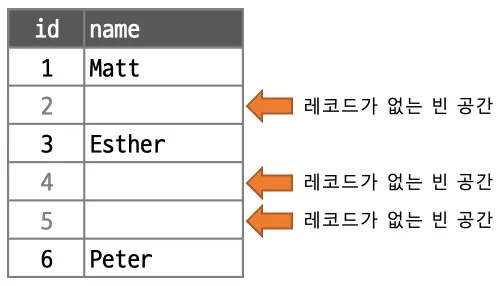

[트랜잭션 ACID](#트랜잭션-acid)

[격리 수준 (Read Uncommitted, Read Committed, Repeatable Read, Serializable)](#격리-수준-read-uncommitted-read-committed-repeatable-read-serializable)

[InnoDB의 트랜잭션 처리](#inno-db의-트랜랙션-처리)

[MVCC (Multi-Version Concurrency Control)](#mvcc)

[InnoDB의 잠금 장치](#innodb의-잠금-메커니즘)


## 트랜잭션 ACID

관계형 데이터베이스라면 ACID를 준수하여 데이터의 신뢰성, 일관성, 무결성을 보장해야 한다

ACID는 Atomicity(원자성), Consistency(일관성), Isolation(격리성), Durability(영속성)의 약자로 각각의 의미는 다음과 같다

**Atomicity (원자성): 트랜잭션은 전부 성공하거나 전부 실패해야 한다**

트랜잭션 내 모든 작업은 논리적으로 하나의 단위로 취급하고 도중에 실패하면 모든 작업을 실패로 간주하여 이전 상태로 되돌려야 한다 (롤백)

모든 작업이 실패하지 않으면 성공한 것이며 이 때 커밋하여 결과를 데이터베이스에 저장한다

언두 로그를 통해 원자성을 구현한다

**Consistency (일관성): 트랜잭션 수행 전후로 DB 제약조건과 규칙이 항상 유지되어야 한다**

외래 키 조건, 제약조건(CHECK), UNIQUE, NOT NULL, 도메인 조건 등은 항상 만족되어야 한다

**Isolation (격리성): 동시에 실행되는 트랜잭션 간에 서로 간섭하지 않고 독립적으로 동작해야 한다**

여러 트랜잭션이 동시에 실행되더라도 결과는 순차적으로 실행한 것과 같아야 한다

시스템 요구사항에 따라 데이터베이스 격리 수준을 선택할 수 있다

잠금, 다중 버전(MVCC), 격리 수준 등을 통해 트랜잭션 간의 간섭을 최소화한다

**Durability (영속성): 커밋된 트랜잭션은 시스템 장애가 발생하더라도 영구히 반영되어야 한다**

커밋이 완료되면 데이터베이스가 동작하는 시스템이 전원이 꺼지거나 장애 발생에도 데이터는 보존되어야 한다

리두 로그, WAL (Write-Ahead Logging) 등으로 영속성을 구현한다


## 격리 수준 (Read Uncommitted, Read Committed, Repeatable Read, Serializable)

트랜잭션 격리 수준은 여러 트랜잭션이 동시에 실행될 때 서로 간섭하지 않고 독립성을 얼마나 보장할지 결정하는 기준으로 트랜잭션의 Isolation(격리성)을 정의한다

격리 수준이 높아질수록 데이터의 정확성은 높아지지만 성능과 병렬성이 떨어지게 된다. 반대로 격리 수준이 낮아지면 성능은 향상되지만 데이터의 정확성이 떨어질 수 있다

ANSI/SQL 기준 4가지 트랜잭션 격리 수준은 다음과 같다

**READ UNCOMMITTED**: 커밋되지 않은 다른 트랜잭션의 데이터를 읽을 수 있다 (부작용: 더티 리드, 반복 불가 읽기, 팬텀 리드)

**READ COMMITTED**: 커밋된 데이터만 읽을 수 있다 (부작용: 반복 불가 읽기, 팬텀 리드)

**REPEATABLE READ** (InnoDB): 동일 트랜잭션 내에서는 같은 행을 여러 번 읽어도 항상 같은 값을 반환한다 (부작용: 팬텀 리드)

**SERIALIZABLE**: 모든 트랜잭션이 순차적으로 실행되는 것처럼 동작한다 (모든 부작용 방지)

격리 수준별로 SELECT 쿼리에서 발생할 수 있는 부작용은 다음과 같다

**더티 리드**: 커밋하기 전의 A 트랜잭션 변경사항이 B 트랜잭션에서 읽히는 현상 (A 트랜잭션에서 롤백하면 B 트랜잭션은 잘못된 데이터를 읽게 된다)

**반복 불가 읽기**: 같은 트랜잭션 내에서 같은 조건의 SELECT 쿼리를 두 번 수행했을 때 결과가 다르게 나오는 현상 (기존 행의 값이 바뀜 - 다른 트랜잭션의 UPDATE 또는 DELETE 원인)

**팬텀 리드**: `SELECT ... WHERE` 쿼리에서 다른 트랜잭션으로 인해 조건에 맞는 행이 추가되거나 삭제되어 결과가 달라지는 현상 (조건에 해당하는 행의 수가 바뀜 - 다른 트랜잭션의 INSERT 또는 DELETE 원인)

더티 리드 방지: READ COMMITTED 이상

반복 불가 읽기 방지: REPEATABLE READ 이상

팬텀 리드 방지: SERIALIZABLE 이상

MySQL InnoDB는 **REPEATABLE READ**를 기본 격리 수준으로 사용하여 더티 리드와 반복 불가 읽기를 방지하고, **갭 락(Gap Lock)** 과 **넥스트 키 락(Next Key Lock)** 을 사용하여 팬텀 리드를 방지한다

```sql
-- 반복 불가 읽기 예시
-- READ-COMMITTED 격리 수준에서 발생할 수 있는 현상
-- REPEATABLE READ 이상에서는 발생하지 않는다

-- T1, products(id: 1, price: 100) 조회
START TRANSACTION;
SELECT price FROM products WHERE id = 1;

-- T2 , products(id: 1, price: 200) 업데이트 후 커밋
START TRANSACTION;
UPDATE products SET price = 200 WHERE id = 1;
COMMIT;

-- T1, products(id: 1, price: 200) (반복 불가 읽기 발생)
SELECT price FROM products WHERE id = 1;
COMMIT;
```


## Inno DB의 트랜랙션 처리

InnoDB가 ACID를 준수하기 위해 사용하는 구성 요소

**언두 로그**: 기존 작업을 취소하고 원래 상태로 되돌아가게 해준다 (원자성, 격리성, MVCC용)

**리두 로그**: 시스템 장애 발생 시 데이터 복구용 (영속성)

**버퍼 풀**: 디스크 I/O를 줄이기 위한 메모리 캐시 (데이터 페이지, 언두 로그 페이지)

**이중 쓰기 버퍼**: 디스크 I/O 작업 장애 발생 시 데이터 복구용

**변경 버퍼**: 보조 인덱스 임시 저장 영역

**플러시 스레드/백그라운드 스레드**: 비동기 I/O 작업 처리

이러한 구성 요소를 이용하여 InnoDB는 트랜잭션 시작부터 데이터 변경, 커밋까지 다음과 같은 흐름으로 트랜잭션을 처리한다

### 트랜잭션 커밋 처리

```text
[ 트랜잭션 시작, START TRANSACTION ]
               ↓
[ 데이터 변경, INSERT/UPDATE/DELETE ]
               ↓
[ 언두 로그 생성 (변경 전 데이터) ]
               ↓
[ 리두 로그 버퍼에 변경 내용 기록 ]
               ↓
         [ 커밋, COMMIT ]
               ↓
      [ 리두 로그 디스크 기록 ]
               ↓
    [ 더티 페이지 비동기 플러시 ]
               ↓
        [ 언두 로그 정리 ]
```

트랜잭션 시작: 트랜잭션 객체(trx_t) 생성, 트랜잭션 ID 부여, 언두 로그 공간 확보, MVCC Read View 생성

쿼리 수행(DML): 버퍼 풀에서 해당 페이지 조회(없으면 디스크 I/O 발생), 페이지 내 레코드 수정 및 언두 로그에 변경 상태 전 기록, 수정된 페이지는 더티 페이지로 표시 (디스크 I/O 발생 X)

언두 로그 기록: 각 레코드 변경에 대한 언두 로그 생성, 언두 로그도 버퍼 풀에 올라와 있다가 별도의 언두 테이블스페이스에 기록된다

리두 로그 기록: 변경 내용 리두 로그 버퍼에 저장, innodb_flush_log_at_trx_commit 설정에 따라 커밋 시 디스크 플러시 타이밍 결정

트랜잭션 커밋: 리두 로그 버퍼 내용을 로그 파일에 플러시 (이제 트랜잭션은 Durable 상태가 되어 장애가 발생하더라도 데이터 복구 가능)

변경 사항 디스크 반영 (비동기): 버퍼 풀에 있는 더티 페이지는 비동기적으로 플러시된다 (플러시 되기 전 이중 쓰기 버퍼에 기록됨) 이 과정은 트랜잭션 커밋과는 독립적으로 진행된다

언두 로그 정리 (트랜잭션 종료 후): 커밋된 언두 로그는 정리되지만 다른 트랜잭션이 Read View를 사용하고 있다면 삭제 지연 (MVCC) 

### 트랜잭션 롤백 처리

```text
[ 트랜잭션 시작, START TRANSACTION ]
               ↓
[ 데이터 변경, INSERT/UPDATE/DELETE ]
               ↓
[ 언두 로그 생성 (변경 전 데이터) ]
               ↓
[ 사용자 롤백 호출, ROLLBACK ]
               ↓
[ 언두 로그 기반 변경 사항 복원 ]
               ↓
        [ 언두 로그 정리 ]
               ↓
[ 트랜잭션 종료, 디스크 영향 없음]
```

트랜잭션 시작: 트랜잭션 객체(trx_t) 생성, 트랜잭션 ID 부여, 언두 로그 공간 확보, MVCC Read View 생성

쿼리 수행(DML): 버퍼 풀에서 해당 페이지 조회(없으면 디스크 I/O 발생), 페이지 내 레코드 수정 및 언두 로그에 변경 상태 전 기록, 수정된 페이지는 더티 페이지로 표시 (디스크 I/O 발생 X)

언두 로그 기록: 각 레코드 변경에 대한 언두 로그 생성, 언두 로그도 버퍼 풀에 올라와 있다가 별도의 언두 테이블스페이스에 기록된다

사용자 롤백 호출

언두 로그 기반 변경 사항 복원: 변경된 레코드의 내용을 이전 상태로 되돌린다 (버퍼 풀의 더티 페이지도 원래 상태로 복구됨)

언두 로그 정리: 롤백 후 다른 트랜잭션의 참조 여부에 따라 즉시 또는 지연 정리

트랜잭션 커밋과 달리 실제 디스크에 쓰이지 않기 때문에 리두 로드, 이중 쓰기 버퍼 등이 사용되지 않으며 데이터 손상도 발생하지 않는다

리두 로그가 없으므로 복구 대상에도 포함되지 않는다

다만 언두 로그를 통해 변경 사항을 기존 상태로 되돌려야 하므로 CPU, 메모리 자원 소모가 발생한다


## MVCC (Multi-Version Concurrency Control)

MVCC는 같은 데이터를 여러 트랜잭션이 동시에 읽고 쓰는 상황에서 **잠금없이 일관성을 유지할 수 있는 동시성 제어 기법**이다

InnoDB는 트랜잭션 격리성과 성능을 보장하기 위해 다음의 요소를 사용한 **언두 로그 기반 MVCC**를 구현한다
- **언두 로그**: 이전 버전의 레코드를 저장하는 공간 (버전 관리)
- **트랜잭션 ID**: 트랜잭션 시작 시 각 트랜잭션에 부여된 고유한 식별자
- **Read View**: 어떤 버전을 볼 수 있는지 결정하는 필터 역할
- **DB 레코드 메타데이터**: DB_TRX_ID, DB_ROLL_PTR, DB_ROW_ID 등 시스템 컬럼 포함

모든 레코드는 메타데이터를 포함하며, 이 메타정보를 이용해 InnoDB는 해당 레코드의 과거 버전 스냅샷을 참조할 수 있게 된다
- DB_TRX_ID: 레코드를 생성/수정한 트랜잭션 ID
- DB_ROLL_PTR: 언두 로그 포인터 (과거 버전의 레코드 위치)
- DB_ROW_ID: 내부적으로 사용하는 숨은 ID (해당 레코드가 기본 키를 가지지 않은 경우 사용)

트랜잭션이 시작되면 InnoDB는 활성화된 트랜잭션 목록을 기준으로 Read View를 생성하여 현재 트랜잭션이 볼 수 있는 레코드 버전을 결정한다

즉, 각 트랜잭션은 트랜잭션 시작 시 데이터의 스냅샷을 볼 수 있게 된다 -> 일관된 데이터를 읽기 락 없이 읽을 수 있게 된다

현재 트랜잭션에서 레코드 읽기 요청이 들어오면 다음 조건에 따라 볼 수 있는 버전인지 판단한다 (REPEATABLE READ 기준)
- 레코드의 DB_TRX_ID가 현재 트랜잭션 ID와 같으면, 현재 트랜잭션이 작성한 레코드이므로 읽을 수 있다
- DB_TRX_ID가 Read View보다 먼저 커밋된 트랜잭션이면 읽을 수 있다
- DB_TRX_ID가 아직 커밋되지 않은 트랜잭션이라면 Undo 로그로 돌아가서 이전 버전을 확인한다

만약 레코드를 수정하거나 삭제한다면 기존 레코드는 언두 로그에 기록하고 새로운 레코드에는 새로운 DB_TRX_ID 값을 할당한다
-> 과거 버전과 현재 버전이 공존하며 락을 사용하지 않고도 읽기와 쓰기가 분리된 시점에서 동작하게 된다

READ COMMITTED 수준은 Read View를 매번 새로 생성하여 커밋된 최신 버전만 읽을 수 있도록 한다

반면 REPEATABLE READ 수준은 트랜잭션 시작 시점에만 Read View를 생성하여 해당 트랜잭션이 시작된 시점의 스냅샷을 유지하여 동일한 레코드를 반복적으로 읽을 수 있도록 한다

### MVCC 한계와 주의사항

MVCC는 언두 로그에 기반하여 과거 버전을 관리하여 읽기와 관련된 동시성 제어를 수행한다

이 때 다른 트랜잭션이 오래 살아있는 동안에는 현재 트랜잭션이 참조할 수 있는 언두 로그는 삭제되지 못한다

**길게 유지되는 트랜잭션(Long-Running Transaction)과 대량 DML 작업은 언두 로그를 계속 쌓이게 하고 purge를 지연시켜 메모리와 디스크 자원을 고갈시킨다**

즉, purge 스레드가 언두 로그를 삭제하려 해도 참조 중이면 계속 보존해야 하고, 대량 UPDATE/DELETE 작업이 발생하면 언두 테이블스페이스가 비대화해진다 -> purge 지연으로 읽기 성능 하락, I/O 증가, 버퍼풀 오염 등의 문제가 추가적으로 발생한다

```mysql
-- T1 (대량 조회, 오래 살아있는 트랜잭션)
START TRANSACTION;
SELECT * FROM orders;

-- 동시에 T2가 수천만 건 DELETE
-- T1이 끝나기 전까지 T2의 언두 로그는 모두 보존되어야 하므로 purge 스레드는 대기하게 된다
DELETE FROM orders WHERE created_at < '2025-07-02';
COMMIT;
```

이러한 문제를 해결하기 위해서는 쿼리 타임아웃을 설정하여 트랜잭션이 너무 오래 유지되지 않도록 하고, 대량 DML을 배치로 나누어 처리하여 비교적 작은 단위로 작업을 수행하는 것이 좋다

`SHOW ENGINE INNODB STATUS` 명령어에서 history list length로 언두 로그의 길이를 확인할 수 있다

또 다른 한계로는 **보조 인덱스에는 MVCC 정보를 갖지 않는다**

이는 인덱스의 구조적 차이로 인해 보조 인덱스의 리프 노드는 인덱스 키와 PK만을 포함하기 때문에 MVCC 메타 정보를 포함할 수 없다

따라서 보조 인덱스만으로 레코드의 버전 유효성을 판단할 수 없어 테이블 룩업 과정을 수행하고 언두 로그를 참조하여 현재 버전을 확인해야 한다

**MVCC는 읽기 일관성 보장에는 유리하지만 쓰기 충돌 상황에서는 락 또는 충돌 감지를 통해 해결해야 한다**

```mysql
-- 트랜잭션 T1
START TRANSACTION;
UPDATE users SET name = 'hansanhha' WHERE id = 1;

-- 트랜잭션 T2 (동시에)
START TRANSACTION;
UPDATE users SET name = 'updated' WHERE id = 1;
```

두 트랜잭션은 동시에 읽을 수 있지만 T1이 먼저 레코드를 수정하면 InnoDB는 T2를 대기 처리하거나 데드락이 발생한다 -> 쓰기(삽입, 수정, 삭제)에는 락을 사용하여 동시성 제어를 수행해야 한다


## InnoDB의 잠금 장치

InnoDB는 데이터 일관성/신뢰성을 보장하고 팬텀 리드 및 데드락 방지, 동시성 제어를 위해 다양한 잠금 메커니즘을 사용한다

아래의 이미지는 데이터베이스 락의 9가지 유형을 개략적으로 설명한다 [출처](https://bytebytego.com/guides/what-are-the-differences-among-database-locks/)


InnoDB가 이용하는 잠금 장치
- 공유 락(Shared Lock)
- 배타 락(Exclusive Lock)
- 레코드 락(Record Lock)
- 갭 락(Gap Lock)
- 넥스트 키 락(Next Key Lock)
- 의도적 잠금(Intention Lock)
- 자동 증가 락(Auto-INC Lock)

### 공유 락(Shared Lock, S Lock)과 배타 락(Exclusive Lock, X Lock)

데이터베이스 락은 여러 트랜잭션이 동시에 동일한 데이터에 접근하려고 할 때 데이터의 무결성을 유지하고 잘못된 결과(데이터 불일치)가 발생하는 것을 방지하기 위해 사용된다

락은 특정 데이터 리소스 (테이블, 행, 페이지)에 대한 접근을 제어하여 트랜잭션 ACID 속성을 준수한다

**공유 락**은 읽기 잠금의 성격으로  **다른 트랜잭션이 해당 데이터를 읽는 것을 허용하지만 수정하거나 삭제하는 것은 방지한다**

여러 트랜잭션이 동시에 동일한 데이터에 대해 공유 락을 걸고 읽을 수 있으나 ("공유"라는 이름이 붙은 이유) 배타 락은 걸 수 없다 

```mysql
SELECT * FROM users WHERE id = 1 LOCK IN SHARE MODE;
SELECT * FROM users WHERE id = 1 FOR SHARE;
```

REPEATABLE READ 격리 수준에서는 MVCC를 사용하여 대부분 공유 락을 사용하지 않지만 특정 상황에서 필요할 수 있다
- 특정 데이터를 읽는 동안 다른 트랜잭션이 해당 데이터를 변경하는 것을 막아서 현재 읽고 있는 데이터의 스냅샷을 유지해야 할 때
- 재고를 확인한 후 주문을 처리하는 과정에서 재고 확인 시점에 S Lock을 걸어 다른 트랜잭션이 재고를 변경하지 못하도록 할 수 있다

**배타 락**은 쓰기 잠금의 성격으로 **다른 트랜잭션이 해당 데이터를 읽거나 수정하거나 삭제하는 것을 모두 방지한다**

배타 락이 걸린 데이터에는 다른 트랜잭션이 공유 락과 또 다른 배타 락을 걸 수 없다

INSERT, UPDATE, DELETE 문은 기본적으로 해당 행에 X Lock을 건다

```mysql
-- 특정 행에 배타 락을 건다
SELECT * FROM users WHERE id = 1 FOR UPDATE;

-- 테이블 전체에 배타 락을 건다
LOCK TABLES users WRITE;
```

### 읽기 락(Read Lock)


### 레코드 락 (Record Lock)

레코드 락은 특정 레코드에 대한 잠금으로 다른 트랜잭션이 해당 레코드를 동시에 수정하지 못하도록 한다

클러스터형 인덱스 또는 보조 인덱스의 레코드 단위에 적용될 수 있는데, 기본 키가 없는 경우 MySQL은 내부적으로 숨은 ID(ROW_ID)를 사용하므로 이를 기반하여 레코드 락을 적용한다

그리고 보조 인덱스에 레코드 락을 거는 경우 해당 인덱스 엔트리만 적용되며 기본 키의 엔트리에 락이 걸리지 않는다. 다만 수정/삭제를 하는 작업에서 보조 인덱스 이후 레코드를 찾아간다면 해당 레코드에도 락이 걸린다

레코드 락은 INSERT, UPDATE, DELETE 작업에서 자동으로 적용된다

```mysql
-- 기본 키 100에 대한 인덱스에서 레코드를 찾고, 레코드 락을 획득한다
-- 다른 트랜잭션이 해당 레코드를 수정하려고 하면 대기하거나 데드락이 발생한다
UPDATE users SET name WHERE id = 100;

-- 기본 키 100에 대한 X(Exclusive) 락을 획득한다
-- 다른 트랜잭션의 수정과 삭제를 차단한다
SELECT * FROM users WHERE id = 100 FOR UPDATE;
```

### 갭 락 (Gap Lock)

갭 락은 InnoDB의 트랜잭션 동시성 제어와 데이터 무결성을 보장하기 위해 특정 레코드가 아닌 레코드와 레코드 사이의 간격(Gap)에 걸리는 잠금이다

특정 간격에 락을 잠금으로써 삽입을 제한하여 REPEATABLE READ 격리 수준에서 팬텀 리드를 방지할 수 있다 (READ COMMITTED는 갭 락을 사용하지 않음)



[이미지 출처](https://medium.com/daangn/mysql-gap-lock-다시보기-7f47ea3f68bc)

```mysql
-- T1 트랜잭션이 특정 범위의 레코드를 조회한다
SELECT COUNT(*) FROM orders WHERE amount > 10000 AND amount > 50000;

-- T2 트랜잭션이 해당 범위에 새로운 레코드를 삽입한다
INSERT INTO orders (amount) VALUES (20000);
INSERT INTO orders (amount) VALUES (30000);
INSERT INTO orders (amount) VALUES (40000);

-- T1 트랜잭션이 다시 조회하면 이전 조회 결과와 다른 결과가 나온다 (팬텀 리드 발생)
SELECT COUNT(*) FROM orders WHERE amount > 10000 AND amount > 50000;
```

```mysql
-- T1 트랜잭션이 갭 락을 걸어 해당 범위에 대한 삽입을 막는다
SELECT COUNT(*) FROM orders WHERE amount > 10000 AND amount > 50000 FOR UPDATE;

-- T2 트랜잭션이 해당 범위에 새로운 레코드를 삽입을 시도한다
-- T1의 갭 락으로 인해 T2는 대기 상태가 된다
INSERT INTO orders (amount) VALUES (20000);

-- T1 트랜잭션이 다시 조회해도 이전과 동일한 결과가 나온다 (팬텀 리드 방지)
SELECT COUNT(*) FROM orders WHERE amount > 10000 AND amount > 50000 FOR UPDATE;
```

갭 락은 인덱스와 함께 동작한다. InnoDB는 락을 걸 때 인덱스를 사용하여 레코드를 찾고 이 인덱스 레코드 사이의 간격에 락을 건다

이 간격은 두 인덱스 레코드 사이의 간격, 첫 번째 인덱스 레코드 이전의 간격, 마지막 인덱스 레코드 이후의 간격이 될 수 있다

**갭 락이 발생할 수 있는 경우**

```mysql
-- 범위 조건과 FOR UPDATE를 사용한 경우
-- 해당 범위에 대한 갭 락이 걸리며 다른 트랜잭션은 해당 범위에 삽입할 수 없다
SELECT *
FROM products
WHERE price BETWEEN 1000 AND 2000
FOR UPDATE;


-- UPDATE, DELETE 쿼리에서 범위 조건을 사용한 경우
-- 변경/삭제되는 레코드 뿐만 아니라 그 레코드들이 속한 간격에 갭 락이 걸린다
DELETE FROM products WHERE price > 500;
```

#### 갭 락 주의점

갭 락은 레코드가 아닌 간격을 잠그기 때문에 실제로는 아무 데이터도 없는 영역까지 잠구게 되어 잠금 경합(Lock Contention)이 발생하거나 동시성이 저하될 수 있다

여러 트랜잭션이 서로 다른 간격을 잠그려다가 서로가 필요로 하는 간격을 이미 잠그고 있는 경우 데드락이 발생할 수 있다

갭 락은 인덱스 존재 여부, 쿼리 형태, 데이터 분포 등 여러 요인에 따라 동적으로 발생하므로 정확히 어떤 간격이 잠길지 예측하기 어렵다

특정 쿼리에서 팬텀 리드가 발생할 가능성이 없음에도 불구하고 갭 락이 설정되어 성능 저하를 야기할 수 있다

WHERE 절에서 인덱스를 효율적으로 사용하지 못하는 경우 풀 테이블 스캔이 걸리고, 테이블 전체에 갭 락이 걸려 심각한 동시성 문제가 발생할 수 있다

```mysql
-- 가격이 1000원 이상인 products를 조회한다
-- price 컬럼은 인덱스가 없으므로 풀 테이블 스캔과 테이블 전체 갭 락이 걸린다
SELECT * FROM products WHERE price > 1000 FOR UPDATE;

-- 기본 키에 대한 레코드 락만 걸고 갭 락을 걸지 않는다
SELECT * FROM products WHERE id = 1 FOR UPDATE;
```

### 넥스트 키 락 (Next Key Lock)

넥스트 키 락은 레코드 락과 갭 락을 결합한 형태로 REPEATABLE READ 수준에서 팬텀 리드를 방지하기 위해 사용된다

특정 인덱스 레코드와 그 바로 다음 인덱스 레코드 사이의 간격을 동시에 잠그는 방식이다

즉, InnoDB는 인덱스를 검색하거나 스캔할 때 발견하는 인덱스 레코드에 대해 Shared 또는 Exclusive 락을 걸고, 해당 레코드 바로 옆에 있는 간격에도 갭 락을 건다

갭 락처럼 팬텀 리드를 방지하기 위한 장치로 데이터의 일관성을 높이나 동시성을 떨어뜨리고 데드락 가능성을 높이는 단점이 있다

따라서 동시성이 중요한 애플리케이션에서는 READ COMMITTED 격리 수준을 사용하여 넥스트 키 락을 비활성화하는 것을 고려할 수 있다

```mysql
INSERT INTO products (id, price) VALUES (10, 1000);
INSERT INTO products (id, price) VALUES (20, 1000);
INSERT INTO products (id, price) VALUES (30, 1000);

-- id 인덱스를 스캔하여 15보다 크고 25보다 작은 레코드를 조회한다
-- 실제 조회되는 id=20인 레코드에 레코드 락을 건다
-- id=20인 레코드와 그 앞의 id=10 레코드 사이의 간격에 갭 락을 건다 (10 < id < 20)
-- id=20인 레코드와 그 뒤의 id=30 레코드 사이의 간격에도 갭 락을 건다 (20 < id < 30)
SELECT * FROM products WHERE id > 15 AND id < 25 FOR UPDATE;
```

인덱스의 마지막 레코드 이후의 간격은 슈프리머 레코드(Supremum Record)라고 하는 가상의 레코드 간격까지 간주되어 락이 걸린다

-> 마지막 레코드 이후의 간격은 무한대까지 확장되어 갭 락이 걸린다

### 의도적 잠금 (Intention Lock)

의도적 잠금은 InnoDB 내부에서 사용되는 잠금 메커니즘으로 상위 레벨(테이블)에 락을 걸기 전에 하위 레벨(행)에 어떤 종류의 락이 걸려 있는지/걸릴 것인지를 알려주어 락 충돌을 방지하는 역할을 한다

다중 입자 잠금(Multi-Granularity Locking) 시스템의 핵심 구성 요소로 잠금 계층 구조에서 충돌을 효율적으로 감지하고 관리한다

데이터베이스는 크게 테이블 레벨 잠금과 행 레벨 잠금을 지원한다
- 테이블 레벨 락: 테이블 전체에 락을 걸어 동시성을 제한하지만 잠금 관리 오버헤드가 적다
- 행 레벨 락: 특정 행에만 락을 걸어 동시성을 높인다

어떤 트랜잭션이 테이블 레벨 락을 걸려고 하면 데이터베이스는 락 충돌을 방지하기 위해 해당 테이블의 모든 행에 다른 트랜잭션이 락을 걸어두었는지 일일이 확인해야 한다

만약 테이블에 수백만 개의 행이 있다면 이 확인 작업은 매우 비효율적이고 비싼 작업이 된다

의도적 잠금은 이러한 비효율성을 해결하는데, **테이블 레벨 잠금을 시도하기 전에 해당 테이블에 행 레벨 잠금이 걸려있다면 테이블에 설정된 의도적 잠금을 확인하여 빠르게 충돌을 감지할 수 있다**

의도적 잠금은 크게 두 가지 유형이 있다

**의도적 공유 잠금 (Intention Shared Lock, IS Lock)**
- 트랜잭션이 테이블의 행 레벨(하위 레벨)에 공유 락(S Lock)을 의향이 있거나 이미 걸었다는 것을 나타낸다
- 트랜잭션이 특정 행에 `SELECT ... LOCK IN SHARE MODE`를 사용하여 공유 잠금을 걸 때 해당 테이블에는 자동으로 `IS Lock`이 설정된다
- 테이블에 IS Lock이 걸려있어도 다른 트랜잭션은 해당 테이블의 다른 행에 IS Lock이나 IX Lock을 걸 수 있다
- 테이블에 S Lock이나 X Lock이 걸려있으면 IS Lock을 걸 수 없다

**의도적 배타적 잠금 (Intention Exclusive Lock, IX Lock)**
- 트랜잭션이 테이블의 행 레벨에 배타적 잠금(X Lock)을 걸 의향이 있거나 이미 걸었다는 것을 나타낸다
- 트랜잭션이 특정 행에 `SELECT ... FOR UPDATE`, `INSERT`, `UPDATE`, `DELETE` 등을 사용하여 배타적 잠금을 걸 때 해당 테이블에는 자동으로 `IX Lock`이 설정된다
- 테이블에 IX Lock이 걸려있어도 다른 트랜잭션은 해당 테이블의 다른 행에 IS Lock이나 IX Lock을 걸 수 있다
- 테이블에 S Lock이나 X Lock이 걸려있으면 IX Lock을 걸 수 없다

어떤 트랜잭션이 특정 테이블에 락을 걸려고 시도하면 InnoDB는 먼저 해당 테이블에 IS Lock 또는 IX Lock이 설정되어 있는지 확인한다

만약 걸려있다면 이는 테이블의 일부 행에 락이 있다는 것을 의미하므로 테이블 락을 바로 획득할 수 없고 대기하게 된다

아무런 의도적 잠금이 걸려있지 않다면 테이블 전체가 비어있다는 것을 의미하므로 테이블 락을 즉시 획득할 수 있다

행 레벨 락도 마찬가지로 락을 획득하기 전에 InnoDB가 테이블 락 잠금을 확인하여 충돌을 방지한다

### 자동 증가 락 (Auto-INC Lock)

자동 증가 락은 `AUTO_INCREMENT` 속성이 부여된 컬럼에 새로운 값을 할당할 때 사용되는 잠금이다

이 락은 **여러 트랜잭션이 동시에 INSERT 문을 실행할 때 AUTO_INCREMENT 값의 중복 할당을 방지하고 시퀀스(Sequence)의 연속성을 보장**하기 위해 사용된다

AUTO_INCREMENT 컬럼은 레코드가 삽입될 때마다 자동으로 1씩 증가하는 고유값을 생성하는데 여러 트랜잭션이 동시에 INSERT 작업을 수행하면 다음과 같은 문제가 발생할 수 있다

**값 중복 할당**: 동시성 제어가 제대로 되지 않으면 여러 트랜잭션이 같은 AUTO_INCREMENT 값을 가져갈 위험이 있다 (InnoDB는 기본 키의 유니크 제약조건을 통해 최종적으로 중복 삽입을 막지만 이 과정에서 오류와 비효율이 발생함)

**값 불연속성**: 벌크 삽입 시 다른 트랜잭션이 중간에 끼어들어 값을 할당받으면 시퀀스(연속적인 증가 값)가 끊어질 수 있다

자동 증가 락은 이러한 문제를 해결하기 위해 잠금 획득, 잠금 유지, 잠금 해제라는 세 가지 단계로 동작한다

**잠금 획득**: AUTO_INCREMENT 값을 필요로 하는 INSERT 문이 실행될 때 해당 테이블에 **AUTO-INC Lock**을 획득한다

**잠금 유지**: AUTO-INC Lock은 INSERT 문이 AUTO_INCREMENT 값을 할당하고 트랜잭션 내에서 모든 필요한 인덱스를 갱신할 때까지 유지된다

**잠금 해제**: **INSERT 문이 완료되면** 락이 해제되어 다른 트랜잭션이 AUTO_INCREMENT 값을 할당할 수 있게 된다

AUTO-INC Lock은 행 레벨이 아닌 테이블 레벨에서 작동되어 하나의 INSERT 문이 락을 획득하면 해당 테이블에 대한 다른 INSERT 문은 락이 해제될 때까지 대기해야 한다

다른 락처럼 트랜잭션이 종료될 때까지 유지되는 것과 달리, 자동 증가 락은 INSERT 문이 완료되면 즉시 해제된다 (동시성 목적)

자동 증가 락 덕분에 동시 INSERT 작업이 발생하더라도 값이 순차적으로 증가하고 중복 할당을 방지하여 비효율적인 유니크 제약조건 오류를 피할 수 있다 

**innodb_autoinc_lock_mode** 시스템 변수를 통해 자동 증가 락의 동작 방식을 제어할 수 있다

**0 (Traditional Lock Mode)**
- 가장 보수적인 모드로 모든 INSERT 문은 자동 증가 락을 획득하고 문장이 끝날 때까지 유지한다
- 엄격한 시퀀스 연속성을 보장하지만 테이블 레벨 잠금으로 인해 동시성이 가장 낮다

**1 (Consecutive Lock Mode)**
- 기본 값
- 단일 INSERT 문은 자동 증가 락을 사용하지 않는다 (락 없이 높은 동시성 확보)
- 여러 행 INSERT 문의 경우 자동 증가 락을 사용하여 시퀀스 연속성을 보장한다

**2 (Interleaved Lock Mode)**
- 가장 동시성이 높은 모드
- 모든 INSERT 문은 자동 증가 락을 사용하지 않고 AUTO_INCREMENT 값을 자체적으로 할당한다
- 시퀀스 연속성을 보장되지 않고 벌크 삽입 도중 다른 트랜잭션이 끼어들 수 있어 값이 뒤섞이거나 중간에 비어버릴 수 있다


## InnoDB의 데드락 처리


