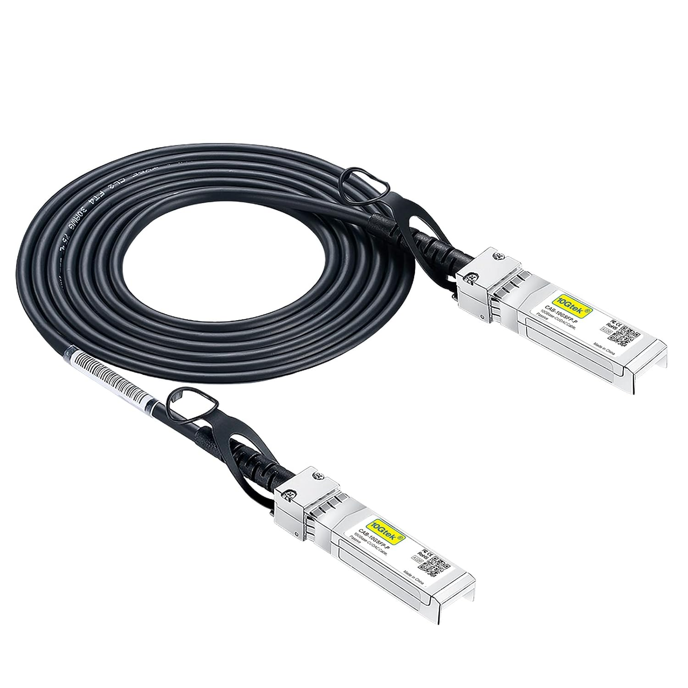
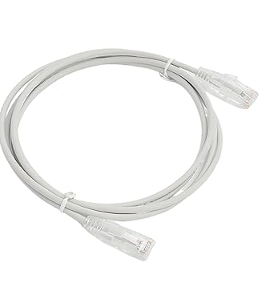
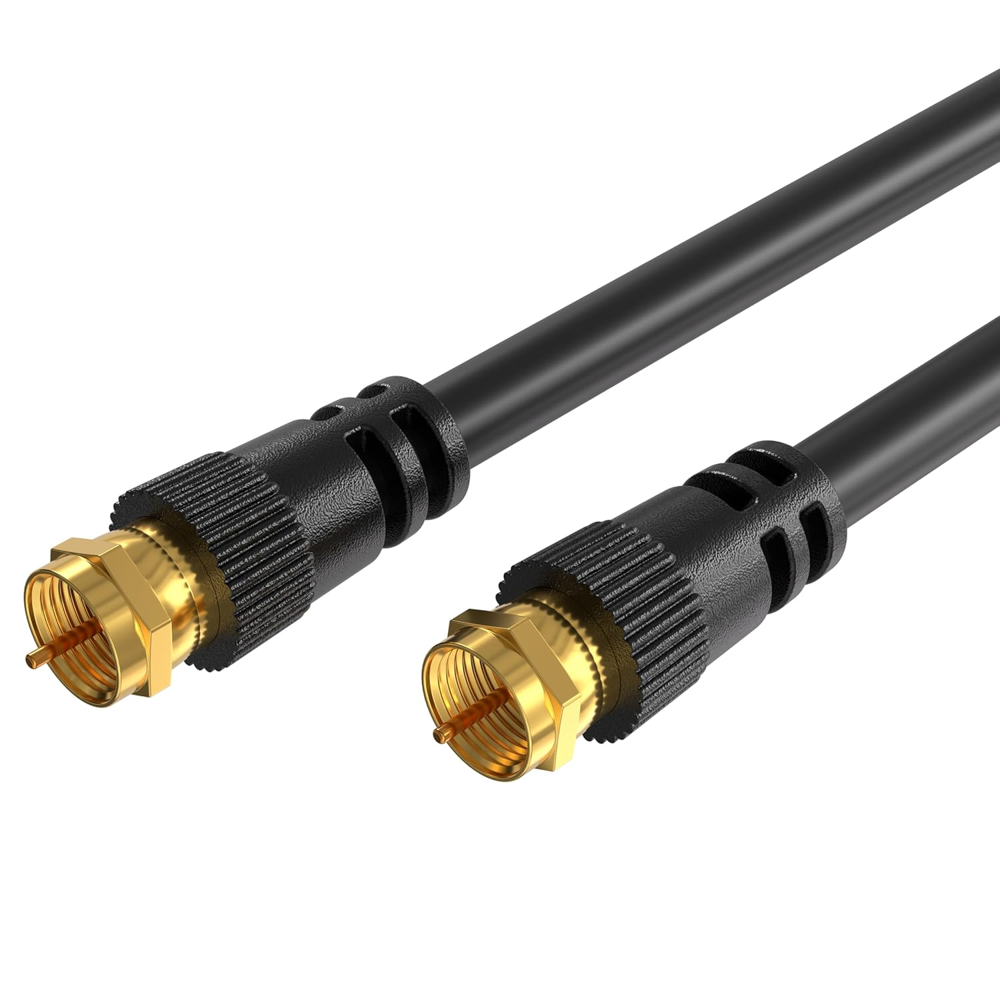
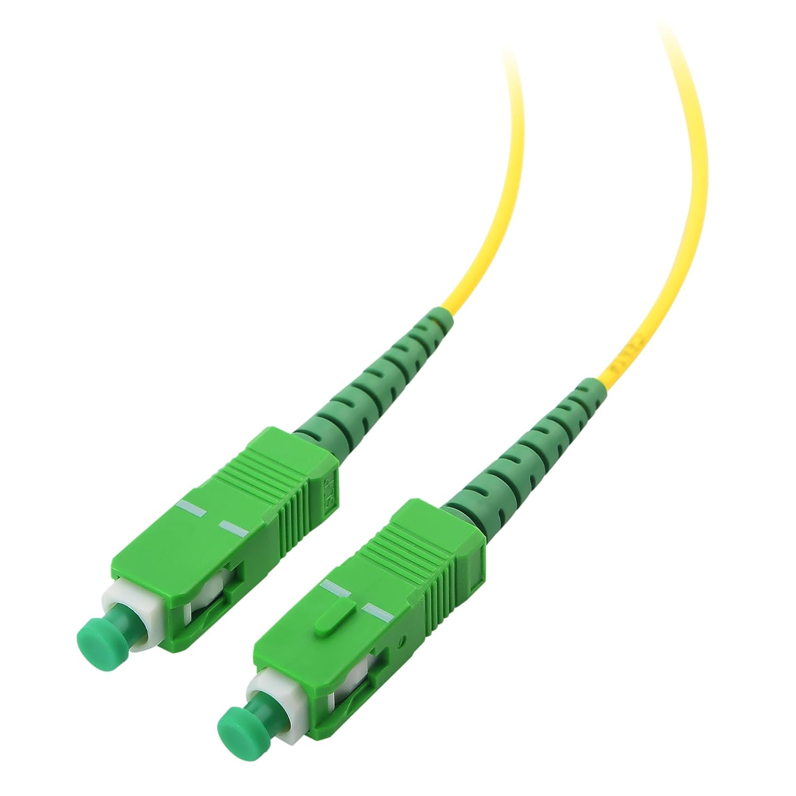
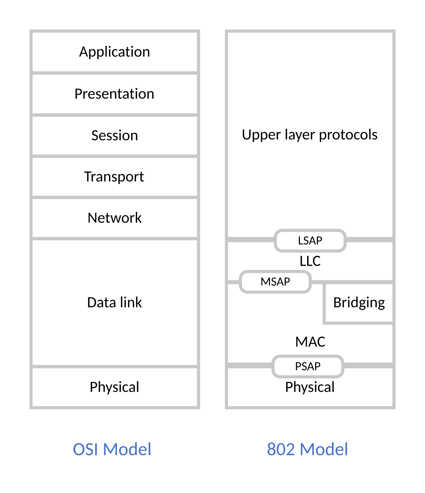
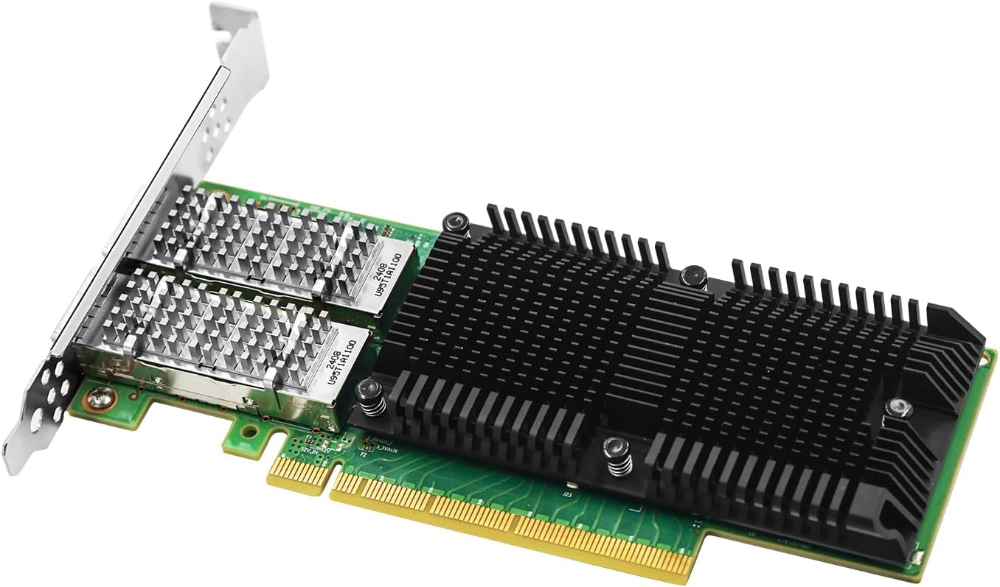
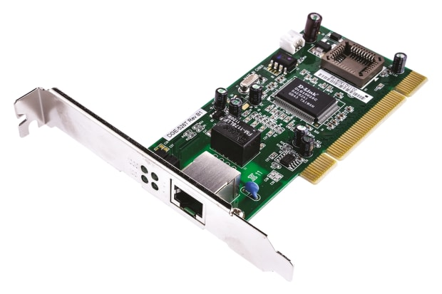
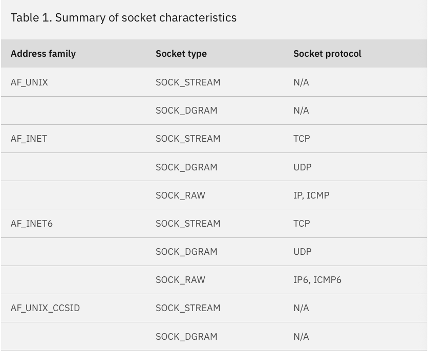

#### 인덱스
- [OSI 7 계층별 컴포넌트](#osi-7-계층별-컴포넌트)
- [인터넷](#인터넷)
- [bps](#bps)
- [전송 매체](#전송-매체)
- [주파수, 대역폭](#주파수-대역폭)
- [IEEE 802](#ieee-802)
- [이더넷(Ethernet) IEEE 802.3](#이더넷ethernet-ieee-8023)
- [Wi-Fi IEEE 802.11](#wi-fi-ieee-80211)
- [NIC](#nic)
- [Socket](#socket)
- [TCP](#tcp)
- [가상 네트워크](#가상-네트워크)
- [명령어](#명령어)
- [에코 서버 만들기]()
- [참고 문서 및 이미지 출처](#참고-문서-및-이미지-출처)


## OSI 7 계층별 컴포넌트

### L7~L5(응용/표현/세션)

운영체제 커널 관여 X -> 주체: 애플리케이션 또는 라이브러리

브라우저, cURL, 스프링 부트, DB 드라이버, HTTP 클라이언트 라이브러리, TLS 라이브러리 등

애플리케이션(유저 공간)에서 네트워크 라이브러리/런타임을 통해 간접적으로 HTTP 헤더 등을 만들고 `send()`나 `write()` 시스템 콜 호출한다

### L4(전송: TCP/UDP)

주체: 운영체제 커널(TCP/UDP 스택)

커널의 TCP 스택이 데이터 스트림에서 받은 데이터를 분할한 뒤 TCP 헤더를 붙여서 TCP 세그먼트를 생성한다

이외에도 헤더 설정(Seq, Ack, Window Size 등), ACK 타이머 설정, 체크섬 계산, 포트 번호 관리, 흐름 제어, 혼잡 제어, 재전송 처리 등을 수행한다

그 다음 IP 레이어로 내려보낸다

### L3(인터넷: IP)

주체: 운영체제 커널(IP 스택), 라우터

출발지 OS에서 수행하는 것들
- IP 헤더 생성
- 라우팅 테이블 조회
- 목적지가 같은 LAN인지 외부망인지 판단
- 게이트웨이 주소 탐색(ARP)
- 목적지 라우팅 결정

라우터가 수행하는 것들
- 패킷을 받아서 IP 헤더 확인
- 라우팅 테이블을 기반으로 다음 홉 결정
- TTL 감소
- 목적지로 패킷 전달

전송할 경로가 결정되었으면 L2 레어어로 패킷을 전달한다

### L2(데이터 링크: Ethernet/Wi-Fi)

주체: 커널(NIC 드라이버) + NIC 칩셋

NIC 드라이버가 수행하는 것들
- Ethernet 헤더 생성(출발지 MAC, 목적지 MAC, EtherType 등)
- VLAN 태그 삽입
- 프레임을 NIC 하드웨어에 전달

NIC 칩셋이 수행하는 것들
- 프레임을 버퍼에 저장
- DMA로 데이터를 직접 페치
- FCS 계산/검사
- 충돌 처리(CSMA/CD, CSMA/CA)

### L1(물리)

주체: NIC PHY 칩, 케이블/전파

디지털 신호를 아날로그 신호(전기, 빛, 전파)로 변환하는 것은 OS가 아닌 NIC의 PHY 칩이 담당한다

전기 신호 변환 - Ethernet

빛 신호 변환 - 광섬유

전파 신호 변환 - Wi-Fi

### 참고 사항

네트워크에서 패킷은 장비를 거칠 때마다 다음의 순서를 반복한다
- L1(NIC) 계층에서 신호 수신(전기/광/전파)
- 신호 -> 비트 스트림 변조 해제(demodulation: 변조된 반송파(Carrier Wave)를 원래의 정보 신호로 추출하는 과정)
- 해당 네트워크 장비가 필요한 계층까지만 디코딩(L2 또는 L3)
- 비즈니스 로직(스위칭/라우팅 등) 실행
- 다시 프레임 생성
- NIC에서 신호 변조 -> 다음 경로로 전송

이 때 장비마다 디코딩하는 계층이 다르다

스위치
- **L2(Ethernet/Wi-Fi 프레임)** 까지만 해석한다
- 목적지 MAC 주소 확인/MAC 주소 테이블 조회
- L2 프레임 재인코딩 후 NIC 전송

라우터
- **L3(IP 패킷)** 까지 디코딩한다
- 출발지/목적지 IP 확인, TTL 감소, 라우팅 테이블 기반 다음 홉 결정
- 새로운 목적지(다음 경로) MAC 주소를 가진 L2 프레임 재구성/재인코딩 후 NIC 전송

L3/L4 방화벽(IP, TCP/UDP)
- IP + TCP/UDP까지 해석한다
- 포트 번호 기반 필터링
- L5~L7은 제외되므로 HTTP/JSON은 해석할 수 없다

L7 방화벽(WAF, Proxy)
- L4~L7까지 디코딩한다
- HTTP/S 콘텐츠까지 해석하여 공격 패턴을 탐지한다 (OWASP, Open Web Application Security Project)

AP(무선 공유기, Wi-Fi 라우터)
- L1~L3까지 골고루 해석한다
- 무선 인터페이스: Wi-Fi 신호 변/복조, 802.11 MAC 프레임 처리
- 유선 인터페이스: Ethernet 스위칭, IP 라우팅


## 인터넷


[인터넷 개요](https://www.cs.utexas.edu/~mitra/csFall2019/cs329/lectures/webOverview.html)

인터넷은 네트워크 케이블 또는 위성 링크로 연결된 컴퓨터들의 컬렉션으로, 인터넷에 연결된 컴퓨터는 다른 컴퓨터와 통신하여 데이터를 주고받을 수 있다

컴퓨터가 다른 모든 컴퓨터와 연결하는 대신, 물리적인 규모 별로 그룹을 짓고 특정 노드에서 내부 네트워크 망을 관리하고 외부 인터넷 연결을 담당한다

일반적으로 **각 컴퓨터는 LAN(Local Network Area) 안에 이더넷 케이블이나 무선(와이파이)으로 연결**된다 (자체 스위치나 공유기로 네트워크 구축 가능)

LAN 안의 특정 노드(백본 스위치 등)가 물리적으로 외부 인터넷망의 서버(라우터)와 연결되어 LAN 안의 컴퓨터들이 인터넷을 통해 다른 컴퓨터와 통신할 수 있게 한다

**ISP(Internet Service Providers)**는 **인터넷 연결을 수행하는 통신사**로 인터넷 사용자가 정보(웹 페이지, 이메일 등)를 사용할 수 있도록 만든다

**WAN(Wide Area Network)**은 여러 건물, 도시, 국가 등 LAN보다 더 큰 범위의 네트워크 그룹을 말하며, 이들 간 데이터를 전송하려면 통신사에서 제공하는 회선을 이용해야 한다

이 때 회선 교환과 패킷 교환이라는 두 가지 방법이 있다

**회선 교환**은 통신을 시작할 때 송신-수신 사이에 **고정된 경로의 전용 물리 회선**을 먼저 설정하고 통신하는 동안 그 회선은 둘만 사용한다

다른 사람이 이 회선을 사용할 수 없으며 통신 종료 시 회선은 해제된다

성능이 보장되며 음성 통화와 같은 실시간 서비스에 유리하다

다만 회선이 전용이라 실제로 사용하고 있지 않아도 점유하기 때문에 낭비될 수 있고 확장성이 떨어진다

**구 전화망, 초창기 통신 시스템에서 사용**한다

**패킷 교환**은 현대의 인터넷에서 사용하는 모든 통신 방식으로 **데이터를 일정 크기의 "패킷"으로 나누고**, **각 패킷은 독립적으로 라우터를 통해 이동**하여 목적지로 도착함으로써 통신이 이뤄진다

패킷이 서로 다른 경로로 이동해도 무방하며 출발지에서 보낸 모든 패킷은 목적지에서 재조립한다

여러 사용자가 동일 회선을 공유할 수 있어 효율적이며 확장성이 높다

네트워크 장애가 발생해도 동적으로 우회 경로를 이용할 수 있다

다만 패킷이 유실되거나 순서 바뀜, 지연이 일정하지 않을 수 있다

실시간 통신(NTP, 음성, 영상)은 품질 관리(QoS, Quality of Service)가 필요하다

**모든 IP 네트워크에서 사용**한다

## bps

**bps(bits per second)**는 1초당 전송되는 비트의 수를 말한다

네트워크 통신 속도는 보통 bps(Kbps, Mbps, Gbps 등), 파일 크기/저장 공간 표기는 바이트 단위를 사용한다

따라서 **초당 바이트 전송 수(B/s)**는 bps/8을 해야 한다

-> `100Mbps % 8 = 12.5MB/s`

bps 속도는 물리 계층(전기/빛/전파, 대역폭, SNR)과 변조/부조화 방식, 프로토콜 오버헤드에 의해 결정된다
- 유선(이더넷): 물리 매체(케이블 유형, 광섬유), 신호 인코딩(1000BASE-T uses PAM-5 등), NIC/스위치 성능
- 무선(Wi-Fi, LTE, 5G): 대역폭, 변조(16/64/256QAM), MIMO, 환경 등
- 대역폭: 넓을수록 더 많은 데이터 전송 가능
- 프로토콜 오버헤드: 이더넷/IP/TCP/UDP 헤더, MAC 프레임, 암호화 오버헤드, ACK/재전송 비용 등

**단위**
- Kbps: 1,000 bps
- Mbps: 1,000,000 bps (10⁶)
- Gbps: 1,000,000,000 bps (10⁹)

100 Mbps: 최대 12.5 MB/s 다운로드 속도

1 Gbps: 최대 125 MB/s 다운로드 속도

10 Gbps: 최대 1.25 GB/s 다운로드 속도


## 전송 매체

전송 매체는 컴퓨터에서 컴퓨터로 데이터를 전달할 때, 즉 네트워크를 물리적인 방법으로 신호를 전달하는 매체를 말한다

크게 **유선(Wired)**과 **무선(Wireless, 전파)**로 나눌 수 있다

유선은 다시 **전기 신호(구리선)** 기반과 **광 신호(광섬유)** 기반으로 나뉜다

데이터 패킷은 이 신호들을 일정한 규칙(프로토콜)으로 인코딩한 것이다

**어떤 전송 매체를 사용하더라도 물리적 신호 형태만 다를 뿐, 그 위에서 움직이는 데이터는 모두 패킷 단위로 전송된다**

### 전기: 구리선(Copper)

전기 신호는 **구리선(UTP, 동축)**을 통해 전달된다
- UTP 케이블: LAN 케이블(Cat5e, Cat6, Cat6A)
- 동축 케이블: 케이블 TV, 일부 통신 장비

**특징**
- 전기 신호를 진폭/주기/위상 차이로 변조하여 데이터로 해석한다
- 다른 매체에 비해 저렴하고 설치가 쉽다
- 길이가 길어질수록 신호 감쇠(attenuation)가 발생하며 전자기 간섭(EMI)에 취약하다

**대역폭**
- Cat5e: 1Gbps
- Cat6: 1~10Gbps
- Cat6A: 10Gbps
- Cat7/8: 40~100Gbps

[10 기가비트 SFP 구리선](https://www.amazon.com/10G-SFP-DAC-Cable-SFP-H10GB-CU2M/dp/B00U8BL09Q?th=1)



[Cat6A UTP 구리선](https://www.amazon.com/Copper-Ethernet-Flexible-Dia3-8mm-Printer/dp/B0DJK6Z7PX?th=1)



[동축 케이블](https://www.amazon.com/Cables-Direct-Online-Extension-Satellite/dp/B08352NCDN?th=1)



### 빛: 광섬유(Fiber Optic)

빛은 광섬유 케이블을 통해 **레이저(장거리)** 또는 **LED(단거리)**로 쏴서 전달된다

특징
- 장거리 전송에 매우 강하다(수~수십 km)
- 전자기 간섭(EMI) 영향이 없다
- 대역폭이 매우 크다(10G, 40G, 100G, 400G)
- 가격과 설치 난이도가 상대적으로 높다

**광 타입**
- SMF(Single Mode Fiber): 레이저 광원, 장거리 전송용(수십 ~ 수백km)
- MMF(Multi-Mode Fiber): LED 광원, 단거리 전송용(최대 2km 이내)


[](https://www.amazon.com/Cable-Matters-Single-Simplex-Fiber/dp/B0CNLDVKSH?th=1)

### 무선: 전파(EM Wave, Radiowave)

무선 매체는 **전파를 공기 중에 방사**하여 **전파 스펙트럼을 할당받아 신호를 전송**한다

**특징**
- 이동성이 좋고 케이블이 필요하지 않다
- 전파 간섭이 발생할 수 있다
- 장치 간 간섭으로 인해 실제 처리량이 감소할 수 있다
- WPA3 등 네트워크 보안 설정이 중요하다

**Wi-Fi**
- 소규모 무선 네트워크
- AP(Access Point, 공유기)와 단말기(PC/노트북/스마트폰)가 직접 통신하는 방식
- 통신 범위: 10 ~ 40m
- 주파수 대역: 2.4GHz ~ 6GHz 
- 속도: 수백 Mbps ~ 수Gbps 
- 벽, 가전제품, 주변 AP 등 전파 간섭을 받으며 여러 사용자가 동시에 쓰면 속도가 느려진다

**LTE (4F)**
- 셀룰러 네트워크
- 이동통신사의 기지국(Cell Tower)이 제공하는 WAN, 주파수 자원을 여러 사용자에게 동적으로 나눈다
- 기지국-코어망-인터넷 구조
- 통신 범위: 전국/도시 단위 -> 이동성 제공
- 주파수 대역: 700MHz ~ 2.6GHz
- 속도: 50 ~ 100Mbps

**5G**
- 차세대 셀룰러 네트워크
- 주파수 대역: Sub-6GHz, mmWave
- 속도: 수백Mbps ~ 수Gbps
- 고속, 초저지연, 더 많은 사용자 수용 가능


## 주파수, 대역폭

**무선 신호가 패킷 정보를 전달하는 방법**

무선 신호는 전파의 진폭, 위상, 주파수 등을 변조하여 디지털 비트 0/1을 실어 나른다

```text
IP 패킷
-> 무선 프로토콜 프레임(802.11 등)에 패킷을 캡슐화한다
-> 이를 변조(QAM 등)하여 공기 중에 전파로 전달한다 (무선 신호 전송)
-> 수신된 전파를 복조한 뒤 IP 패킷으로 다시 추출한다
```

**주파수(Frequency)**는 전파가 1초 동안 몇 번 진동하는지를 의미한다

용어 정리
- 전파(Radiowave): 적외선보다 파장이 긴 전자기파, 무선 신호에서 패킷을 직접 운반하는 매체
- 파장: 파동이 퍼져나간 거리, 한 번의 주기가 가지는 길이 - 파장이 길수록 진동수는 더 낮다
- 파동: 물질 혹은 공간의 한 곳에서 시작된 진동이 퍼져나가는 현상
- 전자기파: 전기장과 자기장이 공간상으로 방사되는 파동, 광속(약 초속 3억m)

주파수 단위: Hz(헤르츠)
- 1Hz: 1초에 1번 진동
- 1kHz: 1초에 1,000번 진동
- 1MHz: 1초에 1,000,000번 진동
- 1GHz: 1초에 1,000,000,000번 진동

**주파수 대역**이란 "어느 중심의 주파수를 사용할 것인지", "어느 위치"에서 통신할 것인지를 결정한다

주파수가 달라지면 전파의 성질이 달라지게 되어 통신 특성이 완전히 달라진다

**주파수 대역**
- 낮은 주파수 대역(수백MHz ~ 1GHz): 속도가 낮은 대신 벽을 잘 통과하고 멀리 간다
- 중간 주파수 대역(2 ~ 6GHz): 균형잡힌 거리/속도, Wi-Fi, LTE, 5G Sub-6에서 사용
- 높은 주파수(24GHz ~ mmWave): 매우 빠르지만 장애물에 약하며 거리가 짧다

대역폭(Bandwidth)란 특정 주파수 대역 안에서 **"얼마만큼의 폭(Channel Width)"**을 통신에 사용할지를 의미한다

대역폭이 넓을수록 한 번에 더 많은 비트를 실을 수 있고 통신 속도가 증가한다

20, 40, 80, 160, 320MHz

### 주파수 관리 주체

주파수는 "공기 중에서 모두가 공유하는 한정된 자원"으로 같은 주파수를 여러 사용자가 동시에 사용하면 간섭때문에 통신 품질이 붕괴될 수 있다

-> LTE와 군 레이더가 같은 주파수를 쓰면 둘 중 하나가 멈추게 됨

일부 대역은 항공 레이더, 군 통신, 해양 구조 통신, 위성 항법(GPT), 응급 통신 등 국가 기반 서비스에서 이용된다

그리고 LTE/5G 등의 서비스를 위해 각 통신사에서 특정 주파수 대역을 경매로 사서 사용한다

개인이 임의로 허가되지 않은 출력으로 송출하거나 주파수를 사용하면 형사 처벌 대상이 된다

전파 발생 장치(송신기)를 만들고 임의 대역에서 송신하려면 전파 적합성 평가 국가 인증을 받아야 한다

또는 ISM(Industrial, Scientific, Medical) 비면허 대역이나 장난감, 리모컨, 사물인터넷 등 출력이 아주 낮으면 자유롭게 사용할 수 있다

Wi-Fi는 넓은 대역폭을 공용으로 쓰는 기술이고, LTE/5G는 좁은 대역을 국가 허가를 받고 안정적으로 쓰는 기술이다

### 무선 기술 별 주파수 대역과 대역폭

**Wi-Fi (IEEE 802.11)**
- 와이파이는 비면허 대역(ISM Band)을 사용하므로 누구나 장비만 있으면 쓸 수 있다
- 대신 출력 제한과 간섭이 많다

|종류|주파수 대역|대역폭|특징|
|---|---|--|---|
|Wi-Fi 4 (802.11n)|2.4GHz/5GHz|20, 40MHz|공용 대역, 간섭 많음|
|Wi-Fi 5 (802.11ac)|5GHz|20, 40, 80, 160MHz|간섭 적고 빠름|
|Wi-Fi 6/6E (802.11ax)|2.4GHz/5Ghz/6Ghz|20, 40, 80, 160MHz|고속, 저지연|
|Wi-Fi 7|2.4GHz/5GHz/6GHz|20, 40, 80, 160, 320MHz|초고속|

**LTE (Long Term Evolution, 4G)**

LTE는 1.4, 3, 5, 10, 15, 20MHZ 중 하나를 대역폭으로 사용한다

통신사는 20MHz 폭 하나를 구매하고 CA(Carrier Aggregation)로 2~5개 대역(20MHz + 20MHz + 10MHz 등)을 묶어 속도를 늘린다

|Band|대역|특징|
|---|----|---|
|B1|2100MHz|초기 3G|
|B3|1800MHz|LTE 주력|
|B5|850MHz|저주파, 커버리지 넓음|
|B7|2600MHz|고속, 근거리|
|B8|900MHz|실내 침투 우수|

**5G (NR, New Radio)**

5G는 LTE보다 훨씬 넓은 주파수 스펙트럼을 활용한다

크게 2가지 계층으로 나뉜다

Sub-6 (6GHz 이하): 20, 40, 50, 80, 100MHz 대역폭 사용

|대역|특징|
|---|---|
|3.5GHz|5G 주력, 속도/커버리지 균형|
|2.1Ghz|전국 커버리지 확대용, 도달거리 김|

mmWave (밀리미터파): 100, 200, 400, 800MHz 대역폭 사용

|대역|특징|
|---|---|
|28GHz|초고속, 도달거리 짧고 장애물에 취약|

## IEEE 802



IEEE 802는 개인 통신망(PAN), 근거리 통신망(LAN), 대도시 통신망(MAN)에 대한 일련의 표준이다

OSI 7 모델 중 **데이터 링크 계층**과 **물리 계층**에 대한 서비스/프로토콜을 정의한다

대표적으로 유선 LAN 표준인 이더넷(802.3)과 무선 LAN 표준인 Wi-Fi(802.11)가 있다


## 이더넷(Ethernet) IEEE 802.3

이더넷은 **유선 LAN(Local Area Network)의 기술 표준**으로 빛의 매질인 "Ether"의 이름에서 착안하여 보이지 않는 매질을 통해 데이터가 흐른다는 의미로 지어졌다

엔드 디바이스간 데이터 교환을 가능하게 한다 - 여기엔 컴퓨터 뿐만 아니라 프린터, 라우터, 서버 등 케이블을 통해 로컬 네트워크 통신을 하는 모든 장치가 포함된다

로컬 네트워크에 연결된 장치들은 각자 이더넷 프로토콜(IEEE 802.3)을 통해 커넥션을 맺고 다른 곳으로 데이터를 교환할 수 있게 한다

표준화
- **전송 매체 규칙**: 구리선, 광섬유, 동축(Coaxial) 등 어떤 케이블을 사용할 수 있는지 정의하고, 어떤 길이/품질에서 몇 Gbps를 안정적으로 낼 수 있는지
- **전기/광 신호 인코딩 방식**: 디지털 신호(0/1) <-> 전선/광선 변환 방법 정의
- **MAC 주소 기반의 프레임 구조(L2)**: 출발지/목적지 MAC, EtherType, payload, FCS(Frame Check Sequence)
- **속도 표준**: 10GBASE-T, 1000BASE-SX 등
- **동작 방식**: 허브 기반 CSMA/CD(충돌 방지), 스위치 기반 Full Duplex(충돌 없음)

### 이더넷 기술 및 용어

**CSMA/CD (Carrier Sense Multiple Access/Collision Detection)**

이더넷 같은 유선 네트워크에서 여러 장치가 하나의 통신 매체를 공유할 때 충돌을 감지하고 처리하는 매체 접근 제어 방식

데이터를 보내기 전에 회선을 감지하여 다른 장치가 사용 중인지 확인하고(Carrier Sense), 여러 장치가 동시에 보내서 충돌이 발생하면 이를 감지(Collision Detection)한다

이 때 잠시 기다렸다가 재전송하는 방식으로 동작한다

**이더넷 흐름 제어(Ethernet Flow Control)**

이더넷 흐름 제어는 송신자와 수신자의 데이터 속도 처리 차이로 인해 발생하는 네트워크 혼잡 시 패킷 손실을 막기 위해 데이터 전송을 일시적으로 멈추는 기술이다

고속 이더넷 환경(10G, 100G 등)에서 스위치와 같은 복잡한 장비 간에 데이터가 원활하게 전달되도록 보장한다

**이더넷 프레임/데이터 프레임**

데이터 전송 시 중요한 정보(MAC 주소 등)를 담는 프로토콜 단위를 정의한다 

**PoE(Power over Ethernet)**

이더넷 케이블이 대상 장치에 파워 공급을 제공하는 기술을 말한다

**동축 케이블(Coaxial Cable)**

최대 10MB/s 속도를 가지는 L2 케이블 (구식)

**Twisted Pair Cable**

현재 가장 많이 사용하는 이더넷 케이블로, 대표적으로 UTP(Unshielded Twisted Pair)가 있다

PoE를 지원하며 최대 10GB/s 속도를 가진다

**광섬유 케이블(Fiber Optic Cable)**

빛을 매개로 하는 케이블로 넓은 범위, 상당한 전송 속도를 가진다 (이론적으로 최대 70TB/s) 

**Half-Duplex Mode(반이중 모드)**

통신 방향이 양방향이지만, 한 번에 한 방향으로만 데이터 전송이 가능한 통신 방식

무전기, TV, 초기 이더넷 환경에서 반이중 모드를 사용한다

**Full-Duplex Mode(전이중 모드)**

동시에 양방향으로 데이터 송수신이 가능한 통신 방식

네트워크 스위치, 현대 이더넷 환경(100Mbps 이상)에서 전이중 모드를 사용한다

### 이더넷 프레임

이더넷 프레임은 이더넷 네트워크에서 데이터를 전달하는 가장 기본 단위이다 -> 이더넷을 통해 전달되는 데이터는 모두 이더넷 프레임에 담겨진다

물리 계층과 데이터 링크 계층 사이에서 전송될 데이터를 담아 네트워크에 실어 보내는 **L2 전송 단위**이다

장치 간 데이터(패킷) 전송을 위해 주소, 제어 정보, 페이로드 등을 담는 바이너리 코드로 구성되어 있다

**프레임 크기**
- 최소: 64 바이트
- 최대: 1,518 바이트, VLAN 태깅 시 1522 바이트

**주요 역할**
- MAC 주소 기반 통신 (IP 없이 통신 가능)
- 오류 검출(FCS)
- 상위 계층 데이터 캡슐화(IP 패킷)
- 충돌 방지/제어 또는 스위치 Full-Duplex

용도/버전마다 이더넷 프레임 포맷은 크게 네 가지로 구성된다

|프레임 종류|상위 프로토콜 식별|사용 여부|용도|
|---|---|----|---|
|Ethernet II|EtherType|사실상 표준|IPv4, IPv6, 대부분의 LAN|
|IEEE 802.3|Length|거의 사용 안함|레거시 장비|
|802.3 SNAP|SNAP 헤더|레거시|옛 프로토콜|
|802.1Q VLAN Tagged|EtherType (+ VLAN Tag)|VLAN을 사용하는 LAN|Ethernet II 확장형|

스위치/라우터, 클라우드 VPC, 서버/PC 네트워크 등 가장 많이 사용하는 **Ethernet II** 포맷은 EtherType을 사용해 상위 프로토콜 종류(IP, ARP 등)를 식별한다

IP 기반 네트워크에 최적화되어 있으며 TCP/IP 스택과 완전히 호환된다

**Ethernet II 프레임 형식**

이더넷 헤더: 총 14바이트 - Destination MAC, Source MAC, EtherType

|Preamble|SFD|Destination MAC|Source MAC|EtherType|Payload|FCS|
|---|----|----|----|----|----|----|
|7바이트|1바이트|6바이트|6바이트|2바이트|46~1500바이트|4바이트|

Preamble: 송수신 단말 간 클럭 동기화 목적

SFD(Start Frame Delimiter): 프레임 시작을 알리는 구분자

Destination MAC: 프레임의 목적지 MAC 주소 (스위치가 이 주소를 보고 프레임을 전달함)

Source MAC: 프레임을 보낸 NIC의 MAC 주소

EtherType: 상위 프로토콜 종류 표시 (IPv4 - `0x0800`, IPv6 - `0x86DD`, ARP - `0x0806`)

Payload: IP 패킷, MTU 1500 기준 최대 1500 바이트 (최소 크기인 46바이트보다 작으면 패딩을 넣음)

FCS(Frame Check Sequence): CRC32 체크값으로 프레임 손상 여부를 검출한다 (NIC가 이 값을 사용해서 오류 프레임을 드랍함)

**이더넷 프레임 동작 과정**

```
1. OS가 송신할 IP 패킷 생성
2. NIC 칩셋이 패킷을 이더넷 프레임으로 캡슐화
3. 목적지 MAC 주소 확인 후 전송
4. 스위치가 MAC 테이블을 보고 해당 포트로 전달
5. 수신 측 NIC가 FCS 검사
6. EtherType보고 상위 계층(L3)으로 전달
```

## Wi-Fi IEEE 802.11

Wi-Fi는 IEEE 802.11 무선 LAN 표준을 브랜흐화한 이름으로, **전파(무선 신호)를 사용하여 이더넷(802.3)과 동일한 LAN 기능을 제공하는 기술**이다

전파는 사람 눈에 보이지 않는 전자기파이며, 데이터는 이 전파의 위상/진폭/주파수를 조절함으로써 표현된다 (변조)

-> 전파라는 아날로그 공유 매체를 쓰기 때문에 간섭/잡음이 발생하기 쉽고 도달 거리가 유선에 비해 짧다

주요 버전: 802.11n(Wi-Fi 4), 802.11ac(Wi-Fi 5), 802.11ax(Wi-Fi 6/6E), 802.11be(Wi-Fi 7)

802.11은 크게 두 수준을 정의한다

**PHY(Physical Layer Transceiver)**
- 사용할 주파수 정의
- 변조 방식 설정
- 대역폭 설정
- 안테나 개수 설정

주로 2.4GHz, 5GHz, 6GHz 주파수 대역을 사용한다
- 2.4GHz: 넓은 범위, 낮은 속도/간섭 많음
- 5GHz: 고속, 좁은 범위/간섭 적음
- 6GHz: 매우 고속, 아주 짧은 범위/간섭 거의 없음, Wi-Fi 6E/7에서 사용 가능

**MAC (Media Access Control)**
- 유선과 달리 장치가 데이터를 "언제 전송해도 되는지"를 AP(Access Point)없이 알 수 없다
- 그래서 충돌 회피 알고리즘을 필수적으로 사용한다
- CSMA/CA (Carrier Sense Multiple Access with Collision Avoidance)
- 전송하기 전에 채널이 비었는지 보고, 충돌하지 않도록 일정 시간 기다렸다가 송신하는 방식

### Wi-FI 구성 요소

STA(Station): 노트북, 스마트폰, IoT 기기 등 무선 NIC 칩을 가진 장치

AP(Access Point): 무선 <-> 유선 네트워크를 연결해주는 장치

BSS(Basic Servie Set): Wi-Fi의 기본 단위, 하나의 AP와 여러 STA로 이뤄진다 (AP가 보내는 SSID가 우리가 보는 Wi-Fi의 이름이 된다)

ESS(Extended Service Set): 여러 AP를 하나의 SSID로 묶어 큰 무선망 형성 - 기업/캠퍼스/카페 등에서 사용

### Wi-Fi 프레임

802.11 프레임에는 크게 3가지 유형이 있다
- **Management Frame**: AP와 STA 사이에서 연결을 설정/유지하기 위한 프레임
- **Control Frame**: 데이터 송수신을 제어하기 위한 프레임 
- **Data Frame**: 실제로 IP 패킷이 실리는 데이터 전송용 프레임

그리고 프레임은 3가지 영역으로 구성된다
- MAC Header: 주소 및 제어 정보
- Frame Body: 페이로드
- FCS: 오류 검출

데이터 프레임 기준 MAC 헤더 구조(24~36바이트)

|Frame Control|Duration/ID|Address 1|Address 2|Address 3|Sequence Control|Address 4|
|---|----|----|---|---|---|---|
|핵심 제어 정보|통신 채널 점유 표시(충돌 방지 목적)|수신자 MAC|송신자 MAC|최종 목적지|수신 측에서 중복 패킷 감지용|WDS(브리지 간 무선 연결)에서만 사용|

STA -> AP 데이터 송신
- Addr1: AP MAC
- Add22: STA MAC
- Addr3: 서버 MAC

AP -> STA 데이터 수신
- Add1: STA
- Add2: AP
- Add3: 원래 Ethernet 목적지

데이터 프레임의 프레임 바디에 IP 패킷, TCP/UDP, HTTP 등 실제 데이터가 들어간다 (Wi-Fi 보안 규격인 WPA2/3에서는 암호화된 상태로 들어감)

무선은 전파를 쓰기 때문에 누구든지 신호를 들을 수 있으므로 강력한 암호화 방식을 필요로 한다

와이파이를 사용할 때 보통 네트워크 이름(SSID, Service Set Identifier)과 비밀번호를 함께 설정하는데 인증/암호화 방식을 정한 표준이 WPA2, WPA3이다


## NIC

NIC(Network Interface Card)는 컴퓨터가 네트워크(유선/무선)에 연결될 수 있게 해주는 하드웨어 인터페이스이다

**네트워크에 참여하는 모든 컴퓨팅 장치에는 NIC가 필수다** (PC, 노트북, 스마트폰, 태블릿, IoT 기기, 공유기, 스위치, TV 등)

네트워크에 연결된다는 것은 L2(이더넷 또는 무선 MAC) 주소를 가진다는 것인데, MAC 주소를 가지며 프레임을 주고받는 역할을 하는 장치가 NIC인 것이다

참고로 하나의 장치에 여러 개의 NIC가 존재할 수 있다

**네트워크 프레임 물리적 송수신**: 전기 신호(UTP), 광 신호(Fiber Optical), 무선 신호(Wi-Fi)를 이더넷 프레임 구조로 변환하거나 역변환한다

**OS 네트워크 스택과 데이터 교환**: NIC -> CPU 데이터 또는 CPU ->  NIC로 데이터 전송 요청, **DMA(Direct Memory Access, CPU 개입없이 메모리로 데이터 직접 복사)**, 인터럽트, 버퍼 메모리를 통해 이루어진다

**NIC 내부 구성 요소**
- 컨트롤러 (칩셋): 데이터 송수신 및 패킷 처리 등 네트워크 통신을 관리하는 핵심 프로세서
- PHY(Physical Layer Transceiver): 디지털 신호를 물리적 매체(케이블, 무선)가 이해할 수 있는 신호(전기/광)로 변환하거나, 반대로 디지털 신호로 변환하는 물리 계층의 역할 담당
- 버퍼 메모리: 송수신 패킷을 일시적으로 저장하는 공간
- MAC: NIC 칩 내부에 할당된 고유한 물리적 주소로 네트워크 상에서 장치를 식별하는 역할 담당

단, 컴퓨팅 장치가 무엇이냐에 따라 NIC 형태가 다를 수 있다
- PC: 메인보드에 유선 NIC 칩 + Wi-Fi NIC 모듈
- 스마트폰: SoC 내부에 Wi-Fi/셀룰러 통합 NIC 칩
- 서버: 고속 NIC(10GbE/25GbE/100GbE) PCIe 카드 추가
- 공유기: WAN NIC, LAN NIC, Wi-Fi NIC 3종류 모두 보유

PCIe(PCI Express)란 컴퓨터 메인보드에서 그래픽카드, NVMe M.2 SSD, 네트워크 카드 등 고성능 주변 장치를 연결하기 위한 고속 직렬 인터페이스 표준이다

레인(x1, x4, x8, x16)을 통해 대역폭(속도)을 늘리고 세대가 지날수록 이전 세대에 비해 데이터 전송 속도가 2씩 증가한다 (e.g., PCle 4.0은 3.0의 2배, 5.0은 4.0의 2배)

Dual Port PCI 4.0 x16 100GbE NIC




**데이터 송신**

```
1. 운영체제(커널)가 패킷을 NIC 드라이버에 전달한다
2. 패킷이 Tx(Transmit) Ring Buffer에 배치된다
3. NIC DMA 엔진이 패킷을 시스템 메모리에서 NIC 로컬 메모리로 복사한다
4. MAC 모듈이 패킷을 이더넷 프레임으로 구조화한다
5. PHY가 신호 변조 후 케이블/광으로 송신한다
```

**데이터 수신**

```
1. 전기/광 신호가 PHY에 도달하고 디지털 신호로 변환된다
2. MAC에서 프레임으로 디코딩한다
3. NIC DMA가 프레임을 시스템 메모리의 Rx(Receive) Ring Buffer로 이동시킨다
4. NIC가 CPU에게 인터럽트를 전송한다
5. OS 커널 네트워크 스택에서 패킷을 처리한다 (IP -> TCP -> 소켓)
```

### 오프로드 기능

CPU의 작업 처리 부담을 줄이기 위해 NIC가 일부 작업을 대신 수행하는 것을 오프로드라고 한다

**Checksum Offload**: TCP/UDP 체크섬 계산을 NIC가 수행

TSO(TCP Segmentation Offload): 커널은 큰 버퍼만 보내고, NIC가 여러 TCP 세그먼트로 쪼개서 처리

LRO/RSC: 수신 패킷을 NIC가 미리 합쳐줌

RSS(Receive Side Scaling): 멀티코어에 패킷을 동일하게 분배

RDMA(Remote Direct Memory Access): 네트워크를 통해 메모리에 직접 접근

### NIC 종류

**유선(이더넷) NIC**

서버/데스크톱에서 주로 사용하는 네트워크 인터페이스 카드

1GbE(Gigabit Ethernet) NIC: 초당 1기가비트(1Gbps) 이더넷

100GbE NIC: 초당 100기가비트(100Gbps) 이더넷



**무선 NIC(Wi-Fi 카드)**

노트북, 스마트폰, IoT 기기 등에서 주로 사용하는 네트워크 인터페이스 카드 (스마트폰에는 와이파이/셀룰러 NIC가 내장됨)

Wi-Fi 5/Wi-Fi 6/Wi-Fi 7

RF(Radio Frequency, 무선 주파수) + 안테나 포함

[](https://www.amazon.sa/-/en/Gavigain-Wireless-RTL8852AE-1800Mbps-Notebook/dp/B0CL7K9HKD)

**vNIC(가상 NIC)**

vNIC는 호스트의 물리적인 NIC를 기반으로 하여 물리적 NIC처럼 작동하는 가상 네트워크 장치이다

### 다중 NIC

다중 NIC는 하나의 시스템에 여러 개의 NIC를 두는 것을 말한다

NIC 1개: 시스템이 네트워크에 연결할 수 있는 하나의 통로

NIC N개: 여러 개의 독립된 네트워크 통로를 동시에 사용하는 구조 (각각 자체 MAC 주소를 가짐)

다중 NIC를 사용하는 목적
- **네트워크 대역폭 확장**: 서버에 10Gbps NIC 2개를 두면 이론상 총 20Gbps를 가지며 이들을 하나의 NIC처럼 논리적으로 묶어 고속 네트워크 처리가 가능해진다
- **이중화/가용성(HA)**: NIC 1이 고장난 경우 NIC 2가 자동으로 트래픽을 받는다 (스위치 장애 대비를 위해 서로 다른 스위치에 연결하기도 함)
- **네트워크 분리**: NIC 1 -> 사내 보안망, NIC 2 -> 외부 서비스망, NIC 3 -> 스토리지 네트워크
- **가상화**: 물리 NIC를 여러 vNIC로 분할하거나, 특정 NIC를 VM/컨테이너에 전용 할당

하나의 물리적 NIC를 기반으로 여러 개의 vNIC로 분리하는 것도 다중 NIC이다

-> VM/컨테이너 환경에서 생성되는 vNIC, VLAN 태깅으로 여러 개의 논리적 NIC로 분리


## Socket

소켓은 프로세스가 네트워크를 통해 데이터를 송수신하기 위해 사용되는 **네트워크 통신용 파일**이다

리눅스는 모든 데이터를 파일(FD, File Descriptor)로 다루는데, 소켓도 그저 하나의 파일일 뿐이다

따라서 `read()`, `write()` 같은 파일 I/O 호출도 소켓에 적용된다

```text
Process A's FD Table
FD 0 -> stdin
FD 1 -> stdout
FD 2 -> stderr
FD 3 -> myfile.txt
FD 4 -> socket 1 (111.111.111.111:80)
```

프로세스가 로컬 시스템 내의 다른 프로세스 또는 다른 컴퓨터의 프로세스에게 데이터를 전달하기 위해 직접 TCP/UDP/IP/Ethernet의 복잡한 동작을 다루지 않아도 된다

TCP를 사용하는 경우 아래 이미지처럼 클라이언트와 서버가 연결을 맺는다


소켓 API는 OSI 7 계층 모델 중 응용 계층(L7)과 전송 계층(L4) 사이에 위치하여 애플리케이션이 전송 또는 네트워크 계층과 상호작용할 수 있도록 해준다


### 소켓 종류

**소켓의 공통된 특성**
- 소켓은 Integer 값으로 표현되는데, 이 값을 소켓 디스크립터라고 한다
- 소켓은 프로세스가 소켓에 대한 open(파일 열기)이 유지되는 동안 존재한다
- 소켓에 대해 이름을 지을 수 있으며 이를 다른 소켓과 통신할 때 사용할 수 있다 (식별 용도)
- 소켓은 서버가 외부로부터의 연결을 accept하거나, 이들 간의 메시지 교환이 이뤄질 때 통신을 수행한다

프로세스가 `socket()` API를 통해 소켓을 생성할 때 아래의 파라미터를 전달해야 한다
- Socket Address Family (Domain): 소켓의 주소 구조 체계를 결정한다 (어떤 네트워크에서 통신할건지)
- Socket Type: 소켓 통신 방식을 결정한다 (어떤 방식으로 데이터를 주고받을지 - 연결형/비연결형, 스트림/패킷 등)
- Socket Protocol: 소켓이 사용하는 프로토콜을 결정한다 (데이터 교환 방식 안에서 세부 프로토콜 지정 - 타입 설정 시 기본 프로토콜이 자동 설정됨)

주소 패밀리 종류 (AF: Address Family)
- `AF_UNIX`: 유닉스 도메인 소켓 (로컬 프로세스 간 IPC에 사용됨)
- `AF_INET`: IPv4 인터넷 소켓
- `AF_INET6`: IPv6 인터넷 소켓

소켓 유형
- `SOCK_STREAM`: TCP 사용 (Byte Stream Socket)
- `SOCK_DGRAM`: UDP 사용 (Datagram Socket)
- `SOCK_RAW`: 패킷 직접 핸들링, TCP/UDP 사용 X (Raw Socket)

소켓 프로토콜
- `IPPROTO_TCP`: TCP
- `IPPROTO_UDP`: UDP
- `IPPROTO_ICMP`: ICMP
- `IPPROTO_RAW`: Raw IP
- `0`: 타입 기반으로 커널이 자동 선택

위의 공통된 특성과 파라미터가 소켓 프로세스가 다른 소켓 프로세스와 어떻게 상호작용할지 정의하는데 사용할 주소 패밀리에 따라 선택할 수 있는 유형과 프로토콜이 제한된다



그리고 각 주소 패밀리마다 사용하는 구조체가 다르다

```c
// AF_UNIX
struct sockaddr_un {
     short    sun_family;
     char     sun_path[126]; // 소켓 파일 경로
}; 
```

```c
// AF_INET
struct sockaddr_in {
  short          sin_family;  // TCP or UDP
  u_short        sin_port;  
  struct in_addr sin_addr;
  char           sin_zero[8]; // 예약된 필드
};
```

```c
// AF_INET6
struct sockaddr_in6 {
  sa_family_t     sin6_family;
  in_port_t       sin6_port;
  uint32_t        sin6_flowinfo;
  struct in6_addr sin6_addr;
  uint32_t        sin6_scope_id;
};
```

### 소켓 API (TCP)

서버에서 사용하는 API
- `socket()`: 소켓 생성
- `bind()`: 서버 주소 바인딩
- `listen()`: 연결 모드 전환
- `accept()`: 클라이언트 연결
- `recv()`/`send()` 또는 `read()`/`write()`: 데이터 송수신
- `close()`: 서버 소켓 제거 (클라이언트 연결 해제 X)

클라이언트에서 사용하는 API
- `socket()`: 소켓 생성
- `connect()`: 서버와 연결(3-way 핸드셰이크)
- `recv()`/`send()`: 데이터 송수신
- `close()`: 서버와의 연결 해제

#### `socket()`

소켓 객체를 생성하고 int 값을 반환한다

아직 포트, IP 정보는 없으며 다른 무엇과도 연결되지 않은 상태이다

```c
int fd = socket(AF_INET, SOCK_STREAM, 0);
```

#### `bind()`

로컬 IP/포트 번호를 지정하여 커널의 소켓 테이블에 "소켓의 포트 사용 정보"를 등록한다

```c
bind(fd, {ip, port});
```

커널의 `bind()` 동작
- 해당 포트가 사용 중인지 확인 -> 이미 점유된 포트라면 `bind()` 실패
- TCP/UDP 소켓 해시 테이블에 등록
  - key: `local_ip`, `local_port`, `protocol`
  - value: `struct sock*`
- IP가 `INADDR_ANY`라면 모든 NIC에서 도착한 패킷을 받을 수 있도록 처리한다

클라이언트는 일반적으로 커널이 임의 포트(ephemeral port)를 할당해주므로 `bind()`를 생략해도 되지만 **서버는 반드시 호출해야 한다**

#### `listen()`

`listen()`은 클라이언트(외부 시스템 또는 동일 시스템의 프로세스)의 연결 요청을 받아줄 준비를 한다

```c
listen(fd, backlog);
```

커널의 `listen()` 동작
- 소켓을 **"LISTEN"** 상태로 변경한다 -> SYN 패킷을 받을 준비가 됨
- 커널에 두 개의 큐(SYN queue, accept queue)를 생성한다

SYN 큐(half-open queue): SYN을 받고 SYN+ACK를 보냈지만 아직 ACK를 못 받은 연결을 보관하는 큐

accept 큐(completed queue): 3-way 핸드셰이크가 완료된 연결을 보관하는 큐, `accpet` 호출 시 여기서 하나가 pop 된다

#### `accept()`

클라이언트와 핸드세이크가 완료된 연결을 기반으로 소켓을 새로 생성하고 int 값을 반환한다

```c
int connfd = accept(listen_fd, ...);
```

커널의 `accept()` 동작
- accept 큐에서 연결을 하나 꺼낸다 (LISTEN 소켓은 그대로 유지됨)
- 새로운 소켓 객체를 생성한 뒤 int 값을 반환한다
- 해당 소켓 상태를 **"ESTABLISHED"**로 설정한다

새롭게 생성된 소켓 객체를 기반으로 서버와 클라이언트가 데이터를 주고받는다

#### `connect()`

클라이언트가 서버에 TCP 연결을 생성한다

```c
connect(fd, {server_ip, server_port});
```

커널의 `connect()` 동작
- 바인딩된 로컬 포트가 없으면 커널이 임의로 포트를 할당한다 (ephemeral port)
- 로컬 또는 리모트 IP/Port를 소켓 테이블에 등록한다
- 라우팅 테이블을 조회한다 (ARP 요청 포함)
- TCP 핸드셰이크를 맺는다 (SYN 패킷 전송, 서버의 SYN+ACK 수신, ACK 패킷 전송)
- 네트워크 스택을 초기화한다 (TX/RX 버퍼 설정)
- 소켓의 상태를 **"ESTABLISHED"**로 변경한다

#### `send()`/`write()`, `recv()`/`read()`

`send()`/`write()`: 커널 송신 버퍼에 바이트 스트림을 넣고 프로토콜 스택이 헤더를 붙여 NIC로 전송한다

TCP의 경우: 세그먼트 생성, seq/ack 번호 관리, 재전송 타이머 등록, 혼잡 제어 알고리즘 수행

UDP의 경우: 바로 IP + UDP 헤더 붙이고 전송, 재전송 X

`recv()`/`read()`: NIC에서 커널 RX 버퍼에 바이트 스트림을 채우면 TCP/UDP가 이를 처리하고 해당 `struct sock` 객체가 FD로 전달한다

#### `close()`

TCP
- 4-way 핸드셰이크 수행
- FIN 패킷 전송, FIN-WAIT-1/FIN-WAIT-2 등 상태머신 이동
- 타이머 관리
- 소켓 삭제 전 TIME_WAIT 유지

UDP
- 테이블에서 소켓 엔트리 바로 제거

### 소켓을 통해 데이터가 다른 컴퓨터로 전달되는 과정

애플리케이션에서 시스템 콜 호출
- 해당 프로세스의 FD 테이블을 통해 커널 소켓 객체와 연결된 파일 객체 접근 후 시스템 콜 호출

```c
write(sock, "hello", 5);
```

커널 소켓
- 소켓 테이블 조회
- 소켓의 TCP/UDP 설정 확인
- 송신 버퍼에 데이터 저장
- TCP일 경우 세그먼트 생성 준비

TCP/UDP 스택
- 출발지/목적지 포트 부착
- TCP or UDP 헤더 생성

IP 계층
- 출발지/목적지 IP 주소 부착
- 라우팅 테이블 조회

NIC 드라이버
- 이더넷 헤더(MAC 주소) 추가
- MTU 단위로 프레임 구성

NIC 하드웨어
- 디지털 신호 -> 아날로그 신호(전기, 빛, 전파) 변환 및 전송

## TCP

#### TCP 세그먼트

```text
    0                   1                   2                   3
    0 1 2 3 4 5 6 7 8 9 0 1 2 3 4 5 6 7 8 9 0 1 2 3 4 5 6 7 8 9 0 1
   +-+-+-+-+-+-+-+-+-+-+-+-+-+-+-+-+-+-+-+-+-+-+-+-+-+-+-+-+-+-+-+-+
   |          Source Port          |       Destination Port        |
   +-+-+-+-+-+-+-+-+-+-+-+-+-+-+-+-+-+-+-+-+-+-+-+-+-+-+-+-+-+-+-+-+
   |                        Sequence Number                        |
   +-+-+-+-+-+-+-+-+-+-+-+-+-+-+-+-+-+-+-+-+-+-+-+-+-+-+-+-+-+-+-+-+
   |                    Acknowledgment Number                      |
   +-+-+-+-+-+-+-+-+-+-+-+-+-+-+-+-+-+-+-+-+-+-+-+-+-+-+-+-+-+-+-+-+
   |  Data |       |C|E|U|A|P|R|S|F|                               |
   | Offset| Rsrvd |W|C|R|C|S|S|Y|I|            Window             |
   |       |       |R|E|G|K|H|T|N|N|                               |
   +-+-+-+-+-+-+-+-+-+-+-+-+-+-+-+-+-+-+-+-+-+-+-+-+-+-+-+-+-+-+-+-+
   |           Checksum            |         Urgent Pointer        |
   +-+-+-+-+-+-+-+-+-+-+-+-+-+-+-+-+-+-+-+-+-+-+-+-+-+-+-+-+-+-+-+-+
   |                           [Options]                           |
   +-+-+-+-+-+-+-+-+-+-+-+-+-+-+-+-+-+-+-+-+-+-+-+-+-+-+-+-+-+-+-+-+
   |                                                               :
   :                             Data                              :
   :                                                               |
   +-+-+-+-+-+-+-+-+-+-+-+-+-+-+-+-+-+-+-+-+-+-+-+-+-+-+-+-+-+-+-+-+
```

### Port, Socket, Multiplexing

IP 주소가 네트워크 상에서 장치를 식별한다면, 포트는 **그 장치 안에서 특정 애플리케이션을 식별**한다

단일 컴퓨터 상에서 여러 프로세스가 동시에 네트워크를 사용하기 때문에 패킷을 어디로 전달시켜야 할지 명시해야 할 필요가 있다

그래서 네트워크 연결의 목적지는 항상 IP 주소에 포트 번호를 합친다

```text
Destination IP Address + Port Number
```

포트는 전송 계층(TCP/UDP)에서 구현된 논리적 번호로 하위 계층(IP, Ethernet, Wi-Fi)에서는 이용하지 않는다

TCP 세그먼트 헤더에 출발지 포트와 목적지 포트가 명시된다 [TCP 세그먼트 참고](#tcp-세그먼트)

### 프로세스의 포트 점유

#### 1. 프로세스가 `socket()` 시스템 콜을 호출한다

`socket()` 시스템 콜은 소켓 객체를 생성한다 (포트 지정 X)

```c
// 아직 포트 미정
int fd = socket(AF_INET, SOCK_STREAM, 0);
```

#### 2. `bind()` 시스템 콜을 호출하여 포트를 요청한다

```c
bind(fd, 8080);
```

프로세스가 `bind()` 시스템 콜을 호출하면 커널은 다음 과정을 통해 포트를 점유할 수 있도록 하게 해준다
- 해당 포트가 현재 사용 중인지 확인 -> 사용 중이면 `bind()` 실패
- 프로세스 PCB에 포트 바인딩 정보 기록
- 소켓 테이블에 프로세스-포트 매핑 등록
- L4(TCP/UDP) 계층에서 해당 포트를 "Listening" 상태로 전환

#### 3. `send()` 시스템 콜을 호출하여 데이터를 전송한다

```c
send(fd, buf, len, 0);
```

유저 모드 -> `send()` 시스템 콜 호출 -> 커널 모드 진입

커널의 TCP 스택이 소켓 FD(File Descriptor) 정보를 조회하여 바인딩된 포트를 찾는다

커널이 TCP 세그먼트를 만든다 (출발지/목적지 포트 명시, 페이로드 - 애플리케이션 데이터 보관)

이후 L3->L2->L1을 거쳐 데이터를 전송한다

**포트 정보는 L4 계층에서 생성된다**

#### 참고사항

단일 프로세스는 여러 개의 포트를 점유할 수 있다

-> 여러 개의 소켓을 만들고 각각 `bind()`를 통해 서로 다른 포트를 바인딩하면 된다 (서버가 80, 443을 동시에 Listen 할 수 있는 원리)

```text
프로세스 A
- 소켓 1: 0.0.0.0:8080
- 소켓 2: 0.0.0.0:9090
- 소켓 3: 127.0.0.1:3000
```

대신 단일 포트를 여러 프로세스가 점유할 수는 없다

기본적으로 한 포트는 한 프로세스만 점유할 수 있다 -> 커널의 소켓 테이블에서 프로토콜, 로컬 IP, 로컬 포트 조합은 유일해야 한다

단, `SO_REUSEPORT` 소켓 옵션(리눅스/유닉스)을 이용하면 여러 프로세스나 스레드가 동일한 IP/포트 번호를 동시에 사용할 수 있다

Nginx worker는 이 옵션을 통해 여러 프로세스가 동일 포트에 바인딩하여 커널이 패킷을 라운드 로빈으로 분배하게 한다

 
## 가상 네트워크


## 명령어

리눅스(GNU 기반)와 맥(BSD 계열)은 서로 다른 네트워크 명령어를 가지고 있다는 것에 주의하자

### 리눅스

### 맥

#### 연결 상태 확인

`ping`: 목적지 호스트까지 라우팅되는지 확인한다, 패킷 손실률, 왕복 시간(RTT, Round Trip Time) 체크 가능

```shell
$ ping google.com
PING google.com (<ip address>): 56 data bytes
64 bytes from <ip address>: icmp_seq=0 ttl=116 time=39.157 ms
64 bytes from <ip address>: icmp_seq=1 ttl=116 time=39.689 ms
64 bytes from <ip address>: icmp_seq=2 ttl=116 time=48.027 ms
64 bytes from <ip address>: icmp_seq=3 ttl=116 time=46.150 ms
64 bytes from <ip address>: icmp_seq=4 ttl=116 time=46.396 ms
64 bytes from <ip address>: icmp_seq=5 ttl=116 time=46.110 ms
^C
--- google.com ping statistics ---
6 packets transmitted, 6 packets received, 0.0% packet loss
round-trip min/avg/max/stddev = 39.157/44.255/48.027/3.480 ms
```

`curl`: HTTP 요청을 직접 보내서 API/서버 동작 확인

```shell
curl -v https://google.com
```

#### 포트/서비스 확인

`netstat`: OS가 현재 열어두고 있는 포트 목록 확인, 어느 프로세스가 점유 중인지, TCP/UDP 연결 상태 확인

```shell
# -f: 주소 패밀리 표시(inet, inetv6, unix, vsock)
# -l: IPv6 주소 표시
# -n: 네트워크 주소를 숫자로 표시
# -p: 조회할 프로토콜 지정
netstat -tuln
```

`lsof`: 특정 포트와 연결된 프로세스 확인

#### 네트워크 인터페이스 확인

`ifconfig`

`networksetup`

`route`

`airport`

#### DNS 확인

`nslookup`

`dig`

`scutil`

## 에코 서버 만들기

[간단한 1:1 클라이언트-서버](./echo-server/c/README.md)

[멀티 스레딩 서버](./echo-server_thread-per-client/c/README.md)

[kqueue 기반 이벤트 루프 서버](./echo-server_reactor/c/README.md)


## 참고 문서 및 이미지 출처

https://uk.rs-online.com/web/content/discovery/ideas-and-advice/network-interface-cards-guide

https://www.wikihow.com/Configure-Your-PC-to-a-Local-Area-Network#/Image:Configure-Your-PC-to-a-Local-Area-Network-Step-7-Version-2.jpg

https://www.cs.utexas.edu/~mitra/csFall2019/cs329/lectures/webOverview.html

https://www.ionos.co.uk/digitalguide/server/know-how/ethernet/#c127375

https://sierrahardwaredesign.com/basic-networking/what-is-the-ieee-802-3-basic-ethernet-frame/

https://www.ibm.com/docs/en/i/7.6.0?topic=programming-how-sockets-work

https://docs.tosspayments.com/resources/glossary/tcp#tcp-세그먼트