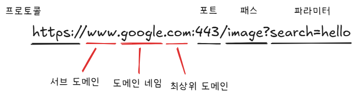
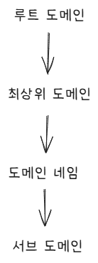
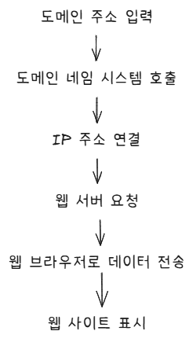

#### 인덱스
- [URL/도메인 구조](#url도메인-구조)
- [도메인 네임 시스템 계층 구조](#도메인-네임-시스템-계층-구조)
  - [루트 도메인 (Root Domain)](#루트-도메인-root-domain)
  - [최상위 도메인 (TLD, Top-Level Domain)](#최상위-도메인-tld-top-level-domain)
  - [도메인 네임 (Domain Name)](#도메인-네임-domain-name)
  - [서브 도메인 (Subdomain)](#서브-도메인-subdomain)
- [도메인 작동 원리](#도메인-작동-원리)


## URL/도메인 구조




## 도메인 네임 시스템 계층 구조

도메인 네임 시스템은 도메인 주소를 여러 단계를 거쳐 IP 주소로 연결하는 계층적 구조로 되어 있다

이 시스템은 루트 도메인을 시작으로 여러 단계의 하위 계층을 통해 도메인 주소를 관리한다



### 루트 도메인 (Root Domain)

도메인 네임 시스템에서 가장 상위에 위치하는데, 사용자가 입력하는 도메인 주소에서는 보이지 않지만 실제로는 주소 마지막에 `.`(점)으로 존재한다

`www.google.com`의 실제 주소는 `www.google.com.`으로 주소 끝부분에 루트 도메인이 있다 (편의상 생략됨)

### 최상위 도메인 (TLD, Top-Level Domain)

루트 도메인 다음으로 가장 높은 수준의 도메인이다

`.com`, `.kr`, `.net`과 같은 도메인이 루트 도메인을 제외한 도메인이 속할 수 있는 최상위 계층이다

크게 국가 코드 최상위 도메인(ccTLS, country code Top-Level Domain)과 일반 최상위 도메인(gTLD, generic Top-Level Domain)으로 구분된다

국가 코드 최상위 도메인은 특정 국가를 나타내는 도메인으로 `.kr`(대한민국), `.us`(미국) 등과 같이 두 글자 코드로 구성된다

일반 최상위 도메인은 `.com`(상업적 용도), `.org`(비영리 단체), `.net`(네트워크)와 같이 특정 목적에 맞춰 활용된다 (3글자 이상인 경우 gTLD)

### 도메인 네임 (Domain Name)

도메인 네임/도메인 이름은 사용자가 주로 입력하는 주소를 말한다

`www.google.com`에서 `google`이 도메인 네임이 된다

### 서브 도메인 (Subdomain)

서브 도메인은 도메인 네임 앞부분에 위치한 영역으로 `www.google.com`에서 `www`가 서브 도메인에 해당한다

서브 도메인이 `www`이면 이를 생략하여 웹사이트에 접속할 수 있다

`www` 자체가 서브 도메인인 것이 아니라 도메인 네임 앞의 위치한 부분을 서브 도메인인 것에 유의해야 한다

최상위 도메인과 도메인 네임은 고정된 영역이고 서브 도메인은 도메인 네임 앞에 위치한 유연한 영역이다

-> 서브 도메인은 웹 사이트의 서비스나 영역을 세분화하는 데 유용하게 사용할 수 있다


## 도메인 작동 원리



사용자가 웹 브라우저 주소창에 도메인 주소(`www.google.com`)을 입력하면, 이 주소가 도메인 네임 시스템을 통해 IP 주소로 변환된다

이후 웹 브라우저는 변환된 IP 주소를 통해 웹 서버에 연결을 시도한다

연결이 맺어진 웹 서버는 HTML 파일, 이미지 등 콘텐츠를 전송하고, 웹 브라우저가 이를 화면에 표시한다


## 도메인 도입 방법

```text
도메인 네임 결정
    ↓
등록 대행사 선택
    ↓
도메인 이름 검색, 예약
    ↓
도메인 등록
    ↓
도메인 네임 시스템 설정
    ↓
호스팅 설정
    ↓
도메인 관리 및 갱신
```

**도메인 네임 결정**: 웹 사이트나 비즈니스 목적에 맞게 도메인 네임 결정

**도메인 등록 대행사 선택**: 후이즈, 가비아 같은 도메인 등록 대행사 선택

**도메인 네임 검색 및 예약**: 결정한 도메인 네임이 사용 가능한지 확인 (이미 등록된 도메인 네임은 사용할 수 없음)

**도메인 등록**: 사용할 수 있는 도메인 등록 진행 (이메일 호스팅, SSL 인증서같은 추가 서비스 사용 가능)

**도메인 네임 시스템 설정**: 도메인 네임을 IP 주소와 연결, 서브 도메인 설정

**호스팅 설정** (생략 가능): 도메인과 호스팅 서비스 연결

**도메인 관리 및 갱신**: 도메인 사용 기간이 만료된 경우 갱신 