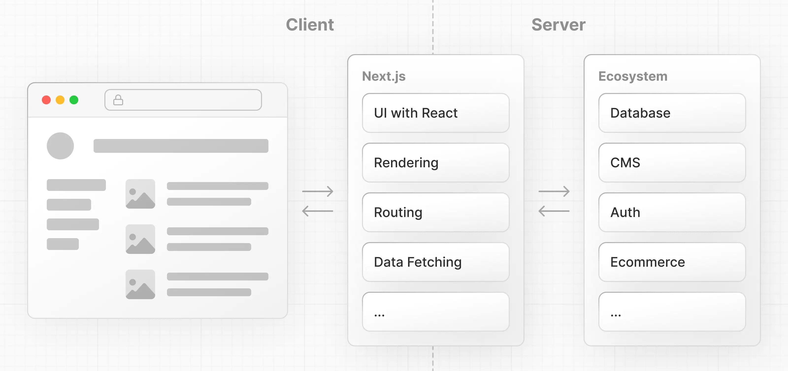
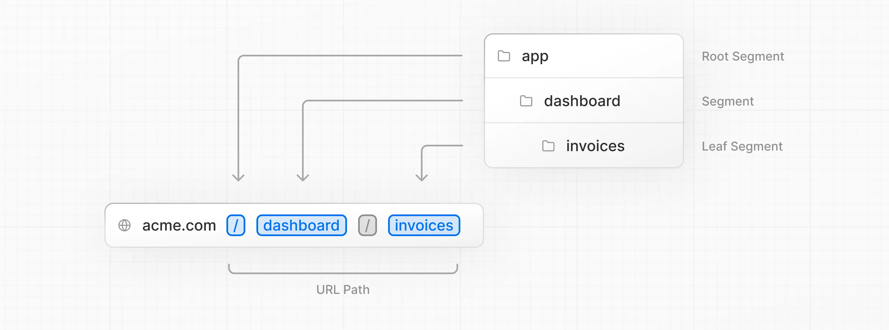
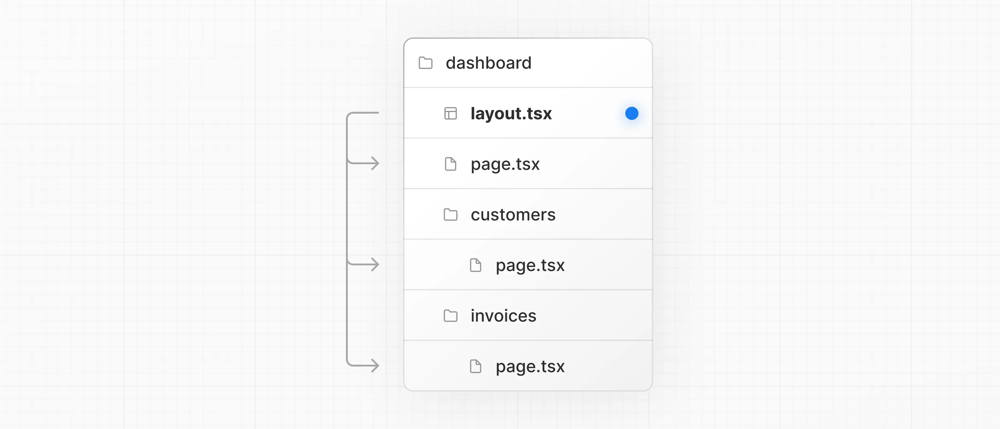
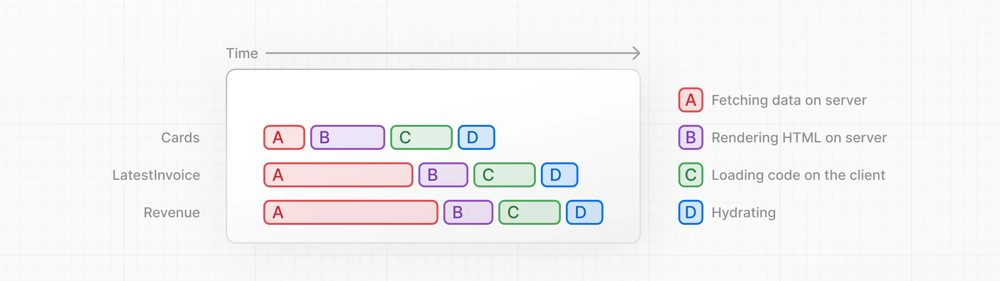

## Next.js
- [Next.js](#nextjs)
- [리액트 웹 프레임워크](#리액트-웹-프레임워크)
  - [모던 웹 애플리케이션 구성 요소](#모던-웹-애플리케이션-구성-요소)
- [Next.js 프로젝트 구조](#nextjs-프로젝트-구조)
- [컴포넌트와 렌더링 메커니즘](#컴포넌트와-렌더링-메커니즘)
- [클라이언트 컴포넌트와 서버 컴포넌트](#클라이언트-컴포넌트와-서버-컴포넌트)
- [라우팅 시스템](#라우팅-시스템)
  - [리액트 라우터의 메커니즘](#리액트-라우터의-메커니즘)
  - [Next.js 앱 라우터](#nextjs-앱-라우터)
  - [Next.js 페이지 라우터](#nextjs-페이지-라우터)
  - [차이점 요약](#차이점-요약)
- [`next/link`](#nextlink)
- [데이터 페칭](#데이터-페칭)
  - [Request Waterfall과 병렬 데이터 페칭](#request-waterfall과-병렬-데이터-페칭)
  - [정적 렌더링과 동적 렌더링](#정적-렌더링과-동적-렌더링)
  - [스트리밍](#스트리밍)
    - [페이지 레벨 Suspense (`loading.tsx`)](#페이지-레벨-suspense-loadingtsx)
    - [route groups](#route-groups)
    - [컴포넌트 레벨 Suspense](#컴포넌트-레벨-suspense)
- [검색 및 페이지네이션](#검색-및-페이지네이션)
- [서버 액션](#서버-액션)
- [캐싱](#캐싱)
- [예외 처리](#예외-처리)
- [CSS](#css)
- [미들웨어](#미들웨어)
- [클라이언트 사이드 렌더링](#클라이언트-사이드-렌더링)
- [서버 사이드 렌더링 (동적 HTML 스트리밍)](#서버-사이드-렌더링-동적-html-스트리밍)
- [SEO](#seo)
- [정적 사이트 생성](#정적-사이트-생성)


## 리액트 웹 프레임워크

```text
리액트: UI 라이브러리
Next.js: 풀스택 프레임워크
```

리액트로만 만들면 뭐가 문제일까?

클라이언트 사이드 렌더링만 가능하다. -> JS 번들이 다운로드될 때까지 화면이 그려지지 않는다.

검색엔진 크롤러는 JS 실행 전 HTML만 보기 때문에 SEO (Search Engine Optimization)에 매우 취약하다.

라우팅, 데이터 페칭, 이미지 최적화, 빌드/배포 등을 모두 직접 해야 한다.

Vercel은 2016년에 리액트의 컴포넌트 모델은 그대로 유지하면서 반복적으로 겪는 문제를 해결하려고 Next.js를 만들었다.



Next.js가 해결하려는 기술적 문제들

**초기 로딩 속도 및 SEO 향상**
- SSR (Server-Side Rendering): 서버에서 HTML을 미리 렌더링해서 보내주는 방법 - 사용자는 바로 컨텐츠를 보고, JS가 로드된 후 하이드레이션한다.
- SSG (Static Site Generation): 빌드 타임에 정적 HTML을 미리 만든다.
- ISR (Incremental Static Regeneration): SSG + 특정 페이지만 주기적으로 재생성

**라우팅**
- 파일/폴더 기반 라우팅(`pages/` 또는 `app/` 디렉토리)
- React Router 설치/설정 X

**데이터 페칭**
- 앱 라우터(Next.js 13+)에서 리액트 서버 컴포넌트로 서버에서 직접 `async/await fetch` 수행한다.
- 클라이언트에 불필요한 JS 파일을 보내지 않는다.

**성능 최적화 자동화**
- 자동 코드 스플리팅
- 이미지 최적화 
- 폰트 최적화
- 스크립트 최적화

**풀스택 개발**
- API 라우트(`/api/`), 서버 액션 등을 통해 프로젝트 내에서 백엔드 로직을 처리할 수 있다.

**개발자 지원**
- Hot Reloading, Zero Config, 미들웨어, Edge Runtime 등 지원

### 모던 웹 애플리케이션 구성 요소

유저 인터페이스: 사용자가 애플리케이션과 상호작용하는 요소

라우팅: 애플리케이션의 서로 다른 요소를 안내하는 요소

데이터 페칭: 데이터를 보관하고 조회하는 요소

렌더링: 정적, 동적 컨텐츠를 렌더링하는 곳과 시점

통합: 서드파티 도구들을 연결하여 사용하는 방법 (인증, 결제 등)

인프라: 애플리케이션을 실행하고, 배포하고, 저장하는 곳 (서버리스, CDN, 엣지 등)

성능: 애플리케이션 성능 최적화

확장성, 개발자 경험 등등


## Next.js 프로젝트 구조

`/app`: 라우터, 컴포넌트, 애플리케이션 로직

`/app/lib`: 유틸리티 함수, 데이터 페칭 함수 등

`/app/ui`: 모든 UI 컴포넌트

`/public`: 모든 정적 에셋


## 컴포넌트와 렌더링 메커니즘

컴포넌트는 페이지를 구성하는 독립적이고 재사용 가능한 작은 UI 빌딩 블록이다.

버튼, 입력창, 프로필 등이 각각 하나의 컴포넌트가 될 수 있다.

헤더 컴포넌트, 사이드바 컴포넌트, 메인 컨텐츠 컴포넌트를 조립하여 하나의 웹 페이지를 완성시킬 수 있다.

리액트 컴포넌트는 함수다.

리액트 컴포넌트 함수는 반환문에 JSX 문법으로 작성된 UI 요소를 반환한다.

반환된 요소는 컴파일러에 의해 자바스크립트 코드로 변환되고 런타임에 실행되어 최종적으로 브라우저의 화면에 HTML로 그려진다.

브라우저는 HTML, CSS, 자바스크립트 코드만 해석하여 실행할 수 있다.

JSX 문법을 이해하지 못하기 때문에 빌드 도구(Babel 등)가 이 파일을 읽어 순수한 자바스크립트 함수 호출 형태로 변환한다.

리액트는 크게 렌더(Render)와 커밋(Commit) 단계로 나누어 화면을 만든다.

**렌더 단계**에선 컴포넌트 함수를 호출하는데, 이 함수들의 리턴값은 실제 HTML 돔이 아니라 가상 DOM이라고 불리는 자바스크립트 객체이다.

리액트는 자바스크립트 객체 트리를 메모리에 유지한다.

데이터(State, Props)가 변경되어 리렌더링이 발생하면 함수를 다시 실행해 새로운 가상 DOM 트리를 만든다.

그리고 이전 트리와 새 트리를 비교하여 바뀐 부분만 찾아낸다. (Diffing 알고리즘)

**커밋 단계**는 렌더 단계에서 변경사항을 찾아내면 리액트는 브라우저의 실제 DOM API(`document.createElement()`, `document.appendChild()`)를 호출하여 화면을 바꾼다.

위의 리액트 과정은 유저의 브라우저에서 실시간으로 일어난다. (Client Side Rendering, CSR)

반면 Next.js는 이 과정을 서버에서 미리 처리하고 실제 결과물인 HTML만 브라우저로 보낸다. (Server Side Rendering, SSR)

**페이지 라우터의 SSR 메커니즘**
- 서버에서 함수 실행: 유저가 웹 사이트에 접속하면 Node.js 서버에서 리액트 컴포넌트 함수를 실행한다.
- HTML 문자열 생성: 서버에서 가상 DOM을 만든 뒤 완전한 HTML 문자열로 만든다.
- 브라우저로 전송: 브라우저는 완성된 HTML을 전달받기 때문에 화면이 빠르게 표시된다.
- 하이드레이션: HTML이 뜨고 나서 자바스크립트 파일을 다운로드하여 리액트가 기존 HTML에 클릭 이벤트나 데이터(State, Props) 같은 자바스크립트 기능을 결합한다. (메마른 HTML에 수분을 공급한다는 의미로 하이드레이션이라고 부름)

**앱 라우터의 서버 컴포넌트(RSC) 메커니즘**
- 서버에서 전용 포맷(RSC Payload) 생성: 서버 컴포넌트 함수가 서버에서 실행되면 HTML 문자열이 아니라 RSC 페이로드라는 특수한 직렬화된 JSON 형태의 데이터를 생성한다. (여기에 서버 컴포넌트 렌더링 결과물과 클라이언트 컴포넌트가 있어야 하는 위치/이들의 자바스크립트 파일 참조가 담겨 있음)
- 스트리밍: 서버는 HTLM과 함께 RSC 페이로드를 브라우저로 전달한다. 컴포넌트가 다 완성될 때까지 기다리지 않고 준비되는 대로 브라우저에 조금씩 보낼 수 있다.
- 클라이언트 번들 제외: 서버 컴포넌트의 코드는 브라우저에게 전달되지 않고 하이드레이션 과정이 생략된다. 브라우저는 가벼운 자바스크립트 용량만 유지한 채 화면을 빠르게 그려낸다.


## 클라이언트 컴포넌트와 서버 컴포넌트

[Next.js 문서](https://nextjs.org/learn/react-foundations/server-and-client-components)

**리액트 클라이언트 컴포넌트**는 순수 리액트를 이용하여 만든 컴포넌트로 유저의 브라우저(클라이언트)에서 실행되고 상호작용을 담당한다.

Next.js에서 파일의 최상단에 `"use client"`라는 지시어를 명시하면 클라이언트 컴포넌트가 된다.

동작 방식
- 초기 HTML이 서버에서 한 번 렌더링된다.
- 브라우저로 자바스크립트 코드를 전달하면 리액트가 화면에 인터랙션 기능을 결합하는 하이드레이션 과정을 거친다.

버튼 클릭 이벤트(`onClick`), 입력창 상태 관리(`onChange`) 등을 자유롭게 처리할 수 있다.

상태 변화에 따른 화면 업데이트(`useState`, `useEffect`, `useContext` 리액트 훅)를 할 수 있다.

로컬 스토리지, 쿠키, 주소창 핸들링이 가능해진다.

**리액트 서버 컴포넌트**는 서버에서만 실행되고 렌더링되는 컴포넌트를 말한다.

Next.js 앱 라우터(`app` 디렉토리)에서는 기본적으로 모든 컴포넌트가 서버 컴포넌트로 동작한다.

동작 방식
- 서버에서 DB를 조회하거나 API를 호출해 컴포넌트 함수를 실행하여 HTML 결과물을 만들어 둔 뒤, 브라우저에는 이 결과값만 전송한다.

브라우저가 컴포넌트를 실행하기 위해 무거운 자바스크립트 라이브러리들을 다운로드하지 않는다.

데이터베이스나 API 같은 민감한 정보를 브라우저에 노출시키지 않고 서버에서 안전하게 처리할 수 있다.

컴포넌트 내부에서 `async/await`로 직접 DB나 백엔드에 접근할 수 있어 코드가 간결해진다.

단, 브라우저가 아닌 서버에서 실행되기 때문에 유저와의 상호작용(클릭, 입력 등)을 처리할 수 없다.

**예시**

상품 상세 페이지를 만드는 상황

`ProductPage.js` (서버 컴포넌트): URL에서 상품 ID를 읽어와 서버 DB에서 상품 이름, 가격, 이미지 데이터를 페치한다.

화면의 뼈대(HTML)를 서버에서 그려 성능이 빠르고 SEO에 유리하다.

`LikeButton.js` (클라이언트 컴포넌트): 상품 페이지 안에 들어가는 '좋아요 버튼'은 `"use client"`를 붙여 별도 컴포넌트로 구성한다.

사용자가 좋아요 버튼을 누르면 버튼의 색상을 변경시킨다. (`useState`)


## 라우팅 시스템

라우터는 사용자가 요청한 주소(URL)에 맞는 화면을 보여주는 역할을 한다.
- `www.example.com/login` -> 로그인 페이지 표시
- `www.example.com/profile` -> 프로필 페이지 표시

전통적인 방식인 **서버 사이드 라우팅**에서는 다른 페이지로 이동할 때마다 브라우저가 서버에 매번 새로운 HTML 파일을 요청했다.

이 방식을 구현한 애플리케이션을 **MPA(Multi Page Application)**이라고 하며 서버가 라우터 역할을 한다. 

페이지를 이동할 때마다 화면이 깜박이며 전체 로딩해야 하는 단점이 있다. 

리액트는 웹 사이트에 처음 접속할 때, 사이트 전체에 필요한 자바스크립트 파일을 통째로 가져온다.

이후 페이지를 이동할 때마다 서버에 HTML을 요청하지 않고 브라우저 내부의 '리액트 라우터'가 주소를 바꾸고 컴포넌트만 변경한다. (**클라이언트 사이드 라우팅**, **SPA(Single Page Application)** 방식)

화면 깜박임없이 페이지를 전환할 수 있으나, SEO에 취약하고 최초 자바스크립트 파일을 다운로드로 인해 페이지 로딩이 느릴 수 있다.

### 리액트 라우터의 메커니즘

리액트 라우터는 서버에 새 HTML을 요청하는 대신 브라우저의 History API(`window.history.pushState`)를 이용해 URL만 변경한다.

URL이 바뀌면 리액트 라우터가 이를 감지하고 해당 URL에 매핑된 리액트 컴포넌트만 자바스크립트로 화면에 그린다. (컴포넌트 스위칭, 리렌더링)

리액트 라우터가 화면이 바뀔 때마다 주소창의 URL을 함께 업데이트하고, URL이 바뀔 때마다 브라우저 히스토리에 이를 저장하기 떄문에 앞/뒤로 가기, 새로고침, 링크 공유가 정상적으로 동작한다.

만약 라우터가 없으면 어떻게 될까?

주소창의 URL이 항상 `www.example.com`으로 고정된다.

브라우저의 뒤로 가기 버튼을 누르면 이전 페이지가 표시되는게 아니라 이전 웹 사이트로 이동하게 된다.

새로고침을 하면 사용자가 보던 페이지가 아닌 항상 메인 페이지로 이동하게 된다.

### Next.js 앱 라우터



앱 라우터는 Next.js 13 버전부터 도입되어 표준이 된 방식이다.

`/app` 하위의 디렉토리는 하나의 URL 세그먼트에 매핑되는 경로 세그먼트를 나타낸다.

각 세그먼트는 `layout.tsx`와 `page.tsx` 파일을 사용하여 페이지별 UI를 구성할 수 있다.

`page.tsx`는 해당 경로의 페이지를 반환하는 (`Page` 리액트 컴포넌트를 반환하는) Next.js의 특수 파일이다.

```typescript
export default function Dashboard() {
    return <p>Dashboard Page</p>;
}
```

`/app/page.tsx` 파일은 `/` 경로의 페이지를 반환한다.

`/app/dashboard/page.tsx` 파일은 `/dashboard` 경로의 페이지를 반환한다.

**Next.js는 `page.tsx` 파일만 실제 웹 페이지 경로로 인식하여 이 파일의 내부 컨텐츠만 공개적으로 접근할 수 있다.** 

디렉토리 안의 다른 파일들은 사용자가 인터넷 주소창으로 접근할 수 없다.

이러한 특성 덕분에 `/app` 디렉토리 안에 페이지 이외에도 `/ui`, `/lib` 등을 함께 두어 애플리케이션을 관리할 수 있다.

`layout.tsx` 파일은 여러 페이지가 공동으로 사용하는 레이아웃을 만드는 파일이다.

`Layout` 컴포넌트는 `children` prop을 받아서 자식 컴포넌트를 감싸는 껍데기 역할을 한다.

`children` prop은 페이지 또는 다른 레이아웃이 될 수 있다.

```typescript
export default function Layout({ children }: { children: React.ReactNode }) {
    return (
        <div className="flex h-screen flex-col md:flex-row md:overflow-hidden">
            <div className="w-full flex-none md:w-64">
                <SideNav />
            </div>
            <div className="grow p-6 md:overflow-y-auto md:p-12">{children}</div>
        </div>
    )
}
```

`/dashboard` 디렉토리 하위의 모든 페이지는 `/dashboard/layout.tsx`의 `Layout` 컴포넌트를 거치게 된다.



사용자가 `/dashboard` 경로 내의 어떤 페이지로 이동하더라도 `layout.tsx` 영역은 그대로 두고 `children` (`page.tsx`) 부분만 변경된다.

즉, 페이지 컴포넌트만 업데이트되고 레이아웃은 리렌더링이 발생하지 않게 되어 레이아웃의 리액트 State를 유지할 수 있다.

이를 **부분 렌더링(Partial Rendering)**이라고 한다.

루트 레이아웃(`/app/layout.tsx`)은 Next.js가 HTML의 뼈대(`<html>`, `<body>` 태그)를 구성하는 곳이므로 반드시 존재해야 한다.

애플리케이션 전역 레이아웃으로 이 곳에 UI를 변경하면 모든 페이지에 영향을 미치게 된다.

프로젝트의 `app` 디렉토리를 기반으로 하여 서버 컴포넌트를 중심에 두고 설계되었다.

폴더 이름 기반 라우팅
- 파일 이름이 아니라 폴더 이름이 경로가 된다.
- `app/about/page.js` 구조로 파일을 만들면 `/about` 경로가 생성된다.
- 반드시 `page.js` 파일이 있어야 라우트로 인식될 수 있다.

서버 컴포넌트 기본 적용
- `app` 디렉토리 내의 모든 컴포넌트는 기본적으로 서버 컴포넌트이다.
- 자바스크립트 번들이 클라이언트로 전송되지 않고 서버에서 미리 렌더링되므로 성능을 향상시킬 수 있다.
- 클라이언트 측 상호작용이 필요하면 파일 최상단에 `use client`를 명시해야 한다.

중첩 레이아웃
- `layout.js` 파일을 폴더별로 구성할 수 있다.
- 상위 레이아웃은 그대로 두고 하위의 `page.js` 영역만 변경되므로 불필요한 리렌더링이 없고 상태를 유지하기 쉽다.
  
`getServerSideProps` 같은 함수를 사용하지 않고, 컴포넌트 자체를 `async/await` 함수로 만들어 표준 fetch API를 사용해 데이터를 가져온다.

### Next.js 페이지 라우터

Next.js는 리액트의 CSR 한계(SEO 취약, 느린 초기 로딩)를 극복하기 위해 서버 사이드 렌더링을 도입하며 라우팅 메커니즘을 발전시켰다.

페이지 라우터는 Next.js의 전통적인 라우팅 방식으로 프로젝트의 `pages` 디렉토리를 기준으로 라우팅이 결정된다.

파일 이름 기반 라우팅 
- `pages/about.js` 라는 파일을 만들면 자동으로 `/about` 경로가 생성된다.
- 동적 라우팅은 `pages/posts/[id].js` 같은 형식으로 표현한다.

페이지 단위 데이터 페칭
- `getServerSideProps`나 `getStaticProps` 같은 함수를 사용하여 페이지 단위로 SSR이나 SSG를 수행한다.

한계점
- 페이지 간에 공통으로 쓰이는 레이아웃(GNB, 사이드바 등)이 있어도 페이지가 바뀔 때마다 다시 렌더링된다.

### 차이점 요약

|구분|리액트 라우터|	Next.js 페이지 라우터|	Next.js 앱 라우터|
|---|----|----|---|
|기준 디렉토리|	개발자가 자유롭게 코드 작성|	pages/|	app/|
|라우팅 방식|	자바스크립트 코드 기반 (<Route path="...">)|	파일 이름 기반 (about.js)|	폴더 이름 기반 (about/page.js)|
|렌더링 위치|	클라이언트(CSR) 전용|	클라이언트 + 서버(SSR/SSG)|	클라이언트 + 서버 컴포넌트(RSC) 중심|
|레이아웃 구현|	<Outlet> 등을 이용해 구현 가능|	_app.js, _document.js 활용 (복잡함)|	layout.js 파일을 통한 중첩 레이아웃 지원|
|데이터 페칭|	useEffect 등을 통해 브라우저에서 요청|	getServerSideProps, getStaticProps|	컴포넌트 내부에서 async/await + fetch|


## `next/link`

HTML `a` 태그를 클릭하면 브라우저가 이동할 페이지의 전체 HTML, CSS, 자바스크립트 파일을 처음부터 끝까지 서버에 새로 요청해서 받아온다.

페이지가 전환될 때마다 전체 페이지가 리프레시되는 현상이 발생한다.

공통 레이아웃이 있어도 페이지의 모든 요소를 처음부터 다시 다운로드하기 때문에 ㅔ늩워크 자원이 낭비되고 사용자 경험이 떨어진다.

 Next.js에서 제공하는 `Link` 컴포넌트는 리액트의 장점을 활용하여 화면 전체를 새로고침하지 않고 바뀌는 부분만 부드럽게 갈아끼우는 SPA 방식으로 동작한다.

`Link` 컴포넌트는 'Prefetching'이라는 기능을 제공한다.

사용자가 웹 화면을 스크롤하다가 `Link` 컴포넌트가 브라우저 화면(Viewport)에 보이기 시작하면 Next.js가 백그라운드로 `href`에 명시된 경로의 코드를 미리 다운로드한다.

사용자가 실제로 링크를 클릭하는 순간, 이미 다운로드된 페이지를 보여주기 때문에 로딩 시간없이 즉시 화면이 나타난다.

## 데이터 페칭

### Request Waterfall과 병렬 데이터 페칭

request waterfall이란 이전 요청의 완료 여부에 의존하는 네트워크 요청 시퀀스를 말한다. 

아래의 각 요청은 이전 요청이 데이터를 반환하기 전까지 대기해야 한다.

```typescript
const users = await fetchUsers();
const posts = await fetchPosts();
const comments = await fetchComments();
```

이전 요청의 반환값에 따라 다음 요청을 수행할 데이터 값이 변경되거나, 진행 여부가 결정되는 경우에는 워터폴이 필요할 수 있다.

그러나 대시보드 같이 페이지 내에서 서로 다른 데이터를 보여줘야 하는 경우엔 워터폴 방식은 성능을 낮추게 한다.

워터폴을 피하기 위해 아래와 같이 `Promise.all()` 또는 `Promise.allSetteld()`를 사용할 수 있다.

이 방식을 사용하면 모든 데이터 페치 코드를 동시에 시작할 수 있어 워터폴 방식보다 빠르게 동작한다.

그리고 순수 자바스크립트 코드이므로 다른 라이브러리나 프레임워크에도 적용할 수 있다.

```typescript
await Promise.all([
    // users fetching sql,
    // posts fetching sql,
    // comments fetching sql,
]);
```

### 정적 렌더링과 동적 렌더링

기본적으로 Next.js는 성능 향상을 위해 **서버의 데이터 페칭과 렌더링을 빌드 시점 (또는 데이터 검증)에 수행**한다.

따라서 Next.js 앱이 배포될 때 컨텐츠가 모두 렌더링된 상태이다.

이를 **정적 렌더링**이라고 하는데, 캐시된 결과값(데이터 페칭까지 마친 렌더링된 페이지)이 브라우저로 전송되기 때문에 사용자가 Next.js 애플리케이션에 빠르게 접속할 수 있다.

서버가 각 유저마다 매번 동적으로 컨텐츠를 생성(DB 조회)를 할 필요없이 캐시된 값을 재사용할 수 있다.

또한 검색 엔진 크롤러가 쉽게 인덱싱을 할 수 있어 검색 엔진 랭킹도 높일 수 있다.

정적 렌더링은 UI에 데이터가 없거나 사용자들 간 공통적인 데이터를 표시할 때 유용한 방식이다.

반대로 사용자별로 데이터를 표시하거나 최근 데이터를 주기적으로 업데이트 해야 할 때는 정적 렌더링과 반대되는 **동적 렌더링** 방식이 유용하다.

동적 렌더링은 **각 유저가 요청하는 시점에 서버에서 컨텐츠를 렌더링하는 방식**이다.

매 요청마다 데이터가 갱신되므로 실시간 데이터나 주기적으로 업데이트되는 데이터를 표시할 수 있다.

사용자별 데이터(대시보드, 유저 프로필 등)나 유저 인터랙션을 기반으로 한 데이터를 표시하기도 쉽다.

또한 동적 렌더링은 쿠키나 URL 파라미터와 같이 요청 시점에 알 수 있는 정보에 접근할 수 있다.

### 스트리밍

스트리밍은 전체 데이터를 작은 조각인 청크로 나눠 클라이언트에게 전송하는 기법이다.

Next.js에서 스트리밍은 라우트를 작은 청크로 나누고 서버에서 데이터가 준비되는 대로 점진적으로 클라이언트에게 전송하는 것을 말한다.



스트리밍을 사용하면 특정 데이터 조회가 느려지더라도 전체 페이지 렌더링이 블로킹되는 것을 방지할 수 있다.

각 청크는 리액트의 컴포넌트로 간주할 수 있다.

Next.js에서 스트리밍을 구현하는 방법은 두 가지가 있다.
- 페이지 레벨에서 `<Suspense`> 스트리밍 (`loading.tsx` 파일)
- 컴포넌트 레벨에서 `<Suspense`> 스트리밍

#### 페이지 레벨 Suspense (`loading.tsx`)

`loading.tsx`는 리액트의 Suspense를 기반으로 만들어진 Next.js의 특수 파일로, 페이지 컨텐츠가 로딩되는 동안 로딩 UI를 표시하는 용도로 사용된다.

Next.js는 기본적으로 정적 렌더링으로 동작하므로 동적 렌더링이 아닌 요소는 모두 즉시 표시된다.

따라서 동적 컨텐츠가 로딩되는 동안 사용자는 정적으로 렌더링된 UI와 상호작용을 할 수 있다. 

e.g., 대시보드가 로딩되는 동안 내비게이션 바를 통해 다른 페이지로 이동하는 경우

```typescript
// /app/dashboard/loading.tsx
export default function Loading() {
    return <div>Loading...</div>; // 문자열로 로딩 상태를 나타낸다
}
```

로딩 스켈레톤은 사용자에게 컨텐츠가 로딩 중임을 나타내기 위한 용도로 사용되는 간단한 UI이다.

`loading.tsx` 파일에 포함된 UI는 모두 정적 파일로 임베디드되기 때문에, 사용자가 페이지에 접속하면 스켈레톤이 가장 먼저 표시된다.

이후 서버에서 클라이언트로 동적 컨텐츠가 스트리밍된다.

```typescript
// /app/dashboard/loading.tsx
import DashboardSkeleton from "../ui/skeletons";

export default function Loading() {
    return <DashboardSkeleton />; // 스켈레톤 UI로 로딩 상태를 나타낸다
}
```

#### route groups

```text
app/
 └── dashboard/
     ├── loading.tsx
     ├── page.tsx
     ├── layout.tsx
     ├── customers/
     │   └── page.tsx 
     └── invoices/
         └── page.tsx 
```

`loading.tsx` 파일은 하위 경로의 `page.tsx`보다 우선순위가 높기 떄문에 이들의 페이지에도 적용된다.

만약 현재 페이지에만 로딩 상태를 나타내고 하위 페이지에서 표시할 필요가 없다면 라우트 그룹을 사용하여 이들을 분리해야 한다.

라우트 그룹은 **URL 경로 구조를 변경시키지 않고 파일들을 논리적으로 구분**할 수 있게 한다.

현재 경로에 `()` 괄호로 감싸진 디렉토리를 만들어 라우트 그룹을 만들 수 있다.

위의 라우트 구조에서 `dashboard` 경로만 `loading.tsx`를 적용시키고 싶다면 하위에 `(overview)` 디렉토리를 만들고 이 곳에 `loading.tsx` 파일을 두면 된다.

```text
app/
 └── dashboard/
     ├── (overview)
     │    ├── loading.tsx
     │    └── page.tsx
     ├── layout.tsx
     ├── customers/
     │   └── page.tsx 
     └── invoices/
         └── page.tsx 
```

라우트 그룹은 URL 경로를 변경시키지 않기 때문에 `/dashborad/(overview)/page.tsx`는 URL 경로 상 `/dashboard`가 된다.

라우트 그룹을 사용하면 라우트 내에서 여러 섹션을 구분하거나 팀 별로 디렉토리를 관리해야 하기 용이하다.

#### 컴포넌트 레벨 Suspense

컴포넌트에 `Suspense`를 적용하면 전체 페이지 대신 해당 컴포넌트만 로딩 상태를 표시할 수 있다.

리액트의 `Suspense`는 특정 조건(데이터 로딩 등)이 만족할 때까지 애플리케이션의 특정 부분 렌더링을 미룰 수 있게 한다.

동적으로 컨텐츠를 만드는 부분을 `Suspense`로 감싸고, fallback(대신 표현할 수단, 로딩 표시)을 전달하면 동적 컴포넌트가 로딩되는 동안 fallback 컴포넌트가 표시된다.

그럼 특정 컴포넌트로 인해 전체 페이지를 로딩 상태로 표시하지 않고 로딩되고 있는 컴포넌트만 로딩 상태로 표시할 수 있다.

동적으로 컨텐츠를 로딩하는 동일한 컴포넌트가 여러 개인 경우 이들을 감싸는 래퍼 컴포넌트를 만들고, 래퍼 컴포넌트를 `Suspense`로 감싸면 된다.


## 검색 및 페이지네이션

사용자가 검색어를 입력하면 URL의 파라미터를 변경시킨다. 

Next.js는 업데이트된 URL의 검색 파라미터에 접근하여 서버에서 데이터를 조회한 후 결과물을 표시할 컴포넌트를 리렌더링한다.

URL 검색 파라미터를 기반으로 검색 기능을 구현하면 다음과 같은 장점이 있다.

사용자가 URL만 복사하여 다른 사람들에게 공유하거나 북마크하여 나중에도 사용할 수 있다.

URL 파라미터에 사용된 검색 쿼리와 필터를 통해 클라이언트에 별도의 상태나 로직을 두지 않고도 사용자의 행동을 추적할 수 있다.

검색 기능을 구현하기 위한 Next.js 클라이언트 훅
- `useSearchParams`: 현재 URL의 파라미터에 접근하는 훅
- `usePathname`: 현재 URL의 경로에 접근하는 훅
- `useRouter`: 클라이언트 컴포넌트 내 라우트 간 이동을 가능하게 하는 훅

검색 기능 메커니즘
- 사용자가 검색창에 검색어를 입력한다.
- `use client`로 선언된 컴포넌트에서 입력값을 캡처하고 URL 검색 파라미터를 업데이트한다. (디바운싱 적용, URL 변경)
- 서버 컴포넌트는 URL 파라미터를 가져온 뒤 DB 데이터를 조회한 뒤 동적 렌더링을 수행한다.

페이지네이션도 비슷하게 `useSearchParams`와 `usePathname`을 통해 URL의 페이지 파라미터를 업데이트하고, 서버 컴포넌트가 이 값에 접근하여 동적 렌더링을 수행한다.


## 서버 액션

리액트 서버 액션은 비동기 코드를 서버에서 직접 실행할 수 있는 기능이다.

CRUD API 엔드포인트 없이 비동기 함수(서버 액션)을 작성하고 클라이언트 또는 서버 컴포넌트에서 호출할 수 있다. (서버 액션이 자동으로 `POST` API 엔드포인트를 생성한다)

서버 액션은 암호화된 클로저, 입력 검사, 오류 메시지 해싱, 호스트 제한 등 웹 애플리케이션 보안을 강화하는 기능이 포함되어 있다.


## 캐싱

## 예외 처리

`notFound()`, `not-found.tsx`, `error.tsx` (`error`, `reset`)

## CSS 


## 미들웨어

## 클라이언트 사이드 렌더링

## 서버 사이드 렌더링 (동적 HTML 스트리밍)


## SEO

## 정적 사이트 생성
