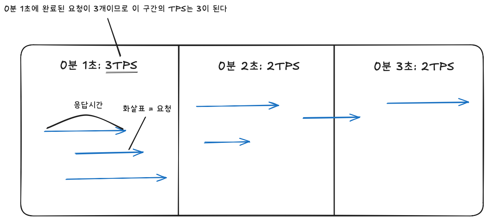
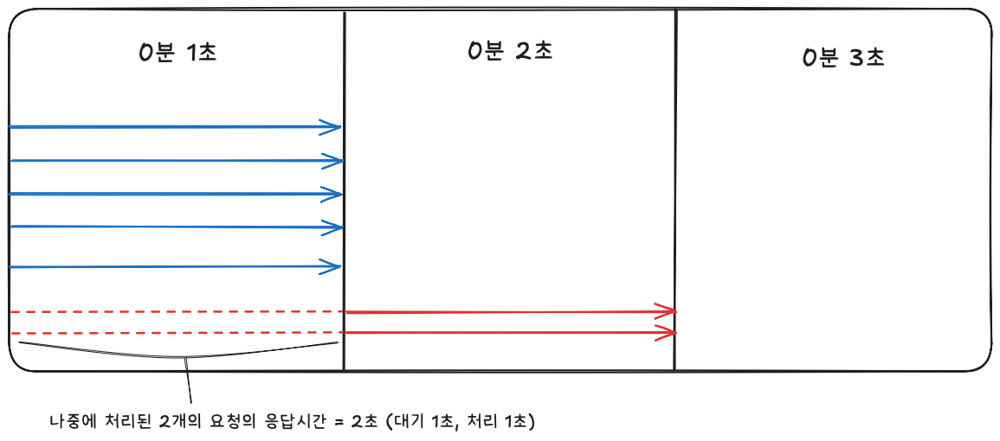
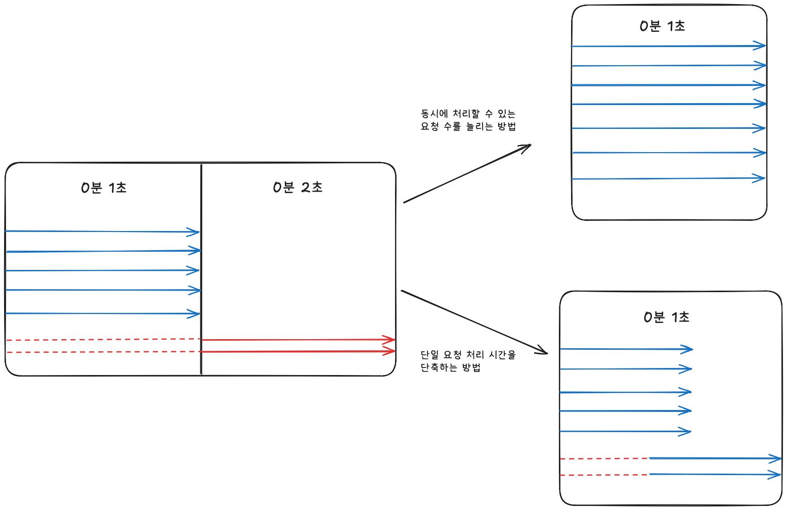
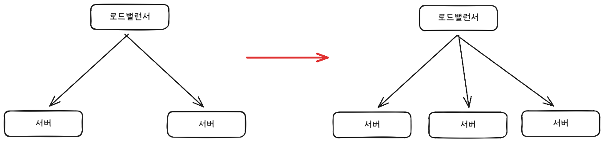
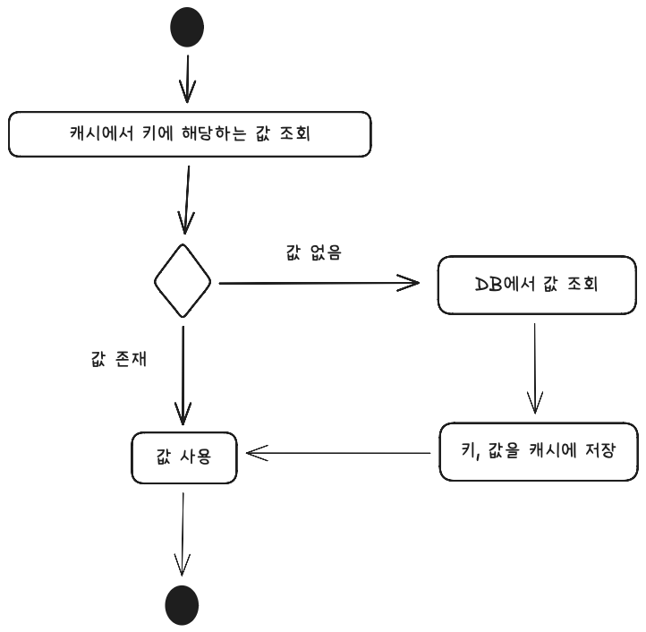

#### 인덱스
- [응답 시간](#응답-시간)
- [처리량](#처리량)
- [서버 성능 문제와 해결 방법](#서버-성능-문제와-해결-방법)
- [근본적인 해결책](#근본적인-해결책)
  - [1. DB 커넥션 풀 설정](#1-db-커넥션-풀-설정)
  - [2. 서버 캐시](#2-서버-캐시)
  - [3. 가비지 컬렉터와 메모리 사용](#3-가비지-컬렉터와-메모리-사용)


## 응답 시간

클라이언트 요청 송신 ~ 응답 수신까지의 시간
- API 요청 전송 시간
- 서버 처리 시간
    - 로직 수행 (if, for 등)
    - DB 연동 (SQL 실행 포함)
    - 외부 API 연동
    - 응답 데이터 생성
- API 응답 전송 시간

서버 처리 시간 중 API 연동과 DB 연동이 가장 많은 비중을 차지함 -> DB 연동과 API 연동 시간을 줄여야 응답 시간을 줄일 수 있음

응답 시간 종류
- TTFB (Time To First Byte) = 응답 데이터 중 첫 번째 바이트가 도착할 때까지 걸린 시간
- TTLB (Time To Last Byte) = 응답 데이터 중 마지막 바이트가 도착할 때까지 걸린 시간

데이터의 크기에 따라 TTFB 또는 TTLB 측정방법 선택 -> 다수의 이미지, 동영상같은 경우 TTLB의 값이 커짐

기존 평균 응답시간 (특정 기능, 전체 기능 등) 계산 -> 로직을 개선하여 응답시간 단축 -> 결과 기록


## 처리량

처리량 (throughput)은 단위 시간당 시스템이 처리하는 작업량을 말함 - 주로 TPS/RPS로 처리량을 나타냄

TPS = Transaction Per Second (초당 트랜잭션 수)
RPS = Request Per Second (초당 요청 수)



최대 TPS = 시스템이 처리할 수 있는 최대 요청 수

한 번에 최대 5개의 요청을 처리할 수 있는 서버, 요청당 처리 시간이 1초라면 -> 최대 TPS는 5가 됨

이것보다 더 많은 요청 수가 동시에 들어오면 서버는 초과한 요청을 나중에 처리함 -> 응답시간 증가



응답시간을 줄이려면 두 가지 방법이 있다
- 처리 시간 자체를 줄여 대기 시간을 줄이는 방법
- 서버가 동시에 처리할 수 있는 요청 수를 늘려 대기 시간을 줄이는 방법



성능을 개선하려면 현재 서버의 TPS와 응답 시간을 알아야 함

트래픽이 많은 시간대의 TPS와 응답 시간이 얼마인지 측정하고, 이 결과를 바탕으로 목표 TPS와 응답 시간을 설정하여 성능 개선안 도출

TPS 측정 방법
- 모니터링 시스템: 스카우트, 핀포인트, 뉴렐릭
- 엘라스틱 서치로 웹 서버 접근 로그 수집 후 집계
- 접근 로그 파싱 후 TPS 산출 (리눅스 명령어 + 코딩)

## 서버 성능 문제와 해결 방법

사용자 수, 트래픽, 데이터베이스 크기가 늘어나면서 점점 응답 시간이 느려지는 현상이 나타남

성능 문제 전조 증상
- 순간적으로 모든 사용자 요청에 대한 응답 시간이 심각하게 느려짐
- 10초 이상 걸리는 요청이 늘어나고 다수의 요청에서 ‘연결 시간 초과’ 같은 오류가 발생함
- 서버를 재시작하면 잠시 괜찮다가 다시 응답 시간이 느려지는 현상이  반복됨
- 트래픽이 줄어들 때까지 이러한 상황이 계속됨

트래픽 증가 -> 시스템이 수용할 수 있는 최대 TPS 초과 -> 성능 문제 발생

시스템의 최대 TPS를 높여야 성능 문제를 개선할 수 있음

서버 성능 개선 과정
- 원인 파악
- 빠르게 해결할 수 있는 개선안 도출
- 근본적인 해결책 모색

### 원인 파악
- 성능 문제가 발생하는 지점 식별 (대부분 DB 또는 외부 API 연동 부분)
- 실제 실행 시간 측정 (대부분의 모니터링 도구에서 실행 시간 추적 기능을 제공함)
- 모니터링 도구가 없다면 코드의 실행 시간을 로그를 남기기

### 빠른 해결책
- 수직 확장 (scale-up)
    - CPU, 메모리, 디스크 등의 자원을 증가시키는 방법
    - DB 성능 저하 -> DB 장비 수직 확장 (쿼리, 테이블 설계 등의 문제를 곧바로 해결할 수 없음)
    - 서버 메모리 부족 -> 서버 메모리를 증설하여 최대 동시 요청에 대한 응답 시간 증가 방지
    - 즉각적인 효과를 바로 얻을 수 있지만 트래픽이 지속적으로 증가하면 결국 성능 문제가 불거짐
- 수평 확장  (scale-out)
    - 서버를 추가로 투입해 TPS를 늘리는 방법
    - 서버가 두 대 이상이면 ‘로드밸런서’를 통해 사용자의 트래픽을 골고루 분배한다
    - TPS를 높이기 위해 무작정 서버를 늘리는 방법은 좋지 못함
    - 병목 지점이 어디인지 파악하는 게 가장 중요
    - DB에서 성능 문제가 발생하고 있는데 서버를 추가로 늘리면 심각한 성능 저하를 일으킬 수 있음
    - DB나 외부 API에 성능 문제가 발생하지 않는 범위 내에서만 수평 확장을 해야 효과가 있음

로드밸런서의 트래픽 분산 방식
- 정적: 라운드 로빈(요청을 각 서버에 순차적으로 분배), IP 해시(클라이언트 IP 주소를 해시한 값을 기반으로 요청을 전달할 서버 결정 -> 동일한 클라이언트는 같은 서버로 연결됨)
- 동적: 서버의 현재 상태에 따라 트래픽 분산 -> 트래픽이 적은 서버에 요청 전송 (연결 수가 적거나 응답 시간이 짧은 서버에 요청 전송)



## 근본적인 해결책

### 1. DB 커넥션 풀 설정
- 커넥션 풀 크기 (최소/최대 크기)
- 커넥션 획득 대기 시간
- 커넥션 유지 시간 (최대 유휴 시간, 최대 유지 시간)

#### 1-1. 커넥션 풀 크기
- 커넥션 풀에 미리 생성해둘 커넥션 개수를 지정하는 설정
- 풀의 모든 커넥션이 사용 중이면 다른 요청은 유휴 커넥션이 생길 때까지 대기함
- 커넥션 획득 대기 시간을 줄이려면 전체 응답 시간과 TPS를 고려하여 커넥션 풀 크기를 지정해야 됨
- 커넥션 풀 크기를 늘리면 처리량을 높일  수 있으나 무턱대고 늘리면 DB에 가해지는 부하가 커짐 -> 쿼리 실행 시간이 급격하게 늘어남
- 서버 수평 확장도 커넥션 풀 크기를 늘리는 것과 동일함

커넥션 풀 크기: 5
요청 당 쿼리 실행 시간: 0.1초
1초당 처리할 수 있는 요청 수: 50 (1초/0.1 * 5)
-> 동시에 50개의 요청이 들어오면 모두 1초 안에 처리
어떤 요청은 바로 커넥션을 얻어 실행되고, 어떤 요청은 커넥션을 구하기 위해 0.9초를 기다리지만 모두 1초 안에 처리됨

커넥션 풀 크기: 5
요청 당 쿼리 실행 시간: 0.5
1초당 처리할 수 있는 요청 수: 10 (1초/0.5 * 5)
-> 동시에 50개의 요청이 들어오면 5초 소요
어떤 요청은 0.5초 만에 실행이 끝나지만, 다른 요청은 커넥션을 구하기 위해 4.5초를 기다렸다가 쿼리를 실행함

커넥션 풀은 최소 크기와 최대 크기를 설정할 수 있음
- 동시 요청 수가 증가하면 최대 크기로 커넥션을 늘림
- 이후 줄어들면 커넥션을 점차 줄임
- 트래픽이 급증하는 경우엔 곧바로 최대 크기로 맞추는 게 좋음 (DB 연결 시간도 성능 저하의 주요 원인이 될 수 있음)


#### 1-2. 커넥션 획득 대기 시간

커넥션 풀에 사용할 수 있는 커넥션이 없을 때 커넥션을 얻기 위해 기다릴 수 있는 최대 시간

지정된 대기 시간 안에 커넥션을 구하지 못하면 DB 연결 실패 에러가 발생한다

대기 시간만큼 응답 시간도 길어짐

HikariCP의 기본 대기 시간: 30초 -> 최악의 경우 응답 시간이 30초를 넘길 수 있음

응답 시간이 중요한 서비스는 커넥션 대기 시간을 가능한 한 짧게 설정해야 됨

보통 0.5초 ~ 3초 이내로 지정하는 것이 좋다

대기 시간을 짧게 설정하여 일시적 오류 메시지를 사용자에게 보여주기 vs 긴 시간 동안 무응답 상태로 유지하기

커넥션을 얻지 못했을 때 빠르게 에러를 응답해야 서버의 부하가 증가하는 것도 방지할 수 있다


#### 1-3. 최대 유휴 시간, 유효성 검사, 최대 유지 시간

커넥션을 일정 시간 동안 사용하지 않으면 DB 단에서 클라이언트와의 연결을 자동으로 끊을 수 있다

새벽 시간대에 지정된 시간 동안 사용자가 없으면 커넥션 풀에 있는 모든 커넥션은 DB와의 연결이 끊기게 된다

이후 DB와 연결이 끊긴 커넥션을 사용하면 에러가 발생한다

연결 끊김을 방지하기 위해 커넥션 풀은 2가지 기능을 제공한다
- 최대 유휴 시간 지정
- 유효성 검사 지원

최대 유휴 시간: 사용되지 않는 커넥션을 풀에 유지할 수 있는 최대 시간

최대 유휴 시간을 넘긴 커넥션은 종료되어 풀에서 제거된다 

커넥션 풀에서 관리하는 시간이며 DB에 설정된 비활성화 유지 시간과는 다름
-> 최대 유휴 시간을 DB 비활성화 유지 시간보다 짧게 설정하면 DB가 연결을 끊기 전에 풀에서 커넥션을 제거할 수 있음

유효성 검사: 커넥션이 정상적으로 사용할 수 있는 상태인지 여부를 확인하는 절차

커넥션 풀 구현 방식에 따라 커넥션을 풀에서 가져올 때 또는 주기적으로 유효성을 검사할 수 있음
-> 이 과정에서 연결이 유효하지 않은 커넥션을 식별하고 풀에서 제거할 수 있음

최대 유지 시간: 커넥션  생성 후 최대로 유지할 시간

이 시간이 지나면 커넥션이 유효하더라도 해당 커넥션을 닫고 풀에서 제거한다


### 2. 서버 캐시

DB 서버를 확장하지 않고 응답 시간과 처리량을 개선하고 싶다면 캐시 사용을 고려할 수 있음

DB 캐시는 일반적으로 키 값 쌍을 저장하는 Map과 같은 형태의 데이터 저장소이다

키는 중복되지 않아야 하므로 적절한 키 값을 선택해야 한다 

캐시에 데이터를 저장해두고 동일한 데이터를 요청할 때 DB가 아닌 캐시에서 데이터를 읽어와 응답한다

DB뿐만 아니라 복잡한 계산 결과나 외부 API 연동 결과도 캐시에 보관하여 응답 시간을 줄이는 데 활용할 수 있다



#### 2-1. 적중률과 삭제 규칙

캐시를 효율적으로 사용하는지 가늠할 수 있는 기준: 적중률 (hit rate) - 또는 캐시 효율이라고도 함

캐시 적중률 계산: 캐시에 존재한 건수/캐시에서 조회를 시도한 건수

캐시에서 데이터를 100번 조회했는데 그 중 87번은 해당 데이터가 존재했으면 이 때 캐시 적중률은 87%가 됨 (0.87)
-> 적중률이 높을수록 DB와의 연동이 줄어들고 곧 응답 시간 감소, 처리량 증가, DB 부하 감소로 이어짐

캐시에 최대한 많은 데이터를 저장하면 적중률을 높일 수 있다

하지만 캐시는 메모리 자원을 사용하기 때문에 물리적인 용량 한계가 있으므로 보관할 수 있는 데이터 양이 제한된다

캐시가 가득 차 있는 상태에서 새로운 데이터를 캐시에 저장하면 기존에 있던 데이터 중 하나를 제거해야 한다

삭제할 대상을 선택하는 규칙
- LRU (Least Recently Used): 가장 오래전에 사용한 데이터를 제거한다
- LFU (Least Frequently Used): 가장 적게 사용된 데이터를 제거한다
- FIFO (First In First Out): 먼저 추가된 데이터를 먼저 삭제한다

보통 오래된 데이터는 조회하지 않게 됨 -> 캐시가 여유있어도 불필요한 메모리 사용을 줄이기 위해 각 캐시에 유효 시간(만료 시간)을 설정하기도 함

#### 2-2. 로컬 캐시와 리모트 캐시

서버가 사용하는 캐시 종류



로컬 캐시
- 서버 프로세스와 동일한 메모리를 캐시 저장소로 활용하는 방식
- 장점
    - 서버 프로세스와 캐시가 동일한 메모리 공간을 사용하므로 캐시 데이터에 빠르게 접근 가능
    - 별도의 외부 연동없이 구조를 간단하게 유지할 수 있음
- 단점
    - 캐시에 저장할 수 있는 데이터 크기에 제한이 있음
    - 서버 프로세스를 재시작하면 메모리에 있던 캐시 데이터가 모두 삭제됨 -> 일시적으로 캐시 적중률이 떨어짐
- 구현 기술: Caffeine (자바), go-cache (Go), node-cache (Node.js)

리모트 캐시
- 별도 프로세스를 캐시 저장소로 사용하는  방식
- 장점
    - 캐시 크기를 유연하게 확장할 수 있음 - 캐시 서버 수평 확장
    - 서버 프로세스가 재시작되더라도 리모트 캐시 서버의 데이터는 유지됨
- 단점
    - 네트워크 통신 필요
    - 별도의 서버 장비와 프로세스를 요구함 -> 시스템 구조가 복잡해짐
- 구현 기술: 레디스

#### 2-3. 캐시 사전 적재

트래픽이 순간적으로 급증하는 패턴이 보인다면 캐시에 데이터를 미리 저장하는 방식

특정 기간/날에 사용자들이 많이 몰릴 것을 예측할 수도 있음

#### 2-4. 캐시 무효화

유효하지 않은 데이터를 적절한 시점에 캐시에서 삭제하는 것을 캐시 무효화라고 함

캐시에 보관된 데이터의 원본이 바뀌면 그에 맞춰 캐시에 보관된 데이터도 함께 변경하거나 삭제해야 한다
-> 캐시에 오래된 데이터를 보관하게 되면 사용자가 잘못된 정보에 접근할 수 있게 됨

이 때 캐시에 저장된 데이터의 특성에 따라 무효화하는 시점을 달리 설정함
- 가격 정보, 게시글 내용처럼 민감한 데이터는 즉시 캐시 무효화
- 최근 인기 글 목록 같이 변경에 민감하지 않고 데이터 크기가 작다면 캐시 유효 시간을 설정하여 주기적으로 갱신하는 방식 사용

변경에 민감한 데이터는 로컬 캐시가 아닌 리모트 캐시에 보관해야 함 -> 로컬 캐시는 로컬 서버의 데이터만 변경할 수 있기 떄문


### 3. 가비지 컬렉터와 메모리 사용

자바, Go, 파이썬 같은 언어는 개발자 대신 가비지 컬렉터가 메모리를 관리해준다

가비지 컬렉터는 사용이 끝난 객체를 힙 메모리에서 바로 삭제하지 않고 정해진 규칙에 따라 사용하지 않는 메모리를 찾아서 반환한다

e.g., 힙 메모리 사용량의 일정 비율 초과, 일정 주기로 실행

가비지 컬렉터의 동작이 응답 시간에 영향을 줄 수 있음
- 자바에서는 가비지 컬렉터가 실행되는 동안 애플리케이션 실행이 일시 중단됨 ‘Stop-The-World’
- GC는 응답시간 뿐만 아니라 CPU 사용률을 급격히 증가시킬 수 있음

메모리를 많이 사용하고 생성된 객체가 많을수록 사용하지 않는 객체를 찾는 데 시간이 오래 걸림

반대로 메모리 사용을 줄이면 GC 시간도 줄어들 가능성이 높음
- 힙 크기를 줄이면 미사용 객체 수와 크기가 줄어듬에 따라 검사해야 할 객체 수가 줄어들고, GC 수행 시간이 짧아짐
- 메모리 부족으로 에러가 발생할 수 있으므로 적절한 최대 힙 크기 조정 필요

한 번에 대량으로 객체를 생성하는 것도 주의해야 함

컨텐츠 조회 API가 한 번에 10만 개의 게시글을 반환한다고 가정
- 게시글 하나가 0.5KB 메모리를 사용함
- 10만 개 * 50MB = 50MB
- 동시에 100명 사용자가 컨텐츠 조회 API를 호출하면 100 * 50MB = 5GB 메모리 필요
- 사용할 수 있는 최대 메모리가 4GB라면 메모리 부족 상태 발생 (`Out Of Memory Error` 발생 가능)
- 메모리가 부족해서 GC를 실행하지만 메모리가 부족한 상태는 지속됨

대량 객체 생성 방지 방법
- 조회 범위 제한
- 한 번에 10년 치 내역 조회 X
- 최대 N개월 치 내역만 조회하게 끔
- 한 번에 조회할 수 있는 데이터 개수를 트래픽 규모와 메모리 크기에 맞춰 제한

파일 다운로드 구현 시
- 파일 데이터를 한꺼번에 메모리에 로딩한 후 응답하는 방식 X
- 파일 크기와 동시 사용자 수에 따라 메모리 사용량 급증 가능
- 30MB 파일을 100명이 동시에 다운받으면 30MB * 100 = 3GB
- 스트림을 활용하면 파일 처리 과정에서 필요한 메모리 크기를 줄일 수 있음

```java
byte[] bytes = Files.readAllBytes(Path.of("path")); // 한 번에 파일 로딩
out.write(bytes);
```

```java
// 파일을 한 번에 읽지 않고 8KB씩 끊어서 읽음
InputStream is = Files.newInputStream(Path.of("path"));
int size = 8192; // 8KB 메모리
byte[] buffer = new byte[size]; 
int read;

while ((read = is.read(buffer, 0, size)) >= 0) {
    out.write(buffer, 0, read);
}
```

스트림을 활용하여 8KB씩 파일을 로딩하면 동시에 100명이 다운로드를 요청해도 100 * 8KB = 800KB에 불과하다

