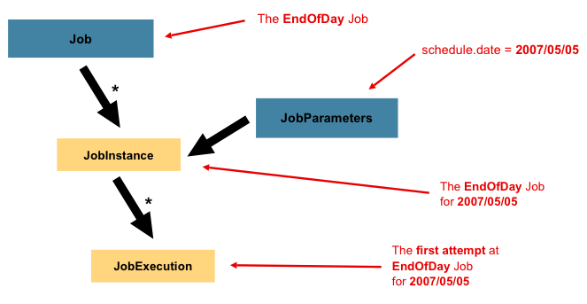
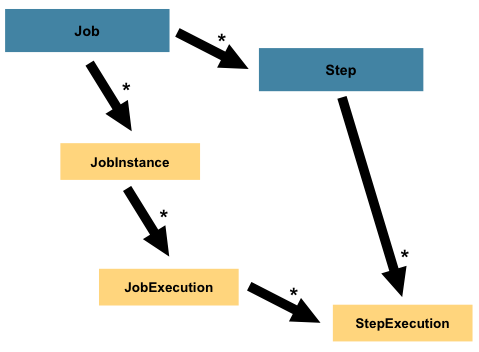

#### 인덱스
- [배치 작업이란](#배치-작업이란)
- [스프링 배치](#스프링-배치)
- [처리 모델](#처리-모델)
- [아키텍처](#아키텍처)
- [스프링 배치 데이터베이스 테이블](#스프링-배치-데이터베이스-테이블)
- [Job, JobInstance, JobExecution](#job-jobinstance-jobexecution)
- [Step, StepExecution, ExecutionContext](#step-stepexecution-executioncontext)
- [ItemReader, ItemProcessor, ItemWriter](#itemreader-itemprocessor-itemwriter)
- [JobRepository](#jobrepository)
- [JobLauncher](#joblauncher)
- [JobExplorer](#jobexplorer)
- [JobOperator](#joboperator)
- [Listeners](#listeners)
- [키워드 정리](#키워드-정리)


## 배치 작업이란

배치(일괄 처리)란 최종 사용자의 개입없이 실행을 스케줄링할 수 있는 작업(Job)의 실행을 의미한다

컴퓨터 프로그램 흐름에 따라 순차적으로 자료를 처리하는 것이자 **일정한 시점에 대량의 데이터를 한꺼번에 처리** 하는 프로그램 실행 단위를 배치 작업이라고 한다

기본적으로 실시간으로 요청을 받아서 바로 처리하는 온라인 트랜잭션(OLTP, Online Transaction Processing)과 달리 **한꺼번에 모아서 처리하는 Offline Processing 방식으로 실행된다**

배치 작업은 일반적으로 다음의 흐름을 가진다
- **데이터 읽기(Read)**: DB, 파일, 메시지 큐 등에서 데이터 페치
- **데이터 가공/처리(Process)**: 계산, 필터링, 변환 등 수행
- **결과 저장/출력(Write)**: 다시 DB, 파일, API, 메일 등으로 저장 또는 전송

3단계(Reader -> Processor -> Writer) 구조가 전형적인 배치 파이프라인 구조이다

### 배치 작업이 필요한 시나리오

**정산**
- 일일 매출 데이터 집계 및 판매자별 정산 금액 계산
- 실행 주기: 매일 1회 (밤 12시)

정산 예제
- Step 1 (청크 200)
  - Reader: 날짜별 거래 테이블 레코드 조회
  - Processor: 매출 계산
  - Writer: 집계 테이블 upsert
- 체크포인트: 청크 단위로 커밋하고 실패 시 청크 재시도(3회, 백오프 5초) 후 Skip 저장
- 병렬화(파티셔닝): 거래 user_id % N으로 파티션을 나눠 여러 워커에서 Step을 병렬 처리한다
- 재처리: 에러 테이블(DLQ)에 적재된 레코드를 대상으로 별도의 재처리 Job을 실행한다 (수동 또는 스케줄)

**데이터 마이그레이션/백업**
- 대규모 데이터를 다른 DB로 옮기거나 백업 파일 생성
- 수동 또는 주기적 배치 작업

**이메일/푸시 알림**
- 조건을 만족한 사용자에게 메일, 푸시 알림 일괄 발송
- 특정 시점

### 배치 시스템 설계의 핵심 포인트

### 재시작성 (Restartability/Checkpointing)

작업 실행 도중 실패가 발생했을 때 전체를 다시 돌리지 않고 중단 지점부터 안전하게 재실행할 수 있어야 한다

**체크포인트**: 현재 처리 진행 상태(마지막으로 커밋된 청크의 인덱스, 파일 오프셋, DB 커서, 메시지 오프셋 등)를 관계 DB, 분산 스토어 등 신뢰 가능한 저장소에 주기적으로 저장하고 추후에 실패 발생 시 저장된 체크포인트 값을 참고하여 재실행을 시도한다

**불변성**: 재실행 시 같은 데이터를 다시 처리해도 부작용이 없도록 설계해야 한다

**dedupe, 멱등성**: 실패 시 중복이 발생하면 안되는 경우(금융 트랜잭션)는 재처리 금지 또는 외부 상태 관리

### 트랜잭션 관리

처리 단위를 적절히 묶어 작업의 원자성(Atomicity)과 일관성(Consistency)을 보장해야 한다

**청크 단위 트랜잭션**: 특정 단위의 청크 한 개 단위로 트랜잭션을 시작하고 작업 성공 시 커밋, 실패 시 해당 청크만 롤백한다

**트랜잭션 경계 설정**: Reader는 트랜잭션 외부에서 동작(읽기)하고 Writer는 필요 시 트랜잭션 내부에서 동작한다. 다만 **외부 API 호출(실시간 동기 호출)은 트랜잭션 밖으로 빼고 결과 상태를 비동기/보상으로 처리한다** (외부 동기 호출에 의한 리소스/시간 낭비 소요 방지)

**Retry & Skip 정책**: 네트워크 등 일시적 오류는 재시도로 해결해본다 (제한과 백오프를 설정하여 무한 재시도 방지 필요), 치명적이지 않은 레코드는 스킵 처리 후 별도 로그/Dead-letter로 저장한다

### 스케줄링

언제 어떻게 작업을 실행할지(스케줄, 트리거, 의존성)를 결정하고 관리한다

스케줄러 종류
- 단일 서버: 크론, 스프링 `@Scheduled`
- 분산 서버: Quartz, 쿠버네티스 CronJob, Apache Airflow, AWS Batch 등

단순 주기 실행은 스케줄러에게 맡기고 의존성이 있거나 조건부 흐름이 있는 복잡한 DAG는 워크플로우 엔진(Airflow 등)을 사용한다

작업 실행 시 파라미터(날짜, 범위 등)를 전달하여 재사용성을 확보한다 (같은 파라미터로 중복 실행되는 것을 방지해야 함)

스케줄 변경, 재실행, 강제 실행(수동 트리거)을 위한 엔드포인트나 UI를 제공하는 것이 좋다

### 모니터링

작업 상태(성공/실패), 처리량, 지연, 에러, 재시작/재시도 횟수 등을 실시간으로 파악하고 알림을 받는다

**메트릭**: 그라파나 + 프로메테우스 -> 스프링 부트 액추에이터 + 마이크로미터로 메트릭 수집

**로그/추적**: 각 작업에는 고유 Job Instance ID를 부여하고 로그에 남겨 추적을 쉽도록 한다 - 분산 추적(Zipkin, Zaeger)으로 작업 간 호출 흐름을 파악한다

**에러 집계/알림**: 치명적 실패는 슬랙, 이메일 등으로 즉시 알린다. 느려지는 경향(평균 처리시간 급증)은 경보에 포함시킨다

실패 원인(트랜잭션 롤백, 특정 예외)을 로그에서 명확히 구분하고 실패한 레코드는 별도 테이블(DLQ, Dead Letter Queue)에 저장하고 재처리 파이프라인을 마련한다

### 확장성

처리량 증가에 맞춰 성능을 수직/수평적으로 확장한다

**수직 확장(vertical)**: 더 큰 인스턴스, 더 많은 메모리/CPU 할당

**수평 확장(horizontal)**: 여러 인스턴스에서 병렬로 Job/Step 실행 - 상태 공유(JobRepository)와 중복 방지 필요

**동시성 전략**
- 멀티스레드 스텝: 하나의 프로세스 내에서 여러 스레드로 청크 병렬 처리 - 단일 JVM 내에서만 안전
- 파티셔닝: 데이터 파티션(키 범위, 해시/날짜 기반)을 만들어 여러 워커(다른 프로세스 또는 스레드)에게 분산 (스프링 배치 `Partitioner`)
- 원격 청크: 마스터가 청크 단위로 작업을 분해하고 워커가 처리 (메시지 큐로 통신)

### 운영 정책

**버전 관리**: 작업 정의(코드, 파라미터, SQL 등) 버전 관리 - 작업 파라미터/인스턴스 간 버전 유의

**롤백 전략**: 전체 롤백이 필요한 경우와 부분 롤백으로 충분한 시나리오 구분

**데이터 보관 정책**: 처리 완료 후 메타데이터/로그 보관 기간 설정

**보안**: 민감한 데이터는 처리 중 마스킹/암호화하고 전송 시 TLS/SSL 사용

### 배치 시스템 설계 체크리스트

단일 배치 애플리케이션에서 단순한 시스템 구조 유지 - 복잡한 논리 구조 회피

I/O 연산을 최소화하고 가능한 메모리에서 연산 수행 - SQL 분석 후 불필요한 I/O 방지

실패 시 재시작/재처리 방법: 체크포인트, idempotency

트랜잭션 경계 설정 및 외부 연계 처리

스케줄/오케스트레이션 방법: Cron vs Airflow 등

모니터링/알림 지표 종류: 성공률, 처리속도, 에러비율

확장성 수단: 멀티스레드, 파티셔닝, 원격청크

데이터 정합성 및 보안(민감 정보 처리) 보장


## 스프링 배치

스프링 배치는 **대용량 데이터 처리(batch processing)를 안전하고 일관성있게 자동화** 하기 위한 스프링 기반 프레임워크이다

배치 작업을 수행하는 컴포넌트와 구조 규격화, 트랜잭션 관리, 실패 복구, 재시작 기능, 메타데이터 관리, 스케줄링 연동, 스케일링 등을 포괄적으로 지원한다

수동 스크립트(쉘, 파이썬, 크론 등)로 대규모 데이터를 처리하면 트랜잭션/에러 복구/중단 지점 재시작이 어렵지만 스프링 배치는 **청크 단위로 트랜잭션을 관리**하고 **실패 시 재시작**, **처리 건수/상태 자동 기록**을 지원하여 대규모 데이터를 안정적이고 재현 가능하게 처리한다

또한 **배치 작업에 대한 구조와 수명주기 관리 방식으로 통합**하여 코드 일관성을 높인다

스프링 클라우드와 연계 시 분산 처리, 스케줄링, 워크플로우 관리(Airflow 등)도 자연스럽게 통합할 수 있다

|기능|상세|예시|
|---|----|---|
|조건 분기(Flow) | Step 실행 결과에 따라 다음 Step 결정 | Step1 실패 → Step3로 이동|
|다중 입력/출력|여러 Reader/Writer 구성|DB → 파일, 파일 → DB 등|
|병렬 처리(Parallel Step)|여러 Step을 병렬로 실행|user별 파티션 병렬 처리|
|재시도/스킵 정책(Retry/Skip)|실패 시 재시도, 특정 예외 스킵|외부 API 오류 시 3회 재시도|
|Listener|Job/Step 시작/종료 시 후처리|알림 메일, 로그 집계 등|
|ExecutionContext|Job 간 상태 공유|이전 Step의 결과를 다음 Step에 전달|


## 처리 모델

스프링 배치는 대규모 데이터를 효율적으로 처리하기 위해 두 가지 모델을 지원한다

**Chunk-Oriented 처리**: Reader(`ItemReader`) -> Processor(`ItemProceessor`) -> Writer(`ItemWriter`)를 사용하는 일반적인 처리 모델

**Tasklet-Oriented 처리**: 단일 작업을 수행하는 `Tasklet` 인터페이스를 구현하여 처리하는 모델

단일 작업: 리소스 정리, 파일 연산, 커스텀 로직 실행 등


## 아키텍처

스프링 배치는 다양한 상황에 맞춰 배치 시스템을 설계하고 확장성을 가질 수 있는 레이어드 구조를 채택한다
- Application 레이어: 모든 스프링 배치 코드가 포함되는 계층 (Job, 커스텀 코드 등)
- Core 레이어: 배치 작업을 실행하고 제어할 코어 런타임 구현체가 포함되는 계층 (Job, Step 등의 구현체)
- Infrastructure 레이어: 애플리케이션과 코어 레이어에서 사용할 공통 Reaader, Writer, 서비스가 포함되는 계층 (ItemReader/ItemWriter, RetryTemplate 등)


배치 애플리케이션은 입력 소스에 따라 세 가지로 구분된다
- 데이터베이스 기반 앱: 데이터베이스로부터 행이나 값을 가져온다
- 파일 기반 앱: 파일로부터 레코드나 값을 가져온다
- 메시지 기반 앱: 메시지 큐로부터 메시지를 가져온다

### 주요 배치 비즈니스 로직

**변환**: 외부 시스템에서 제공하는 파일 유형 별로 트랜잭션 레코드를 배치 처리에 필요한 포맷으로 변환하는 애플리케이션

**검증**: 모든 입/출력 레코드가 올바르고 일관적인지 검증하는 애플리케이션 (파일 헤더/트레일러, 체크섬, 레코드 레벨 크로스 체크)

**추출**: 데이터베이스나 입력 파일로부터 레코드를 읽는 애플리케이션. 미리 정해진 룰에 따라 데이터를 읽고 다시 출력 파일에 작성한다

**추출/업데이트**: 데이터베이스나 입력 파일로부터 레코드를 읽고 각 입력 레코드에서 찾은 데이터에 따라 데이터베이스나 출력 파일을 변경하는 애플리케이션

**프로세싱/업데이트**: 검증/추출 애플리케이션의 입력 트랜잭션을 처리하는 애플리케이션 (데이터 처리를 위해 DB에서 데이터를 읽고 DB를 업데이트하거나 레코드를 생성하는 과정 포함)

**출력/포매팅**: 입력 파일을 읽어서 표준 포맷으로 레코드를 재구성한 뒤 출력하거나 다른 시스템에 전달하기 위한 출력 파일을 생성하는 애플리케이션

### 주요 배치 유틸리티

**정렬**: 데이터를 읽고 레코드의 특정 키를 기준으로 정렬하는 작업 (주로 시스템 유틸리티를 사용하여 정렬함)

**분할**: 단일 입력 파일을 읽고 레코드의 필드 값을 기준으로 각 레코드를 여러 출력 파일로 분할하는 작업

**병합**: 여러 개의 입력 파일을 읽고 데이터를 조합하여 하나의 출력 파일로 만드는 작업


## 스프링 배치 데이터베이스 테이블

스프링 배치 애플리케이션 로드 시 자동적으로 생성되는 데이터베이스 테이블

BATCH_JOB_INSTANCE
- JobInstance (JobInstance = Job + JobParameters)
- JobInstance 유일설 보장

BATCH_JOB_EXECUTION
- JobIntance 실행 기록 (하나의 JobInstance는 여러 번 실행될 수 있음 - JobExecution)
- 재시작 관리

BATCH_JOB_EXECUTION_PARAMS
- Job 실행 시 전달된 파라미터
- 식별 파라미터 구분

BATCH_JOB_EXECUTION_CONTEXT
- JobExecution 컨텍스트 
- Job 레벨 상태 공유 및 재시작 시 상태 복구

BATCH_STEP_EXECUTION
- StepExecution 실행 기록
- Chunk 처리 통계, 성공/실패 여부

BATCH_STEP_EXECUTION_CONTEXT
- Step 실행 컨텍스트
- Step 레벨 상태 공유 및 재시작 정보 보관

테이블 관계

```text
BATCH_JOB_INSTANCE
     │ 1
     │
     │ N
BATCH_JOB_EXECUTION ──── BATCH_JOB_EXECUTION_PARAMS
     │ 1
     │
     │ 1
     └── BATCH_JOB_EXECUTION_CONTEXT
     │
     │ N
     └── BATCH_STEP_EXECUTION
           │
           └── BATCH_STEP_EXECUTION_CONTEXT
```


## Components


Job은 하나 이상의 Step을 가지며, 각 Step은 단 하나의 ItemReader, ItemProcessor, ItemWriter를 가진다

Job은 JobLauncher를 통해 실행되며 현재 실행되는 프로세스에 대한 메타데이터가 JobRepository에 저장된다

## Job, JobInstance, JobExecution


**Job**은 전체 배치 프로세스를 캡슐화한 엔티티이자 Step 인스턴스들의 컨테이너이다

논리적인 흐름에 속하는 여러 Step들을 구성하며 모든 Step에 적용할 수 있는 글로벌 프로퍼티를 구성할 수 있다

**Job 프로퍼티**
- Job 이름
- 각 Step 인스턴스 정의와 실행 순서
- Job 재시작 가능 여부

```java
@Bean
pubilc Job footballJob(JobRepository jobRepository) {
    return new JobBuilder("footballJob", jobRepository)
                    .start(playerLoad())
                    .next(gameLoad())
                    .next(playerSummarization())
                    .build();
}
```

**JobInstnace**는 클래스를 기반으로 런타임에 인스턴스를 생성하는 것처럼 특정 Job을 기반으로 하는 논리적 실행 그룹 단위를 의미한다

매일 자정에 일일 매출을 계산하는 Job이 있다고 하면, 날마다 해당 Job을 실행해야 하며 각 Job은 구분되어야 하는데 이를 JobInstance를 통해 구현한다

특정 JobInstance가 실패한 경우 다시 재시도해야 할 수도 있게 되는데 이러한 JobInstance의 개별 실행 단위가 **JobExecution**이 된다

따라서 하나의 JobInstance는 여러 개의 JobExecution을 가질 수 있다. Job -> JobInstance (N) -> JobExecution (M)

**JobInstance의 정의는 로드될 데이터와 전혀 관련이 없다**

어떤 데이터를 로드할 지 결정하는 것은 전적으로 ItemReader이며 이는 비즈니스 결정과 관련이 있다 (e.g., 매일 당일 매출 데이터만 로드)

대신 동일한 JobInstance를 재사용할 때 이전 실행 컨텍스트(ExecutionContext)를 사용할지 결정할 수 있는데 새로운 JobInstance를 사용한다면 처음부터 시작하는 것이고, 기존 인스턴스를 사용한다면 중단된 곳에서 다시 시작하는 것을 의미한다



**JobParameters**는 특정 배치 작업을 시작하기 위해 파라미터 집합을 보관하는 역할을 한다

배치 작업 실행 중 JobInstance 식별하거나 참조 데이터로 사용할 수 있다

각 JobInstance는 하나의 JobParameter를 가진다. JobInstance = Job + JobParameters

위의 다이어그램에서는 매일 자정에 Job을 실행하는 특정 JobInstance의 JobParmaeters에 `schedule.date = 2007/05/05`를 포함시켜 JobInstance를 정의한다

**JobExecution**이 실질적으로 하나의 Job을 실행하는 개념을 나타낸다

**하나의 JobExecution은 실패 또는 성공으로 종료되지만, JobInstance는 성공으로 실행이 완료되지 않는 이상 실행 완료로 간주되지 않는다**

실제로 실행을 담당하는 유닛이므로 실행 기록과 관련된 데이터를 저장하는 역할도 하며 이를 제어하는 프로퍼티들을 포함한다

**JobExecution 프로퍼티**
- status: 실행 상태를 나타내는 `BatchStatus` 객체 (`STARTED`, `FAILED`, `COMPLETED`)
- startTime: 실행이 시작된 현재 시스템 시간 (`LocalDateTime`)
- endTime: 실행이 끝난 현재 시스템 시간 (`LocalDateTime`)
- exitStatus: 실행 결과를 나타내는 `ExitStatus` 객체 (종료 상태 코드 포함)
- createTime: JobExecution이 처음 영속된 현재 시스템 시간 (`LocalDateTime`)
- lastUpdated: JobExecution이 마지막으로 영속된 시간 (`LocalDateTime`)
- executionContext: JobExecution간 유지되어야 하는 사용자 데이터를 보관하는 실행 컨텍스트 객체
- failureExceptions: 실행 도중 발생한 예외 목록

### 배치 작업 예시

BATCH_JOB_INSTANCE 테이블

|JOB_INST_ID|JOB_NAME|
|---|---|
|1|EndOfDayJob|

BATCH_JOB_EXECUTION_PARAMS 테이블

|JOB_EXEUCTION_ID|TYPE_CD|KEY_NAME|DATE_VAL|IDENTIFYING|
|---|---|---|---|---|
|1|DATE|schedule.date|2017-01-01|TRUE|

BATCH_JOB_EXECUTION 테이블

|JOB_EXEC_ID|JOB_INST_ID|START_TIME|END_TIME|STATUS|
|---|---|---|---|---|
|1|1|2017-01-01 21:00|2017-01-01 21:30|FAILED|

위의 BATCH_JOB_EXECUTION 테이블의 STATUS 컬럼을 살펴보면 JobExecution이 실패했다는 것을 알 수 있다

그 다음 날에 실패한 것과 그 날 실행해야 할 JobExecution을 모두 실행한다면 아래와 같이 실패한 Job을 먼저 실행하고 당일 분의 Job을 실행하거나 병렬적으로 실행할 수 있다

참고로 두 개의 JobExecution이 동일한 데이터에 접근하여 데이터베이스 락을 일으키지 않는 이상 병렬적으로 실행될 수 있다 (실행 전략은 스케줄러에게 달림, 동일한 JobExecution을 실행하는 것은 예외를 일으킴)

BATCH_JOB_INSTANCE 테이블

|JOB_INST_ID|JOB_NAME|
|---|---|
|1|EndOfDayJob|
|2|EndOfDayJob|

BATCH_JOB_EXECUTION_PARAMS 테이블

|JOB_EXEUCTION_ID|TYPE_CD|KEY_NAME|DATE_VAL|IDENTIFYING|
|---|---|---|---|---|
|1|DATE|schedule.date|2017-01-01|TRUE|
|2|DATE|schedule.date|2017-01-01|TRUE|
|3|DATE|schedule.date|2017-01-02|TRUE|

BATCH_JOB_EXECUTION 테이블

|JOB_EXEC_ID|JOB_INST_ID|START_TIME|END_TIME|STATUS|
|---|---|---|---|---|
|1|1|2017-01-01 21:00|2017-01-01 21:00|FAILED|
|1|1|2017-01-02 21:00|2017-01-02 21:30|COMPLETED|
|1|1|2017-01-02 21:31|2017-01-02 22:29|COMPLETED|


## Step, StepExecution, ExecutionContext

**Step**은 Job의 독립적이고 순차적인 단계를 나타내는 도메인 객체이다

하나의 Job에서 데이터를 읽고 처리하고 쓰는 단계를 각 Step 별로 담당한다

개발자가 작성하는 Job의 정의에 따라 단순한 Step 또는 비즈니스 규칙이 반영된 복잡한 Step이 구성되며, Job과 JobExecution처럼 Step은 StepExecution을 가진다

청크 기반 처리 모델인 경우 청크의 데이터를 처리하고, Tasklet 기반 처리 모델은 단일 작업을 실행한다



**StepExecution**은 JobExecution처럼 Step을 실행하려는 단일 객체로 Step이 실제로 시작하는 시점에 생성된다

만약 이전 실행이 실패로 끝나서 실행하는데 실패했다면 해당 실행에 대한 결과를 저장하지 않는다

각 StepExecution은 Step과 JobExecution에 대한 참조, 트랜잭션과 관련된 데이터(커밋/롤백 횟수, 시작/종료 시간)를 가지고 있다

또한 ExecutionContext를 포함하여 배치 실행 간에 유지되어야 하는 데이터(통계, 재시작이 필요한 상태 정보 등)를 보관할 수 있다

[StepExecution 프로퍼티](https://docs.spring.io/spring-batch/reference/domain.html#stepexecution)

**ExecutionContext**는 StepExecution 또는 JobExecution 스코프 안에서 유지되어야 하는 데이터를 저장할 수 있는 키-값 컬렉션이다


## ItemReader, ItemProcessor, ItemWriter

스프링 배치에서 배치 작업에 사용되는 데이터를 Item이라고 표현한다

**ItemReader**는 입력 데이터(청크)를 가져오는 추상화로 각 Step은 하나의 ItemReader를 가진다

모든 값을 가져와 더이상 유효한 값을 반환할 수 없으면 null을 반환한다

**ItemProcessor**는 아이템에 대한 비즈니스 처리(필터링, 변환, 검증 등)를 수행하는 추상화로 각 Step은 하나의 ItemProcessor를 가진다

유효하지 않은 아이템으로 판단되면 null을 반환하여 쓰기 작업에 포함시키지 않는다

***ItemWriter*는 한 번에 받은 청크(데이터)를 쓰는 역할을 한다

현재 호출에서 전달된 Item들에 대해서만 알고 있다


## JobRepository

JobRepository는 Job/Step Execution 실행 메타데이터와 체크포인트를 저장하는 저장소이다

스프링 배치의 상태 저장소 역할을 하여 상태 복구, 재시작, 상태 조회를 할 수 있게 한다


## JobLauncher

JobLauncher는 Job과 JobParameters를 받아서 실행하는 간단한 인터페이스이다

JobRepository로부터 유효한 JobExeuction을 가져와 Job을 실행하는 역할을 한다

동기/비동기 실행을 모두 지원한다


## JobExplorer

실행된 Job과 Step의 메타데이터(JobExecution, StepExecution 등)를 조회할 수 있는 기능을 제공한다


## JobOperator

Job 시작, 중지, 재시작, 상태 조회 등 운영 제어 API를 제공한다 


## Listeners

**JobExecutionListener**: Job 시작/종료 리스너

**StepExecutionListener**: Step 시작/종료 리스너

**ItemReadListener / ItemProcessListener / ItemWriteListener**: 읽기/처리/쓰기 전후, 오류 시점 리스너

**ChunkListener**: 청크 전/후, 오류 시점 리스너


## 키워드 정리

기본 개념: Job, JobInstance, JobExecution, Step, StepExecution, ExecutionContext

I/O 처리 구조: ItemReader / ItemProcessor / ItemWriter

Step 유형: Chunk-Oriented, Tasklet-Oriented

실행 관리: JobRepository, JobLauncher

리스너 계층: JobExecutionListener, StepExecutionListener, ChunkListener, ItemReadListener / ItemProcessListener / ItemWriteListener

운영 관리: JobOperator, JobExplorer

병렬 처리: 파티셔닝 (Partitioning)

예외 처리: Skip / Retry / SkipLimit / RetryLimit

복구 처리: Restart

---

멀티스레드 스텝: 단일 Step 내에서 멀티스레드로 Chunk 병렬 처리

원격 청크: Master가 데이터만 분해하고 Worker가 원격에서 Chunk 처리 (Spring Cloud Stream 기반)

원격 파티셔닝: 네트워크를 통해 파티션을 여러 JVM에 분해하여 처리 (스케일 아웃 구조)

청크 사이즈와 커밋 주기 관계

---

Reader/Writer가 사용하는 영속성 컨텍스트의 분리

Stateless Reader 설계: 재시작시 동일 데이터를 중복 처리하지 않도록 구현

Spring Scheduler / Quartz 통합: 정기 실행 자동화

JobParametersIncrementer: 매 실행 시 자동으로 파라미터 증가(날짜/시퀀스 기반)

JobExplorer + JobOperator 기반 운영 API 구성: Job 중단, 재시작, 상태 조회용 REST API

JobRegistryPostProcessor: 동적 Job 등록 및 관리

---

JobExeuctionListener를 활용한 프로메테우스 메트릭 Exporter: 각 Step 상태를 프로메테우스에 노출

배치 + 스프링 부트 액추에이터 통합

배치 Job 로그 구조화: Logback MDC를 이용해 JobExecutionId, StepName 단위 로깅

---

Spring Cloud Task / Data Flow 연계: 배치 잡을 단기 실행 Task로 관리

Spring Cloud Stream 기반 Remote Chunking/Partitioning: 대규모 분산 배치 구조로 확장

Spring Cloud Data Flow Dashboard: 배치 파이프라인 시각화 및 운영 관리 UI 제공

---

JobLauncherTestUtils: Job 실행 및 결과 검증

ExecutionContextSerializerMock: Reader/Writer 상태 테스트

Batch Integration Test: 실제 DB와 연동한 end-to-end 검증