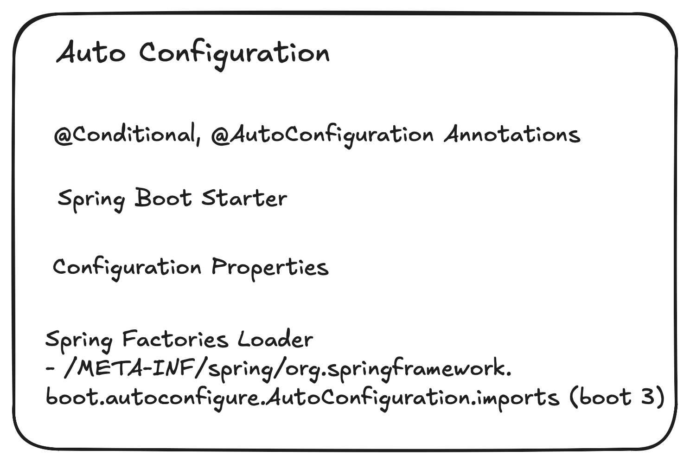
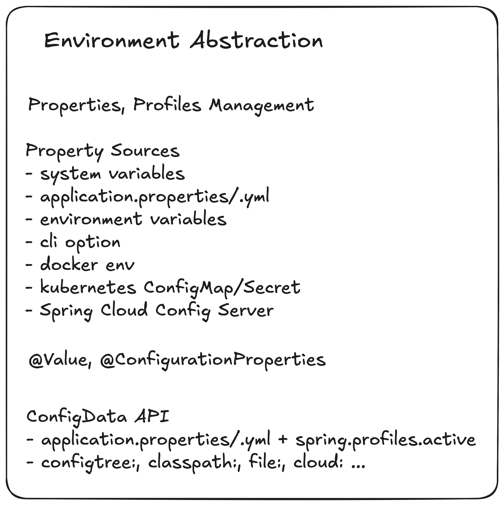
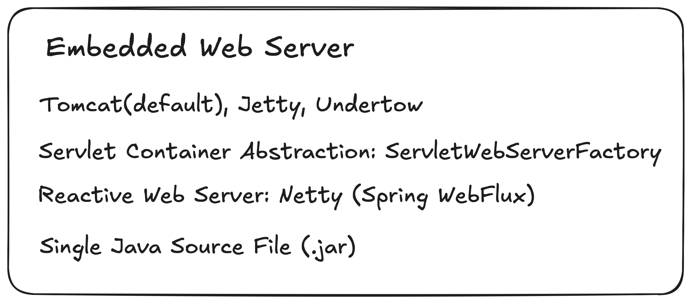
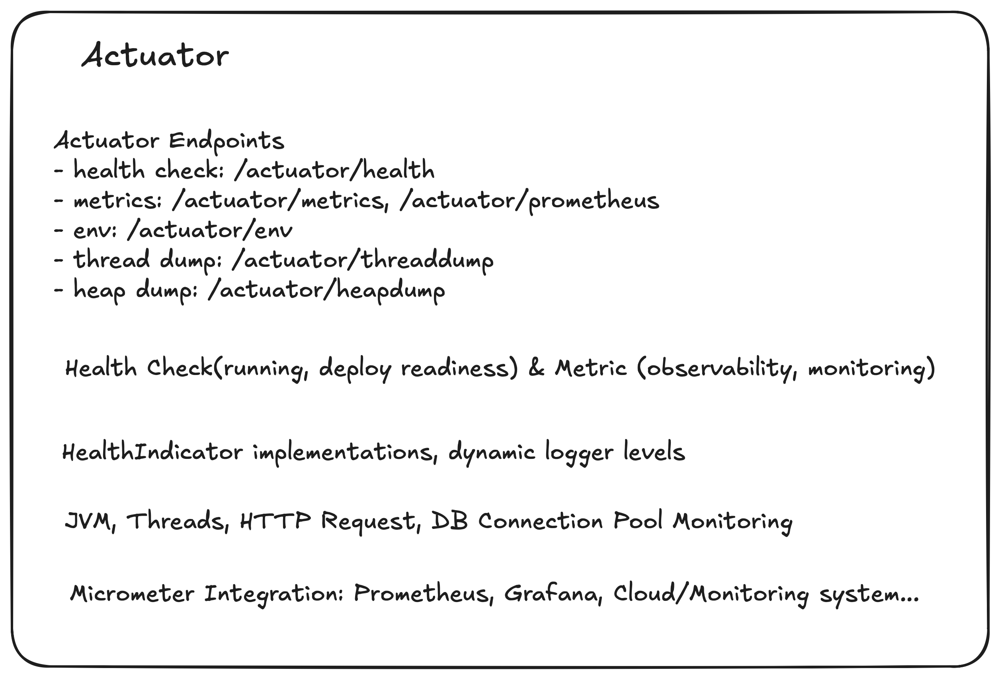
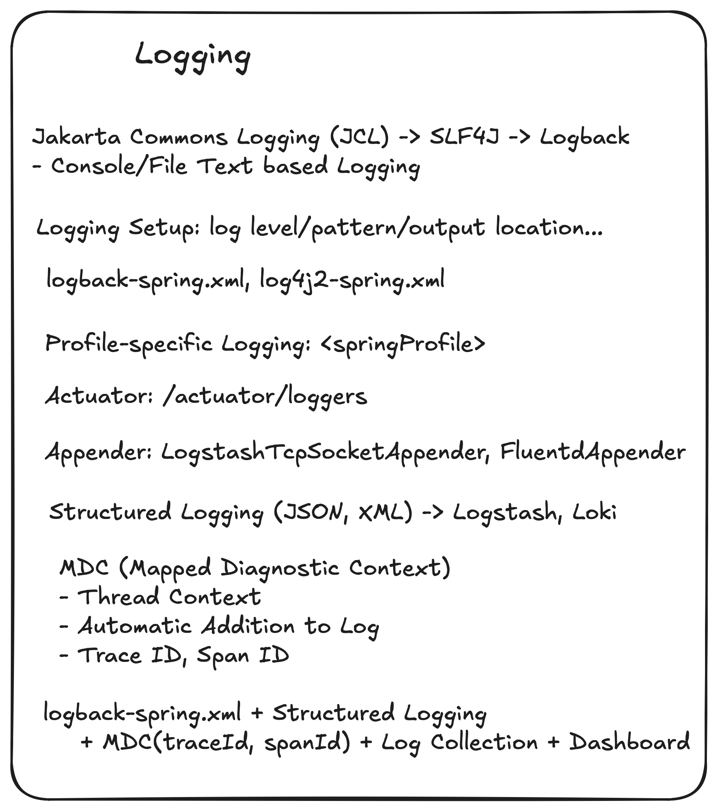
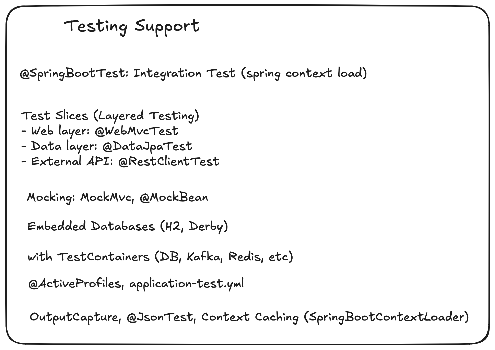

#### 인덱스
- [스프링 부트 애플리케이션 시작 흐름](#스프링-부트-애플리케이션-시작-흐름)
- [자동 구성](#자동-구성)
- [환경 추상화](#환경-추상화)
- [내장된 웹 서버](#내장된-웹-서버)
- [액추에이터](#액추에이터)
- [로깅](#로깅)
- [DevTools](#devtools)
- [테스트](#테스트)
- [빌드 지원](#빌드-지원)


## 스프링 부트 애플리케이션 시작 흐름

요약: SpringApplication 준비 -> Environment 설정 -> Context 생성/빈 정의 등록 -> 빈 인스턴스화 & 내장 서버 가동 -> Runner 실행 -> 런타임

### 1. JVM 가동, `SpringApplication.run()` 메서드 호출

`@SpringBooApplication` 클래스의 메인 메서드 진입 -> `SpringApplication.run()` 호출

```java
@SpringBootApplication
public class BootApplication {

    public static void main(String[] args) {
        SpringApplication.run(BootApplication.class, args);
    }
}
```

### 2. `SpringApplication` 준비

`SpringApplication` 객체 생성 - 애플리케이션 타입 결정(`WebApplicationType`: `NONE`, `SERVLET`, `REACTIVE`)

ApplicationContext 구현체 결정 - `AnnotationConfigServletWebServerApplicationContext` (서블릿)

### 3. `ApplicationContext` 생성 전처리

부트 스트랩 컴포넌트 등록: 리스너(`ApplicationListener`)와 초기화 클래스(`ApplicationContextInitializer`) (`META-INF/spring.factories` 파일) 

`SpringApplicationRunListeners` 실행: `listeners.starting()`

`Environment` 준비: `prepareEnvironment()` (프로퍼티 파일(`application.yml` 등), 시스템 변수, 커맨드 라인 인자 등 병합)

스프링 부트 애플리케이션 로딩 배너 프린팅: `printBanner()`

`ApplicationStartingEvent`, `ApplicationEnvironmentPreparedEvent` 이벤트 발행

### 4. `ApplicationContext` 생성 및 준비

애플리케이션 타입에 따른 `ApplicationContext` 구현체 인스턴스 생성
- 서블릿: `AnnotationConfigServletWebServerApplicationContext`
- 리액티브: `AnnotationConfigReactiveWebServerApplicationContext`
- 순수: `AnnotationConfigApplicationContext`

컨텍스트와 `Environment` 연결

빈 소스 등록
- 빈 소스: 빈 정의를 읽어들일 수 있는 소스 (애플리케이션이 어떤 클래스/리소스를 기반으로 빈들을 스캔 및 구성할지 컨텍스트에 알려준다)
- `@SpringBootApplication`
- `@Component`, `@Service`, `@Repository`, `@Configuration`
- `spring.factories`와 `spring-autoconfigure-metadata.properties`

자동 구성 후보(`AutoConfigurationImportSelector`) 로드

`ApplicationContextInitializedEvent` 이벤트 발행

### 5. 빈 정의(`BeanDefinition`) 로딩 및 등록

`@ComponentScan` 수행

`@Configuration` 클래스 파싱

자동 구성 클래스 조건 평가 (`@Conditional`) -> 필요한 빈 정의 추가

### 6. refresh `ConfigurableApplicationContext.refresh()`

빈 인스턴스화 및 의존성 주입

라이프사이클 콜백(`InitializingBean`, `@PostConstruct`) 호출

내장 서블릿 컨테이너(Tomcat/Jetty/Undertow) 기동

`ApplicationPreparedEvent` 이벤트 발행

### 7. `ApplicationRunner`, `CommandLineRunner` 실행

모든 컨텍스트 초기화를 끝내고 `ApplicationReadyEvent` 이벤트 발행

이후 `ApplicationRunner`와 `CommandLineRunner` 구현체 실행

### 8. 런타임

실제 애플리케이션 로직 수행(요청 처리, 스케줄링, 이벤트 핸들링 등)

### 9. 애플리케이션 종료

`SpringApplication.exit()` 호출 (옵션)

`@PreDestroy`, `DisposableBean` 실행

`ApplicationContextClosedEvent` 이벤트 발행


## 자동 구성



자동 구성은 스프링 부트가 제공하는 가장 핵심적인 기능으로 스프링 부트 차원에서 스프링 애플리케이션을 정상적으로 실행시키기 위해 필요한 설정들을 구성한 것을 말한다

**스프링 부트는 `spring-boot-autoconfigure` 모듈을 통해 애플리케이션 로드 시점에 클래스패스를 탐색해서 자동 구성과 관련된 아티팩트(jar)를 확인하고 그에 해당하는 자동 구성 클래스를 후보군으로 등록하고, 이후 각 클래스를 조건 평가하여 참인 경우 해당 라이브러리를 이용하기 위해 필요한 빈 등록, 프로퍼티 설정을 진행한다**  

자동 구성의 시작점: `AutoConfigurationImportSelector` (`@EnableAutoConfiguration`의 `@Import(AutoConfigurationImportSelector.class)`)

```java
public class AutoConfigurationImportSelector implements DefferedImportSelector {

    // spring-boot-autoconfigure jar 파일의 
    // META-INF/spring/org.springframework.boot.autoconfigure.AutoConfiguration.imports
    // 파일을 읽어 임포트할 컴포넌트 엔트리를 구성한다 (중복되거나 명시된 제외 목록 제거)
    @Override
    public String[] selectImports(AnnotationMetadata annotationMetadata) {
        AutoConfigurationEntry autoConfigurationEntry = getAutoConfigurationEntry(annotationMetadata);
        
        return StringUtils.toStringArray(autoConfigurationEntry.getConfigurations());
    }
}
```

애플리케이션 시작 속도를 개선하기 위해 `META-INF/spring-autoconfigure-metadata.properties` 메타데이터를 사용하여 조건들이 아예 맞지 않는 자동 구성 후보를 미리 제거할 수도 있다

로드된 자동 구성 후보군들은 `@AutoConfigureBefore` `@AutoConfigureAfter` `@AutoConfigureOrder` 등의 어노테이션을 통해 자동 구성 클래스간 적용 순서를 정렬한다

각 자동 구성 클래스와 `@Bean` 팩토리 메서드들은 여러 `@Conditional` 어노테이션(`@ConditionalOnClass`, `@ConditionalOnProperty` 등)의 평가를 통해 활성화 여부가 결정된다

클래스 레벨 조건이 실패하면 그 자동 구성 전체를 건너뛰고, 메서드 레벨 조건이 실패하면 특정 빈 등록만 건너뛴다

조건을 통과한 자동 구성 클래스는 `@Configuration` `@AutoConfiguration` 으로서 애플리케이션 컨텍스트에 등록되고 그 내부의 `@Bean` 메서드들이 실행되어 필요한 빈들이 등록된다

조건의 평가 결과는 **Conditions Evaluation Report(디버그 모드)**로 남고 액추에이터의 `/actuator/conditions` 엔드포인트로도 확인할 수 있다

자동 구성은 커스텀 정의 빈이 있으면 스스로 물러나는 **back-off** 설계를 채택한다 -> 직접 빈을 정의하면 자동 구성이 같은 역할의 빈을 등록하지 않는다

특정 자동 구성을 완전히 비활성화하려면 `@SpringBootApplication(exclude = ...)` 또는 프로퍼티 파일에 (`spring.autoconfigure.exclude`) 명시하면 된다


## 환경 추상화



스프링은 애플리케이션 코드가 실행 환경에 종속되지 않도록 하기 위해 `Environment` 라는 추상화 계층을 제공한다

이는 크게 `PropertySource`와 `Profile` 이라는 요소로 나뉜다

`PropertySource`
- 외부 설정 값(key-value)을 읽어오는 단일 설정 저장소
- 프로퍼티 파일, 시스템 환경 변수, 클라우드/도커/설정 서버 등이 될 수 있다
- 각 프로퍼티 소스는 우선순위를 가지며 충돌 시 우선순위가 높은 값이 적용된다

`Profile`
- 환경별 조건부 로딩
- 실행할 환경/컨텍스트를 논리적으로 구분한 이름
- `@Profile(dev)`와 같이 선언하면 특정 환경에서만 빈을 로드할 수 있다

**스프링 부트는 다중 프로퍼티 소스를 체인으로 관리해서 순서대로 로딩하고 키 충돌이 날 경우 앞에 있는 소스를 우선 적용한다**

여러 소스 자동 병합 + 우선순위 적용 + 환경별 분리 + 중앙 관리 가능 + 클라우드에 친화적인 메커니즘을 통해 개발자에게 편리함을 제공한다

프로퍼티 파일(`application.yml`, `application.properties`)는 루트 경로(`classpath:/`, `src/main/resources`)에서 로드되는데 프로파일 별로 파일을 구분할 수 있다

파일명 규칙: `application-{profile}.yml`
- application-dev.yml
- application-test.yml
- application-prod.yml

`@Profile("dev")`, `spring.profiles.active=dev` 등으로 특정 프로파일을 활성화하면 `application.yml`(공통)을 먼저 읽고 `application-dev.yml` 파일을 로딩한다 (해당 프로파일의 프로퍼티 값이 우선 적용된다)

테스트에서는 `src/test/resources`의 파일이 우선 적용되며 `@ActiveProfiles`을 통해 특정 프로파일을 활성화하여 해당 환경에 맞는 프로퍼티 파일을 로드할 수 있다

또는 `@TestPropertySoucre`를 사용하여 특정 테스트에서 특정 프로퍼티를 오버라이드할 수도 있다


## 내장된 웹 서버



기존 스프링은 웹 애플리케이션을 WAR 파일로 빌드하고 외부 WAS(Web Application Server)에 배포하는 방식으로 동작했다

이는 운영 환경마다 WAS 설치/버전 관리를 필요로 하며 인프라 종속성을 높여 CI/CD나 클라우드 환경에서 비효율적이었다

**스프링 부트는 WAS를 외부에 두지 않고 애플리케이션 안에 내장한다**

기본적으로 톰캣이 내장되어 있으며 필요에 따라 Jetty나 Undertow로 선택할 수 있다

스프링 부트 애플리케이션 실행 시 컨텍스트를 초기화하면서 내장 서버를 생성하고 자동 시작한다

```text
1. SpringApplication.run() -> AnnotationConfigServletWebServerApplicationContext 준비
2. WebServerFactoryAutoConfiguration -> TomcatServletWebServerFactory 생성
3. 컨텍스트 refresh 시점에 서버(톰캣 인스턴스) 가동
4. 서블릿 컨텍스트와 DispatcherServlet 연결 -> 요청 처리 시작
```

기존 스프링 배포 방식과 달리 JAR 파일로 빌드하여 `java -jar app.jar`처럼 순수 자바 명령어를 통해 서버를 가동시키는 방식은 다음과 같은 장점을 가진다

애플리케이션 모듈화 및 경량화할 수 있다

도커나 쿠버네티스같은 컨테이너 배포 환경에 적합하다

내장 서버 버전이 애플리케이션 빌드와 일관되어 로컬/테스트/운영 환경이 동일하게 동작한다

클라우드 배포 시 WAS 설치/운영 관리를 하지 않아도 된다 -> 간편한 스케일 아웃 


## 액추에이터



스프링 부트 액추에이터는 운영 중인 애플리케이션을 모니터링하고 관리할 수 있도록 **엔드포인트와 메트릭을 제공**하는 모듈이다

**애플리케이션 헬스 체크, 메트릭, 로그 설정, 환경 정보 등을 확인하고 제어할 수 있다**

스타터 의존성만 추가하면 자동으로 내장된다 `org.springframework.boot:spring-boot-starter-actuator`

#### 헬스 체크
- `/actuator/health`
- DB, 캐시, 메시지 브로커, 디스크 공간 등 연결된 컴포넌트 상태 확인 가능
- 쿠버네티스 liveness/readiness probe와 연동하여 자동 장애를 감지할 수 있다

#### 메트릭 수집
- `/actuator/metrics`
- JVM 메모리, GC, CPU 사용량, 스레드 수, HTTP 요청 수/처리 시간 등의 수치 제공
- Micrometer를 통해 Prometheus, Datadog, CloudWatch 등의 외부 모니터링 시스템과 쉽게 연동할 수 있다

#### 환경 정보
- `/actuator/env`
- 현재 로딩된 프로퍼티 값, 활성화된 프로파일, 환경 변수 확인 가능

#### 로깅 설정
- `/actuator/loggers`
- 애플리케이션 실행 중 동적으로 로깅 레벨 조정 가능

#### 스레드 덤프, 힙 덤프
- `/actuator/threaddump`, `/actuator/heapdump`
- JVM 내부 상태 실시간 확인 가능 - 장애 원인 분석

기본적으로 제공되는 엔드포인트 이외에도 `@Endpoint` 또는 `@WebEndpoint`로 커스텀 엔드포인트를 정의할 수 있다

운영 환경에서 모든 액추에이터 엔드포인트를 노출시키는 것은 보안상 위험하기 때문에 필요한 엔드포인트만 공개하거나 스프링 시큐리티와 결합하여 인증/인가를 적용시킬 수 있다

```yaml
management:
  endpoints:
    web:
      exposure:
        include: health, metrics, loggers
```


## 로깅



**스프링 부트는 slfj4와 logback, log4j-to-slf4j를 사용하여 로깅을 지원한다** (`spring-boot-starter-logging` 모듈)
- SLF4J(Simple Logging Facade for Java): 자바 로깅 표준 추상화, 애플리케이션 코드는 SLF4J API를 사용하여 로깅한다
- Logback: 스프링 부트의 기본 로거 구현체

스프링 부트는 애플리케이션 시작 시 Logback을 초기화하고 루트 또는 패키지 별 로거에 설정된 Appender(출력 장치)를 바인딩한다

`application.yml` 프로퍼티 파일에서 로그 레벨같은 간단한 설정을 제어하거나 `logback-spring.xml`로 세부적으로 구성할 수 있다 (스프링 환경 참조 가능)

**구조화된 로그(Structured Logging)** 는 로그를 사람이 읽기 쉬운 텍스트가 아니라 키-값 형태로 기록하여 검색/필터링/분석에 적합하도록 만드는 방식을 말한다

Logback에 특정 인코더를 설정하여 구조화된 로그의 포맷에 맞게 로그 데이터를 만들 수 있다 

일반적으로 timestamp, level, service, env, logger, thread, message, exception, traceId, spanId, requestId 등을 필드로 사용한다

MDC(Mapped Diagnostic Context)를 이용하면 요청/스레드 단위 컨텍스트(traceId, spanId 등)를 로그에 포함시킬 수 있다

분산 환경에서 요청 흐름을 분석하기 위해 사용하는데 트레이싱 라이브러리(OpenTelemetry 등)에서 traceId/spanId를 생성 또는 전달하고 이를 MDC에 넣으면 로그는 자동으로 이 데이터를 포함시킨다

로그 저장소에서 traceId를 기반으로 여러 서비스의 로그를 연결하여 요청의 순차적인 흐름을 파악할 수 있다

### 로그 전송/수집 아키텍처

Push 방식
- 로거 Appender를 이용하여 중앙 수집 시스템으로 직접 보내는 방식
- LogstashTcpSocketAppender, HTTP appender, Kafka appender
- 간단하며 실시간으로 전송할 수 있다
- 애플리케이션 성능에 영향을 끼치며, 반드시 비동기/버퍼링이 필요하다

```xml
<configuration>
    <springProperty name="service" source="spring.application.name" defaultValue="app"/>
    
    <appender name="LOGSTASH" class="net.logstash.logback.appender.LogstashTcpSocketAppender">
      <destination>logstash.example.com:5000</destination>
      <encoder class="net.logstash.logback.encoder.LogstashEncoder">
        <customFields>{"service":"${service}"}</customFields>
      </encoder>
    </appender>
    
    <appender name="ASYNC" class="ch.qos.logback.classic.AsyncAppender">
      <appender-ref ref="LOGSTASH"/>
      <queueSize>512</queueSize>
      <discardingThreshold>0</discardingThreshold>
    </appender>
    
    <root level="INFO">
      <appender-ref ref="ASYNC"/>
    </root>
</configuration>
```

#### Agent/Sidecar 방식
- 로거가 STDOUT 또는 파일에 구조화된 로그 기록
- 로그 수집 에이전트(Fluent Bit, Promtail 등)가 로그 데이터를 수집하여 중앙으로 전송(Loki, ELK 등)
- 재시도/백프래셔 처리를 에이전트에 위임하고 로그를 원격 전송하지 않기 때문에 애플리케이션이 최소 부담만 가진다

```xml
<configuration>
  <springProperty name="service" source="spring.application.name" defaultValue="app"/>
    
  <appender name="CONSOLE" class="ch.qos.logback.core.ConsoleAppender">
    <encoder class="net.logstash.logback.encoder.LogstashEncoder">
      <customFields>{"service":"${service}","env":"${spring.profiles.active:local}"}</customFields>
    </encoder>
  </appender>

  <root level="INFO">
    <appender-ref ref="CONSOLE"/>
  </root>
</configuration>
```

성능/신뢰성 운영 고려사항
- 비동기 전송 필요: AsyncAppender 또는 에이전트 패턴으로 앱 스레드 차단 방지
- 큐 설정: queueSize, discardingThreshold 조정. 큐가 가득하면 로그 드랍을 허용할지(Discard) 또는 백프레셔(지연)를 택할지 정책 수립
- 디스크 버퍼(스풀링): 중요 로그 유실 방지 위해 로컬 파일로 스풀링 후 에이전트가 전송하도록 설계(에이전트가 재시도/전송 관리)
- FailoverAppender / Retry: 주요 appender 실패 시 다른 경로(로컬파일)로 우회
- 로그 카드뮬러티 주의: 인덱스(label)에 고카디널리티 값(예: userId, requestId)을 넣으면 추적은 쉬워지지만 로그 스토리지 비용 상승 및 검색 성능 저하. 라벨은 low-cardinality(서비스, 환경, 호스트) 위주로, 상세한 식별자는 로그 본문 필드로 유지
- 샘플링: 고빈도 로그(TRACE/DEBUG/HTTP ACCESS) 샘플링 적용. (특히 JSON 로그의 비용 문제)

보안/규정 준수
- 민감정보(PII, 비밀번호, 토큰) 절대 로그 금지. 마스킹/마스킹 라이브러리 사용 권장
- 로그 접근 제어: 중앙 로그 저장소(Elasticsearch 등)에 대한 인증/권한 체계 설정
- 보관정책: 보관기간·암호화·감사로그 정책 수립

로깅 vs 모니터링 vs 트레이싱
- 로깅: 사건 기록(텍스트/JSON) - 디버깅
- 모니터링: 수치 시계열 - 성능/상태 모니터링
- 트레이싱: 분산 호출의 타임라인 - 지연/병목 파악
- 세 가지를 연계하여 관찰성(Observability) 완성 (traceId로 로그 연결, 메트릭으로 SLA 모니터링)

권장 실무 패턴
- 쿠버네티스/클라우드: 표준 출력에 구조화된 로그(JSON) 출력 -> 에이전트(Fluent Bit)로 수집 -> 중앙 파이프라인(Logstash) -> 저장소(Elastic/Loki) -> Grafana/Kibana
- MDC에 traceId/spanId/requestId 포함: 트레이스와 로그를 연계하여 장애 분석 시간 단축
- OpenTelemetry: 분산 트레이스 표준, 자동 계측 및 MDC 연동을 통해 로그-트레이스 연계 자동화
- AsyncAppender + local spool 또는 stdout + agent


## DevTools

DevTools는 **스프링 부트에서 제공하는 개발 지원 도구 모음**으로 빠른 피드백(Hot Relaod), 로그 개선, 환경 편의 등을 제공한다

그레이들 기준으로 developmentOnly configuration을 사용하여 운영 환경 빌드에 포함하지 않는다

```kotlin
developmentOnly("org.springframework.boot:spring-boot-devtools")
```

#### 자동 재시작

클래스패스 변화를 감지하여 애플리케이션 컨텍스트를 자동으로 재시작한다

클래스 로더를 스프링/서드파티 라이브러리용(base) 와 사용자 애플리케이션 코드용(restart)으로 나누어 라이브러리는 재로딩하지 않는다 -> 재시작 시간 최소화

`spring.devtools.restart.exclude` 프로퍼티에 자동 재시작에 제외할 패키지를 설정할 수 있다

#### 라이브 리로드

브라우저와 연동하여 HTML/CSS/JS 변경 시 자동으로 새로고침이 된다

내장 LiveReload 서버를 제공한다

#### 프로퍼티 기본 값

개발 환경에서 편리하도록 다음과 같은 기본값을 적용한다
- 캐시 무효화: `spring.thymeleaf.cache=false` (템플릿 바로 반영)
- H2 콘솔 자동 활성화: `spring.h2.console.enabled=true`

#### 원격 재시작

로컬 IDE가 아닌 원격 서버에서 DevTools를 사용할 수 있다

`spring.devtools.remote.secret` + 원격 서버 포트를 설정하면 네트워크를 통해 개발 코드를 원격에서 반영할 수 있다

VM/컨테이너 내부에서 테스트를 할 수 있으며, 로컬에서 IDE로 코드 수정 후 반영할 수 있다

#### 로깅 개선

로그 레벨을 INFO에서 DEBUG 레벨로 자동 변경할 수 있다

또한 자동 재시작 후 로그를 정리하여 로그를 읽기 편리하게 유지해준다


## 테스트



```kotlin
testImplementation("org.springframework.boot:spring-boot-starter-test")
```

스프링 부트 테스트 스타터에 포함되는 라이브러리
- JUnit5: 테스트 프레임워크
- Spring Test: 스프링 테스트 컨텍스트
- AssertJ: Fluent Assertion
- Mockito: Mocking
- Hamcrest: Matcher 기반 검증
- JsonPath: JSON 응답 검증

#### `@SpringBootTest`

애플리케이션 전체 컨텍스트 로딩 후 테스트 -> 실제 스프링 부트 애플리케이션과 유사하게 동작하는 환경에서 테스트 수행

webEnvironment 속성
- MOCK: MockServlet 환경 (default)
- RANDOM_PORT: 실제 톰캣 랜덤 포트 사용 (서블릿, 리액티브), `@LocalServerPort`로 랜덤 포트 접근 가능
- DEFINED_PORT: 리액티브 웹 컨텍스트
- NONE: 웹 서버 사용 안함

### 슬라이스 테스트

슬라이스 테스트는 부분별로 필요한 컨텍스트만 로딩하여 테스트 시간을 단축시킨다

`@WebMvcTest`: 컨트롤러, MVC 관련 컴포넌트, `MockMvc` 및 스프링 시큐리티 자동 구성

`@DataJpaTest`: JPA/Hibernate, 리포지토리 계층, H2 인메모리 DB

`@JdbcTest`: JDBC 기반 컴포넌트 테스트

`@RestClientTest`: `RestTemplate` `WebClient` 호출 테스트

`@JsonTest`: Jackson ObjectMapper 직렬화/역직렬화 테스트

`@SpringBootTest` + `ActiveProfiles("specific-profile")`: 전체 컨텍스트 + 테스트 전용 프로파일 로딩

`@ActiveProfiles("test")` -> application-test.yml 파일을 우선 적용한다 (application.yml 공통 파일도 적용됨)

### `@MockBean` `@SpyBean`

테스트 컨텍스트에 해당 타입의 스프링 빈을 Mock 또는 Spy로 등록한다

의존성있는 서비스나 외부 API 호출을 Mock 처리할 수 있다 (가독성, 독립성 확보)

```java
@WebMvcTest(OrderController.class)
class OrderControllerTest {

    @MockBean
    private OrderService orderService;

    @Autowired
    private MockMvc mockMvc;
}
```

### `TestRestTemplate`, `WebTestClient`

통합 테스트 시 HTTP 호출을 통한 검증을 진행할 수 있다

`WebTestClient`는 WebFlux 환경에서 비동기 테스트 가능

```java
@SpringBootTest(webEnvironment = SpringBootTest.WebEnvironment.RANDOM_PORT)
class OrderIntegrationTest {

    @Autowired
    private TestRestTemplate restTemplate;

    @Test
    void testOrder() {
        ResponseEntity<String> response = restTemplate.getForEntity("/orders/1", String.class);
        assertEquals(HttpStatus.OK, response.getStatusCode());
    }
}
```

### 테스트 데이터 초기화

`@Sql`, `@SqlGroup`: 테스트 전후 SQL 스크립트 실행

`@Transactional`: 테스트 종료 시 DB 롤백

`@AutoConfigureTestDatabase`: 임시 DB 자동 구성(H2, Derby)


## 빌드 지원


**스프링 부트는 개발자가 작성한 애플리케이션을 배포 가능한 아티팩트(JAR, OCI 이미지 등)로 만들어주기 위한 빌드 지원 기능을 제공한다**

전통적인 자바 빌드 방식이나 클라우드/컨테이너에 친화적인 형태로 애플리케이션을 패키징할 수 있도록 돕는다

### Spring AOT (Ahead-of-Time)

Spring AOT란 런타임에 수행되던 스프링 프레임워크의 많은 리플렉션, 프록시, 동적 바인딩 작업을 빌드 타임에 미리 분석하고 최적화하는 작업이다

GraalVM 등의 네이티브 이미지를 만들 때 이러한 처리가 필요한데 스프링 부트는 메이븐이나 그레이들을 통해 AOT 빌드 플러그인을 제공한다

그래서 스프링 부트를 빌드할 때 플러그인이 동작하여 빈 정의, 조건부 구성(`@Conditional`), 리플렉션 메타데이터 등을 미리 계산하여 `generated` 코드로 변환한다

시작 시간을 단축시키고 메모리 사용량을 절감하며 GraalVM 네이티브 이미지 지원 기반을 마련할 수 있다

### GraalVM Native Image

GraalVM Native Image는 스프링 부트 애플리케이션을 **네이티브 실행 파일(standalone binary)** 로 빌드할 수 있는 기능이다 (Spring Native)

JVM 없이 실행 파일로만 동작하여 메모리 효율을 대폭 상승시키고 콜드 스타트를 매우 빠르게 한다

주로 FasS 플랫폼-서버리스 환경(AWS Lambda, Google Cloud Functions)이나 컨테이너 환경(빠른 부팅이 필요한 경우)에서 사용된다

### Layered JAR

Layered JAR이란 스프링 부트의 Fat JAR(애플리케이션 코드 + 의존성 + 런타임, bootJar) 구조를 여러 레이어로 나눈 JAR 파일을 말한다

레이어 분리 (예시)
- Dependencies Layer (라이브러리)
- Spring Boot Loader Layer
- Application Resources Layer
- Application Classes Layer

도커 이미지 빌드 시 레이어 캐싱을 최적화하여 특정 레이어만 다시 빌드하여 빌드 속도를 향상시킬 수 있다

### Buildpacks

Buildpacks는 Dockerfile 없이 애플리케이션을 OCI(컨테이너) 이미지로 빌드하는 표준화된 방식이다

그레이들 bootBuildImage 태스크를 통해 OCI 이미지로 빌드할 수 있다 (Cloud Native Buildpacks + Paketo Buildapcks)

도커 파일을 작성하지 않고 보안 패치/런타임 관리/JVM 버전을 자동화해준다

