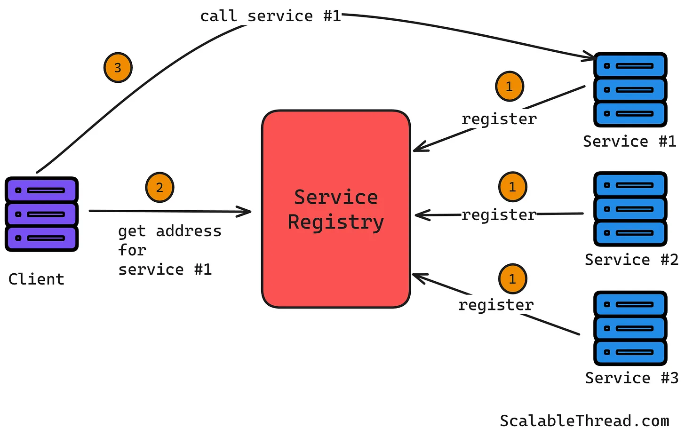
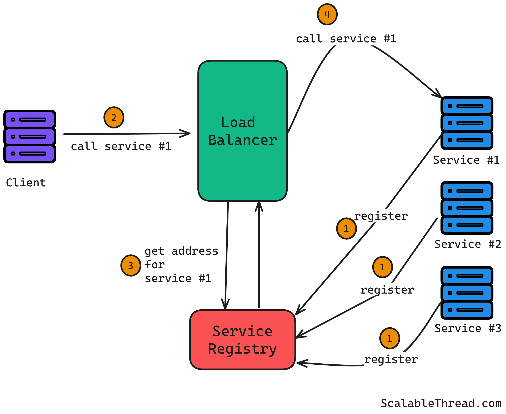
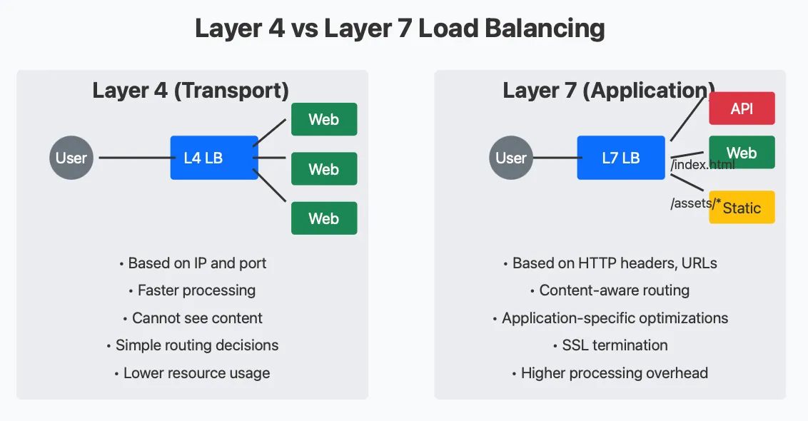
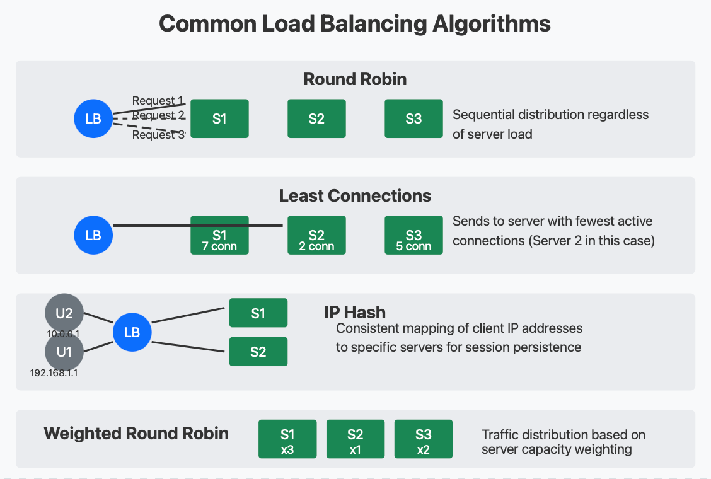
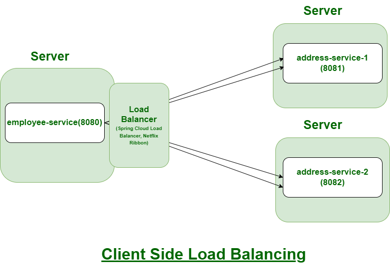
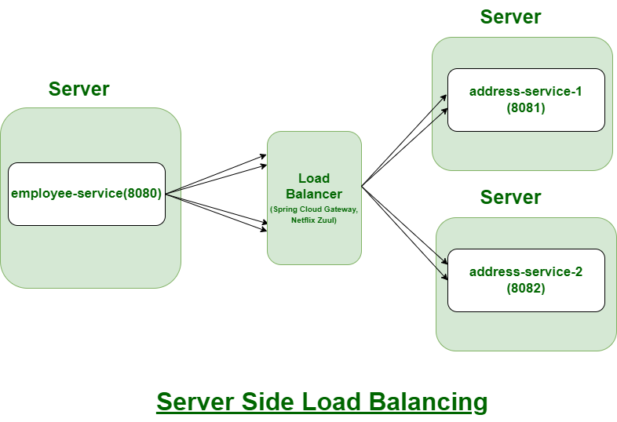
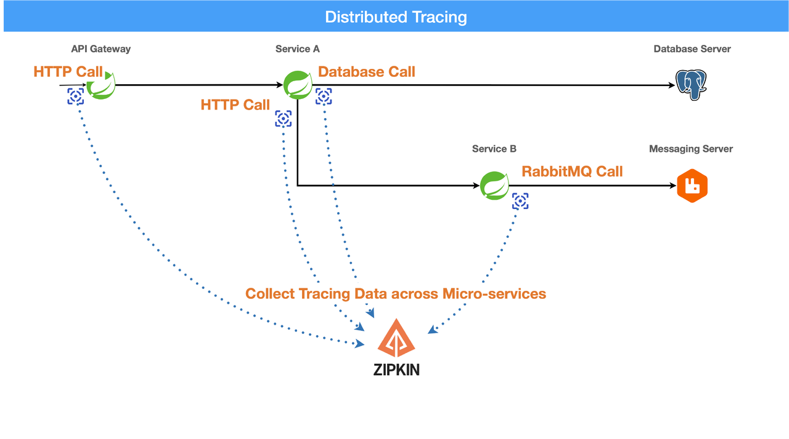

인덱스
- [스프링 클라우드와 MSA](#스프링-클라우드와-msa)
  - [서비스 디스커버리: 서비스 동적 라우팅](#서비스-디스커버리-서비스-동적-라우팅)
  - [설정 관리: 중앙 집중식 설정 관리](#설정-관리-중앙-집중식-설정-관리)
  - [부하 분산: 로드밸런싱](#부하-분산-로드밸런싱)
  - [장애 허용과 회복성](#장애-허용과-회복성)
  - [API 게이트웨이](#api-게이트웨이)
  - [분산 추적](#분산-추적)
- [스프링 클라우드 주요 모듈](#스프링-클라우드-주요-모듈)
- [클라우드 네이티브, CNCF 기술들](#클라우드-네이티브-cncf-기술들)
  - [쿠버네티스(k8s): 스케줄링 및 오케스트레이션](#쿠버네티스k8s-스케줄링-및-오케스트레이션)
  - [Envoy: 서비스 프록시](#envoy-서비스-프록시)
  - [Linkerd: 서비스 메시](#linkerd-서비스-메시)
  - [Istio: 서비스 메시](#istio-서비스-메시)
  - [gRPC: 원격 프로시저 호출](#grpc-원격-프로시저-호출)
- [MSA 프레임워크 종류](#msa-프레임워크-종류)


## 스프링 클라우드와 MSA

스프링 클라우드는 넷플릭스 OSS를 본따 만들어진 MSA 구축에 적합한 스프링 기반의 프레임워크 모음이다

단순히 스프링 생태계와 통합될 뿐만 아니라 쿠버네티스 및 클라우드 네이티브 환경과도 긴밀하게 연동된다

스프링 데이터 프로젝트와 마찬가지로 클라우드 네이티브와 관련된 기능별로 하위 프로젝트가 구현되어 있어 필요한 모듈만 채택하여 유연하게 클라우드 기능을 구현할 수 있다

넷플릭스 OSS는 스프링 클라우드 도입 이전 시점에 넷플릭스에서 MSA 환경을 효율적으로 운영하기 위해 자체적으로 개발한 오픈소스 프로젝트/라이브러리 모음(Eureka, Hystrix, Ribbon, Zuul 등)이다

마이크로서비스 아키텍처는 단순히 서비스를 분할하고 각기 다른 인스턴스에 애플리케이션을 로드하는 것으로 완성되지 않는다

여러 개의 서비스가 협력하는 환경에서 발생하는 운영상의 복잡성을 효과적으로 해결해야 한다

스프링 클라우드는 이러한 복잡성을 줄이고 MSA 환경을 안정적으로 운영할 수 있도록 다음과 같은 기능을 제공한다

### 서비스 디스커버리: 서비스 동적 라우팅

서비스 디스커버리란 동적으로 변하는 서비스의 위치(IP, Port)를 서비스 이름으로 찾아주는 기능이다

애플리케이션 계층에서 동적으로 동작하는 소규모 DNS라고 볼 수 있다

MSA 환경에서는 서비스가 동적으로 배포되고 확장되므로 각 서비스의 위치를 고정할 수 없기 때문에, 각 서비스(인스턴스의 모음)가 중앙 레지스트리에 자신의 정보를 등록하고 다른 서비스가 이를 동적으로 검색할 수 있도록 지원한다

따라서 각 서비스의 IP와 포트 정보를 직접 알지 않아도 통신할 수 있게 된다

**주요 역할**
- 서비스 위치 동적 관리: 서비스 인스턴스가 생성되거나 제거될 때마다 서비스 레지스트리에 등록/해제하여 최신 서비스 위치 정보를 관리한다
- 서비스 간 통신 지원: 클라이언트가 서비스 레지스트리에 쿼리하여 원하는 서비스의 IP와 포트를 알아낸 후 로드 밸런싱 알고리즘을 이용해 서비스를 호출한다

서비스 디스커버리는 크게 **클라이언트 사이드 디스커버리**와 **서버 사이드 디스커버리**로 나뉜다

#### 클라이언트 사이드 디스커버리



클라이언트 사이드 디스커버리에서 클라이언트는 서비스 레지스트리를 통해 사용 가능한 서비스의 인스턴스들을 쿼리한다

그리고 로드밸런싱 알고리즘을 사용하여 요청을 수행하기 적합한 인스턴스를 선택한다

주요 도구
- Netflix Eureka: 오픈 소스 레지스트리 서비스 서버로 스프링 클라우드 Netflix에서 주로 사용된다. 서비스 인스턴스 등록 및 조회 API를 제공한다
- Neflix Ribbon: 유레카와 함께 사용되어 클라이언트 측 가용 가능한 인스턴스 찾기, 로드밸런싱을 수행한다

#### 서버 사이드 디스커버리



서버 사이드 디스커버리에서 클라이언트는 라우터 또는 로드밸런서의 알려진 주소로 요청을 전송하기만 한다

라우터/로드밸런서가 서비스 레지스트리로부터 사용 가능한 서비스의 인스턴스들을 쿼리하고 특정 인스턴스를 선택한 뒤 클라이언트 요청을 포워딩한다

주요 도구
- AWS ELB(Elastic Load Balancer): AWS 환경에서 서버 사이드 디스커버리 라우터
- K8s Service: k8s 환경에서 "Service"라는 추상화된 개념을 통해 서버 사이드 디스커버리를 지원한다 (DNS 기반 서비스 위치 찾기)

#### 서비스 레지스트리 도구

클라이언트/서버 사이드 방식 모두에 사용될 수 있는 독립 실행형 솔루션이다

HashiCorp Consul: 서비스 등록 및 서비스 상태 모니터링 등의 기능을 모두 갖춘 솔루션으로 DNS 기반 서비스 디스커버리를 제공한다

Apache ZooKeeper: 분산 코디네이션 서비스로 서비스 디스커버리 외에도 분산 시스템에서 다양한 설정 관리와 동기화 작업을 지원한다

etcd: k8s에서 핵심 데이터 저장소로 사용되며 분산 시스템 설정 및 상태 정보를 활용하는데 사용된다. 서비스 디스커버리 구현에도 사용할 수 있다

### 설정 관리: 중앙 집중식 설정 관리

분산 설정 관리란 MSA 환경에서 각 서비스의 다양한 환경 설정(application.yml, 데이터베이스, API 키 등)을 중앙에서 통합하여 관리하는 것을 말한다

각 서비스를 독립적으로 배포하고 운영하며, 설정 변경 시 모든 서비스에 동일한 변경 사항을 적용하고 환경별 설정을 쉽게 분리하기 위한 필수 작업이다

**스프링 클라우드 설정 관리에 관여하는 구성 요소**
- Config Server: 설정 소스(Git, SVN, 파일 시스템 등)로부터 설정 파일을 로드하고 각 서비스에 설정을 제공하는 중앙 설정 서버 (스프링 애플리케이션)
- Config Repository: 실제 설정 파일이 저장되는 원본 저장소 (주로 Git)
- Config Client: Config Server로부터 설정을 가져오는 서비스 인스턴스
- Spring Cloud Bus (Optional): Config 변경을 이벤트로 전달하여 Config Client들이 실시간 반영하도록 브로커 역할을 수행 (RabbitMQ, Kafka 메시지 브로커 사용)

스프링 클라우드 버스를 사용하는 경우 자동으로 이벤트가 전파되어 무중단 운영을 할 수 있지만 Config Server만 사용하는 경우엔 서비스 인스턴스를 재시작하거나 `/actuator/refresh` API를 호출하여 수동으로 갱신해야 한다


### 부하 분산: 로드밸런싱

**부하(Load)** 는 **시스템이 처리해야 하는 작업량**을 의미하므로 애플리케이션이 수행해야 할 연산, 처리할 데이터, 유지해야 할 연결 상태 등의 의미를 모두 포함한다

보통 웹 서비스에서는 부하의 대부분이 클라이언트 요청으로부터 발생하므로 넓은 의미에서 "클라이언트의 요청(네트워크 트래픽)이 곧 부하"라고 해석할 수 있다

과부하가 될 때, 즉 네트워크 트래픽이 폭증할 때 이를 여러 서버 인스턴스에 균등하게 나누는 것이 **부하 분산**이다

이외에도 데이터 부하(대량 I/O), CPU 부하(복잡한 비즈니스 로직), 메모리 부하(대량 객체 로딩), 백그라운드 부하(배치 잡) 등의 다양한 부하와 각 상황에 맞는 부하 분산 방법이 있다

|상황|부하 주요 원인|부하 분산 포인트|
|---|---|---|
|네트워크 트래픽 폭증|HTTP 요청 수|L4/L7 로드밸런서 (NginX, ELB 등)|
|무거운 데이터베이스 쿼리|SQL 처리량|Read 레플리카 또는 샤딩|
|높은 비동기 큐 소비량|메시지 수신량|Consumer Group 확장|
|CPU 연산 집중|CPU 사용률|오토 스케일링, Job 분산|



**L4 로드밸런서**
- OSI 4계층(전송 계층)에서 TCP/UDP 포트 기반의 트래픽을 분산하는 로드밸런서
- HTTP 내용(헤더, URI, 쿠키)은 모르고 IP + Port 기반으로 라우팅한다 -> 프로토콜 독립적
- 속도가 빠르며 부하가 적다 -> 처리량 높음
- 세션 스티키나 경로 기반 라우팅은 불가능 -> 세밀한 정책 제어 불가
- Linux IPVS, HAProxy(L4 mode), AWS NLB, GCP TCP LB 등

```text
클라이언트
   ↓
[L4 Load Balancer]
   ↓
 ├─ Server A: 10.0.0.11:8080
 └─ Server B: 10.0.0.12:8080

// 단순히 TCP 연결 수, 응답 속도 등을 기준으로 라우팅할 서버를 선택한다
```

**L7 로드밸런서**
- OSI 7계층(응용 계층)에서 애플리케이션 프로토콜(HTTP, gRPC, WebSocket)의 내용을 분석해서 트래픽을 분산하는 로드밸런서 
- HTTP/S 요청 해석 가능(헤더, 쿠키, 요청 경로)
- 도메인, 쿠키, 사용자 기반 라우팅 가능
- 세션 스티키 지원
- SSL/TLS 종료 가능
- 인증, 로깅, 보안 정책, A/B 테스트, Canary 배포 등과 통합 용이
- Nginx, Envoy, HAProxy(L7 mode), Spring Cloud Gateway, Istio Ingress, AWS ELB 등

```text
클라이언트
   ↓
[L7 Load Balancer]
   ├─ /api/user → Server A
   ├─ /api/admin → Server B
   └─ /static → CDN

// 요청 내용 기반으로 라우팅을 세밀하게 제어할 수 있다
```

아래와 같이 L4와 L7 로드밸런서를 혼합 구성할 수도 있다

```text
(외부 요청)
   ↓
[ L4 LB ]  ← 빠른 연결 분산
   ↓
[ L7 LB / API Gateway ]  ← 세밀한 라우팅, 인증, 로깅
   ↓
[ 애플리케이션 인스턴스들 ]
```



로드밸런서는 클라이언트의 요청을 적절한 서버 인스턴스에게 라우팅하기 위해 로드밸런싱 알고리즘을 사용한다

**라운드 로빈(Round Robin)**
- 요청을 순차적으로 서버에게 전달하는 방법
- 모든 서버가 같은 처리량을 감당할 수 있을 때 공평하게 요청을 분배하기에 좋다
- 다만 서버의 처리 능력이나 요청마다 다른 복잡성을 고려하지 않는다

**최소 연결수(Least Connections)**
- 로드 밸런서가 각 서버에 활성화된 연결수를 추적하고 가장 적은 활성화된 연결수를 가진 서버에게 요청을 라우팅한다
- 서버마다 처리 능력이 다르거나 요청 처리 소요 시간이 다양할 때 사용하기 적합하다
- 요청 수만으로 실제 서버의 부하를 반영하지 못할 때가 많다

**IP 해시(IP Hash)**
- 클라이언트의 IP 주소를 해시하여 특정 서버에 전달하는 방법
- 동일한 IP의 클라이언트 요청은 항상 같은 서버로 보낸다 (세션 유지 가능)
- 많은 사용자가 동일한 IP 주소를 사용한다면 고르지 못한 라우팅 분배가 발생한다

**Weighted Methods(Weighted Round Robin)**
- 관리자가 각 서버의 처리 능력에 따라 무게를 할당하며, 높은 무게를 가진 서버가 더 많은 트래픽을 감당하는 방법
- 다양한 성능을 가진 서버가 있을 때 사용하기 적합하다
- 수동적으로 구성 및 조정해야 한다

**응답 시간(Response Time)**
- 응답 속도가 빠른 서버로 부하를 분배하는 방법
- 최소 지연 시간을 가져야 하는 성능 중심 애플리케이션에서 사용한다
- 특정 서버에 부하가 몰려 해당 서버의 응답 속도가 느려질 수 있다

**Random with Two Choices**
- 로드밸런서가 랜덤으로 두 개의 서버를 고르고 그 중 적은 연결 수를 가진 서버에게 요청을 라우팅하는 방법
- 최소 연결 수와 달리 모든 서버의 활성화된 연결수를 지속적으로 모니터할 필요가 없다
- 모든 서버를 모니터하는 것만큼 정확성이 좋지 않지만 효율적이고 확장성이 뛰어나다

스프링 클라우드에선 주로 **스프링 클라우드 로드밸런서**와 **스프링 클라우드 게이트웨이** 모듈이 서로 다른 계층과 목적으로 부하 분산을 담당한다
- Spring Cloud LoadBalancer: Netflix Ribbon 대체제, 클라이언트 사이드 로드밸런싱(서비스 내부, 마이크로서비스 간 통신)
- Spring Cloud Gateway: 서버 사이드 라우팅 + L7 로드밸런싱(외부 요청 진입점)

#### 스프링 클라우드 로드밸런서



클라이언트 단에서 부하 분산을 수행하는 모듈, 즉 클라이언트(서비스 내부)에 경량 로드밸런서를 탑재하여 직접 인스턴스를 선택하고 호출한다

마이크로서비스 간 서비스 디스커버리 기반의 요청 분산을 담당한다

클라이언트 사이드 로드밸런서
- 중앙 로드밸런서 없이도 서비스 간 트래픽을 분산할 수 있다
- 각 인스턴스가 독립적으로 판단하므로 확장성이 높다

**주요 역할**
- 서비스 디스커버리로부터 인스턴스 목록 조회: Eureka, Consul 등에서 특정 서비스의 인스턴스 목록 페치
- 로컬에서 인스턴스 선택 알고리즘 실행: Round Robin, Random, Weighted 등 정책 적용
- 선택된 인스턴스에 요청 라우팅: 실제 호출은 RestTemplate, WebClient, FeignClient 등에서 수행된다

#### 스프링 클라우드 게이트웨이



API 게이트웨이 역할을 수행하는 스프링 애플리케이션으로 외부 요청을 받아 내부 서비스로 라우팅한다

요청 진입점에서 트래픽을 지능적으로 라우팅하고 부하를 분산하는 서버 사이드 컴포넌트이다

이 과정에서 L7 레벨 부하 분산을 수행할 수 있다

**주요 역할**
- 요청 라우팅: 요청 URI, 헤더, Path, HTTP 메서드 등을 기준으로 대상 서비스를 결정한다 (`/user/**` -> `user-service`, `/order/**` -> `order-service`)
- 부하 분산: 내부적으로 스프링 클라우드 로드밸런서를 이용해 대상 서비스의 인스턴스 중 하나로 요청을 전달한다
- 정책적 처리: 인증/인가, 로깅, CQRS, Rate Limiting, 서킷 브레이커, 재시도 등 미들웨어 역할을 수행한다

#### 요약

**외부 트래픽 진입 시** -> 스프링 클라우드 게이트웨이(서버), 외부 요청을 각 서비스로 라우팅하고 트래픽 제어

**내부 서비스 간 호출 시** -> 스프링 클라우드 로드밸런서(클라이언트), 여러 인스턴스 중 하나를 선택해 부하 분산

```text
Client (브라우저, 모바일 등) -> Spring Cloud Gateway (리버스 프록시) 
                                      |
                                      ▼
                          Spring Cloud LoadBalancer 
                      (게이트웨이 내부 또는 마이크로서비스 내부에 존재)
                                      |
                                      ▼
                              Service Instances
```


### 장애 허용과 회복성

**장애 허용(Falut Tolerance)**: 일부 MSA 컴포넌트가 장애나 실패를 일으켜도 시스템 전체가 지속하는 특성

**회복성(Resilience)**: 장애로 인해 성능 저하나 일시적 중단이 있어도 자동으로 복구하거나 graceful degradation 수행하는 특성

이 두 가지 특성은 MSA 환경에서 개별 서비스가 장애를 일으킬 때 빠르게 감지하고 대체 경로를 활용하여 시스템의 안정성을 확보하기 위해 사용된다

주로 **Spring Cloud CircuitBreaker**와 **Resilience4j** 모듈을 이용한다

또한 스프링 클라우드나 MSA 환경에서 이를 실현하기 위해 주로 다음과 같은 구성 요소를 활용한다
- **서킷 브레이커(회로 차단기)**: 연쇄 장애를 차단하는 요소 (Resilience4j, Spring Cloud CircuitBreaker)
- **재시도 & 백오프**: 일시적 오류를 자동 복구하는 요소 (Resilience4j Retry, Spring Retry)
- **폴백(Fallback)**: 대체 로직을 실행하는 요소 (Resilience4j, Feign FallbackFactory)
- **타임아웃**: 느린 응답을 감지하고 차단하는 요소 (WebClient, RestTemplate 설정)
- **격리(Bulkhead)**: 자원(스레드/커넥션)을 고립하는 요소 (Resilience4j Bulkhead)
- **캐싱**: 외부 의존성 장애 시 임시 데이터를 제공하는 요소 (Spring Cache, Redis)
- **메시지 기반 비동기 처리**: 장애 시에도 손실없이 데이터를 재처리할 수 있는 요소 (Kafka, RabbitMQ)
- **헬스 체크 및 모니터링**: 상태를 감시하고 자동 복구를 트리거하는 요소 (Spring Boot Actuator, Prometheus, Grafana)

옵저버빌리티 중 추적 기능은 스프링 클라우드 Sleuth 모듈에서 제공했으나 Micrometer Tracing 프로젝트로 이관되고 있다

#### 서킷 브레이커 패턴

서킷 브레이커 패턴이란 외부 서비스가 지속적으로 실패하면 일정 시간 동안 호출을 차단해서 시스템 전체로 장애가 확산(cascading failure)되는 걸 방지하는 패턴이다

```text
정상 상태 → 실패 증가 → 회로 열림(Open) → 일정 시간 후 반개(Open Half) → 회복 확인 → 닫힘(Close)
```

실패가 일정 횟수를 넘기면 회로가 열리고(Circuit Open) 미리 지정된 대체 로직을 실행한다

```java
// Resilience4j 예시

@CircuitBreaker(name = "userService", fallbackMethod = "fallbackUserInfo")
public User getUserInfo(String id) {
    return restTemplate.getForObject("http://user-service/users/" + id, User.class);
}

// 실패가 일정 횟수를 넘기면 대체 로직이 실행된다
public User fallbackUserInfo(String id, Throwable t) {
    return new User("unknown", "default");
}
```

#### 재시도 & 백오프

일시적인 네트워크 문제나 타임아웃은 자동 재시도로 해결을 시도하는 요소로, 보통 단기적인 장애 대응에 사용한다

Retry: 실패 시 지정 횟수만큼 재시도한다

Backoff: 재시도 간격을 점진적으로 늘린다(exponential backoff)

```java
@Retry(name = "orderService", fallbackMethod = "fallbackOrder")
public Order getOrder(Long id) { ... }
```

#### 폴백(Fallback)

장애 시 "대체 응답"을 반환해 시스템 전체를 보호한다

```java
// 결제 서비스 다운 시 "결제 대기(PENDING)" 상태로 주문 처리를 유지한다
// 사용자 입장에서는 서비스가 중단된 것처럼 보이지 않는다
// 내부적으론 장애를 흡수하고 복구할 수 있다
public Order fallbackOrder(Long id, Throwable t) {
    return new Order(id, "PENDING", Collections.emptyList());
}
```

#### 격리(Bulkhead) 패턴

각 서비스 호출이나 리소스를 분리해, 한 서비스의 장애가 다른 서비스로 전파되지 않도록 한다

Resilience Bulkhead는 스레드 풀이나 세마포어 단위로 격리시킨다

```java
public Order fallbackOrder(Long id, Throwable t) {
    return new Order(id, "PENDING", Collections.emptyList());
}
```

#### 장애 대응 시 동작 시나리오

특정 서비스의 인스턴스가 다운된 경우: Eureka가 헬스 체크 후 실패 -> 인스턴스 자동 제거

요청 실패가 감지된 경우: Gateway + CircuitBreaker -> 회로 오픈 및 트래픽 차단, Fallback 실행

서비스 복구가 감지된 경우: Eureka + Gateway -> 헬스 UP이 감지되면 회로 반개 후 정상 복귀

설정 오류를 발견한 경우: Config Server + Bus -> 설정 수정 후 Bus 이벤트로 모든 서비스 업데이트

일시적 네트워크 장애가 발생한 경우: Retry + Timeout + Backoff -> 재시도 또는 Graceful Fallback 수행

서비스 과부하가 발생한 경우: Bulkhead -> 스레드 풀 격리로 전체 장애 방지

장애 감지 및 모니터링: Actuator + Prometheus -> 메트릭 기반 알림 및 자동 복구 트리거


### API 게이트웨이


마이크로서비스를 클라이언트에게 노출할 때, 단일 진입점(Entry Point)을 제공하는 것이 효율적이다

스프링 클라우드는 Netflix Zuul과 Spring Cloud Gateway를 통해 API 게이트웨이 역할을 수행하며 요청 라우팅, 인증, 로깅 등 다양한 미들웨어 기능을 제공한다

[스프링 클라우드 API 게이트웨이](#스프링-클라우드-게이트웨이)

### 분산 추적



MSA 환경에서는 요청이 여러 서비스에 걸쳐 분산되어 처리되므로 장애 분석과 성능 최적화에 여러 어려움이 따른다

스프링 클라우드는 Sleuth와 Zipkin을 이용하여 분산 추적 기능을 제공하여 요청의 흐름을 시각적으로 분석하고 문제 발생 시 원인을 파악하는데 도움을 준다

참고로 Sleuth는 3.1 버전대가 마지막 버전이며 현재 Micrometer Tracing 프로젝트로 이관을 진행 중이다


## 스프링 클라우드 주요 모듈

**Spring Cloud Config**: 중앙 서버 설정 및 클라이언트 모듈

**Spring Cloud Bus**: 설정 변경, 이벤트 브로드캐스트

**Spring Cloud Netflix**: Netflix OSS(Eureka, Ribbon, Zuul) 통합 지원 모듈

**Spring Cloud Gateway**: API 게이트웨이 모듈 (외부 요청 진입점, 라우팅, 필터링 등)

**Spring Cloud OpenFeign**: 선언전 HTTP 클라이언트를 지원하는 모듈 (서비스 간 통신 코드 단순화)

**Spring Cloud Stream**: 이벤트 기반 마이크로서비스 아키텍처를 위한 메시지 브로커 추상화 (카프카, RabiitMQ 등)

**Spring Cloud Task**: 짧게 실행되는 마이크로서비스 또는 작업(Job) 처리용 모듈

**Spring Cloud Zookeeper**: Apache Zookeeper 기반의 서비스 디스커버리 및 구성 지원 모듈

**Spring Cloud Consul**: HashiCorp Consul과 통합된 서비스 디스커버리 및 구성 지원 모듈

**Spring Cloud CircuitBreaker**: 회로 차단(Circuit Breaker) 패턴을 적용하기 위한 API 및 구현체 지원 모듈

**Spring Cloud Contract**: 소비자 주도 계약(Consumer‑Driven Contracts) 방식의 테스트 및 계약 기반 개발을 지원하는 모듈

**Spring Cloud Open Service Broker**: Open Service Broker API 사양을 구현하는 서비스 브로커 개발을 위한 모듈

**Spring Cloud Function**: 함수형 프로그래밍 모델을 Spring Cloud 환경에서 지원하는 모듈 (함수 중심 마이크로서비스)

**Spring Cloud Vault**: HashiCorp Vault 등을 이용한 보안 비밀(secret) 관리, 구성 통합 모듈

**Spring Cloud Kubernetes**: Kubernetes 환경에서 Spring Cloud 기능(디스커버리, 구성, 로드밸런싱 등)을 지원하기 위한 통합 모듈


## 클라우드 네이티브, CNCF 기술들

MSA 프레임워크는 클라우드 네이티브와 밀접한 관계를 가지며, 마이크로서비스를 효과적으로 운영하기 위해 다양한 오픈소스 기술을 활용한다

주로 클라우드 네이티브 컴퓨팅 재단(CNCF, Cloud Native Computing Foundation)에서 제공하는 MSA 환경을 위한 핵심 기술들이 선택된다

### 쿠버네티스(k8s): 스케줄링 및 오케스트레이션


컨테이너 기반의 마이크로서비스를 효과적으로 배포하고 운영하는 핵심 플랫폼

마이크로서비스 애플리케이션의 **배포 및 운영을 자동화**하여 관리 부담을 줄여준다

다중 서비스 환경에서 효율적인 **스케일링** 및 **장애 복구 기능**을 제공한다

**주요 기능**
- 컨테이너 오케스트레이션
- 자동화된 배포 및 확장
- 서비스 디스커버리 및 로드 밸런싱
- 리소스 최적화 및 자가치유

### Envoy: 서비스 프록시


서비스 간 통신을 최적화하는 고성능 서비스 프록시

마이크로서비스 간 안정적이고 효율적인 통신을 보장하고 API 게이트웨이 및 서비스 메시 환경에서 성능을 최적화한다

**주요 기능**
- 동적 서비스 디스커버리
- 로드 밸런싱
- 트래픽 관리 및 장애 복구
- mTLS 기반 보안 통신 지원

### Linkerd: 서비스 메시


마이크로서비스 간 네트워크 관리를 지원하는 경량 솔루션

서비스 메시를 통해 MSA 환경에서 네트워크 트래픽을 세밀하게 제어할 수 있다

**주요 기능**
- 서비스 간 보안 통신(mTLS)
- 요청 재시도 및 타임아웃 관리
- 분산 추적 및 모니터링
- 트래픽 라우팅 및 부하 분산

### Istio: 서비스 메시


MSA 환경에서 트래픽 관리, 보안, 가시성을 제공하는 강력한 서비스 메시 플랫폼

쿠버네티스 기반의 마이크로서비스 환경에서 서비스 간 보안 및 트래픽 정책을 세밀하게 조정한다

**주요 기능**
- 트래픽 제어(A/B 테스트, 카나리 배포)
- 인증 및 권한 부여(mTLS, JWT)
- 분산 추적 및 모니터링
- 정책 및 텔레메트리 관리

### gRPC: 원격 프로시저 호출


고성능 원격 프로시저 호출 프레임워크

마이크로서비스 간 경량화된 고성능 통신 방법을 제공하고 데이터 직렬화(Protobuf) 기반으로 속도 및 효율성을 향상시킨다

**주요 기능**
- HTTP/2 기반의 효율적인 데이터 전송
- 양방향 스트리밍 지원
- 다중 프로그래밍 언어 지원
- 자동 코드 생성 기능


## MSA 프레임워크 종류

Spring Boot + Spring Cloud
- 스프링 기반 MSA 프레임워크로 Netflix OSS, 쿠버네티스와 통합 가능
- 대규모 시스템에 안정적 및 다양한 MSA 라이브러리 제공
- 무겁고 높은 리소스 사용량 및 복잡한 설정

Quarkus
- 클라우드 네이티브 및 서버리스 친화적인 경량 프레임워크
- 스프링 부트보다 빠른 부팅 시간 및 GraalVM 연동을 통한 네이티브 실행 지원
- 부족한 커뮤니티와 기술 생태계

Micronaut
- 서버리스 및 GraalVM 지원, 경량 MSA 프레임워크
- 낮은 메모리 사용량과 빠른 시작
- 리플렉션이 없는 사전 컴파일(AOT) 구조
- 부족한 커뮤니티와 기술 생태계

Helidon
- 오라클에서 개발한 경량 MSA 프레임워크
- GraalVM 최적화, CDI(Java EE)와 친화적
- 부족한 커뮤니티와 기술 생태계

Node.js 기반 Express.js/NestJS
- 비동기 이벤트 MSA 개발에 적합한 스택
- 빠른 응답 속도와 서버리스에 친화적 + JS/TS 활용 가능
- 복잡한 비즈니스 로직 구현 시 성능 이슈 발생 가능

Go Kit/Go Micro
- 경량 MSA Go 프레임워크
- 높은 성능과 낮은 리소스 사용량, gRPC 지원

ASP.NET Core, Dapr
- 마이크로소프트 생태계의 프레임워크
- 쿠버네티스와 뛰어난 통합 및 Azure 환경 최적화
- MS 제품군과 밀접하게 연결됨


**참고 문서 및 이미지 출처**
- https://www.cncf.co.kr/tag/spring-cloud/
- https://www.cncf.co.kr/blog/spring-cloud-intro/
- https://www.cncf.co.kr/blog/msa-framework-compare/
- https://newsletter.scalablethread.com/p/what-is-service-discovery
- https://chathurangat.wordpress.com/2018/07/21/spring-cloud-config-using-git-webhook-to-auto-refresh-the-config-changes-with-spring-cloud-stream-spring-cloud-bus-and-rabbitmq-part-3/
- https://substack.com/home/post/p-162018037?utm_campaign=post&utm_medium=web
- https://www.geeksforgeeks.org/advance-java/spring-cloud-difference-between-client-side-and-server-side-load-balancer/
- https://developer.okta.com/blog/2019/05/22/java-microservices-spring-boot-spring-cloud
- https://www.linkedin.com/pulse/distributed-tracing-spring-boot-application-micrometer-kim-napzc