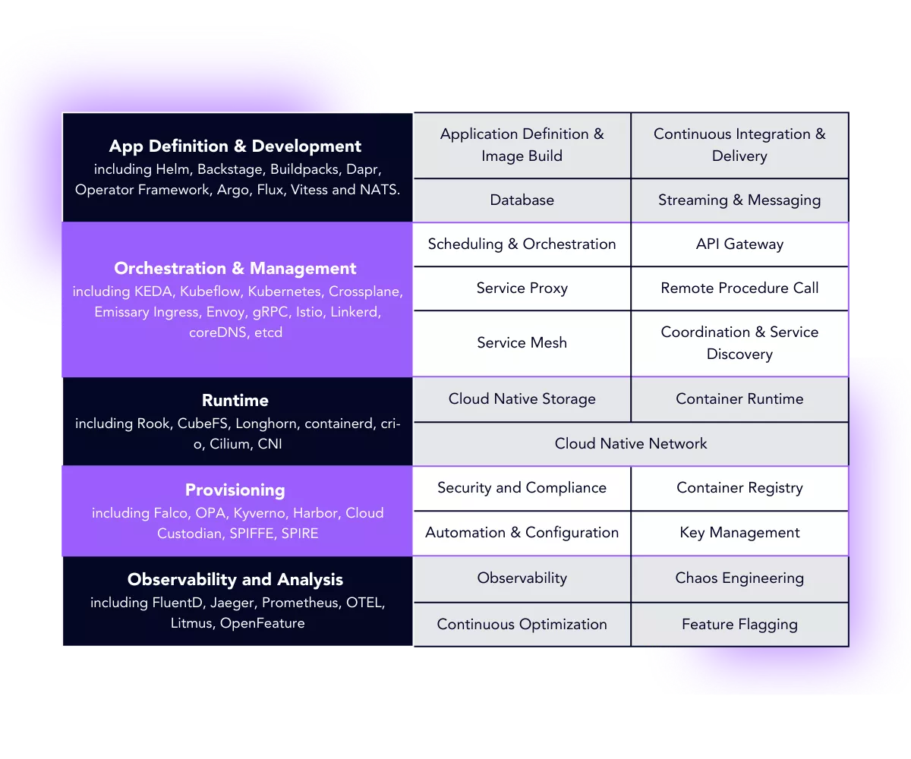
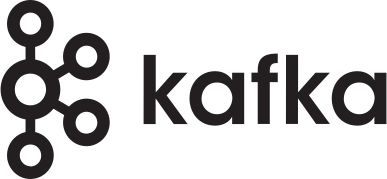
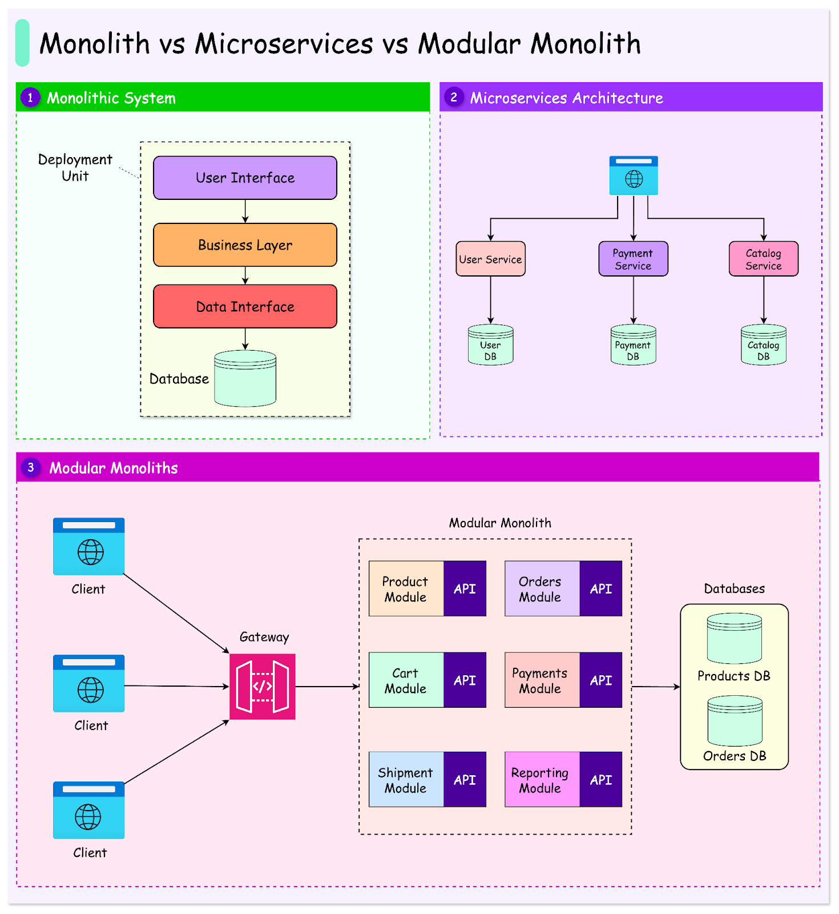

#### 인덱스
- [클라우드 네이티브](#클라우드-네이티브)
- [클라우드 네이티브 스택](#클라우드-네이티브-스택)
- [CNCF](#cncf)
- [마이크로서비스 아키텍처](#마이크로서비스-아키텍처)

## 클라우드 네이티브

클라우드 네이티브는 클라우드 컴퓨팅 환경(AWS, GCP, Azure 등)에 최적화된 애플리케이션을 설계, 개발, 운영하는 방식을 말한다

단순히 애플리케이션을 클라우드로 옮기는 것이 아니라 클라우드의 유연성과 확장성을 최대한 활용하여 요구사항/소프트웨어의 변화에 빠르게 대응하고 생산성을 높이는 접근 방식이다

클라우드 네이티브 애플리케이션을 개발/운영하기 위한 핵심 기술로 **마이크로서비스 아키텍처**, **컨테이너**, **CI/CD**, **데브옵스** 등이 있다

**마이크로서비스 아키텍처**: 하나의 큰 덩어리로 구성된 전통적인 모놀리식 구조에서 기능별로 독립적이고 작은 서비스 단위로 분리한다

**컨테이너**: 애플리케이션과 런타임 의존성을 하나의 패키지로 묶어 일관되게 실행되도록 한다 (클라우드 네이티브 애플리케이션의 가장 작은 컴퓨팅 유닛)

**CI/CD(Continuous Integration, Continuous Deployment)**: 코드 변경사항을 자동으로 빌드, 테스트, 배포하는 프로세스를 구축한다

**데브옵스(Devops)**: 개발(Development)과 운영(Operations)을 통합하여 소프트웨어 개발 및 배포 프로세스를 자동화한다

**서버리스(Serverless)**: 클라우드 제공업체가 서버 인프라를 전적으로 관리하는 클라우드 네이티브 모델이다 (개발자는 비용만 지불)

**서비스 메시(Service Mesh)**: 마이크로서비스 간 통신을 관리하고 제어한다

**동적 오케스트레이션(Dynamic Orchestration)**: 컨테이너의 배포, 확장, 관리 등을 자동화하는 기술로 대표적으로 쿠버네티스가 있다

## 클라우드 네이티브 스택

클라우드 네이티브 스택은 개발자가 클라우드 네이티브 애플리케이션을 구축, 관리 및 실행하는 데 사용하는 **클라우드 네이티브 기술 계층**을 표현하는 용어로 다음과 같이 구성된다

### 인프라 계층

클라우드 네이티브 스택의 기반 계층으로 AWS, Azure, GCP, OCI 등 클라우드 제공업체가 관리하는 운영체제, 스토리지, 네트워크 및 기타 컴퓨팅 리소스로 구성된다

인프라 계층은 클라우드 제공업체에서 하드웨어나 가상머신 리소스를 API로 제어할 수 있게 만들어서 상위 계층의 자동화를 가능하게 한다

**퍼블릭 클라우드**: AWS, Azure, Google Cloud, Naver Cloud 등

**프라이빗 클라우드**: OpenStack, VMware vSphere, Nutanix 등

### 프로비저닝 계층

  

프로비저닝 계층은 클라우드 환경을 할당하고 구성하는데, 인프라를 코드로 정의하고 자동화된 방식으로 수행한다

수동으로 관리하지 않고 코드를 통해 선언적으로 관리하는 계층이다 **"Infrastructure as Code (IaC)"**

대표 기술
- Terraform: 멀티 클라우드 IaC 표준 도구
- Pulumi: 프로그래밍 언어 기반 IaC
- Ansible, Chef, Puppet: 구성 관리(Configuration Management)
- CloudFormation, Azure ARM, Google Deployment Manager: 클라우드 제공업체 전용 IaC
- Packer: 표준화된 VM/컨테이너 이미지 자동 빌드

### 런타임 계층

 

애플리케이션이 실제로 실행되는 환경으로 **컨테이너**와 **서비스 메시(Service Mesh)**가 이 계층의 중심이다

컨테이너를 통해 의존성을 하나의 패키지로 묶어 배포의 부담을 줄이면서 애플리케이션 간 물리/논리적으로 격리한다

서비스 메시를 활용하여 서비스 간 통신을 제어하고 보안 정책, 트래픽 관리 등을 수행한다

**불변 인프라(Immutable Infrastructure)** 를 구축하여 실행 환경을 동일하게 재현하고 CI/CD 파이프라인에서 손쉽게 교체 및 배포를 가능하게 한다

### 오케스트레이션 및 관리 계층

   

오케스트레이션 및 관리 계층은 다양한 클라우드 구성 요소를 통합하여 하나의 유닛으로 작동하도록 하는 역할을 한다

기존 컴퓨팅 환경에서 멀티 태스크를 관리하는 운영체제처럼 개발자는 쿠버네티스같은 오케스트레이션 도구를 활용하여 다양한 시스템에서 클라우드 애플리케이션을 배포, 관리 및 확장한다

쿠버네티스 주요 기능
- 애플리케이션 스케줄링
- 장애 자동 복구
- 선언적 배포 및 롤백
- 멀티 클러스터/멀티 테넌트 운영 지원

### 애플리케이션 정의 및 개발 계층

    

애플리케이션 정의 및 개발 계층은 클라우드 네이티브 애플리케이션을 구축하기 위한 기술로 구성된다

즉, 개발자가 실제 비즈니스 로직을 담는 계층으로 CI/CD, 서비스 프레임워크, 컨테이너 이미지, 데이터베이스, 메시징 등과 같은 기술을 사용하여 클라우드 애플리케이션을 구축한다

12-Factor App 원칙 준수, 선언적 구성과 외부 설정 관리

### 관측성 및 분석 도구

  

관측성 및 분석 도구는 클라우드 애플리케이션의 시스템 상태, 트래픽, 장애를 모니터링 및 평가하고 개선한다

단순 모니터링을 넘어 서비스 간 추적과 로그 분석, 알림까지 통합하여 관리한다

**관측성(Observability)**: 메트릭 + 로그 + 추적

대표 기술
- 로그 수집: Fluentd, Logstash, Loki
- 메트릭 수집: Prometheus, OpenTelemetry Metrics
- 분석 시각화: Grafana, Kibana
- 트레이싱: Jaeger, Zipkin, Tempo, (Spring Cloud Sleuth → Micrometer Tracing)
- AIOps / Observability 플랫폼: Datadog, New Relic, Dynatrace

## CNCF

CNCF (Cloud Native Computing Foundation)는 클라우드 네이티브 생태계를 관장하는 **오픈소스 재단**으로 리눅스 재단의 산하 조직이다

**핵심 역할**
- 오픈소스 프로젝트 관리: 쿠버네티스, 프로메테우스 등과 같은 기술을 중립적인 재단인 CNCF가 관리
- 클라우드 네이티브 표준화: 컨테이너, 서비스 메시, 옵저버빌리티, CI/CD 등 클라우드 네이티브 표준 기술의 표준 아키텍처 모델과 API 규약 제정
- 생태계 인증 및 호환성 보장: "Certified Kubernetes" 같은 공식 인증 프로그램을 통해 벤더별 쿠버네티스 배포판 간의 호환성 보장
- 커뮤니티 육성: 쿠베콘 + 클라우드네이티브콘 같은 국제 컨퍼런스를 통해 기술 공유와 생태계 확산 촉진

CNCF가 관리하는 대표 프로젝트: containerd(컨테이너), Kubernetes(오케스트레이션), Istio(서비스 메시), OpenTelemetry(관측성), Envoy(API 게이트웨이), Argo(CD) 등

[CNCF 프로젝트 Landscape](https://landscape.cncf.io)

CNCF가 관리하는 각 프로젝트는 성숙도 단계를 부여받는다
- Graduated: 산업 표준 수준으로 안정화된 프로젝트
- Incubating: 활발히 개발 중이며 산업 도입 증가 중인 프로젝트
- Sandbox: 초기 단계로 실험적인 프로젝트

### CNCF가 강조하는 클라우드 네이티브의 핵심 철학

**Containerized**: 경량화된 컨테이너 단위의 배포

**Dynamically orchestrated**: 자동화된 오케스트레이터(k8s)로 관리

**Microservices-oriented**: 느슨하게 결합된 서비스 구조

**Declaratively managed**: 코드로 인프라와 운영 상태를 정의

## 마이크로서비스 아키텍처

마이크로서비스 아키텍처 또는 마이크로서비스는 클라우드 네이티브 애플리케이션을 구축하기 위한 핵심 요소로, 하나의 큰 애플리케이션을 여러 개의 독립적인 작은 서비스로 분할하여 개발하고 배포하는 방식이다

각 서비스는 하나의 특정 비즈니스 기능에 집중하며 클라이언트의 단일 요청을 처리하기 위해 이들 간에 API 호출을 통해 통신한다

서버의 처리량을 높이고 응답 시간을 단축하기 위해 기존에는 인스턴스마다 대형 애플리케이션을 할당했다면, MSA 환경에서는 요청이 집중되는 서비스의 인스턴스 개수를 늘리거나 비교적 덜 사용되는 서비스의 인스턴스 개수는 줄여서 효율적으로 서버를 운영할 수 있다 -> 독립적인 배포 및 확장

서비스끼리 API로 통신하기 때문에 기술적인 제약을 받지 않고 각 서비스마다 최적의 기술 스택을 선택하여 기능을 구현할 수 있다

또한 기능별로 분리되어 있어 비교적 자유롭게 특정 부분을 수정이나 업데이트할 수 있다

마이크로서비스 아키텍처를 구축하려면 단순히 특정 기능 별로 애플리케이션을 구현할 뿐만 아니라 이들을 배포, 관리하고 코드의 변경사항이나 구성을 통합, 반영하는 프로세스까지 마련해야 한다

완전한 클라우드 네이티브 애플리케이션으로 만들려면 오케스트레이션, 옵저버빌리티 등의 기술도 함께 활용해야 하기 때문에 기술적 난이도가 급격히 높아지게 된다

이에 모듈라 모놀리스 구조로 서비스를 제공하다가 단일 모듈로 트래픽을 감당하기 어려울 때 MSA를 채택하는 경우가 많아졌다

### 핵심 기술 스택

|영역|역할|주요 기술|
|---|----|---|
|서비스 설계 및 개발|각 마이크로서비스의 애플리케이션 구현|Java + Spring Boot, Go, Node.js, Kotlin 등|
|서비스 간 통신|서비스 간 API 또는 비동기 메시지 교환|REST, gRPC, GraphQL, RabbitMQ, Kafka|
|서비스 디스커버리|서비스 위치 자동 탐색|Spring Cloud Netflix Eureka, Consul, Kubernetes Service Discovery|
|부하 분산(로드밸런싱)|트래픽을 여러 서비스 인스턴스로 분산|Spring Cloud LoadBalancer, Nginx, Envoy, Istio|
|중앙 설정 관리|환경 설정을 중앙화하여 버전 관리|Spring Cloud Config, Consul Config, Vault|
|장애 대응 및 복원력(Resilience)|Circuit Breaker, Retry, Rate Limiter 구현|Resilience4j, Hystrix(legacy), Istio, Linkerd|
|관측성 (Observability)|메트릭, 로깅, 분산 추적 관리|Micrometer, Prometheus, Grafana, Zipkin, Jaeger, ELK|
|API 게이트웨이|요청 라우팅, 인증, Rate Limit, 보안|Spring Cloud Gateway, Kong, NGINX, Ambassador|
|인증 및 보안|인증 및 인가 관리|OAuth2.0, OpenID Connect, Keycloak, Spring Security|
|빌드 및 배포 자동화 (CI/CD)|자동 빌드, 테스트, 배포 파이프라인|GitHub Actions, Jenkins, Argo CD, Tekton|
|컨테이너 및 오케스트레이션|서비스 단위 배포, 스케일링, 헬스체크|Docker, Kubernetes, Helm|
|인프라 프로비저닝|인프라 리소스 자동 생성 및 관리|Terraform, Ansible, CloudFormation|

**참고 문서 및 이미지 출처**
- https://blog.bytebytego.com/p/monolith-vs-microservices-vs-modular
- https://aws.amazon.com/ko/what-is/cloud-native/
- https://blog.upbound.io/understanding-the-cloud-native-landscape
- https://landscape.cncf.io/?view-mode=grid