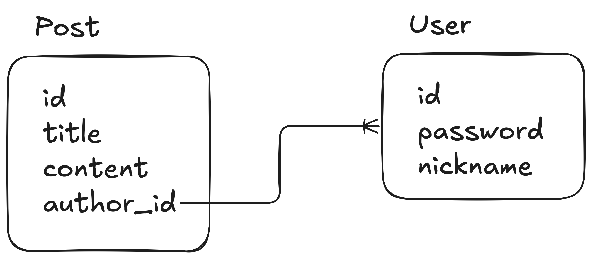

#### 인덱스
- [JPA 엔티티](#jpa-엔티티)
- [기본 키 생성 전략: `@GeneratedValue`](#기본-키-생성-전략-generatedvalue)
- [복합 키 구현: `@IdClass`, `@EmmbeddId`, `@MapsId`](#복합-키-구현-idclass-emmbeddid-mapsid)
- [연관관계](#연관관계)
- [N+1 문제](#n1-문제)
- [`@Embedded`, `@Embeddable`](#embedded-embeddable)
- [`@ElementCollection`](#elementcollection)
- [`@Enumerated`](#enumerated)
- [`@Inheritance`, `@MappedSuperclass`](#inheritance-mappedsuperclass)
- [Auditing](#auditing)
- [Soft Delete](#soft-delete)
- [시간 자료형](#시간-자료형)
- [JPA 엔티티에 DDD 접목하기](#jpa-엔티티에-ddd-접목하기)


## JPA 엔티티

JPA 및 스프링 데이터 JPA는 자바 애플리케이션과 관계형 데이터베이스 간의 패러다임(객체지향 vs 관계형) 격차를 해소하고 쿼리 작업의 편의성, 효율성 등을 높인 ORM 프레임워크이다

RDB 테이블에 연결되는 객체지향 프로그래밍 객체를 **엔티티**라고 한다

각 **엔티티 클래스의 인스턴스**는 데이터베이스 **테이블의 하나의 레코드(row)** 에 해당하며 **엔티티의 필드**는 **테이블의 필드(column)** 에 매핑된다

엔티티를 정의하는 주요 어노테이션은 아래와 같다

**`@Entity`**
- 엔티티 정의 어노테이션
- JPA가 해당 클래스를 엔티티로 인식한다
- name 속성: 클래스 이름(기본값), 쿼리 내에서 엔티티를 참조하기 위해 사용된다
- name 값은 고유해야 하며 JPQL 예약어를 사용할 수 없다

**`@Table`**
- 엔티티 클래스와 매핑될 데이터베이스 테이블 지정
- 선언하지 않으면 `@Table`의 기본값이 적용된다
- name 속성: 엔티티 이름(기본값)

**`@Id`**
- 엔티티의 기본키를 매핑하는 필드에 선언한다
- 엔티티 클래스를 정의하기 위한 필수 어노테이션
- 원시, 원시 래퍼 타입을 기본키로 사용할 수 있다

**`@GeneratedValue`**
- [기본키 생성 전략](#기본-키-생성-전략-generatedvalue)을 선택할 수 있다

**`@Column`**
- 엔티티 필드를 테이블의 특정 열에 매핑한다
- `name`: 열 이름
- `unique`: 유니크 제약 조건 여부(`@Table.UniqueConstraint` 단축 버전)
- `nullable`, `insertable`, `updatable`: null, 삽입, 업데이트 허용 여부
- `columnDefinition`: 컬럼 DDL 정의
- `length`: 길이 (String 컬럼에만 적용됨)
- `precision`: 정밀도 (decimal 컬럼에만 적용됨)
- `scale`: 소수점 이하 자릿수 (decimal 컬럼에만 적용됨)

**`@Transient`**
- 특정 필드가 데이터베이스에 저장되지 않도록 한다
- JPA는 이 필드를 매핑 대상에서 제외한다

[테스트 코드](../src/test/java/hansanhha/entity/EntityMappingTest.java)

```java
@Entity
@Table
@NoArgsConstructor(access = AccessLevel.PROTECTED)
@Getter
public class BasicEntity {

    @Id
    @GeneratedValue
    @Column(name =  "basic_entity_id")
    private Long id;

    @Column(nullable = false, length = 50)
    private String username;

    @Column(name = "email_address")
    private String email;

    public BasicEntity(String username, String email) {
        this.username = username;
        this.email = email;
    }

}
```

### 엔티티가 테이블이 되는 과정

```text
SpringApplication.run()
        ↓
리포지토리 스캔/등록
        ↓
하이버네이트 초기화: PersistenceUnitInfo
        ↓
커넥션 풀 초기화
        ↓
스프링 데이터 JPA 빈 초기화: LocalContainerEntityManagerFactoryBean
        ↓
스프링 부트 애플리케이션 시작
```

스프링 부트 애플리케이션이 시작되면 자동 구성에 의해 JPA 및 데이터소스 관련 설정들이 초기화된다

JPA는 `@SpringBootApplication`이 위치한 패키지 및 하위 패키지들 중 `@Entity` 어노테이션이 붙은 클래스들을 스캔하여 **엔티티 메타데이터 (EntityType, EntityTypeImpl)** 를 생성한다
- `JpaBaseConfiguration.PersistenceManagedTypesConfiguration`, `PersistenceManagedTypes`
- `DefaultPersistenceUnitManager`, `LocalContainerEntityManagerFactoryBean`
- `hbm2ddl`

엔티티 메타데이터는 `@Id`, `@Column`, `@Table` 등의 정보를 포함하여 엔티티 클래스와 데이터베이스 테이블의 관계를 구체적으로 정의하는 역할을 한다

하이버네이트는 다음의 순서에 따라 데이터베이스 스키마를 처리한다
- 사용자가 지정한 `spring.jpa.hibernate.ddl-auto` 속성값
- 임베디드 데이터베이스를 사용하고 스키마 매니저를 감지하지 못한 경우: `create-drop`
- 위의 경우에 해당하지 않는 기본값: `none`

`spring.jpa.hibernate.ddl-auto`은 실질적으로 `hibernate.hbm2ddl.auto` 속성이며 다음과 같은 값들을 지원한다
- `create`: 엔티티 메타데이터를 기반으로 `CREATE TABLE`과 같은 DDL 스크립트를 생성한다 (**기존 테이블과 모든 레코드가 삭제된다**)
- `create-drop`: `create`와 동일하게 동작하지만 애플리케이션이 정상 종료될 때 생성된 테이블을 모두 삭제한다
- `update`: 기존 스키마를 엔티티 메타데이터에 맞게 변경하는 스크립트를 생성한다
- `validate`: 엔티티와 테이블 스키마가 일치하는지 검증한다
- `none`: 아무 작업도 하지 않는다

생성된 DDL 스크립트가 데이터베이스에 전달되고 실행되면서 물리적인 테이블이 생성되고 엔티티의 필드에 해당하는 열들이 정의된다 (이 작업은 애플리케이션이 실행될 때 한 번만 수행된다)

모든 매핑과 테이블 생성이 완료되면 `EntityManagerFactory`와 `EntityManager`이 스프링 빈(프록시)으로 등록된다


## 기본 키 생성 전략: `@GeneratedValue`

`@GeneratedValue`는 JPA에서 엔티티 식별자(DB 테이블 기본키)를 자동으로 생성하도록 지시하는 어노테이션이다

엔티티의 `@Id` 필드에 붙여 사용하며 어떤 방식으로 ID를 생성하고 필요 시 어떤 제네레이터를 사용할 지 지정한다

참고로 복합 키에는 사용할 수 없으며 `@EmbeddedId`를 통해 직접 구현해야 한다

### `GenerationType.AUTO`

JPA 프로바이더가 데이터베이스 벤더에 따라 내부적으로 적합한 방식을 선택하도록 지시한다

빠른 시작(POC)에는 괜찮지만 프로바이더/DB 환경에 따라 다른 전략이 선택될 수 있어 운영 환경에서는 명시적 전략을 권장한다

### `GenerationType.SEQUENCE`

```java
@Entity
@SequenceGenerator(
        name = "order_seq_gen",     // 시퀀스 제네레이터 이름
        sequenceName = "order_seq", // DB 시퀀스 이름
        allocationSize = 50,         // 사전 할당 ID 개수
        initialValue = 1
)
public class Order {
    @Id
    @GeneratedValue(strategy = GenerationType.SEQUENCE, generator = "order_seq_gen")
    private Long id;
}
```

JPA가 **DB의 시퀀스 객체를 사용하여 식별자 값을 미리 받아와 엔티티에 할당**하는 방식이다

**엔티티 삽입 전 id를 미리 할당**할 수 있기 때문에 JDBC 배치(batch insert)가 가능하고 동시성/확장성이 좋다

다만 시퀀스와 하이버네이트의 **allocationSize(사전 할당 블록 크기)** 를 맞춰야 갭을 줄일 수 있다

allocationSize: 하이버네이트가 DB에 접근해 확보한 ID의 개수

DB에서 제공한 ID 범위는 해당 애플리케이션에서만 사용할 수 있다

따라서 **트랜잭션 롤백, 애플리케이션 재시작 등으로 인해 미소비된 ID들은 사라지므로 ID 갭이 발생한다**

JPA 프로바이더/DB 벤더에 따라 시퀀스의 INCREMENT 값과 일치시키지 않으면 의도치 않게 큰 점프를 발생시킬 수 있으므로 문서를 잘 확인해야 한다

프론트엔드에서 ID 연속성이 엄격히 요구되면 allocationSize의 크기를 1로 줄이면 된다 -> 성능 저하 발생

성능이 중요한 경우 적절히 큰 값(20 ~ 100)을 설정하고 DB 시퀀스 설정을 잘 맞춘다

### `GenerationType.IDENTITY`

DB의 자동증가(`AUTO_INCREMENT`, `IDENTITY`) 컬럼을 사용하는 단순한 방식이다

**엔티티를 삽입해야 ID가 확정되므로 엔티티를 영속하는 시점에 즉시 삽입 쿼리가 발생한다**

이로 인해 JDBC 배치가 제한되거나 불가하며 트랜잭션 내에서 여러 엔티티 삽입 시 성능이 저하될 수 있다

배치를 최적화하려면 `UUID` 또는 `Snowflake` 사용을 고려할 수 있다

보통 트래픽이 적거나 DB가 시퀀스를 지원하지 않을 때 사용한다

### `GenerationType.UUID`

RFC-4122 규격의 UUID를 생성해 엔티티 식별자에 할당하는 방식이다

`@Id` 필드의 타입을 `UUID` 또는 `String`으로 사용할 수 있다

UUID 세부 구현 사항(`v1`, `v4`, `v7` 등), 저장 형식(`CHAR`, `BINARY`, `DB-native UUID`)은 프로바이더와 설정에 따라 달라진다

**엔티티가 삽입되기 전에 애플리케이션 레벨에서 엔티티의 식별자를 할당할 수 있기 때문에 시퀀스와 마찬가지로 JDBC 배치가 가능하다**

DB에서 일부 ID를 미리 가져오는 방식이 아니기 때문에 **DB 병목 없이 각 노드에서 독립적으로 고유한 ID를 생성할 수 있다** -> 마이크로서비스와 같은 분산환경에 적합하다

다만 완전 랜덤한 UUIDv4를 사용하면 B-tree 인덱스가 랜덤 쓰기로 인해 단편화되고 삽입 성능이 저하될 수 있기 때문에 시간 정렬 가능한 UUID(UUIDv7, ULID, 등)를 사용하는 것이 좋다 

#### `GenerationType.TABLE`

별도의 테이블을 사용하여 시퀀스 기능을 구현한 방식

특정 데이터베이스 벤더에 독립적으로 동작하지만 동시성 성능이 저하되어 일반적으로 사용되지 않는다


## 복합 키 구현: `@IdClass`, `@EmmbeddId`, `@MapsId`

JPA 스펙상 `@GeneratedValue`는 단일 식별자 필드(`@Id`)에만 사용할 수 있고 복합 키는 `@IdClass`, `@EmbeddId`, `@MapsId`를 사용해서 구현한다

**복합 키를 사용하는 대신 임의의 단일 개체 키(Surrogate Key)를 두고 원래의 복합 키는 유니크 인덱스 제약으로만 두는 방법도 있다**

이 방법은 엔티티, JPQL을 단순화하고 복합 키 필드가 바뀌어도 엔티티 구조 영향이 상대적으로 적어 재사용성이 높다

다만 원래 복합 키 필드에 중복 데이터가 들어갈 수 있으며(유니크 제약 필요) 관계형 모델의 직관성이 떨어진다

PK 인덱스 탐색 시 임의 단일 개체 키를 사용하면 빠르지만 필드로 조회하면 유니크 인덱스를 따로 타게 되어 속도가 떨어진다  

`@IdClass`는 복합 키를 별도 클래스로 정의하고 엔티티에서 개별 필드에 `@Id`를 붙이는 방식이다

```java
public record OrderItemId(Long orderId, Long productId) implements Serializable {}

@Entity
@IdClass(OrderItemId.class)
public static class OrderItem {
    @Id
    private Long orderId;

    @Id
    private Long productId;
}
```

`@EmbeddedId`는 복합 키를 하나의 임베디드 값 타입(`@Embeddable`)으로 정의하고 사용하는 방식이다

```java
@Embeddable
public record ReviewId(Long orderId, Long productId) {}

@Entity
public class Review {
    
    @EmbeddedId
    private ReviewId id;
}
```

`@MapsId`는 `@EmbeddedId`, `@IdClass`로 정의한 복합 키의 일부가 외래 키일 때 복합 키의 특정 필드와 연관관계 PK를 연결할 수 있다

JPA는 연관관계 엔티티에서 PK를 꺼내 복합 키 필드에 자동으로 반영한다

FK 값을 복합 키에 직접 세팅하는 중복을 줄여주며 연관관계와 PK가 강하게 연결되어 DB와 객체 모델을 일치시킬 수 있다

```java
@Embeddable
public record CourseId(Long studentId, Long professorId) {}

@Entity
public static class Course {
    @EmbeddedId
    private CourseId id;

    @MapsId("studentId")
    @ManyToOne
    @JoinColumn(name = "student_id")
    private Student student;

    @MapsId("professorId")
    @ManyToOne
    @JoinColumn(name = "professor_id")
    private Professor professor;
}

@Entity
public static class Student {
    @Id
    @GeneratedValue
    private Long id;
}

@Entity
public static class Professor {
    @Id
    @GeneratedValue
    private Long id;
}
```


## 연관관계

관계형 데이터베이스에서 외래 키를 통해 테이블 간 관계를 맺는 것처럼 JPA는 객체 참조를 통해 엔티티 간 연관관계를 나타낼 수 있다

일대다, 다대일, 다대다 개념을 동일하게 사용하며 추가적으로 엔티티 간의 연관관계 방향을 설정할 수 있다

### 단방향 연관관계

아래의 Post 테이블은 User 테이블의 id를 참조한다



JPA의 엔티티 간 연관관계는 관계를 맺을 엔티티 타입의 필드에 `@JoinColumn`과 관계 어노테이션을 사용하여 나타낼 수 있다

**`@JoinColumn` 어노테이션을 사용하여 외래 키를 지정하는 엔티티가 관계의 주인이 된다** 

**JPA는 내부적으로 엔티티 객체의 기본 키(`@Id`) 필드를 통해 데이터베이스 테이블 간 관계를 참조한다**

일대일(`@OneToOne`), 일대다(`@OneToMany`), 다대일(`@ManyToOne`), 다대다(`@ManyToMany`) 관계 어노테이션을 지원한다

Post 엔티티 관점에서 봤을 때 자신은 하나의 유저에 의해 여러 번 저장될 수 있으므로 `@ManyToOne`을 사용하여 다대일 관계를 나타낸다

`fetch = FetchType.LAZY`는 특정 Post 엔티티를 조회했을 때 연관된 User 엔티티의 실제 값들을 가져오지 않고, `p.getUser()`과 같이 실제로 해당 User 엔티티를 사용하는 시점에 DB로부터 조회한다

반대로 `FetchType.EAGER` 값은 엔티티를 조회할 때 연관 엔티티도 함께 조회하여 영속성 컨텍스트에 로딩한다

아래와 같이 **하나의 엔티티가 다른 하나의 엔티티를 일방적으로 참조하는 관계**를 **단방향 연관관계(Unidirectional)** 라고 한다

참조하는 엔티티의 정보를 알고 있는 한 쪽의 엔티티가 속한 테이블에 외래 키가 생성된다

따라서 실제 데이터베이스의 DDL에는 Post 엔티티의 테이블이 User 테이블을 참조하는 외래 키를 정의하게 된다

```java
@Entity(name = "relationshipPost")
@Getter
@NoArgsConstructor(access = AccessLevel.PROTECTED)
public class Post {

    @Id
    @GeneratedValue
    private Long id;

    private String title;

    private String content;

    @JoinColumn(name = "author_id") // user 필드에 대한 데이터베이스 컬럼 이름 지정 author_id
    @ManyToOne(fetch = FetchType.LAZY)
    private User user;
}
```

```java
@Entity(name = "relationshipUsers")
@NoArgsConstructor(access = AccessLevel.PROTECTED)
@Getter
public class User {

    @Id
    @GeneratedValue
    private Long id;

    @Column(nullable = false)
    private String password;

    @Column(nullable = false, unique = true)
    private String nickname;
}
```

### 양방향 연관관계

**양방향 연관관계(Bidirectional)** 는 두 엔티티가 모두 서로를 참조하는 관계이다 

JPA에서는 `mappedBy` 속성을 사용하여 두 엔티티 중 누가 관계의 주인인지 나타낸다

관계의 주인은 `mappedBy`가 없는 쪽(`@JoinColumn`을 사용한 쪽)이 되고 외래 키를 관리한다

`mappedBy`가 설정된 쪽은 관계의 주인(owner)이 아님을 의미하며 데이터베이스의 외래 키를 관리하지 않는다

**만약 `mappedBy`를 명시하지 않으면 JPA는 양쪽 모두를 관계의 주인으로 인식하여 두 개의 외래 키 컬럼이 생성되거나 한 쪽에서 변경해도 다른 쪽에 반영되지 않는 데이터 불일치 문제가 발생할 수 있다**

일반적으로 `@ManyToOne`이 관계의 주인이 되고 `@OneToMany`가 읽기 전용으로 사용된다

User 엔티티의 `List<Post>` 필드에 `@OneToMany(mappedBy = "user")` 어노테이션을 선언하여 Post 엔티티와 양방향 연관관계를 설정할 수 있다

mappedBy의 값은 주인이 자신을 참조하는 데 정의한 필드의 이름으로 설정되어야 한다

위의 경우 Post 엔티티가 `User user`이라고 정의했기 때문에 `mappedBy = "user"`가 된다 (`@JoinColumn`의 name 값이 아님을 주의해야 한다)

```java
@Entity
public class User {
    
    // ...

    // 양방향 관계의 주인 명시
    // 주인의 필드 이름으로 매핑한다
    @OneToMany(mappedBy = "user")
    private List<Post> posts = new ArrayList<>();   
}
```

`@OneToMany`의 경우 기본적으로 `fetchType.LAZY`이기 때문에 데이터베이스에서 연관된 엔티티들을 즉시 조회하지 않는다

**일대다 관계가 소유 관계에 가까우므로 일에 속하는 엔티티(User)에서 종속된 엔티티(Post)들의 생명주기를 관리하는 옵션을 사용한다**

`cascade` 속성은 부모 엔티티에 대한 작업(`PERSIST`, `REMOVE` 등)을 연관된 자식 엔티티로 전파한다

부모 엔티티(User)를 저장하면 연관된 자식 엔티티(Post)도 함께 저장되고, 부모 엔티티를 삭제하면 자식 엔티티도 함께 삭제된다

일반적으로 `cascade = CascadeType.ALL`을 사용하여 부모 엔티티의 모든 생명주기 변화를 자식 엔티티에 적용한다

`orphanRemoval` 속성은 부모 엔티티와 연관관계가 끊어진 자식 엔티티(고아 객체)를 자동으로 제거하는 기능이다

**부모 엔티티의 자식 컬렉션에서 특정 엔티티를 제거하거나 부모 엔티티의 참조가 null로 변경되었을 때 해당 자식 엔티티는 더 이상 부모에 속하지 않게 된다**

이 때 `orphanRemoval = true`로 설정되어 있으면 JPA는 고아 객체들을 데이터베이스에서 자동으로 제거한다

`CascadeType.REMOVE`는 부모 엔티티가 삭제될 때만 자식 엔티티들을 삭제하지만, `orphanRemoval`은 부모 엔티티의 컬렉션에서 자식이 제거되기만 해도 자식을 삭제한다는 차이가 있다

**한 가지 주의해야 할 것은 부모의 자식 컬렉션 자체를 새로운 컬렉션으로 변경시켜버리면 하이버네이트가 기존 컬렉션 참조를 이용하여 변경사항을 추적할 수 없게 되어 예외가 발생하게 된다**

만약 모든 자식들을 제거하고 싶으면 해당 컬렉션을 비우는 것이 안전하다

### `@OneToOne`

`@OneToOne`은 일대일 연관관계, 두 엔티티가 서로 한 개씩만 연관될 때 사용되는 어노테이션이다

아래와 같이 Image 엔티티에서 `mappedBy` 속성을 통해 Post 엔티티가 주인(외래 키를 관리하는 쪽)임을 명시하여 양방향 연관관계를 맺을 수 있다 

```java
@Entity(name = "relationship_image")
@NoArgsConstructor(access = AccessLevel.PROTECTED)
@Getter
public class Image {

    @Id
    @GeneratedValue
    private Long id;

    private String url;

    @OneToOne(mappedBy = "image")
    private Post post;
}
```

```java
@Entity
public class Post {

    // ...

    @JoinColumn(name = "post_image_id")
    @OneToOne
    private Image image;
}
```

#### `@ManyToMany`

`@ManyToMany`는 두 엔티티가 서로에게 여러 개씩 연관될 수 있는 다대다 관계를 매핑할 때 사용한다

JPA는 자동으로 두 엔티티의 기본 키를 외래 키로 포함하여 복합 기본 키로 하는 연결 테이블을 생성한다 (내부적으로 동작할 뿐 코드 상에서 확인할 수 없다)

복합 기본 키를 사용하지만 객체지향 모델을 관계형 모델에 매핑하기 때문에 외래 키를 관리할 단 하나의 엔티티가 필요하다

JPA 연관관계 매핑에서 `@JoinColumn` 어노테이션을 사용하는 쪽이 관계의 주인이 된다

아래의 경우에는 `@JoinTable`과 `@JoinColumn`을 사용하여 연결 테이블과 복합 키를 정의한 Student 엔티티가 주인이 된다

```java
@Entity(name = "relationship_student")
@NoArgsConstructor(access = AccessLevel.PROTECTED)
@Getter
public class Student {

    @Id
    @GeneratedValue
    private Long id;

    private String name;

    @ManyToMany
    @JoinTable(
            name = "student_course", // 연결 테이블 이름
            joinColumns = @JoinColumn(name = "student_id"), // Student FK
            inverseJoinColumns = @JoinColumn(name = "course_id") // Course FK
    )
    private List<Course> courses = new ArrayList<>();
}
```

```java
@Entity(name = "relationship_course")
@NoArgsConstructor(access = AccessLevel.PROTECTED)
@Getter
public class Course {

    @Id
    @GeneratedValue
    private Long id;

    private String name;

    // 관계 주인 명시
    @ManyToMany(mappedBy = "courses")
    private List<Student> students =  new ArrayList<>();
}
```

### 자식 컬렉션 필드를 클래스 차원에서 초기화하는 이유

`@OneToMany`나 `@ManyToMany`가 선언된 필드를 보면 클래스에서 직접 `new ArrayList<>()`와 같이 초기화한다

필드를 미리 초기화하면 항상 비어있는 컬렉션 객체가 존재하게 되므로 `NullPointerException`을 방지할 수 있다 (그렇지 않으면 해당 필드는 기본적으로 `null` 값을 가진다)

보통 부모 객체를 처음 생성할 때 null 예외가 터지는 것을 방지하는 목적이며, 이미 존재하는 엔티티를 데이터베이스로부터 읽어온다면 JPA의 지연 로딩 메커니즘으로 인해 해당 컬렉션 필드가 프록시 객체로 초기화되기 때문에 null 예외가 터지지 않는다 


## N+1 문제

[테스트 코드](../src/test/java/hansanhha/N1SelectProblemTest.java)

N+1 문제는 1개의 엔티티를 조회했을 때 연관된 엔티티들을 가져오기 위해 N번의 쿼리가 추가적으로 발생하는 현상을 말한다

아래와 같이 Post와 User 엔티티가 있다고 가정해보자

게시글 목록을 조회하는 기능을 구현할 때 게시글 리스트를 가져오는 한 번의 쿼리와 각 게시글의 작성자 정보를 불러오기 위해 N번의 쿼리가 발생할 수 있다

```java
@Entity(name = "n1SelectProblemPost")
@Getter
class Post {
    
    @Id 
    @GeneratedValue
    private Long id;
    
    private String title;
    
    @ManyToOne(fetch = FetchType.LAZY)
    @JoinColumn(name = "author_id")
    private User user;
} 
```

```java
@Entity(name = "n1SelectProblemUser")
@Getter
class User {
    
    @Id 
    @GeneratedValue
    private Long id;
    
    private String username;
}
```

```java
List<Post> posts = (List<Post>) postRepository.findAll();

// 각 Post 엔티티에 대한 User 연관 엔티티 조회 100번 발생
for (Post post : posts) {
    var a = post.getUser().getUsername();
}
```

### 해결 방법

#### 1. @EntityGraph 사용

엔티티 그래프는 JPQL이나 네이티브 쿼리를 작성하지 않고도 페치 조인 효과를 얻을 수 있는 선언적 방식이다

`FetchType.LAZY`로 설정되어 있어도 연관된 엔티티를 즉시 로딩하도록 지시하여 해당 연관 관계를 자동으로 조인해서 가져온다

엔티티 그래프는 크게 두 가지 방법으로 사용할 수 있다

1. 엔티티 클래스에 페치 조인할 엔티티들을 명시하는 방법 (네임드 엔티티 그래프)
2. 쿼리 메서드에서 페치 조인할 엔티티들을 명시하는 방법

다만 몇 가지 주의점이 존재한다
- 조인 대상의 이름이 오타나면 런타임 에러가 발생한다
- 중첩된 경로는 페치조인 할 수 없다
- 일대다 조인 시 데이터 중복이 발생한다
- 네이티브 쿼리와 함께 사용하면 무시된다

네임드 엔티티 그래프는 아래와 같이 이름을 지정할 수 있어서 페치 조인을 일관적으로 관리할 수 있다 -> 재사용 가능한 페치 조인 쿼리 구성 가능

```java
// 네임드 엔티티 그래프를 정의한 엔티티 정의
@Entity(name = "n1SelectProblemEntityGraphPost")
@NamedEntityGraph(name = "post.author", attributeNodes = { @NamedAttributeNode("user") })
@Getter
@NoArgsConstructor(access = AccessLevel.PROTECTED)
public class PostEntityGraph {
    // ...
}
```

```java
public interface PostEntityGraphRepository extends CrudRepository<PostEntityGraph, Long> {

    // 네임드 엔티티 그래프에 지정된 이름 명시
    @EntityGraph("post.author")
    List<PostEntityGraph> findAll();
    
}
```

또는 아래처럼 쿼리 메서드에서 페치 조인할 경로를 명시할 수 있다

```java
public interface PostEntityGraphRepository extends CrudRepository<PostEntityGraph, Long> {

    // 조인할 경로 직접 명시 (페치조인할 연관 엔티티의 필드 이름)
    @EntityGraph(attributePaths = "user")
    List<PostEntityGraph> findAll();
    
}
```

참고로 @EntityGraph 어노테이션은 기본적으로 지정한 속성만 페치 조인하는데 지정한 속성 외에도 기본 EAGER 속성도 페치 조인하려면 type 속성을 아래와 같이 지정하면 된다

```java
public interface PostEntityGraphRepository extends CrudRepository<PostEntityGraph, Long> {

    // 조인할 경로 직접 명시
    @EntityGraph(attributePaths = "user", type = EntityGraph.EntityGraphType.FETCH)
    List<PostEntityGraph> findAll();
    
}
```

#### 2. Fetch Join 사용

페치 조인은 연관된 엔티티를 한 꺼번에 조회하기 위한 JPQL 문법이다

엔티티 그래프의 경우 선언적인 방식으로 즉시 로딩을 지시한다면 페치 조인은 JPQL에 직접 명시하여 복잡한 쿼리 조합이 가능하다

일반 조인은 쿼리 상에서만 조인을 진행하고 연관된 엔티티는 영속성 컨텍스트에 로딩하지 않지만 페치 조인은 연관된 엔티티도 즉시 로딩한다 (연관 엔티티 인스턴스화)

```java
public interface PostRepository extends CrudRepository<Post, Long> {

    // Post 엔티티 조회 시 연관 엔티티 User도 함께 메모리에 로딩한다
    // JOIN 뒤에 FETCH 를 명시하여 페치 조인할 것을 지시한다 
    @Query("SELECT p FROM Post p JOIN FETCH p.user u")
    List<Post> findAllFetchJoin();
}
```

N개의 엔티티를 조회할 때 `@OneToMany` 컬렉션을 페치 조인하면 조회된 부모 엔티티 수만큼 자식 엔티티의 레코드 수를 반복적으로 가져오게 되는 현상이 발생한다 

`@ManyToOne`, `@OneToOne`과 같은 단건 연관 관계는 페이징과 함께 사용할 수 있다

한 쿼리에서 여러개의 컬렉션을 페치조인하면 `InvalidDataAccessApiUsageException`(`MultipleBagFetchException`)이 발생한다

#### 3. DTO 프로젝션 사용

페치 조인은 연관 엔티티의 모든 필드를 모두 메모리에 로딩하지만, DTO 프로젝션을 사용하면 필요한 연관 엔티티의 필드만 가져오면서 N+1 문제를 해결할 수 있다

```java
// 프로젝션용 DTO
public record PostDto(String title, String username) {

}
```

JPQL 쿼리에서 DTO의 풀 패키지 경로와 new 연산자를 사용하고 가져올 필드를 파라미터 순서에 맞춰주어 프로젝션을 이용할 수 있다

```java
public interface PostRepository extends CrudRepository<Post, Long> {
    
    // DTO 프로젝션을 사용하여 필요한 정보만 메모리에 로딩한다
    @Query(
            """
            SELECT new hansanhha.n1_problem.PostViewDto(p.title, u.username)
            FROM n1ProblemPost p
            JOIN p.user u
            """
    )
    List<PostViewDto> findAllProjection();
}
```

주의점
- 프로젝션 이외의 정보에 접근하면 N+1 문제가 발생할 수 있다
- 엔티티 없이 DTO로만 처리하기 때문에 도메인 로직을 사용할 수 없다

**DTO 프로젝션을 사용한 SQL 로그**

페치 조인, 엔티티 그래프와 달리 명시한 필드 정보만 가져온다

```text
select p1_0.title ,u1_0.username 
from post p1_0 
join users u1_0 
on u1_0.id=p1_0.user_id;
```

## `@Embedded`, `@Embeddable`

`@Embedded`와 `@Embeddable`은 값 타입을 테이블에 매핑하는 데 사용된다

여러 엔티티에서 재사용되는 공통 필드를 `@Embeddable` 값 타입으로 묶어서 코드를 깔끔하게 관리할 수 있다

`@Embeddable` 클래스는 `@Entity`를 사용하지 않고 `@Id`를 가질 수 없다

특정 엔티티에서 공통 값 타입을 `@Embedded` 어노테이션을 통해 자신의 필드로 포함시키면 JPA가 이를 감지하여 엔티티 테이블의 컬럼으로 매핑한다

```java
@Entity
@Getter
@NoArgsConstructor(access = AccessLevel.PROTECTED)
public class EmbeddedEntity {

    @Id
    @GeneratedValue
    private Long id;

    @Embedded
    private EmbeddableEntity embeddableEntity;

    @Embeddable
    record EmbeddableVO(String name, int age) {}
}
```

하나의 엔티티에 동일한 `@Embeddable` 클래스를 두 개 이상 사용한다면 컬럼의 이름이 충돌하게 된다   

이럴 때는 `@AttributeOverrides`를 사용해서 컬럼 이름 충돌을 피할 수 있다

아래의 `EmbeddableEntity`의 `name`, `age` 필드의 이름을 `EmbeddedEntity` 테이블 내에서 구분짓는 코드이다 

```java
@Entity
public class EmbeddedEntity {

    @Id
    @GeneratedValue
    private Long id;

    @Embedded
    @AttributeOverrides({
            @AttributeOverride(name = "name", column = @Column(name = "a_name")),
            @AttributeOverride(name = "age", column = @Column(name = "a_age"))
    })
    private EmbeddableEntity embeddableEntity;

    @Embedded
    @AttributeOverrides({
            @AttributeOverride(name = "name", column = @Column(name = "b_name")),
            @AttributeOverride(name = "age", column = @Column(name = "b_age"))
    })
    private EmbeddableEntity embeddableEntity2;

    @Embeddable
    record EmbeddableVO(String name, int age) {}
}
```


## `@ElementCollection`

`@ElementCollection`도 `@Embedded`처럼 값 타입(`@Embeddable` 등)을 다룰 때 사용하지만 컬렉션을 매핑한다는 점에서 차이가 있다

JPA는 값 타입 컬렉션을 부모 엔티티의 기본 키를 외래 키로 갖는 테이블을 자동으로 생성하여 관리한다

이 테이블이 엔티티의 기본 키와 값 타입의 속성을 컬럼으로 가진다

`@ElementCollection`은 다른 연관관계와 달리 항상 단방향 관계로, 부모 엔티티는 값 타입 컬렉션을 알지만 값 타입은 부모 엔티티를 알지 못한다 (JPA 관점)

또한 엔티티가 아닌 `@Embeddable` 클래스나 `String`, `Integer`와 같은 기본 타입 컬렉션만 적용할 수 있다

```java
@Entity
@Getter
@NoArgsConstructor(access = AccessLevel.PROTECTED)
public class ElementCollectionEntity {

    @Id
    @GeneratedValue
    private Long id;

    // JPA는 coffees라는 테이블을 아래의 컬럼과 함께 생성한다
    // element_collection_entity_id (외래키)
    // coffee_name, coffee_amount
    @ElementCollection
    @CollectionTable(name = "coffees", joinColumns = @JoinColumn(name = "element_collection_entity_id"))
    @AttributeOverrides({
        @AttributeOverride(name = "name", column = @Column(name = "coffee_name")),
        @AttributeOverride(name = "amount", column = @Column(name = "coffee_amount")),
    })
    private List<Coffee> coffees = new ArrayList<>();

    @Embeddable
    record Coffee(String name, int amount) { }

}
```


## `@Enumerated`

`@Enumerated` 어노테이션은 `enum` 타입을 데이터베이스에 매핑할 때 사용한다

기본적으로 두 가지 모드를 지원한다

`EnumType.ORDINAL`: enum의 순서(0부터 시작)를 데이터베이스에 정수로 저장한다 (enum 순서가 바뀌면 데이터 불일치 문제 발생)

`EnumType.STRING`: enum의 이름을 문자열로 데이터베이스에 저장한다

```java
@Entity
@Getter
@NoArgsConstructor(access = AccessLevel.PROTECTED)
public class EnumeratedEntity {

    @Id
    @GeneratedValue
    private Long id;

    @Enumerated(EnumType.STRING)
    private Role role;

    enum Role {
        ADMIN,
        MANAGER,
        USER
    }

}
```

좀 더 유연한 방식으로 매핑하려면 `@Converter`를 사용하면 된다

`@Converter`는 엔티티의 필드와 데이터베이스 컬럼 사이에 변환 로직을 직접 정의할 수 있게 해준다

아래의 `EnumeratedConverter` 클래스는 `Role` 타입 컬럼 매핑을 `code` 필드를 통해 수행한다    

```java
@Converter(autoApply = true) // JPA가 모든 Role 타입 필드에 대해 자동으로 컨버터를 적용한다
public class EnumeratedConverter implements AttributeConverter<EnumeratedEntity.Role, String> {

    @Override
    public String convertToDatabaseColumn(EnumeratedEntity.Role role) {
        if (role == null) return null;
        return role.getCode();
    }

    @Override
    public EnumeratedEntity.Role convertToEntityAttribute(String code) {
        if (code == null) return null;
        return Stream.of(EnumeratedEntity.Role.values())
                .filter(r -> r.getCode().equals(code))
                .findFirst()
                .orElseThrow(IllegalArgumentException::new);
    }

}
```

```java
@Entity
public class EnumeratedEntity {
    
    //...
    
    @Enumerated(EnumType.STRING)
    private Role role;

    @RequiredArgsConstructor
    @Getter
    public enum Role {
        ADMIN("A"),
        MANAGER("M"),
        USER("U");

        private final String code;
    }
}
```

## `@Inheritance`, `@MappedSuperclass`

`@Inheritance`는 데이터베이스의 슈퍼-서브 논리 모델을 지원하는 어노테이션으로 엔티티 클래스가 다른 엔티티 클래스를 상속할 수 있는 3가지 방법을 제공한다

`@Inheritance(InheritanceType.SINGLE_TABLE)` (기본값): 부모 테이블에 모든 자식 엔티티의 컬럼을 포함시키고 DTYPE 컬럼으로 특정 자식 엔티티를 구분한다

`@Inheritance(InheritanceType.JOINED)`: 부모 테이블과 각 자식 테이블을 따로 관리하고 조인을 이용한다

`@Inheritance(InheritanceType.TABLE_PER_CLASS)`: 자식 테이블에 부모의 컬럼을 포함시킨다

```java
// @Inheritance(InheritanceType.SINGLE_TABLE) 예시
@Entity
@Getter
@Inheritance
public static class SingleTableEntity {
    @Id
    @GeneratedValue
    private Long id;

    private String name;
}

@Entity
@Getter
public static class SingleTableChildEntity extends SingleTableEntity {

}
```

`@MappedSuperclass`는 여러 엔티티 클래스가 공통으로 사용하는 매핑 정보를 재사용하기 위한 어노테이션이다

이 어노테이션이 적용된 클래스는 엔티티가 아니므로 `@Entity`, `@Id`을 선언하지 않으며 데이터베이스 테이블과 직접 매핑되지 않는다

대신 공통 컬럼을 정의하고 하위 클래스들이 상속받아 해당 테이블의 컬럼에 포함시켜 코드 중복을 줄일 수 있다

상속의 기능을 활용하고 싶다 -> `@MappedSuperclass`

포함 관계를 활용하고 싶다 -> `@Embedded`

```java
@MappedSuperclass
@Getter
public static class BaseEntity {
    private String name;
    private Integer age;
}

@Entity
public static class ChildEntity extends BaseEntity {
    @Id
    @GeneratedValue
    private Long id;
}
```

## Auditing

스프링 데이터 JPA의 Auditing은 엔티티 생성/수정과 같이 엔티티 대한 특정 연산(이벤트)를 감시해서 자동으로 작성자, 생성 시각, 수정 시각 등의 메타데이터를 수정해주는 기능이다

일반적으로 `@MappedSuperclass`와 Auditing 엔티티 리스너를 사용해서 구현한다

스프링 데이터에서 `@CreatedDate`, `@LastModifiedDate`, `@CreatedBy`, `@LastModifiedBy` auditing 어노테이션을 제공한다

그리고 `@EnableJpaAuditing` 어노테이션을 선언해야 JPA 이벤트(Persist, Update) 시점에 엔티티에 대한 후처리를 할 수 있다

```java
@SpringBootApplication
@EnableJpaAuditing
public class SpringDataJpaApplication {
}
```

동작 과정
- 엔티티 저장/수정 시점에 `AuditingEntityListener`의 `@PrePersist`, `@PreUpdate` 콜백 메서드를 실행한다
- `AuditingHandler`를 통해서 현재 시간/사용자 조회 후 `@CreatedDate`, `@LastModifiedDate` 등에 값을 설정한다

`@MappedSuperclass`를 이용해서 auditing 기능을 이용할 공통 필드를 정의한다

```java
@MappedSuperclass
@EntityListeners(AuditingEntityListener.class)
public static abstract class BaseEntity {
    @CreatedBy
    private String createdBy;

    @CreatedDate
    @Column(updatable = false)
    private LocalDateTime createdDate;

    @LastModifiedDate
    private LocalDateTime lastModifiedDate;

    @LastModifiedBy
    private String lastModifiedBy;
}
```

`@CreatedDate`와 `@LastModifiedDate`는 JPA가 자동으로 채울 수 있지만 `@CreatedBy`, `@LastModifiedBy`의 경우 사용자 정보가 필요하다

사용자 정보를 JPA 제공하기 위해 `AuditorAware<T>`를 구현해야 한다

```java
@Configuration
public static class AuditorAwareConfig {

    @Bean
    public AuditorAware<String> auditorAware() {
        return () -> Optional.of("test user");

        // 일반적으로 아래와 같이 스프링 시큐리티 인증 정보에서 사용자 정보를 추출한다
//            return () -> Optional.ofNullable(SecurityContextHolder.getContext()
//                            .getAuthentication())
//                            .map(Authentication::getName);
    }
}
```

`BaseEntity`를 상속하여 공통 필드를 상속받음과 동시에 auditing 기능을 자동으로 누릴 수 있다

```java
@Entity
@Getter
@NoArgsConstructor(access = AccessLevel.PROTECTED)
public static class Person extends BaseEntity {
    @Id
    @GeneratedValue
    private Long id;

    private String name;
}
```


## Soft Delete

엔티티 삭제 방식에는 크게 두 가지가 있다

Hard Delete: JPA 기본 전략, DB에서 실제로 행을 제거하는 방식

Soft Delete: DB에서 행을 제거하지 않고 플래그만 업데이트하는 방식

Soft Delete 방식은 스프링 데이터 JPA에서 제공하지 않고 개발자가 직접 구현해야 한다 

방법
- 엔티티에 삭제 플래그 필드 추가 (`deleted`)
- `@SQLDelete`로 삭제 대신 업데이트하도록 지정
- `@Where(clause = "deleted = false")`로 기본 조회 시 논리적으로 삭제된 엔티티 제외

```java
@Entity(name = "posts")

// repository.delete(post) 호출 시 실제로는 아래의 쿼리가 실행된다
@SQLDelete(sql = "UPDATE posts SET deleted = true, deleted_at = NOW() WHERE id = ?")

// 모든 조회 쿼리에 WHERE deleted = false가 붙는다
@Where(clause = "deleted = false")
public class Post {

    @Id
    @GeneratedValue
    private Long id;

    // soft delete 필드
    private boolean deleted = false;
}
```


## 시간 자료형

보통 `LocalDateTime`(서버 로컬 타임존)을 사용하여 시간을 관리한다

UTC 기준 시간이 필요하면 `Instant`로 변환하고, 글로벌 서비스라면 `Instant` + `ZoneId` 변환 방식을 사용한다

시간 자료형 매핑은 DB 벤더별 차이가 존재한다

`OffsetDateTime`의 경우 MySQL은 로컬 시각으로 치환하고 오프셋을 버리는 반면, PostgreSQL은 오프셋 포함 시각을 저장한다

| 자바 자료형           | SQL 타입                     | 설명           | 예시                             |
|------------------|----------------------------|--------------|--------------------------------|
| `LocalDate`      | `DATE`                     | 날짜 저장        | `yyyy-MM-dd`                   |
| `LocalTime`      | `TIME`                     | 시간 저장        | `HH:mm:ss`                     |
| `LocalDateTime`  | `TIMESTAMP`                | 날짜 + 시간 (타임존 X) | `yyyy-MM-dd HH:mm:ss`          |
| `Instant`        | `TIMESTAMP (UTC)`          | UTC 기준 절대 시각 | `yyyy-MM-dd HH:mm:ss.SSSSSS`   |
| `OffsetDateTime` | `TIMESTAMP WITH TIME ZONE` | 타임존 오프셋 포함   | `yyyy-MM-dd HH:mm:ss.SSSSS+HH` |


## JPA 엔티티에 DDD 접목하기

JPA 엔티티
- DB 테이블과 매핑되는 자바 객체로 식별자(`@Id`)를 가지며 영속성 컨텍스트에 의해 생명주기가 관리된다
- DB 중심 객체

DDD 엔티티
- 식별자, 핵심 비즈니스 규칙과 관련된 상태와 행위를 가진 도메인 객체
- 비즈니스 로직 중심 객체

DDD(Domain-Driven Design)는 단순히 자바의 객체 설계 기법이 아니라 소프트웨어 개발 전반에 대한 철학이자 도메인 모델링 방법론이다

도메인을 큰 그림에서 이해(이벤트스토밍)하거나 시스템 경계 정의(바운디드 컨텍스트, 컨텍스트 맵), 팀 내부의 커뮤니케이션(유비쿼터스 언어)을 명확하게 정하는 **전략적 설계**와

이를 기반으로 하여 실제 코드로 모델링하는 **전술적 설계**로 나뉜다

전술적 설계에 다음과 같은 요소들이 포함된다
- Entity: 식별자를 가지고 상태와 행위를 포함한 객체 `Order`, `Customer`
- Value Object: 불변, 동등성(값 비교)을 기반으로 한 상태 객체
- Aggregate & Aggregate Root: 도메인 규칙을 유지하는 객체 집합(Aggregate)과 외부에서 접근 가능한 중심 객체(Aggregate Root). Aggregate는 트랜잭션 단위이기도 하며 이 곳의 내부 객체는 외부에서 직접 접근 금지
- Domain Service: 특정 엔티티에 속하지 않는 도메인 로직이나 행위를 수행하는 서비스 `PaymentService`
- Repository: Aggregate Root 단위로 영속성을 관리하는 추상화 계층으로 DB 접근과 도메인 모델을 분리한다

엔티티는 DB 테이블과 매핑되는 클래스라는 관점의 JPA와 달리 DDD는 도메인 비즈니스 규칙을 코드화한 것으로 바라볼뿐만 아니라 도메인을 명확히 표현하기 위해 다양한 요소를 이용한다

태생적으로 서로 다른 목적을 지니고 있지만 **JPA 엔티티는 이러한 DDD 전술적 개념을 코드로 구현하는 기술적 수단**이 될 수 있다

다만 JPA 엔티티를 사용한다고 해서 무조건 DDD를 써야되는 것이 아니며 코드 레벨 수준의 아키텍처를 통해 서로를 완전히 분리할 수도 있다

하지만 둘을 혼용할 때가 잦은데 이 경우 적절히 접목시키지 못하면 오히려 더 난잡한 코드 작성을 유발하게 된다

**혼란이 생기는 핵심적인 이유는 DDD 전술적 설계는 "도메인 개념을 표현하는 것"이고 JPA는 "DB 매핑"에 목적을 두는데, 이를 한 클래스 안에서 동시에 만족시키려다보니 실제 코드에서 혼란이 생길 수 밖에 없는 것이다**

#### 행위 중심 vs 데이터 중심

DDD의 엔티티는 데이터를 단순히 보관하는 객체가 아니라 비즈니스 도메인 규칙을 메서드로 구현하는 주체이다 = 행위 중심 설계

아래의 `Order` 엔티티는 `OrderStatus`를 `setter`가 아닌 도메인 언어에 맞는 메서드(`cancel`)를 통해 변경한다

"주문은 주문 상태를 가진다"라는 개념을 표현하고 주문은 `OrderStatus`(상태)를 변경할 수 있는 규칙을 구현한다(행위)

도메인 언어, 행위를 통한 상태 변경, 내부 VO/엔티티 보호

```java
public class Order {
    // 상태
    private OrderStatus status;
    private List<OrderItem> items;
    
    // 행위
    public void cancel() {
        if (status == OrderStatus.DELIVERED) {
            throw new IllegalStateException("이미 배송된 주문입니다");
        }
        this.status = OrderStatus.CANCELED;
    } 
}
```

JPA는 자바 객체와 DB 매핑이 우선이기 목적이기 때문에 데이터 구조를 가장 신경쓸 수 밖에 없다

JPA 엔티티는 사실상 DB 테이블 DTO일 뿐 도메인 규칙이 빠져있고 상태를 관리하는 로직은 모두 서비스 계층에 몰리게 된다

내부 VO/엔티티 무분별 접근-일관성 규칙 훼손, 엔티티가 DTO처럼 전락하여 풍부한 모델링 불가능

```java
@Entity
public class Order {
    @Id
    @GeneratedValue
    private Long id;
    
    private String status;
    
    @OneToMany(mappedBy = "orders", orphanRemoval = true, cascade = CascadeType.ALL)
    private List<OrderItem> items;
    
    public void setStatus(String status) {
        this.status = status;
    }
    
    public List<OrderItem> getOrderItems() {
        return items;
    }
}
```

#### Aggregate 경계 vs 연관 관계

DDD에서 Aggregate는 도메인 규칙을 유지하는 경계이자 트랜잭션 범위로 Aggregate Root를 통해서만 외부에서 접근할 수 있다

내부 엔티티나 VO는 루트를 통해서만 변경해야 한다

```text
Order (Aggregate Root)
└─ OrderItem (Internal Entity)
```

외부에서 `OrderItem`에 직접 접근할 수 없으며 반드시 `Order.addItem()`, `Order.removeItem()`과 같은 메서드를 통해서만 다룰 수 있다

JPA는 `@OneToMany` 양방향 연관관계로 `Order.getItems()` 또는 `orderItemRepository.findById()` 같은 걸로 곧바로 내부 엔티티로 접근하여 Aggregate 규칙을 깨뜨릴 수 있는 것이다

편리함/DB 조회 최적화를 위해 페치 전략을 고민하다보면 도메인 규칙이 뒷전으로 밀려날 수도 있게 된다

#### 순수 도메인 모델 vs JPA 매핑 요구사항 충돌

위의 `OrderId`와 같이 DDD는 VO 기반 식별자를 사용하지만 JPA의 `@Id`는 기본적으로 Long/UUID 같은 단일 필드를 지원한다 (복합키는 `@EmbeddedId`)

도메인 개념대로 ID를 VO로 만들고 싶지만 JPA는 DB 매핑을 고려해야 해서 결국 `Long id`를 쓰게 된다

#### 불변성과 JPA 기본 생성자 충돌

DDD의 값 객체는 보통 `final` 필드와 생성자만 두고 불변성을 유지한다

반면 JPA는 리플렉션을 위해 `@Embeddable` 객체에 기본 생성자를 필요로 하기 때문에 설계 의도가 희석될 수 있다

따라서 두 도구의 관점이 다름에 따라 발생하는 다양한 이유로 인해 JPA 엔티티를 DDD에 접목시키고자 할 때 혼란이 생기게 된다

그럼 어떻게 해야 DDD의 전술적 설계 모델링을 JPA를 통해 관심사 충돌을 최대한 낮추면서 구현할 수 있을까?

이제 JPA의 기술적 제약을 극복하고 DDD 모델링을 안정적으로 구현할 수 있는 방법들을 살펴보자

**코드 구현 방식**
- Aggregate Root 중심: Aggregate Root만 영속성 접근(리포지토리)을 허용하고 내부 엔티티는 외부에서 직접 조회/저장할 수 없도록 한다
- 행위 우선: 세터 대신 도메인 메서드를 통한 상태 변경 (`order.addItem()`, `order.cancel()`)
- VO는 불변(`Record`)으로 관리하고 `@Embeddable`로 매핑하여 의미와 불변성을 보장한다
- 트랜잭션 경계와 Aggregate 경계를 일치시킨다 (한 트랜잭션에서 여러 Aggregate를 건드리지 않도록 설계)

**코드 구조 (선택사항)**
- domain: 순수 도메인 데이터 - 엔티티, VO, 도메인 서비스, Repository 인터페이스 등
- application: 애플리케이션 서비스 - 트랜잭션 경게, 도메인 호출, DTO 변환
- infrastructure: JPA 구현체 - 엔티티 매핑, Repository 구현, Mapper
- api: 컨트롤러, HTTP 요청/응답 DTO

**테스트 전략**
- 단위 테스트: 도메인 로직(검증/행위)은 DB없이 순수하게 테스트
- 통합 테스트: JPA 매핑(리포지토리), `@DataJpaTest`/TestContainers+`@SpringBootTest`

**주의사항**
- 엔티티를 단순 DTO로 사용(게터/세터 남발) -> 상태 변경을 도메인 메서드(행위)로 표현
- Aggregate 외부에서 내부 엔티티 직접 조회/수정 X -> Aggregate Root만 리포지토리 사용

### Value Object - Money, OrderStatus (불변, `@Embeddable`)

VO: 모든 필드로 equals/hashCode 구현 - `Record` 적합

```java
@Embeddable
public record Money(Long amount, String currency) {

    public Money() {
        this(0L, "KRW");
    }

    public Money {
        if (amount < 0) {
            throw new IllegalArgumentException("Amount cannot be negative");
        }
        if (currency == null) {
            throw new IllegalArgumentException("Currency cannot be null");
        }
    }

    public Money add(Money money) {
        if (!this.currency().equals(money.currency())) {
            throw new IllegalArgumentException("Currency does not match");
        }
        return new Money(this.amount + money.amount(), money.currency());
    }
}
```

```java
public enum OrderStatus {

    CREATED,
    PENDING,
    DELIVERING,
    SHIPPED,
    CANCELED,
}
```

### Aggregate Root - Order (도메인 행위 포함 JPA 엔티티)

```java
// 도메인 순수 리포지토리 인터페이스
public interface OrderRepository {

    Optional<Order> findById(Long id);
    Order save(Order order);
}
```

Order 엔티티에서 OrderItem 항목 추가/삭제/검증 책임을 가진다

```java
// JPA 엔티티에 도메인 행위 포함
@Entity(name = "orders")
@NoArgsConstructor(access = AccessLevel.PROTECTED)
public class Order {

    @Id
    @GeneratedValue(strategy = GenerationType.IDENTITY)
    private Long id;

    @OneToMany(mappedBy = "order", cascade = CascadeType.ALL, orphanRemoval = true)
    private List<OrderItem> items = new ArrayList<>();

    @Embedded
    @Getter
    private Money totalPurchaseAmount;

    @Enumerated(EnumType.STRING)
    private OrderStatus status = OrderStatus.CREATED;

    public static Order create() {
        return new Order();
    }

    public void addItem(Product product, int quantity) {
        if (status != OrderStatus.CREATED) {
            throw new IllegalStateException("Cannot add an item to the order");
        }

        OrderItem item = new OrderItem(this, product.getId(), product.getAmount(), quantity);
        items.add(item);
        totalPurchaseAmount = totalPurchaseAmount.add(item.getPurchaseAmount());
    }

    public void cancel() {
        if (status == OrderStatus.SHIPPED) {
            throw new IllegalStateException("Cannot cancel an item to the order");
        }

        this.status = OrderStatus.CANCELED;
    }
}
```

### 내부 엔티티 - OrderItem, Product (Aggregate 내부, 별도 리포지토리 X)

`@ManyToOne(fetch = FetchType.LAZY)`로 내부 엔티티의 불필요한 로딩 방지

OrderItem은 Order(Aggregate) 내부 엔티티이므로 외부에서 직접 접근 금지 - OrderItemRepository 정의 X

```java
@Entity(name = "orderItems")
@NoArgsConstructor(access = AccessLevel.PROTECTED)
public class OrderItem {

    @Id
    @GeneratedValue(strategy = GenerationType.IDENTITY)
    private Long id;

    @ManyToOne(fetch = FetchType.LAZY)
    @JoinColumn(name = "order_id", nullable = false)
    private Order order;

    @Column(name = "product_id", nullable = false)
    private Long productId;

    @Embedded
    private Money purchaseAmount;

    private int quantity;

    public OrderItem(Order order, Long productId, Money amount, int quantity) {
        this.order = order;
        this.productId = productId;
        this.purchaseAmount = amount;
        this.quantity = quantity;
    }

    public Money getPurchaseAmount() {
        return purchaseAmount.multiply(quantity);
    }
}
```

```java
@Entity
@Getter
@NoArgsConstructor(access = AccessLevel.PROTECTED)
public class Product {

    @Id
    @GeneratedValue(strategy = GenerationType.IDENTITY)
    private Long id;

    private String name;

    private Money amount;
}
```

### 애플리케이션 서비스 - OrderService (트랜잭션 경계, DTO 매핑)

```java
@Service
@RequiredArgsConstructor
public class OrderService {

    private final ProductService productService;
    private final OrderRepository orderRepository;

    @Transactional
    public Long createOrder(CreateOrderCommand cmd) {
        Order order = Order.create();
        for (var item : cmd.items()) {
            Product product = productService.getProduct(item.productId());
            order.addItem(product, item.quantity());
        }
        Order saved = orderRepository.save(order);
        return saved.getId();
    }
}
```

### 리포지토리 구현 - OrderRepositoryImpl (인프라 계층)

```java
public interface OrderJpaRepository extends JpaRepository<Order, Long> {

    @Query(
        """
        SELECT o
        FROM ddd_orders o
        JOIN FETCH o.items
        WHERE o.id = :id 
        """)
    Optional<Order> findByIdWithItems(@Param("id") Long id);
}
```

```java
@Repository
@RequiredArgsConstructor
public class OrderRepositoryImpl implements OrderRepository{

    private final OrderJpaRepository repository;

    @Override
    public Optional<Order> findById(Long id) {
        return repository.findById(id);
    }

    @Override
    public Order save(Order order) {
        return repository.save(order);
    }

}
```