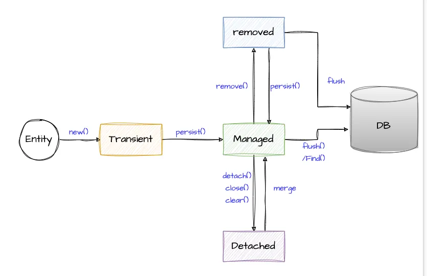

#### 인덱스
- [영속성 컨텍스트](#영속성-컨텍스트)
- [엔티티 매니저 팩토리와 엔티티 매니저](#엔티티-매니저-팩토리와-엔티티-매니저)
- [JNDI와 커넥션 풀](#jndi와-커넥션-풀)
- [`JpaRepository`, 메서드 이름 기반 쿼리, `@Query`, Querydsl의 엔티티 매니저 요청 흐름](#jparepository-메서드-이름-기반-쿼리-query-querydsl의-엔티티-매니저-요청-흐름)
- [엔티티 매니저의 생성 및 동작 과정](#엔티티-매니저의-생성-및-동작-과정)


## 영속성 컨텍스트

[영속성에 대한 위키백과 문서](https://en.wikipedia.org/wiki/Persistence_(computer_science))

[영속성 컨텍스트 설명 블로그](https://www.baeldung.com/jpa-hibernate-persistence-context)

백엔드나 컴퓨터 과학을 학습하다보면 **영속(Persistence)** 이라는 단어를 줄곧 접하게 된다

본래 영속 또는 영속성이란 단어의 의미는 "영원히 계속되는 성질이나 능력"을 의미하는데 컴퓨터 과학에서는 프로세스가 만든 데이터를 데이터 스토리지에 저장하여 프로세스가 종료된 후에도 유지할 수 있게 하며, 프로세스와 스토리지 장치 간에 각각의 자료구조(객체<->레코드)로 매핑하여 데이터를 이동하는 것을 뜻한다

자바는 JPA(Jakarta Persistence API)를 통해 영속화를 구현하며 **영속성 컨텍스트**라는 메모리 공간을 통해 자바와 데이터베이스 간의 매핑을 관리한다

데이터베이스 접근 비용이 크기 때문에 이를 최소화하고자 프로그램과 DB 사이에 **캐시 역할**을 하는 중간 계층을 두는 것이다

JPA 구조에 따르면 영속성 컨텍스트는 **엔티티 매니저**(`SessionImpl`)라고 하는 인터페이스와 상호작용하며 엔티티를 관리한다

영속성 컨텍스트가 관리하는 데이터를 **엔티티**라고 부르며, 영속성 컨텍스트는 엔티티를 조회, 변경, 삭제할 수 있는 기능과 1차 캐시, 엔티티 동일성 보장, 쓰기 지연, 변경 감지, 플러시 등의 최적화 기능을 제공한다

**1차 캐시**란 DB에 조회했거나 저장할 객체들을 모아두는 장소이다. 영속성 컨텍스트는 DB에 접근하기 전 1차 캐시를 먼저 확인하고 조회할 엔티티가 없는 경우에 DB로부터 데이터를 가져온다

가져온 데이터는 1차 캐시에 보관하며 이후 동일한 ID로 조회하면 DB 접근없이 곧바로 1차 캐시에서 찾아온다

이는 영속성 컨텍스트가 동일한 트랜잭션 내에서 ID를 기반으로 엔티티를 추적하여 엔티티의 동일성을 보장할 수 있기 때문이다

**쓰기 지연(Write-Behind, Delayed-Write)**은 쿼리 호출(엔티티 매니저 API)을 하는 시점에 즉시 DB에 반영하지 않고 내부 쿼리 저장소에 모아둔 다음, 트랜잭션 커밋 또는 플러시할 때 한 번에 쿼리를 실행하는 특징이다

쓰기 지연은 성능 최적화에 도움을 주지만 플러시 타이밍을 잘못 관리하면 의도치 않게 잘못된 정보를 DB에 반영할 수 있다

영속성 컨텍스트는 엔티티의 동일성을 보장함과 동시에 **엔티티에 대한 스냅샷**을 남겨 엔티티의 변경 사항도 추적한다

따라서 영속성 컨텍스트가 관리하는 엔티티(영속 상태)는 트랜잭션 커밋 시점에 변경된 필드가 감지되어 자동으로 `UPDATE` 쿼리가 생성된다 (**변경 감지 (Dirty Checking)**)

영속성 컨텍스트에 포함된 엔티티들을 DB에 반영하는 동작을 **플러시(flush)**라고 한다

플러시는 `EntityManager.flush()`, 트랜잭션 커밋 시점이나 JPQL 실행 직전에 발생한다 (플러시를 해도 트랜잭션을 커밋하지 않으면 DB에 임시 반영 상태로만 존재한다)

엔티티는 아래의 이미지와 같이 영속성 컨텍스트에 의해 관리되는 상태를 가진다



[이미지 출처](https://medium.com/javarevisited/spring-data-jpa-entity-lifecycle-model-c67fdae2d0c2)

`NEW` 상태는 새로 생성된 객체이며 아직 영속성 컨텍스트에 등록되지 않은 비영속 상태를 의미한다 (`entityManager.persist()` 호출 전)

`MANAGED` 상태는 `entityManager.find()`로 데이터베이스에서 불러오거나 `entityManager.persist()`를 호출하여 영속성 컨텍스트에 의해 관리되는 영속 상태인 엔티티를 의미한다 (`persist()`는 엔티티를 영속성 컨텍스트에 등록하여 MANAGED 상태로 전이시키는 메서드로 이 시점에는 INSERT 쿼리가 나가지 않음)

`DETACHED` 상태는 `clear`, `detach`, `close` 메서드를 호출하여 영속성 컨텍스트에 의해 관리되지 않는 엔티티의 상태를 말한다

`REMOVED` 상태는 `remove` 메서드를 통해 데이터베이스에서 삭제되어야 할 엔티티에게 부여된다

엔티티 매니저의 `persist`, `merge`, `remove`, `detach`, `clear` 등의 메서드를 통해 영속성 컨텍스트가 관리하는 엔티티의 상태를 변경할 수 있다

일반적으로 트랜잭션 범위 내에선 `NEW` 또는 `MANAGED`, `REMOVED` 상태로만 전이되고, 트랜잭션이 종료된 상태(트랜잭션이 없는 범위)의 엔티티는 `DETACHED` 상태가 된다

```java
// 영속성 컨텍스트에 의해 관리되는 상태 (MANAGED)
User user = em.find(User.class, 1L); 

// 영속성 컨텍스트에서 분리한다 (DETACHED)
em.detach(user);

// 영속성 컨텍스트를 비운다 (모든 엔티티가 DETACHED 상태로 전이됨)
em.clear();
```

`DETACHED` 상태가 되면 엔티티가 메모리에 존재하지만 엔티티 매니저가 관리하지 않기 때문에 변경 감지, 플러시, 쿼리 생성, 1차 캐시, 지연 로딩 대상에서 제외된다

즉, **자바 객체로서의 상태를 변경하는 것은 가능하지만 영속성 컨텍스트에서 이를 추적하지 않기 때문에 DB에 반영되지 않는다**

따라서 트랜잭션 내부에서만 엔티티를 조작하고 외부 계층에 전달하려면 DTO를 사용하는 것이 안전하다

```java
@Transactional
public User loadAndReturnUser() {
    // 트랜잭션 범위이므로 엔티티는 MANAGED가 된다
    return userRepository.findById(1L).orElseThrow(); 
}

/*
   다른 서비스나 컨트롤러에서 User 엔티티를 받아 변경한다
   이 User 엔티티는 트랜잭션 범위 밖에서 이용되므로 영속성 컨텍스트에 포함되지 않는다 (DETACHED 상태) 
   따라서 여기서 발생한 변경사항은 감지되지 않고 update 쿼리가 생성되지 않는다     
*/
public void updateName(User user) {
    user.setName("changed");
}
```

`merge` 메서드는 `DETACHED` 상태의 엔티티를 영속성 컨텍스트에 다시 연결하여 `MANAGED` 상태로 전이시키는 역할을 한다

`entityManager.merge(entity)` 메서드의 동작은 다음과 같다
- 인자로 받은 `DETACHED` 엔티티의 식별자를 기준으로 현재 영속성 컨텍스트에 동일한 식별자를 가진 `MANAGED` 엔티티가 있는지 확인한다
- 있으면 `DETACHED` 엔티티의 필드 값으로 기존 엔티티의 필드를 덮어쓴다
- 없으면 DB에서 조회한 다음 새로운 `MANAGED` 엔티티를 생성하고, `DETACHED` 엔티티의 필드 값으로 덮어쓴다
- 그 다음 새로 생성한 `MANAGED` 엔티티를 반환하며 인자로 받은 `DETACHED` 객체는 여전히 `DETACHED` 상태로 남아있다

[테스트 코드](../src/test/java/hansanhha/entity_manager/PersistenceStateTest.java)

여기서 포인트는 `merge` 메서드는 `DETACHED` 엔티티의 값으로 기존 엔티티의 모든 값을 덮어쓴다는 것이다

실제로 엔티티 매니저 API를 호출하는 일은 드물겠지만 리포지토리 인터페이스를 사용하면 그 구현체인 SimpleJpaRepository의 `save(entity)` 메서드에서 `entityManager.merge(entity)`를 호출하게 된다

`save` 메서드는 내부적으로 `entityInformation.isNew(hansanhha.entity)`를 호출하여 엔티티의 ID가 null이거나 0인 경우 새 엔티티로 판단하고, 아니라면 기존 엔티티로 판단하고 `merge`를 호출하여 모든 필드 값을 덮어쓴다 (설정을 통해 이 동작을 바꿀 수 있음)

따라서 **영속 상태의 엔티티를 `save` 메서드로 전달하는 것보다 변경 감지 기능을 활용하여 엔티티의 변경 사항을 DB에 반영시키는 것이 안전하다**

```java
@Transactional
public <S extends T> S save(S entity) {
    if (entityInformation.isNew(entity)) {
        entityManager.persist(entity);
        return entity;
    } 
    // 기존 엔티티인 경우 merge를 호출하여 모든 필드 값을 덮어쓴다
    else {
        return entityManager.merge(entity);
    }
}
```

영속성 컨텍스트의 범위는 트랜잭션 제한 여부에 따라 달라질 수 있다

트랜잭션이 시작과 종료에 맞춰 생성 및 소멸되는 영속성 컨텍스트를 **트랜잭션 스코프 영속성 컨텍스트 (Transaction-scoped persistence context)**라고 한다

반면 트랜잭션이 없어도 유지되는 영속성 컨텍스트인 **확장 영속성 컨텍스트 (Extended persistence context)**는 여러 트랜잭션 동안 같은 컨텍스트를 공유할 수 있다 (플러시해서 DB에 변경 사항을 반영하려면 트랜잭션 커밋이 필요하다)

기본적으로 스프링의 영속성 컨텍스트는 트랜잭션 스코프를 가지며 확장 스코프는 개발자가 필요한 경우에만 사용된다

스프링은 **무상태(stateless)**를 지향하기 때문에 각 요청으로부터 독립된 싱글톤 빈, 트랜잭션, 영속성 컨텍스트를 생성하고 처리하는 게 일반적이다

확장 스코프는 한 번 생성된 엔티티 매니저와 영속성 컨텍스트를 특정 세션에 걸쳐 오래 유지해야 하므로 상태를 가진 컴포넌트(stateful bean)를 필요로 하고 데이터베이스 커넥션을 낭비하게 된다

또한 트랜잭션 스코프는 `@Transactional`로 명확한 경계를 지을 수 있지만 확장 스코프는 하나의 영속성 컨텍스트가 여러 트랜잭션에 걸쳐 사용될 수 있으므로 트랜잭션 상태 추적이 어렵고 데이터 정합성(데이터가 일관된 상태를 유지하는 특성) 문제가 발생하기 쉽다 

예를 들어 사용자가 A 요청에서 엔티티를 수정하고 B 요청에서 커밋한다면 중간에 데이터가 변경되어도 감지되지 않거나 더티 체킹이 잘못 동작할 수 있다

결국 상태 유지로 인해 복잡도와 관리 비용 문제가 증가하기 때문에 스프링은 트랜잭션 스코프 영속성 컨텍스트를 기본으로 사용한다


## 엔티티 매니저 팩토리와 엔티티 매니저

간단 요약
- Persistence Unit: JPA 설정 단위 - 관리할 엔티티 목록, 프로바이더, 속성 등
- EntityManagerFactory: Persistence Unit을 기반으로 엔티티 매니저를 만드는 스레드 세이프한 팩토리 (일반적으로 싱글톤)
- Persistence Context: 특정 엔티티 매니저가 관리하는 영속성 컨텍스트, 해당 컨텍스트에 속한 엔티티 인스턴스의 집합
- EntityManager: Persistence Context를 대표하는 JPA의 API, 스레드 비세이프

#### Persistence Unit

JPA 스펙에서 정의하는 논리적 영속성 단위로 `persistence.xml` 파일의 `<persistence-unit> ...` 혹은 스프링 부트 자동설정으로 구성된다 (스프링 부트도 내부적으로 내장된 `persistence.xml`을 파싱하여 구성한다)

엔티티 클래스 목록(`@Entity` 스캔), JPA 프로바이더(하이버네이트), 데이터 소스(HikariCP), 트랜잭션 타입(JTA/RESOURCE_LOCAL), 벤더 속성(ddl-auto, dialect) 등을 정의한다

#### 엔티티 매니저 팩토리

```text
                 [ApplicationContext]
                         │
                         ▼
      [LocalContainerEntityManagerFactoryBean]
                         │
         ┌───────────────┼────────────────┐
         ▼               ▼                ▼
  DataSource       JpaVendorAdapter    JPA 설정(properties)
         │               │                │
         └───────→ EntityManagerFactory ◀─┘
                         │
                         ▼
                   EntityManager
```

엔티티 매니저 생성 책임을 가지며 이와 관련된 메타데이터(엔티티 매핑), 커넥션 풀 설정, 2차 캐시 등의 자원을 초기화한다

스프링의 `LocalContainerEntityManagerFactoryBean`에 의해 스프링 컨텍스트에 등록된다

```java
EntityManagerFactory emf = Persistence.createEntityManagerFactory("examplePU");
EntityManager em = emf.createEntityManager();

em.persist(entity);
em.flush();
em.close();
emf.close();
```

**엔티티 매니저**는 [영속성 컨텍스트](#영속성-컨텍스트)를 조작하는 API로 개발자는 `@PersistenceContext` 어노테이션을 통해 스프링 컨텍스트로부터 주입받을 수 있다

스레드 비세이프하기 때문에 스프링은 프록시를 주입하며 API 호출 시 현재 스레드의 적절한 실제 엔티티 매니저로 라우팅해준다 (트랜잭션 바인딩)

일반적으로 엔티티 매니저를 직접 주입받아서 사용하는 대신 리포지토리 인터페이스를 거쳐 간접적으로 사용하게 된다


## JNDI와 커넥션 풀

JDBC
- Java Database Connectivity
- 자바와 데이터베이스 간 상호작용 표준 API
- 각 데이터베이스 벤더에서 JDBC 드라이버 제공

DataSource
- 커넥션 풀 추상화 SPI(Service Provider Interface)
- 스프링 부트 기본 구현체: HikariCP 

JNDI(Java Naming And Directory Interface)란 디렉토리 및 네이밍 서비스에 접근하기 위한 API이다

코드 안에 자원(데이터베이스, 메일, JMS 등)을 직접 넣지 않고 외부 리소스로 저장한 다음, 이름으로 조회해 사용할 수 있도록 하기 위해 제공된다

주로 애플리케이션 서버에서 데이터 소스를 JNDI로 등록해두고 필요한 경우 이름을 통해 찾은 다음 사용한다

보통 레거시 스프링 프로젝트인 경우에 JNDI를 사용하여 커넥션 풀을 가져온다

스프링 부트는 기본적으로 프로퍼티 파일에 기반하여 자체적으로 커넥션 풀을 자동 생성하기 때문에 JNDI lookup을 하지 않고도 커넥션 풀을 관리할 수 있다

`spring.datasource.jndi-name` 프로퍼티를 설정하면 JNDI lookup을 통해 데이터 소스를 가져오는 모드로 전환할 수 있다


## `JpaRepository`, 메서드 이름 기반 쿼리, `@Query`, Querydsl의 엔티티 매니저 요청 흐름

`@Transactional` 어노테이션은 트랜잭션을 선언적으로 관리하기 위해 사용되며 읽기 모드 전용, 트랜잭션 전파, 격리 수준 등 다양한 속성을 제공한다

관계형 데이터베이스와 상호작용할 때 트랜잭션 경계를 정의하고 커밋/롤백을 자동으로 처리한다

전통적인 스프링 부트 애플리케이션의 개발 워크플로우는 아래처럼 리포지토리 인터페이스를 정의하고 서비스 클래스에서 해당 인터페이스를 주입받아 사용한다

서비스 클래스 레벨 또는 메서드 레벨에 `@Transactional` 어노테이션을 사용하면 스프링은 AOP를 기반으로 트랜잭션을 관리한다

```java
public interface UserRepository extends JpaRepository<User, Long> {
}
```

```java
@Service
@Transactional
@RequiredArgsConstructor
public class UserService {
    
    private final UserRepository userRepository;
    
    public Long createUser(String name) {
        User save = userRepository.save(new User(name));
        return save.getId();
    }
}
```

트랜잭션 범위에 국한되어 비즈니스 로직을 수행하는 `UserService`가 의존하는 `UserRepository` 리포지토리 인터페이스는 실질적으로 스프링 데이터 JPA에서 제공하는 `SimpleJpaRepository`를 통해 구현된다

그리고 `SimpleJpaRepository`는 내부적으로 `EntityManager`를 스프링 컨텍스트로부터 주입받아 사용한다

따라서 `트랜잭션 AOP 프록시` -> `UserService` -> `UserRepository` -> `QueryExecutorMethodInterceptor` -> `SimpleJpaRepository` -> `EntityManager` 흐름을 가지게 된다

`QueryExecutorMethodInterceptor`는 리포지토리 인터페이스 메서드 호출을 프록시가 가로채서 그 메서드가 어떤 타입인지 판별하고, 그에 따라 실행 전략을 결정한 뒤 적절한 실행 객체로 위임하는 역할을 한다

```text
서비스 객체
    ↓
리포지토리 인터페이스
    ↓
QueryExecutorMethodInterceptor
    ↓
실행 전략 결정
    ↓
JpaRepository 메서드, 메서드 이름 기반 쿼리, @Query, Querydsl, Specification 등
```

간단한 엔티티 관리 기능이라면 `JpaRepository` 또는 `CrudRepository`의 메서드를 사용하지만 그 이상 복잡해지면 메서드 이름 기반, `@Query`, Querydsl을 이용한다

각 추가 기능에 대한 흐름은 다음과 같다 (마찬가지로 모두 `트랜잭션 AOP 프록시` -> `UserService` -> `UserRepository` 흐름을 가지기 때문에 생략한다)

메서드 이름 기반 쿼리: `QueryExecutorMethodInterceptor` -> `PartTreeJpaQuery` -> `EntityManager`

`@Query`: `QueryExecutorMethodInterceptor` -> `StringBasedJpaQuery` -> `EntityManager`

Querydsl: `QueryExecutorMethodInterceptor` -> `JPAQueryFactory` -> `JPAQuery` -> `EntityManager`


## 엔티티 매니저의 생성 및 동작 과정

[위 글](#jparepository-메서드-이름-기반-쿼리-query-querydsl의-엔티티-매니저-요청-흐름)에서 볼 수 있듯이 DB와 상호작용하는 최종 주체는 엔티티 매니저이다

곰곰이 생각해보면 스프링은 기본적으로 모든 빈을 싱글톤으로 관리하면서 멀티스레딩을 기반으로 동작하는데 어떻게 엔티티 매니저가 각 스레드의 트랜잭션 범위에 맞게 DB 요청을 처리할 수 있을지 의문이 들 수 있다

결론부터 먼저 간단히 말하자면 AOP이다. 만능의 AOP (실질적으로 구현할 일은 드물지만 막강한 힘을 발휘하는 기능)

엔티티 매니저 그 자체로 스프링 컨텍스트에 등록된다면 유연한 처리가 불가능했겠지만, 스프링은 요청을 처리하는 시점에 실제 엔티티 매니저를 생성하고 폐기하여 멀티스레딩에서도 정상적으로 영속화를 할 수 있도록 한다

`LocalContainerEntityManagerFactoryBean`: [Persistence Unit](#persistence-unit)을 기반으로 `EntityManagerFactory`, `PersistenceUnitInfo` 초기화 및 스프링 컨텍스트에 등록하는 팩토리 빈

`SharedEntityManagerCreator`: JDK 동적 프록시 기반의 엔티티 매니저를 생성하는 정적 팩토리 클래스

엔티티 매니저 팩토리를 받아와서 프록시 엔티티 매니저를 생성한다

```java
public class SharedEntityManagerCreator {

    // 프록시 엔티티 매니저 생성 메서드
    public static EntityManager createSharedEntityManager(EntityManagerFactory emf, @Nullable Map<?, ?> properties,
			boolean synchronizedWithTransaction, Class<?>... entityManagerInterfaces) {

		ClassLoader cl = null;
		if (emf instanceof EntityManagerFactoryInfo emfInfo) {
			cl = emfInfo.getBeanClassLoader();
		}

		Class<?>[] ifcs = new Class<?>[entityManagerInterfaces.length + 1];
		System.arraycopy(entityManagerInterfaces, 0, ifcs, 0, entityManagerInterfaces.length);
		ifcs[entityManagerInterfaces.length] = EntityManagerProxy.class;

		return (EntityManager) Proxy.newProxyInstance(
				(cl != null ? cl : SharedEntityManagerCreator.class.getClassLoader()),
				ifcs, new SharedEntityManagerInvocationHandler(emf, properties, synchronizedWithTransaction));
	}
}
```

`SharedEntityManagerBean`: 스프링 컨텍스트에 등록되는 엔티티 매니저 타입의 빈

내부적으로 `FactoryBean<EntityManager>` 역할을 하여 호출 시 `SharedEntityManagerCreator`를 이용하여 프록시를 생성한다 (`SharedEntityManagerBean`은 엔티티 매니저 팩토리에 접근할 수 있다)

```java
// 스프링 컨텍스트에 등록되는 엔티티 매니저 타입 빈
public class SharedEntityManagerBean {

    // 스프링은 SharedEntityManagerCreator를 통해 생성한 프록시 엔티티 매니저를 주입한다
    @Nullable
	private EntityManager shared;

    @Override
    public final void afterPropertisSet() {
        this.shared = SharedEntityManagerCreator.createSharedEntityManager(
				emf, getJpaPropertyMap(), this.synchronizedWithTransaction, this.entityManagerInterface);
    }
}
```

`SharedEntityManagerInvocationHandler`: JDK 동적 프록시의 `InvocationHandler` 구현체

엔티티 매니저 인터페이스의 메서드 호출을 가로채서 올바른 실제 엔티티 매니저에게 위임한다

리포지토리 메서드/`@Query`/Querydsl 등 -> 엔티티 매니저 프록시 메서드 -> `SharedEntityManagerInvocationHandler.invoke()` -> 트랜잭션 동기화 매니저에서 바인딩된 엔티티 매니저 조회 -> 없는 경우 생성 -> 실제 엔티티 매니저 호출

`JpaTransactionManager`: `PlatformTransactionManager`의 스프링 JPA 구현체

트랜잭션 경계(`@Transactional`) 안에서 엔티티 매니저의 생명주기와 DB 트랜잭션을 관리한다

`TransactionSynchronizationManager`: 현재 스레드와 트랜잭션 동기화 자원을 관리한다 (스레드 로컬 기반)

### 전체 흐름 정리

#### 1. 스프링 부트 애플리케이션 로드 시점

##### `LocalContainerEntityManagerFactoryBean`, `JpaTransactionManager`

스프링 데이터 JPA 자동 구성 시작: `HibernateJpaAutoConfiguration`(`JpaBaseConfiguration`)

스프링 부트가 `/META-INF/persistence.xml`, DataSource (프로퍼티 파일) 등의 설정을 읽고 `LocalContainerEntityManagerFactoryBean`을 초기화한다

내부적으로 애플리케이션 전체에서 사용되는 `EntityManagerFactory`를 생성한다

트랜잭션 경계(`@Transactional`)를 처리할 트랜잭션 매니저를 빈으로 등록한다

##### `SharedEntityManagerCreator`, `SharedEntityManagerBean`, `SharedEntityManagerInvocationHandler`

`SharedEntityManagerBean`이 `FactoryBean` 역할을 하여 스프링 컨텍스트에 등록되며 내부적으로 `SharedEntityManagerCreator`를 통해 생성한 프록시 엔티티 매니저를 보관한다

개발자가 `@PersistenceContext`, `@Autowired EntityManager`를 선언하거나 기타 구현체에서 엔티티 매니저를 필요로 하면 스프링은 보관 중인 프록시 엔티티 매니저를 주입한다

이 프록시 동작은 `SharedEntityManagerInvocationHandler`가 구현하며 런타임에 실제 엔티티 매니저를 생성하거나 바인딩하여 요청을 위임한다

##### 리포지토리 인터페이스

`@EnaleJpaReposiroies`에 의해 `UserRepository extends JpaRepository<User, Long> ` 같은 JPA 리포지토리 인터페이스들이 스캔된다 (커스텀 리포지토리 포함)

`JpaRepositoryFactory`는 각 인터페이스마다 동적 프록시 기반의 구현체를 생성한다

이 프록시는 메서드 호출을 가로채고 인터페이스에 선언된 메서드를 분석하여 종류에 따라 적절한 구현체(`SimpleJpaRepository`, 커스텀 리포지토리 등)에게 호출을 위임한다

#### 2. 런타임 시점

##### 트랜잭션 시작

`@Transactional` 메서드 진입 시 트랜잭션 프록시 AOP 동작

`JpaTransactionManager`가 호출되어 엔티티 매니저 팩토리(`LocalContainerEntityManagerFactoryBean`)를 통해 엔티티 매니저를 생성한다

`TransactionSynchronizationManager.bindResource()` 메서드를 통해 현재 스레드에 엔티티 매니저를 바인딩한다

`em.getTransaction().begin()` - 트랜잭션 시작

##### 리포지토리 인터페이스 메서드 호출

서비스 객체가 리포지토리 인터페이스의 메서드를 호출하면 애플리케이션 로드 시점에 생성된 프록시에게 가로채진다

`QueryExecutorMethodInterceptor` 프록시는 메서드 종류에 따라 `SimpleJpaRepository`, 커스텀 리포지토리 구현체 등에게 호출을 위임한다

메서드 이름 기반 쿼리: `QueryExecutorMethodInterceptor` -> `PartTreeJpaQuery` -> `EntityManager`

`@Query`: `QueryExecutorMethodInterceptor` -> `StringBasedJpaQuery` -> `EntityManager`

Querydsl: `QueryExecutorMethodInterceptor` -> `JPAQueryFactory` -> `JPAQuery` -> `EntityManager`

##### 엔티티 매니저 API 호출

위임된 호출은 이후에 엔티티 매니저 API를 호출한다

이 때 각 구현체에 주입된 엔티티 매니저는 `SharedEntityManagerCreator`로부터 생성된 동적 프록시인데, 이 프록시가 엔티티 매니저 API 호출을 가로챈다

프록시의 구현체는 `SharedEntityManagerInvocationHandler`이며 트랜잭션 동기화 매니저로부터 현재 스레드에 바인딩된 엔티티 매니저를 조회한다

실제 엔티티 매니저 API (`persist`, `merge`, `createQuery` 등)를 호출하여 DB와 상호작용한다