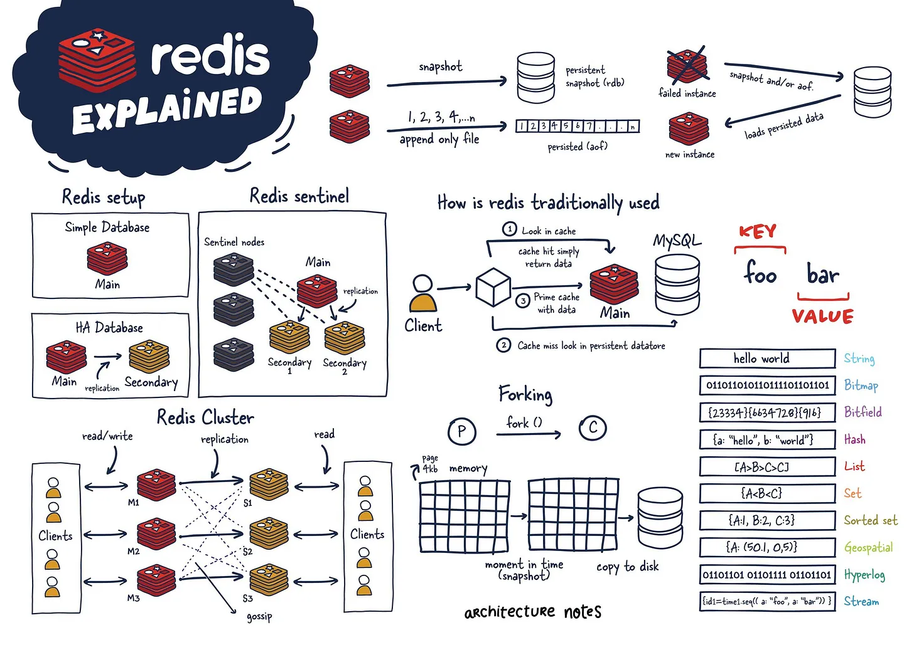
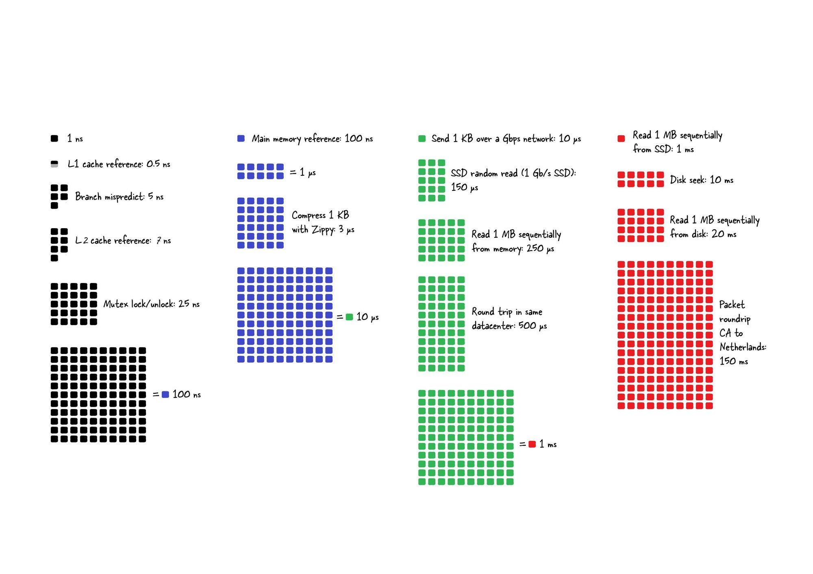
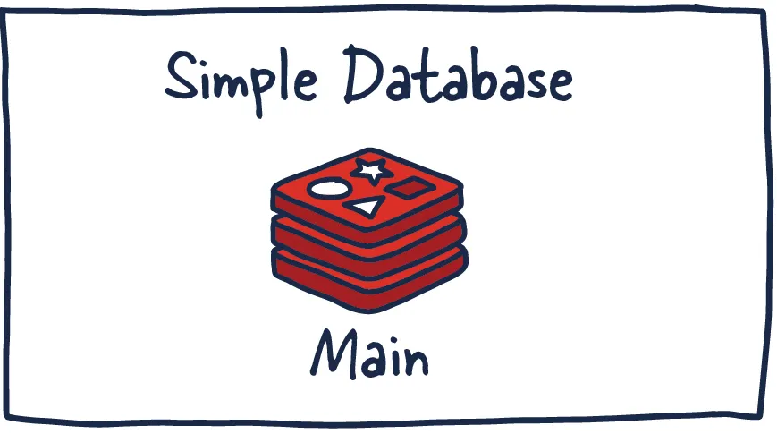
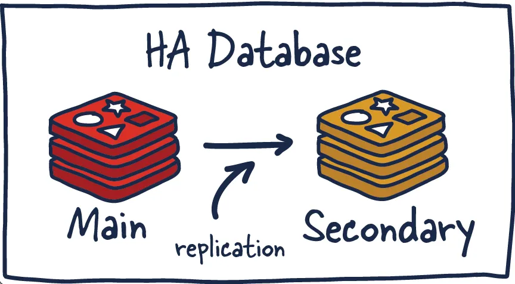
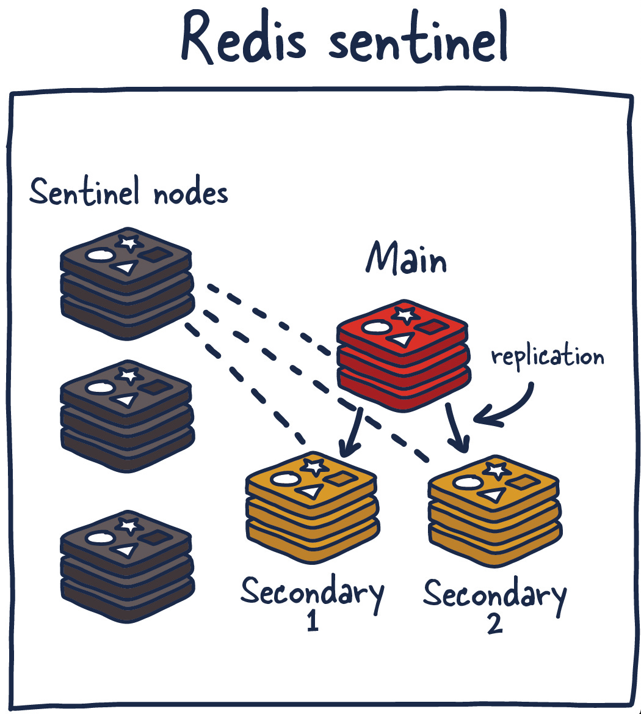
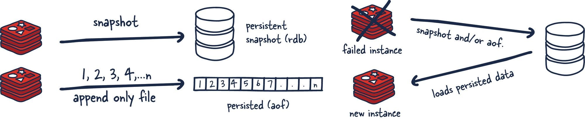

#### 인덱스
- [레디스](#레디스)
- [영속 모델](#영속-모델)
- [레디스 키](#레디스-키)
- [데이터 구조](#데이터-구조)
- [트랜잭션](#트랜잭션)
- [레디스 클라이언트-서버 모델](#레디스-클라이언트-서버-모델)
- [스프링 데이터 레디스](#스프링-데이터-레디스)
- [`@RedisHash`](#redishash)
- [레디스 `@Transactional`](#레디스-transactional)
- [스프링 캐시 통합](#스프링-캐시-통합)
- [테스트 with Testcontainers](#테스트-with-testcontainers)


## 레디스



[이미지 출처](https://architecturenotes.co/p/redis)

디스크(SSD, HDD)에다 데이터를 읽고 쓰는 대신 메모리에서 수행하면 훨씬 빠르게 처리할 수 있을 것이다

각 유즈케이스에 따라 사용할 수 있는 데이터 구조(String, Hash, Set 등)가 미리 정의되어 있을 뿐만 아니라 Pub-Sub 메커니즘, 스트리밍, 큐 등 다양한 기능들이 포함되어 있는 인메모리 데이터베이스가 바로 **Redis(Remote Dictionary Service)**이다

MySQL이나 PostgreSQL과 같은 데이터베이스 앞 단에 두어 캐시처럼 사용함으로써 애플리케이션의 성능을 높일 수 있다

**자주 변경되지 않으면서 참조되는 데이터**나 **부가적인 정보(서비스 핵심 정보가 아닌 것)**들을 저장하는 데 사용된다 (레디스를 메인 데이터베이스처럼 사용하는 경우에는 얘기가 달라짐)

**지연율(latency)과 대역폭(bandwidth) 비교**




## 레디스 운용 전략

유즈케이스와 스케일 여부에 따라 다음과 같은 운용 전략을 선택할 수 있다
- **단일 인스턴스**
- **레플리케이션**
- **센티널**
- **클러스터**

### 단일 인스턴스



단일 인스턴스는 주로 캐싱을 하기 위해 사용되며 적절한 메모리 공간과 서버 자원을 할당하면 간단한 설정으로도 성능 향상을 주요하게 높일 수 있다

다만 해당 인스턴스에 오류가 발생하면 모든 클라이언트 요청은 실패하게 되고 시스템의 전체 성능과 속도에 영향을 끼치게 된다

참고로 레디스는 클라이언트로부터 받은 데이터 처리 요청을 메모리에서 가장 먼저 처리하고, 그 다음 해당 인스턴스에서 **영속**한다

**데이터 영속**은 특정 기간(인터벌)동안 동작하는 포크된 프로세스에 의해 RDB 스냅샷 또는 AOF(append-only files)로 수행된다

덕분에 레디스가 재시작하거나 실패해도 모든 데이터를 잃어버리지 않고 RDB 스냅샷이나 AOF로 데이터를 읽어들여 클라이언트 요청을 계속 처리할 수 있게 하며 레플리케이션이나 복잡한 토폴로지를 구성할 수 있도록 한다

### 레플리케이션



또 다른 주요 운영 전략인 **레플리케이션**은 마스터 인스턴스(메인)와 이를 복제하여 동기화를 유지하는 레플리카 인스턴스(보조)를 같이 두는 것이다 (레플리카 인스턴스는 하나 또는 여러 개의 인스턴스를 둘 수 있다)

마스터에 데이터가 쓰여지면 해당 명령의 사본을 레플리카에 전달하는 **비동기식 로그 스트리밍 구조(Async Stream Replication)**를 가진다

레플리카를 통해 레디스의 읽기를 스케일링하거나 마스터가 실패했을 때 레플리카를 마스터로 승격시켜 클라이언트 요청을 계속 처리할 수 있다

각 인스턴스는 **레플리케이션 ID**와 **오프셋**을 가지는데, 이 데이터를 기반으로 복제 프로세스 및 동기화를 수행하며 메인 인스턴스의 액션에 따라 오프셋 값이 증가한다

**오프셋**: 마스터과 레플리카 사이의 명령 스트림의 싱크를 위해 사용, 어느 지점까지 레플리카가 데이터를 받아갔는지 나타낸다

**레플리케이션 ID**: 인스턴스를 구분하는 고유 ID로 현재 보조 세션의 출처를 식별한다

각 레디스 서버는 시작할 때 고유한 레플리케이션 ID를 가지고 시작하며 레플리카는 이 값을 통해 누구와 동기화하는지 식별한다

이 때 주 레플리케이션 ID와 보조 레플리케이션 ID를 가져서 현재 마스터 세션 ID와 이전 마스터 세션 ID를 보관한다 (현재 마스터 세션이 실패한 경우 이전 마스터 세션과 부분 동기화 진행)

**레플리카가 현재 마스터와 같은 레플리케이션 ID를 가지면 부분적으로 동기화할 수 있지만 다른 값을 가진다면 full resync가 발생한다**

동일한 레플리케이션 ID와 오프셋을 가지면 마스터와 레플리카는 동기화 상태이다

### 레디스 센티널



레디스 센티널은 레디스의 고가용성을 실현하는 핵심 요소로 마스터 장애 시 자동으로 복구를 수행한다

**고가용성, HA(High-Availability)**란 운영 성능(주로 가동 시간)을 업계 내의 평균보다 더 긴 기간 동안 보장하는 시스템의 특성을 말한다

HA 시스템은 단일 실패 지점(Single point of failure)을 두지 않음으로써 시스템 실패를 빠르게 복구한다

또한 메인-보조 시스템 간 데이터 전달 중 데이터를 유실하지 않는 안정적인 환경을 구성하고, 자동으로 시스템 실패를 감지하고 복구한다

이를 위해 레디스 센티널은 모니터링, 알림, 실패 관리, 구성 관리 기능을 제공한다

**모니터링**: 마스터와 레플리카 노드가 정상적으로 동작 중인지 헬스 체크

**알림**: 장애 감지 시 관리자나 다른 시스템에 알림 전달

**실패 관리**: 마스터가 죽었다고 합의되면 새로운 마스터 선출 및 레플리카 재구성

**구성 관리**: 클라이언트가 현재 마스터의 위치(IP/Port)를 알 수 있도록 지원

### 레디스 클러스터


## 영속 모델



레디스의 영속 모델은 세 가지로 나뉜다

**영속 안함**: RDB 스냅샷 또는 AOF 기능을 사용하지 않는 방법으로 레디스를 가장 빠르게 동작시키지만 지속성(Durability)을 보장할 수 없다

데이터 유실을 허용하는 캐시 서버로써 레디스를 사용하는 경우 영속화를 꺼버리는 게 좋다

**RDB(Redis Database) 파일**: 일정된 간격동안 특정 시점의 메모리에 대한 스냅샷을 남긴다

RDB 영속 모델은 스냅샷 주기 사이에 데이터가 유실될 수 있고 메인 프로세스로부터 포크된 프로세스에 의존한다는 단점이 있다 (자식 프로세스는 부모 프로세스와 메모리를 공유하며 영속해야되는 메모리를 처리한다)

**AOF(Append Only File)**: 레디스에서 실행된 쓰기 명령(SET, DEL, LPUSH 등)을 텍스트 포맷으로 로그한다

DBMS의 WAL(Write-Ahead Log)와 유사한 개념으로 레디스 재시작 시 이 파일을 처음부터 재실행하여 메모리를 복원한다

디스크 쓰기 부하가 크며 시간이 지나면서 파일 크기가 커짐에 따라 파일 리라이트를 해야하거나 복원 시 모든 명령을 재실행하느라 RDB보다 느린 속도를 가질 수 있다


## 레디스 키

기본적으로 레디스는 key-value 저장소로써 동작한다

키-값 저장소는 데이터를 키와 값의 쌍 형태로 저장하고 접근하는 데이터 저장 방식을 사용한다

`key 1 -> value X`

키를 통해 직접 접근하기 때문에 `O(1)` 수준의 빠른 검색 속도를 가지며 값의 구조가 자유로우며 무엇이든 저장할 수 있는 유연성을 가진다

RDB와 달리 "관계"가 없으며 조인을 하지 않는다

키는 유일한 식별자 역할하는 문자열로 레디스 서버 내에서 고유해야 한다

동일한 키를 가지면 기존 키를 덮어쓰게 되므로 `:` 구분자를 사용하여 키를 네임스페이스 식별자처럼 사용하여 키 충돌을 피하는 게 관례이다

레디스는 키를 내부적으로 binary-safe로 구현하기 때문에 JPEG 파일이나 구조체 값 등의 바이트 시퀀스를 키로써 사용할 수도 있다

`users:1033:name`
- 공백을 허용하지만 혼동을 줄 수 있으므로 사용 X
- 대소문자 구분
- 너무 짧거나 긴 키 사용 X
- 카테고리 별로 콜론으로 구분하여 표현하는 게 적절하다

레디스는 특정 키에 대해 유효기간을 지정할 수 있는 **TTL(Time To Live)** 기능을 제공한다

TTL은 N초 후 또는 특정 시각이 되면 특정 키를 자동으로 삭제한다

정확히는 지연 삭제 또는 주기적 삭제 방식으로 만료된 키를 삭제한다

지연 삭제: 어떤 키에 TTL이 걸려있으면 그 키를 조회(GET)하는 순간에 만료 여부를 판단하고 삭제한다 - CPU를 절약하지만 메모리를 잠시 더 점유할 수 있다

주기적 삭제: 레디스가 백그라운드 스레드에서 주기적으로 만료 키를 랜덤 샘플링하여 제거한다 - 과부하를 방지하기 위해 한 번에 전체 키를 검사하지 않고 일부만 샘플링

TTL 정보는 RDB 스냅샷, AOF, 복제(마스터 -> 레플리카 전송 시)를 사용할 때도 함께 저장된다

```shell
EXPIRE  key 5     # 5초 후 만료
PEXPIRE key 5000  # 밀리초 단위 만료 

EXPIREAT key 1293840000 # UNIX 타임스탬프 시각에 만료 (초 단위)
PEXPIREAT key 1293840000 # 밀리초 단위 타임스탬프 만료

SET key value EX 60 # 값을 저장하면서 TTL 동시 설정 (초 단위)

PERSIST key # TTL 제거 (해당 키는 만료되지 않는다)

TTL  key # 남은 TTL 초 반환 (-1: 없음, -2: 키 없음)
PTTL key # 밀리초 단위 TTL 반환
```


## 데이터 구조

키-값 데이터베이스는 데이터 모델을 RDB처럼 정형화된 테이블-스키마 단위가 아닌 하나의 엔트리(키-값) 단위로 관리한다

RDB의 기본 데이터 단위가 행이라면, 키-값 데이터베이스에서는 키가 된다

그리고 키에 해당하는 값 전체가 하나의 자료구조가 된다

레디스 자료형
- `String`
- `Hash`
- `List`
- `Set`
- `Sorted Set` (ZSet)
- `Vector Set`
- `Stream`
- `HyperLogLog`
- `Bitmap`
- `Geospatial`
- `JSON`
- `Time series`

### String

단일 값으로 문자열, 정수, 실수, 바이너리 데이터 등을 저장할 수 있는 가장 기본적이고 범용적인 타입이다

최대 크기: 512MB

```shell
# 단일 키-값 쌍 설정 및 조회
> SET users:1001:name guest-1
OK
> GET users:1001:name
"guest-1"
```

```shell
# 다중 키-값 쌍 설정 및 조회
> MSET users:1001:name guest-1 users:1002:name guest-2

> MGET users:1001:name users:1002:name
1) "guest-1"
2) "guest-2"
```

```shell
# 원자적 증가 연산
# INCR 명령은 문자열 값을 정수형으로 파싱한 후 값 1을 증가시킨다
> SET total_view 0
OK
> INCR total_view
(integer) 1

# 원자적 감소 연산
# 반대로 값 1을 감소시킨다
> DECR total_view
(integer) 0

# 원하는 만큼 증가/감소시킬 수도 있다
> INCRBY total_view 10
(integer) 10
> DECRBY total_view 10
(integer) 0
```

### Hash

하나의 키에 대해 필드-값 쌍을 저장할 수 있는 컬렉션 자료형

문자열과 달리 크기 제한을 가지지 않는다 (메모리가 허용하는 만큼 값을 저장할 수 있음)

```shell
# 해시맵 설정
> HSET users:1001 name guest-1 is_activated true created_at 20251014
(integer) 3

# 단일 필드 접근
> HGET users:1001 name
"guest-1"

# 다중 필드 접근
> HMGET users:1001 name is_activated created_at
1) "guest-1"
2) "true"
3) "20251014"

# 모든 키-값 접근
> HGETALL users:1001
1) "name"
2) "guest-1"
3) "is_activated"
4) "true"
5) "created_at"
6) "20251014"
```

```shell
# 원자적 증가 연산
> HSET my-website visitor 0
(integer) 1

> HINCRBY my-website visitor 1
(integer) 1
```

### List

문자열 연결 리스트로 스택/큐를 구현하거나 백그라운드 작업 시스템(소비자-생산자 패턴)을 구현하는 데 사용된다

최대 길이: `2^32-1` (약 42억)

양쪽 삽입/삭제를 지원한다 (헤드-왼쪽, 테일-오른쪽)

`LPUSH`: 앞쪽 삽입

`RPUSH`: 뒷쪽 삽입

`LPOP`: 앞쪽 삭제

`RPOP`: 뒷쪽 삭제

```shell
# 큐처럼 사용 (FIFO)
> LPUSH orders:delivery order:100
(integer) 1
> LPUSH orders:delivery order:101
(integer) 2

> RPOP orders:delivery
"order:100"
> RPOP orders:delivery
"order:101"
```

```shell
# 스택처럼 사용 (LIFO)
> LPUSH orders:delivery order:200
(integer) 1
> LPUSH orders:delivery order:201
(integer) 2

> LPOP orders:delivery
"order:201"
> LPOP orders:delivery
"order:200"
```

```shell
# 유틸리티 명령
# 리스트 삽입 (104, 103, 102, 101, 100 순으로 저장)
> LPUSH orders:delivery order:100 order:101 order:102 order:103 order:104

# 리스트 길이 확인
> LLEN orders:delivery
(integer) 5

# 인덱싱
> LINDEX orders:delivery 1
"order:103"

# 슬라이싱 (LRANGE key start stop)
> LRANGE orders:delivery 1 2
1) "order:103"
2) "order:102"
```

#### 리스트 요소 개수 제한

`LTRIM` 명령을 사용하면 제한된 N개의 개수만 가지도록 리스트를 구성할 수 있다

최근 N개의 요소만 기억하고 나머지 오래된 요소는 모두 삭제한다

```shell
# 리스트 삽입 (104, 103, 102, 101, 100 순으로 저장)
> LPUSH orders:delivery order:100 order:101 order:102 order:103 order:104

# 리스트 앞 단의 3개 요소만 유지 (0,1,2 인덱스)
# 뒷 단의 요소를 유지하고 싶으면 음수로 지정하면 된다 (스택으로 구현하는 경우)
> LTRIM orders:delivery 0 2
OK

# 처음부터 끝까지 슬라이싱
# 앞 단 3개 요소를 제외한 나머지 요소는 모두 제거되었다
> LRANGE orders:delivery 0 -1 
1) "order:104"
2) "order:103"
3) "order:102"
```

#### 블로킹 연산

리스트에 아무것도 없을 때 `RPOP` 명령을 수행하면 `NULL`을 반환한다

`BRPOP` 또는 `BLPOP`은 리스트가 비어있으면 블로킹되고 새로운 요소가 추가되었을 때 호출자에게 값을 반환한다 - 또는 사용자가 설정한 타임아웃에 도달한 경우

```shell
# 리스트 삽입 (100 101 102 순으로 저장)
> RPUSH orders:delivery order:100 order:101 order:102
(integer) 3

# 한 개 요소 가져오기 (맨 오른쪽, 102)
> BRPOP orders:delivery 1
1) "orders:delivery"
2) "order:102"

# 한 개 요소 가져오기 (맨 오른쪽, 101)
> BRPOP orders:delivery 1
1) "orders:delivery"
2) "order:101"

# 한 개 요소 가져오기 (맨 오른쪽, 100)
> BRPOP orders:delivery 1
1) "orders:delivery"
2) "order:100"

# 리스트에 요소가 더이상 없으므로 1초 정도 대기 후 NULL 반환
> BRPOP orders:delivery 1
(nil)
(1.01s)
```

### Set

고유한 문자열을 순서없이 저장하는 컬렉션 자료형

최대 길이: `2^32-1` (약 42억)

교집합/합집합 등의 집합 연산을 지원한다

```shell
# 요소 삽입
# 이미 존재하는 요소를 중복해서 삽입하려고 하면 무시된다
> SADD orders:country usa
(integer) 1
> SADD orders:country usa
(integer) 0

# 집합 연산 (교집합)
> SADD refund:country usa
(integer) 1
> SINTER orders:country refund:country
1) "usa"
```

```shell
# 멤버 확인
> SISMEMBER orders:country usa
(integer) 1
> SISMEMBER orders:country korea
(integer) 0

# 길이 확인
> SCARD orders:country
(integer) 1
```

### Sorted Set (ZSet)

소수값 점수를 기반으로 요소를 정렬하면서 중복을 허용하지 않는 문자열 집합 (삽입되는 시점에 정렬함)

점수에 요소가 매핑된다는 점이 필드-값 쌍을 매핑하는 해시와 유사하다

만약 같은 점수의 문자열이 하나 이상이라면 이들은 사전 순으로 비교하여 점수를 부여한다 (모든 요소는 같은 점수를 가질 수 없다)

```shell
# 요소 삽입 (1-userA, 2-userB, 3-userC)
> ZADD rank 1 userA 2 userB 3 userC
(integer) 3

# 요소 제거
> ZREM rank userA
(integer) 1

# 10점 이하인 모든 요소 제거
> ZREMRANGEBYSCORE rank -inf 10
(integer) 2
```

```shell
# 오름차순 요소 순회 (0: 첫 인덱스, -1: 마지막 인덱스)
> ZRANGE rank 0 -1
1) "userA"
2) "userB"
3) "userC"

# 내림차순 요소 순회
> ZREVRANGE rank 0 -1
1) "userC"
2) "userB"
3) "userA"

# 점수와 함께 모든 요소 출력
> ZRANGE rank 0 -1 withscores
1) "userA"
2) "1"
3) "userB"
4) "2"
5) "userC"
6) "3"

# 10점 이하인 모든 요소 출력
> ZRANGEBYSCORE rank -inf 10
1) "userA"
2) "userB"
3) "userC"

# 인덱싱 (오름차순 취급 - userA, userB, userC)
> ZRANK rank userA
(integer) 0

# 인덱싱 (내림차순 취급 - userA, userB, userC)
> ZREVRANK rank userA
(integer) 2
```

### Stream

[참고](https://redis.io/docs/latest/develop/data-types/streams/)

카프카처럼 append-only 로그 구조를 메모리에 구현한 자료형

카프카보다 가벼운 이벤트 파이프라인 대체제로 사용할 수 있다

사용 시나리오
- 이벤트 로그 시스템: 상품이 클릭될 때마다 이벤트를 `XADD`로 기록하고 로그 수집기나 분석 서비스가 이를 소비
- 간단한 메시지 큐: 이메일 발송 시스템, 주문 처리, 실시간 채팅 등
- 비동기 처리 파이프라인: 주문 -> 결제 -> 배송 이벤트 흐름 관리
- IoT 센서 데이터 수집: 센서별 스트림 생성, 시간순 데이터 저장

스트림에 포함된 각 엔트리는 `<millisecondsTime>-<sequenceNumber>` 포맷을 가진다

`millisecondsTime`: 엔트리가 추가된 레디스 서버의 UNIX 타임스탬프

`sequenceNumber`: 동일한 시간에 추가된 엔트리들을 구분하기 위한 숫자

### Bitmap

비트를 키-값으로 다루는 자료형으로 한 비트당 true/false 정보를 표현한다

대규모 Boolean 상태 관리에 최적이다

사용 시나리오
- DAU(일간 활성 사용자) 추적: 각 사용자 ID를 비트 오프셋으로 사용 - 로그인 시 `SETBIT key user_id 1` (하루에 한 번 리셋)
- 회원 행동 추적: 특정 행동을 한 회원을 표시하는 플래그 사용
- 간단한 권한 플래그: 비트 단위 권한 관리 (읽기/쓰기/삭제 등)

### HyperLogLog

많은 데이터를 저장하지 않고도 고유한 값의 개수(카디널리티)를 추정하기 위해 사용하는 "유니크 카운트 추정" 자료형

대규모 집합의 고유 원소 개수를 정확하게 세지 않고 거의 정확하게 추정한다

내부적으로 확률적 알고리즘을 사용해 12KB 메모리로 2^64개의 다른 값을 추정할 수 있다

다만 일정 부분의 오차가 존재하므로 정확한 개수가 중요한 경우에는 사용하기 부적합하다 (정확도보단 메모리 효율이 중요한 대규모 통계에서 사용하기 적합함)

사용 시나리오
- 일일 방문자 수(UV)
- 로그 데이터의 고유 이벤트 수

### Geospatial

위도/경도 좌표를 저장하고 거리 계산 및 반경 검색을 지원하는 "위치 기반 탐색" 자료형

내부적으로 `Sorted Set`을 이용해 좌표를 `GeoHash`로 변환하여 저장한다

고정 정밀도이므로 극좌표나 수 미터 이하의 매우 근거리 정확도는 부정확하다

사용 시나리오
- 근처 매장 검색: 내 위치에서 반경 5km 이내 매장 찾기
- 택시/배달 위치 추적: 현재 위치 갱신 -> 반경 내 운전기사 검색
- 실시간 위치 추천: 근처 유저 매칭, 주변 이벤트 탐색

## 트랜잭션

레디스 트랜잭션: 트랜잭션 안에 큐잉된 모든 명령을 순차적으로 직렬화하고 순차적으로 실행, **롤백 지원 X**

RDB 트랜잭션: ACID 준수, MVCC/롤백 지원

`MULTI`: 트랜잭션 시작, 항상 `OK`를 응답한다

트랜잭션이 시작되고 나서 명령을 입력하면 즉시 실행되는 대신 레디스는 이들을 큐에 넣는다

문법적으로 잘못된 명령을 입력하면 그 즉시 예외 메시지를 던진다 (트랜잭션이 실패되진 않음)

`EXEC`: 큐에 있는 명령을 순차적으로 모두 실행하고 각 명령에 대한 응답을 배열 형태로 표시한다

특정 명령이 실패하더라도 그 다음의 명령을 실행한다

`DISCARD`: 큐에 있는 명령을 제거하고 트랜잭션을 종료한다

`WATCH`: 레디스에서 지원하는 낙관적 락 메커니즘으로 특정 키를 지정하면 해당 키가 `EXEC` 명령에 의해 사용될 때까지 다른 클라이언트에 의해 수정되지 않았는지 감시한다

만약 수정되었다면 해당 트랜잭션 전체를 중지하고 `EXEC`는 트랜잭션 실패를 나타내는 `NULL`을 반환한다

`WATCH` 명령은 트랜잭션을 시작하는 `MULTI` 이전에 감시할 키를 지정하기 위해 사용한다 (여러 개 지정 가능)


## 레디스 클라이언트-서버 모델

레디스는 TCP 서버로 동작하며 클라이언트-서버 아키텍처를 따른다

```text
레디스 클라이언트 <----->  레디스 서버
```

레디스 서버는 기본적으로 6379 포트를 사용하며 단일 스레드 이벤트 루프 모델을 통해 명령을 처리한다 (I/O 멀티플렉싱)

클라이언트와 서버는 RESP(Redis Serialization Protocol)을 사용하여 통신한다

**레디스 서버 특징**
- 레디스를 가동시키면 메모리 내에서 TCP를 통해 클라이언트의 요청을 단일 스레드로 처리한다
- 내부적으로 I/O 멀티플렉싱으로 다수의 클라이언트 연결을 처리할 수 있으며 **각 명령은 원자적으로 실행**된다
- RDB 저장, AOF 같은 백그라운드 작업은 자식 프로세스를 포크하여 수행한다

각 언어별로 레디스 클라이언트를 지원하는데 일반적으로 다음과 같은 특징을 가진다
- 연결 풀링
- 직렬화/역직렬화 처리
- 명령 파이프라이닝
- 재연결 및 오류 처리
- 클러스터/센티널 지원

자바 레디스 클라이언트: Jedis, Lettuce, Redisson

**Jedis**
- 가장 오래된 자바 레디스 클라이언트
- 동기식 블로킹 I/O 모델 사용
- 스레드 세이프 X
- 커넥션 풀 필요
- 단순하고 직관적인 API 지원

**Lettuce**
- Netty 기반 비동기 논블로킹 I/O 모델 지원
- 리액티브 API 지원
- 스레드 세이프
- 스프링 데이터 레디스 기본 클라이언트

**Redisson**
- 레디스/발키 모두 지원
- 다양한 자바 컬렉션 및 서비스 지원
- 분산 락, 세마포어 등 동기화 기능
- 캐시 구현체 제공
- 동기, 비동기, 리액티브 API 모두 지원

기본적으로 Lettuce를 사용하고 분산 락이나 분산 데이터 구조 등 고급 기능이 필요한 경우 Redisson 사용 권장


## 스프링 데이터 레디스

스프링 데이터 레디스는 스프링 데이터 프로젝트의 핵심 철학에 따라 레디스 클라이언트 라이브러리에 대한 추상화를 제공하여 일관된 API로 레디스 작업을 수행할 수 있게 해준다

다양한 레디스 데이터 타입에 대한 API를 제공할 뿐만 아니라 스프링 캐시와 통합하여 레디스를 활용한 캐싱 기능을 선언적으로 활용할 수 있다

**스프링 데이터 레디스 아키텍처**

```
Application Layer
        ↓
@Repository / @Cacheable
        ↓
RedisTemplate / CacheManager
        ↓
Connection Factory
        ↓
Redis Client (Lettuce, Jedis, Redisson)
        ↓
Redis Server
```


### 레디스 커넥션

`RedisConnectionFactory`: 스프링 <--> 레디스 간 연결 설정, 예외 처리(스프링 데이터 추상화)

```text
RedisConnectionFactory
            ↓
RedisCnonection (Native/Reactive)
            ↓
Lettuce/Jedis/Redisson Connection
```

```text
RedisAutoConfiguration (Spring Boot)
            ↓
RedisTemplate (RedisConnectionFactory)
```

```java
// RedisTemplate 스프링 빈을 등록하면 부트의 자동 구성이 무시된다
@Configuration
class RedisConfig {

    @Bean
    public LettuceConnectionFactory redisConnectionFactory() {
        return new LettuceConnectionFactory(
            new RedisStandaloneConfiguration("localhost", 6379));
    }
}
```

### `RedisTemplate` API 사용

RedisTemplate이 스프링 데이터 레디스를 활용하여 수행하는 모든 레디스 작업의 중심점이다

레디스에서 제공하는 데이터 타입에 따라 `OpsFor` 접두사를 가진 API를 지원한다

`RedisTemplate`: 범용 템플릿

`StringRedisTemplate`: String 전용 특화 템플릿

```text
RedisTemplate
     ↓
Value/Hash/List/Set/ZSet Operations
```

```java
// RedisTemplate 등록
@Configuration
class RedisConfig {

    @Bean
    public RedisTemplate<String, Object> redisTemplate(
        RedisConnectionFactory connectionFactory) {

        RedisTemplate<String, Object> template = new RedisTemplate<>();
        template.setConnectionFactory(connectionFactory);
        template.setKeySerializer(new StringRedisSerializer());
        template.setValueSerializer(new Jackson2JsonRedisSerializer<>(Object.class));
        return template;
    }
}
```

```java
// 레디스의 데이터 타입 별 API 사용

// String
ValueOperations<String, Object> ops = redisTemplate.opsForValue();
ops.set("key", "value");

// Hash
HashOperations<String, String, Object> hashOps = redisTemplate.opsForHash();
hashOps.put("user:1001", "name", "hansanhha");

// List
ListOperations<String, Object> listOps = redisTemplate.opsForList();
listOps.leftPush("queue", "message");
```

### 직렬화/역직렬화

**직렬화 동작 과정 (쓰기 작업)**

```text
RedisTemplate
    ↓
Java Object
    ↓ 
RedisSerializer: 직렬화
    ↓
byte[]
    ↓ (레디스 프로토콜 변환)
Redis Server
```

**역직렬화 동작 과정 (읽기 작업)**

```text
Redis Server
    ↓ (레디스 프로토콜 파싱)
byte[]
    ↓
RedisSerializer: 역직렬화
    ↓
Java Object
```

기본 제공 직렬화 클래스

**`StringRedisSerializer`**
- 문자열 <--> 바이트 배열 변환 (UTF-8 인코딩)
- 범용적인 직렬화 방식으로 가장 많이 쓰인다
- 일반적으로 레디스에는 간단한 데이터만 저장하므로 문자열로만 저장하고 코드 레벨에서 JSON 직렬화를 수행한다

```java
String str = "hello";
byte[] serialized = new StringRedisSerializer().serialize(str);
```

`JdkSerializationRedisSerializer`
- 자바 기본 직렬화 메커니즘 사용
- 직렬화할 객체는 반드시 `Serializable` 인터페이스 구현 필요
- RedisTemplate의 기본 직렬화 방식

```java
@Data
public class User implements Serializable {
    private String name;
    private int age;
}
```

`Jackson2JsonRedisSerializer`
- Jackson 라이브러리로 특정 타입의 객체를 JSON으로 직렬화
- 타입이 고정되기 때문에 여러 종류의 객체를 직렬화하기 불편하다
- 저장된 JSON 문자열에 타입 정보가 저장되지 않기 때문에 지정한 클래스와 실제 직렬화된 데이터의 구조가 다를 경우 오류 발생

```java
Jackson2JsonRedisSerializer<User> serializer = 
        new Jackson2JsonRedisSerializer<>(User.class);
```

`GenericJackson2JsonRedisSerializer`
- `Jackson2JsonRedisSerializer`의 일반화 버전
- 타입 정보를 함께 저장하여 역직렬화 시 자동으로 적절한 타입으로 복원한다
- 다양한 타입 처리 가능
- 레디스에 저장된 JSON 문자열에 `@class` 필드가 붙게 된다 (내부 클래스 이름 유출, 보안 취약점 가능성)
- 역직렬화 시 `@class` 메타데이터를 파싱해야 하고 리플렉션으로 해당 클래스를 로드해야 한다 -> 오버헤드 발생
- MSA 환경이나 배포 시점에 클래스 패스 구조가 달라질 경우 `ClassNotFoundException` 발생 가능

```java
// {"@class": "com.example.MyClass", "field": "value"}
RedisTemplate<String, Object> template = new RedisTemplate<>();
template.setValueSerializer(new GenericJackson2JsonRedisSerializer());
```

`ByteArrayRedisSerializer`
- 바이트 배열을 그대로 저장하고 조회한다
- 변환 과정이 없어 가장 빠르다
- 이미지나 파일 등 바이너리 데이터에 적합하다

**RedisTemplate의 직렬화 컴포넌트**

```java
public class RedisTemplate<K, V> {
    // 기본 직렬화 방식 
    private RedisSerializer<?> defaultSerializer;

    // 키 직렬화 (주로 StringRedisSerializer 사용)
    private RedisSerializer keySerializer = null;

    // 값 직렬화 (주로 StringRedisSerializer 사용)
    private RedisSerializer valueSerializer = null;

    // Hash 필드 직렬화 (주로 StringRedisSerializer 사용)
    private RedisSerializer hashKeySerializer = null;

    // Hash 값 직렬화 (주로 StringRedisSerializer 사용)
    private RedisSerializer hashValueSerializer = null;

    // 문자열 전용 직렬화
    private RedisSerializer<String> stringSerializer = RedisSerializer.string();
}
```

## `@RedisHash`

스프링 데이터 레디스는 객체를 레디스의 해시 구조에 자동 매핑할 수 있는 기능을 지원한다

`@RedisHash` 어노테이션을 선언하면 일반 RDB에 저장하는 객체처럼 리포지토리 패턴을 사용하여 레디스에 객체를 저장할 수 있다

`@RedisHash`의 value 값과 `@Id`의 값이 합쳐져서 `${value}:${id}` 형태로 레디스의 키로 저장된다

```java
// TTL(Time To Live): 초단위 자동 만료
@RedisHash(value = "users", timeToLive = 3600L)
public class User {

    // 레디스의 키로 사용될 필드
    // users:id 값
    @Id
    private String id;

    // 보조 키 별도 관리
    // 레디스 내부에는 users:name:hansanhha -> user:1 와 같은 매핑 키가 생성된다
    @Indexed
    private String name;

    private int age;
    
    // constructor, getter, setter
}
```

```java
@Repository
public interface UserRepository extends CrudRepository<User, String> {

    // 쿼리 메서드도 지원된다
    Optional<User> findByName(String name);
}
```

위의 `User` 객체는 레디스 내부에 다음과 같이 저장된다

```text
> HGETALL users:1
1) "_class"
2) "com.example.User"
3) "id"
4) "1"
5) "name"
6) "hansanhha"
7) "age"
8) "27"
```

**주의점**
- 클래스 필드명이 변경되면 레디스 해시 필드와 불일치가 발생할 수 있으므로 마이그레이션이 필요하다
- 레디스는 관계형 모델이 아니므로 단순 엔티티 캐싱용으로 사용하기에 적합하다
- 리포지토리를 사용하여 파생 쿼리(`findByXXX)`를 사용할 수 있으나 복잡한 쿼리에는 `RedisTemplate`를 기반으로 직접 작성해야 한다


## 레디스 `@Transactional`

`RedisTemplate`은 [레디스의 트랜잭션](#트랜잭션) 연산을 모두 지원하지만 동일한 커넥션을 통해 트랜잭션 안에서 모든 레디스 명령을 수행하는 것을 보장하지 않는다

스프링 데이터 레디스는 `SessionCallback`이라는 인터페이스를 제공하여 동일한 커넥션 안에서 여러 레디스 명령이 수행될 것을 보장한다

```java
List<Obect> txResults = redisTemplate.execute(new SessionCallback<List<Object>>() {

    // SessionCallback 익명 구현
    public List<Object> execute(RedisOperations operations) throws DataAccessException {
        boolean transactionStateIsActive = true;

        try {
            operations.multi(); // 트랜잭션 시작
            operations.opsForSet().add("key", "value1"); // 명령 수행

            // N개 명령 일괄 실행 후 결과 반환
            // 각 결과는 RedisTemplate을 통해 역직렬화되고 리스트형태로 반환된다
            return operations.exec(); 
        } catch (RuntimeException e) {

            // MULTI - EXEC 사이에 예외가 발생한 경우 DISCARD
            operations.discard();
            throw e;
        }
    }
});
```

기본적으로 스프링의 `@Transactional` 어노테이션을 사용하여 `RedisTemplate`의 트랜잭션을 관리할 수 없지만

각 `RedisTemplate`에 명시적으로 `setEnableTransactionSupport(true)` 옵션을 설정하면 스레드 로컬에 레디스 트랜잭션(`RedisConnection`)을 바인딩한다

이후 트랜잭션이 에러없이 끝난다면 `EXEC`, 예외가 있다면 `DISCARD`를 실행한다

레디스는 트랜잭션이 걸린 경우 쓰기 명령을 큐잉하는데, `KEYS` 같이 읽기 명령의 경우 큐잉되지 않고 트랜잭션 바운딩없이 곧바로 실행해서 값을 읽어온다

따라서 읽기 명령을 실행하면 이전 쓰기 명령이 아직 실행되지 않았기 때문에 NULL을 반환할 수 있다

```java
// 트랜잭션 관리 설정

@Configuration
@EnableTransactionManagement                                 
public class RedisTxContextConfiguration {

  @Bean
  public StringRedisTemplate redisTemplate() {
    StringRedisTemplate template = new StringRedisTemplate(redisConnectionFactory());

    // RedisTemplate 트랜잭션 활성화
    template.setEnableTransactionSupport(true);              
    return template;
  }

  @Bean
  public RedisConnectionFactory redisConnectionFactory() {
    // jedis || Lettuce
  }

  @Bean
  public PlatformTransactionManager transactionManager() throws SQLException {
    return new DataSourceTransactionManager(dataSource());   
  }

  @Bean
  public DataSource dataSource() throws SQLException {
    // ...
  }
}
```

```java
// 트랜잭션 바운드된 커넥션에서 명령이 수행된다 (쓰기 작업 큐잉)
template.opsForValue().set("thing1", "thing2");

// 트랜잭션없는 커넥션에서 실행된다
template.keys("*");

// 트랜잭션 내에서 설정된 값이 보이지 않으므로 NULL을 반환한다
template.opsForValue().get("thing1");
```


## 스프링 캐시 통합

스프링 캐시 추상화는 "캐시 접근 로직을 코드에서 분리하기 위한 인터페이스 계층"이다

캐시 종류(메모리, 레디스 등)에 상관없이 동일한 어노테이션 기반 접근을 제공한다

`org.springframework.cache.Cache`: `RedisCache` (구현체)

`org.springframework.cache.CacheManager`: `RedisCacheManager` (구현체)

`spring-boot-starter-data-redis`를 추가하면 부트의 자동 구성에 의해 아래 구조가 활성화된다

```text
@Cacheable
    ↓
CacheInterceptor
    ↓
CacheAspectSupport
    ↓
CacheManager (RedisCacheManager)
    ↓
Cache (RedisCache)
    ↓
RedisCacheWriter (Jedis, Lettuce, Redisson)
    ↓
Redis Server
```

캐시 접근 시 `RedisCacheWriter`가 `GET`, `SET`, `DEL` 등 실제 레디스 명령을 수행한다

TTL은 `spring.cache.redis.time-to-live` 설정을 참고한다

직렬화는 `RedisSerializationContext`에 지정된 Serializer를 사용한다


### 스프링 캐시에서 제공하는 어노테이션

#### `@Cacheable`

**메서드의 실행 결과를 캐시에 저장하여 같은 파라미터로 메서드를 실행하면 비즈니스 로직을 실행하지 않고 이전 결과를 캐시에서 즉시 반환하기 위해 사용하는 어노테이션이다**

메서드를 실행하기 전 CacheManager를 통해 지정된 캐시에서 키를 조회한다

캐시가 존재하면 역직렬화 후 리턴하고 메서드를 호출하지 않지만, 없으면 실제 메서드를 실행한 뒤 반환 값을 캐시에 저장하고 클라이언트에게 반환한다

기본적으로 모든 인자 값으로 구성된 키를 사용하지만 key 또는 keyGenerator 속성으로 커스텀할 수 있다

속성
- value, cacheNames: 캐시 이름, CacheManager가 Cache 인스턴스를 구분하는 이름으로 사용한다
- key: 캐시 키를 계산하는 SpEL 표현식, 기본적으로 모든 인자를 조합한다
- 내부적으로 SpEL 컨텍스트에 포함되는 정보
    - `#root.method`: 메서드 객체
    - `#root.target`: 대상 객체
    - `#root.caches`: 적용된 캐시 목록
    - `#p0, #a0, #id`: 인자 접근
- keyGenerator: 직접 키 생성 로직을 가진 빈 이름을 지정한다 (복잡한 키 계산 로직이 필요할 때 사용)
- condition: 캐싱을 수행할지 말지 결정하는 사전 조건 SpEL 표현식. true 일 때만 캐싱한다
- unless: 결과값을 기반으로 캐싱을 거부하는 조건 SpEL 표현식. 메서드가 실제로 수행된 후 평가된다 (`#result`로 리턴값 접근)

메서드의 반환 값이 `Optional<T>`이면 내부 값(present) 또는 NULL(empty)을 캐시한다

```java
// 캐시 이름: users
// 키: id
// 사전 조건: id 값이 10보다 클 때 캐싱
// 사후 조건: 결과가 null이면 캐싱 X
@Cacheable(value = "users", key = "#id", condition = "#id > 10", unless = "#result == null")
public User findUserById(Long id) {
    // ...
}
```

#### `@CachePut`

`@CachePut`은 `@Cacheable`과 달리 메서드를 항상 실행하고 그 결과를 캐시에 업데이트한다

주로 쓰기 연산에서 DB를 갱신한 뒤 캐시를 갱신하는 데 사용한다 (write-through 방식 - 애플리케이션에서 DB와 캐시를 동시에 갱신)

```java
// 캐시 이름: users
// 키: id
// 사후 조건: 결과가 null이면 캐싱 X
@CachePut(value = "users", key = "#user.id", unless = "#result == null")
public User updateUser(User user) {
    // DB 갱신
    return userRepository.save(user);
}
```

#### `@CacheEvict`

캐시에서 특정 캐시 또는 전체 캐시를 제거한다

업데이트/삭제 시 캐시 정합성을 유지하기 위해 사용한다

`beforeInvocation` 속성으로 캐시 제거 타이밍을 메서드 호줄 전/후로 설정할 수 있다 (기본적으로는 메서드 호출 후에 삭제함)

`allEntries = true`일 시 캐시 전체를 비운다 (다만 전체 키 삭제 비용이 크고 클러스터 환경에서 성능 저하 문제를 유발함)

```java
// 캐시 이름: users
// 키: id
// 메서드가 정상적으로 완료된 뒤 캐시를 제거한다 -> DB 롤백 시 캐시 삭제 방지
// beforeInvocation = true인 경우 캐시를 먼저 제거한다 -> 캐시와 DB 불일치 발생 가능
@CacheEvict(value = "users", key = "#id")
public void deleteUser(Long id) {
    userRepository.deleteById(id);
}
```

#### `@Caching`

읽기: `@Cacheable` — 캐시에서 먼저 읽고, miss면 실제 메서드를 호출한다

쓰기(갱신): `@CachePut` — 항상 실행하고 캐시를 갱신한다

삭제: `@CacheEvict` — 캐시를 삭제한다

`@Caching` 어노테이션은 다수의 캐시 동작을 조합할 수 있다

```java
@Caching(
  put = { @CachePut(value="users", key="#user.id") },
  evict = { @CacheEvict(value="usersByEmail", key="#user.email") }
)
public User save(User user) { ... }
```

### 캐시와 트랜잭션

캐시 AOP는 인터셉터 레벨에서 동작하므로 트랜잭션과 독립적으로 동작한다 -> 캐싱과 DB 트랜잭션 시점 불일치

`RedisCacheManager.transactionAware()`을 통해 캐시 연산을 트랜잭션 커밋 시점에 지연시키는 효과를 얻을 수 있지만 모든 케이스의 분산 트랜잭션을 보장하지 않는다

DB와 캐시의 원자적 일관성이 필요하면 애플리케이션 레벨에서 트랜잭션 후 동기화하는 방식으로 제어해야 한다

```java
@Transactional
public User updateUser(User user) {
    User updated = userRepository.save(user);

    // 트랜잭션 커밋 이후 캐시 업데이트
    TransactionSynchronizationManager.registerSynchronization(new TransactionSynchronizationAdapter() {
        @Override
        public void afterCommit() {
            cacheManager.getCache("users").put(user.getId(), updated);
        }
    });

    return updated;
}
```

### 캐시 직렬화 설정

```java
@Bean
RedisCacheManagerBuilderCustomizer redisCacheManagerBuilderCustomizer(CacheProperties cacheProperties) {
    return builder -> {
        RedisCacheConfiguration redisCacheConfig = RedisCacheConfiguration.defaultCacheConfig();
        redisCacheConfig.serializeKeysWith(SerializationPair.fromSerializer(new StringRedisSerializer()));
        redisCacheConfig.serializeValuesWith(SerializationPair.fromSerializer(new StringRedisSerializer()));

        CacheProperties.Redis redis = cacheProperties.getRedis();
        redisCacheConfig.entryTtl(redis.getTimeToLive());

        builder.withCacheConfiguration("example", redisCacheConfig);
    };
}
```


## 테스트 with Testcontainers

```java
import static com.redis.testcontainers.RedisContainer.DEFAULT_IMAGE_NAME;
import static com.redis.testcontainers.RedisContainer.DEFAULT_TAG;

import org.springframework.test.context.DynamicPropertyRegistry;
import org.springframework.test.context.DynamicPropertySource;
import org.testcontainers.containers.GenericContainer;
import org.testcontainers.junit.jupiter.Testcontainers;

@Testcontainers
public abstract class RedisContainer {

    private static final int PORT = 6379;
    private static final GenericContainer<?> REDIS_CONTAINER;

    static {
        REDIS_CONTAINER = new GenericContainer<>(DEFAULT_IMAGE_NAME + ":" + DEFAULT_TAG)
                .withExposedPorts(PORT)
                .withReuse(true);

        REDIS_CONTAINER.start();
    }

    @DynamicPropertySource
    private static void registerRedisProperties(DynamicPropertyRegistry registry) {
        registry.add("spring.data.redis.host", REDIS_CONTAINER::getHost);
        registry.add("spring.data.redis.port", () -> REDIS_CONTAINER.getMappedPort(PORT)
                .toString());
    }

}
```

```java
public class RedisTest extends RedisContainer {
    // testing
}
```