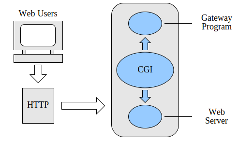
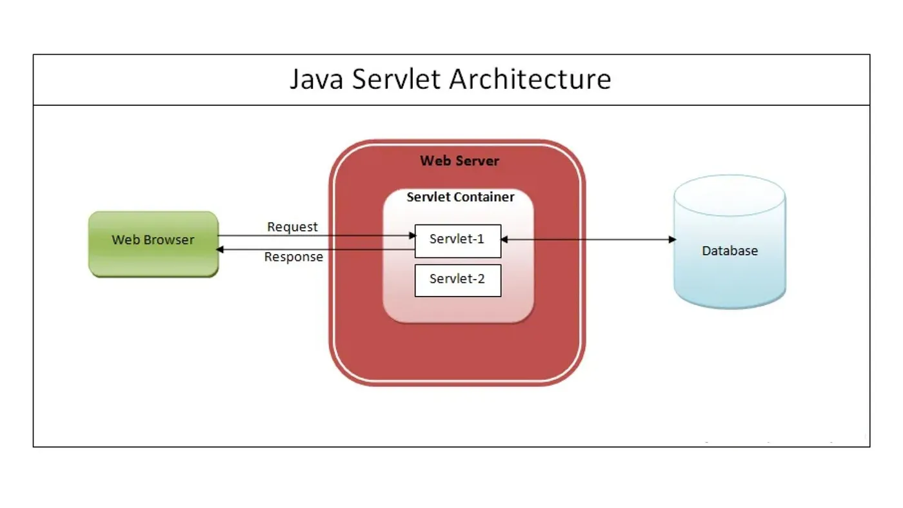
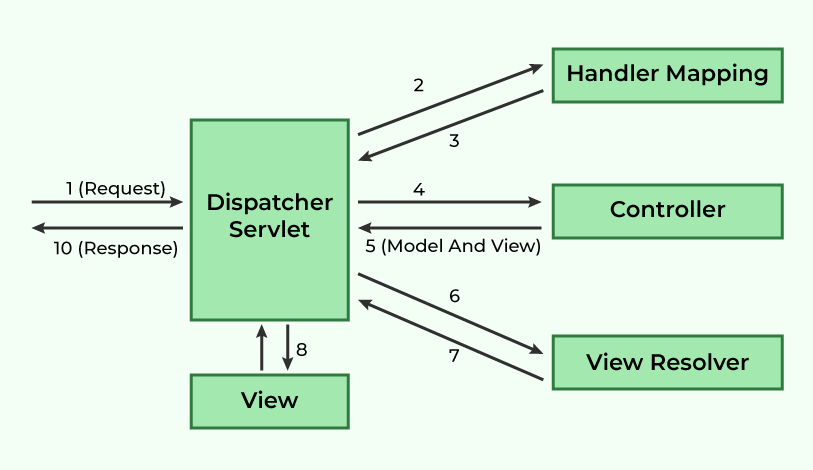

#### 인덱스
- [CGI, Servlet, JSP](#cgi-servlet-jsp)
- [스프링 웹 MVC 구조](#스프링-웹-mvc-구조)
- [컨트롤러와 관련된 어노테이션, 클래스](#컨트롤러와-관련된-어노테이션-클래스)
- [파일 업로드/다운로드](#파일-업로드다운로드)
- [외부 API 호출](#외부-api-호출)
- [스프링 웹 + 스프링 시큐리티](#스프링-웹--스프링-시큐리티)
- [HTTP 헤더](#http-헤더)
- [`@Transactoinal`](#transactional)
- [Spring WebFlux](#spring-webflux)
- [테스트](#테스트)
- [API 문서화](#api-문서화)


## CGI, Servlet, JSP



[출처](https://ko.wikipedia.org/wiki/공용_게이트웨이_인터페이스)

**CGI(Common Gateway Interface)** 는 유저 요청을 처리하거나 동적인 웹 컨텐츠를 생성하기 위해 외부 프로그램(게이트웨이, 웹 서버) 또는 스크립트를 실행하는 인터페이스를 말한다

초기의 웹은 서버가 단순한 HTML만 제공할 수 밖에 없었기 때문에 CGI를 통해 Perl, C 등의 실행 파일을 실행해서 동적으로 정보를 생성하고 응답할 수 있었다

CGI 프로그램은 요청 변수를 환경 변수나 표준 입력으로 전달받고 표준 출력으로 실행 결과를 내보내면 서버는 이를 클라이언트에게 반환하는 구조이다

CGI는 단순하지만 크기가 커질수록 명확한 한계를 가진다
- 클라이언트 요청마다 각각의 CGI 프로세스 실행: 수많은 프로세스 실행/종료 관리로 인한 비효율적인 동시 처리
- 상태 유지 불가: 요청마다 새로운 프로세스를 사용하므로 이전 세션을 유지할 수 없음
- 재사용성 부족: 공통 코드/자원 재사용 불가, 유지보수성 떨어짐
- 보안 위험: 실행 파일/스크립트를 웹 서버가 그대로 실행하므로 CGI 인젝션같은 보안 문제 야기

자바 진영은 기존 CGI의 한계를 극복하고 웹 서버의 성능을 향상시킬 수 있는 서버 프로그램을 새로 도입했는데, 그게 서블릿이다



[출처](https://medium.com/@tarunjoshiji1/servlet-and-jsp-a-step-by-step-guide-479728057d16)

**CGI는 외부 프로그램과 웹 서버의 연결이라면 서블릿은 웹 서버(서블릿 컨테이너)안에서 실행된다**

또한 `HttpSession` 같은 메커니즘으로 클라이언트의 상태를 서버에서 유지할 수 있으며, `HttpServletRequest`, `HttpServletResponse` 등의 API를 통해 HTTP 요청/응답을 쉽게 다룰 수 있다

```java
// "/hello" url 매핑
@WebServlet("/hello")
public class HelloServlet extends HttpServlet {

    // HttpServletRequest:  헤더, 파라미터, 쿠키 등 요청 정보
    // HttpServletResponse: 상태 코드, 헤더, 바디 등 응답 정보
    @Override
    protected void doGet(HttpServletRequest request, HttpServletResponse response) throws IOException {

        // Content-Type 설정
        response.setContentType("text/html");
        
        // 응답 HTML 작성
        PrintWriter out = response.getWriter();
        out.println("<!DOCTYPE html>");
        out.println("<html>");
        out.println("<head><title>Hello Servlet</title></head>");
        out.println("<body>");
        out.println("<h1>Hello, World from Servlet!</h1>");
        out.println("</body>");
        out.println("</html>");
    }
}
```

서블릿은 HTTP 요청을 처리하는 클래스로 서블릿 컨테이너(톰캣)에 의해 생명주기가 관리되어 최초 요청 시 단 한번만 생성되고, 이후 같은 요청마다 스레드를 새로 생성하고 이를 처리한다

요청마다 프로세스를 만드는 CGI와 달리 멀티스레딩으로 요청을 처리하여 서버의 리소스를 효율적으로 사용한다 (JVM 위에서 동작하므로 OS 독립적이기도 하다)

**서블릿 컨테이너 주요 기능**: 서블릿 생명주기(생성, 요청 처리, 종료) 관리, 멀티스레딩 처리, 네트워크 통신 지원(소켓), 세션/보안 관리, 로깅 및 에러 처리

```text
1. 클라이언트 요청: http://example.com/hello
2. 웹 서버(Apache, Nginx): 서블릿 컨테이너에게 요청 전달
3. 톰캣: URL 매핑 확인 후 서블릿 객체 service() 실행
4. 서블릿: HttpServletRequest 파싱, doGet()/doPost() 실행, HttpServletResponse 반환
5. 톰캣: 클라이언트에 응답 반환  
```

서블릿은 요청을 처리하고 응답을 만들어내는데 CGI보다 효율적이지만 HTML을 자바 코드에서 작성해야 되서 코드의 가독성과 유지보수성이 떨어지게 된다

더군다나 HTML을 그리는 코드와 DB 관련 로직이 한 개의 클래스 내에 섞여 있어서 규모가 커질수록 이러한 단점이 더 부각되었다

**JSP(Java Server Pages)** 는 서블릿보다 더 쉽게 뷰를 작성하기 위해 고안된 문법이다 (JSP 파일은 런타임에 톰캣에 의해 자동으로 서블릿으로 변환되어 실행된다)

HTML 중심 코드에 자바를 삽입한 방식으로 훨씬 화면(View)을 작성하기 수월해졌다

하지만 여전히 DB 쿼리, 비즈니스 로직과 뷰 로직이 함께 뭉쳐있는 코드 패턴(Model 1)이 남발했었기 때문에 코드 복잡성 문제는 해결되지 않았다

이러한 문제를 해결하기 위해 **MVC(Model-View-Controller)** 패턴(Model 2)을 도입하여 데이터와 비즈니스 로직(Model) 담당, 화면(View) 담당, 요청 조율(Controller) 담당으로 역할을 나누었다

뷰는 HTML/JSP에서 처리하고 비즈니스 로직은 자바 클래스에서 처리하여 코드 구조를 깔끔하게 유지하고 테스트 및 유지보수성을 높였다

MVC 패턴을 구현하려면 개발자가 아래 요소를 반복적으로 작성해야 했다
- URL 매핑: 어떤 요청을 어떤 컨트롤러가 처리할지 결정
- 파라미터 파싱
- 뷰 선택
- 에러 처리

그래서 보일러 플레이트 코드를 공통화/자동화한 MVC 프레임워크가 등장했는데 초창기 자바의 MVC 프레임워크는 스트럿츠이고, 이후에 더 유연하고 확장성 좋은 구조를 가진 스프링 웹 MVC가 등장했다


## 스프링 웹 MVC 구조



[출처](https://www.geeksforgeeks.org/springboot/spring-mvc-framework/)

스프링 웹 MVC는 서블릿을 기반으로 하는 MVC 아키텍처 웹 프레임워크로 서블릿을 직접 다루지 않도록 저수준 API를 추상화한다

요청 매핑, 파라미터 변환, 예외 처리, 뷰 선택, RESTful 응답 등 공통적인 웹 애플리케이션 기능을 처리하여 개발자가 비즈니스 로직에 집중할 수 있게 해준다

주요 컴포넌트
- `DispatcherServlet`: FrontController, 공통 처리
- `HandlerMapping`, `HandlerAdapter`: 컨트롤러 실행 위임
- `ViewResolver`: 뷰 렌더링
- 컨트롤러: 비즈니스 로직 집중

### DispatcherServlet

DispatcherServlet은 HttpServlet을 상속한 서블릿 클래스로 서블릿 컨테이너에 의해 실행되는 스프링 컴포넌트이다

모든 클라이언트 웹 요청을 수신하여 스프링 컨텍스트 내의 알맞은 컨트롤러에게 위임하고 실행 결과의 응답(뷰 또는 바디)을 반환한다

### HandlerMapping

HandlerMapping은 클라이언트 요청 URL과 HTTP 메서드 등을 기반으로 해당 요청을 처리할 컨트롤러(핸들러) 매핑을 담당한다

DispatcherServlet에게 요청을 처리할 핸들러뿐만 아니라 핸들러 인터셉터가 담긴 `HanlderExecutionChain` 형태로 전달한다

스프링은 다양한 방식의 매핑 전략을 지원하기 위해 여러 HandlerMapping 구현체를 제공하지만 주로 `RequestMappingHandlerMapping`를 사용한다

애플리케이션이 초기화될 때 `RequestMappingHandlerMapping`은 `@Controller` 내에 붙은 `@RequestMapping`, `@GetMapping`, `@PostMapping` 등의 어노테이션이 달린 모든 메서드를 스캔하여 요청 URL과 매핑 정보를 `RequestRegistry`에 저장한다

클라이언트로부터 HTTP 요청이 들어오면 URL, HTTP 메서드, 요청 파라미터, 헤더, 미디어 타입 등을 분석하여 `MappingRegistry`에 일치하는 `HandlerMethod`를 찾고 이를 `HanlderExecutionChain` 타입으로 변환한 뒤 DispatcherServlet에게 반환한다

```java
public abstract class AbstractHandlerMethodMapping<T> {

    class MappingRegistry {

        private final Map<T, MappingRegistration<T>> registry = new HashMap<>();
        private final MultiValueMap<String, T> pathLookup = new LinkedMultiValueMap<>();
        private final Map<String, List<HandlerMethod>> nameLookup = new ConcurrentHashMap<>();
        private final Map<HandlerMethod, CorsConfiguration> corsLookup = new ConcurrentHashMap<>();
        private final ReentrantReadWriteLock readWriteLock = new ReentrantReadWriteLock();
    }

}
```

### HandlerAdapter

DispatcherServlet이 HandlerMapping을 통해 요청에 맞는 핸들러를 찾으면 해당 핸들러의 실행이 HandlerAdapter에게 위임된다

HandlerAdapter는 어댑터 패턴의 전형적인 예시로, 어댑터 패턴은 인터페이스가 다른 두 객체를 연결하여 함께 작동하게 하는 디자인 패턴이다

스프링에서 다양한 종류의 핸들러(컨트롤러)를 일관된 방식으로 처리하기 위해 HandlerAdapter를 사용한다
- 클라이언트: DispatcherServlet
- 어댑터: HandlerAdapter
- 어댑티: `@Controller`, `@RestController`의 메서드

`@Controller` 어노테이션 기반의 컨트롤러뿐만 아니라 과거 `Controller` 인터페이스를 구현한 컨트롤러 등 다양한 형태의 핸들러를 지원하여 특정 핸들러의 구현에 종속되지 않고 일관된 방식으로 요청을 처리할 수 있다

알맞은 메서드를 호출하는 과정에서 HTTP 요청의 데이터를 메서드의 인자로 전달하고 실행 결과를 `ModelAndView` 객체로 포장하여 DispatcherServlet에게 반환한다

대표적으로 `@RequestMappingHandlerAdapter` 구현체는 `@RequestParam`, `@RequestBody`, `@ModelAttribute`, `HttpEntity` 등 다양한 어노테이션과 타입의 메서드 인자를 HTTP 요청으로부터 추출하여 `ArgumentResolver`를 사용하여 적절한 값으로 변환한 뒤 전달한다

또한 컨트롤러 메서드 반환 값을 뷰 이름으로 변환하거나 `@ResponseBody`인 경우 `HttpMessageConverter`를 사용하여 JSON <-> 자바 객체 변환 작업을 수행한다

HandlerMapping은 HTTP 요청에 맞는 핸들러를 탐색하는 역할, HandlerAdapter는 핸들러의 실행을 담당하는 역할에 집중한다

### HandlerMethodArgumentResolver, HandlerMethodReturnValueHandler

HandlerMethodArgumentResolver는 클라이언트의 HTTP 요청 정보를 추출하여 컨트롤러 메서드의 각 파라미터를 채워주는 역할을 한다

HandlerMethodReturnValueHandler는 핸들러 메서드의 반환 값을 DispatcherServlet이 처리할 수 있

전체 흐름(요청 당)
- DispatcherServlet -> HandlerMapping: 핸들러 탐색
- DispatcherServlet -> HandlerAdapter.handle(): **핸들러 호출 위임**
- RequestMappingHandlerAdapter.invokeHandlerMethod(): 어노테이션 기반 핸들러 메서드 호출
    -  핸들러 메서드에 대한 ArgumentResolver, ReturnValueHandler 설정
- ServletInvocableHandlerMethod.invokeAndHandle(): **핸들러 메서드 호출 및 반환 값 처리**
    - ServletInvocableHandlerMethod.invokeForRequest()
        - InvocableHandlerMethod.getMethodArgumentValues(), resolvers.resolveArgument(): **핸들러 메서드 파라미터 해결**
        - InvocableHandlerMethod.doInvoke(): **실질적인 핸들러 메서드 호출**
    - returnValueHandlers.handleReturnValue(): **핸들러 메서드 반환 값 처리**

```java
public interface HandlerMethodArgumentResolver {

    @Nullable
	Object resolveArgument(
        MethodParameter parameter, 
        @Nullable ModelAndViewContainer mavContainer, 
        NativeWebRequest webRequest, 
        @Nullable WebDataBinderFactory binderFactory) 
            throws Exception;
}
```

MethodParameter: 리플렉션 기반 파라미터 메타데이터(타입, 제네릭, 어노테이션 등)

ModelAndViewContainer: 현재 요청의 모델과 뷰 상태를 담는 컨테이너 (리졸버는 필요 시 모델에 객체 추가 가능)

NativeWebRequest: HTTP request/response에 접근할 수 있는 추상화, 서블릿 환경에서는 ServletWebRequest로 구현한다

WebDataBinderFactory: 바인딩/검증이 필요할 때 WebDataBinder(ServletRequestDataBinder)를 생성해준다 (`@InitBinder`에서 등록한 바인더가 적용된다)

[HTTP 요청 바인딩 어노테이션](#요청)에 따른 리졸버
- `RequestParamMethodArgumentResolver`: `@RequestParam` 처리 (required/defaultValue, 타입 변환)
- `PathVariableMethodArgumentResolver`: `@PathVariable` 처리
- `ServletModelAttributeMethodProcessor`: `@ModelAttribute` 또는 복합 타입 바인딩 처리 (`WebDataBinderFactory`로 바인딩/검증 -> `BindingResult` 처리 규칙)
- `RequestResponseBodyMethodProcessor`: `@RequestBody` 처리 (`HttpMessageConverter`로 HTTP 본문 읽기/변환, 검증 `@Valid` 적용)
- `ServletRequestMethodArgumentResolver`, `ServletResponseMethodArgumentResolver`: `HttpServletRequest`, `HttpServletResponse`, `Principal`, `Locale` 등 특수 타입 처리
- `OptionalMethodArgumentResolver`, `ServletModelAttributeMethodProcessor`: `Optional`, `Nullable` 처리

기본적으로 기본/래퍼/String 타입은 `@RequestParam`으로 취급되고 DTO 등은 `@ModelAttribute`로 바인딩된다 (단, `@RequestBody`가 명시되면 본문으로 바인딩)

`@RequestBody` 파라미터는 `RequestResponseBodyMethodProcessor`가 `HttpMessageConverter` (Jackson)를 사용해 본문을 읽고 객체로 변환한다

이후 `WebDataBinder`로 `@Valid` 검증을 수행한다

### 커스텀 ArgumentResolver 구현

요청 헤더의 토큰을 읽어 현재 사용자 도메인 객체로 주입하는 리졸버 구현

#### 1. 어노테이션 정의

```java
@Target(ElementType.PARAMETER)
@Retention(RetentionPolicy.RUNTIME)
public @interface LoggedUser {
}
```

#### 2. 리졸버 구현

```java
public class LoggedUserArgumentResolver implements HandlerMethodArgumentResolver {

    // 컨트롤러 메서드 파라미터가 @LoggedUser 어노테이션을 선언하고 UserPrincipal 타입인 경우
    @Override
    public boolean supportsParameter(MethodParameter parameter) {
        return parameter.hasParameterAnnotation(LoggedUser.class)
                && UserPrincipal.class.isAssignableFrom(parameter.getParameterType());
    }

    // HTTP 요청 헤더 정보를 기반으로 UserPrincipal 객체를 생성한다
    @Override
    public Object resolveArgument(MethodParameter parameter, ModelAndViewContainer mavContainer,
            NativeWebRequest webRequest, WebDataBinderFactory binderFactory) throws Exception {
        var request = webRequest.getNativeRequest(HttpServletRequest.class);
        String token = request.getHeader("X-Auth-Token");
        if (token == null) {
            return null;
        }
        return new UserPrincipal(token);
    }
    
}
```

#### 3. 리졸버 등록

```java
@Configuration
public class ArgumentResolverConfig implements WebMvcConfigurer {

    @Bean
    public HandlerMethodArgumentResolver currentUserArgumentResolver() {
        return new LoggedUserArgumentResolver();
    }

    @Override
    public void addArgumentResolvers(List<HandlerMethodArgumentResolver> resolvers) {
        resolvers.add(currentUserArgumentResolver());
    }

}
```

#### 4. 컨트롤러 구현 및 테스트

```java
@RequestMapping("/users")
@RestController
public class UserController {
    
    @GetMapping("/me")
    public ResponseEntity<UserPrincipal> getId(@LoggedUser UserPrincipal principal) {
        if (principal == null) return ResponseEntity.status(HttpStatus.UNAUTHORIZED).body(null);
        return ResponseEntity.ok(principal);
    }
    
}
```

```java
@WebMvcTest(UserController.class)
public class CustomArgumentResolverTest {
    
    @Autowired
    private MockMvc mockMvc;

    @Test
    void currentUserResolver_cannotInjectUser() throws Exception {
        mockMvc.perform(get("/users/me"))
                .andExpect(status().isUnauthorized());
    }

    @Test
    void currentUserResolver_shouldInjectUser() throws Exception {
        mockMvc.perform(get("/users/me").header("X-Auth-Token", "hansanhha"))
        .andExpect(status().isOk())
        .andExpect(jsonPath("$.id").value("hansanhha"));
    }
}
```

### HttpMessageConverter

`HttpMessageConverter`는 HTTP 메시지를 자바 객체로 변환하거나, 자바 객체를 HTTP 메시지로 변환하는 역할을 한다 (직렬화/역직렬화)
- JSON, XML, 폼 데이터 -> 자바 객체 변환
- 자바 객체 -> JSON, XML, 문자열, 이진 데이터 변환

DispatcherServlet -> HandlerAdapter -> 컨트롤러 메서드를 호출할 때 HandlerMethodArgumentResolver와 HandlerMethodReturnValueHandler가 내부적으로 이것을 활용한다

HttpMessageConverter는 Content Negotiation(컨텐츠 협상)과 함께 동작한다
- HTTP 요청 시 `Content-Type` 헤더를 확인하여 해당 MIME 타입을 읽을 수 있는 컨버터 구현체를 탐색하여 데이터를 변환한다 (`canRead()` -> true)
- HTTP 응답 시 `Accept` 헤더나 컨트롤러 반환 타입을 확인하여 해당 타입/MIME 타입을 처리할 수 있는 컨버터 구현체를 탐색하여 데이터를 변환한다 (`canWrite()` -> true)

**주요 컨버터 구현체**
- JSON(`@RequestBody`, `@Responsebody`): `MappingJackson2HttpMessageConverter`
- 바이너리 데이터(`application/octet-stream`): `ByteArrayHttpMessageConverter`, 
- 파일(`Resource`): `ResourceHttpMessageConverter`
- 폼 데이터(`application/x-www-form-urlencoded`): `FormHttpMessageConverter`

### LocaleResolver

`LocaleResolver`는 클라이언트의 로케일 정보를 결정하고 관리하는 역할을 한다

사용자가 어떤 언어와 지역 설정으로 요청했는지 스프링 MVC가 알 수 있도록 해주며 주로 국제화(i18n) 기능에서 `MessageSource`와 함께 사용된다

동작 방식
- 클라이언트에서 로케일 정보 전달: `Accept-Language` 헤더(기본값), 세션, 쿠키 등
- LocalResolver: 현재 요청의 로케일 결정
- 컨트롤러, 메시지 소스, 타임스탬프 포맷 등에서 로케일 정보 활용

#### 1. 컨트롤러

```java
@RestController
@RequestMapping("/locale")
public class LocalController {

    private final MessageSource messageSource;

    public LocalController(MessageSource messageSource) {
        this.messageSource = messageSource;
    }

    // LocaleResolver가 요청 정보의 Locale을 추출한다
    @GetMapping("/greet")
    public String greet(Locale locale) {
        return messageSource.getMessage("greeting", null, locale);
    }
}
```

#### 2. LocalResolver 설정

```java
@Configuration
public class LocaleConfig {
    
    @Bean
    LocaleResolver localeResolver() {
        AcceptHeaderLocaleResolver resolver = new AcceptHeaderLocaleResolver();
        resolver.setDefaultLocale(Locale.US);
        return resolver;
    }

}
```

#### 3. Message 파일 설정

메시지 리소스 설정

```yaml
spring:
  messages:
    basename: messages
    encoding: UTF-8
```

`messages.properties`

```text
greeting=hello
```

`messages_ko.properties`

```text
greeting=안녕
```

#### 4. 테스트 코드

```java
@WebMvcTest(LocalController.class)
public class LocaleControllerTest {

    @Autowired
    private MockMvc mockMvc;

    @Test
    void greet_ko_with_acceptHeader() throws Exception {
        mockMvc.perform(get("/locale/greet")
                        .header(HttpHeaders.ACCEPT_LANGUAGE, Locale.KOREA.getLanguage()))
        .andExpect(status().isOk())
        .andExpect(content().string("안녕"));
    }

    @Test
    void greet_en_with_acceptHeader() throws Exception {
        mockMvc.perform(get("/locale/greet")
                        .header(HttpHeaders.ACCEPT_LANGUAGE, Locale.ENGLISH.getLanguage()))
        .andExpect(status().isOk())
        .andExpect(content().string("hello"));
    }

    @Test
    void greet_non_header() throws Exception {
        mockMvc.perform(get("/locale/greet"))
        .andExpect(status().isOk())
        .andExpect(content().string("hello"));
    }
    
}
```


## 컨트롤러와 관련된 어노테이션, 클래스


[출처](https://javatechonline.com/spring-boot-mvc-rest-annotations-with-examples/)

### 요청

`@RequestMapping`
- HTTP 메서드, URL, 파라미터, 헤더 조건, 미디어 타입 지정 가능
- 파생 어노테이션: `@GetMapping`, `@PostMapping` 등
- ```java
    @RequestMapping(value = "/users", method = RequestMethod.POST)
    public String createUser() { ... }
  ```

`@RequestParam`
- 요청 파라미터(쿼리 스트링, 폼 데이터)를 메서드 파라미터에 바인딩
- 단일 값, 간단한 키-값 전달에 적합하다
- ```java
  // 요청: GET /search?keyword=spring&page=2
  @GetMapping("/search")
  public String search(@RequestParam String keyword, 
                      @RequestParam(defaultValue = "1") int page) {
      return "검색어: " + keyword + ", 페이지: " + page;
  }
  ```

`@PathVariable`
- URL 경로 변수(`/users/{id}`)를 메서드 파라미터에 바인딩
- RESTful API에서 자원 식별자를 받을 때 유용하다
- ```java
    // 요청: GET /users/42
    @GetMapping("/users/{id}")
    public String getUser(@PathVariable Long id) {
        return "사용자 ID: " + id;
    }
  ```

`@ModelAttribute`
- 요청 파라미터를 객체에 바인딩
- 폼 데이터 처리에 적합하다 (HTML form -> DTO)
- ```java
    // 요청: POST /register
    // body: name=Alice&age=20
    @PostMapping("/register")
    public String register(@ModelAttribute UserForm form) {
        return "등록된 사용자: " + form.getName() + ", 나이: " + form.getAge();
    }
  ```

`@RequestBody`
- HTTP 요청 본문을 자바 객체로 변환
- REST API JSON 요청 처리에 적합하다
- ```java
    // 요청: POST /api/users
    // body(JSON): { "name": "Alice", "age": 20 }
    @PostMapping("/api/users")
    @ResponseBody
    public String createUser(@RequestBody UserDto user) {
        return "생성된 사용자: " + user.getName() + ", 나이: " + user.getAge();
    }
  ```

`@RequestHeader`
- HTTP 요청 헤더 값을 파라미터로 바인딩
- ```java
    @GetMapping("/header")
    public String getHeader(@RequestHeader("User-Agent") String userAgent) {
        return "클라이언트 UA: " + userAgent;
    }
  ```

`@CookieValue`
- 특정 쿠키 값을 파라미터로 바인딩
- ```java
    @GetMapping("/cookie")
    public String getCookie(@CookieValue("SESSIONID") String sessionId) {
        return "세션 ID: " + sessionId;
    }
  ```

`HttpEntity<T>`, `RequestEntity<T>`
- 요청 바디와 헤더를 함께 객체로 받을 수 있다
- RequestEntity는 메서드, URL 등 더 많은 요청 정보를 포함한다
- ```java
    @PostMapping("/http-hansanhha.entity")
    public ResponseEntity<String> handleEntity(HttpEntity<String> requestEntity) {
        String body = requestEntity.getBody();
        HttpHeaders headers = requestEntity.getHeaders();
        return ResponseEntity.ok("Body: " + body + ", Header: " + headers.getContentType());
    }
  ```

### 응답

`@ResponseBody`
- 핸들러 메서드 반환 값을 뷰 이름이 아닌 HTTP 바디에 직접 쓰도록 지정한다
- ```java
    @GetMapping("/users/{id}")
    @ResponseBody
    public User getUser(@PathVariable("id") Long id) {
        return new User(id);
    }
  ```

`@RestController`
- 해당 클래스 내의 모든 메서드를 `@ResponseBody`로 취급한다

`@ResponseStatus`
- 메서드에서 특정 HTTP 상태 코드 반환
- ```java
    @ResponseStatus(HttpStatus.NO_CONTENT)
    @DeleteMapping("/users/{id}")
    public void deleteUser(@PathVariable Long id) {
    }
  ```

`ResponseEntity<T>`
- 상태 코드, 헤더, 바디 등을 모두 제어할 수 있는 응답 객체
- ```java
    @PostMapping("/users")
    public ResponseEntity<Long> createUser() {
        return ResponseEntity
                .status(HttpStatus.CREATED)
                .header("X-Custom-Header", "demo")
                .body("Created Successfully");
    }
  ```


## 파일 업로드/다운로드

HTTP에서 파일 업로드는 보통 `multipart/form-data` 요청을 통해 이루어진다

일반 텍스트/숫자 필드는 그대로 전달되고 파일의 경우 바이너리 스트림 형태로 요청 본문에 포함된다

서블릿 기본 API만 사용하면 업로드된 데이터를 직접 파싱해야 하는데, 스프링은 이를 추상화하여 자동으로 처리해주는 `MultipartResolver` 전략 인터페이스를 제공한다

`MultipartResolver`는 클라이언트의 `multipart/form-data` 요청을 감지하고 업로드된 파일을 파싱하여 업로드 파일 객체인 `MultipartFile`로 변환한다

`MultipartFile`은 파일의 내용과 이름, MIME 타입, 크기 등과 같은 메타데이터로 구성되어 있다

**클라이언트에서 전달한 바이너리 스트림을 스프링이 `MultipartFile`로 변환하면 백엔드는 이를 기반으로 디스크에 저장하는 것으로 업로드 메커니즘이 이뤄진다**

반대로 **다운로드는 서버에 저장된 파일을 HTTP 본문에 담아 브라우저에게 전달하면 브라우저가 HTTP 헤더에 따라 표시(render)만 하거나 다운로드하는 것으로 동작한다**
- 클라이언트 요청: `GET /files/download/abc.pdf`
- 서버의 파일 읽기: 파일 시스템에서 `InputFileStream` 또는 스프링 `Resource`로 읽고 HTTP 응답 본문에 싣는다
- 헤더 설정
    - `Content-Type`: 파일 MIME 타입(`application/pdf`, `image/png` 등) -> 브라우저에게 파일 타입을 알려줌
    - `Content-Disposition: attachment; filename: "abc.pdf"`: 브라우저에게 다운로드해야 할 것을 알려줌
    - `Content-Length`: 파일 크기를 지정하여 네트워크 전송 효율성 향상
- HTTP 응답: 서버가 헤더 + 파일 데이터 스트림을 전송하면 브라우저는 이를 받아서 렌더링하거나 저장소에 바로 저장한다

```text
HTTP/1.1 200 OK
Content-Type: application/pdf
Content-Disposition: attachment; filename="abc.pdf"
Content-Length: 102400

%PDF-1.4
.... (파일 바이트 데이터)
```

HTTP 응답에 `Content-Disposition: attachment; filename="abc.pdf"`가 없다면 브라우저는 PDF 뷰어로 바로 열어버릴 수 있다

스프링이 제공하는 물리적인 형태(URL 포함)의 리소스를 추상화한 `Resource` 인터페이스를 사용하여 `ResponseEntity<Resource>` 형태로 응답하면 스프링 MVC가 내부적으로 스트림을 열고 데이터를 전송한다

MIME 타입을 별도로 지정하지 않으면 `application/octet-stream`을 사용한다

파일 업로드/다운로드의 네트워크 패킷 레벨 동작 (TCP 스트림, 청크 전송 등), 대용량 파일 스트리밍 추가 필요

### 파일 업로드 예제

#### 1. 컨트롤러 구현

```java
@RestController
@RequestMapping("/files")
public class FileUploadController {
    
    private final Path uploadDir = Paths.get("uploads");

    @PostMapping("/multi-upload")
    public ResponseEntity<?> handleMultiFileUpload(@RequestParam("files") List<MultipartFile> files) {
        if (files.isEmpty()) {
            return ResponseEntity.badRequest().body(Map.of("message", "empty file"));
        }

        var result = new ArrayList<>();

        files.forEach(file -> {
            if (!file.isEmpty()) {
                var filename = file.getOriginalFilename();
                var dest = uploadDir.resolve(filename).normalize();
                // file.transfer(dest) // 파일 저장
                result.add("successfully uploaded: " + filename);
            } else {
                result.add("empty file");
            }
        });
        
        return ResponseEntity.ok(result);
    }
    
}
```

#### 2. 테스트 코드

```java
@WebMvcTest(FileUploadController.class)
public class FileUploadControllerTest {

    @Autowired
    private MockMvc mockMvc;

    @Test
    void uploadMultiFiles_success() throws Exception {
        var file1 = new MockMultipartFile(
                "files",
                "test.txt",
                "text/plain",
                "Hello MultipartFile".getBytes(StandardCharsets.UTF_8));

        var file2 = new MockMultipartFile(
                "files",
                "test2.txt",
                "text/plain",
                "Hello MultipartFile2".getBytes(StandardCharsets.UTF_8));

        mockMvc.perform(multipart("/files/multi-upload")
                        .file(file1)
                        .file(file2))
                .andExpect(status().isOk())
                .andExpect(content().string(containsString("successfully uploaded: test.txt")))
                .andExpect(content().string(containsString("successfully uploaded: test2.txt")));
    }

    @Test
    void uploadMultipartFiles_empty() throws Exception {
        mockMvc.perform(multipart("/files/multi-upload"))
                .andExpect(status().isBadRequest());
    }
    
}
```

### 파일 다운로드 예제

#### 1. 컨트롤러 구현

```java
@RestController
@RequestMapping("/files")
public class FileDownloadController {
 
    private final Path uploadDir = Paths.get("uploads");

    @GetMapping("/download/{filename}")
    public ResponseEntity<Resource> downloadFile(@PathVariable String filename) throws IOException {
        Path filepath = uploadDir.resolve(filename).normalize();
        Resource resource = new UrlResource(filepath.toUri());

        if (!resource.exists() || !resource.isReadable()) {
            return ResponseEntity.notFound().build();
        }

        // Content-Type 자동 추론
        String contentType = Files.probeContentType(filepath);
        if (contentType == null) {
            contentType = MediaType.APPLICATION_OCTET_STREAM_VALUE;
        }

        return ResponseEntity.ok()
                .contentType(MediaType.parseMediaType(contentType))
                .header(HttpHeaders.CONTENT_DISPOSITION, "attachment; filename=\"" + resource.getFilename() + "\"")
                .body(resource);
    }
    
}
```

#### 2. 테스트 코드

```java
@WebMvcTest(FileDownloadController.class)
class FileDownloadControllerTest {

    @Autowired
    private MockMvc mockMvc;

    private static final Path uploadDir = Paths.get("uploads");

    @BeforeEach
    void setUp() throws IOException {
        Files.createDirectories(uploadDir);

        Path testFile = uploadDir.resolve("test.txt");
        Files.writeString(testFile, "test file");
    }

    @AfterAll
    static void cleanUp() throws IOException {
        FileSystemUtils.deleteRecursively(uploadDir);
    }

    @Test
    void downloadFile_success() throws Exception {
        mockMvc.perform(get("/files/download/test.txt"))
                .andExpect(status().isOk())
                .andExpect(header().string(HttpHeaders.CONTENT_DISPOSITION, "attachment; filename=\"test.txt\""))
                .andExpect(content().string("test file"));
    }

    @Test
    void downloadFile_notFound() throws Exception {
        mockMvc.perform(get("/files/download/zzz.txt"))
                .andExpect(status().isNotFound());
    }

}
```


## 외부 API 호출

`RestTemplate`
- Spring 3
- 동기: 요청이 끝날 때까지 현재 스레드 블로킹
- 템플릿 메서드 패턴
- 내부적으로 `HttpMessageConverter` 활용
- Deprecated

```java
@Test
void restTemplate() {
    RestTemplate restTemplate = new RestTemplate();

    var response = restTemplate.getForObject(api(), ApiResponse.class);

    assertThat(response.message()).isEqualTo("hello api");
}
```

`WebClient`
- Spring 5
- 동기/비동기(reactive streams)
- Mono, Flux 기반 리액티브 API
- 고성능 환경, 대규모 트래픽 처리, 이벤트 스트리밍(SSE, WebSocket)에 적합

```java
@Test
void webClientSync() {
    WebClient client = WebClient.create(api());

    var response = client.get()
        .retrieve()
        .bodyToMono(ApiResponse.class)
        .block();
    
    assertThat(response.message()).isEqualTo("hello api");
}

@Test
void webClientAsync() {
    WebClient client = WebClient.create(api());

    Mono<ApiResponse> mono = client.get()
        .retrieve()
        .bodyToMono(ApiResponse.class);

    mono.subscribe(res -> System.out.println("WebClient (aysnc): " + res.message()));

    var response = mono.block(); // 테스트 진행을 위한 블로킹
    assertThat(response.message()).isEqualTo("hello api");
}
```

`RestClient`
- Spring 6.1
- Fluent REST API, 동기
- HttpService 인터페이스와 함께 쓰면 선언적 REST 호출 가능

```java
@Test
void restClient() {
    RestClient client = RestClient.create(api());

    var response = client.get()
        .retrieve()
        .body(ApiResponse.class);

    assertThat(response.message()).isEqualTo("hello api");
}
```

#### RestClient 생성

```java
var client = RestClient.create("http://example-baseUrl.com");

var client = RestClient.builder()
                .baseUrl("http://example-baseUrl.com")
                .defaultHeaders(headers -> {
                    headers.add("haeder", "value");
                })
                .build();
```

#### 요청 전송 및 응답/에러 처리 (exchange)

```java
var client = RestClient.create("http://example-baseUrl.com");

String userId = client
        .post()
        .uri("/users")
        .body(Map.of("id", "1234"))
        .header(HttpHeaders.CONTENT_TYPE, MediaType.APPLICATION_JSON_VALUE)
        .exchange((req, res) -> {
            if (res.getStatusCode().is4xxClientError()) {
                // error handling
            } else if (res.getStatusCode().is5xxServerError()) {
                // error handling
            } else if (res.getStatusCode() == HttpStatus.NO_CONTENT) {
                return null;
            }

            return res.bodyTo(String.class);
        });
```

#### 요청 전송 및 응답/에러 처리 (retrieve)

```java
var client = RestClient.create("http://example-baseUrl.com");

String userId = client.get()
        .uri("/users")
        .retrieve()
        .onStatus(HttpStatusCode::is4xxClientError, (req, res) -> {
            // error handling
        })
        .body(String.class);
```

### ClientHttpRequestFactory, ClientHttpRequest

**`ClientHttpRequestFactory`**는 HTTP 요청 객체인 `ClientHttpRequest`를 생성하는 팩토리 패턴이 적용된 인터페이스이다

`RestClient`와 `RestTemplate`에서 내부적으로 요청 객체를 생성하기 위해 사용한다

주요 구현체
- `SimpleClientHttpRequestFactory`: JDK `HttpURLConnection` 생성
- `JdkClientHttpRequestFactory`: 기본값, 자바 `HttpClient` 기반 생성
- `HttpComponentsClientHttpRequestFactory`: 아파치 `HttpComponents` 기반 생성
- `JettyClientHttpRequestFactory`: Jetty `HttpClient` 기반 생성

스프링 부트는 클래스패스를 감지하여 `ClientHttpRequestFactory` 구현체를 자동 설정한다

```java
public ClientHttpRequestFactoryBuilder<T extends ClientHttpRequestFactory> {

    static ClientHttpRequestFactoryBuilder<? extends ClientHttpRequestFactory> detect(ClassLoader classLoader) {
        if (HttpComponentsClientHttpRequestFactoryBuilder.Classes.present(classLoader)) {
            return httpComponents();
        }
        if (JettyClientHttpRequestFactoryBuilder.Classes.present(classLoader)) {
            return jetty();
        }
        if (ReactorClientHttpRequestFactoryBuilder.Classes.present(classLoader)) {
            return reactor();
        }
        if (JdkClientHttpRequestFactoryBuilder.Classes.present(classLoader)) {
            return jdk();
        }
        return simple();
    }
}
```

**`ClientHttpRequest`**는 HTTP 요청을 표현한 인터페이스로 실제로 요청을 전송하고 응답을 수신한다 (`HttpRequest`, `HttpOutputMessage` 확장)

`AbstractClientHttpRequest`: `ClientHttpRequest`의 추상 하위 클래스로 헤더 관리, 요청 본문 스트림 초기화, `execute` 호출 전/후 처리 등의 공통 로직을 제공한다

`AbstractStreamingClientHttpRequest`:  `AbstractClientHttpRequest`의 추상 하위 클래스로 스트리밍 방식의 요청 본문 처리를 지원한다 (대용량 업로드 시 본문 전체를 메모리에 올리지 않아도 된다)

```text
ClientHttpRequest
  └─> AbstractClientHttpRequest
  └─> AbstractStreamingClientHttpRequest
  └─> 엔진 별 구현체 (SimpleClientHttpRequest, JettyClientHttpRequest ...)
```

`SimpleClientHttpRequest`
- JDK `HttpURLConnection` 기반
- 순수 JDK
- 커넥션 풀링 미지원
- 동기식 API만 제공

`JdkClientHttpRequest`
- 기본값
- Java `HttpClient` 기반
- HTTP/2, WebSocket 지원
- 동기/비동기 API 모두 지원

`HttpComponentsClientHttpRequest`
- Apache `HttpClient` 기반
- 커넥션 풀링 지원
- 풍부한 HTTP 기능 지원 (쿠키 관리, 프록시 설정, 인증 스킴, 타임아웃 등)

`JettyClientHttpRequest`
- Jetty `HttpClient` 기반
- NIO, 비동기 HTTP 클라이언트
- WebSocket 지원


## 스프링 웹 + 스프링 시큐리티

스프링 웹은 `DispatcherServlet` 계층에서 요청 처리, 스프링 시큐리티는 그 앞 단의 서블릿 필터 계층에서 인증/인가를 처리한다

스프링 웹: 클라이언트 요청 -> `DispatcherServlet` -> `HandlerMapping` -> `HandlerAdapter` -> `Controller`

스프링 시큐리티: 클라이언트 요청이 `DispatcherServlet`에 도달하기 전에 `FilterChain`을 통해 요청을 가로채어 인증 & 인가 처리

```text
클라이언트 요청
      ↓
SecurityFilterChain (인증/인가)
      ↓
DispatcherServlet
      ↓
Interceptor
      ↓
Controller
      ↓
HttpServletResponse
```

### 스프링 시큐리티의 서블릿 필터 컴포넌트

`DelegatingFilterProxy`
- 스프링 시큐리티 진입점 (서블릿 컨테이너에 등록된다)
- 요청이 들어오면 스프링 컨텍스트에서 관리되는 `FilterChainProxy`로 위임한다

`FilterChainProxy`
- 실제 보안 필터들을 순서대로 실행시킨다 (`SecurityFilterChain`)
- `UsernamePasswordAuthenticationFilter`, `BasicAuthenticationFilter` 등

### 스프링 시큐리티와 스프링 웹의 결합 지점

#### 서블릿 필터 계층 -> 디스패처 서블릿 계층

`SecurityFilterChain`은 `DispatcherServlet`보다 먼저 동작한다 -> 인증/인가 실패 시 컨트롤러까지 실행되지 않음

스프링 웹 컨트롤러는 보안이 통과된 요청만 받게 된다

#### `AuthenticationPrincipalArgumentResolver`, `@AuthenticationPrincipal`

```java
@GetMapping("/me")
public String me(@AuthenticationPrincipal UserDetails user) {
    return user.getUsername();
}
```

```java
public interface Authentication extends Principal {
    Object getPrincipal();
}
```

`@AuthenticationPrincipal`의 ArgumentResolver는 `SecurityContext`의 `Authentication`에서 `Principal`을 꺼내 컨트롤러 파라미터에 바인딩한다

#### `ExceptionTranslationFilter`

인증 실패 -> `AuthenticationEntryPoint` (401, 로그인 페이지 응답)

인가 실패 -> `AccessDeniedHandler` (403)


## HTTP 헤더

RESTful API 트래픽 절감: ETag + Cache-Control

정적 리소스(CDN, 이미지, CSS): ETag + Cache-Control: max-age

동적 API 응답: ETag 혹은 Last-Modified 기반 조건부 응답

### 캐싱, 조건부 요청 관련 헤더

#### ETag (Entity-Tag)

서버가 리소스의 버전을 구별하기 위해 붙여주는 고유 식별자(해시, 버전 값 등)

클라이언트가 리소스가 변경되었는지 확인하는 데 사용된다 -> 변경되지 않은 경우 네트워크 트래픽을 절약할 수 있다

Last-Modified보다 서버 부하가 약간 더 많지만 정확도가 높다

정적 리소스, API 응답 캐싱하는 데 사용된다

흐름
- 서버 응답: `ETag: abc123`
- 클라이언트 다음 요청: `If-None-Match: abc123`
- 서버 응답(변경 없음): `304 Not Modified` (본문 생략)

#### Last-Modified

리소스가 마지막으로 수정된 시간을 반환한다

1초 단위로 비교할 수 있고 내용이 바뀌지 않고 타임스탬프만 바뀌어도 변경으로 판단된다

ETag에 비해 정확도가 떨어지지만 서버 부하가 덜하다

단순 리소스를 캐싱하기 위해 사용된다

흐름
- 서버 응답: `Last-Modified: Fri, 20 Sep 2025 12:00:00 GMT`
- 클라이언트 다음 요청: `If-Modified-Since: Fri, 20 Sep 2025 12:00:00 GMT`
- 서버 응답(변경 없음): `304 Not Modified` (본문 생략)

#### Cache-Control

클라이언트/프록시 캐시에 대한 정책 지정

종류
- `Cache-Control: no-cache`: 캐시하지만 항상 재검증 필요
- `Cache-Control: no-store`: 항상 캐시하지 않음
- `Cache-Control: max-age=3600`: 캐시 유효 시간 1시간 지정 (초단위)

#### Expires

캐시 만료 시각 지정 (HTTP/1.0 레거시, max-age 사용 권장)

### 컨텐츠 협상 관련

#### Accept, Content-Type

`Accept`: 클라이언트가 원하는 타입 명시
- `Accept: application/json`
- `Accept: text/plain`

`Content-Type`: 서버가 보내는 본문 데이터 타입 지정 (리소스의 미디어 타입)

어떤 경우에는 브라우저가 MIME 스니핑을 해서 이 헤더의 값을 따르지 않을 수 있는데 `X-Content-Type-Options: nosniff` 헤더를 통해 막을 수 있다
- `Content-Type: application/json; charset=utf-8`
- `Content-Type: text/html; charset=utf-8`
- `Content-Type: multipart/form-data; boundary=something`


#### Accept-Encoding, Content-Encoding

Accept-Encoding: 클라이언트가 원하는 압축 목록
- `Accept-Encoding: gzip, deflate`

Content-Encoding: 서버가 사용한 압축 포맷 표시
- `Content-Encoding: gzip`
- `Content-Encoding: deflate`
- `Content-Encoding: identity`
- `Content-Encoding: br`

### 인증, 보안 관련 헤더

#### WWW-Authenticate

클라이언트가 유효한 자격 증명없이 서버의 보호된 리소스에 접근하면 서버가 401 상태 코드와 함께 인증 방법을 알리기 위해 사용된다

클라이언트는 이 지침에 따라 `Authorization` 헤더에 인증 정보를 담아 다시 요청해야 한다

`WWW-Authenticate: <scheme> [realm, nonce, qop, error, error_description, error_uri]`
- realm: 어떤 보호 자원에 대한 인증인지 알려주는 식별자, 동일한 사이트에서 서로 다른 realm이면 사용자는 두 번 로그인해야 한다
- nonce: 재사용 공격을 방지하기 위해 서버가 생성한 임의 문자열 (Digest)
- qop: 보호 수준 지정 (Digest, auth: 인증만, auth-int: 인증+메시지 무결성)
- error, error_description, error_uri: 인증 실패 원인 (Bearer)

주요 인증 스킴
- Basic
    - `username:password` 인코딩, HTTPS 필수 
    - `WWW-Authenticate: Basic realm="User Visible Realm"`
- Digest
    - 비밀번호 X, 해시된 응답 전송
    - `WWW-Authenticate: Digest realm="example.com", qop="auth", nonce="abc123", opaque="xyz"`
- Bearer
    - RESTful API, OAuth2, JWT 인증 표준(de facto)
    - `WWW-Authenticate: Bearer realm="example", error="invalid_token", error_description="The access token expired"`
- Negotiate/NTLM
    - 엔터프라이즈 환경에서 사용
    - `WWW-Authenticate: Negotiate` `WWW-Authenticate: NTLM`

스프링 시큐리티의 자동 응답
- Basic 인증 활성화 시: `WWW-Authenticate: Basic realm="Realm"`
- OAuth2 리소스 서버 설정 시: `WWW-Authenticate: Bearer error="invalid_token", error_description="The access token expired"`

#### Authorization

클라이언트가 서버에게 전달하는 인증 정보

`Authorization: <type> <credentials>`
- `Authorization: Basic credentials`: `username:password`의 base64 인코딩 값
- `Authorization: Bearer signed_token`: 해당 서버에서 발급한 토큰 문자열(OAuth2, JWT 등)

#### Set-Cookie, Cookie

세션 유지에 사용

`Set-Cookie: SESSION=abc123; HttpOnly; secure`

### CORS 관련 헤더

CORS (Cross-Origin Resource Sharing): SOP 정책을 우회하여 서버가 다른 출처의 리소스 접근을 허용하도록 HTTP 헤더를 통해 브라우저에 권한을 부여하는 메커니즘

Same-Origin Policy: 동일 출처(origin=scheme + host + port)에서 온 리소스만 접근할 수 있도록 제한하는 브라우저 보안 정책

CORS는 요청 방식에 따라 두 가지 흐름으로 나뉜다

**단순 요청(Simple Request)**
- GET, HEAD, POST(`application/x-www-form-urlencoded`, `multipart/form-data`, `text/plain`만 허용)
- 커스텀 헤더 X
- 브라우저 요청 -> 서버 응답 (Access-Control-Allow-Origin 헤더 포함) -> 브라우저 검증 후 리소스 접근

**사전 요청(Preflight Request)**
- PUT, PATCH, DELETE 등
- 민감한 헤더(Authorization)
- 브라우저 OPTIONS 요청 -> 서버 CORS 허용 여부 응답 -> 허용 시 브라우저 실제 요청 전송

#### OPTIONS 요청 헤더

```text
OPTIONS /api/data HTTP/1.1
Origin: http://frontend.com
Access-Control-Request-Method: DELETE
Access-Control-Request-Headers: Authorization
```

`Origin`: 요청을 보낸 페이지의 출처 (위의 경우 `http://frontend.com` 오리진에서 서버로 요청을 보냄)

`Access-Control-Request-Method`: 실제 사용할 메서드 명시

`Access-Control-Request-Headers`: 요청에 보낼 추가적인 헤더 명시

#### OPTIONS 응답 헤더

```text
HTTP/1.1 204 No Content
Access-Control-Allow-Origin: http://frontend.com
Access-Control-Allow-Methods: GET, POST, DELETE
Access-Control-Allow-Headers: Authorization
Access-Control-Max-Age: 3600
```

`Access-Control-Allow-Origin`: 서버에서 허용하는 오리진 명시 (`*`이면 모든 도메인 허용)

`Access-Control-Allow-Methods`: 서버에서 허용하는 HTTP 메서드 종류 명시

`Access-Control-Allow-Headers`: 클라이언트에서 보낼 수 있는 HTTP 헤더 종류 지정

`Access-Control-Allow-Credentials`: 쿠키/인증 헤더 포함 허용 여부 (true면 오리진 허용 목록에 `*`을 사용할 수 없고 특정 오리진을 명시해야 한다)

`Access-Control-Expose-Headers`: 브라우저가 JS에 노출할 수 있는 응답 헤더 목록 지정(기본적으로 Cache-Control, Content-Language, Content-Type 등 일부만 노출)

`Access-Control-Max-Age`: Preflight 결과 캐싱 시간 지정(초단위)

### 기타

#### Location

리다이렉션할 리소스 위치 지정

`Location: https://example.com/login`

#### Content-Disposition

파일 다운로드 시 사용

`Content-Disposition: attachment; filename=test.pdf`


## `@Transactional`

트랜잭션: 데이터베이스 작업을 하나의 논리적 단위로 묶어 원자적 연산을 보장하는 메커니즘

`@Transactional`은 **선언적 트랜잭션 관리 기능으로 메서드나 클래스에 붙이면 해당 범위에서 트랜잭션이 시작/전파되고 정상 종료 시 커밋, 예외 발생 시 롤백이 발생한다**

스프링의 트랜잭션 메커니즘은 트랜잭션 매니저(`PlatformTransactionManager`)와 트랜잭션 동기화 매니저(`TransactionSynchronizationManager`, 스레드 로컬)를 기반으로 동작한다

동작 방식
- `@Transactional` 메서드 호출
- 프록시 후킹 -> 트랜잭션 시작 (트랜잭션 리소스 동기화)
- 메서드 실행 (DB 작업)
- 프록시 -> 정상 종료: 커밋, 예외 발생: 롤백

### propagation 속성

메서드 실행 시 트랜잭션을 어떻게 연결할지 결정하는 속성

REQUIRED
- 기본값
- 기존 트랜잭션이 있으면 참여하고 없으면 새로 생성한다
- 대부분의 서비스 로직에서 사용한다

REQUIRES_NEW
- 기존 트랜잭션은 잠시 보류하고 무조건 새로운 트랜잭션 시작
- 로그/이벤트 저장, 외부 호출 로그 등과 같이 메인 트랜잭션이 롤백되더라도 반드시 수행돼야 하는 작업이 있을 때 사용한다
- 남용하면 커넥션 풀을 낭비하게 되어 서버 성능이 저하된다

NESTED
- 중첩 트랜잭션 사용(SAVEPOINT)
- 부분적으로 실패하더라도 전체를 롤백하고 싶지 않은 경우 사용한다
- DB 드라이버가 중첩점을 지원해야 동작한다 (MySQL InnoDB는 지원하지만 JPA 환경에서 제약있다)

MANDATORY
- 기존 트랜잭션이 없으면 예외 발생
- 트랜잭션 외부에서 실행되면 안되는 로직인 경우 사용한다

SUPPORTS
- 트랜잭션이 있으면 합류, 없으면 그냥 비트랜잭션으로 실행
- 트랜잭션 여부에 상관없이 실행해도 되는 로직인 경우 사용한다
- 일반적으로 readOnly와 함께 조회 전용 메서드에서 사용한다

NOT_SUPPORT
- 트랜잭션이 있으면 일시 중지시키고 트랜잭션 없이 실행
- 대량 조회 시 성능 최적화를 위해 사용한다
- DB 락을 최소화할 수 있으나 업데이트에는 절대 사용하면 안된다

### isolation 속성

DEFAULT: 사용하는 DB의 기본 격리 수준 사용,

READ_UNCOMMITTED: 커밋되지 않은 레코드 접근 (더티 리드, 반복불가능한 읽기, 팬텀 리드 발생 가능)

READ_COMMITTED: 커밋된 레코드에만 접근 (반복불가능한 읽기, 팬텀 리드 발생 가능)

REPEATABLE_READ: 동일 트랜잭션에서 동일 결과 조회 보장 (팬텀 리드 발생 가능, MySQL InnoDB는 모두 방지)

SERIALIZABLE: 트랜잭션을 직렬적으로 실행한 것과 같은 효과

### rollbackFor, noRollbackFor

어떤 예외에서 롤백하거나 롤백하지 않을지 지정

기본적으로 런타임 예외와 `Error`에서만 롤백하고 체크 예외는 커밋한다

```java
@Transactional(rollbackFor=Exception.class)
```

### timeout, readOnly

timeout: 트랜잭션 허용 시간 지정, 초과 시 롤백

readOnly: true로 설정 시 읽기 전용 트랜잭션으로 설정 (JPA 더티 체킹 최적화)

### `@Transactional` 주의점

**스프링 AOP 프록시를 기반으로 동작하기 때문에 `@Transactional`을 사용하는 클래스 내에서 자기 메서드를 호출하는 경우(셀프 참조) 프록시가 개입하지 않게 되어 트랜잭션이 걸리지 않는다** -> 메서드 호출 구조 분리 필요

트랜잭션 범위 밖에서 엔티티 참조 시 `LazyInitializationException` 발생 -> DTO 사용 또는 OSIV(Open Session In View) 사용


## Spring WebFlux

Spring WebFlux는 스프링 5에 처음 도입된 비동기-논블로킹(Asynchronous Non-Blocking) 웹 프레임워크이다

기존 스프링 웹 MVC는 서블릿 API 기반으로 동작하는 동기-블로킹 모델이라서 요청 수가 많아지면 스레드 자원이 빠르게 소모되는 문제가 있었다

스프링 팀은 이를 해결하기 위해 리액티브 프로그래밍 모델을 기반으로 하는 새로운 웹 프레임워크를 제작했다

Reactive Streams 표준을 준수하여 **Publisher-Subscriber** 아키텍처를 기반으로 동작한다
- Publisher: 데이터 발행(Flux/Mono)
- Subscriber: 구독 후 데이터 소비
- Subscription: 요청과 취소(backpressure) 관리

**리액티브 프로그래밍 기반**
- Reactor(Reactive Streams 구현체)를 활용해서 `Mono<T>`와 `Flux<T>` 반환
- Mono: 0~1개의 데이터를 비동기적으로 전달
- Flux: 0~N개의 데이터를 스트림 형태로 전달

**논블로킹 I/O**
- Netty, Undertow, Servlet 3.1+(비동기 서블릿) 같은 논블로킹 런타임에서 실행 가능
- 요청 당 스레드 고정 방식 대신 이벤트 루프 방식으로 동작

**선언적, 함수형 스타일 API 제공**
- 기존 MVC처럼 `@Controller`, `@RequestMapping` 어노테이션 기반 프로그래밍 가능
- 함수형 라우터(Functional Endpoints) 방식도 제공: `RouterFunction`, `HandlerFunction`

**고성능**
- 적은 수의 스레드로 많은 요청을 처리할 수 있다 -> I/O 바운드 작업에 강점

단순 CRUD 위주의 일반적인 웹 애플리케이션이라면 스프링 웹 MVC의 개발 생산성이 더 좋을 수 있다

웹 플럭스는 채팅 서버, 알림 시스템과 같이 대규모 동시 접속, I/O가 많은 서비스를 처리해야 하거나

마이크로서비스같이 비동기 API 호출이 많은 서비스, SSE/WebSocket 기반 스트리밍 데이터 처리가 필요한 경우 사용하기에 적합하다


## 테스트

유닛 테스트(서비스 계층)
- 비즈니스 로직 검증
- JUnit5 + Mockito 사용
- Given-When-Then, Arrange-Act-Assert 패턴

컨트롤러 테스트
- 컨트롤러 요청 매핑, 직렬화/역직렬화, 필터/인터셉터, 예외 핸들러 동작 검증
- `@WebMvcTest`, `MockMvc` 사용

인증/보안 관련 테스트
- `spring-security-test`, `@WithMockUser`, `SecurityMockMvcRequestPostProcessors`
- 테스트 전용 토큰/토큰 발급 스텁 사용

통합 테스트
- 애플리케이션 전체 컨텍스트(웹, 비즈니스 로직, DB, 직렬화, 설정 등)를 사용하여 기능 검증
- `@SpringBootTest`, `TestRestTemplate`, Testcontainers 사용
- `WireMock`: 외부 서비스 의존 테스트

비동기/스케줄러/메시징 테스트
- 비동기 결과 확인: `Awaitility`, `assertTimeout`, `assertTimeoutPreemptively`
- Kafka, RabbitMQ: Testcontainers, Spring Embbedded testing utilities

리액티브 테스트
- `WebTestClient`(HTTP 레벨),  `StepVerifier`(Flux/Mono 내부 동작 검증) 사용
- 시간 관련 연산(Delay, Interval) 테스트: `VirtualTimeScheduler` + `StepVerifier.withVirtualTime`
- BlackHound를 통해 리액티브 코드 내 차단 호출(Blocking call) 탐지

문서화
- `spring-restdocs-mockmvc`
- 테스트가 API 스니펫(요청/응답, 필드 설명 등) 생성
- 빌드 과정에서 HTML/Asciidoctor로 문서화
- 문서화 테스트가 동일한 소스이므로 문서 불일치 문제 해결


## API 문서화

API 문서는 보통 다음과 같은 구조로 작성된다

#### 1. 공통 포맷

요청/응답 공통 규칙: HTTP 헤더, Content-Type, 에러 포맷 등

공통 데이터 모델 정의: DTO, JSON 스키마, Enum 값

에러 처리 규칙: 에러코드 체계, 공통 에러 응답 포맷(`code`, `message`, `detail`)

#### 2. 인증/인가

인증/보안 방식: OAuth2, JWT, API Key

요청 시 필요한 헤더 예시

토큰 발급/갱신 API 안내

#### 3. 엔드포인트 정의

각 API 엔드포인트마다 아래의 내용을 정리한다

HTTP 메서드 + URL (`GET /users/{id}`, `POST /orders`)

API에 관한 설명: API 목적, 대상 사용자, 사용 범위 등

요청 파라미터: 경로 변수, 쿼리 파라미터, 요청 본문

응답 형식: 성공 응답(예시 JSON), 실패 응답(에러 코드/메시지 규칙)

상태 코드 정의 (`200`, `400`, `401`, `403`, `404`...)

#### 4. 버전 관리, 변경 로그

버전 명시 (`/api/v1`, `/api/v2`...)

`Deprecated` 항목 안내

`Changelog` (언제 어떤 API가 추가/변경/삭제되었는지 명시)

### 문서화 도구 및 방식

수동 문서화: 위키, 노션, 마크다운에 직접 작성하는 방식 - 자유도가 높지만 유지보수 난이도가 높다

자동화된 문서화: 스웨거, OpenAPI, Redoc, GraphQL Playground 등 API 소스 코드에서 문서 자동 생성 - 코드 변경 시 문서 자동 반영

하이브리드: 엔드포인트 자동 생성 + 설명/튜토리얼 수동 작성

### 전체적인 흐름

#### 1. API 설계

OpenAPI(Swagger) 명세 초안 작성 -> 팀 간 합의

Mock 서버를 기반으로 프론트엔드 개발 시작

#### 2. 개발 & 문서 자동화

백엔드 코드에서 컨트롤러, DTO 어노테이션 작성

문서화 도구를 통한 문서 자동 생성

#### 3. 문서 배포

`/swagger-ui.html` 같은 인터랙티브 문서 제공

정적 문서(HTML, PDF)도 빌드 과정에서 배포

#### 4. 운영, 관리

버전별 문서 아카이브

변경 시 Changelog 관리

API Key 발급 및 가이드 문서 포함

